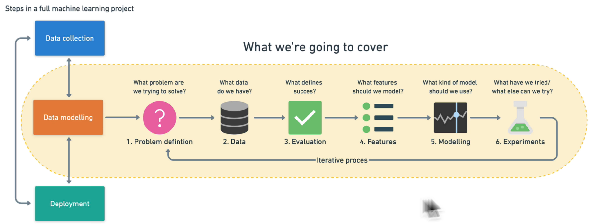

##  Artificial Intelligence Nedir?

Yapay zekâ (AI), bilgisayar sistemlerinin insan benzeri **öğrenme, muhakeme, algılama ve karar verme** yeteneklerini yazılım ve donanım bileşenleri aracılığıyla gerçekleştirmesini amaçlayan disiplinler bütünüdür.  

Klasik yazılım yaklaşımlarında geliştirici, problemi çözmek için gerekli tüm kuralları açıkça tanımlar. Yapay zekâ sistemlerinde ise geliştirici problemi, hedefi ve öğrenme mekanizmasını tanımlar; **çözüm fonksiyonu doğrudan veri üzerinden öğrenilir**.

Modelin görevi, verilen örnek girdi çıktı çiftlerinden yola çıkarak, veri ile beklenen sonuç arasındaki bağıntıyı en iyi şekilde temsil eden fonksiyonu öğrenmektir. Bu süreç sonunda model, daha önce görmediği veriler için de **genelleme yapabilir** hale gelir.

Başka bir ifadeyle; yapay zekâ, insan tarafından manuel olarak yazılması zor veya imkânsız olan kuralları, veriden otomatik olarak türetir.

!!! note "Not"
    Yapay zekâ, tek başına bir ürün değil; doğru problem tanımı, veri yönetimi ve model değerlendirme süreçleriyle birlikte ele alınması gereken uçtan uca bir sistem yaklaşımıdır.

---

## Supervised Learning

- **Tanım:** Denetimli öğrenme, her bir girdinin karşılığında **doğru çıktının (etiketin)** bilindiği veri setleri ile modelin eğitildiği öğrenme türüdür.
- **Amaç:** Modelin, eğitim sırasında gördüğü girdi çıktı ilişkisini öğrenerek, daha önce görmediği girdiler için **doğru tahmin** yapabilmesini sağlamak.

- Eğitim verisi girdi çıktı etiket çiftlerinden oluşur ve şu yapıdadır:  `(x₁, y₁), (x₂, y₂), …, (xₙ, yₙ)` 
- Model, `X → Y` dönüşümünü temsil eden bir fonksiyon öğrenir.
- Tahmin hatası bir kayıp fonksiyonu ile ölçülür ve minimize edilir.
-  **Örnek:** E-posta filtreleme (spam), Görüntü tanıma (Nesne veya sınıf etiketi), Finans(Kredi risk skoru, fiyat tahmini)  

---

## Unsupervised Learning

- **Tanım:** Denetimsiz öğrenme, **etiketlenmemiş** veri setleri üzerinde çalışır. Model, verideki gizli yapıları ve örüntüleri kendi kendine keşfeder.
- **Amaç:** Amacı veriyi anlamlandırmak, benzer örnekleri gruplamak, veri boyutunu azaltmaktır.  
- Çıktı etiketi bulunmaz. Model, veriler arasındaki benzerlikleri veya istatistiksel ilişkileri analiz eder.
- **Temel Yaklaşımlar:** Clustering (K-Means, DBSCAN), Dimensionality Reduction (PCA, t-SNE)
- **Örnek:** Müşteri segmentasyonu, Anomali tespiti, Özellik çıkarımı ve veri görselleştirme

---

## Reinforcement Learning

- **Tanım:** Pekiştirmeli öğrenmede bir **ajan**, bir **ortam** içerisinde ardışık kararlar alır ve aldığı aksiyonların sonucunda ödül veya ceza ile geri beslenir.
- **Amaç:** Uzun vadede **toplam ödülü maksimize eden** bir davranış politikası öğrenmek.
- **Temel Bileşenler:** Durum (State – s), Eylem (Action – a), Ödül (Reward – r), Politika (Policy – π)
- Ajan, ortamın mevcut durumunu gözlemler. Bir eylem seçer. Ortam yeni duruma geçer ve bir ödül üretir.Ajan, bu deneyimden öğrenerek stratejisini günceller.
- **Algoritma Örnekleri** Q-Learning, SARSA, Deep Q-Network (DQN), Policy Gradient, PPO
- **Örnek:** Otonom araçlar, Robot kontrol sistemleri, Oyun oynayan yapay ajanlar (Atari, Go, Satranç)

---

## Hata Bulma Adımları

Bir AI modelinin öğrenme süreci özetle aşağıdaki adımlardan oluşur:

1. **Problem Definition:** What problem are we trying to solve?
2. **Data:** What kind of data do we have?
3. **Evaluation:** What defines success for us?
4. **Features:** What do we already know about the data?
5. **Modelling:** Based on our problem and data, what model should we use? 
6. **Experimentation:** How could we improve/what can we try next?

Bu döngü, model yeterli performansa ulaşana kadar tekrarlanır.

---