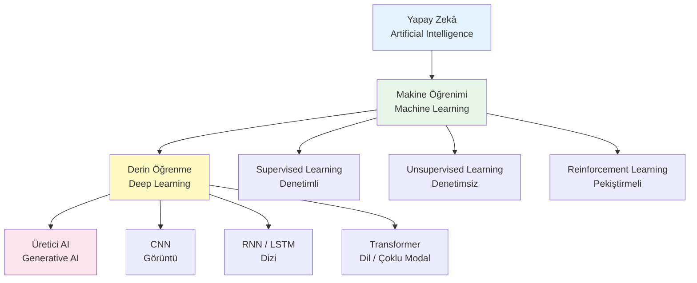
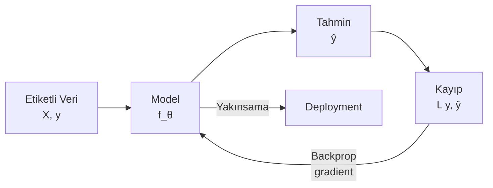
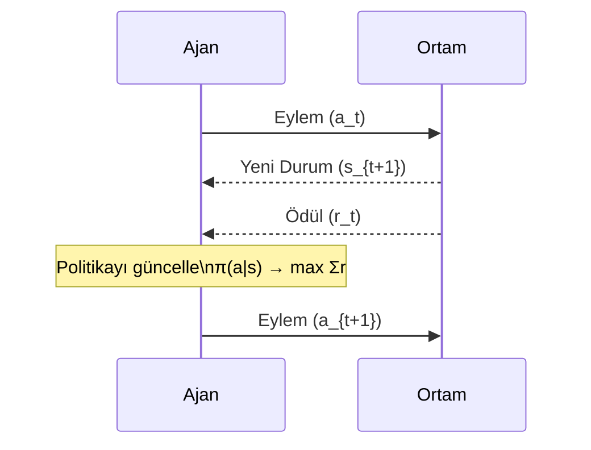
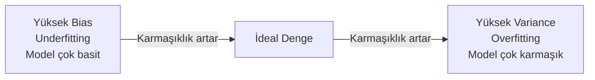
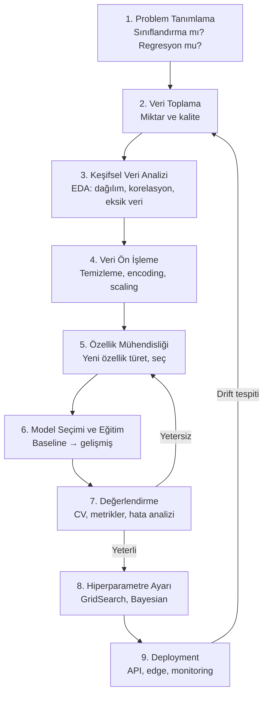

# Yapay Zeka — Temel Kavramlar

!!! note "Genel Bakış"
    Yapay zekâ, bilgisayar sistemlerinin veriden öğrenerek karar verme, sınıflandırma, tahmin ve algılama yetenekleri geliştirmesini sağlayan disiplinler bütünüdür. Klasik yazılımda geliştirici kuralları yazar; AI'da ise geliştirici veriyi ve öğrenme mekanizmasını tanımlar — **kurallar veriden öğrenilir**.



---

## Öğrenme Nedir? — Matematiksel Sezgi

Makine öğrenimi, en soyut anlatımıyla bir **fonksiyon yaklaşım** problemidir. Bilinmeyen gerçek fonksiyon `f*`'ı, elimizdeki veri örneklerinden tahmin etmeye çalışırız.

$$\hat{y} = f_\theta(X)$$

- `X` → Girdiler (özellikler, features)  
- `\theta` → Öğrenilecek parametreler (ağırlıklar)  
- `\hat{y}` → Model tahmini  
- `y` → Gerçek değer (etiket)

**Öğrenme** = `θ`'yı, tahmin hatasını minimize edecek şekilde güncellemek.

$$\theta^* = \arg\min_\theta \mathcal{L}(f_\theta(X), y)$$

| Kavram | Açıklama |
|--------|---------|
| **Parametreler (θ)** | Eğitim sırasında güncellenen değerler (ağırlıklar, biaslar) |
| **Hiperparametreler** | Eğitim öncesi insan tarafından belirlenen değerler (learning rate, epoch, katman sayısı) |
| **Kayıp Fonksiyonu** | Model çıktısı ile gerçek değer arasındaki farkı ölçer |
| **Optimizer** | Kayıpı minimize etmek için θ'yı günceller |
| **Epoch** | Tüm eğitim verisinin bir kez modelden geçirilmesi |
| **Batch** | Her güncelleme adımında kullanılan örnek sayısı |

---

## Supervised Learning (Denetimli Öğrenme)

Her girdi örneğinin bir etiketi (doğru cevabı) vardır. Model, `(X, y)` çiftlerinden `X → y` eşlemesini öğrenir.



=== "Sınıflandırma"

    Çıktı ayrık (kategorik) bir sınıftır.

    | Algoritma | Güçlü Yön | Zayıf Yön |
    |-----------|:---------:|:---------:|
    | Logistic Regression | Yorumlanabilir, hızlı | Doğrusal olmayan ilişki zor |
    | SVM | Yüksek boyutlu veri | Büyük veri setinde yavaş |
    | Decision Tree | Yorumlanabilir | Overfitting'e yatkın |
    | Random Forest | Güçlü, overfitting dirençli | Yorumlanması zor |
    | Gradient Boosting | Genellikle en iyi performans | Yavaş eğitim |
    | Neural Network | Çok karmaşık ilişkiler | Büyük veri, hesaplama gerekir |

    **Metrikler:** Accuracy, Precision, Recall, F1-Score, ROC-AUC

=== "Regresyon"

    Çıktı sürekli (sayısal) bir değerdir.

    | Algoritma | Güçlü Yön | Zayıf Yön |
    |-----------|:---------:|:---------:|
    | Linear Regression | Basit, hızlı | Sadece doğrusal ilişki |
    | Ridge / Lasso | Regularizasyon | Hiperparametre seçimi |
    | SVR | Robust outlier'lara | Kernel seçimi zor |
    | Random Forest Regressor | Non-lineer | Yorumlanması zor |
    | Gradient Boosting | Yüksek performans | Overfitting riski |

    **Metrikler:** MSE, RMSE, MAE, R² (Determination Katsayısı)

---

## Unsupervised Learning (Denetimsiz Öğrenme)

Etiket yoktur. Model, verideki gizli yapıyı, gruplamaları veya yoğunlukları kendi başına keşfeder.


| Yöntem | Kullanım Alanı | Örnek Algoritma |
|--------|:-------------:|:---------------:|
| Clustering | Müşteri segmentasyonu, gen grupları | K-Means, DBSCAN, Hierarchical |
| Dimensionality Reduction | Görselleştirme, özellik çıkarımı | PCA, t-SNE, UMAP |
| Anomaly Detection | Dolandırıcılık, sensör arızası | Isolation Forest, Autoencoder |
| Association Rules | Market sepet analizi | Apriori, FP-Growth |

### K-Means Sezgisi

```python
from sklearn.cluster import KMeans
from sklearn.preprocessing import StandardScaler

X_scaled = StandardScaler().fit_transform(X)
kmeans = KMeans(n_clusters=3, random_state=42, n_init=10)
labels = kmeans.fit_predict(X_scaled)
centers = kmeans.cluster_centers_
```

### PCA Sezgisi

PCA, veriyi en yüksek varyansı koruyan yönlere (principal components) yansıtır. Görselleştirme ve boyut azaltma için kullanılır.

```python
from sklearn.decomposition import PCA
pca = PCA(n_components=2)
X_2d = pca.fit_transform(X_scaled)
print(pca.explained_variance_ratio_)   # Her component'in açıkladığı varyans
```

---

## Reinforcement Learning (Pekiştirmeli Öğrenme)

Ajan, ortamla etkileşerek deneme-yanılma yoluyla öğrenir. Hedef: uzun vadeli toplam ödülü maksimize etmek.



| Bileşen | Açıklama |
|---------|---------|
| **State (s)** | Ortamın mevcut durumu |
| **Action (a)** | Ajanın alabileceği kararlar |
| **Reward (r)** | Eylemin anlık değeri |
| **Policy (π)** | `s → a` eşlemesi; ajanın stratejisi |
| **Value Function V(s)** | Durumun uzun vadeli değeri |
| **Q-Function Q(s,a)** | Durum-eylem çiftinin değeri |

| Algoritma | Yaklaşım | Kullanım |
|-----------|:--------:|---------|
| Q-Learning | Değer tabanlı | Basit ayrık eylem uzayları |
| DQN | Derin Q-Network | Atari oyunları |
| Policy Gradient | Politika tabanlı | Sürekli eylem uzayları |
| PPO | Actor-Critic | Robot kontrolü, oyun AI |
| SAC | Off-policy Actor-Critic | Gerçek dünya robotik |

---

## Bias-Variance Dengesi (Önyargı-Varyans)

Model performansının temel ikilemini anlamak için kritik bir kavramdır.



| | Yüksek Bias | İdeal | Yüksek Variance |
|--|:-----------:|:-----:|:---------------:|
| **Eğitim Hatası** | Yüksek | Düşük | **Çok düşük** |
| **Test Hatası** | Yüksek | Düşük | Yüksek |
| **Durum** | Underfitting | — | Overfitting |
| **Çözüm** | Model karmaşıklığını artır | — | Regularizasyon, daha fazla veri |

### Overfitting'i Önleme

| Yöntem | Açıklama |
|--------|---------|
| **Daha fazla veri** | En etkili yöntem |
| **Cross-Validation** | Gerçek genelleme hatasını ölç |
| **Regularizasyon (L1/L2)** | Ağırlıkları ceza ile sınırla |
| **Dropout** | Nöronları rastgele devre dışı bırak (NN için) |
| **Early Stopping** | Validation kaybı artmaya başlayınca dur |
| **Veri Artırma (Augmentation)** | Mevcut veriyi dönüştürerek çoğalt |
| **Ensemble** | Birden fazla modelin birleşimi |

---

## Kayıp Fonksiyonları

Kayıp fonksiyonu, modelin ne kadar yanlış tahmin ettiğini ölçer. Optimizasyon bu değeri minimize etmeye çalışır.

=== "Regresyon"

    | Kayıp | Formül | Özellik |
    |-------|:------:|---------|
    | **MSE** | `Σ(y - ŷ)² / n` | Büyük hataları penalize eder |
    | **MAE** | `Σ|y - ŷ| / n` | Outlier'lara dayanıklı |
    | **Huber** | MSE küçük, MAE büyük hatada | İkisinin dengesi |
    | **RMSE** | `√MSE` | MSE ile aynı birimde yorumlanır |

=== "Sınıflandırma"

    | Kayıp | Kullanım | Formül (basit) |
    |-------|:--------:|:-------------:|
    | **Binary Cross-Entropy** | 2 sınıf | `-[y·log(ŷ) + (1-y)·log(1-ŷ)]` |
    | **Categorical Cross-Entropy** | Çok sınıf | `-Σ y_i·log(ŷ_i)` |
    | **Hinge Loss** | SVM | `max(0, 1 - y·ŷ)` |
    | **Focal Loss** | Dengesiz sınıflar | BCE'nin ağırlıklı versiyonu |

---

## Model Değerlendirme Metrikleri

### Sınıflandırma — Confusion Matrix

```
                 Tahmin: Pozitif   Tahmin: Negatif
Gerçek: Pozitif  TP (Doğru +)      FN (Kaçırılan)
Gerçek: Negatif  FP (Yanlış Alarm) TN (Doğru -)
```

| Metrik | Formül | Soru |
|--------|:------:|------|
| **Accuracy** | `(TP+TN)/(TP+TN+FP+FN)` | Genel başarı |
| **Precision** | `TP/(TP+FP)` | Pozitif tahminlerin ne kadarı doğru? |
| **Recall (Sensitivity)** | `TP/(TP+FN)` | Gerçek pozitiflerin kaçı bulundu? |
| **F1-Score** | `2·P·R/(P+R)` | Precision-Recall harmonik ortalaması |
| **Specificity** | `TN/(TN+FP)` | Gerçek negatiflerin yakalanma oranı |

!!! tip "Hangisi ne zaman önemli?"
    - **Spam filtresi:** Precision (yanlış spam yakalamak önemli değil, meşru mail kaybetmek önemli)
    - **Hastalık tespiti:** Recall (hiç hasta kaçırmamak kritik; yanlış alarm tolere edilebilir)
    - **Genel denge:** F1-Score

### ROC-AUC

ROC eğrisi, farklı karar eşiklerinde `Recall (TPR)` vs `FPR` oranını gösterir.

| AUC Değeri | Yorum |
|:----------:|-------|
| 1.0 | Mükemmel sınıflandırıcı |
| 0.9–0.99 | Çok iyi |
| 0.7–0.89 | İyi |
| 0.5 | Rastgele tahmin (hiçbir değer yok) |
| < 0.5 | Modelde sorun var |

### Regresyon Metrikleri

| Metrik | Yorum |
|--------|-------|
| **R² (0–1)** | 1'e yakın: iyi uyum. Negatif: modelden kötü |
| **RMSE** | Hata birimi veri ile aynı; büyük hatalara duyarlı |
| **MAE** | Daha sezgisel; outlier'a dayanıklı |
| **MAPE** | Yüzde hata; farklı ölçekli veri karşılaştırması |

---

## Gradyan İniş (Gradient Descent)

Kayıp fonksiyonunu minimize etmek için parametreleri gradyanın tersi yönünde günceller.

$$\theta \leftarrow \theta - \alpha \cdot \nabla_\theta \mathcal{L}$$

- `α` = Learning rate (öğrenme hızı)
- `∇L` = Kayıpın gradyanı

| Varyant | Batch Boyutu | Özellik |
|---------|:------------:|--------|
| **Batch GD** | Tüm veri | Yavaş ama kararlı |
| **Stochastic GD (SGD)** | 1 örnek | Hızlı ama gürültülü |
| **Mini-batch GD** | 32–512 | **En yaygın kullanılan** |

### Optimizer Karşılaştırması

| Optimizer | Açıklama | Ne zaman kullan |
|-----------|---------|:---------------:|
| **SGD** | Saf gradyan iniş | Temel baseline |
| **SGD + Momentum** | Geçmiş gradyanları biriktirir | Derin ağlar |
| **RMSprop** | Uyarlanır learning rate | RNN |
| **Adam** | Momentum + RMSprop | **Genel default** |
| **AdamW** | Adam + weight decay | Transformer |

```python
# PyTorch optimizer örnekleri
optimizer = torch.optim.Adam(model.parameters(), lr=1e-3, weight_decay=1e-4)
optimizer = torch.optim.SGD(model.parameters(), lr=0.01, momentum=0.9)
```

---

## Regularizasyon

### L1 (Lasso)

$$\mathcal{L}_{L1} = \mathcal{L} + \lambda \sum |\theta_i|$$

- Gereksiz özelliklerin ağırlığını **tam olarak sıfırlar** (sparse model)
- Özellik seçimi için kullanılır

### L2 (Ridge)

$$\mathcal{L}_{L2} = \mathcal{L} + \lambda \sum \theta_i^2$$

- Ağırlıkları küçültür ama sıfırlamaz
- Genellikle L1'den daha iyi genelleme sağlar

```python
from sklearn.linear_model import Ridge, Lasso, ElasticNet

ridge = Ridge(alpha=1.0)         # L2
lasso = Lasso(alpha=0.1)         # L1
elastic = ElasticNet(alpha=0.1, l1_ratio=0.5)  # L1 + L2
```

---

## AI/ML Proje Akışı


