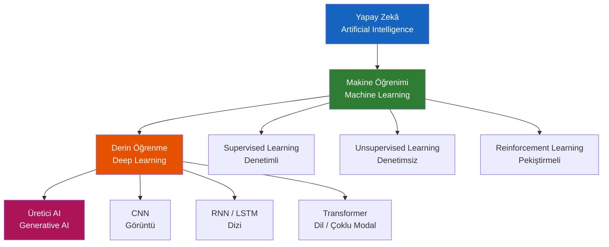
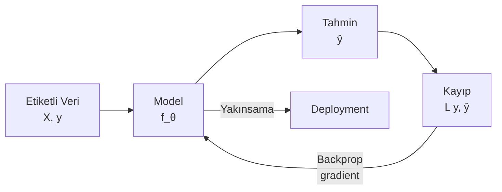
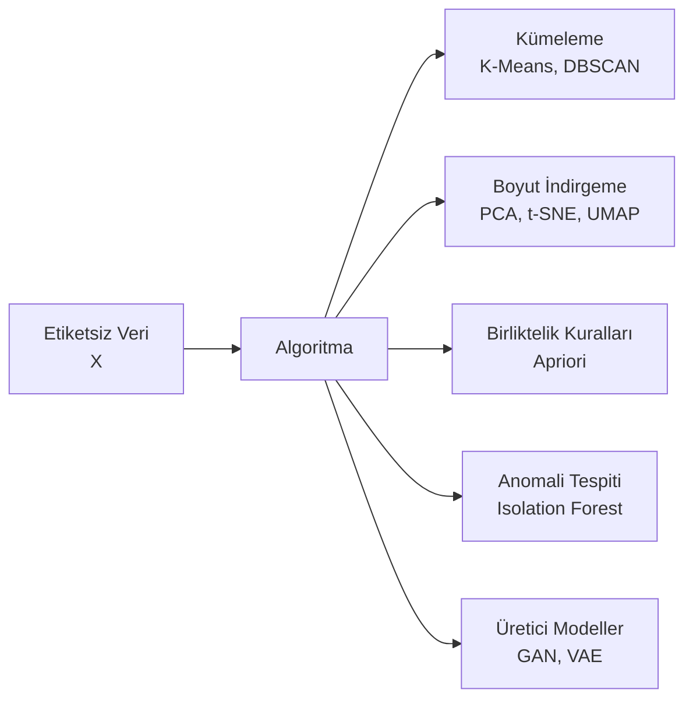
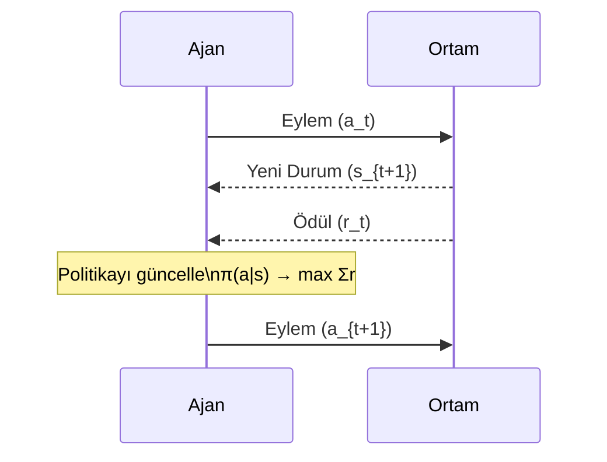
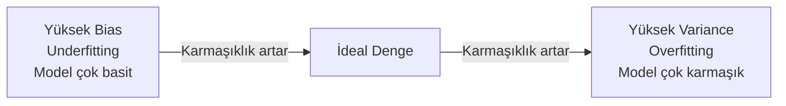
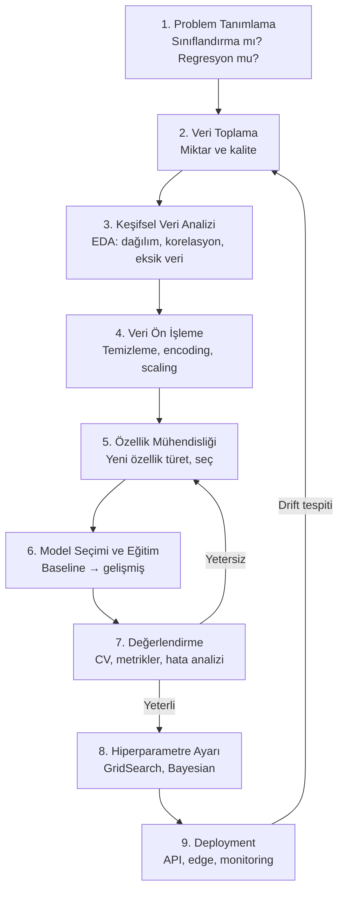

# Yapay Zeka — Temel Kavramlar

!!! note "Genel Bakış"
    Yapay zekâ, bilgisayarların veriden öğrenerek karar vermesini, örüntü tanımasını ve tahmin yapmasını sağlayan disiplinler bütünüdür. Klasik yazılımda geliştirici kuralları elle yazar; AI'da ise geliştirici sisteme örnekler gösterir ve sistem kuralları kendisi öğrenir. Bu sayfa, yapay zekanın temel taşlarını sıfırdan açıklamaktadır.



---

## Yapay Zeka Nedir? — Sezgisel Açıklama

Bir çocuğa "kedi" ile "köpeği" nasıl ayırt etmeyi öğretirsiniz? Yüzlerce farklı kedi ve köpek gösterirsiniz; bir süre sonra çocuk hiç görmediği hayvanları da doğru sınıflandırabilir hale gelir. İşte makine öğrenimi tam olarak budur: sisteme çok sayıda örnek göstererek genel bir kural çıkarmasını sağlamak.

**Klasik programlama ile farkı:**

| | Klasik Programlama | Makine Öğrenimi |
|--|:-:|:-:|
| **Girdi** | Kurallar + Veri | Veri + Doğru Cevaplar |
| **Çıktı** | Cevaplar | Kurallar (Model) |
| **Kim karar verir?** | Geliştirici | Sistem |
| **Ne zaman kullanılır?** | Kural yazılabilir problemler | Kural çok karmaşık veya bilinmiyor |

**Neden son yıllarda bu kadar güçlendi?** Üç şey bir araya geldi: *büyük veri* (internet, sensörler), *güçlü donanım* (GPU'lar) ve *gelişmiş algoritmalar* (derin öğrenme). Bu üçlü birlikte AI devrimini mümkün kıldı.

---

## Öğrenme Nedir? — Matematiksel Sezgi

Makine öğrenimi, en temel anlatımıyla bir **fonksiyon yaklaşım** problemidir. Elimizde bazı giriş verileri (**X**) ve bunlara karşılık gelen doğru cevaplar (**y**) var. Amacımız, X'i alıp y'yi üretebilecek en iyi fonksiyonu bulmak.

$$\hat{y} = f_\theta(X)$$

- **X** → Girdi verileri (özellikler). Örneğin bir evin metrekaresi, oda sayısı, konumu.
- $\theta$ → Modelin öğrendiği parametreler (ağırlıklar). Başlangıçta rastgele belirlenir, eğitimle güncellenir.
- **$\hat{y}$** → Modelin tahmini. Örneğin evin tahmini fiyatı.
- **y** → Gerçek değer. Evin gerçek satış fiyatı.

**Öğrenme** şu demektir: $\theta$'yı, tahmin ($\hat{y}$) ile gerçek değer ($y$) arasındaki fark en küçük olacak şekilde bulmak.

$$\theta^* = \arg\min_\theta \mathcal{L}(f_\theta(X), y)$$

Bu formül "öyle bir θ bul ki, kayıp fonksiyonu en küçük olsun" demektir. Kayıp fonksiyonu, modelin ne kadar yanıldığını ölçen bir cetveldir.

| Kavram | Gerçek Hayat Karşılığı |
|--------|----------------------|
| **Parametreler (θ)** | Eğitim sırasında otomatik güncellenen değerler — modelin "öğrendiği" şeyler |
| **Hiperparametreler** | Eğitim başlamadan siz belirliyorsunuz (kaç katman? ne hızla öğrensin?) |
| **Kayıp Fonksiyonu** | Modelin karne notu — ne kadar düşük, o kadar iyi |
| **Optimizer** | Kayıp notunu düşürmek için parametreleri güncelleyen mekanizma |
| **Epoch** | Tüm eğitim verisinin bir kez modelden geçirilmesi |
| **Batch** | Her güncelleme adımında kullanılan örnek sayısı |

---

## Supervised Learning (Denetimli Öğrenme)

Her girdi örneğinin bir etiketi (doğru cevabı) vardır. Model bu etiketlerden öğrenir.

**Gerçek hayat analojisi:** Sınav sorularını cevap anahtarıyla birlikte çalışmak. Model cevap anahtarına bakarak kendi yanıtlarının ne kadar yanlış olduğunu görür ve kendini düzeltir. Cevap anahtarı yoksa — yani etiket yoksa — supervised learning mümkün değildir.



### Sınıflandırma (Classification)

Çıktı ayrık bir kategoriden biri olduğunda sınıflandırma yapılır. "Bu e-posta spam mı?", "Fotoğraftaki hayvan ne?", "Tümör iyi huylu mu kötü huylu mu?"

Sınıflandırmada model, her kategori için bir olasılık hesaplar. En yüksek olasılıklı kategori tahmin olarak seçilir.

**İkili sınıflandırma (Binary):** Sadece iki seçenek — spam/ham, hasta/sağlıklı, geçti/kaldı.

**Çok sınıflı (Multiclass):** Birden fazla seçenek — hangi rakam (0–9), hangi hayvan, hangi dil.

**Çok etiketli (Multilabel):** Bir örnek birden fazla etikete sahip olabilir — bir haberin hem "ekonomi" hem "siyaset" olması gibi.

**Önemli algoritmalar ve kullanım alanları:**

| Algoritma | Ne Zaman Seç | Neden |
|-----------|:------------:|-------|
| **Lojistik Regresyon** | Hızlı başlangıç, açıklanabilirlik gerekli | Sonuçları yorumlamak kolay; sağlık/finans gibi regüle alanlarda |
| **Karar Ağaçları** | Kurallar görünür olsun | "Eğer şuysa, buysa" mantığı — insan gibi karar verir |
| **Random Forest** | Genel amaç, güvenilir | Yüzlerce ağacın oylaması — tek ağacın hatalarını siler |
| **Gradient Boosting / XGBoost** | Maksimum performans | Hatalara odaklanarak kendini düzelten sistemli yaklaşım |
| **SVM** | Yüksek boyutlu veri, az örnek | Az örnekle dahi iyi çalışır; metin sınıflandırmada klasik |
| **Sinir Ağları** | Görüntü, ses, metin | Ham veriden otomatik özellik çıkarımı; en esnek |

**Sınıflandırma metrikleri:** Accuracy (genel doğruluk), Precision (yanlış alarm azalt), Recall (hiç kaçırma), F1-Score (ikisinin dengesi), ROC-AUC.

### Regresyon (Regression)

Çıktı sürekli sayısal bir değer olduğunda regresyon kullanılır. "Bu evin fiyatı ne olur?", "Yarın kaç ürün satılır?", "Hasta kaç gün sonra iyileşir?"

Regresyon aslında sınıflandırmanın sayısal versiyonudur: kategoriler yerine gerçek sayılar tahmin edilir. Kullanılan algoritmalar çoğunlukla aynı — çıktı katmanı ve kayıp fonksiyonu değişir.

**Regresyon metrikleri:**

| Metrik | Ne Ölçer | Ne Zaman Önemli |
|--------|---------|:--------------:|
| **MAE** | Ortalama mutlak hata — sonuçla aynı birimde, sezgisel | Her zaman iyi bir başlangıç metrigi |
| **RMSE** | Büyük hataları orantısız cezalandırır | Büyük hatalar kabul edilemezse |
| **R²** | Modelin varyansın ne kadarını açıkladığı (0–1) | Karşılaştırma ve genel iyilik ölçümü |
| **MAPE** | Yüzde cinsinden hata | Farklı ölçekli değerler karşılaştırılırken |

!!! tip "R² Yorumu"
    R² = 0.85 → "Model, hedef değişkendeki değişkenliğin %85'ini açıklıyor." 1.0 mükemmel, 0.0 rastgele tahmin kadar iyi. Negatif değer, modelin veriyi hiç öğrenemediği anlamına gelir.

---

## Unsupervised Learning (Denetimsiz Öğrenme)

Etiket yoktur. Model, verideki gizli yapıyı, gruplamaları veya örüntüleri kendi başına keşfeder.

**Gerçek hayat analojisi:** Cevap anahtarı olmadan yüzlerce şehri haritaya bakarak coğrafi bölgelere ayırmak. Sistem benzerlikleri ve farklılıkları kendisi bulur. Kimse "bu şehirler aynı bölgede" demez; coğrafi koordinatlardan bölgeler çıkarılır.



### Kümeleme (Clustering)

Benzer örnekleri gruplara ayırır. Müşteri segmentasyonu, gen ekspresyon analizi, belge gruplama, sosyal ağ toplulukları.

**K-Means nasıl çalışır?**

1. K adet rastgele merkez belirle (K: grup sayısı, sizin seçtiğiniz)
2. Her noktayı en yakın merkeze ata
3. Her grubun yeni merkezini, o grubun üyelerinin ortalaması olarak hesapla
4. Merkez değişmeyene kadar 2–3. adımları tekrar et

**K sayısını nasıl seçersiniz?** "Elbow yöntemi": farklı K değerleri için toplam iç varyansı çizin. Eğrinin "dirsek" yaptığı nokta optimal K'dır. Silhouette skoru da kullanılır: 1'e yakın iyi, 0'a yakın kötü, negatif anlamsız küme.

**K-Means'in sınırları:** Küre şeklinde olmayan kümeleri (ay şeklinde, sarmal gibi) bulamaz. Gürültü noktalarına duyarlıdır. K'yı önceden belirtmek gerekir.

**DBSCAN farkı:** Yoğunluk tabanlı çalışır. K sayısı belirtmek gerekmez. Keyfi şekilli kümeler bulabilir. Gürültü noktaları "outlier" olarak işaretlenir — coğrafi kümelemede, anomali tespitinde güçlü.

### Boyut İndirgeme (Dimensionality Reduction)

Yüzlerce veya binlerce özelliği daha az sayıda boyuta indirerek veriyi anlaşılır hale getirir. İki temel hedef: görselleştirme ve gereksiz bilgiyi atmak.

**PCA (Temel Bileşen Analizi):**

Veriyi en fazla "bilgiyi" taşıyan yönlere yansıtır. Matematiksel olarak kovaryans matrisinin özvektörlerini bulur — bunlar verideki en yüksek varyansa sahip yönlerdir.

Örnek: 50 finansal gösterge yerine 2 temel bileşen yeterli olabilir. Bu iki bileşen orijinal 50 değişkendeki bilginin %80'ini taşıyorsa kalan %20'yi atmak kabul edilebilir.

**t-SNE ve UMAP:**

PCA küresel yapıyı korurken yerel yapıyı kaybedebilir. t-SNE ve UMAP ise kümelerin iç yapısını koruyarak yüksek boyutlu veriyi 2D/3D'ye yansıtır — görselleştirme için idealdir.

t-SNE her çalıştırmada farklı sonuç verebilir (rastgele başlatma). UMAP daha hızlı ve tekrarlanabilirdir; büyük veri setleri için tercih edilir.

### Anomali Tespiti

Normal olmayan örnekleri tespit eder: kredi kartı dolandırıcılığı, üretim hataları, sensör arızaları, siber saldırılar, tıbbi olağandışılıklar.

Temel fikir: "normal" veri üzerinde öğrenen bir model oluştur; modele uymayan örnekler anomalidir.

**Isolation Forest:** Rastgele bölerek (random splitting) bir noktayı izole etmenin ne kadar kolay olduğunu ölçer. Anomaliler az olduğu için kalabalıktan uzak durur — daha az bölme ile izole edilir. Bu "kısa yol" anomali skorunu verir.

---

## Reinforcement Learning (Pekiştirmeli Öğrenme)

Ajan, ortamla etkileşerek deneme-yanılma yoluyla öğrenir. Kimse "ne yap" demez; ajan sadece yaptığı eylemlerin sonucunda ödül veya ceza alır ve neyin daha iyi sonuç verdiğini kendi başına keşfeder.

**Gerçek hayat analojisi:** Bir çocuğun bisiklet sürmeyi öğrenmesi. Düşünce acı (ceza), düzgün sürünce sevinç (ödül) alır. Zamanla hangi hareketlerin dengeli sürüşe yol açtığını öğrenir. Kimse ona "şimdi sol ayağını 30 derece bas" demez.



| Bileşen | Açıklama | Örnek |
|---------|---------|-------|
| **Durum (s)** | Ortamın mevcut fotoğrafı | Satranç tahtasının anlık konumu |
| **Eylem (a)** | Ajanın yapabileceği seçenekler | Satranç taşını hangi kareye taşımak |
| **Ödül (r)** | Eylemin anlık değerlendirmesi | +1 rakip taş yenilince, -1 taş kaybedince |
| **Politika (π)** | Duruma karşılık eylem seçme stratejisi | "Bu konumda şu taşı taşı" kuralı |
| **Değer Fonksiyonu V(s)** | Bir durumun uzun vadeli beklenen ödülü | "Bu satranç pozisyonu kazanmama ne kadar yardımcı?" |
| **Q-Fonksiyonu Q(s,a)** | Belirli bir eylem-durum çiftinin değeri | "Bu taşı şu kareye taşımanın uzun vadeli getirisi" |

**Keşif-Sömürü Dengesi (Exploration-Exploitation):** Ajan her zaman en iyi bildiği eylemi mi seçmeli, yoksa yeni şeyler mi denemeli? Sadece bilinen en iyiyi seçmek (sömürü) daha iyi bir stratejinin keşfedilmesini engeller. Sadece keşif yapmak verimsizdir. ε-greedy: %ε olasılıkla rastgele, %1-ε olasılıkla en iyi bilinen eylemi seç.

**Kullanım alanları:** Oyun oynayan AI (AlphaGo, OpenAI Five), robot kontrolü ve yürüyüşü, otonom araçlar, öneri sistemleri, enerji yönetimi, trafik ışığı optimizasyonu.

---

## Bias-Variance Dengesi (Önyargı-Varyans)

Bu kavram, modelin neden bazen iyi öğrenemediğini (underfitting) ya da eğitim verisini ezberleyip yeni veriye genelleyemediğini (overfitting) açıklar.



### Underfitting (Yüksek Bias)

Model çok basit — eğitim verisini bile iyi öğrenemez. Binlerce farklı konum ve büyüklükteki evin fiyatını tahmin etmek için tek bir düz çizgi yeterli değildir. Model gerçekliğin karmaşıklığını yakalayamaz.

**Belirtiler:** Hem eğitim hem test hatası yüksek.

**Çözüm:** Daha karmaşık model (daha derin ağ, daha fazla özellik), daha uzun eğitim.

### Overfitting (Yüksek Variance)

Model çok karmaşık — eğitim verisindeki gürültüyü bile ezberler, yeni veriye çıkarım yapamaz. Birkaç eğitim örneğini tamamen ezberlemiş bir öğrenci gibi; ezberin dışında bir soru gelince şaşırır.

**Belirtiler:** Eğitim hatası çok düşük, test hatası yüksek. Bu iki değer arasındaki fark büyüdükçe overfitting derinleşir.

**Çözüm:** Regularizasyon, daha fazla veri, dropout, early stopping.

| | Yüksek Bias | İdeal | Yüksek Variance |
|--|:-----------:|:-----:|:---------------:|
| **Eğitim Hatası** | Yüksek | Düşük | Çok düşük |
| **Test Hatası** | Yüksek | Düşük | Yüksek |
| **Durum** | Underfitting | — | Overfitting |

### Overfitting'i Önleme Yöntemleri

| Yöntem | Nasıl Çalışır |
|--------|--------------|
| **Daha fazla veri** | Model ezberleyemeyecek kadar çok örnek görür; genelleme zorunlu hale gelir. En etkili yöntem. |
| **Cross-Validation** | Veriyi parçalara böl, farklı parçaları test seti olarak kullan; gerçek genelleme hatasını ölç. |
| **Regularizasyon (L1/L2)** | Ağırlıkları büyümesini cezalandırır; model basit kalmaya zorlanır. |
| **Dropout (Sinir Ağları)** | Eğitim sırasında rastgele nöronları devre dışı bırakır; her nörona körü körüne güvenilemez. |
| **Early Stopping** | Doğrulama hatası artmaya başlayınca eğitimi durdur. |
| **Veri Artırma** | Mevcut veriyi döndürerek, kırparak, renk değiştirerek çoğalt. |
| **Ensemble** | Birden fazla modelin tahminlerini birleştir — hatalar kısmen birbirini siler. |

---

## Kayıp Fonksiyonları

Kayıp fonksiyonu, modelin ne kadar yanlış tahmin ettiğini sayısal olarak ölçer. Eğitim bu değeri minimize etmeye çalışır.

**Sezgi:** Kayıp fonksiyonu bir dağın yüksekliği gibidir. Eğitim, bu dağda aşağı yürümeye benzer — her adımda biraz daha alçağa iner. Hangi fonksiyonu kullandığınız, dağın şeklini belirler.

=== "Regresyon Kayıpları"

    | Kayıp | Ne Ölçer | Ne Zaman Kullan |
    |-------|---------|:---------------:|
    | **MSE** (Ortalama Kare Hata) | Hataların karesinin ortalaması — büyük hatalar orantısız cezalandırılır | Büyük hatalar kabul edilemezse |
    | **MAE** (Ortalama Mutlak Hata) | Hataların mutlak değerinin ortalaması — daha sağlam | Aykırı değerler varsa, dengeli ceza istiyorsanız |
    | **Huber** | Küçük hatalarda MSE, büyük hatalarda MAE davranışı | İkisinin dengesi istendiğinde |
    | **RMSE** | MSE'nin karekökü — veriyle aynı birimde, yorumlanabilir | Yorumlanabilirlik önemli olduğunda |

=== "Sınıflandırma Kayıpları"

    | Kayıp | Ne Zaman Kullan |
    |-------|:---------------:|
    | **Binary Cross-Entropy** | İki sınıf: spam/ham, hasta/sağlıklı |
    | **Categorical Cross-Entropy** | Çok sınıf: rakam tanıma, dil tespiti |
    | **Hinge Loss** | SVM'e özgü; "yeterince güvenli sınıflandır" demek |
    | **Focal Loss** | Dengesiz sınıflarda az görülen sınıfa daha fazla ağırlık ver |

---

## Model Değerlendirme Metrikleri

### Sınıflandırma — Karmaşıklık Matrisi (Confusion Matrix)

Model her tahmininde ya doğru ya da yanlış yapar. Dört durum vardır:

```
                 Tahmin: Pozitif   Tahmin: Negatif
Gerçek: Pozitif  TP (Doğru +)      FN (Kaçırılan)
Gerçek: Negatif  FP (Yanlış Alarm) TN (Doğru -)
```

- **TP (True Positive):** Hasta olan, hasta dendi. ✓
- **TN (True Negative):** Sağlıklı olan, sağlıklı dendi. ✓
- **FP (False Positive — Tip I Hata):** Sağlıklı olan, hasta dendi. Gereksiz tedavi.
- **FN (False Negative — Tip II Hata):** Hasta olan, sağlıklı dendi. Tehlikeli: hastalık atlandı.

| Metrik | Formül | Soru | Kritik Olduğu Yer |
|--------|:------:|------|:-----------------:|
| **Accuracy** | (TP+TN) / Toplam | "Genel olarak ne kadar doğruyum?" | Dengeli sınıflar |
| **Precision** | TP / (TP+FP) | "Pozitif dediğimin kaçı gerçekten pozitif?" | Yanlış alarm pahalıysa (spam filtresi) |
| **Recall** | TP / (TP+FN) | "Gerçek pozitiflerin kaçını buldum?" | Kaçırma tehlikeliyse (hastalık tespiti) |
| **F1-Score** | 2·P·R / (P+R) | "Precision ve Recall'un harmonik ortalaması" | İkisi de önemliyse |
| **Specificity** | TN / (TN+FP) | "Gerçek negatiflerin kaçını doğru sınıfladım?" | Yanlış alarm kritikse |

!!! warning "Dengesiz Sınıf Tuzağı"
    %99 negatif olan bir veri setinde her şeye "negatif" desen Accuracy %99 çıkar ama model hiçbir şey öğrenmemiştir. Dengesiz veri setlerinde Accuracy yanıltıcıdır; F1-Score, ROC-AUC veya Precision-Recall kullanın.

!!! tip "Hangisi ne zaman önemli?"
    - **Spam filtresi:** Precision kritik. Meşru bir maili spam sayarsan kullanıcı kızar.
    - **Kanser tespiti:** Recall kritik. Hasta birini "sağlıklı" dersen ölümcül olabilir.
    - **Genel denge:** F1-Score her ikisini de dikkate alır.

### ROC Eğrisi ve AUC

ROC (Receiver Operating Characteristic) eğrisi, farklı karar eşiklerinde modelin **Recall (TPR)** ile **Yanlış Pozitif Oranı (FPR)** arasındaki dengeyi gösterir.

**Eşik (Threshold) nedir?** Model olasılık üretir — "bu e-posta %73 spam." Varsayılan olarak 0.5 eşiği kullanılır, ama bunu değiştirebilirsiniz. Eşiği düşürürseniz daha fazla spam yakalarsınız (Recall artar) ama meşru mailler de spam sayılabilir (FPR artar). ROC eğrisi tüm eşikler için bu dengeyi gösterir.

**AUC (Eğri Altı Alan):** Modelin rastgele seçimden ne kadar iyi olduğunun tek sayılık özeti.

| AUC Değeri | Yorum |
|:----------:|-------|
| **1.0** | Mükemmel sınıflandırıcı — gerçek dünyada şüphe uyandırır |
| **0.9–0.99** | Çok iyi |
| **0.7–0.89** | Kullanılabilir, iyileştirme gerekli |
| **0.5** | Rastgele tahmin — modelin hiçbir değeri yok |
| **< 0.5** | Etiketler ters çevrilmiş olabilir |

### Regresyon Metrikleri

| Metrik | Yorum |
|--------|-------|
| **R² (0–1)** | 1'e yakın: model veriyi iyi açıklıyor. 0: rastgele kadar iyi. Negatif: modelinizde ciddi sorun var |
| **RMSE** | Hata birimi veri ile aynı; büyük hatalara duyarlı |
| **MAE** | Daha sezgisel; outlier'a dayanıklı |
| **MAPE** | Yüzde hata; farklı ölçekli veri karşılaştırması için |

---

## Gradyan İniş (Gradient Descent)

Model nasıl öğrenir? Kayıp fonksiyonunu azaltmak için parametreleri adım adım günceller. Gradyan iniş bu güncellemenin matematiksel mekanizmasıdır.

$$\theta \leftarrow \theta - \alpha \cdot \nabla_\theta \mathcal{L}$$

**Sezgi:** Sisli bir dağda gözleri kapalı aşağı inmek istiyorsunuz. Ayağınızın altındaki eğimi hissedip (gradyan), o eğimin tam ters yönüne bir adım atıyorsunuz. Yeterli adım sonunda en düşük noktaya (minimum kayıp) ulaşırsınız.

- **α (Learning Rate):** Her adımın büyüklüğü. Çok büyük olursa minimum etrafında zıplar, yaklaşamaz. Çok küçük olursa milyonlarca adım atar — çok yavaş öğrenir.
- **∇L (Gradyan):** Kayıp fonksiyonunun her parametreye göre hangi yönde ne kadar değiştiği.

| Varyant | Nasıl Çalışır | Avantaj | Dezavantaj |
|---------|:------------:|---------|:----------:|
| **Batch GD** | Tüm veriyle güncelle | Kararlı, tutarlı | Büyük veride çok yavaş |
| **Stochastic GD** | Her örnekle ayrı ayrı güncelle | Çok hızlı | Gürültülü, kararsız |
| **Mini-batch GD** | Küçük gruplarla güncelle | İkisinin dengesi | **Pratikte en yaygın** |

**Popüler optimizerlar:**

| Optimizer | Özelliği | Ne Zaman |
|-----------|---------|:--------:|
| **SGD + Momentum** | Geçmiş gradyanları biriktirir; sarkacın ivmesi gibi | Derin sinir ağları |
| **RMSprop** | Her parametreye uyarlanır learning rate | RNN, zaman serileri |
| **Adam** | Momentum + RMSprop kombinasyonu | **Genel varsayılan** |
| **AdamW** | Adam + weight decay (L2 regularizasyon) | Transformer modelleri |

**Learning rate schedule:** Eğitim boyunca sabit learning rate yerine, başta büyük sonra küçülecek şekilde ayarlamak genellikle daha iyi sonuç verir. Warmup (başta yavaş başla), cosine annealing (kosinüs eğrisiyle azalt) yaygın stratejilerdir.

---

## Regularizasyon

Modelin gereğinden fazla karmaşıklaşmasını — dolayısıyla overfitting'i — önleyen tekniklerdir.

### L1 Regularizasyon (Lasso)

$$\mathcal{L}_{L1} = \mathcal{L} + \lambda \sum |\theta_i|$$

Ağırlıkların mutlak değerini kayıp fonksiyonuna ekler. Bu ceza nedeniyle birçok ağırlık tam olarak **sıfıra** iner — model doğal olarak özellik seçimi yapar. Sadece önemli özellikler hayatta kalır; geri kalanlar sıfırla susturulur.

**Sezgi:** "Gereksiz şeyleri tut" yerine "gereksizleri at" der. Sparse (seyrek) model üretir.

**Kullanım:** Binlerce özellik var ama bunların çoğunun anlamsız olduğunu düşünüyorsanız.

### L2 Regularizasyon (Ridge)

$$\mathcal{L}_{L2} = \mathcal{L} + \lambda \sum \theta_i^2$$

Ağırlıkların karesini ekler. Sonuç: tüm ağırlıklar küçülür ama hiçbiri tam sıfıra inmez. Modeli "mütevazı kalmaya" zorlar — hiçbir özelliğe aşırı güvenmez.

**Sezgi:** "Kimseye körü körüne güvenme, herkesi biraz hesaba kat" der.

**Kullanım:** Tüm özellikler muhtemelen bir miktar katkı sağlıyor ama aşırı büyük ağırlıkları sınırlamak istiyorsanız.

**λ (lambda):** Regularizasyon kuvveti. Büyük λ → güçlü ceza → daha basit model → underfitting riski. Küçük λ → hafif ceza → daha karmaşık model → overfitting riski. İdeal değer cross-validation ile bulunur.

**ElasticNet:** L1 ve L2'nin karışımı. İkisinin avantajlarını birleştirir: hem bazı ağırlıkları sıfırlar (L1), hem de kalan ağırlıkları küçüler (L2).

---

## AI/ML Proje Akışı


