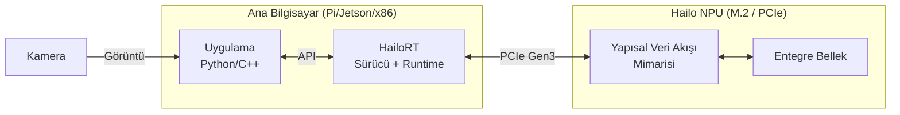
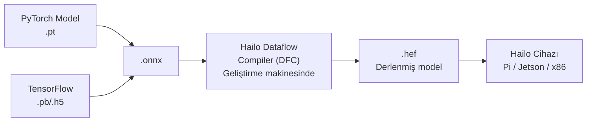

# Hailo — Kenar AI Hızlandırıcı

!!! note "Bu Sayfa Ne Anlatıyor?"
    Hailo'yu hiç duymamış biri için sıfırdan açıklar. Hailo'nun ne olduğunu, nasıl çalıştığını, modelini nasıl deploy edeceğini ve Python/C++ ile nasıl kullanacağını anlatır. Raspberry Pi + AI HAT+ ve Jetson senaryolarını kapsar.

---

## Hailo Nedir?

Hailo, yapay zeka işlemlerini **CPU yerine özel donanımda** çalıştıran bir NPU (Neural Processing Unit) üreticisidir.

**Neden Hailo?**

```
Normal akış (CPU/GPU olmadan):
Kamera → CPU → Nesne tespiti → Sonuç
CPU: 30-50 ms / görüntü, 150W güç

Hailo ile:
Kamera → CPU → Hailo NPU → Sonuç
Hailo: 1-3 ms / görüntü, 2.5W güç

Tasarruf: 10-15× daha hızlı, 60× daha az güç tüketimi
```

### Hailo Ürün Ailesi

| Çip | TOPS | Güç | Tipik Kullanım |
|-----|:----:|:---:|----------------|
| Hailo-8L | 13 TOPS | ~1.5W | Raspberry Pi AI HAT+ |
| Hailo-8  | 26 TOPS | ~2.5W | Genel kenar AI |
| Hailo-10H | 40 TOPS (INT4) | ~2.5W | LLM, üretken AI |

**TOPS = Tera Operations Per Second** — saniyede yapılabilen işlem sayısı (çarpma+toplama).

---

## Sistem Mimarisi



**Anahtar nokta**: CPU modeli hesaplamaz — sadece Hailo'ya veri gönderir ve sonucu alır.

---

## Kurulum Doğrulama

```bash
# Hailo paketleri kurulu mu?
dpkg -l | grep -i hailo

# Cihaz tanındı mı?
ls /dev/hailo*
# Beklenen: /dev/hailo0

# Kernel sürücüsü yüklendi mi?
sudo dmesg | grep -i hailo
# Beklenen: "NNC Firmware loaded successfully"

# PCIe üzerinde görünüyor mu?
lspci | grep Hailo
# Beklenen: "Co-processor: Hailo Technologies Ltd. Hailo-8"

# Cihaz kimliği ve firmware
hailortcli fw-control identify
```

---

## HEF — Hailo'nun Model Formatı

Hailo, PyTorch/ONNX modelini doğrudan çalıştıramaz. Modelin önce **HEF (Hailo Executable Format)** dosyasına derlenmesi gerekir.



!!! info "Önemli"
    - DFC genellikle **x86 Linux masaüstü/sunucuda** çalıştırılır
    - Oluşturulan `.hef` dosyası kenar cihaza kopyalanır
    - HEF dosyaları **mimariye özel**: Hailo-8L HEF, Hailo-8'de çalışmaz

### Hazır HEF Dosyaları (Model Zoo)

Kendi modelini derlemeden önce Hailo'nun hazır modellerini kullanabilirsin:

```bash
git clone https://github.com/hailo-ai/hailo_model_zoo

# Mevcut modelleri gör
python hailo_model_zoo/main.py info hailo8l

# YOLOv8n için hazır HEF indir
# Hailo Developer Zone → Model Zoo → Download
```

---

## Dataflow Compiler — Model Derleme

```bash
# DFC kurulumu (x86 Linux'ta)
pip install hailo-dataflow-compiler

# Lisans gerektirir → Developer Zone'dan al
```

```python title="model_derleme.py"
from hailo_sdk_client import ClientRunner
import numpy as np
from PIL import Image
import os

# ──────────────────────────────────────────
# 1. Runner oluştur (hedef mimari seç)
# ──────────────────────────────────────────
runner = ClientRunner(hw_arch="hailo8l")   # veya "hailo8", "hailo10h"

# ──────────────────────────────────────────
# 2. ONNX modelini yükle
# ──────────────────────────────────────────
runner.load_onnx_model("yolov8n.onnx",
                        net_input_format="UINT8",
                        output_layers=["output0"])

# ──────────────────────────────────────────
# 3. Kalibrasyon verisi hazırla
# ──────────────────────────────────────────
def kalibrasyon_verisi_hazirla(klasor: str, n: int = 100):
    """Eğitim verisinden 100 örnek al"""
    veriler = []
    dosyalar = os.listdir(klasor)[:n]
    for dosya in dosyalar:
        resim = Image.open(os.path.join(klasor, dosya)).convert("RGB")
        resim = resim.resize((640, 640))
        arr = np.array(resim, dtype=np.uint8)
        veriler.append(arr[np.newaxis, ...])   # (1, 640, 640, 3)
    return np.concatenate(veriler, axis=0)      # (N, 640, 640, 3)

kalib_data = kalibrasyon_verisi_hazirla("data/calibration/")

# ──────────────────────────────────────────
# 4. Optimizasyon ve niceleme (INT8)
# ──────────────────────────────────────────
runner.optimize(calib_data)
# DFC bu adımda:
# - Katmanları birleştirir (layer fusion)
# - INT8 niceleme için aralıkları hesaplar
# - Hailo NPU mimarisine operasyonları eşler

# ──────────────────────────────────────────
# 5. HEF dosyasını oluştur
# ──────────────────────────────────────────
hef_bytes = runner.compile()
with open("yolov8n_hailo8l.hef", "wb") as f:
    f.write(hef_bytes)
print("HEF oluşturuldu!")

# Profil raporu (NPU kullanımı, FPS tahmini)
runner.visualize_params(save_path="profil.pdf")
```

---

## HailoRT Python API — Çıkarım Yapmak

```python title="hailort_cikirim.py"
import hailo_platform as hpl
import numpy as np
from PIL import Image
import time

HEF_DOSYASI = "yolov8n_hailo8l.hef"

# ──────────────────────────────────────────
# 1. Cihaza bağlan
# ──────────────────────────────────────────
hedef = hpl.VDevice()   # Bağlı tüm Hailo cihazlarını bulur

# ──────────────────────────────────────────
# 2. HEF modelini yükle
# ──────────────────────────────────────────
hef = hpl.HEF(HEF_DOSYASI)

# ──────────────────────────────────────────
# 3. Ağ grubunu yapılandır
# ──────────────────────────────────────────
ag_gruplari = hedef.configure(hef)
ag_grubu = ag_gruplari[0]

# Girdi/çıktı bilgisi
for ad, bilgi in ag_grubu.input_vstream_infos.items():
    print(f"Girdi: {ad} | Şekil: {bilgi.shape} | Format: {bilgi.format}")

for ad, bilgi in ag_grubu.output_vstream_infos.items():
    print(f"Çıktı: {ad} | Şekil: {bilgi.shape}")

# ──────────────────────────────────────────
# 4. VStream'leri oluştur ve çıkarım yap
# ──────────────────────────────────────────
girdi_params  = ag_grubu.make_input_vstream_params(
    quantized=False,           # Ham float veri gönder (DFC niceleme yapar)
    format_type=hpl.FormatType.FLOAT32
)
cikis_params  = ag_grubu.make_output_vstream_params(
    quantized=False,
    format_type=hpl.FormatType.FLOAT32
)

def goruntu_hazirla(dosya: str) -> np.ndarray:
    """640×640 NHWC formatında float32 görüntü"""
    resim = Image.open(dosya).convert("RGB").resize((640, 640))
    arr = np.array(resim, dtype=np.float32) / 255.0   # [0,1]
    return arr[np.newaxis, ...]   # (1, 640, 640, 3)

with hpl.InputVStreams(ag_grubu, girdi_params) as girdi_vs, \
     hpl.OutputVStreams(ag_grubu, cikis_params) as cikis_vs, \
     ag_grubu.activate():

    goruntu = goruntu_hazirla("test.jpg")

    # Gönder
    for vs in girdi_vs:
        vs.write(hpl.InferVStreamBuffer(goruntu))

    # Al
    sonuclar = {}
    for vs in cikis_vs:
        sonuclar[vs.name] = vs.read()

    print("Çıktılar:")
    for ad, veri in sonuclar.items():
        print(f"  {ad}: {veri.shape}")
```

---

## YOLO Çıktısını İşlemek

Hailo'dan gelen YOLO çıktısı ham tensördür — post-processing sen yaparsın.

```python title="yolo_postprocess.py"
import numpy as np
import cv2

def sigmoid(x):
    return 1 / (1 + np.exp(-x))

def yolov8_postprocess(cikislar: dict, conf_esik=0.5, iou_esik=0.45,
                        sinif_sayisi=80, girdi_boyutu=640):
    """
    YOLOv8 ham çıktısını [x1,y1,x2,y2, güven, sınıf] formatına çevir.
    Çıktı başlık boyutları: [1, 84, 8400]
    84 = 4 (kutu) + 80 (sınıf olasılığı)
    8400 = farklı ölçeklerdeki tahmin sayısı
    """
    # Çıktıları birleştir (birden fazla katman varsa)
    tahminler = list(cikislar.values())[0]   # (1, 84, 8400)
    tahminler = tahminler[0].T               # (8400, 84)

    kutular   = tahminler[:, :4]             # cx, cy, w, h
    sinif_olasiliklari = tahminler[:, 4:]    # (8400, 80)

    # En yüksek sınıf olasılığı → güven skoru
    max_olasilik = np.max(sinif_olasiliklari, axis=1)
    sinif_indis  = np.argmax(sinif_olasiliklari, axis=1)

    # Eşik filtrele
    maske = max_olasilik > conf_esik
    kutular  = kutular[maske]
    guvenler = max_olasilik[maske]
    siniflar = sinif_indis[maske]

    # cx,cy,w,h → x1,y1,x2,y2
    x1 = kutular[:, 0] - kutular[:, 2] / 2
    y1 = kutular[:, 1] - kutular[:, 3] / 2
    x2 = kutular[:, 0] + kutular[:, 2] / 2
    y2 = kutular[:, 1] + kutular[:, 3] / 2
    kutular_xyxy = np.stack([x1, y1, x2, y2], axis=1)

    # Normalize → piksel koordinatı
    kutular_xyxy *= girdi_boyutu

    # NMS
    sonuc = []
    for s in np.unique(siniflar):
        idx = siniflar == s
        nms_giris = np.hstack([kutular_xyxy[idx], guvenler[idx:idx+1]])
        # OpenCV NMS
        r_idx = cv2.dnn.NMSBoxes(
            kutular_xyxy[idx].tolist(), guvenler[idx].tolist(),
            conf_esik, iou_esik
        )
        for i in r_idx:
            sonuc.append({
                "bbox":    kutular_xyxy[idx][i].tolist(),
                "guven":   float(guvenler[idx][i]),
                "sinif":   int(s)
            })
    return sonuc
```

---

## Gerçek Zamanlı Pipeline — Raspberry Pi

```python title="rpi_hailo_pipeline.py"
import hailo_platform as hpl
import numpy as np
import cv2
import threading
import queue

HEF_DOSYASI = "/usr/share/hailo-models/yolov8n.hef"
COCO_SINIFLAR = ["kişi", "bisiklet", "araba", "motorsiklet", "uçak", "otobüs",
                  "tren", "kamyon", "tekne", "trafik ışığı", ...]  # 80 sınıf

class HailoYOLO:
    def __init__(self, hef_dosyasi: str):
        self.hedef = hpl.VDevice()
        self.hef = hpl.HEF(hef_dosyasi)
        self.ag = self.hedef.configure(self.hef)[0]
        self.girdi_params = self.ag.make_input_vstream_params(False, hpl.FormatType.FLOAT32)
        self.cikis_params = self.ag.make_output_vstream_params(False, hpl.FormatType.FLOAT32)

    def on_isle(self, frame: np.ndarray) -> list:
        """Görüntü gönder, sonuçları al"""
        # Resize + normalize
        kucuk = cv2.resize(frame, (640, 640))
        girdi = (kucuk.astype(np.float32) / 255.0)[np.newaxis, ...]

        with hpl.InputVStreams(self.ag, self.girdi_params) as ivs, \
             hpl.OutputVStreams(self.ag, self.cikis_params) as ovs, \
             self.ag.activate():

            for vs in ivs:
                vs.write(hpl.InferVStreamBuffer(girdi))

            sonuclar = {}
            for vs in ovs:
                sonuclar[vs.name] = vs.read()

        return yolov8_postprocess(sonuclar)

    def ciz(self, frame: np.ndarray, tespitler: list, orijinal_boyut: tuple) -> np.ndarray:
        h, w = orijinal_boyut
        olcek_x = w / 640
        olcek_y = h / 640

        for t in tespitler:
            x1, y1, x2, y2 = [int(v) for v in t["bbox"]]
            x1, x2 = int(x1 * olcek_x), int(x2 * olcek_x)
            y1, y2 = int(y1 * olcek_y), int(y2 * olcek_y)

            sinif_adi = COCO_SINIFLAR[t["sinif"]] if t["sinif"] < len(COCO_SINIFLAR) else str(t["sinif"])
            etiket = f"{sinif_adi}: %{t['guven']*100:.0f}"

            cv2.rectangle(frame, (x1, y1), (x2, y2), (0, 255, 0), 2)
            cv2.putText(frame, etiket, (x1, y1-5),
                        cv2.FONT_HERSHEY_SIMPLEX, 0.6, (0, 255, 0), 2)
        return frame


# Ana program
def main():
    hailo = HailoYOLO(HEF_DOSYASI)
    cap = cv2.VideoCapture(0)

    import time
    fps = 0.0
    t_onceki = time.time()

    while True:
        ret, frame = cap.read()
        if not ret:
            break

        tespitler = hailo.on_isle(frame)
        frame = hailo.ciz(frame, tespitler, frame.shape[:2])

        # FPS hesapla
        t_simdi = time.time()
        fps = 0.9 * fps + 0.1 * (1 / (t_simdi - t_onceki))
        t_onceki = t_simdi

        cv2.putText(frame, f"FPS: {fps:.1f}", (10, 30),
                    cv2.FONT_HERSHEY_SIMPLEX, 1, (0, 200, 255), 2)
        cv2.imshow("Hailo YOLO", frame)

        if cv2.waitKey(1) & 0xFF == ord('q'):
            break

    cap.release()

if __name__ == "__main__":
    main()
```

---

## rpicam-apps ile Hailo (Raspberry Pi'de En Kolay Yol)

```bash
# JSON ile hazır pipeline — kod yazmana gerek yok
rpicam-hello -t 0 \
    --post-process-file /usr/share/rpi-camera-assets/hailo_yolov8_inference.json \
    --lores-width 640 --lores-height 640

# Poz tahmini
rpicam-hello -t 0 \
    --post-process-file /usr/share/rpi-camera-assets/hailo_yolov8_pose_estimation.json \
    --lores-width 640 --lores-height 640

# Segmentasyon
rpicam-hello -t 0 \
    --post-process-file /usr/share/rpi-camera-assets/hailo_yolov8_segmentation.json \
    --lores-width 640 --lores-height 640
```

---

## GStreamer Pipeline

```bash
# GStreamer ile Hailo — daha fazla kontrol
gst-launch-1.0 \
    libcamerasrc ! \
    video/x-raw,width=1280,height=720,framerate=30/1,format=NV12 ! \
    queue leaky=no max-size-buffers=3 ! \
    videoconvert n-threads=4 ! \
    queue ! \
    hailonet hef-path=/usr/share/hailo-models/yolov8n.hef \
             batch-size=1 \
             vdevice-key=1 ! \
    queue leaky=no max-size-buffers=3 ! \
    hailofilter \
        so-path=/usr/lib/hailo-post-processes/libyolo_post.so \
        function-name=yolov8 \
        qos=false ! \
    queue ! \
    hailooverlay qos=false ! \
    videoconvert n-threads=4 ! \
    fpsdisplaysink video-sink=autovideosink sync=false
```

### GStreamer Elementleri

| Element | Ne Yapar |
|---------|---------|
| `hailonet` | Görüntüyü Hailo'ya gönderir, çıkarım yaptırır |
| `hailofilter` | Post-processing: NMS, sınıf eşleştirme |
| `hailooverlay` | Tespit kutularını görüntüye çizer |
| `hailotracker` | Nesne takibi ekler (ByteTrack) |
| `fpsdisplaysink` | FPS göstergeli ekran çıkışı |

---

## Tanılama Komutları

```bash
# Cihaz sıcaklık, güç ve NPU kullanımı
hailortcli monitor

# HEF dosyası içeriği
hailortcli parse-hef yolov8n_hailo8l.hef

# Teorik maksimum performans
hailortcli benchmark yolov8n_hailo8l.hef
# FPS:      287.3
# Latency:  3.48 ms

# DKMS kernel modülü sorun çözme
sudo modprobe -r hailo_pci
sudo modprobe hailo_pci
sudo dmesg | tail -20

# Çevre değişkenleri
export HAILO_MONITOR=1          # Runtime istatistiklerini göster
export HAILORT_LOGGER_PATH=/tmp/hailo.log   # Log dosyası
```

---

## Jetson + Hailo

Jetson cihazlara Hailo NPU M.2 arayüzü ile takılabilir. PCIe üzerinden bağlanır — Raspberry Pi ile aynı yazılım.

```bash
# Jetson'da Hailo kurulum kontrolü
ls /dev/hailo*
hailortcli fw-control identify

# Jetson'da GStreamer + Hailo + DeepStream kombinasyonu için
# hailonet elementini DeepStream pipeline'ına entegre et
```

!!! tip "Çoklu Kamera — vdevice-key"
    Birden fazla kamera aynı Hailo cihazını paylaşabilir. `vdevice-key` aynı olduğunda Hailo, kameralar arasında Round-Robin ile yük paylaşımı yapar.
    
    ```bash
    # İki kamera, tek Hailo — her ikisi de vdevice-key=1 kullanır
    gst-launch-1.0 \
        libcamerasrc camera-name="cam0" ! ... hailonet hef-path=model.hef vdevice-key=1 ! ... \
        libcamerasrc camera-name="cam1" ! ... hailonet hef-path=model.hef vdevice-key=1 ! ...
    ```

!!! warning "Sık Yapılan Hatalar"
    - HEF dosyası doğru mimariye derlenmeli — Hailo-8L için `hw_arch="hailo8l"`
    - `configure()` çağrısından önce HEF nesnesinin bellekte olması gerekir
    - Birden fazla süreç aynı Hailo'ya erişmek istiyorsa `multi_process_service=True`
    - Sürücü sorununda: `sudo modprobe -r hailo_pci && sudo modprobe hailo_pci`
