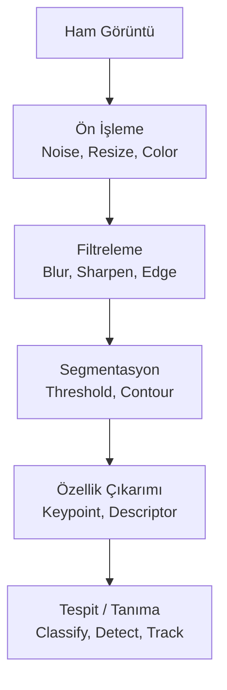
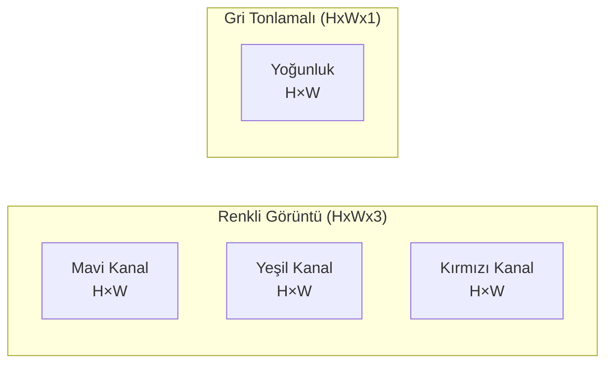
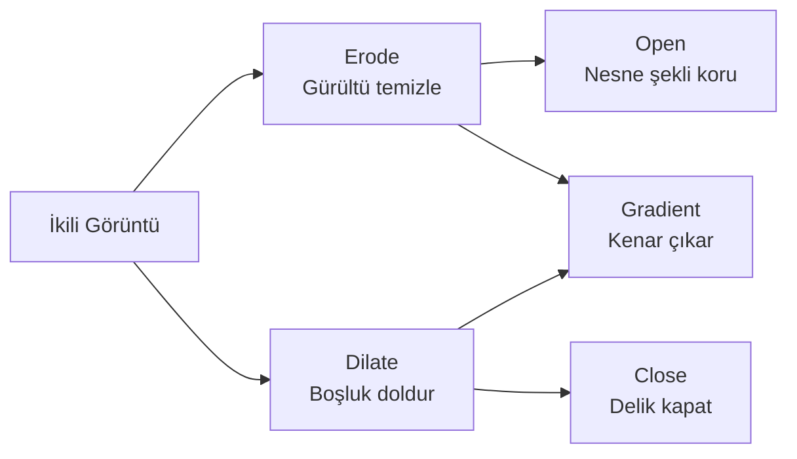
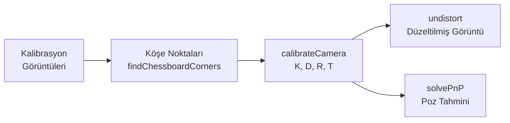

# Görüntü İşleme

!!! note "Genel Bakış"
    Görüntü işleme, dijital görüntüler üzerinde matematiksel işlemler uygulayarak bilgi çıkarmayı, görüntüyü iyileştirmeyi veya analiz etmeyi kapsar. OpenCV, Python'da fiili standart kütüphanedir. Bu sayfa; temel kavramlardan nesne tespitine uzanan kapsamlı bir rehberdir.



---

## Dijital Görüntü Temelleri

### Piksel ve Kanal Yapısı



| Kavram | Açıklama |
|--------|---------|
| **Piksel** | Görüntünün en küçük birimi; renk/yoğunluk değeri taşır |
| **Kanal** | Bir renk bileşeni (R, G, B veya H, S, V) |
| **Bit Derinliği** | uint8: 0–255; float32: 0.0–1.0; uint16: 0–65535 |
| **Çözünürlük** | Genişlik × Yükseklik piksel sayısı |

```python title="Temel Görüntü Bilgisi"
import cv2
import numpy as np

img = cv2.imread("image.jpg")            # BGR formatında okur (!)
print(f"Boyut: {img.shape}")             # (yükseklik, genişlik, kanal)
print(f"Tip: {img.dtype}")               # uint8
print(f"Min/Max: {img.min()} / {img.max()}")

# Piksel erişimi
pixel = img[100, 200]        # (y=100, x=200) pikselinin BGR değeri
roi = img[50:200, 100:300]   # Bölge erişimi [y_start:y_end, x_start:x_end]
```

### Renk Uzayları

| Renk Uzayı | Kanallar | Kullanım |
|:----------:|:-------:|---------|
| **BGR** | Blue, Green, Red | OpenCV varsayılanı |
| **RGB** | Red, Green, Blue | PIL/Matplotlib/PyTorch |
| **HSV** | Hue, Saturation, Value | Renk tabanlı segmentasyon |
| **LAB** | Luminance, A*, B* | Renk karşılaştırma, transferi |
| **Grayscale** | Yoğunluk | Kenar, yoğunluk işlemleri |
| **YCrCb** | Luminance, Cr, Cb | JPEG sıkıştırma, ten tonu |

```python title="Renk Dönüşümleri"
img_rgb  = cv2.cvtColor(img, cv2.COLOR_BGR2RGB)     # matplotlib için
gray     = cv2.cvtColor(img, cv2.COLOR_BGR2GRAY)
hsv      = cv2.cvtColor(img, cv2.COLOR_BGR2HSV)
lab      = cv2.cvtColor(img, cv2.COLOR_BGR2LAB)

# HSV ile renk maskesi — sarı rengi seç
lower_yellow = np.array([20, 100, 100])
upper_yellow = np.array([30, 255, 255])
mask   = cv2.inRange(hsv, lower_yellow, upper_yellow)
result = cv2.bitwise_and(img, img, mask=mask)
```

!!! tip "HSV ile Renk Segmentasyonu"
    HSV renk uzayında Hue (H) rengin kendisini, Saturation (S) doygunluğunu, Value (V) parlaklığını temsil eder. Işık koşullarından bağımsız renk tespiti için BGR'den çok daha uygun.

---

## Geometrik Dönüşümler

```python title="Yeniden Boyutlandırma ve Döndürme"
# Yeniden boyutlandırma
resized = cv2.resize(img, (640, 480))
resized_ratio = cv2.resize(img, (0, 0), fx=0.5, fy=0.5)   # %50 küçült

# Enterpolasyon: INTER_NEAREST hızlı, INTER_CUBIC kaliteli büyütme
resized_hq = cv2.resize(img, (1280, 720), interpolation=cv2.INTER_CUBIC)

h, w = img.shape[:2]
cx, cy = w // 2, h // 2

# Döndürme
M_rot = cv2.getRotationMatrix2D((cx, cy), angle=45, scale=1.0)
rotated = cv2.warpAffine(img, M_rot, (w, h))

# Flip
flipped_h = cv2.flip(img, 1)    # Yatay ayna
flipped_v = cv2.flip(img, 0)    # Dikey ayna

# Perspektif düzeltme (dörtgen → dikdörtgen)
src_pts = np.float32([[100, 100], [400, 80], [420, 350], [80, 370]])
dst_pts = np.float32([[0, 0],    [300, 0],  [300, 300], [0, 300]])
M_persp = cv2.getPerspectiveTransform(src_pts, dst_pts)
warped  = cv2.warpPerspective(img, M_persp, (300, 300))
```

---

## Filtreleme ve Gürültü Azaltma

Filtreler, piksel değerini komşuluğunun ağırlıklı ortalamasıyla değiştiren konvolüsyon çekirdeği uygular.

```python title="Filtreleme"
# Gaussian Blur — doğal görüntü gürültüsü
blurred   = cv2.GaussianBlur(img, ksize=(15, 15), sigmaX=0)

# Median Blur — tuz-biber (salt-pepper) gürültüsü
median    = cv2.medianBlur(img, ksize=5)

# Bilateral Filter — kenarları koruyarak gürültü azaltma
bilateral = cv2.bilateralFilter(img, d=9, sigmaColor=75, sigmaSpace=75)

# Keskinleştirme kernel'i
sharpen_kernel = np.array([[ 0, -1,  0],
                            [-1,  5, -1],
                            [ 0, -1,  0]])
sharpened = cv2.filter2D(img, ddepth=-1, kernel=sharpen_kernel)
```

| Filtre | Kullanım | Hız |
|--------|---------|:---:|
| Gaussian | Genel gürültü, bulanıklaştırma | Hızlı |
| Median | Tuz-biber gürültüsü | Orta |
| Bilateral | Kenar koruyarak bulanıklaştırma | Yavaş |

---

## Eşikleme (Thresholding)

Görüntüyü ön plan (1) ve arka plan (0) olarak ikiye ayırır.

```python title="Eşikleme Yöntemleri"
gray = cv2.cvtColor(img, cv2.COLOR_BGR2GRAY)

# Global Binary
_, binary = cv2.threshold(gray, thresh=127, maxval=255, type=cv2.THRESH_BINARY)

# Otsu — otomatik eşik (bimodal histogram için ideal)
_, otsu = cv2.threshold(gray, 0, 255, cv2.THRESH_BINARY + cv2.THRESH_OTSU)

# Adaptif — yerel parlaklık değişimleri için (ışık tutarsızlığı)
adaptive = cv2.adaptiveThreshold(
    gray, 255,
    cv2.ADAPTIVE_THRESH_GAUSSIAN_C,
    cv2.THRESH_BINARY,
    blockSize=11,   # Komşuluk boyutu (tek sayı)
    C=2             # Çıkartılan sabit
)
```

!!! tip "Hangi Eşik?"
    - Eşit aydınlatma → **Otsu**
    - Düzensiz aydınlatma (gölge, spotlight) → **Adaptive Gaussian**
    - Bilinen sabit eşik → **Global Binary**

---

## Morfolojik İşlemler

İkili görüntülerdeki şekilleri yapısal eleman (kernel) kullanarak değiştiren temel işlemlerdir.

```python title="Morfolojik İşlemler"
kernel = np.ones((5, 5), np.uint8)

eroded   = cv2.erode(binary, kernel, iterations=1)            # Küçültür, gürültü temizler
dilated  = cv2.dilate(binary, kernel, iterations=1)            # Büyütür, boşluk doldurur
opened   = cv2.morphologyEx(binary, cv2.MORPH_OPEN, kernel)   # Erode + Dilate — gürültü at
closed   = cv2.morphologyEx(binary, cv2.MORPH_CLOSE, kernel)  # Dilate + Erode — delik kapat
gradient = cv2.morphologyEx(binary, cv2.MORPH_GRADIENT, kernel) # Kenar
```



---

## Kenar Tespiti (Edge Detection)

Kenarlar, yoğunluğun hızlı değiştiği piksellerdir. Nesne sınırlarını ve şekilleri temsil eder.

```python title="Kenar Tespiti"
gray = cv2.cvtColor(img, cv2.COLOR_BGR2GRAY)

# Canny — en yaygın; Gaussian + Sobel + çift eşik içerir
edges = cv2.Canny(gray, threshold1=50, threshold2=150)

# Otomatik Canny eşiği (Otsu tabanlı)
blur = cv2.GaussianBlur(gray, (5, 5), 0)
v    = np.median(blur)
edges_auto = cv2.Canny(blur, int(max(0, 0.67*v)), int(min(255, 1.33*v)))

# Sobel — yönsel kenar; gradyan büyüklüğü
sobel_x   = cv2.Sobel(gray, cv2.CV_64F, dx=1, dy=0, ksize=3)
sobel_y   = cv2.Sobel(gray, cv2.CV_64F, dx=0, dy=1, ksize=3)
sobel_mag = np.uint8(np.clip(cv2.magnitude(sobel_x, sobel_y), 0, 255))
```

| Dedektör | Gürültü Duyarlılığı | Kullanım |
|----------|:-------------------:|---------|
| **Canny** | Düşük (Gaussian dahil) | Genel amaçlı (en iyi) |
| **Sobel** | Orta | Gradyan yönü gerektiğinde |
| **Laplacian** | Yüksek | Blob tespiti |

---

## Kontur Tespiti ve Şekil Analizi

Konturlar, aynı yoğunluğa sahip sürekli piksel eğrileridir.

```python title="Kontur İşlemleri"
gray = cv2.cvtColor(img, cv2.COLOR_BGR2GRAY)
_, binary = cv2.threshold(gray, 127, 255, cv2.THRESH_BINARY + cv2.THRESH_OTSU)

contours, hierarchy = cv2.findContours(
    binary, cv2.RETR_EXTERNAL, cv2.CHAIN_APPROX_SIMPLE
)
contours = sorted(contours, key=cv2.contourArea, reverse=True)

output = img.copy()
for cnt in contours:
    area = cv2.contourArea(cnt)
    if area < 500:
        continue

    # Sınırlayıcı dikdörtgen
    x, y, w, h = cv2.boundingRect(cnt)
    cv2.rectangle(output, (x, y), (x+w, y+h), (255, 0, 0), 2)

    # Merkez (moment tabanlı)
    M = cv2.moments(cnt)
    if M['m00'] != 0:
        cx = int(M['m10'] / M['m00'])
        cy = int(M['m01'] / M['m00'])
        cv2.circle(output, (cx, cy), 5, (0, 0, 255), -1)

    # Şekil yaklaşımı
    perimeter = cv2.arcLength(cnt, closed=True)
    approx    = cv2.approxPolyDP(cnt, 0.02 * perimeter, closed=True)
    n = len(approx)
    label = {3: "Üçgen", 4: "Dörtgen"}.get(n, "Daire" if n > 8 else f"{n}-gen")
    cv2.putText(output, label, (x, y-10), cv2.FONT_HERSHEY_SIMPLEX, 0.6, (0,0,255), 2)
```

```python title="Kontur Özellikleri"
cnt = contours[0]

area         = cv2.contourArea(cnt)
perimeter    = cv2.arcLength(cnt, True)
circularity  = (4 * np.pi * area) / (perimeter ** 2)   # 1.0 = daire

x, y, w, h  = cv2.boundingRect(cnt)
aspect_ratio = float(w) / h
extent       = area / (w * h)                           # Doluluk oranı

hull         = cv2.convexHull(cnt)
solidity     = area / cv2.contourArea(hull)             # 1.0 = dışbükey
```

---

## Histogram İşlemleri

```python title="Histogram ve Eşitleme"
gray = cv2.cvtColor(img, cv2.COLOR_BGR2GRAY)

# Histogram hesapla
hist = cv2.calcHist([gray], [0], None, [256], [0, 256])

# Histogram Eşitleme — düşük kontrast görüntü iyileştirme
equalized = cv2.equalizeHist(gray)

# CLAHE — Sınırlandırılmış Adaptif HE (daha doğal sonuç)
clahe      = cv2.createCLAHE(clipLimit=2.0, tileGridSize=(8, 8))
clahe_gray = clahe.apply(gray)

# Renkli görüntüde CLAHE (V kanalına uygula)
hsv = cv2.cvtColor(img, cv2.COLOR_BGR2HSV)
hsv[:, :, 2] = clahe.apply(hsv[:, :, 2])
img_clahe = cv2.cvtColor(hsv, cv2.COLOR_HSV2BGR)
```

---

## Özellik Tespiti (Feature Detection)

Görüntüdeki tekrarlanabilir, tanınabilir noktaları (keypoint) ve tanımlayıcılarını (descriptor) çıkarır.

```python title="ORB — Hızlı ve Patent-free"
orb = cv2.ORB_create(nfeatures=1000)
kp, des = orb.detectAndCompute(gray, mask=None)

# İki görüntü eşleştirme
orb2 = cv2.ORB_create(nfeatures=1000)
kp2, des2 = orb2.detectAndCompute(gray2, None)

bf      = cv2.BFMatcher(cv2.NORM_HAMMING, crossCheck=True)
matches = bf.match(des, des2)
matches = sorted(matches, key=lambda x: x.distance)

img_matches = cv2.drawMatches(img, kp, img2, kp2, matches[:30], None,
                              flags=cv2.DrawMatchesFlags_NOT_DRAW_SINGLE_POINTS)
```

```python title="SIFT + FLANN (daha hassas)"
sift = cv2.SIFT_create(nfeatures=500)
kp, des = sift.detectAndCompute(gray, None)

flann   = cv2.FlannBasedMatcher({'algorithm': 1, 'trees': 5}, {'checks': 50})
matches = flann.knnMatch(des, des2, k=2)
good    = [m for m, n in matches if m.distance < 0.7 * n.distance]  # Lowe's ratio test
```

| Dedektör | Hız | Ölçek Değişmez | Patent | Kullanım |
|----------|:---:|:--------------:|:------:|---------|
| **ORB** | Hızlı | Kısmen | Açık | Gerçek zamanlı |
| **SIFT** | Yavaş | ✓ | Açık (2020+) | Hassas eşleştirme |
| **AKAZE** | Orta | ✓ | Açık | SLAM |

---

## Şablon Eşleştirme (Template Matching)

```python title="Template Matching"
template = cv2.imread("template.png", cv2.IMREAD_GRAYSCALE)
th, tw   = template.shape[:2]

result = cv2.matchTemplate(gray, template, cv2.TM_CCOEFF_NORMED)
min_val, max_val, min_loc, max_loc = cv2.minMaxLoc(result)

# Tüm eşleşmeleri bul (threshold üstü)
locations = np.where(result >= 0.8)
for pt in zip(*locations[::-1]):
    cv2.rectangle(img, pt, (pt[0]+tw, pt[1]+th), (0, 255, 0), 2)
```

---

## Segmentasyon — Watershed

```python title="Watershed Algoritması"
gray = cv2.cvtColor(img, cv2.COLOR_BGR2GRAY)
_, thresh = cv2.threshold(gray, 0, 255, cv2.THRESH_BINARY_INV + cv2.THRESH_OTSU)

kernel  = np.ones((3, 3), np.uint8)
opening = cv2.morphologyEx(thresh, cv2.MORPH_OPEN, kernel, iterations=2)
sure_bg = cv2.dilate(opening, kernel, iterations=3)

dist_transform = cv2.distanceTransform(opening, cv2.DIST_L2, 5)
_, sure_fg = cv2.threshold(dist_transform, 0.7 * dist_transform.max(), 255, 0)
sure_fg    = np.uint8(sure_fg)
unknown    = cv2.subtract(sure_bg, sure_fg)

_, markers = cv2.connectedComponents(sure_fg)
markers    = markers + 1
markers[unknown == 255] = 0

markers = cv2.watershed(img, markers)
img[markers == -1] = [255, 0, 0]   # Sınırları kırmızıyla işaretle
```

---

## Kamera Kalibrasyonu

Kamera lensi geometrik bozulma (distortion) üretir. Kalibrasyon, bu bozulmayı düzeltmek için intrinsic ve distortion parametrelerini hesaplar.

```python title="Satranç Tahtası ile Kalibrasyon"
import glob

CHESSBOARD = (9, 6)
objp = np.zeros((CHESSBOARD[0] * CHESSBOARD[1], 3), np.float32)
objp[:, :2] = np.mgrid[0:CHESSBOARD[0], 0:CHESSBOARD[1]].T.reshape(-1, 2)

obj_points, img_points = [], []

for fname in glob.glob('calib_images/*.jpg'):
    img  = cv2.imread(fname)
    gray = cv2.cvtColor(img, cv2.COLOR_BGR2GRAY)
    ret, corners = cv2.findChessboardCorners(gray, CHESSBOARD, None)
    if not ret:
        continue
    criteria = (cv2.TERM_CRITERIA_EPS + cv2.TERM_CRITERIA_MAX_ITER, 30, 0.001)
    corners2 = cv2.cornerSubPix(gray, corners, (11, 11), (-1, -1), criteria)
    obj_points.append(objp)
    img_points.append(corners2)

ret, camera_matrix, dist_coeffs, rvecs, tvecs = cv2.calibrateCamera(
    obj_points, img_points, gray.shape[::-1], None, None
)
print(f"RMS hata: {ret:.4f}")   # < 1.0 iyi

# Bozulmayı düzelt
undistorted = cv2.undistort(img, camera_matrix, dist_coeffs)

# Kaydet
np.savez('calibration.npz', camera_matrix=camera_matrix, dist_coeffs=dist_coeffs)
```



!!! tip "İyi Kalibrasyon İçin"
    - En az 15–20 farklı açı ve mesafeden kare kullanın
    - RMS hata < 0.5 mükemmel, < 1.0 yeterli
    - Kalibrasyonu farklı ışık koşullarında tekrarlayın

---

## Nesne Tespiti — Derin Öğrenme ile

### YOLOv8 ile Modern Kullanım

```python title="Ultralytics YOLOv8"
from ultralytics import YOLO

model = YOLO("yolov8n.pt")   # nano: hız odaklı; yolov8l.pt: doğruluk odaklı

# Tek görüntü
results = model("image.jpg", conf=0.5, iou=0.4)
for r in results:
    for box in r.boxes:
        cls  = int(box.cls[0])
        conf = float(box.conf[0])
        x1, y1, x2, y2 = map(int, box.xyxy[0])
        print(f"{model.names[cls]}: {conf:.2f} @ [{x1},{y1},{x2},{y2}]")
    r.save("output.jpg")

# Webcam akışı
model.predict(source=0, show=True, conf=0.5)   # 0 = webcam

# Fine-tune
model.train(data="dataset.yaml", epochs=100, imgsz=640, batch=16, device=0)
```

### OpenCV DNN ile YOLO

```python title="OpenCV DNN"
net = cv2.dnn.readNet("yolov4.weights", "yolov4.cfg")
net.setPreferableBackend(cv2.dnn.DNN_BACKEND_CUDA)
net.setPreferableTarget(cv2.dnn.DNN_TARGET_CUDA)

blob = cv2.dnn.blobFromImage(img, 1/255.0, (416, 416), swapRB=True, crop=False)
net.setInput(blob)

h, w = img.shape[:2]
outputs = net.forward(net.getUnconnectedOutLayersNames())
boxes, confs, class_ids = [], [], []

for output in outputs:
    for det in output:
        scores = det[5:]
        cls    = np.argmax(scores)
        conf   = scores[cls]
        if conf > 0.5:
            cx, cy, bw, bh = (det[:4] * [w, h, w, h]).astype(int)
            boxes.append([cx - bw//2, cy - bh//2, bw, bh])
            confs.append(float(conf))
            class_ids.append(cls)

indices = cv2.dnn.NMSBoxes(boxes, confs, 0.5, 0.4)
```

---

## Optik Akış (Optical Flow)

Ardışık kare çiftleri arasındaki piksel hareketini hesaplar.

```python title="Lucas-Kanade Optik Akış"
cap       = cv2.VideoCapture("video.mp4")
ret, old  = cap.read()
old_gray  = cv2.cvtColor(old, cv2.COLOR_BGR2GRAY)
p0        = cv2.goodFeaturesToTrack(old_gray, maxCorners=100,
                                     qualityLevel=0.3, minDistance=7)
lk_params = dict(winSize=(15, 15), maxLevel=2,
                 criteria=(cv2.TERM_CRITERIA_EPS | cv2.TERM_CRITERIA_COUNT, 10, 0.03))
mask = np.zeros_like(old)

while True:
    ret, frame = cap.read()
    if not ret:
        break
    frame_gray      = cv2.cvtColor(frame, cv2.COLOR_BGR2GRAY)
    p1, st, _       = cv2.calcOpticalFlowPyrLK(old_gray, frame_gray, p0, None, **lk_params)
    good_new        = p1[st == 1]
    good_old        = p0[st == 1]

    for new, old_pt in zip(good_new, good_old):
        a, b = new.ravel().astype(int)
        c, d = old_pt.ravel().astype(int)
        mask = cv2.line(mask, (a, b), (c, d), (0, 255, 0), 2)
        frame = cv2.circle(frame, (a, b), 5, (0, 0, 255), -1)

    cv2.imshow('Akış', cv2.add(frame, mask))
    old_gray = frame_gray.copy()
    p0       = good_new.reshape(-1, 1, 2)
    if cv2.waitKey(30) & 0xFF == ord('q'):
        break
cap.release()
cv2.destroyAllWindows()
```

---

## Görüntü İşleme Hızlı Başvuru

| Amaç | Fonksiyon | Not |
|------|-----------|-----|
| Oku / Yaz | `cv2.imread`, `cv2.imwrite` | BGR formatı |
| Boyutlandır | `cv2.resize` | `INTER_CUBIC` büyütme için |
| Renk dönüşümü | `cv2.cvtColor` | BGR→HSV tespiti için |
| Bulanıklaştır | `cv2.GaussianBlur` | Gürültü öncesi |
| Kenar | `cv2.Canny` | Otomatik: `0.67/1.33 × median` |
| Eşik | `cv2.threshold + OTSU` | Eşit aydınlatmada |
| Adaptif Eşik | `cv2.adaptiveThreshold` | Düzensiz ışıkta |
| Morfoloji | `cv2.morphologyEx` | OPEN gürültü, CLOSE delik |
| Kontur | `cv2.findContours` | İkili görüntü gerekli |
| Özellik | `cv2.ORB_create` | Gerçek zamanlı eşleştirme |
| Nesne Tespiti | `YOLO("yolov8n.pt")` | Modern standart |
| Kalibrasyon | `cv2.calibrateCamera` | Satranç tahtası ile |
