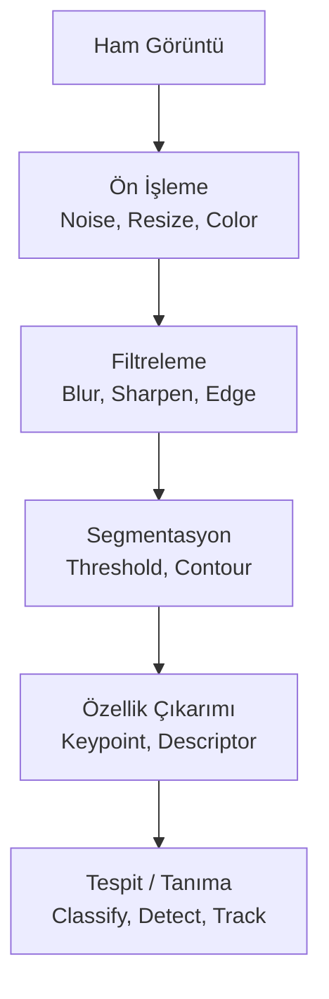
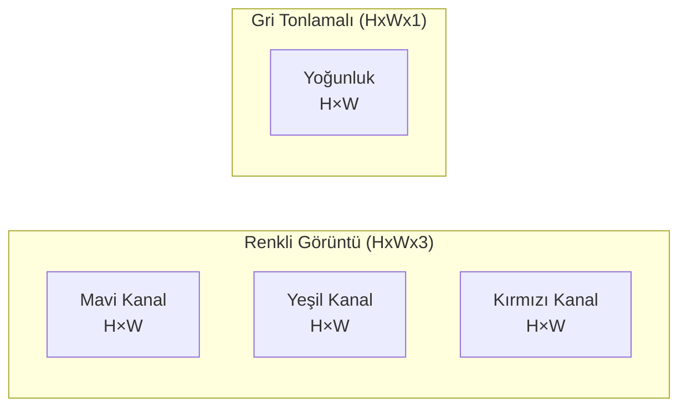
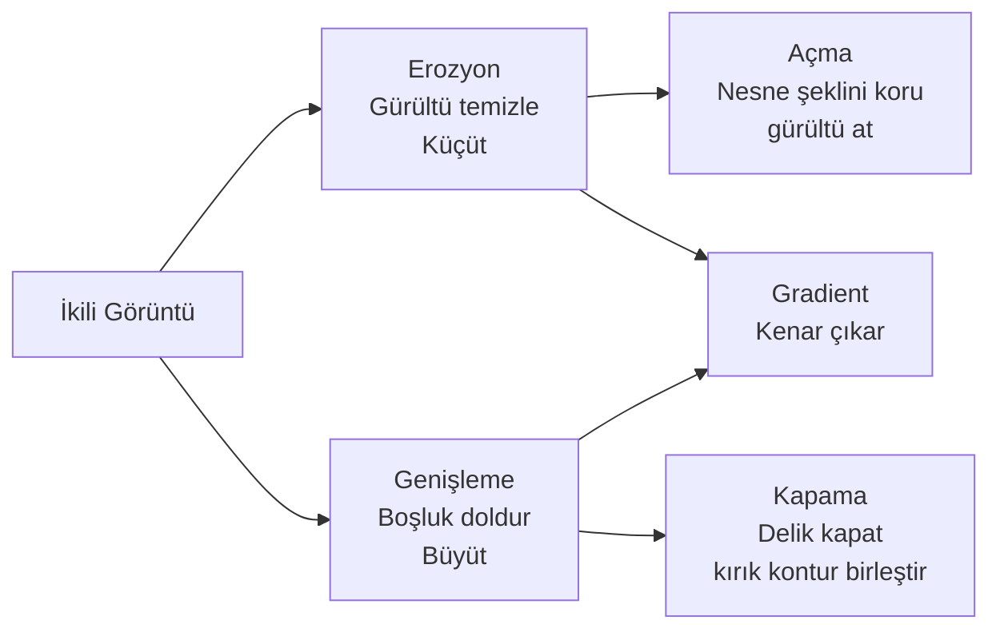
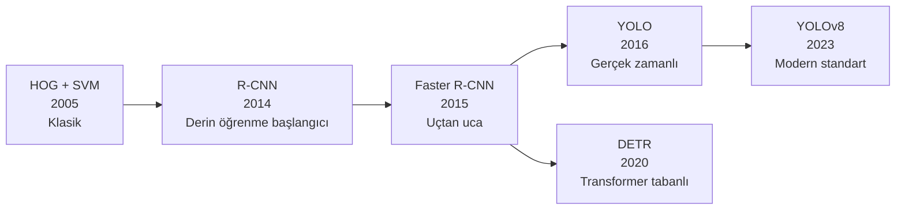
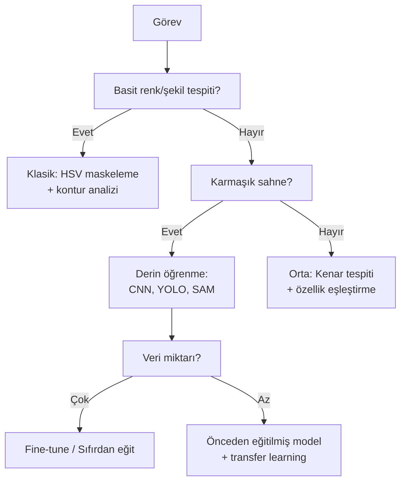

# Görüntü İşleme

!!! note "Genel Bakış"
    Görüntü işleme, dijital görüntüler üzerinde matematiksel dönüşümler uygulayarak bilgi çıkarmayı, görüntüyü iyileştirmeyi veya analiz etmeyi kapsar. Klasik görüntü işleme (filtreler, kenar tespiti, morfoloji) ile derin öğrenme tabanlı yaklaşımlar (CNN, YOLO, segmentasyon) birbirini tamamlar.



---

## Dijital Görüntü Nedir?

Bir dijital görüntü, sayısal değerler içeren iki boyutlu bir matristir. Her hücre bir **piksel** (pixel — picture element), her değer o pikselin renk ya da yoğunluk bilgisidir. Bilgisayar için görüntü, sadece sayılardan oluşan bir tablodur.

### Piksel ve Matris Yapısı



**Renkli görüntü:** 3 boyutlu bir matris — Yükseklik × Genişlik × 3 kanal (R, G, B). 1920×1080 Full HD görüntü için bu 1920 × 1080 × 3 = yaklaşık 6.2 milyon sayı demektir.

**Gri tonlamalı:** Her piksel tek bir değer — 0 (siyah) ile 255 (beyaz) arasında. Renk bilgisi yoktur, sadece parlaklık.

**Bit derinliği:** Piksel başına kullanılan bit sayısı.

- **uint8 (8 bit):** 0–255 arası 256 değer. Standart fotoğraflar ve kamera görüntüleri.
- **uint16 (16 bit):** 0–65535. Tıbbi görüntüler, astronomik veriler — çok daha ince parlaklık farkları.
- **float32:** 0.0–1.0 veya herhangi bir aralık. Sinir ağı işlemlerinde kullanılır.

### Çözünürlük ve Boyut Kavramları

| Kavram | Açıklama | Örnek |
|--------|---------|-------|
| **Çözünürlük** | Toplam piksel sayısı (Genişlik × Yükseklik) | 1920×1080 = ~2 Megapiksel |
| **Aspect Ratio** | Genişlik / Yükseklik oranı | 16:9 geniş ekran, 4:3 klasik |
| **Kanal** | Renk bileşeni | RGB=3, RGBA=4, Grayscale=1 |
| **Bit Derinliği** | Piksel başına bit | 8-bit: 256 seviye; 16-bit: 65536 seviye |
| **DPI** | İnç başına nokta (baskı kalitesi) | 72 DPI ekran, 300 DPI baskı |

---

## Renk Uzayları — Görüntüyü Farklı Temsil Etmek

Aynı görüntü farklı renk uzaylarında farklı şekilde temsil edilebilir. Her renk uzayı belirli görevler için avantajlıdır. Doğru renk uzayını seçmek, sonraki adımları dramatik biçimde kolaylaştırır.

### RGB

En doğal renk uzayı. Her piksel kırmızı (R), yeşil (G) ve mavi (B) bileşenlerinin karışımıdır. İnsan gözü bu üç rengi algılar; tüm renkler bu üçünün farklı yoğunluk kombinasyonlarıyla oluşur.

!!! warning "OpenCV'nin BGR Formatı"
    OpenCV, görüntüleri RGB değil **BGR** sırasıyla okur. Bu tarihsel bir nedendir. Matplotlib ve PyTorch RGB bekler. Hatalı sıra görüntüyü kırmızı-mavi değişmiş gösterir. OpenCV'den gelen görüntüyü Matplotlib'de göstermeden önce BGR→RGB dönüşümü gerekir.

### HSV — Renk Tespiti İçin

RGB'de belirli bir rengi (örn. "sarı") bulmak zordur. Aynı sarı renk gölgede ve güneşte çok farklı RGB değerleri verir. HSV bu sorunu çözer:

- **H (Hue — Ton):** Rengin kendisi. 0°–360° açı. 0° kırmızı → 60° sarı → 120° yeşil → 240° mavi → 360° kırmızı.
- **S (Saturation — Doygunluk):** Rengin canlılığı. 0 = gri/renksiz, 255 = tam doygun renk.
- **V (Value — Değer):** Parlaklık. 0 = siyah, 255 = tam parlak.

**Neden HSV kullanılır?** Sarı nesneyi bulmak için H: 20–30, S: 100–255, V: 100–255 aralığı yeterlidir. Bu aralık gölgeli sarı, parlak sarı, mat sarı hepsini kapsar. RGB'de bu kadar basit bir eşik mümkün değildir.

### LAB (L\*a\*b\*)

İnsan gözünün renk algısını modelleyen uzay:
- **L:** Parlaklık (0 = siyah, 100 = beyaz)
- **a:** Kırmızı-yeşil ekseni (pozitif = kırmızı, negatif = yeşil)
- **b:** Sarı-mavi ekseni (pozitif = sarı, negatif = mavi)

**Özel özelliği:** LAB renk uzayında iki renk arasındaki Öklid mesafesi, insan gözünün algıladığı renk farkıyla orantılıdır. "Bu iki renk ne kadar farklı görünüyor?" sorusunu sayısal olarak cevaplayabilirsiniz. Renk karşılaştırma, renk transferi ve baskı kalite kontrolü için standarttır.

### YCrCb

Parlaklık (Y) ile renk farkı (Cr, Cb) bileşenlerine ayırır. JPEG sıkıştırması bu uzayı kullanır: insan gözü parlaklık değişimlerine renk değişimlerinden çok daha duyarlıdır. Cr ve Cb daha fazla sıkıştırılabilir, kaliteden önemli bir kayıp olmaz.

Ten tonu tespiti için de kullanılır: ten tonu Cb ve Cr değerleri oldukça sabit bir aralıkta kalır.

| Renk Uzayı | En İyi Kullanım |
|:----------:|:---------------:|
| **RGB / BGR** | Genel amaç, görüntü okuma/yazma |
| **HSV** | Renk tabanlı nesne tespiti ve segmentasyon |
| **LAB** | Renk karşılaştırma, renk transferi, kalite kontrol |
| **Grayscale** | Kenar tespiti, yoğunluk analizi, hız kritikse |
| **YCrCb** | Ten tonu tespiti, sıkıştırma |

---

## Geometrik Dönüşümler

Görüntünün uzamsal yapısını değiştiren işlemler. Nesnenin "nerede" göründüğünü ve "nasıl" göründüğünü etkiler ama piksel içeriklerini değiştirmez.

### Yeniden Boyutlandırma (Resize)

Piksel sayısını artırır veya azaltır. İki temel durum:

- **Küçültme (Downscale):** Pikseller atılır. Bilgi kaybı olur. Gerçek zamanlı sistemlerde hız için zorunlu.
- **Büyütme (Upscale):** Olmayan pikseller "uydurulur." Interpolasyon yöntemi kaliteyi belirler.

**Interpolasyon yöntemleri:**

| Yöntem | Kalite | Hız | Ne Zaman |
|--------|:------:|:---:|---------|
| **Nearest Neighbor** | Düşük (pikselli) | En hızlı | Segmentasyon maskeleri (etiketleri bozma) |
| **Bilinear** | İyi | Hızlı | Genel amaç, küçültme |
| **Bicubic** | Çok iyi | Orta | Kaliteli büyütme |
| **Lanczos** | En iyi | Yavaş | Baskı kalitesi büyütme |

### Döndürme ve Afin Dönüşüm

**Afin dönüşüm:** Paralel çizgileri paralel bırakır. Döndürme, ölçekleme, kaydırma, yatırma (shear) bu kategoridedir. 2×3 dönüşüm matrisiyle tanımlanır.

**Döndürme:** Merkez nokta ve açı belirlenir. Görüntü o merkez etrafında döndürülür. Dikkat: döndürülen görüntü orijinal çerçeveyi aşabilir, köşeler kesilebilir.

**Flip:** Yatay veya dikey aynalama. Veri artırmada en sık kullanılan işlem — simetrik nesneler için bilgi kaybı olmadan iki kat veri üretir.

### Perspektif Dönüşüm

Afin dönüşümün ötesinde — bir düzlemi farklı bir bakış açısından görüntülemek gibi. Paralel çizgiler paralel kalmaz (bir yolun uzağa doğru "daraldığı" gibi). 3×3 homografi matrisiyle tanımlanır.

**Kullanım alanları:**
- Belge tarama: Eğri çekilmiş belgeyi düz dikdörtgene dönüştür
- Tahta/ekran yakalama: Açılı çekilmiş tahtayı frontal görünüme getir
- Plaka tanıma: Açılı araçtaki plakayı düzleştir

---

## Filtreleme ve Konvolüsyon — Görüntü Düzeltme

Filtreler, her pikselin değerini komşuluğuna göre yeniden hesaplar. Matematiksel temeli **konvolüsyon**: küçük bir çekirdek (kernel) görüntü üzerinde kaydırılır.

### Konvolüsyon Nasıl Çalışır?

Çekirdek görüntünün her bölgesine "yapıştırılır": çekirdek değerleri × karşılık gelen piksel değerleri çarpılır ve toplanır. Bu toplam, merkezdeki pikselin yeni değeri olur.

**Farklı çekirdekler farklı etkiler üretir:**

| Çekirdek Türü | Etki | Uygulama |
|:------------:|:----:|:--------:|
| Tüm değerler eşit, toplam=1 | Bulanıklaştırma | Gürültü azaltma |
| Merkez yüksek pozitif, etraf negatif | Keskinleştirme | Detay artırma |
| Bir yönde pozitif, diğer yönde negatif | Kenar tespiti | Nesne sınırı bulma |

### Gaussian Bulanıklaştırma

Komşu piksellerin ağırlıklı ortalamasını alır. Ağırlıklar Gaussian (normal) dağılımına göre belirlenir: merkezdeki piksel en yüksek, uzaktakiler azalan ağırlığa sahiptir.

**Ne için kullanılır?**
- Rastgele gürültüyü azaltmak (kamera sensör gürültüsü, JPEG artifact)
- Kenar tespitinden önce görüntüyü yumuşatmak
- Yüksek frekanslı detayları gizlemek (zoom out efekti)

**σ (sigma) parametresi:** Gaussian'ın genişliği. Büyük σ → daha fazla piksel daha yüksek ağırlıkla etkilenir → daha fazla bulanıklaştırma. Çekirdek boyutu (ksize) genellikle 6σ + 1 olarak seçilir.

### Median Filtreleme

Her piksel yerine komşuluğunun medyanını (ortancasını) yazar. Ortalama yerine medyan kullanmak, aşırı değerlere (outlier) karşı dayanıklı kılar.

**Tuz-biber gürültüsü nedir?** Görüntüde rastgele tam beyaz (255) veya tam siyah (0) pikseller görünür. Bir pikselin değeri 0 veya 255 olduğunda, Gaussian filtreleme bu aşırılığı komşulara yayar. Median ise bu piksel azınlıkta kaldığı için onu atar — gürültüsüz sonuç.

### Bilateral Filtreleme

Hem konumdaki yakınlığı hem de piksel değerindeki benzerliği dikkate alır. Benzer renge sahip komşular daha fazla ağırlık alır; farklı rengeyse ağırlık düşer.

**Sonuç:** Kenarları koruyarak bulanıklaştırır. Kenarın iki tarafındaki pikseller renk açısından çok farklıdır → birbirini az etkiler → kenar korunur. Aynı bölgedeki pikseller ise birbirine yakın renklerde → birbirini çok etkiler → gürültü azalır.

**Kullanım:** Cilt retüşü (yüz hatları korunurken cilt pürüzsüzleşir), medikal görüntüleme, çizgi film efekti (bilateral birkaç kez uygulandığında boyama görünümü oluşur).

---

## Eşikleme (Thresholding) — İkili Görüntü Oluşturma

Gri tonlamalı görüntüyü siyah-beyaz (ikili) görüntüye dönüştürür. Her piksel, eşik değerinin altında mı üstünde mi olduğuna göre 0 veya 255 değerini alır.

**Neden gerekli?** Kontur tespiti, morfolojik işlemler, nesne sayımı gibi işlemler ikili görüntü üzerinde çalışır. Karmaşık görüntüden "ön plan / arka plan" ayrımı ilk adımdır.

### Global Eşikleme

Tüm görüntü için tek bir eşik değeri kullanılır. "127'den büyük pikseller beyaz, küçükler siyah."

**Hangi değeri seçmeli?** Eşit aydınlatmada histogram iki tepeye sahip olur: koyu arka plan ve aydınlık ön plan. İki tepe arasındaki çukur ideal eşik noktasıdır.

**Otsu Yöntemi:** Bu eşik değerini otomatik hesaplar. İki sınıfın (ön plan ve arka plan) içi varyansını minimize eden değeri bulur. Bimodal (iki tepeli) histogramlarda mükemmel çalışır. Tek tutarsız aydınlatma yoksa Otsu'yu tercih edin.

### Adaptif Eşikleme

Tek eşik tüm görüntü için uygun değilse (gölge, değişen aydınlatma, yansıma), her bölge için lokal eşik hesaplanır. Her piksel için, çevresindeki küçük bir bölgenin ortalaması (veya Gaussian ağırlıklı ortalaması) hesaplanıp sabit bir değer çıkarılarak lokal eşik bulunur.

**Neden daha iyi?** Görüntünün sol üstü parlak, sağ altı gölgeli olsun. Global eşikte parlak bölgeler iyi ayrışır ama gölgeli bölge tamamen siyah olur. Adaptif yöntemde her bölge kendi koşuluna göre eşiklenir.

**Kullanım:** El yazısı metin, karışık aydınlatmalı belgeler, endüstriyel yüzey denetimi, kamerayla yakalanan dokümanlar.

### Eşik Seçim Rehberi

| Durum | Yöntem |
|-------|--------|
| Eşit aydınlatma, net kontrast | **Otsu (Global)** |
| Değişken aydınlatma, gölge var | **Adaptive Gaussian** |
| Bilinen sabit eşik | **Global Binary** |
| Çok kanallı, renk tabanlı | **HSV renk maskesi** |

---

## Morfolojik İşlemler — Şekil Manipülasyonu

İkili görüntülerdeki şekilleri yapısal bir eleman (kernel) kullanarak değiştiren işlemlerdir. Kernelin şekli ve boyutu, işlemin hangi yapıları etkileyeceğini belirler: küçük bir daire kerneli küçük yuvarlak gürültüyü, ince bir dikdörtgen kerneli ince çizgileri etkiler.

### Erozyon (Erosion)

Yalnızca kernelin tamamen "sığdığı" yerlerde piksel 1 kalır. Diğer tüm pikseller 0 olur.

**Etki:**
- Nesneler küçülür (sınırlardan içe doğru erir)
- İnce bağlantılar kopar
- Küçük gürültü noktaları tamamen yok olur

**Sezgi:** Kernel bir "eritici" gibi — nesnelerin dışından içe doğru eritir.

### Genişleme (Dilation)

Kernelin herhangi bir piksele "dokunduğu" yerlerde çıktı 1 olur.

**Etki:**
- Nesneler büyür (sınırlardan dışa doğru genişler)
- Boşluklar dolar
- Kopmalar birleşir

**Sezgi:** Kernel bir "boyama fırçası" gibi — nesnelerin etrafına ek piksel boyar.

### Açma (Opening) = Erozyon → Genişleme

Önce erozyon, sonra genişleme uygulanır.

**Etki:** İnce gürültü noktaları erozyon ile yok olur. Büyütme ile kalan asıl nesneler yaklaşık olarak orijinal boyutlarına döner.
**Kullanım:** Arka plan gürültüsünü temizleme, küçük nesneleri filtreleyerek büyük nesneleri bulma.

### Kapama (Closing) = Genişleme → Erozyon

Önce genişleme, sonra erozyon uygulanır.

**Etki:** Nesnelerin içindeki küçük delikler kapanır. Yakın nesneler birleşir.
**Kullanım:** Nesne içindeki boşlukları kapatma, kırık/kesintili konturları birleştirme.



**Morfolojik Gradient:** Genişleme ile erozyon arasındaki fark. Nesnenin sınır piksellerini verir — kenar tespitinin morfolojik versiyonu.

---

## Kenar Tespiti (Edge Detection)

Kenar, komşu pikseller arasında yoğunluğun ani değiştiği yerdir. Nesne sınırlarını, dokuları ve yapısal bilgiyi temsil eder.

**Neden önemli?** İnsan gözü ve beyin görüntüdeki kenarları otomatik olarak nesne sınırları olarak yorumlar. Görüntüyü gri tonlamaya çevirip kenarlarını çizseniz, hangi nesnenin bu olduğu çoğunlukla tanınabilir. Kenarlar yüksek bilgi yoğunluğunda, piksel sayısı açısından kompaktırlar.

### Gradyan Tabanlı Yöntemler

Görüntünün türevi (değişim hızı), yüksek gradyan bölgeleri kenar olarak işaretler.

**Sobel Operatörü:** Yatay ve dikey iki ayrı filtre uygular. Yatay filtre (dikey kenarları bulur), dikey filtre (yatay kenarları bulur). İkisini birleştirerek kenar büyüklüğü ve yönü hesaplanır.

- Yatay Sobel: `[-1 0 +1; -2 0 +2; -1 0 +1]` — sol-sağ geçişi yakalar
- Dikey Sobel: `[-1 -2 -1; 0 0 0; +1 +2 +1]` — üst-alt geçişi yakalar

**Laplacian Operatörü:** İkinci türev. Yönden bağımsız kenar tespiti yapar ama gürültüye çok duyarlıdır. Blob tespiti için kullanılır.

### Canny Kenar Dedektörü

En güvenilir ve yaygın kullanılan kenar tespit algoritmasıdır. John Canny tarafından 1986'da geliştirilmiş olmasına rağmen hâlâ standarttır.

**4 aşamalı süreç:**

1. **Gaussian Bulanıklaştırma:** Gürültüyü azalt. Gürültülü görüntüde her piksel değişimi "kenar" gibi görünür.

2. **Gradyan Hesapla:** Sobel filtreleriyle her pikselin gradyan büyüklüğü ve yönü bulunur.

3. **Non-Maximum Suppression (Maksimum Olmayan Bastırma):** Kenar yönünde her piksel, komşularıyla karşılaştırılır. Sadece yerel maksimum olanlar korunur. Sonuç: ince, tek piksel kalınlığında kenarlar.

4. **Hysteresis Eşikleme:** İki eşik belirlenir.
    - Yüksek eşiğin üstü → kesin kenar
    - Düşük eşiğin altı → kenar değil, at
    - İkisi arasında kalan → yüksek eşikli bir kenara bağlıysa kenar, değilse at
    
    Bu, güçlü kenarlara bağlı zayıf devamları korurken, izole gürültü noktalarını atar.

| Dedektör | Gürültü Duyarlılığı | Yön Bilgisi | Kullanım |
|----------|:-------------------:|:-----------:|---------|
| **Canny** | Düşük (Gaussian dahil) | Hayır | **Genel amaçlı (en iyi seçenek)** |
| **Sobel** | Orta | Evet | Gradyan yönü gerektiğinde |
| **Laplacian** | Yüksek | Hayır | Blob tespiti, odak ölçümü |

---

## Histogram

Görüntüdeki piksel yoğunluk dağılımını gösterir. Her yoğunluk değerinin (0–255) kaç pikselde göründüğü grafik olarak çizilir.

**Histogramdan ne okunur?**

| Histogram Şekli | Yorum |
|:---------------:|-------|
| Sola yığılmış | Görüntü çok koyu (underexposed) |
| Sağa yığılmış | Görüntü aşırı parlak (overexposed) |
| İki tepe (bimodal) | Koyu arka plan + aydınlık ön plan — eşikleme için ideal |
| Geniş yayılım | Yüksek kontrast |
| Dar yayılım | Düşük kontrast |

### Histogram Eşitleme

Düşük kontrastlı görüntülerde piksel değerleri dar bir aralıkta yığılır (örn. 80–180 arası). Eşitleme bu değerleri tüm 0–255 aralığına yayar, kontrastı artırır. Matematiksel olarak kümülatif dağılım fonksiyonu kullanılarak yapılır.

**Sınırı:** Global eşitleme zaman zaman gerçek dışı görünümlere yol açar: parlak bölgeler gereğinden fazla güçlenir.

### CLAHE (Sınırlandırılmış Adaptif Histogram Eşitleme)

Görüntüyü küçük bloklara (tile) böler, her blokta ayrı histogram eşitleme yapar. Aşırı kontrast artışını "clip limit" ile sınırlandırır — belirli bir yoğunluğun üzerindeki histogram çubuğu kesilir, bu fazlalık diğer çubuklara dağıtılır.

**Neden CLAHE tercih edilir?**
- Global eşitlemeden daha doğal görünüm
- Yerel kontrast iyileştirme
- Gürültüyü aşırı güçlendirmez

**Kullanım:** Tıbbi görüntüleme (X-ray, MRI kontrast iyileştirme), uydu görüntüleri, düşük ışık koşullarında çekilmiş fotoğraflar, endüstriyel denetim.

---

## Kontur Tespiti ve Şekil Analizi

Konturlar, aynı yoğunluğa sahip sürekli piksel eğrileridir. Pratik olarak: ikili görüntüdeki nesnelerin dış sınırlarıdır.

**İş akışı:** Ham görüntü → Gri tonlama → Eşikleme → Kontur bul → Analiz et

### Kontur Özellikleri ve Kullanımı

| Özellik | Tanım | Kullanım |
|---------|-------|---------|
| **Alan** | İçindeki piksel sayısı | Küçük gürültüyü filtrele; nesne boyutu sınıflandırma |
| **Çevre** | Sınırın toplam uzunluğu | Şekil karmaşıklığı ölçümü |
| **Dairesellik** | 4πA / P² → 1.0 = mükemmel daire | Yuvarlak nesneleri ayırt etme |
| **Bounding Rect** | Nesneyi çeviren dikdörtgen | Kırpma, ROI belirleme, koordinat çıkarımı |
| **Doluluk Oranı** | Alan / Bounding Rect Alanı | Kompakt vs uzun nesneler |
| **Solidity** | Alan / Convex Hull Alanı → 1.0 = dışbükey | İç bükey girinti var mı? |
| **Moment Merkezi** | Piksel ağırlıklı merkez koordinatı | Nesne konumunu bul |

**Hiyerarşi:** `findContours` dış konturlar ile iç konturlar (delikler) arasındaki hiyerarşik ilişkiyi döndürür.
- `RETR_EXTERNAL`: Sadece en dıştaki konturlar.
- `RETR_LIST`: Tüm konturlar, ilişki yok.
- `RETR_TREE`: Tüm iç içe kontur ağacı.

---

## Özellik Tespiti ve Eşleştirme

İki görüntüdeki aynı nesneyi bulmak veya iki görüntüyü hizalamak için "parmak izi" gibi davranan, görüntü dönüşümlerine dayanıklı noktalar tespit edilir.

### Özellik Nedir?

Köşeler, blob'lar (yuvarlak bölgeler), kenar kesişimleri gibi "ilginç" noktalardır. **İyi bir özellik:**
- **Tekrarlanabilir:** Döndürülmüş, ölçeklenmiş, aydınlatması değiştirilmiş görüntüde aynı nokta bulunabilmeli.
- **Ayırt edici:** İki farklı nokta benzer descriptor'a sahip olmamalı.
- **Verimli:** Hesaplama süresi uygulamaya uygun olmalı.

**Neden köşeler?** Kenarlar boyunca hareket ettiğinizde görünüm fazla değişmez ama köşelerde her yön farklı görünür. Bu "köşenin her yönden tanınabilmesi" özelliği onu güçlü bir özellik noktası yapar.

### Anahtar Nokta ve Tanımlayıcı

- **Keypoint:** "Bu noktada ilginç bir şey var" — konum, ölçek, yön bilgisi içerir.
- **Descriptor:** O noktanın çevresini sayısal olarak tanımlayan vektör — parmak izi gibi. Eşleştirme bu vektörler karşılaştırılarak yapılır.

### Popüler Algoritmalar

| Algoritma | Hız | Ölçek Değişmez | Döndürme Değişmez | Patent | Kullanım |
|-----------|:---:|:--------------:|:-----------------:|:------:|---------|
| **SIFT** | Yavaş | ✓ | ✓ | Açık (2020+) | Hassas eşleştirme, 3D rekonstrüksiyon |
| **ORB** | Çok hızlı | Kısmen | ✓ | Açık | Gerçek zamanlı, mobil, gömülü |
| **AKAZE** | Orta | ✓ | ✓ | Açık | SLAM, otonom gezinme |
| **SuperPoint** | Orta | ✓ | ✓ | Açık | Derin öğrenme tabanlı, güncel |

### Eşleştirme Yöntemleri

**Brute Force:** Birinci görüntünün her descriptor'ını, ikinci görüntünün tüm descriptor'larıyla karşılaştır. En yakın olanı eşleştir. Kesin sonuç verir ama yavaştır.

**FLANN:** Yaklaşık en yakın komşu araması — hızlı ama bazen yanlış eşleştirme yapabilir. Büyük descriptor kümelerinde Brute Force'tan çok daha hızlı.

**Lowe's Ratio Test:** Bir noktanın en yakın iki eşleşmesi arasındaki mesafe oranı 0.7'den küçükse kabul et. Bu, belirsiz eşleşmeleri (iki aday çok yakın) reddeder.

**RANSAC ile Geometrik Doğrulama:** Eşleştirme sonrası bazı yanlış eşleşmeler (outlier) olabilir. RANSAC geometrik tutarlılığı test eder. Görüntüler arasındaki dönüşüm modeliyle tutarsız eşleşmeleri atar — güvenilir eşleşmeler kalır.

---

## Segmentasyon — Anlam Çıkarma

Segmentasyon, görüntüyü anlamlı bölgelere ayırma işlemidir. "Bu piksel hangi nesneye ait?" sorusunu yanıtlar.

### Eşik Tabanlı Segmentasyon

En basit yöntem: eşikleme sonrası bağlı bileşenler (connected components) analizi. Her birbirinden ayrı beyaz bölge, ayrı bir nesne olarak etiketlenir.

**Sınırı:** Nesneler birbirine değiyorsa ayrılamaz.

### Watershed Algoritması

Su havzası analojisi: görüntüyü bir topografya haritası gibi düşünün. Düşük yoğunluk bölgeler "çukur", yüksek yoğunluk "dağ". Çukurlardan eş zamanlı "su" doldurulur. Farklı çukurlardan gelen su buluştuğunda "su ayrımı" (watershed) oluşur — bu nesne sınırlarıdır.

**Güçlü olduğu durum:** İç içe nesneleri ayırmak. Dokunuşan hücreler, üst üste meyve, birbirine yakın ürünler.

**Dikkat:** Gürültülü görüntülerde aşırı segmentasyon (over-segmentation) oluşabilir — her küçük çukur ayrı nesne sayılır. Bunu önlemek için önce morfolojik açma uygulanır ve minimum belirgin çukurlar belirlenir.

### Derin Öğrenme Tabanlı Segmentasyon

Klasik yöntemler basit geometrik nesnelerde iyi çalışır. Karmaşık sahneler için derin öğrenme gerekir.

**Semantik Segmentasyon:** Her pikseli bir sınıfa atar. "Bu piksel araba, bu yol, bu ağaç." İki farklı arabanın pikselleri aynı "araba" sınıfında olur. Otonom araçlar için kritik.

**Instance Segmentasyon:** Her nesne örneğini ayrı ayrı tanımlar. "Bu piksel 1. araba, bu piksel 2. araba." Mask R-CNN bu yaklaşımın öncüsüdür. Kalabalık insan tespiti, hücre sayımı.

**Panoptik Segmentasyon:** Semantik + Instance segmentasyonun birleşimi. Sayılabilen nesneler (araba, insan) → Instance; sayılamayan bölgeler (gökyüzü, yol, çim) → Semantik şeklinde işlenir.

**SAM (Segment Anything Model):** Meta tarafından 2023'te çıkarılan bu model, herhangi bir nesneyi nokta, kutu veya metin istemle segmente edebilir. İnsan müdahalesini minimuma indirir.

---

## Nesne Tespiti — Derin Öğrenme ile

Nesne sınıflandırma: "Bu görüntüde ne var?" → tek sınıf
Nesne tespiti: "Bu görüntüde ne var ve nerede?" → sınıf + koordinat (bounding box)

### Nesne Tespitinin Evrimi



**İki aşamalı dedektörler (R-CNN ailesi):**

1. Bölge önerisi: "Nesne olabilecek ~2000 bölgeyi öner" (Selective Search veya RPN)
2. Her bölge için sınıflandırma ve bounding box ince ayarı

Daha doğru ama yavaş. Tıbbi görüntüleme, hassasiyet kritik uygulamalar için.

**Tek aşamalı dedektörler (YOLO ailesi):**

Görüntüyü ızgara hücrelerine böl; her hücre doğrudan sınıf + koordinat tahmin eder. "You Only Look Once" — görüntüye bir kez bakıp tüm nesneleri bul.

Çok daha hızlı. Gerçek zamanlı uygulamalar için ideal. YOLOv8 hem hız hem doğruluk açısından dengeli, güncel standarttır.

**Transformer tabanlı (DETR):**

CNN yerine Transformer encoder kullanır. "Nesne sorguları" attention mekanizmasıyla görüntüden nesne konumlarını çıkarır. NMS gerekmez — uçtan uca eğitim.

### Temel Kavramlar

**Bounding Box:** Nesneyi çeviren dikdörtgen. `[x_min, y_min, x_max, y_max]` veya `[cx, cy, width, height]` formatında temsil edilir.

**Confidence Score:** Modelin bu bounding box'ta bir nesne olduğuna dair güveni. Eşik (threshold) altındakiler atılır.

**IoU (Intersection over Union):** İki bounding box'ın ne kadar örtüştüğü.

```
IoU = Kesişim Alanı / Birleşim Alanı
```

IoU = 1.0 → tam üst üste. IoU = 0 → hiç örtüşme yok. Genellikle IoU > 0.5 "iyi eşleşme" sayılır.

**NMS (Non-Maximum Suppression):** Aynı nesne için birden fazla bounding box üretildiğinde fazlaları temizler.
1. En yüksek confidence'lı kutuyu al.
2. Bu kutuyla yüksek IoU (> 0.5) olan diğer kutuları sil.
3. Kalan kutularda tekrar et.

**mAP (mean Average Precision):** Nesne tespitinin temel kalite metriği. Farklı IoU eşiklerinde ve sınıflarda Precision-Recall eğrisinin altındaki alanın ortalaması. mAP@0.5: IoU > 0.5 olan tespitler doğru sayılır.

---

## Kamera Kalibrasyonu

Gerçek dünya 3D, görüntü 2D. Kamera bu projeksiyon sırasında geometrik bozulmalar üretir.

### Lens Bozulması (Distortion)

**Radyal bozulma:** Geniş açılı lenslerde kenarlar içe (barrel) veya dışa (pincushion) doğru bükülür. Balık gözü etkisi aşırı barrel bozulmasıdır. Düz çizgiler eğrilmiş görünür.

**Teğetsel bozulma:** Lens optik merkezi görüntü sensörüne tam hizalanmamış. Nadir görülür, genellikle ihmal edilir.

### Kalibrasyon Ne Sağlar?

Kameranın iç parametrelerini (intrinsic) ve bozulma katsayılarını hesaplar. Bu parametrelerle herhangi bir görüntüdeki bozulma matematiksel olarak giderilebilir.

**İntrinsik Matris (K):**

```
K = [fx  0  cx]
    [0  fy  cy]
    [0   0   1]
```

- **fx, fy:** Piksel cinsinden focal length (odak uzaklığı). Büyük değer → telezoom etkisi.
- **cx, cy:** Optik merkezin görüntüdeki koordinatı (genellikle merkeye yakın).

**Bozulma Katsayıları:** k1, k2, k3 (radyal), p1, p2 (teğetsel). Negatif k1 → barrel bozulması, pozitif → pincushion.

**Ekstrinsik Parametreler:** Her kalibre pozisyonu için kameranın yönelimi (R, rotasyon) ve konumu (t, öteleme). Kameradan dünya koordinatına geçiş.

### Kalibrasyon Prosedürü

1. Bilinen boyutlarda satranç tahtası (veya asimetrik daire ızgarası) hazırla.
2. Tahtayı farklı açı ve mesafelerden 15–20 fotoğraf çek.
3. Her görüntüde köşe noktaları (veya daire merkezleri) tespit et.
4. 3D gerçek konumlar ile 2D görüntü konumları arasındaki farkı minimize eden parametreler hesapla.

**RMS hatası:** Kalibrasyon kalitesinin göstergesi. < 0.5 mükemmel, < 1.0 yeterli, > 2.0 kalibrasyon geçersizdir — farklı açılar dene.

**Stereo Kalibrasyon:** İki kamera arasındaki geometrik ilişkiyi (R, T) de hesaplar. Bu, görüntüden derinlik (3D konum) hesaplamak için zorunludur.

---

## Optik Akış (Optical Flow)

Art arda gelen karelerde nesnelerin nasıl hareket ettiğini tahmin eder. Her piksel için bir hareket vektörü (hız ve yön) hesaplanır.

**Temel varsayım:** Bir pikselin yoğunluğu bir kareden diğerine değişmez (parlaklık sabiti). Bu varsayım altında hareket hesaplanır. Aydınlatma değişirse varsayım bozulur.

### Lucas-Kanade Yöntemi

Küçük bir pencere içinde hareketin sabit olduğunu varsayar. Önce iyi özellik noktaları (genellikle köşeler) seçilir, sonra bu noktalar kareden kareye takip edilir.

**Avantaj:** Hızlı, sağlam, az hatalı.
**Sınır:** Büyük hareketlerde başarısız. Hızlı hareket eden nesneleri takip edemez.

**Piramidal Lucas-Kanade:** Görüntüyü farklı ölçeklerde yeniden boyutlandır, küçük ölçekten büyük ölçeğe doğru hesapla. Büyük hareketleri de yakalayabilir.

### Farneback Yöntemi

Yoğun optik akış — her piksel için ayrı hareket vektörü hesaplar. Tüm görüntüde hareket haritası (flow field) oluşturur. Lucas-Kanade'den yavaş ama daha kapsamlı bilgi verir.

### Derin Öğrenme Tabanlı Optik Akış

**FlowNet, RAFT** gibi CNN tabanlı yöntemler klasik yöntemleri geçmiştir. Büyük hareketleri, aydınlatma değişimlerini ve örtülü nesneleri daha iyi işler. Eğitim gerektirdiği için özelleşmiş veri setlerine ihtiyaç duyar.

**Kullanım alanları:** Video sıkıştırma (kareler arasındaki farkı kodla), otonom araç (yaklaşan nesne tespiti), eylem tanıma, video stabilizasyon, slo-mo oluşturma.

---

## Görüntü İşleme Seçim Rehberi



| Görev | Önerilen Yaklaşım |
|-------|:-----------------:|
| Renk tabanlı nesne tespiti | HSV eşikleme + kontur analizi |
| Belge / tahta tarama | Perspektif dönüşüm + adaptif eşik |
| Gürültü azaltma | Gaussian (genel) veya Median (tuz-biber) |
| Kontrast iyileştirme | CLAHE |
| Kenar tespiti | Canny |
| İkili görüntü temizleme | Morfolojik açma/kapama |
| Yüz tespiti | MTCNN veya Haar Cascade |
| Genel nesne tespiti | YOLOv8 |
| Segmentasyon | SAM (Segment Anything) veya Mask R-CNN |
| Özellik eşleştirme / panorama | ORB (hızlı) veya SIFT (hassas) |
| Derinlik ölçümü | Stereo kalibrasyon + disparity |
| Hareket takibi | Lucas-Kanade veya RAFT |
