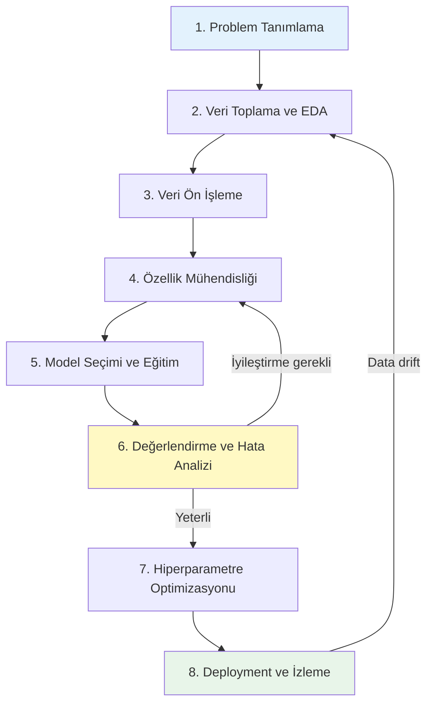
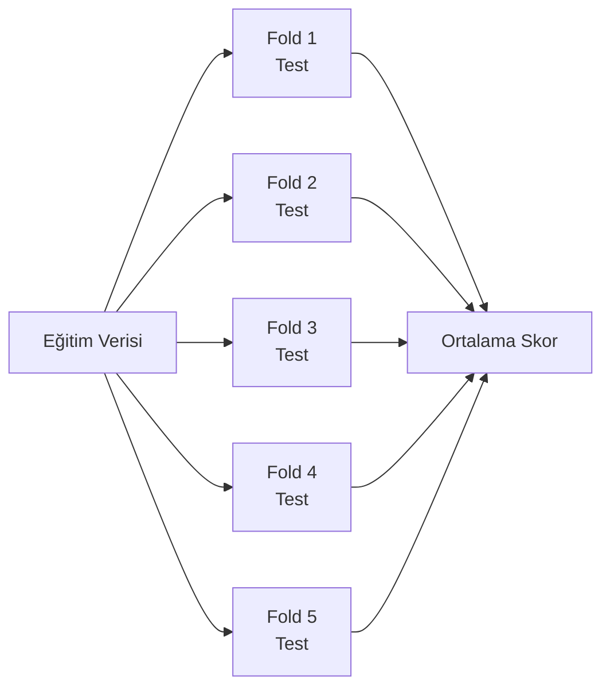

# Makine Öğrenimi İş Akışı

!!! note "Genel Bakış"
    Başarılı bir ML projesi güçlü bir algoritmadan çok; doğru problem tanımı, kaliteli veri ve sistematik değerlendirme sürecinin ürünüdür. Bu sayfa, ham fikirden production modeline uzanan uçtan uca akışı kapsar.



---

## 1. Problem Tanımlama

Model yazmadan önce cevaplanması gereken sorular:

| Soru | Önemi |
|------|-------|
| Çıktı sürekli mi, kategorik mi? | Regresyon mu, sınıflandırma mı? |
| Kaç sınıf var? İkili mi, çok sınıflı mı? | Loss ve metrik seçimini etkiler |
| Sınıflar dengeli mi? | Dengesiz veri stratejisi gerekebilir |
| Hangi hata daha maliyetli? FP mi FN mi? | Threshold ve metrik seçimi |
| Gerçek zamanlı inferans gerekiyor mu? | Model boyutu ve latency kısıtı |
| Yorumlanabilirlik zorunlu mu? | Kara kutu vs. şeffaf model |

!!! example "X ve Y Tanımı"
    **Ev fiyat tahmini:**  
    - X = [metrekare, oda sayısı, konum, bina yaşı, kat]  
    - Y = satış fiyatı (regresyon)
    
    **Spam tespiti:**  
    - X = [e-posta metni → özellikler]  
    - Y = 0 (ham) veya 1 (spam) (binary sınıflandırma)

---

## 2. Keşifsel Veri Analizi (EDA)

```python title="EDA — Temel Adımlar"
import pandas as pd
import numpy as np
import matplotlib.pyplot as plt
import seaborn as sns

df = pd.read_csv("data.csv")

# Genel bakış
print(df.shape)          # (satır, sütun)
print(df.dtypes)         # Sütun tipleri
print(df.describe())     # İstatistiksel özet

# Eksik değer analizi
missing = df.isnull().sum()
missing_pct = (missing / len(df)) * 100
print(pd.DataFrame({'Eksik': missing, 'Yüzde (%)': missing_pct}))

# Sınıf dağılımı (sınıflandırma)
df['target'].value_counts(normalize=True).plot(kind='bar')
plt.title("Sınıf Dağılımı")
plt.show()

# Sayısal özellik dağılımları
df.hist(figsize=(12, 8), bins=30)
plt.tight_layout()
plt.show()

# Korelasyon ısı haritası
plt.figure(figsize=(10, 8))
sns.heatmap(df.corr(), annot=True, fmt='.2f', cmap='coolwarm')
plt.show()

# Aykırı değer tespiti (IQR)
Q1 = df['feature'].quantile(0.25)
Q3 = df['feature'].quantile(0.75)
IQR = Q3 - Q1
outliers = df[(df['feature'] < Q1 - 1.5*IQR) | (df['feature'] > Q3 + 1.5*IQR)]
```

---

## 3. Veri Ön İşleme

### Eksik Veri Stratejileri

| Strateji | Ne Zaman | Kod |
|----------|:--------:|-----|
| Satırı sil | Eksik < %5 ve rastgele | `df.dropna()` |
| Medyan ile doldur | Sayısal, aykırı değer var | `df.fillna(df.median())` |
| Ortalama ile doldur | Sayısal, normal dağılım | `df.fillna(df.mean())` |
| Mod ile doldur | Kategorik | `df.fillna(df.mode()[0])` |
| Model ile tahmin | Yüksek eksik oran | `IterativeImputer` |

```python title="sklearn SimpleImputer"
from sklearn.impute import SimpleImputer, KNNImputer

# Medyan ile doldur
imp = SimpleImputer(strategy='median')
X_imputed = imp.fit_transform(X)

# KNN tabanlı doldurma (daha hassas)
knn_imp = KNNImputer(n_neighbors=5)
X_imputed = knn_imp.fit_transform(X)
```

### Ölçeklendirme (Scaling)

Mesafeye dayalı algoritmalar ve gradyan iniş için zorunludur. Ağaç tabanlı yöntemler için gerekli değildir.

=== "Min-Max Normalization"

    $$x' = \frac{x - x_{min}}{x_{max} - x_{min}} \in [0, 1]$$

    - Aykırı değerlere **duyarlı**
    - Görüntü pikselleri gibi bilinen aralıklarda iyi çalışır

    ```python
    from sklearn.preprocessing import MinMaxScaler
    scaler = MinMaxScaler()
    X_scaled = scaler.fit_transform(X_train)
    ```

=== "Standardizasyon (Z-Score)"

    $$x' = \frac{x - \mu}{\sigma}$$

    - Ortalama = 0, Standart sapma = 1
    - Aykırı değerlere **dayanıklı**
    - Gradyan iniş için tercih edilir

    ```python
    from sklearn.preprocessing import StandardScaler
    scaler = StandardScaler()
    X_scaled = scaler.fit_transform(X_train)
    X_test_scaled = scaler.transform(X_test)  # Aynı scaler ile!
    ```

=== "Robust Scaler"

    $$x' = \frac{x - Q_2}{Q_3 - Q_1}$$

    - Medyan ve IQR kullanır
    - Aykırı değerler varken **en güvenli** seçenek

    ```python
    from sklearn.preprocessing import RobustScaler
    scaler = RobustScaler()
    X_scaled = scaler.fit_transform(X_train)
    ```

!!! danger "Kritik Kural"
    `fit_transform()` yalnızca **eğitim verisine** uygulanır. Test ve validation setine yalnızca `transform()` uygulanır. Aksi hâlde **veri sızıntısı (data leakage)** oluşur ve gerçekçi olmayan performans elde edilir.

### Kategorik Veri Kodlama

```python
import pandas as pd
from sklearn.preprocessing import LabelEncoder, OrdinalEncoder
from sklearn.preprocessing import OneHotEncoder

# One-Hot Encoding (nominal — sırasız kategoriler)
# Renk: [Kırmızı, Mavi, Yeşil] → 3 sütun
ohe = OneHotEncoder(sparse_output=False, drop='first')  # drop='first' → multicollinearity engelle
X_encoded = ohe.fit_transform(df[['renk']])

# Pandas get_dummies alternatifi
df_encoded = pd.get_dummies(df, columns=['renk'], drop_first=True)

# Ordinal Encoding (sıralı kategoriler: küçük < orta < büyük)
oe = OrdinalEncoder(categories=[['küçük', 'orta', 'büyük']])
df['beden_encoded'] = oe.fit_transform(df[['beden']])

# Label Encoding (ağaç tabanlı modeller için yeterli)
le = LabelEncoder()
df['hedef_encoded'] = le.fit_transform(df['hedef'])
```

| Yöntem | Ne Zaman | Sütun Sayısı |
|--------|:--------:|:------------:|
| One-Hot | Nominal (ülke, renk) | +N sütun |
| Ordinal | Sıralı (beden, derece) | +1 sütun |
| Target Encoding | Yüksek kardinalite | +1 sütun |
| Hash Encoding | Çok yüksek kardinalite | Sabit |

---

## 4. Özellik Mühendisliği

Ham veriden bilgi çıkarmak için yeni özellikler türetmek, genellikle model seçiminden daha yüksek etki sağlar.

```python title="Özellik Türetme Örnekleri"
import pandas as pd

# Tarih parçalama
df['saat'] = pd.to_datetime(df['zaman']).dt.hour
df['gun_tipi'] = pd.to_datetime(df['tarih']).dt.weekday.apply(
    lambda x: 'hafta sonu' if x >= 5 else 'hafta içi')

# Oran ve fark özellikleri
df['fiyat_per_m2'] = df['fiyat'] / df['metrekare']
df['oda_bas_alan'] = df['metrekare'] / df['oda_sayisi']

# Polinom özellikler (non-lineer ilişkiler için)
from sklearn.preprocessing import PolynomialFeatures
poly = PolynomialFeatures(degree=2, include_bias=False)
X_poly = poly.fit_transform(X[['alan', 'oda']])

# Log dönüşümü (sağa çarpık dağılım)
df['log_fiyat'] = np.log1p(df['fiyat'])  # log(1+x) — sıfır güvenli

# Etkileşim özelliği
df['alan_x_kat'] = df['metrekare'] * df['kat']
```

### Özellik Seçimi

```python
from sklearn.feature_selection import SelectKBest, f_classif, RFE
from sklearn.ensemble import RandomForestClassifier

# Univariate — istatistiksel önem
selector = SelectKBest(score_func=f_classif, k=10)
X_selected = selector.fit_transform(X, y)

# Recursive Feature Elimination
rfe = RFE(estimator=RandomForestClassifier(), n_features_to_select=10)
X_rfe = rfe.fit_transform(X, y)

# Feature Importance (ağaç tabanlı)
rf = RandomForestClassifier().fit(X, y)
importance = pd.Series(rf.feature_importances_, index=feature_names)
importance.sort_values().plot(kind='barh')
```

---

## 5. Model Eğitimi

```python title="Scikit-Learn Temel Akış"
from sklearn.model_selection import train_test_split
from sklearn.ensemble import GradientBoostingClassifier
from sklearn.metrics import classification_report, confusion_matrix
import joblib

# Veri bölme
X_train, X_test, y_train, y_test = train_test_split(
    X, y, test_size=0.2, random_state=42, stratify=y
)

# Model eğitimi
model = GradientBoostingClassifier(
    n_estimators=200, learning_rate=0.05,
    max_depth=4, random_state=42
)
model.fit(X_train, y_train)

# Değerlendirme
y_pred = model.predict(X_test)
print(classification_report(y_test, y_pred))

# Kayıt
joblib.dump(model, 'model.joblib')
model_loaded = joblib.load('model.joblib')
```

---

## 6. Cross-Validation (Çapraz Doğrulama)

Tek bir eğitim/test bölmesi şansa bağlı olabilir. CV, modelin farklı veri alt kümelerinde tutarlılığını ölçer.

### k-Fold CV



```python
from sklearn.model_selection import cross_val_score, StratifiedKFold

cv = StratifiedKFold(n_splits=5, shuffle=True, random_state=42)
scores = cross_val_score(model, X, y, cv=cv, scoring='f1_weighted', n_jobs=-1)

print(f"F1: {scores.mean():.3f} ± {scores.std():.3f}")
```

| CV Yöntemi | Açıklama | Ne Zaman |
|------------|---------|:--------:|
| **k-Fold** | k parçaya böl | Büyük veri, regresyon |
| **Stratified k-Fold** | Sınıf oranını koru | Sınıflandırma |
| **Leave-One-Out** | N fold (her örnek test) | Çok küçük veri |
| **Time Series Split** | Zaman sırası koru | Zaman serisi |
| **Group k-Fold** | Grupları koru (hasta ID) | Sızdırmazlık kritik |

---

## 7. Hiperparametre Optimizasyonu

```python title="GridSearchCV"
from sklearn.model_selection import GridSearchCV

param_grid = {
    'n_estimators':   [100, 200, 500],
    'max_depth':      [3, 5, 7],
    'learning_rate':  [0.01, 0.05, 0.1],
    'min_samples_leaf': [1, 5, 10]
}

grid_search = GridSearchCV(
    GradientBoostingClassifier(),
    param_grid,
    cv=5,
    scoring='f1_weighted',
    n_jobs=-1,
    verbose=1
)
grid_search.fit(X_train, y_train)
print(f"En iyi parametreler: {grid_search.best_params_}")
print(f"En iyi skor: {grid_search.best_score_:.3f}")
```

```python title="Optuna — Bayesian Optimizasyon"
import optuna

def objective(trial):
    params = {
        'n_estimators':  trial.suggest_int('n_estimators', 50, 500),
        'max_depth':     trial.suggest_int('max_depth', 2, 8),
        'learning_rate': trial.suggest_float('learning_rate', 1e-3, 0.3, log=True),
    }
    model = GradientBoostingClassifier(**params, random_state=42)
    score = cross_val_score(model, X_train, y_train, cv=3, scoring='f1_weighted')
    return score.mean()

study = optuna.create_study(direction='maximize')
study.optimize(objective, n_trials=50)
print(study.best_params)
```

---

## 8. Pipeline — Sızıntısız Akış

```python title="sklearn Pipeline"
from sklearn.pipeline import Pipeline
from sklearn.compose import ColumnTransformer

# Sayısal ve kategorik sütunlar
num_features = ['metrekare', 'oda_sayisi', 'bina_yasi']
cat_features = ['konum', 'ısıtma_tipi']

num_transformer = Pipeline([
    ('imputer', SimpleImputer(strategy='median')),
    ('scaler', StandardScaler())
])

cat_transformer = Pipeline([
    ('imputer', SimpleImputer(strategy='most_frequent')),
    ('encoder', OneHotEncoder(drop='first', sparse_output=False))
])

preprocessor = ColumnTransformer([
    ('num', num_transformer, num_features),
    ('cat', cat_transformer, cat_features)
])

full_pipeline = Pipeline([
    ('preprocessor', preprocessor),
    ('model', GradientBoostingClassifier())
])

full_pipeline.fit(X_train, y_train)
y_pred = full_pipeline.predict(X_test)
```

---

## Dengesiz Sınıf Problemi

```python
# SMOTE ile sentetik azınlık üretme
from imblearn.over_sampling import SMOTE
from imblearn.pipeline import Pipeline as ImbPipeline

sm = SMOTE(random_state=42)
X_res, y_res = sm.fit_resample(X_train, y_train)

# Class weight ile ağırlıklandırma
from sklearn.utils.class_weight import compute_class_weight
weights = compute_class_weight('balanced', classes=np.unique(y), y=y)
model = GradientBoostingClassifier()
# veya RandomForestClassifier(class_weight='balanced')

# Threshold ayarı (default 0.5 değil)
y_prob = model.predict_proba(X_test)[:, 1]
threshold = 0.3   # Recall'u artır, Precision düşer
y_pred_custom = (y_prob >= threshold).astype(int)
```

---

## Model Yorumlanabilirliği (SHAP)

```python title="SHAP — Feature Importance"
import shap

explainer = shap.TreeExplainer(model)
shap_values = explainer.shap_values(X_test)

# Küresel önem
shap.summary_plot(shap_values, X_test, feature_names=feature_names)

# Tek tahmin açıklama (waterfall)
shap.plots.waterfall(explainer(X_test)[0])

# Beeswarm
shap.summary_plot(shap_values, X_test, plot_type='dot')
```

---

## XGBoost / LightGBM — Pratikte En Güçlü Tablo Modeli

```python title="XGBoost tam örnek"
import xgboost as xgb
from sklearn.model_selection import train_test_split
from sklearn.metrics import roc_auc_score

X_train, X_val, y_train, y_val = train_test_split(X, y, test_size=0.2)

dtrain = xgb.DMatrix(X_train, label=y_train)
dval   = xgb.DMatrix(X_val,   label=y_val)

params = {
    'objective':   'binary:logistic',
    'eval_metric': 'auc',
    'max_depth':   6,
    'eta':         0.05,
    'subsample':   0.8,
    'colsample_bytree': 0.8,
    'min_child_weight': 5,
    'seed': 42
}

model = xgb.train(
    params,
    dtrain,
    num_boost_round=1000,
    evals=[(dval, 'val')],
    early_stopping_rounds=50,
    verbose_eval=100
)

y_prob = model.predict(dval)
print(f"AUC: {roc_auc_score(y_val, y_prob):.4f}")
```

---

## Hızlı Başvuru — Algoritma Seçim Tablosu

| Problem | Veri | Başlangıç | Gelişmiş |
|---------|------|:---------:|:--------:|
| Binary Sınıflandırma | Tablo | Logistic Reg. | XGBoost, LightGBM |
| Çok Sınıflı | Tablo | Random Forest | XGBoost + OvR |
| Regresyon | Tablo | Linear Reg. | XGBoost, LightGBM |
| Kümeleme | Tablo | K-Means | DBSCAN, HDBSCAN |
| Görüntü Sınıflandırma | Görüntü | ResNet-50 ft | EfficientNet, ViT |
| Nesne Tespiti | Görüntü | YOLOv8 | DINO, DETR |
| Metin Sınıflandırma | Metin | TF-IDF + LR | BERT fine-tune |
| Metin Üretimi | Metin | GPT-2 | GPT-4, Llama |
| Zaman Serisi | Dizi | ARIMA | LSTM, Temporal Fusion |
| Anomali Tespiti | Tablo | Isolation Forest | Autoencoder |
