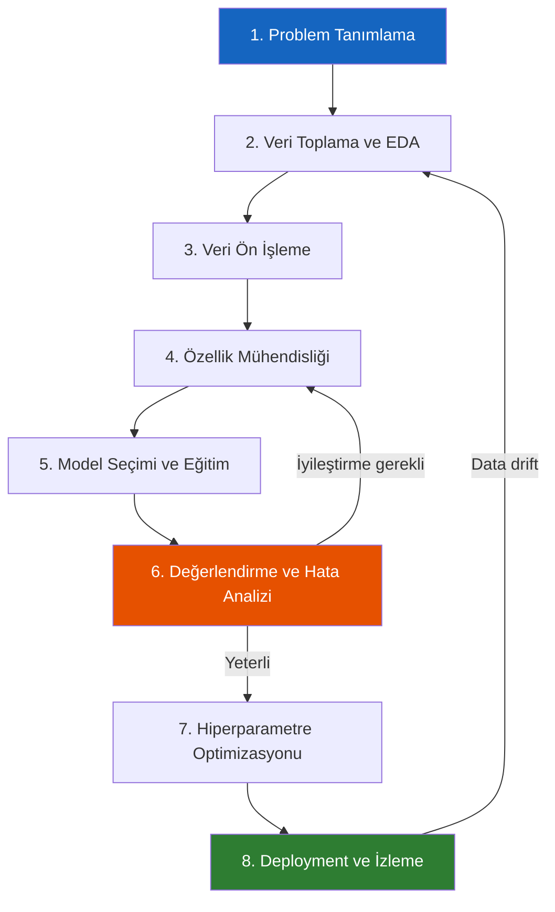
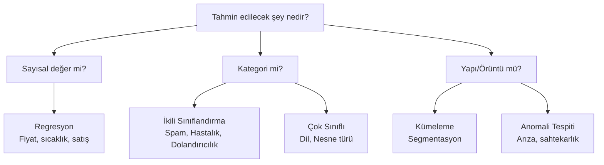
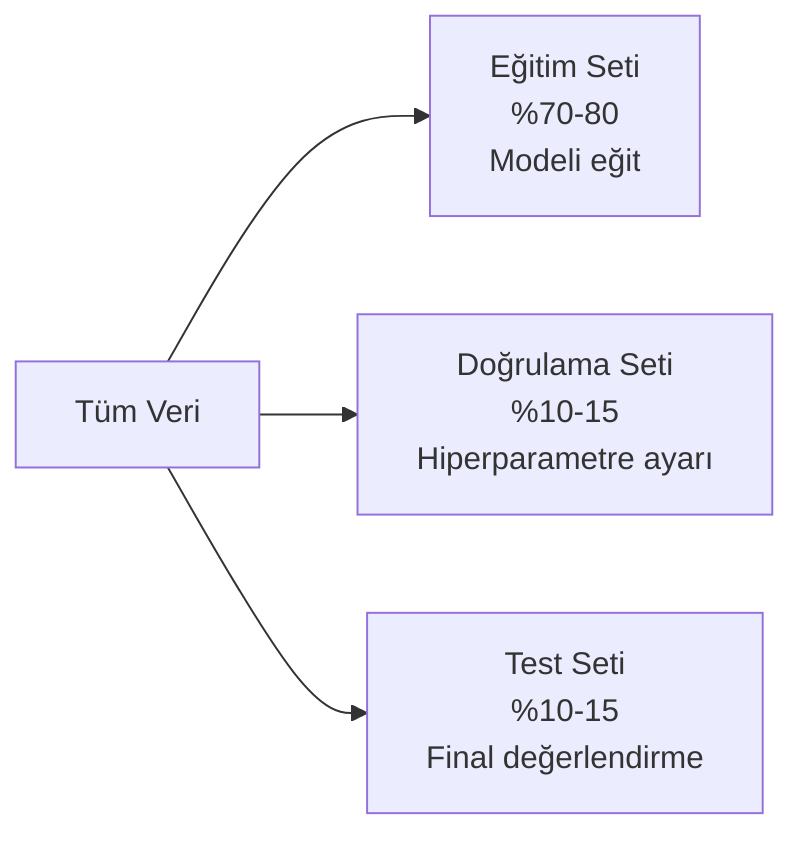
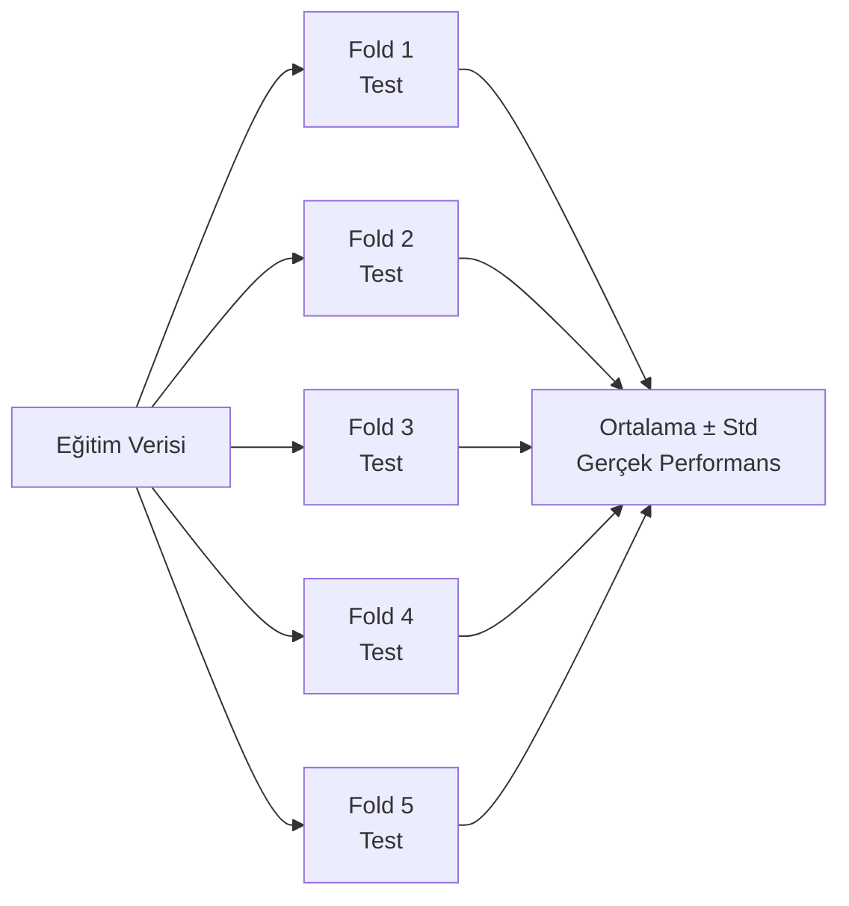
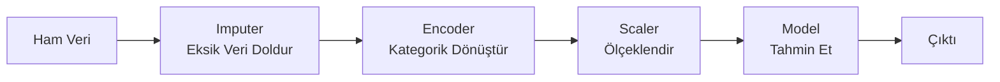

# Makine Öğrenimi İş Akışı

!!! note "Genel Bakış"
    Başarılı bir ML projesi güçlü bir algoritmadan çok; doğru problem tanımı, kaliteli veri ve sistematik değerlendirme sürecinin ürünüdür. Bu sayfa, ham fikirden production modeline uzanan uçtan uca akışı açıklar.

---

## 1. Problem Tanımlama

Bu adım, model yazmaktan önce gelir ve çoğu zaman en kritik adımdır. Yanlış soruyu doğru yanıtlamak işe yaramaz.

**Cevaplanması gereken sorular:**

| Soru | Neden Önemli |
|------|-------------|
| Çıktı sürekli mi, kategorik mi? | Regresyon mu, sınıflandırma mı? |
| Kaç sınıf var? İkili mi, çok sınıflı mı? | Loss fonksiyonu ve metrik seçimi |
| Sınıflar dengeli mi? | Dengesiz veri stratejisi gerekebilir |
| Hangi hata daha maliyetli? FP mi FN mi? | Threshold ve optimizasyon hedefi |
| Gerçek zamanlı inferans gerekiyor mu? | Model boyutu ve gecikme kısıtı |
| Yorumlanabilirlik zorunlu mu? | Kara kutu vs. şeffaf model |
| Başarı kriteri nedir? | Üretimde hangi metriği optimize edeceksiniz? |

**Problem türü nasıl belirlenir?**

!!! example "Problem Tanımı Örnekleri"
    **Ev fiyat tahmini:**
    - X = [metrekare, oda sayısı, konum, bina yaşı]
    - Y = satış fiyatı
    - Tür: **Regresyon** — sürekli sayısal çıktı
    - Başarı kriteri: RMSE < 50.000 TL, R² > 0.85
    
    **Kredi başvurusu değerlendirme:**
    - X = [gelir, borç oranı, kredi geçmişi, iş durumu]
    - Y = 0 (reddedilir) veya 1 (onaylanır)
    - Tür: **İkili Sınıflandırma**
    - Başarı kriteri: Recall > 0.9 (kötü müşteri kaçırma pahalı), Precision > 0.7

---

## 2. Keşifsel Veri Analizi (EDA)

Model kurmadan önce verinizi tanıyın. EDA, varsayımları doğrular, sorunları önceden görmenizi ve hangi özelliklerin önemli olduğu konusunda sezgi geliştirmenizi sağlar.

### EDA'da Yanıtlanacak Sorular

**Veri yapısı:**
- Kaç örnek var? Yeterli mi?
- Her özelliğin tipi ne? (sayısal, kategorik, tarih, metin)
- Hangi özelliklerde eksik veri var? Ne kadar?

**Dağılım analizi:**
- Sayısal özellikler normal dağılımlı mı? Çarpık mı?
- Aykırı değerler (outlier) var mı? Gerçek mi, veri hatası mı?
- Kategorik değişkenlerin kaç benzersiz değeri var? (kardinalite)

**İlişki analizi:**
- Özellikler hedefle ne kadar ilişkili?
- Özellikler kendi aralarında yüksek korelasyonlu mu? (multicollinearity)
- Hedef değişkenin sınıfları dengeli mi?

**Görsel araçlar:**

| Araç | Ne Gösterir |
|------|------------|
| Histogram | Tek değişken dağılımı |
| Box plot | Medyan, IQR, aykırı değerler |
| Scatter plot | İki değişken arasındaki ilişki |
| Correlation heatmap | Tüm değişken çiftleri arasındaki korelasyon |
| Pairplot | Her değişken çiftini beraber çizer |
| Bar/Count plot | Kategorik değişken frekansları |

!!! tip "EDA'nın Gücü"
    EDA sırasında bulunan içgörüler sizi doğru modele yönlendirir. "Sınıf dengesizliği %95/%5 oranında" → özel strateji gerekir. "X özelliği Y ile neredeyse mükemmel korelasyonda" → veri sızıntısı riski. "Belirli bir tarihten sonra dağılım değişiyor" → veri setini böl.

---

## 3. Veri Ön İşleme

Ham veri neredeyse hiçbir zaman doğrudan kullanılamaz. Eksik değerler, yanlış tipler, tutarsız biçimler, aykırı değerler — bunların hepsi model performansını bozar.

### Eksik Veri Stratejileri

Eksik veri **neden** eksik? Bu soruyu yanıtlamak stratejiyi belirler.

- **MCAR (Missing Completely at Random):** Tamamen rastgele eksik. Silmek güvenli.
- **MAR (Missing at Random):** Başka bir değişkene bağlı eksik. Diğer veriden tahmin edilebilir.
- **MNAR (Missing Not at Random):** Eksikliğin kendisi bilgi taşır. Dikkatli yaklaşım gerekir.

| Strateji | Ne Zaman | Nasıl |
|----------|:--------:|-------|
| **Satırı sil** | Eksik < %5, MCAR ise | `dropna()` |
| **Medyan ile doldur** | Sayısal, outlier var | Outlier'a dayanıklı |
| **Ortalama ile doldur** | Sayısal, normal dağılım | Basit ve hızlı |
| **Mod ile doldur** | Kategorik | En sık görülen değeri ata |
| **Model ile tahmin** | Yüksek eksik oran, MAR | KNN Imputer, Iterative Imputer |
| **Eksik bayrağı ekle** | MNAR olabilir | Yeni binary özellik: "bu_eksik_mi" |

!!! warning "Veri Sızıntısı (Data Leakage)"
    Test verisinin istatistiklerini (ortalama, medyan) kullanarak eğitim verisini doldurursanız, model gerçek dünyada göremeyeceği bilgiye erişmiş olur. Tüm doldurma işlemleri **sadece eğitim verisine** fit edilmeli, test verisine uygulanmalıdır.

### Ölçeklendirme (Feature Scaling)

Bazı algoritmalar özelliklerin büyüklük sırasına duyarlıdır. 1000 TL'lik bir özellik ile 0-1 arasındaki bir özellik varsa, gradyan iniş 1000 TL'liğe doğru yanlı olur.

**Ölçeklendirme kimler için gereklidir?**
- Mesafeye dayalı: KNN, SVM, K-Means
- Gradyan iniş kullanan: Lojistik Regresyon, Sinir Ağları
- Düzenlilik kullanan: Ridge, Lasso

**Ölçeklendirme kimler için gerekmez?**
- Ağaç tabanlı: Karar Ağacı, Random Forest, XGBoost — bölme noktaları ölçekten bağımsızdır.

=== "Min-Max Normalizasyon"

    $$x' = \frac{x - x_{min}}{x_{max} - x_{min}} \in [0, 1]$$

    Tüm değerleri [0, 1] aralığına sıkıştırır. Aykırı değerlere **çok duyarlı** — bir outlier tüm dağılımı sıkıştırır. Görüntü pikselleri gibi bilinen sabit aralıklarda kullanımı idealdir.

=== "Standardizasyon (Z-Score)"

    $$x' = \frac{x - \mu}{\sigma}$$

    Ortalama 0, standart sapma 1 yapılır. Aykırı değerlere **dayanıklı** — outlier varlığında Min-Max'tan üstün. Gradyan iniş optimizasyonu için en yaygın tercih.

=== "Robust Scaler"

    $$x' = \frac{x - Q_2}{Q_3 - Q_1}$$

    Medyan (Q2) ve IQR (Q3-Q1) kullanır. Ortalama ve std'ye göre çok daha dayanıklı. Aykırı değerlerin yoğun olduğu veri setlerinde en güvenli seçenek.

### Kategorik Veri Kodlama

Makine öğrenimi modelleri sayısal girdi bekler. Kategorik değerleri sayıya çevirmek gerekir.

**One-Hot Encoding:** Sırasız kategorik değişkenler için. Her kategori ayrı bir ikili (0/1) sütun olur.

- "Renk: Kırmızı/Mavi/Yeşil" → üç ayrı sütun: renk_kirmizi, renk_mavi, renk_yesil
- `drop='first'` ile multicollinearity önlenir: üç sütun yerine iki yeterli (üçüncü ikisinin toplamından çıkar)
- **Yüksek kardinalitede sakınca:** 1000 farklı şehir → 1000 sütun. Bu durumda Target Encoding veya Hash Encoding tercih edilir.

**Ordinal Encoding:** Sıralı kategoriler için. Büyüklük sırası korunur.

- "Beden: küçük < orta < büyük" → 0, 1, 2 olarak kodlanır
- Ağaç tabanlı modeller bu sıralamayı otomatik kullanır

**Label Encoding:** Hedef değişken veya ağaç tabanlı modeller için. 0, 1, 2... olarak atar ama sıra varsayımı içerebilir.

**Target Encoding:** Yüksek kardinaliteli değişkenler için. Her kategori, o kategoriye ait hedef değişkenin ortalamasıyla kodlanır. Güçlü ama veri sızıntısı riski yüksek — cross-validation ile dikkatli uygulanmalı.

---

## 4. Özellik Mühendisliği

Ham veriden bilgi çıkarmak için yeni özellikler türetmek, genellikle model seçiminden daha yüksek etki sağlar. Aynı veri, farklı özelliklerle çok farklı model performansı verir.

### Özellik Türetme

**Tarih/Zaman özellikleri:**
Ham tarih tek başına anlamsızdır. Ancak türetilen özellikler güçlüdür:

- Saatin günün hangi bölümüne denk geldiği (sabah, öğleden sonra, gece)
- Haftanın günü (Pazartesi sabahı vs Cuma akşamı tamamen farklı davranışlar)
- Mevsim, tatil mi değil mi, ay sonu mu
- Son satın almadan geçen gün sayısı

**Oran ve fark özellikleri:**
- "Fiyat / Metrekare" → Gerçek değer oranı, ham fiyattan daha anlamlı
- "Bugünkü satış - Dünkü satış" → Değişim hızı (trend)
- "Müşteri yaşı / Hesap yaşı" → Orantısal karşılaştırma

**Log dönüşümü:**
Sağa çarpık dağılımlarda (fiyat, gelir, nüfus) log dönüşümü uygulanır. Log(0) undefined olduğu için `log(1 + x)` güvenli versiyondur. Bu dağılımı normalleştirip modelin daha iyi öğrenmesini sağlar.

**Etkileşim özellikleri:**
İki değişkenin birlikte etkisi bazen ayrı etkilerinden farklıdır. "Alan × Konum" kombinasyonu her ikisinden bağımsız bilgi taşıyabilir.

**Polinom özellikler:**
İlişki doğrusal değilse, x² veya x³ gibi polinom terimler eklemek modelin eğri ilişkileri öğrenmesini sağlar.

### Özellik Seçimi

Her özellik modele bilgi katmaz. Gereksiz özellikler:
- Modeli yavaşlatır
- Overfitting riskini artırır
- Yorumlanabilirliği azaltır

**Filtre Yöntemleri:** İstatistiksel bağımsızlık testleri (korelasyon, chi-kare, ANOVA). Her özelliği hedefle bağımsız olarak değerlendirir. Hızlı ama özellikler arası etkileşimi dikkate almaz.

**Sarmalayıcı Yöntemler (Wrapper):** Özellik alt kümesini model üzerinde test eder. Geriye doğru eliminasyon: tüm özelliklerle başla, en az etkiyi kaldır, tekrar et. İleri seçim: boştan başla, en çok katkı sağlayanı ekle, tekrar et. Doğru ama yavaş.

**Gömülü Yöntemler (Embedded):** Model eğitimi sırasında özellik seçimi yapar. L1 regularizasyon (Lasso) gereksiz özelliklerin ağırlığını sıfırlar. Random Forest ve XGBoost feature importance skorları üretir.

---

## 5. Model Seçimi ve Eğitim

### Baseline Model

Her ML projesine basit bir baseline ile başlayın. Karmaşık model eklemeden önce ne kadar kazanacağınızı bilesiniz.

- **Regresyon baseline:** Hedefin ortalamasını her zaman tahmin et. RMSE bu çıta.
- **Sınıflandırma baseline:** Her zaman çoğunluk sınıfını tahmin et. Accuracy bu çıta.
- **Basit model baseline:** Lojistik Regresyon veya Decision Tree. Bunları geçemeyen karmaşık model anlamsız.

**Neden baseline önemli?** Eğer karmaşık XGBoost modeliniz basit ortalamanın sadece %2 üstündeyse, ek karmaşıklık değmeyebilir.

### Model Seçim Rehberi

| Veri Türü | Küçük Veri (< 1 K) | Orta Veri (1 K – 100 K) | Büyük Veri (> 100 K) |
|-----------|:-----------------:|:----------------------:|:-------------------:|
| **Tablo** | Lojistik Reg., Ridge | Random Forest, XGBoost | XGBoost, LightGBM, NN |
| **Görüntü** | Transfer Learning (dondur) | Transfer Learning (fine-tune) | CNN sıfırdan veya büyük fine-tune |
| **Metin** | TF-IDF + LojistikReg | BERT (son katman) | BERT fine-tune |
| **Zaman Serisi** | ARIMA, basit baseline | LSTM, Prophet | Temporal Fusion, LSTM |

### Eğitim Süreci

Veriyi üç parçaya bölün:

- **Eğitim seti:** Model bu veriden öğrenir. Hiç görmediği test verisini tahmin etmesi beklenir.
- **Doğrulama seti:** Hiperparametre seçimi ve early stopping için. Model bu veriden öğrenmez, sadece izler.
- **Test seti:** Sadece final değerlendirmede bir kez kullanılır. Defalarca test ederseniz test setine overfit edersiniz!

!!! danger "Kritik Kural: Data Leakage"
    Test seti eğitim sürecinin hiçbir aşamasında kullanılmamalıdır. Scaler'ı sadece eğitim setine fit edin. Imputer'ı sadece eğitim setine fit edin. Test seti sadece son değerlendirmede görünür — "sanki gerçek dünyadan yeni gelen veri" gibi.

---

## 6. Cross-Validation (Çapraz Doğrulama)

Tek bir eğitim/test bölmesi şansa bağlı olabilir — verinin hangi örneklerin test setine düştüğüne göre sonuç değişir. Cross-validation bu problemi çözer.

### k-Fold Cross-Validation

**Nasıl çalışır?** Veri k parçaya bölünür. Her tur bir parça test, geri kalanı eğitim olarak kullanılır. k tur sonunda k ayrı skor elde edilir — ortalaması gerçek genelleme hatasının tarafsız tahminidir.

**k değeri seçimi:** k=5 veya k=10 yaygındır. k büyüdükçe tahmin daha doğru ama hesaplama yavaşlar.

| CV Yöntemi | Açıklama | Ne Zaman |
|------------|---------|:--------:|
| **k-Fold** | k parçaya böl, her biri bir kez test | Genel amaç |
| **Stratified k-Fold** | Sınıf oranını her parçada koru | **Sınıflandırma (zorunlu)** |
| **Leave-One-Out** | N=k, her örnek bir kez test | Çok küçük veri |
| **Time Series Split** | Zaman sırasını korur: geçmişle eğit, geleceği test et | Zaman serisi |
| **Group k-Fold** | Aynı gruba ait örnekler aynı katta | Hasta ID, kullanıcı ID — sızıntı önleme |

**CV nasıl yorumlanır?** `F1: 0.847 ± 0.023` → ortalama F1 0.847, standart sapma 0.023. Düşük std: model kararlı. Yüksek std: modelin performansı veriye çok bağımlı, daha fazla veri veya daha güçlü regularizasyon gerekebilir.

---

## 7. Değerlendirme ve Hata Analizi

Metrikler yeterli değil — *neyin* yanlış gittiğini anlamak gerekir.

### Hata Analizi

**Yanlış sınıflandırmaları incele:**
- Hangi sınıflar birbirine karışıyor? (Confusion Matrix)
- Yanlış tahmin edilen örnekler arasında ortak özellik var mı?
- Model tutarsız mı? (Benzer örnekler farklı tahminler)
- Aykırı değerler mi yanlış tahmin ediliyor?

**Güven kalibrasyonu:**
Model "%95 pozitif dedi" örneklerin gerçekten %95'i pozitif mi? Kötü kalibre model yüksek güven verip yanılır. Calibration Curve bunu gösterir.

**Hata dağılımı (Regresyon):**
- Hatalar rastgele dağılıyor mu? Belirli bir değer aralığında sistematik hata var mı?
- Büyük değerlerde daha fazla hata mı? (Heterokedastiklik)

### Metrik Çelişkileri

Bazı durumlarda metrikler çakışır:

| Durum | Sorun | Çözüm |
|-------|-------|-------|
| Yüksek Accuracy, düşük Recall | Dengesiz sınıf — çoğunluğu her zaman doğru söylüyor | F1, ROC-AUC kullan; class weight ekle |
| Yüksek eğitim F1, düşük test F1 | Overfitting | Regularizasyon, daha fazla veri |
| CV F1 iyi, production F1 kötü | Distribution shift | Production verisiyle CV yap |

---

## 8. Hiperparametre Optimizasyonu

Model parametrelerini (ağırlıklar) model öğrenir. Ama hiperparametreleri (kaç ağaç, ne kadar regularizasyon) siz belirlersiniz. Optimizasyon bu seçimi sistematik yapar.

**Önemli nokta:** Hiperparametre optimizasyonu her zaman **validation seti** üzerinde yapılır. Test seti hiç görülmez.

### Grid Search

Önceden belirlenmiş değerlerin tüm kombinasyonlarını dener.

- `n_estimators: [100, 200, 500]`, `max_depth: [3, 5, 7]` → 9 kombinasyon
- Kapsamlı ama yavaş. Her kombinasyon için tam CV çalışır.
- Küçük arama uzayında iyidir.

### Random Search

Belirlenen aralıktan rastgele kombinasyonlar dener.

- Grid Search'ten çoğunlukla daha verimli. Neden?
- Bazı hiperparametrelerin etkisi küçüktür. Random Search, önemli olanları daha fazla değerde test eder.
- n_iter kadar kombinasyon dener — bütçeyle kontrol edilir.

### Bayesian Optimizasyon (Optuna, Hyperopt)

Önceki denemelerin sonuçlarından öğrenerek bir sonraki denemeyi akıllıca seçer. "Bu bölgede iyi sonuçlar alındı, buraya odaklan."

- Grid/Random Search'ten çok daha verimli.
- Büyük ve pahalı arama uzaylarında standart.
- Erken durdurma (Pruning): Ümitsiz kombinasyonları yarıda keser.

### Hangi Hiperparametreler Önemli?

Her model için kritik hiperparametreler farklıdır:

| Model | En Kritik Hiperparametreler |
|-------|:--------------------------:|
| **Random Forest** | n_estimators, max_depth, min_samples_leaf |
| **XGBoost** | learning_rate, n_estimators, max_depth, subsample |
| **Sinir Ağı** | learning_rate, batch_size, architecture, dropout |
| **SVM** | C, kernel, gamma |
| **Ridge/Lasso** | alpha (λ) |

---

## 9. Dengesiz Sınıf Problemi

Veri setinde bir sınıf çok az örnekle temsil edilebilir. Kredi dolandırıcılığı (%0.1 pozitif), hastalık tespiti (%2 hasta), üretim hatası (%0.5 hatalı). Standart yaklaşımlar başarısız olur.

### Neden Sorun?

Model veriyi eğitim için kullanır. %99 negatif varsa, model "her şeye negatif de" stratejisi benimseyip %99 Accuracy elde eder. Ama tek bir pozitifi bulamamış olabilir — ki bu tam anlamıyla işe yaramayan bir modeldir.

### Çözüm Stratejileri

**1. Doğru Metrik Seç**

Dengesiz veri setinde Accuracy anlamsız. Bunlar yerine kullanılacaklar:
- F1-Score (özellikle azınlık sınıfı için)
- ROC-AUC
- Precision-Recall AUC (dengesiz veri için ROC'tan daha bilgilendirici)

**2. Sınıf Ağırlığı (Class Weight)**

Model eğitiminde azınlık sınıfına daha yüksek ağırlık verin. Azınlık sınıfı hatasını daha fazla cezalandırır. Çoğu sklearn modelinde `class_weight='balanced'` parametresi otomatik hesaplar.

**3. Örnekleme Teknikleri**

- **Oversampling:** Azınlık sınıfını çoğalt. En basit yol: rastgele kopyala. Daha gelişmişi: **SMOTE** — azınlık örnekleri arasında enterpolasyonla sentetik yeni örnekler üret.
- **Undersampling:** Çoğunluk sınıfından örnekleri at. Bilgi kaybı riski. NearMiss algoritması en bilgilendirici örnekleri tutar.
- **Combined:** İkisini birlikte kullan — azınlığı artır, çoğunluğu azalt.

**4. Karar Eşiğini Ayarla**

Model 0.5 varsayılan eşiği kullanır. "0.3'ten büyükse pozitif say" diyerek Recall artırılır, Precision düşer. ROC eğrisinde Precision-Recall dengesine göre uygulama gereksinimini karşılayan eşik seçilir.

---

## 10. Pipeline — Temiz ve Sızıntısız Akış

Veri ön işleme, özellik mühendisliği ve model adımlarını tek bir zincire bağlamak:

**Neden Pipeline gerekir?**
- Test verisine fit etme hatasını önler (scaler, imputer sadece eğitim verisine fit edilir)
- Cross-validation'da her fold için tüm adımlar tekrar edilir — sızıntı imkânsız
- Deployment'ta tek bir nesne tüm akışı kapsar: yeni veri girince dönüşüm + tahmin otomatik

Sayısal ve kategorik sütunlar farklı işlemlerden geçer; **ColumnTransformer** bunları paralel uygular. Ardından model eklenir. Bu zincir cross-validation, Grid Search ve production'da aynı şekilde çalışır.

---

## 11. Model Yorumlanabilirliği (SHAP)

Modelin neden bu tahmini yaptığını anlamak üç şey için kritiktir:
1. **Güven inşası:** "Model ne öğrendi?" sorusuna cevap vermek
2. **Hata ayıklama:** "Model neden bu örnekte yanıldı?"
3. **Regülasyon:** Finans, sağlık, hukuk gibi alanlarda karar açıklanmalı

### SHAP (SHapley Additive exPlanations)

Oyun teorisinden türeyen SHAP, her özelliğin her tahmine katkısını hesaplar.

**Global açıklama (Summary Plot):** Tüm veri setinde hangi özellik ne kadar önemli, nasıl etkiliyor. "Yaş değeri yüksekse pozitif tahmine katkısı yüksek."

**Yerel açıklama (Waterfall / Force Plot):** Tek bir tahmin için her özelliğin katkısı. "Bu müşteri için kredi ret nedeni: borç oranı yüksek (+0.4), gelir düşük (+0.3), kredi geçmişi iyi (-0.1)."

**Bağımlılık grafikleri (Dependence Plot):** Bir özellik değiştiğinde SHAP değeri nasıl değişiyor. Etkileşim var mı?

| SHAP Avantajı | Alternatifler |
|:-------------:|:-------------:|
| Model agnostik (her model için) | Feature Importance (sadece ağaç) |
| Yerel + global açıklama | Permutation Importance (sadece global) |
| Matematiksel garanti (Shapley değerleri tutarlı) | LIME (yaklaşık, tutarsız olabilir) |
| Etkileşim tespiti | Partial Dependence Plot (tek özellik) |

---

## Hızlı Başvuru — Algoritma Seçim Tablosu

| Problem | Veri | Başlangıç | Gelişmiş |
|---------|------|:---------:|:--------:|
| Binary Sınıflandırma | Tablo | Logistic Regression | XGBoost, LightGBM |
| Çok Sınıflı | Tablo | Random Forest | XGBoost + One-vs-Rest |
| Regresyon | Tablo | Ridge Regression | XGBoost, LightGBM |
| Kümeleme | Tablo | K-Means | DBSCAN, HDBSCAN |
| Görüntü Sınıflandırma | Görüntü | ResNet-50 transfer | EfficientNet, ViT |
| Nesne Tespiti | Görüntü | YOLOv8 | DINO, DETR |
| Metin Sınıflandırma | Metin | TF-IDF + LR | BERT fine-tune |
| Metin Üretimi | Metin | GPT-2 | GPT-4, Llama |
| Zaman Serisi | Dizi | ARIMA | LSTM, Temporal Fusion |
| Anomali Tespiti | Tablo | Isolation Forest | Autoencoder |
