## X ve Y Kavramı

- **X (Bağımsız Değişkenler / Features):** Modelin girdi olarak kullandığı özelliklerdir.
- **Y (Bağımlı Değişken / Target):** Modelin tahmin etmeye çalıştığı çıktıdır.

- **Örnek Ev Fiyat Tahmini:** X (metrekare, oda sayısı, konum, bina yaşı) -> Y (ev fiyatı)  

!!! note "Not"
    Modelin başarısı, yalnızca algoritmaya değil; X ve Y’nin doğru tanımlanmasına doğrudan bağlıdır.

---

## Cross‑Validation
- Cross‑Validation, makine öğrenimi modellerinin genelleme yeteneğini (overfitting’i önleyerek gerçek dünyada nasıl performans göstereceğini) değerlendirmek için yaygın olarak kullanılan bir tekniktir. Temel adımlar şöyle işler: 
    - **Veri Kümesini Parçalara Bölme**
        - En yaygın yöntem **k‑fold** cross‑validation’dır: Veri seti eşit büyüklükte k parçaya (fold) bölünür.
        - Örneğin `k = 5` ise, veri beş parçaya ayrılır.
    - **Eğitim ve Test Döngüleri**
        - Her seferinde bu k parçadan biri test seti, kalan `k – 1` parça eğitim seti olarak kullanılır.
        - Toplam k farklı model eğitilir ve test edilir.
    - **Performans Ölçümü**
        - Her döngü için hata veya skor metriği (örn. doğruluk, MSE, R²) hesaplanır.
        - Tüm k sonuç ortalanarak nihai performans tahmini elde edilir.
    - **Avantajları**
        - Veri setindeki rastgele bölünmelere bağlı sapmayı azaltır.
        - Modelin farklı alt kümelerde nasıl davrandığına dair kapsamlı bilgi sunar.
        - Özellikle küçük veri setlerinde daha güvenilir bir değerlendirme sağlar.

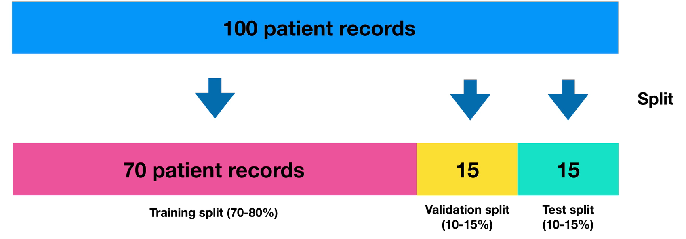

| Yöntem	 | Açıklama |
|----------|-----------|
| k‑Fold	| Veri k parçaya bölünür ve k kez eğitim/test yapılır. |
| Stratified k‑Fold |	Özellikle sınıflandırmada, her fold’da sınıf oranlarını korur. |
| Leave-One-Out |	k = N (her örnek bir fold); her model tek bir örnek test eder. |
| Shuffle Split	 | Rastgele bölme ve tekrarlama; her döngüde farklı rastgele bölme. |

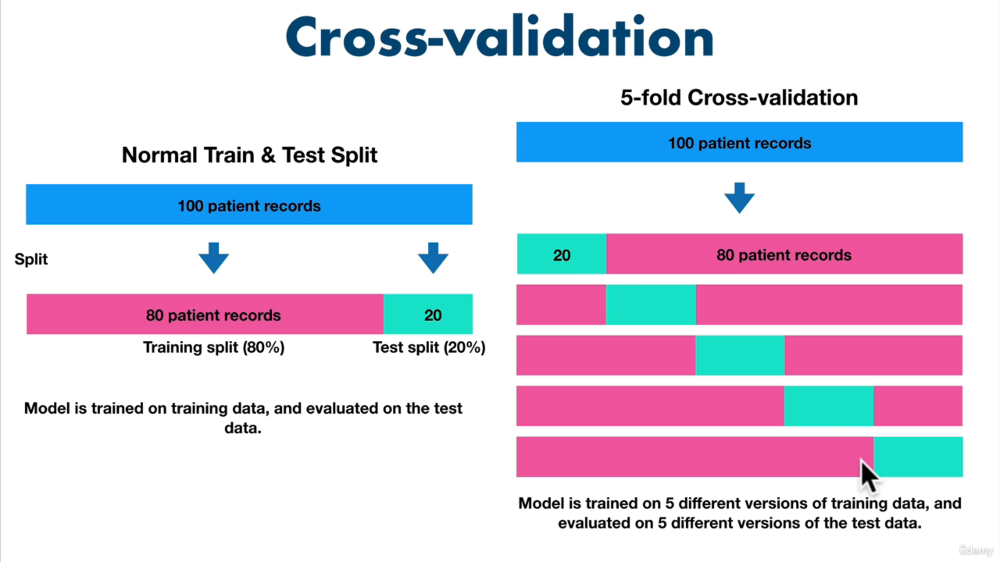

- **Genelleme Hatalarını Ölçer:** Tek seferlik eğitim/test bölünmesine kıyasla daha istikrarlı metrikler sağlar.
- **Model Seçimi:** Farklı hiperparametrelerin karşılaştırılmasında güvenilir sonuç verir.
- **Küçük Veri Setleri:** Sınırlı veri olduğunda, her örnek hem eğitim hem test için kullanılarak veri verimli değerlendirilir.

!!! note "Not"
    Bu yöntemle, modelinizin Coefficient of Determination (`R²`), doğruluk veya diğer metriklere dayalı performans tahmininiz daha güvenilir ve tekrarlanabilir hale gelir.

## Veri Hazırlama 

Model performansını en çok etkileyen aşama, veri hazırlamadır. Tipik akış aşağıdaki gibidir:

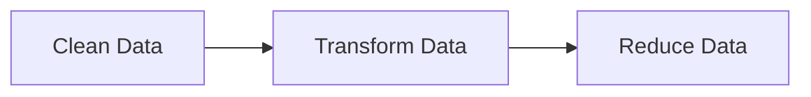

1. **Clean Data (Veri Temizleme):** 
    - Eksik değerlerin giderilmesi veya silinmesi
    - Tutarsız birimlerin normalize edilmesi (ör. m², kg)
    - Hatalı veya anlamsız kayıtların ayıklanması
    - Kategorik etiketlerin düzenlenmesi

2. **Transform Data (Veri Dönüştürme):**
    - Log / ölçek dönüşümleri
    - Tarih alanlarının parçalanması
    - Kategorik verilerin sayısal temsile çevrilmesi
    - Özellik dağılımlarının dengelenmesi

3. **Reduce Data (Veri Azaltma):**
    - Sabit veya anlamsız kolonların kaldırılması (ID, hash vb.)
    - Yüksek korelasyonlu özelliklerin azaltılması
    - Boyut indirgeme yaklaşımları

## Yaygın Ölçeklendirme Yöntemleri

### Normalization (Min–Max)

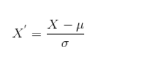

- Özellikleri 0–1 aralığına sıkıştırır
- Karşılaştırmayı kolaylaştırır
- Aykırı değerlere duyarlıdır

### Standardization (Z-Score)
- Ortalama = 0, standart sapma = 1
- Aykırı değerlere daha dayanıklıdır
- Dağılım varsayımı içerir

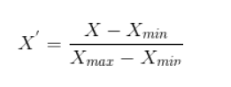

## Kategorik Veriler ve One-Hot Encoding

Kategorik değişkenler doğrudan sayısal işlemlere uygun değildir. Bu nedenle binary temsile dönüştürülür.

- Her kategori ayrı bir sütun
- Varlık: 1, yokluk: 0

- **Avantaj:** Mesafeye dayalı algoritmalar için doğru temsil
- **Dezavantaj:**Çok kategori → boyut patlaması

| Renk	| Kırmızı	| Mavi |	Yeşil | 
|----|--------------|------|---------|
| Kırmızı	| 1 | 	0	| 0 | 
| Mavi	| 0	| 1 | 	0 | 
| Yeşil	| 0	| 0 |	1 | 

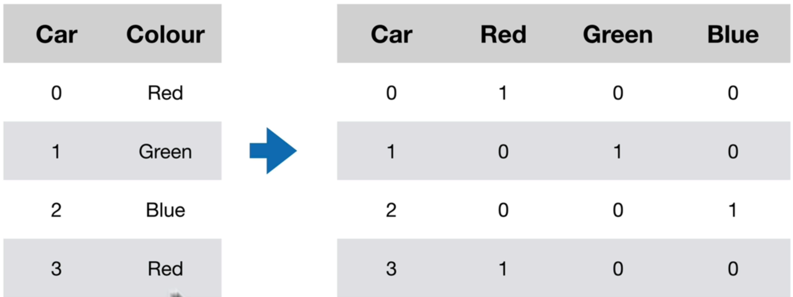

## Algoritmalar

### Feature Scaling
- Farklı aralıklardaki özellikler, **gradyan iniş** gibi optimizasyon tabanlı algoritmalarda öğrenme hızını ve kararlılığı bozar. İki yaygın yöntem:

### Gradyan İniş Tabanlı Algoritmalar
- Linear regression, logistic regression, sinir ağları, PCA vb. modeller gradyan iniş ile parametrelerini günceller. Özellik aralıkları farklı olduğunda:
    - Büyük değerli özellikler çok küçük adımlarla güncellenir,
    - Küçük değerli özellikler çok büyük adımlarla güncellenir,
    - Sonuçta öğrenme yavaşlar veya dengesizleşir.
- Bu yüzden tüm özellikleri aynı ölçeğe getirmek, gradyan inişin minimuma hızlı ve dengeli yakınsamasını sağlar.

### Distance‑Based
- Özellikler arası mesafeye duyarlıdır
- Ölçeklendirme **zorunludur**
- **Örnek kullanım alanı:** Benzerlik, kümelenme, yakın komşuluk

- **Örnek Algoritmalar:**
    - **K‑NN (K‑Nearest Neighbors):** Sınıflandırma ve regresyon için en yakın K komşuyu kullanır.
    - **K‑means:** Veri kümesini K kümeye ayırır, merkezine en yakın noktaları bulur.
    - **SVM (Support Vector Machines):** Sınıflandırma için hiperdüzlemler oluşturur; mesafe ölçüsüne duyarlıdır.
- **Neden Ölçeklendirme?**
    - İki özellik farklı aralıklardaysa (örneğin not ortalaması 0–5, gelir 0–100 000), gelir özelliği mesafeyi domine eder.
    - **Öklidyen mesafe** gibi metrikler, tüm özellikleri eşit katkıda bulunacak şekilde normalizasyon gerektirir.

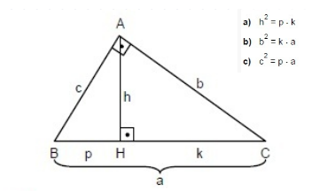

---

### Tree‑Based Algoritmalar
- Ağaç tabanlı modeller, hem sınıflandırma hem de regresyon problemlerinde en popüler yöntemlerden biridir. Doğrusal olmayan ilişkileri kolayca yakalar ve özellik ölçeğine duyarsızdır.
- Karakteristik Özellikler:
    - **Split (Bölme) Kriteri:** Her düğümde, veri setini en homojen alt kümelere ayıran tek bir özelliğe göre bölme.
    - **Özellik Ölçeğine Duyarsızlık:** Tek bir özelliğe dayalı böldüğü için, diğer özelliklerin değer aralıkları bölme kararını etkilemez.
    - **Kararlılık & Yorumlanabilirlik:** Model yapısı ağaç grafiği şeklinde görselleştirilebilir.
- Örnek Algoritmalar:
    - **Decision Tree:** Tek bir ağaç yapısı kullanır.
    - **Random Forest:** Birden çok karar ağacından oluşan topluluk yöntemi.
    - **Gradient Boosted Trees:** Ardışık ağaçlarla hatayı azaltan güçlendirme yöntemi.

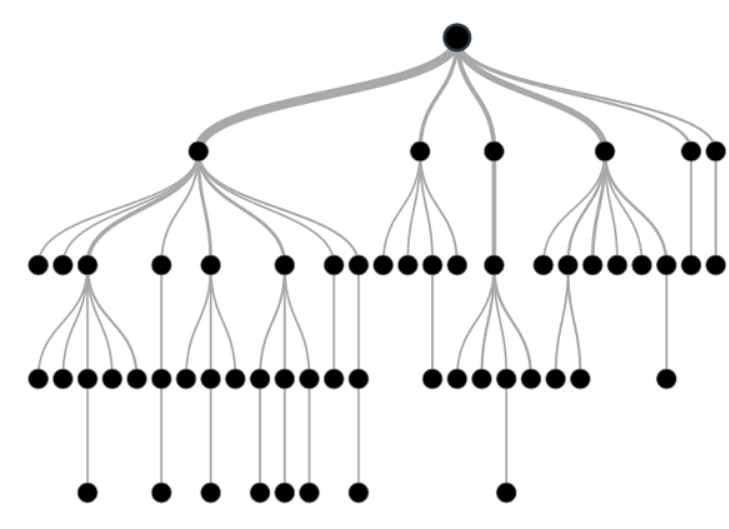

!!! note    "Not"
    Mesafeye dayalı algoritmalarda mutlaka ölçeklendirme yapın.
    Ağaç tabanlı algoritmalar ise ölçekleme gerektirmez; farklı aralıklardaki özellikleri doğrudan kullanabilir.

---

### Yaygın Yöntemler

| Yöntem | Açıklama |
|------|---------|
| k-Fold | Veri k parçaya bölünür, her parça test edilir |
| Stratified k-Fold | Sınıf oranları korunur |
| Leave-One-Out | Her örnek tek başına test edilir |
| Shuffle Split | Rastgele ve tekrarlı bölme |

> Özellikle küçük veri setlerinde cross-validation kritik öneme sahiptir.

---

### One‑Hot Encoding
- Kategorik değişkenleri (örneğin renkler) binary sütunlara dönüştürür. Her kategori için bir sütun oluşturulur; o kategori var ise 1, yok ise 0 ile gösterilir:

| Renk	| Kırmızı	| Mavi |	Yeşil | 
|----|--------------|------|---------|
| Kırmızı	| 1 | 	0	| 0 | 
| Mavi	| 0	| 1 | 	0 | 
| Yeşil	| 0	| 0 |	1 | 

- **Avantaj:** Mesafeye dayalı algoritmalarda doğru mesafe ölçümü sağlar.
- **Dezavantaj:** Çok sayıda kategori varsa boyut patlamasına (high dimensionality) yol açabilir.

## Decision Tree (Karar Ağacı)
- Hem sınıflandırma hem de regresyon görevlerinde kullanılan, parametrik olmayan denetimli öğrenme (supervised learning) algoritmasıdır.
- Nasıl Çalışır?
    - Veri, her düğümde en iyi ayırımı sağlayan özellik ve eşik değeri (ör. Gini impurity, Entropy) seçilerek ikili dallara ayrılır.
    - Yaprak düğümlere kadar veya önceden belirlenmiş koşullara (ör. maksimum derinlik) ulaşana dek bölünme devam eder.
- **Avantajlar:**
    - Yorumlanabilir ve hızlıdır.
    - Veri ön işleme (normalizasyon, ölçekleme) genellikle gerekmez.
- **Dezavantajlar:**
    - Derin ağaçlar aşırı öğrenmeye meyillidir.
    - Karar sınırlarını dikdörtgenlere benzer bölgelere böler, dolayısıyla karmaşık sınırlar zor öğrenilir

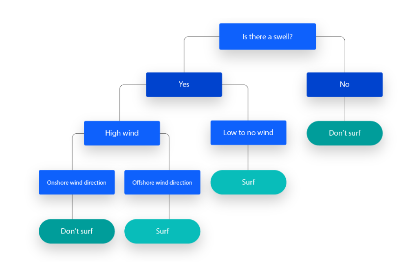

## Determination Katsayısı (R²)
- Bir regresyon modelinin verideki toplam varyansın ne kadarını açıkladığını gösteren istatistiksel ölçüdür.
- Özellikler:
    - Aralık: Teorik olarak 
    - **-∞** ile **1** arasında; pratikte modeller iyi çalıştığında `0 - 1` arası.
    - 1’e yaklaşması, modelin veriye mükemmel uyduğunu; 0’a yakın veya negatif olması ise kötü uyumu işaret eder.

!!! note "Not"

    Not: Yüksek R², modelin kesinlikle doğru olduğunu değil, sadece verideki değişimi iyi açıkladığını gösterir. Örneğin aşırı öğrenme (overfitting) durumu da yüksek R² ile maskelenebilir.

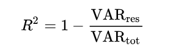

## ROC Eğrisi (Receiver Operating Characteristic Curve)
- İkili sınıflandırmada farklı karar eşiklerinin (**threshold**) performansını, **Gerçek Pozitif Oranı (TPR)** ve **Yanlış Pozitif Oranı (FPR)** eksenine karşı çizerek gösteren grafiktir.

- **Kullanım:**
    - **Eşik değeri seçimi:** Eğriye en yakın nokta, en iyi dengeyi sağlar.
    - **İki modelin karşılaştırılması:** Eğrisi üstte kalan model daha iyi ayırt edici güce sahiptir.

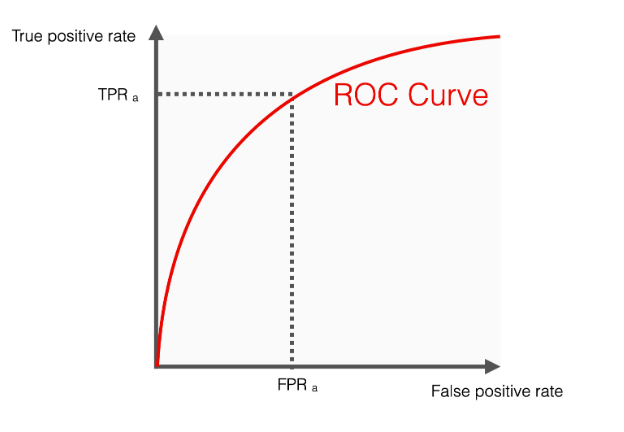

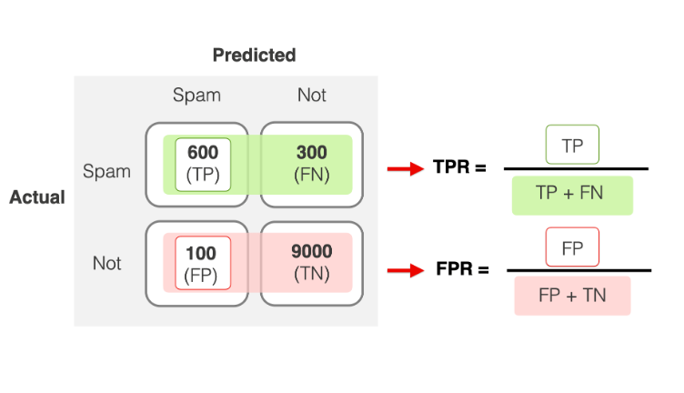

!!! note "Bilgi"
    [Josh Starmer’dan açık anlatım](https://www.youtube.com/watch?v=4jRBRDbJemM&ab_channel=StatQuestwithJoshStarmer)

## ROC AUC Skoru
- ROC eğrisinin altındaki alanın (`Area Under Curve`) sayısal değeridir.
- **Özellikler:**
    - Aralık: 0.0–1.0
        - 0.5: Rastgele tahmin (şans)
        - 1.0: Mükemmel ayırt edici güç
    - Modelin tüm eşiklerdeki ayırt edici performansını özetler.
- **Yorum:**
    - 0.7–0.8: İyi
    - 0.8–0.9: Çok iyi
    - 0.9: Mükemmel

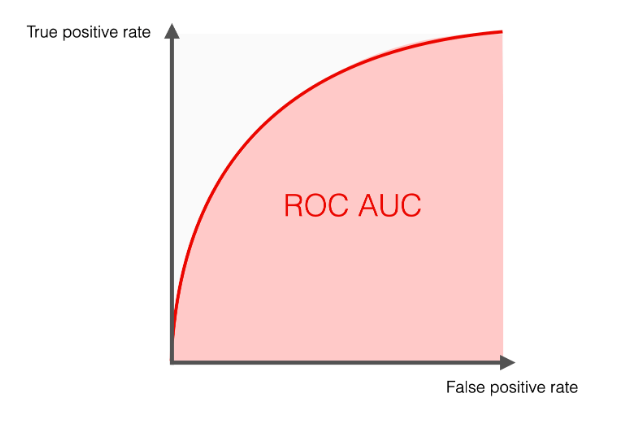

!!! note "İpuçları ve Ek Bilgiler"
    - **Model Değerlendirme:** Sadece tek bir metriğe (ör. R²’ye) bağlı kalmayın; MSE, MAE, Precision, Recall, F1-score gibi ek metrikleri de inceleyin.
    - **Görselleştirme:** Karar ağacını sklearn.tree.export_graphviz veya plot_tree ile görselleştirin, böylece karar kurallarını somut olarak görebilirsiniz.
    - **Hiperparametre Ayarı:** GridSearchCV veya RandomizedSearchCV kullanarak `n_estimators`, `max_depth`, `min_samples_split` gibi parametreleri optimize edin.
    - **Genel Bakış:** Ensemble yöntemler (Random Forest, Gradient Boosting) tek ağaçlara kıyasla genellikle daha kararlı ve yüksek performanslı sonuçlar verir. Cesaretli olun, hatalı sonuçlardan ders çıkarın ve modelinizi sürekli iyileştirmeye odaklanın! 