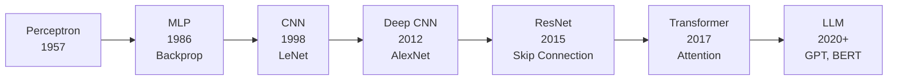
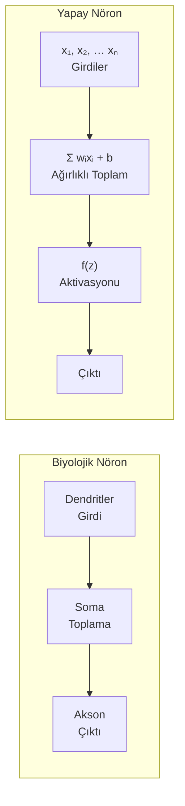
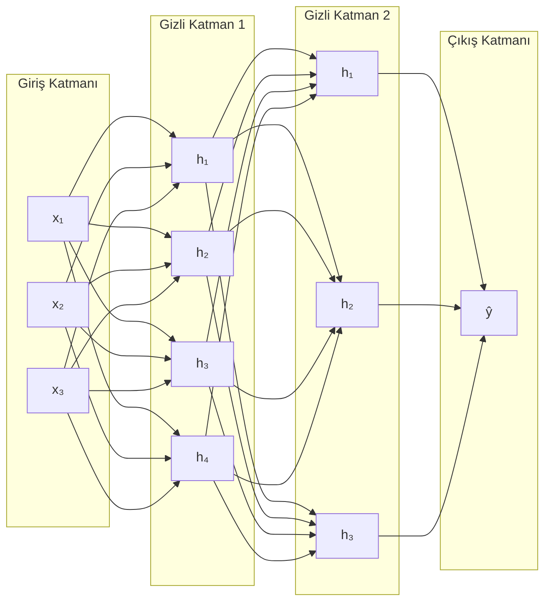
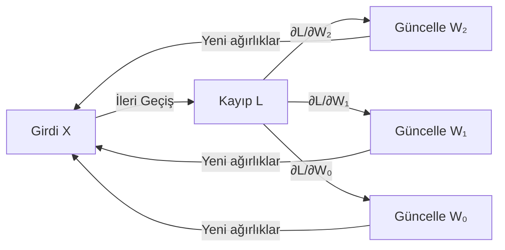
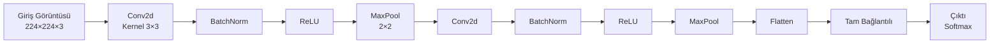
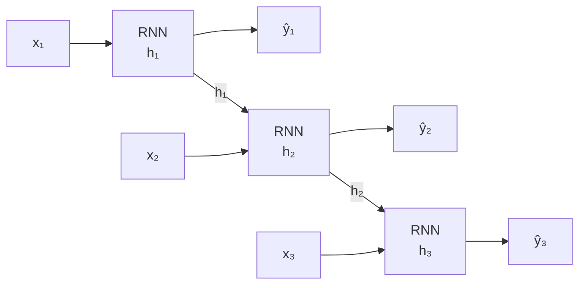
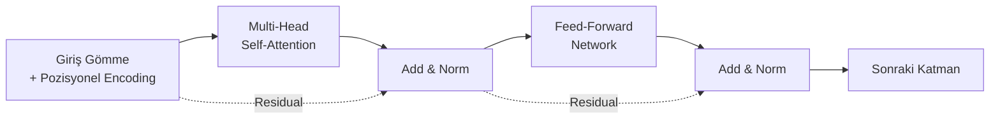
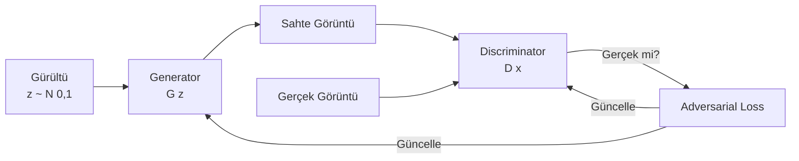
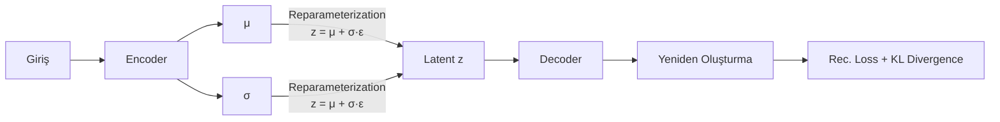
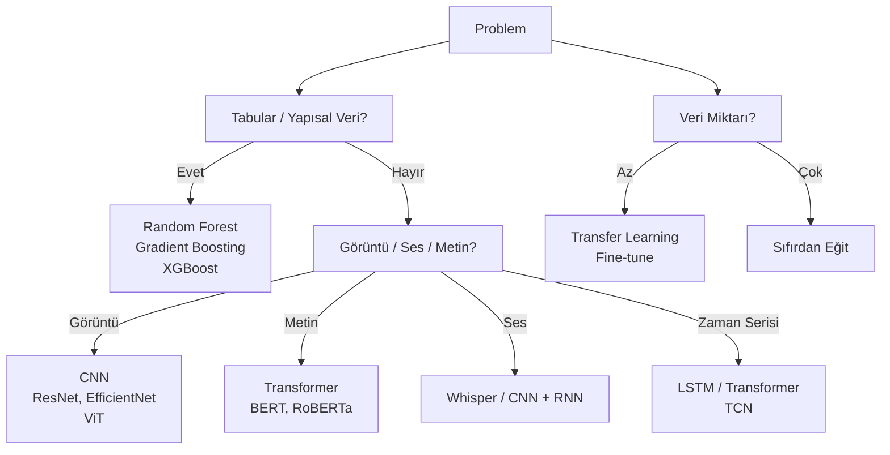

# Sinir Ağları ve Derin Öğrenme

!!! note "Genel Bakış"
    Sinir ağları, biyolojik nöronlardan ilham alan, katmanlar halinde düzenlenmiş hesaplama birimlerinden oluşan modellerdir. "Derin" öğrenme, birden fazla gizli katman içeren bu mimarileri tanımlar. Görüntü, ses, metin ve zaman serisi gibi yapılandırılmamış veride klasik ML'i geçen tek yaklaşımdır.



---

## Biyolojik Nörondan Yapay Nörona



Yapay nöronun matematiksel formu:

$$z = \sum_{i=1}^{n} w_i x_i + b \quad \rightarrow \quad \hat{y} = f(z)$$

- `wᵢ` = ağırlıklar (öğrenilen parametreler)
- `b` = bias (eşik kaydırma)
- `f` = aktivasyon fonksiyonu

---

## Aktivasyon Fonksiyonları

Aktivasyon fonksiyonu, nörona **doğrusal olmama** (non-linearity) özelliği katar. Aktivasyonsuz katmanlar ne kadar üst üste yığılırsa yığılsın, tek bir lineer dönüşüme eşdeğer kalır.

| Fonksiyon | Formül | Aralık | Kullanım |
|-----------|:------:|:------:|---------|
| **Sigmoid** | `1/(1+e⁻ᶻ)` | (0,1) | Binary sınıflandırma çıkış katmanı |
| **Tanh** | `(eᶻ - e⁻ᶻ)/(eᶻ + e⁻ᶻ)` | (-1,1) | RNN, merkezlenmiş çıktı |
| **ReLU** | `max(0, z)` | [0,∞) | **CNN, MLP gizli katmanlar (default)** |
| **Leaky ReLU** | `max(0.01z, z)` | (-∞,∞) | Dying ReLU sorununu çözer |
| **ELU** | `z>0: z; z≤0: α(eᶻ-1)` | (-α,∞) | Negatif değerleri koruyan ReLU alternatifi |
| **GELU** | `z·Φ(z)` | (-∞,∞) | Transformer, BERT, GPT |
| **Softmax** | `eᶻⁱ / Σeᶻʲ` | (0,1), toplam=1 | Çok sınıflı çıkış katmanı |

!!! warning "Dying ReLU Sorunu"
    Standart ReLU, negatif aktivasyonlarda gradyan üretmez (`f'(z<0) = 0`). Ağırlıklar belirli bir eşiği geçerse nöron kalıcı olarak ölür (her zaman 0 üretir). Leaky ReLU veya ELU ile çözülür.

---

## Çok Katmanlı Algılayıcı (MLP)



```python title="PyTorch MLP"
import torch
import torch.nn as nn

class MLP(nn.Module):
    def __init__(self, input_dim, hidden_dims, output_dim, dropout=0.3):
        super().__init__()
        layers = []
        prev = input_dim
        for h in hidden_dims:
            layers += [nn.Linear(prev, h), nn.BatchNorm1d(h),
                       nn.ReLU(), nn.Dropout(dropout)]
            prev = h
        layers.append(nn.Linear(prev, output_dim))
        self.net = nn.Sequential(*layers)

    def forward(self, x):
        return self.net(x)

model = MLP(input_dim=784, hidden_dims=[512, 256, 128], output_dim=10)
```

---

## Geri Yayılım (Backpropagation)

Backprop, zincir kuralını (chain rule) kullanarak kayıp fonksiyonunun her parametreye göre gradyanını hesaplar. Gradyan hesaplandıktan sonra optimizer parametreleri günceller.



**Zincir Kuralı:**

$$\frac{\partial \mathcal{L}}{\partial W_1} = \frac{\partial \mathcal{L}}{\partial \hat{y}} \cdot \frac{\partial \hat{y}}{\partial h_2} \cdot \frac{\partial h_2}{\partial h_1} \cdot \frac{\partial h_1}{\partial W_1}$$

```python title="Eğitim Döngüsü (PyTorch)"
optimizer = torch.optim.Adam(model.parameters(), lr=1e-3)
criterion = nn.CrossEntropyLoss()

for epoch in range(num_epochs):
    model.train()
    for X_batch, y_batch in train_loader:
        optimizer.zero_grad()           # Önceki gradyanları sıfırla
        logits = model(X_batch)         # İleri geçiş
        loss = criterion(logits, y_batch)
        loss.backward()                 # Geri yayılım
        torch.nn.utils.clip_grad_norm_(model.parameters(), 1.0)  # Gradient clipping
        optimizer.step()                # Parametre güncelle

    # Doğrulama
    model.eval()
    with torch.no_grad():
        val_loss = sum(criterion(model(X), y) for X, y in val_loader)
```

---

## CNN — Evrişimli Sinir Ağları

CNN, görüntülerdeki uzamsal hiyerarşiyi öğrenmek için özel katmanlar kullanan mimaridir. Tam bağlantılı ağa göre çok daha az parametre ile çalışır.

### Temel Katmanlar



| Katman | Işlem | Parametre |
|--------|-------|----------|
| **Conv2d** | Öğrenilen filtrelerle özellik haritası çıkar | kernel_size, out_channels, padding, stride |
| **BatchNorm** | Her mini-batch'i normalize eder; eğitimi kararlı kılar | — |
| **ReLU** | Doğrusal olmama | — |
| **MaxPool** | Uzamsal boyutu küçültür; translasyon değişmezliği | kernel_size, stride |
| **Dropout** | Rastgele nöronları sıfırlar; regularizasyon | p |
| **Flatten** | 2D feature map'i 1D vektöre çevirir | — |
| **Linear (FC)** | Sınıflandırma kararı | — |

```python title="CNN — PyTorch"
import torch.nn as nn
import torch.nn.functional as F

class SimpleCNN(nn.Module):
    def __init__(self, num_classes=10):
        super().__init__()
        # Feature Extractor
        self.features = nn.Sequential(
            nn.Conv2d(3, 32, kernel_size=3, padding=1),
            nn.BatchNorm2d(32),
            nn.ReLU(inplace=True),
            nn.MaxPool2d(2, 2),               # 112×112

            nn.Conv2d(32, 64, kernel_size=3, padding=1),
            nn.BatchNorm2d(64),
            nn.ReLU(inplace=True),
            nn.MaxPool2d(2, 2),               # 56×56

            nn.Conv2d(64, 128, kernel_size=3, padding=1),
            nn.BatchNorm2d(128),
            nn.ReLU(inplace=True),
            nn.AdaptiveAvgPool2d((4, 4))      # 4×4 (boyuttan bağımsız)
        )
        # Classifier
        self.classifier = nn.Sequential(
            nn.Dropout(0.5),
            nn.Linear(128 * 4 * 4, 512),
            nn.ReLU(inplace=True),
            nn.Dropout(0.3),
            nn.Linear(512, num_classes)
        )

    def forward(self, x):
        x = self.features(x)
        x = x.view(x.size(0), -1)    # Flatten
        return self.classifier(x)
```

### Konvolüsyon Sezgisi

```
Giriş (5×5):          Kernel (3×3):     Çıktı (3×3):
1  1  1  0  0         1  0  1           4  3  4
0  1  1  1  0    *    0  1  0     =     2  4  3
0  0  1  1  1         1  0  1           2  3  4
0  0  1  1  0
0  1  1  0  0
```

Çıktı boyutu: `(W - F + 2P) / S + 1`
- W = Giriş boyutu, F = Kernel boyutu, P = Padding, S = Stride

### Transfer Learning

Büyük veri setlerinde (ImageNet) eğitilmiş ağırlıkları kendi probleminize uyarlamak — pratik CNN kullanımının büyük çoğunluğu budur.

```python title="Transfer Learning — torchvision"
from torchvision import models
import torch.nn as nn

# Önceden eğitilmiş ResNet50
model = models.resnet50(weights='IMAGENET1K_V2')

# Son katmanı dondur (fine-tune değil, sadece sınıflandırıcı eğit)
for param in model.parameters():
    param.requires_grad = False

# Yeni sınıflandırıcı kafası
num_classes = 5
model.fc = nn.Sequential(
    nn.Linear(model.fc.in_features, 256),
    nn.ReLU(),
    nn.Dropout(0.4),
    nn.Linear(256, num_classes)
)

# Sadece son katman eğitilir
optimizer = torch.optim.Adam(model.fc.parameters(), lr=1e-3)
```

### Popüler CNN Mimarileri

| Mimari | Yıl | Parametre | Özellik |
|--------|:---:|:---------:|--------|
| LeNet-5 | 1998 | 60 K | İlk modern CNN |
| AlexNet | 2012 | 60 M | ImageNet devrimi, ReLU, Dropout |
| VGG16 | 2014 | 138 M | Basit 3×3 konv yığını |
| GoogLeNet | 2014 | 6.8 M | Inception modülü |
| ResNet-50 | 2015 | 25 M | **Skip connection — derin ağları mümkün kıldı** |
| EfficientNet | 2019 | 5–66 M | Bileşik ölçeklendirme |
| ConvNeXt | 2022 | 29–350 M | Transformer ilkeleriyle modernize CNN |

---

## RNN / LSTM — Tekrarlayan Sinir Ağları

RNN, dizi verilerini (metin, ses, zaman serisi) işlemek için gizli durum (hidden state) ile önceki adımın bilgisini taşır.



**Sorun:** Vanishing gradient — uzun sekanslarda erken adımların gradyanı sıfıra yaklaşır.

**Çözüm: LSTM (Long Short-Term Memory)**

```mermaid
graph LR
    subgraph LSTM["LSTM Hücresi"]
        FG[Forget Gate\nf = σ(Wf·[h,x]+b)] -->|Eski belleği sil| CS
        IG[Input Gate\ni = σ(Wi·[h,x]+b)] -->|Yeni bilgi ekle| CS[Cell State\nc_t]
        OG[Output Gate\no = σ(Wo·[h,x]+b)] --> HT[h_t = o·tanh c_t]
        CS --> HT
    end
```

```python title="LSTM ile Zaman Serisi"
import torch.nn as nn

class LSTMModel(nn.Module):
    def __init__(self, input_size, hidden_size, num_layers, output_size):
        super().__init__()
        self.lstm = nn.LSTM(input_size, hidden_size, num_layers,
                            batch_first=True, dropout=0.2)
        self.fc = nn.Linear(hidden_size, output_size)

    def forward(self, x):
        # x: (batch, seq_len, input_size)
        out, (h_n, c_n) = self.lstm(x)
        return self.fc(out[:, -1, :])   # Son adımın çıktısı

model = LSTMModel(input_size=1, hidden_size=64, num_layers=2, output_size=1)
```

---

## Transformer ve Dikkat Mekanizması

Transformer, dizi işlemede RNN'in yerini alan, paralel hesaplama yapabilen ve uzun menzilli bağımlılıkları yakalayan mimaridir. BERT, GPT, ViT tüm Transformer tabanlıdır.

### Self-Attention Sezgisi

"Cümledeki her kelime diğer kelimelere ne kadar 'dikkat' etmeli?" sorusunu matematiksel olarak çözer.

$$\text{Attention}(Q, K, V) = \text{softmax}\!\left(\frac{QK^T}{\sqrt{d_k}}\right) V$$

- **Q (Query):** "Ben ne arıyorum?"
- **K (Key):** "Ben neyim?"
- **V (Value):** "Benim içeriğim ne?"



### Popüler Transformer Modelleri

| Model | Tür | Parametre | Kullanım |
|-------|:---:|:---------:|---------|
| **BERT** | Encoder | 110 M | Metin sınıflandırma, NER, Soru-Cevap |
| **GPT-4** | Decoder | ~1.8 T | Metin üretimi, kod, sohbet |
| **T5** | Encoder-Decoder | 11 B | Çeviri, özetleme, soru-cevap |
| **ViT** | Encoder (görüntü) | 86 M | Görüntü sınıflandırma |
| **CLIP** | Dual Encoder | 400 M | Metin-Görüntü eşleştirme |
| **Whisper** | Encoder-Decoder | 39 M–1.5 B | Konuşma tanıma |

```python title="HuggingFace Transformers — Hızlı Başlangıç"
from transformers import pipeline

# Metin sınıflandırma (duygu analizi)
classifier = pipeline("sentiment-analysis")
result = classifier("Bu ürün gerçekten harika!")
print(result)   # [{'label': 'POSITIVE', 'score': 0.998}]

# Metin üretimi
generator = pipeline("text-generation", model="gpt2")
out = generator("Yapay zeka", max_length=50)

# Nesne tespiti (görüntü)
detector = pipeline("object-detection", model="facebook/detr-resnet-50")
results = detector("image.jpg")
```

---

## Batch Normalization

Her mini-batch içinde katman aktivasyonlarını normalize eder. İç kovaryat kaymasını (internal covariate shift) azaltır.

$$\hat{x}_i = \frac{x_i - \mu_B}{\sqrt{\sigma_B^2 + \epsilon}} \cdot \gamma + \beta$$

- `γ, β` = Öğrenilen ölçek ve kaydırma parametreleri
- Eğitimde batch istatistikleri; inferans'ta moving average kullanılır

**Avantajları:**
- Yüksek learning rate kullanılabilir
- Dropout ihtiyacı azalır
- Deeper ağlar daha kararlı eğitilir

---

## Dropout

Eğitim sırasında her adımda nöronları `p` olasılıkla sıfırlar. Ensemble etkisi yaratır; overfitting'i önler.

```
Eğitimde:   o₁  o₂  [0]  o₄  [0]  o₆    (p=0.3: %30 sıfırlanır)
Inferansta: o₁  o₂  o₃  o₄  o₅  o₆     (hepsi aktif, (1-p) ile ölçeklenir)
```

---

## Veri Artırma (Data Augmentation)

Eğitim verisini yapay dönüşümlerle genişletir. Özellikle görüntü ve metin için kritik.

```python title="torchvision Augmentation"
from torchvision import transforms

train_transform = transforms.Compose([
    transforms.RandomResizedCrop(224, scale=(0.7, 1.0)),
    transforms.RandomHorizontalFlip(p=0.5),
    transforms.ColorJitter(brightness=0.3, contrast=0.3, saturation=0.2),
    transforms.RandomRotation(15),
    transforms.RandomGrayscale(p=0.1),
    transforms.ToTensor(),
    transforms.Normalize(mean=[0.485, 0.456, 0.406],
                         std=[0.229, 0.224, 0.225])   # ImageNet istatistikleri
])

val_transform = transforms.Compose([
    transforms.Resize(256),
    transforms.CenterCrop(224),
    transforms.ToTensor(),
    transforms.Normalize(mean=[0.485, 0.456, 0.406],
                         std=[0.229, 0.224, 0.225])
])
```

---

## Üretici Modeller — GAN ve VAE

### GAN (Generative Adversarial Network)



- **Generator:** Gerçekçi sahte veri üretir
- **Discriminator:** Gerçek/sahte ayrımı yapar
- İkisi rekabet ederek birbirini zorlar

### VAE (Variational Autoencoder)



---

## Pratik Model Seçim Rehberi



| Veri Boyutu | Öneri |
|:-----------:|-------|
| < 1 K | Klasik ML (RF, SVM, GBM) |
| 1 K – 100 K | Transfer learning + fine-tune |
| > 100 K | CNN / Transformer sıfırdan veya büyük ölçekli fine-tune |
| > 1 M | Büyük model, distributed training |
