# Sinir Ağları ve Derin Öğrenme

!!! note "Genel Bakış"
    Sinir ağları, biyolojik beynden ilham alan hesaplama modelleridir. "Derin" öğrenme, katmanlar halinde yığılmış bu yapıların veriden otomatik olarak özellik çıkarmasını sağlar. Görüntü, ses, metin gibi yapılandırılmamış veride klasik yöntemleri geçen tek yaklaşımdır.

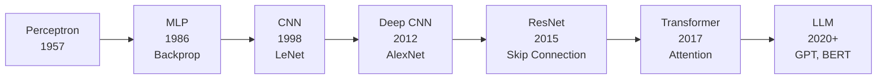

---

## Biyolojik Nörondan Yapay Nörona

İnsan beyninde yaklaşık 86 milyar nöron bulunur. Her nöron, diğer nöronlardan elektrik sinyali alır, bu sinyalleri toplar ve yeterince güçlü olduklarında kendi sinyalini diğer nöronlara iletir. Bu "ateşleme" fikri yapay sinir ağlarının temelini oluşturur.

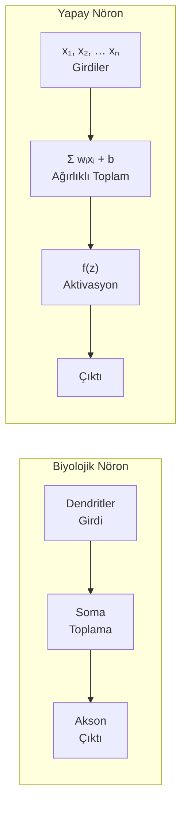

**Yapay nöronun çalışma mantığı:**

1. **Girdiler (x):** Önceki katmandan veya ham veriden gelen sayılar.
2. **Ağırlıklar (w):** Her girdiyi ne kadar önemsediği. Büyük ağırlık → o girdi çok önemli. Eğitimde bunlar güncellenir.
3. **Bias (b):** Nöronun ne zaman "ateşleyeceğini" kaydıran eşik değeri.
4. **Aktivasyon fonksiyonu f(z):** Ağırlıklı toplamı alır, doğrusal olmayan bir dönüşüm uygular.
5. **Çıktı:** Sonraki katmana veya final cevap olarak iletilir.

$$z = \sum_{i=1}^{n} w_i x_i + b \quad \rightarrow \quad \hat{y} = f(z)$$

**Neden ağırlıklı toplam?** Bazı girdiler tahmine daha fazla katkı sağlar. "Evin metrekaresi mi daha önemli, oda sayısı mı?" sorusunun cevabı ağırlıklarda kodludur. Model doğru ağırlıkları öğrenince doğru tahminleri yapar.

**Tek bir nöronun sınırı:** Tek bir nöron sadece doğrusal bir sınır çizebilir. Gerçek dünyanın karmaşık, doğrusal olmayan ilişkilerini öğrenmek için katmanlar ve aktivasyon fonksiyonları gerekir.

---

## Aktivasyon Fonksiyonları

Aktivasyon fonksiyonu olmadan, ne kadar çok katman eklerseniz ekleyin, ağ tek bir doğrusal dönüşüme eşdeğer kalır. Aktivasyon fonksiyonu ağa **doğrusal olmama (non-linearity)** özelliği katar. Bu sayede ağ gerçek dünyanın karmaşık ilişkilerini öğrenebilir.

**Sezgi:** Doğrusal olmama olmadan, sinir ağı ne kadar derin olursa olsun verinin üzerine sadece düz bir çizgi çizebilir. Aktivasyon fonksiyonu bu çizgiyi kıvırma yeteneği kazandırır; karmaşık sınırlar çizebilir.

| Fonksiyon | Çıktı Aralığı | Tipik Kullanım | Önemli Özellik |
|-----------|:------------:|:--------------:|----------------|
| **Sigmoid** | (0, 1) | İkili sınıflandırma çıkış katmanı | Olasılık yorumu doğal; derin ağlarda gradyan kaybına yol açar |
| **Tanh** | (-1, 1) | RNN gizli katmanlar | Sigmoid'den daha iyi: ortalama sıfır, daha güçlü gradyanlar |
| **ReLU** | [0, ∞) | CNN ve MLP gizli katmanlar | Hesaplaması basit, hızlı; derin ağların standardı |
| **Leaky ReLU** | (-∞, ∞) | ReLU alternatifi | Negatif girdi için küçük de olsa gradyan üretir |
| **GELU** | (-∞, ∞) | Transformer (BERT, GPT) | ReLU'nun pürüzsüz versiyonu; son yıllarda tercih |
| **Softmax** | (0, 1), toplam=1 | Çok sınıflı çıkış katmanı | Tüm sınıflar için olasılık dağılımı üretir |

!!! warning "Dying ReLU Sorunu"
    ReLU, negatif girdi için sıfır gradyan üretir. Bir nöron sürekli negatif değer alıyorsa asla güncellenmez — "ölmüş nöron" olur. **Leaky ReLU**, negatif tarafta küçük bir eğim (0.01) tutarak bunu çözer. **Batch Normalization** da bu riski önemli ölçüde azaltır.

!!! info "Neden Softmax çıkışta, ReLU ortada?"
    Softmax tüm çıktıların toplamını 1 yapar — bu bir olasılık dağılımı demektir. "Bu görüntü %72 kedi, %18 köpek, %10 tavşan" şeklinde yorumlanabilir. ReLU ise ara katmanlarda büyük sayılara izin verir, bu hesaplamaları hızlandırır.

---

## Çok Katmanlı Algılayıcı (MLP)

MLP, en temel sinir ağı mimarisidir. Tam bağlantılı (fully connected) katmanlardan oluşur: her katmandaki her nöron, bir önceki katmandaki tüm nöronlara bağlıdır.

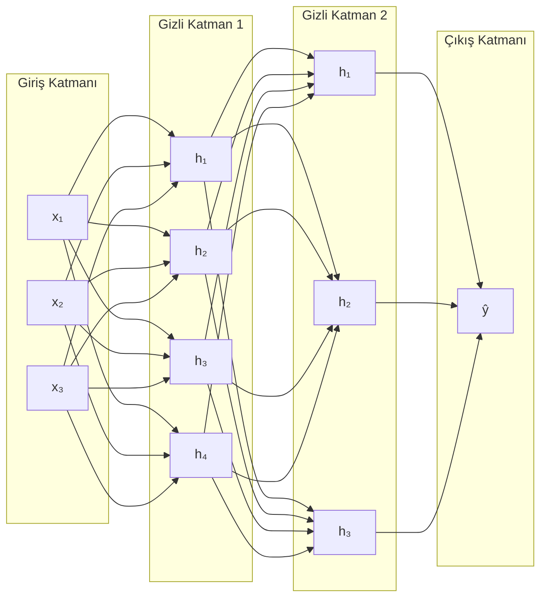

**Katmanların rolü:**

- **Giriş Katmanı:** Ham veriyi alır. Özellik sayısı kadar nöron içerir. Ev fiyatı problemi için: metrekare, oda sayısı, konum = 3 nöron.
- **Gizli Katmanlar:** Veriyi soyut temsillere dönüştürür. İlk katmanlar basit örüntüler (kenar, renk), sonraki katmanlar karmaşık kavramlar (kulak, burun) öğrenir.
- **Çıkış Katmanı:** Final kararı üretir. Sınıflandırma için sınıf sayısı kadar nöron (softmax ile); regresyon için tek nöron (aktivasyon yok).

**Derinlik neden önemli?** Her katman, önceki katmanın çıktısı üzerine daha soyut özellikler inşa eder. Görüntü tanımada:
- 1. katman: Yatay-dikey çizgiler, renk geçişleri
- 2. katman: Köşeler, eğriler, basit şekiller
- 3. katman: Kulak şekli, göz kapağı, kanat
- Derin katmanlar: Yüz, araba, kuş

**MLP'nin sınırı:** Görüntüdeki her pikseli bağımsız özellik olarak ele alır. 224×224 renkli görüntü için 150.000+ girdi. Pikseller arasındaki uzamsal ilişkiyi (sol üstteki piksel sağ alttakiyle neden bağlantılı olsun?) dikkate almaz. Bu sorunu CNN çözer.

---

## Geri Yayılım (Backpropagation)

Sinir ağı nasıl öğrenir? İleri geçişte tahmin yapar, kayıpı hesaplar; geri yayılımla bu kayıpın her ağırlıktan nasıl kaynaklandığını hesaplar ve ağırlıkları günceller.

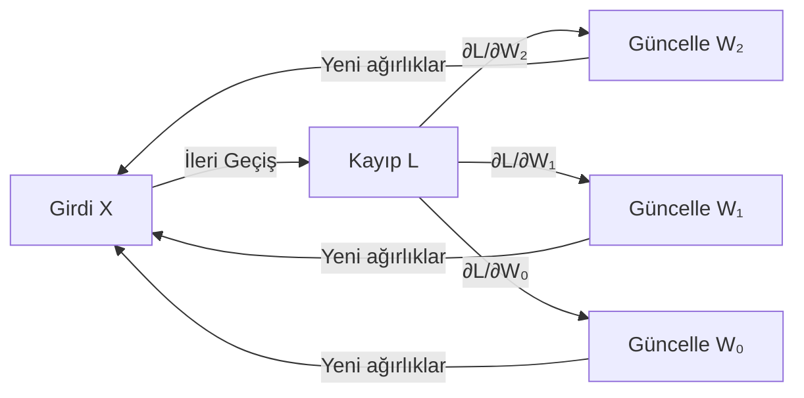

**Adım adım bir eğitim adımı:**

1. **İleri Geçiş (Forward Pass):** Veri ağdan katman katman geçer, tahmin üretilir.
2. **Kayıp Hesapla:** Tahmin ile gerçek değer arasındaki fark ölçülür.
3. **Geri Yayılım (Backward Pass):** Zincir kuralı ile kayıpın her ağırlığa göre türevi (gradyan) hesaplanır.
4. **Parametre Güncelleme:** Optimizer, hesaplanan gradyanları kullanarak ağırlıkları küçük bir adımla günceller.
5. **Tekrar:** Bu döngü binlerce kez (epoch) tekrar eder.

**Neden "zincir kuralı"?** Kayıp, onlarca katmandan geçerek üretilir. "Bu hata son katmandaki W₂'den mi, yoksa ilk katmandaki W₀'dan mı kaynaklanıyor?" sorusuna cevap vermek için türevleri geriye doğru zincir gibi çarpmak gerekir.

$$\frac{\partial \mathcal{L}}{\partial W_1} = \frac{\partial \mathcal{L}}{\partial \hat{y}} \cdot \frac{\partial \hat{y}}{\partial h_2} \cdot \frac{\partial h_2}{\partial h_1} \cdot \frac{\partial h_1}{\partial W_1}$$

**Gradyan patlaması ve kayboluşu:** Çok derin ağlarda zincir çarpımı ya çok büyüyebilir (patlar) ya da çok küçülebilir (kaybolur). Gradyan klipling (patlamayı sınırla), Skip Connection (kaybolmayı atla), Batch Normalization ve dikkatli başlatma bu sorunları çözer.

---

## CNN — Evrişimli Sinir Ağları

MLP her pikseli bağımsız özellik sayar. CNN ise görüntünün **uzamsal yapısını** kullanır: yakın pikseller birbiriyle ilişkilidir ve bir örüntü görüntünün her yerinde aynı görünür.

**Temel fikir:** Bir kedi kulağı görüntünün sol üstünde de sol altında da kulak gibi görünür. CNN aynı filtreyi tüm görüntüye uygular — bir yerde öğrenilen örüntüyü her yerde arar. Bu **ağırlık paylaşımı** parametre sayısını dramatik biçimde azaltır.

### Konvolüsyon (Evrişim) İşlemi

Küçük bir filtre (kernel), görüntünün üzerinde kaydırılır. Her konumda: filtre değerleri × karşılık gelen piksel değerleri toplanır. Bu toplam, o konumdaki çıktı değeri olur.

```
Giriş (5×5):          Filtre (3×3):     Çıktı (3×3):
1  1  1  0  0         1  0  1           4  3  4
0  1  1  1  0    *    0  1  0     =     2  4  3
0  0  1  1  1         1  0  1           2  3  4
0  0  1  1  0
0  1  1  0  0
```

- Farklı filtreler farklı özellikleri yakalar: yatay kenar, dikey kenar, renk, doku...
- Bu filtreler eğitimde otomatik olarak öğrenilir — siz tasarlamazsınız.
- Çıktı boyutu formülü: `(W - F + 2P) / S + 1`
    - W = Giriş boyutu, F = Filtre boyutu, P = Padding, S = Stride

**Padding:** Filtreyi uygulamadan önce görüntü etrafına sıfır eklenir. "Same" padding çıktının giriş ile aynı boyutta kalmasını sağlar.

**Stride:** Filtrenin kaç piksel atlayarak kaydırılacağı. Stride=1 her piksele, Stride=2 her ikinci piksele bakar — görüntüyü küçültür.

### CNN Katmanları

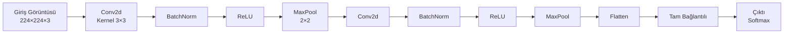

| Katman | Ne Yapar | Neden Gerekli |
|--------|---------|:-------------:|
| **Conv2d** | Filtreler uygular, özellik haritası çıkarır | Uzamsal örüntüleri yakalar |
| **BatchNorm** | Her mini-batch'i normalleştirir | Eğitimi hızlandırır, kararlı kılar |
| **ReLU** | Negatif değerleri sıfırlar | Doğrusal olmama katar |
| **MaxPool** | Bölgedeki en büyük değeri alır, boyutu küçültür | Konum hassasiyetini azaltır; hesaplamayı hızlandırır |
| **Dropout** | Rastgele nöronları kapatır | Overfitting önler |
| **Flatten** | 2D özellik haritasını 1D vektöre dönüştürür | FC katmana hazırlık |
| **Linear (FC)** | Final sınıflandırma kararı | — |

**Hiyerarşik özellik öğrenimi:**

- **Erken katmanlar:** Basit kenarlar, yön gradyanları, renk geçişleri
- **Orta katmanlar:** Şekiller, dokular, köşeler, iç içe geçmeler
- **Derin katmanlar:** Yüzler, araba tekeri, kuş kanadı gibi yüksek seviyeli konseptler

Bu hiyerarşi CNN'i güçlü kılan şeydir. İnsan görsel korteksinin de benzer katmanlı yapıda çalıştığı bilinmektedir.

---

## ResNet — Skip Connection Neden Devrimdi?

2012–2014 yıllarında daha derin ağların daha iyi sonuç vermesi bekleniyor ama pratikte 20 katmanlı ağ 56 katmanlıdan daha iyi çalışıyordu. Neden? **Vanishing gradient** — gradyan çok katmandan geçerken katlanarak küçülüyor, ilk katmanlara çok az sinyal ulaşıyordu.

**ResNet'in zarif çözümü:** Bir bloğun girişini, o bloğun çıktısına doğrudan ekle.

```
Normal:     x → [Blok] → çıktı
ResNet:     x → [Blok] → + x → çıktı
                         ↑
                   Skip Connection
```

Bu sayede gradyan iki yoldan geri akabilir: normal yol ve skip yol. Skip yol üzerinden gradyan kaybolmadan erken katmanlara ulaşır.

**Pratik etkisi:** 2015'te ResNet-152 (152 katman!) ImageNet'te birinci oldu. Bu mimari sayesinde yüzlerce katmanlı ağlar eğitilebilir hale geldi. Günümüzde neredeyse tüm modern CNN mimarileri Skip Connection kullanır.

### Popüler CNN Mimarileri

| Mimari | Yıl | Parametre | Neden Önemli |
|--------|:---:|:---------:|-------------|
| **LeNet-5** | 1998 | 60 K | İlk modern CNN; el yazısı rakam tanıma |
| **AlexNet** | 2012 | 60 M | ImageNet'i fethetti; derin öğrenme devrimini başlattı |
| **VGG16** | 2014 | 138 M | Çok derin, çok parametreli; ama anlaşılması kolay yapı |
| **GoogLeNet** | 2014 | 6.8 M | Inception modülü: farklı boyutlu filtreler paralel uygulanır |
| **ResNet-50** | 2015 | 25 M | Skip Connection: gradyan doğrudan aktarılır, çok derin ağlar mümkün |
| **EfficientNet** | 2019 | 5–66 M | Derinlik, genişlik ve çözünürlüğü birlikte dengeler |
| **ConvNeXt** | 2022 | 29–350 M | Transformer fikirlerini CNN'e entegre eder |

### Transfer Learning — Neden İşe Yarar?

ImageNet'te 1.2 milyon görüntüyle eğitilen ResNet-50, milyonlarca ağırlık öğrenir. Bu ağırlıkların büyük çoğunluğu **evrenseldir**: kenar dedektörleri, doku tanıyıcılar, şekil dedektörleri.

Bu alt katman özellikleri tıbbi görüntüde de, uydu görüntüsünde de, üretim hatasında da geçerlidir. Dolayısıyla bu ağırlıkları alıp kendi probleminize uygulayabilir, sadece son birkaç katmanı yeniden eğitebilirsiniz.

**Ne zaman hangi strateji?**

| Durumunuz | Strateji |
|-----------|---------|
| Az veri (< 1 K), benzer domain | Son katmanı değiştir, sadece onu eğit; geri kalanı dondur |
| Orta veri (1 K – 10 K), benzer domain | Son birkaç katmanı fine-tune et |
| Çok veri (> 100 K), farklı domain | Tüm ağı fine-tune et veya sıfırdan eğit |
| Çok veri (> 1 M), çok farklı domain | Sıfırdan eğit |

---

## RNN / LSTM — Tekrarlayan Sinir Ağları

Standart sinir ağları sırasız veriye bakar — her örnek bağımsızdır. Ama dil, ses, zaman serisi gibi verilerde sıra önemlidir: "köpek adam ısırdı" ile "adam köpek ısırdı" aynı kelimelerden oluşur ama anlam farklıdır.

**RNN'in fikri:** Her adımda hem mevcut girdiyi hem de önceki adımın çıktısını (gizli durum) kullanmak. Gizli durum, "şimdiye kadar ne gördüğümü" özetleyen bir bellek gibidir.

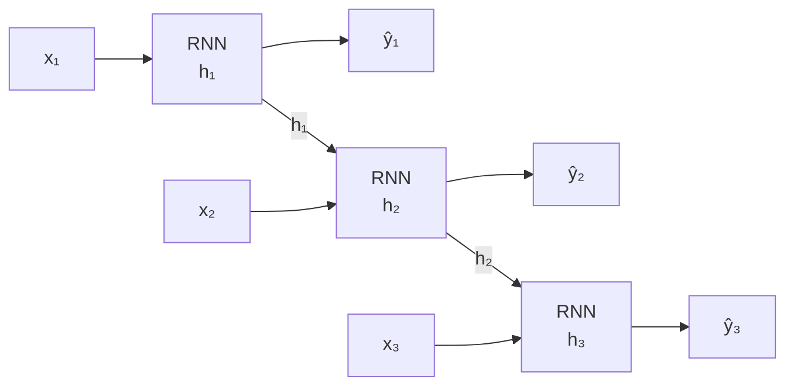

**RNN'in büyük sorunu:** Vanishing gradient. Uzun dizilerde (100+ kelime) geri yayılım sırasında erken adımların gradyanı yok olur. Model, cümlenin başındaki bilgiyi sona taşıyamaz. "Fransa'da doğdum ve ... ve ... [100 kelime] ... bu yüzden Fransızcam iyi" cümlesinde "Fransa" ile "Fransızca" arasındaki bağlantı kurulamaz.

### LSTM — Akıllı Bellek Mekanizması

LSTM bu sorunu çözmek için üç "kapı" mekanizması tasarlar. Her kapı 0 ile 1 arasında bir değer üretir ve hangi bilginin ne kadar geçeceğini kontrol eder.

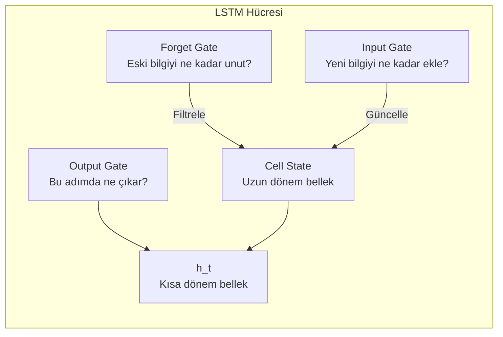

- **Forget Gate (Unutma Kapısı):** "Önceki cell state'ten ne kadar bilgiyi sil?" Konuşma konusu değiştiğinde önceki konuyu unutmak gibi.
- **Input Gate (Girdi Kapısı):** "Yeni girdiyi ne kadar belleğe ekle?" Önemli yeni bilgiyi uzun dönem belleğe yaz.
- **Output Gate (Çıktı Kapısı):** "Bu adımda cell state'in ne kadarını dışarıya ver?"
- **Cell State:** Uzun dönem bellek — kapıların filtresiyle güncellenerek tüm dizi boyunca taşınır.

**GRU (Gated Recurrent Unit):** LSTM'in daha basit versiyonu. İki kapı kullanır, cell state yoktur. Genellikle LSTM kadar iyi sonuç verir ama daha az parametre ile. Hesaplama kaynakları kısıtlıysa tercih edilir.

---

## Transformer ve Dikkat Mekanizması

2017'de "Attention is All You Need" makalesi çıktığında NLP dünyasını kökten değiştirdi. RNN'in sıralı hesaplaması yerine tüm diziyi aynı anda işleyen paralel bir yapı önerdi.

**RNN'in temel kısıtı:** Uzun dizilerde bilgi "sıkıştırılarak" tek bir vektörde taşınır. 1000 kelimelik bir belgeyi tek bir vektöre sıkıştırmak bilgi kaybına yol açar; ilk kelimeleri "unutur." Ayrıca sıralı hesaplama paralel çalıştırılamaz — GPU'ları tam kullanamaz.

**Transformer'ın çözümü:** Her kelime, diğer tüm kelimelere **doğrudan** bakabilir. Uzun mesafe bağımlılıkları kolayca yakalar. Tüm dizi aynı anda işlenir — GPU paralelizmi tam kullanılır.

### Self-Attention Sezgisi

"Bu cümledeki her kelime, anlam için diğer hangi kelimelere ne kadar bakmalı?"

**Örnek:** "Banka nehir kenarındaydı."

Model "banka" kelimesini işlerken "nehir" kelimesine yüksek dikkat ağırlığı verir — bu bağlamda banka bir finans kurumu değil, nehir kıyısıdır. "Banka para yatırdım." cümlesinde ise "para" kelimesine yüksek dikkat verilir. Aynı kelime, bağlama göre farklı anlam kazanır.

$$\text{Attention}(Q, K, V) = \text{softmax}\!\left(\frac{QK^T}{\sqrt{d_k}}\right) V$$

- **Q (Query — Sorgu):** "Ben ne arıyorum?" — mevcut kelimenin sorusu.
- **K (Key — Anahtar):** "Ben ne sunuyorum?" — diğer kelimelerin kendilerini tanıtması.
- **V (Value — Değer):** "Dikkat ağırlığı yüksekse benden al" — asıl bilgi içeriği.

$\sqrt{d_k}$ ile bölme: Q ve K vektörleri çok büyük olabilir; bölme softmax'ın daha dengeli dağılım üretmesini sağlar.

**Multi-Head Attention:** Tek bir dikkat yerine birden fazla paralel dikkat mekanizması ("kafa") kullanılır. Her kafa farklı ilişki türlerini yakalar: biri sözdizimsel (gramer), diğeri anlamsal, bir diğeri referans ilişkilerini.

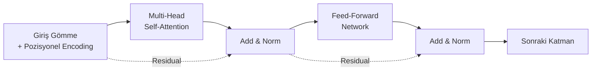

**Pozisyonel Encoding:** Transformer tüm kelimelere aynı anda baktığı için sıra bilgisi yoktur. Bunu çözmek için her kelimenin pozisyonuna göre oluşturulan sinüs/kosinüs tabanlı kodlar gömmelere eklenir.

**Feed-Forward Network:** Her tokenı aynı şekilde işleyen iki katmanlı MLP. Dikkat katmanı "hangi bilgiler önemli?" sorusunu cevaplarken FFN "bu bilgiyle ne yapmalı?" sorusunu cevaplar.

### Encoder — Decoder — Encoder-Decoder Farkı

| Mimari | Ne Yapar | Örnek |
|--------|---------|-------|
| **Encoder** | Girdiyi anlar, temsil üretir; yeni token üretemez | BERT — metin anlama |
| **Decoder** | Önceki çıktıya bakarak sonraki tokeni üretir | GPT — metin üretme |
| **Encoder-Decoder** | Girdiyi anlayıp farklı bir dile/forma dönüştürür | T5 — çeviri, özetleme |

### Popüler Transformer Modelleri

| Model | Mimari | Parametre | Güçlü Olduğu Alan |
|-------|:------:|:---------:|:-----------------:|
| **BERT** | Encoder | 110 M | Metin anlama, soru-cevap, NER |
| **GPT-4** | Decoder | ~1.8 T | Metin üretme, kod yazma, sohbet |
| **T5** | Encoder-Decoder | 11 B | Çeviri, özetleme, soru yanıtlama |
| **ViT** | Encoder (görüntü) | 86 M | Görüntü sınıflandırma (patch tabanlı) |
| **CLIP** | Çift Encoder | 400 M | Metin-görüntü eşleştirme |
| **Whisper** | Encoder-Decoder | 39 M–1.5 B | Konuşma tanıma |

---

## Batch Normalization

Derin ağlarda her katmanın girdisi, önceki katmanın parametreleri her güncellendiğinde değişir. Bu "iç kovaryat kayması" (internal covariate shift) eğitimi yavaşlatır ve kararsız kılar.

**BatchNorm ne yapar?** Her mini-batch'te katman aktivasyonlarını ortalaması 0, standart sapması 1 olacak şekilde normalleştirir; ardından öğrenilen γ ve β parametreleriyle yeniden ölçekler.

$$\hat{x}_i = \frac{x_i - \mu_B}{\sqrt{\sigma_B^2 + \epsilon}} \cdot \gamma + \beta$$

**Faydaları:**

- Daha yüksek learning rate kullanılabilir → daha hızlı eğitim
- Ağırlık başlatmasına duyarlılık azalır
- Hafif regularizasyon etkisi (dropout ihtiyacı azalır)
- Çok derin ağlar daha kararlı eğitilir

**Inferans farkı:** Eğitimde batch istatistikleri (μ ve σ) kullanılır. Inferansta ise eğitim boyunca biriken hareketli ortalama (moving average) kullanılır. Bu nedenle model `model.eval()` moduna alınmalıdır.

**Layer Normalization:** Transformer'larda BatchNorm yerine kullanılır. Batch boyutu yerine özellik (token) boyutu üzerinden normalleştirir. Batch size bağımsız, değişken uzunluklu dizilerde daha uygun.

---

## Dropout

Eğitim sırasında her adımda nöronları p olasılıkla rastgele sıfırlar. Inferansta tüm nöronlar aktiftir ama çıktılar (1-p) ile ölçeklenir.

```
Eğitimde:   o₁  o₂  [0]  o₄  [0]  o₆    (p=0.3: %30 sıfırlanır)
Inferansta: o₁  o₂  o₃  o₄  o₅  o₆     (hepsi aktif, (1-p) ile ölçeklenir)
```

**Sezgi:** Bir futbol takımı her antrenmanı farklı oyuncularla yaparsa, her oyuncu kendi başına iyi olmak zorunda kalır. Hiçbir oyuncuya körü körüne bağımlılık oluşmaz. Dropout da ağın belirli nöronlara aşırı bağımlı olmasını önler.

**Ensemble etkisi:** Dropout, aynı ağırlıkları paylaşan üstel sayıda farklı ağ mimarisi eğitmek gibidir. Inferansta bu ağların ortalaması alınır — ensemble performansı elde edilir.

**Dropout nereden uygulanır?** Genellikle tam bağlantılı (FC) katmanlardan önce. CNN'nin konvolüsyon katmanlarında genellikle BatchNorm daha etkili olduğu için Dropout daha az kullanılır.

---

## Veri Artırma (Data Augmentation)

Az veriden daha fazlasını simüle etmenin yolu: mevcut görüntüleri dönüştürerek yeni eğitim örnekleri üret.

**Görüntü augmentation teknikleri ve amacı:**

| Teknik | Ne Yapar | Sağladığı Dayanıklılık |
|--------|---------|----------------------|
| **Yatay Çevirme** | Görüntüyü aynalar | "Nesne solda da sağda da aynı nesne" |
| **Rastgele Kırpma** | Farklı bir bölgeyi seçer | "Nesne görüntünün her konumunda olabilir" |
| **Renk Değişimi** | Parlaklık, kontrast, renk tonu değiştirir | "Farklı ışık koşullarına dayanıklılık" |
| **Döndürme** | Belirli açıda döndürür | "Yatık veya eğik nesneleri tanı" |
| **Gürültü Ekleme** | Rastgele piksel gürültüsü | "Gerçek dünya kamera gürültüsüne dayanıklılık" |
| **Cutout / Erasing** | Rastgele bir bölgeyi siyah yapar | "Parçalı veya örtülü nesneleri tanı" |
| **Mixup** | İki görüntüyü ağırlıklı olarak karıştırır | "Sınırlar arası genelleme" |

!!! tip "Ne zaman ne kadar augmentation?"
    Az veri + derin model kombinasyonunda augmentation zorunludur. Çok veri varsa fayda azalır. Sağlıksız augmentation (örn. tıbbi görüntüde dikey çevirme — "böbrek yukarı aşağı olamaz") zararla sonuçlanır.

---

## Üretici Modeller — GAN ve VAE

### GAN (Generative Adversarial Network — Çekişmeli Üretici Ağ)

İki model birbiriyle yarışır: **Generator** sahte veri üretir, **Discriminator** gerçek/sahte ayrımı yapar.

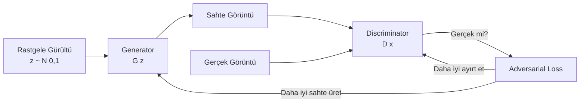

**Eğitim dinamiği:** Generator, Discriminator'u kandırmaya çalışır. Discriminator, kandırılmamaya. Bu "kedi-fare oyunu" ikisini de sürekli geliştirir. Nash dengesinde Generator, Discriminator'un bile ayırt edemeyeceği sahte veri üretir.

**Kullanım alanları:** Gerçekçi yüz üretimi (StyleGAN), veri artırma, görüntüden görüntüye çeviri (CycleGAN — at→zebra), süper çözünürlük, sanat üretimi.

**Eğitim zorlukları:**
- **Mode collapse:** Generator sadece birkaç türde çıktı üretmeyi öğrenir, çeşitlilik kaybolur.
- **Eğitim instabilitesi:** Generator ve Discriminator arasındaki denge bozulabilir.
- **Hiperparametre hassasiyeti:** Öğrenme hızı dengesizliği tüm eğitimi bozabilir.

### VAE (Variational Autoencoder)

Veriyi sıkıştırılmış bir "latent uzay"a kodlar ve bu uzaydan yeni veri üretir.

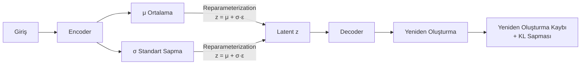

**Latent uzay nedir?** Veriyi anlamlı, düşük boyutlu bir uzaya sıkıştırır. Yüz görüntüleri için latent uzayda "gülümseme", "saç rengi", "yaş" sürekli vektörler olarak temsil edilir. Bu vektörler üzerinde aritmetik yapılabilir: gülümseyen yüz − gülümsemeyen yüz = gülümseme vektörü.

**GAN vs VAE:**

| | GAN | VAE |
|--|:---:|:---:|
| **Görüntü kalitesi** | Daha gerçekçi | Daha bulanık |
| **Latent uzay** | Düzensiz | Düzenli, enterpolasyon mükemmel |
| **Eğitim kararlılığı** | Zor | Daha kararlı |
| **Kontrol** | Zor | Kolay (latent vektör üzerinden) |
| **Kullanım** | Gerçekçi üretim | Sıkıştırma, enterpolasyon, yapılandırılmış üretim |

---

## Pratik Model Seçim Rehberi

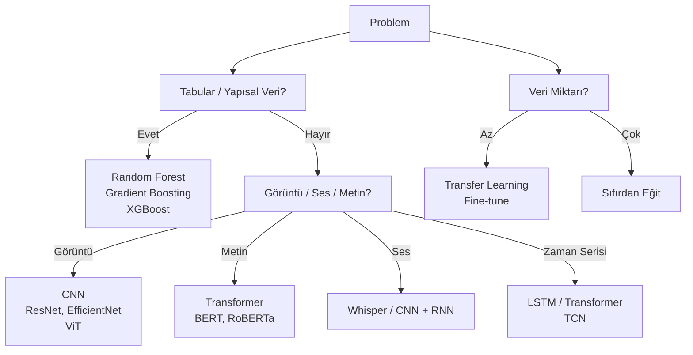

| Veri Boyutu | Öneri |
|:-----------:|-------|
| **< 1 K** | Klasik ML — RF, SVM, GBM. Derin öğrenme overfit eder |
| **1 K – 100 K** | Transfer learning — önceden eğitilmiş ağı fine-tune et |
| **> 100 K** | CNN / Transformer sıfırdan veya büyük ölçekli fine-tune |
| **> 1 M** | Dağıtık eğitim, büyük modeller |
