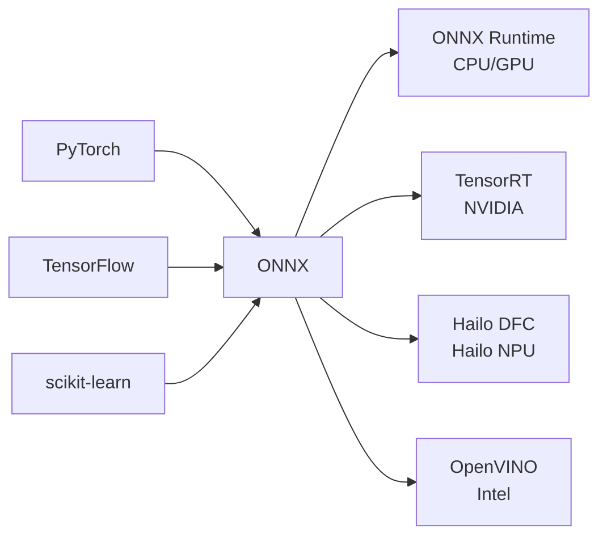
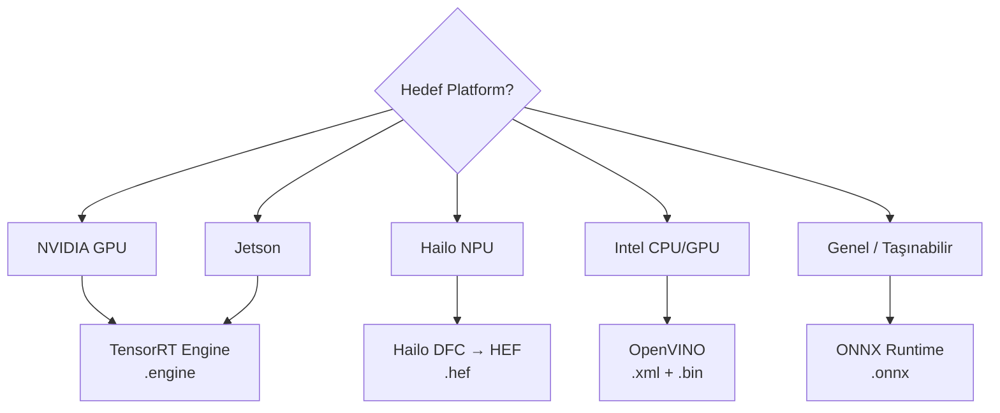

# ONNX ve TensorRT — Model Optimizasyonu

!!! note "Bu Sayfa Ne Anlatıyor?"
    ONNX ve TensorRT'yi hiç duymamış biri için sıfırdan açıklar. "Modelim eğitildi, şimdi ne yapayım?" sorusuna cevap verir. Neden optimize etmek gerektiğini, nasıl yapıldığını ve ne kadar hızlanma bekleneceğini anlatır.

---

## Neden Optimize Etmek Gerekiyor?

PyTorch ile eğittiğin bir modeli doğrudan çalıştırırsın — çalışır, ama yavaş. Çünkü PyTorch araştırma için tasarlandı: esnek, kolay hata ayıklama, ama üretim için değil.

```
Aynı model, farklı ortamlar:
─────────────────────────────────────────────────────
PyTorch (eğitim modu)     → 15 ms / görüntü → 67 FPS
PyTorch (eval modu)       → 10 ms / görüntü → 100 FPS
ONNX Runtime              →  6 ms / görüntü → 167 FPS
TensorRT (FP16)           →  2 ms / görüntü → 500 FPS
TensorRT (INT8 + calibr)  →  1 ms / görüntü → 1000 FPS
─────────────────────────────────────────────────────
Platform: NVIDIA RTX 3070, YOLOv8n, 640×640
```

---

## ONNX — Evrensel Model Formatı

**ONNX = Open Neural Network Exchange**

ONNX, farklı derin öğrenme çerçevelerinin birbirleriyle konuşabilmesi için ortak bir format. PyTorch, TensorFlow, scikit-learn — hepsi ONNX'e export edebilir.



### PyTorch → ONNX Export

```python title="pytorch_to_onnx.py"
import torch
from torchvision import models
import onnx
import onnxruntime as ort
import numpy as np

# ──────────────────────────────────────────
# 1. Modeli yükle
# ──────────────────────────────────────────
model = models.resnet50(weights=models.ResNet50_Weights.IMAGENET1K_V2)
model.eval()

device = torch.device("cuda" if torch.cuda.is_available() else "cpu")
model = model.to(device)

# ──────────────────────────────────────────
# 2. Örnek girdi (modele hangi boyut girdiğini söyle)
# ──────────────────────────────────────────
ornek_girdi = torch.randn(1, 3, 224, 224).to(device)

# ──────────────────────────────────────────
# 3. ONNX'e export et
# ──────────────────────────────────────────
torch.onnx.export(
    model,
    ornek_girdi,
    "resnet50.onnx",
    export_params=True,          # Ağırlıkları dahil et
    opset_version=17,            # ONNX operatör seti versiyonu
    do_constant_folding=True,    # Sabit katmanları birleştir (optimizasyon)
    input_names=["images"],      # Girdi katmanı adı
    output_names=["output"],     # Çıktı katmanı adı
    dynamic_axes={               # Değişken boyutlu boyutlar
        "images": {0: "batch_size"},    # Batch boyutu değişken olabilir
        "output": {0: "batch_size"}
    }
)
print("ONNX export tamamlandı!")

# ──────────────────────────────────────────
# 4. ONNX modelini doğrula
# ──────────────────────────────────────────
onnx_model = onnx.load("resnet50.onnx")
onnx.checker.check_model(onnx_model)   # Hata varsa exception fırlatır
print("ONNX model geçerli!")

# Model grafiğini görselleştir (Netron aracıyla):
# https://netron.app → onnx dosyasını sürükle-bırak
```

### ONNX Runtime ile Çıkarım

```python title="onnx_cikirim.py"
import onnxruntime as ort
import numpy as np
from PIL import Image
from torchvision import transforms
import time

# ──────────────────────────────────────────
# Session oluştur (hangi donanım kullanılacak)
# ──────────────────────────────────────────
# Providers öncelik sırasına göre — ilk bulunanı kullan
providers = [
    "CUDAExecutionProvider",    # NVIDIA GPU (en hızlı)
    "CPUExecutionProvider"      # CPU (yedek)
]
session = ort.InferenceSession("resnet50.onnx", providers=providers)

# Kullanılan provider'ı gör
print(f"Aktif provider: {session.get_providers()}")

# Model I/O bilgisi
print("Girdiler:")
for inp in session.get_inputs():
    print(f"  {inp.name}: shape={inp.shape}, dtype={inp.type}")
print("Çıktılar:")
for out in session.get_outputs():
    print(f"  {out.name}: shape={out.shape}")

# ──────────────────────────────────────────
# Çıkarım
# ──────────────────────────────────────────
donusum = transforms.Compose([
    transforms.Resize(256), transforms.CenterCrop(224), transforms.ToTensor(),
    transforms.Normalize([0.485, 0.456, 0.406], [0.229, 0.224, 0.225])
])

resim = Image.open("kopek.jpg").convert("RGB")
tensor = donusum(resim).unsqueeze(0).numpy()   # (1, 3, 224, 224) float32

# Çıkarım — {girdi_adı: numpy_dizi}
cikis = session.run(["output"], {"images": tensor})
tahmin = np.argmax(cikis[0])
print(f"Tahmin sınıf: {tahmin}")

# ──────────────────────────────────────────
# Performans karşılaştırması
# ──────────────────────────────────────────
tekrar = 100
baslangic = time.time()
for _ in range(tekrar):
    session.run(None, {"images": tensor})
sure = (time.time() - baslangic) / tekrar * 1000
print(f"Ortalama gecikme: {sure:.2f} ms → {1000/sure:.0f} FPS")
```

### YOLO → ONNX (Ultralytics)

```python title="yolo_onnx.py"
from ultralytics import YOLO

model = YOLO("yolov8n.pt")

# ONNX'e export
model.export(
    format="onnx",
    imgsz=640,
    opset=17,
    simplify=True,     # ONNX Simplifier ile gereksiz op'ları temizle
    dynamic=False      # True = değişken batch boyutu (biraz yavaş)
)
# Çıktı: yolov8n.onnx

# ONNX modelini yükle ve kullan
model_onnx = YOLO("yolov8n.onnx")
sonuc = model_onnx("foto.jpg")
```

---

## TensorRT — NVIDIA Hız Optimizasyonu

**TensorRT** NVIDIA'nın çıkarım (inference) motorudur. Bir modeli alır ve:

1. **Katmanları birleştirir** — birden fazla operasyonu tek çağrıya indirir
2. **Hassasiyeti düşürür** — FP32 → FP16 veya INT8 (yarı doğruluk, 2× hız)
3. **GPU çekirdeğini seçer** — hangi GPU kernel'inin hızlı olduğunu profil ederek seçer

```
FP32:  1.000000000000 (32 bit — tam hassasiyet, yavaş)
FP16:  1.000         (16 bit — yarı hassasiyet, 2× hızlı)
INT8:  1             (8 bit  — çeyrek hassasiyet, 4× hızlı, kalibrasyon gerekir)
```

### TensorRT Kurulum

```bash
# NVIDIA Container Toolkit varsa Docker kullan (en kolay)
docker pull nvcr.io/nvidia/tensorrt:24.01-py3

# Veya pip (CUDA + cuDNN kurulu olmalı)
pip install tensorrt
```

### PyTorch → TensorRT (torch2trt)

```python title="torch2trt.py"
from torch2trt import torch2trt
import torch
from torchvision import models

model = models.resnet50(weights=models.ResNet50_Weights.IMAGENET1K_V2)
model.eval().cuda()

# Örnek girdi
x = torch.randn(1, 3, 224, 224).cuda()

# TensorRT'ye dönüştür (FP16)
model_trt = torch2trt(model, [x], fp16_mode=True)

# Kaydet
torch.save(model_trt.state_dict(), "resnet50_trt.pth")

# Çıkarım — aynı arayüz
with torch.no_grad():
    cikis = model_trt(x)
```

### ONNX → TensorRT (trtexec)

En yaygın ve güvenilir yol: ONNX'ten TensorRT engine'e dönüştür.

```bash
# FP32 (tam hassasiyet)
trtexec --onnx=yolov8n.onnx --saveEngine=yolov8n_fp32.trt

# FP16 (yarı hassasiyet — 2× hızlı, %1-2 doğruluk kaybı)
trtexec --onnx=yolov8n.onnx --saveEngine=yolov8n_fp16.trt --fp16

# INT8 (çeyrek hassasiyet — kalibrasyon gerekir)
trtexec --onnx=yolov8n.onnx --saveEngine=yolov8n_int8.trt \
    --int8 --calib=calibration_data.bin

# Performans testi
trtexec --onnx=yolov8n.onnx --fp16 --iterations=100
# Throughput: 812.5 qps (queries/sec)
# Latency: 1.23 ms
```

### Python ile TensorRT Engine Çalıştırma

```python title="tensorrt_cikirim.py"
import tensorrt as trt
import pycuda.driver as cuda
import pycuda.autoinit
import numpy as np
from PIL import Image
from torchvision import transforms
import time

TRT_LOGGER = trt.Logger(trt.Logger.WARNING)

def engine_yukle(engine_dosyasi: str):
    """Kaydedilmiş TRT engine'i yükle"""
    with open(engine_dosyasi, "rb") as f, \
         trt.Runtime(TRT_LOGGER) as runtime:
        return runtime.deserialize_cuda_engine(f.read())

def cikirim_yap(engine, girdi_array: np.ndarray) -> np.ndarray:
    """TRT engine ile çıkarım yap"""
    with engine.create_execution_context() as context:
        # Bellek ayır
        bindings = []
        for binding in engine:
            boyut = trt.volume(engine.get_binding_shape(binding))
            dtype = trt.nptype(engine.get_binding_dtype(binding))
            host_mem   = cuda.pagelocked_empty(boyut, dtype)
            device_mem = cuda.mem_alloc(host_mem.nbytes)
            bindings.append(int(device_mem))

            if engine.binding_is_input(binding):
                girdi_host   = host_mem
                girdi_device = device_mem
            else:
                cikis_host   = host_mem
                cikis_device = device_mem

        # GPU'ya kopyala
        np.copyto(girdi_host, girdi_array.ravel())
        cuda.memcpy_htod(girdi_device, girdi_host)

        # Çıkarım
        stream = cuda.Stream()
        context.execute_async_v2(bindings=bindings, stream_handle=stream.handle)
        stream.synchronize()

        # CPU'ya kopyala
        cuda.memcpy_dtoh(cikis_host, cikis_device)
        return cikis_host.copy()

# ──────────────────────────────────────────
# Kullanım
# ──────────────────────────────────────────
engine = engine_yukle("yolov8n_fp16.trt")

donusum = transforms.Compose([
    transforms.Resize((640, 640)), transforms.ToTensor(),
    transforms.Normalize([0.485, 0.456, 0.406], [0.229, 0.224, 0.225])
])

resim = Image.open("test.jpg").convert("RGB")
girdi = donusum(resim).unsqueeze(0).numpy().astype(np.float32)

# Performans ölçümü
tekrar = 100
baslangic = time.time()
for _ in range(tekrar):
    cikis = cikirim_yap(engine, girdi)
sure = (time.time() - baslangic) / tekrar * 1000
print(f"TRT FP16: {sure:.2f} ms/görüntü → {1000/sure:.0f} FPS")
```

---

## YOLO → TensorRT (Ultralytics ile Kolay Yol)

```python title="yolo_tensorrt.py"
from ultralytics import YOLO
import time

# ──────────────────────────────────────────
# TensorRT engine oluştur (bir kez yap)
# ──────────────────────────────────────────
model = YOLO("yolov8n.pt")
model.export(
    format="engine",       # TensorRT engine
    imgsz=640,
    device=0,              # GPU:0
    half=True,             # FP16
    workspace=4,           # GB cinsinden GPU belleği limiti
    # int8=True,           # INT8 için (daha fazla kalibrasyon gerekir)
    # data="data.yaml"     # INT8 kalibrasyonu için veri seti
)
# Çıktı: yolov8n.engine

# ──────────────────────────────────────────
# TRT engine'i yükle ve kullan
# ──────────────────────────────────────────
model_trt = YOLO("yolov8n.engine")

# Normal kullanım — aynı arayüz
import cv2
cap = cv2.VideoCapture(0)

fps_listesi = []
while True:
    ret, frame = cap.read()
    if not ret:
        break

    baslangic = time.time()
    sonuclar = model_trt(frame, verbose=False)
    sure = (time.time() - baslangic) * 1000

    fps_listesi.append(1000 / sure)
    ortalama_fps = sum(fps_listesi[-30:]) / min(len(fps_listesi), 30)

    for sonuc in sonuclar:
        frame = sonuc.plot()
    cv2.putText(frame, f"FPS: {ortalama_fps:.0f}", (10, 30),
                cv2.FONT_HERSHEY_SIMPLEX, 1, (0, 255, 0), 2)
    cv2.imshow("TRT YOLO", frame)

    if cv2.waitKey(1) & 0xFF == ord('q'):
        break
```

---

## INT8 Kalibrasyonu

INT8 (8 bit) FP16'dan 2× daha hızlı ama doğruluğu korumak için **kalibrasyon** gerekir. Kalibrasyon, "bu modelde ağırlıklar genellikle hangi aralıkta?" sorusunu cevaplar.

```python title="int8_kalibrasyon.py"
from ultralytics import YOLO

model = YOLO("yolov8m.pt")

# INT8 export: kalibrasyon için veri setine ihtiyaç var
model.export(
    format="engine",
    int8=True,
    data="data/dataset.yaml",    # Kalibrasyon görüntüleri buradan alınır
    imgsz=640,
    device=0,
    workspace=8,
)

# Tipik performans kazanımı:
# FP32: baseline
# FP16: ~1.8× hızlı, ~0.5% mAP kaybı
# INT8: ~3.5× hızlı, ~1-2% mAP kaybı
```

---

## Hangi Formatı Seçmeli?



| Format | Hız | Taşınabilirlik | Kurulum |
|--------|:---:|:--------------:|:-------:|
| PyTorch | ★☆☆ | ★★★ | Kolay |
| ONNX Runtime | ★★☆ | ★★★ | Orta |
| TensorRT FP16 | ★★★ | ★☆☆ (NVIDIA only) | Zor |
| TensorRT INT8 | ★★★★ | ★☆☆ | Zor + kalibrasyon |
| Hailo HEF | ★★★★ | ★☆☆ (Hailo only) | DFC gerekir |

---

## Onnxsim — ONNX Simplifier

ONNX export sonrası gereksiz operasyonlar kalabilir. `onnxsim` bunları temizler.

```bash
pip install onnxsim

# Komut satırı
onnxsim model.onnx model_simplified.onnx

# Python'da
import onnx
from onnxsim import simplify

model = onnx.load("model.onnx")
model_simplified, check = simplify(model)
assert check, "Doğrulama başarısız!"
onnx.save(model_simplified, "model_simplified.onnx")
```

!!! tip "Jetson'da TensorRT"
    Jetson cihazlarında TensorRT zaten kurulu gelir (JetPack ile birlikte). `trtexec` komutu `/usr/src/tensorrt/bin/trtexec` konumundadır.
    
    ```bash
    # Jetson'da engine oluştur (ARM mimarisi için)
    /usr/src/tensorrt/bin/trtexec --onnx=yolov8n.onnx --fp16 --saveEngine=yolov8n.engine
    ```
    
    Engine dosyaları **mimariye özel**dir — masaüstü GPU'da oluşturulan engine Jetson'da çalışmaz. Engine'i doğrudan hedef cihazda oluştur.

!!! warning "TensorRT Kısıtları"
    - Engine dosyası: aynı GPU + aynı TRT sürümü + aynı CUDA sürümü gerektirir
    - Farklı batch boyutları için farklı engine gerekebilir (dynamic shapes kullan)
    - `dynamic_shapes=True` biraz daha yavaş ama esnek
