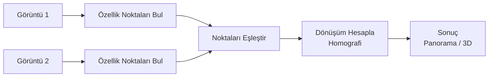

# OpenCV — Görüntü İşleme

!!! note "Bu Sayfa Ne Anlatıyor?"
    OpenCV'yi hiç kullanmamış biri için sıfırdan başlar. Görüntünün ne olduğunu açıklar, sonra kamera kalibrasyonu, stereo görüntüleme ve hareket takibini anlatır. Her bölüm "neden yapıyoruz?" sorusuna cevap verir.

---

## Görüntü Nedir? — Temelden Başlamak

Bir fotoğrafa yaklaştığınızda, ızgara şeklinde küçük renkli kareler görürsünüz. Bu karelerin her birine **piksel** (pixel) denir. Bir 1920×1080 çözünürlüklü görüntü, 1920 sütun × 1080 satır = **2.073.600 piksel** içerir.

Her piksel renk bilgisi tutar. Renk nasıl saklanır?

```
Renkli görüntü (BGR formatı — OpenCV'nin tercihi):
┌─────────────────────────────────────┐
│ Her piksel = [Blue, Green, Red]     │
│ Her kanal 0-255 arası bir sayı      │
│ [255, 0, 0] → tamamen mavi          │
│ [0, 255, 0] → tamamen yeşil         │
│ [0, 0, 255] → tamamen kırmızı       │
│ [255, 255, 255] → beyaz             │
│ [0, 0, 0] → siyah                   │
└─────────────────────────────────────┘
```

!!! warning "BGR mi, RGB mi?"
    OpenCV görüntüleri **BGR** sıralamasıyla saklar. Python'da `matplotlib` ile gösterirken veya başka kütüphanelere geçerken `cv2.cvtColor(img, cv2.COLOR_BGR2RGB)` ile dönüştürün, yoksa renkler yanlış görünür.

---

## OpenCV Kurulum ve Temel İşlemler

```bash
pip install opencv-python        # Temel OpenCV
pip install opencv-python-headless  # Sunucularda (ekran yok)
```

```python title="temel_islemler.py"
import cv2
import numpy as np

# ──────────────────────────────────────────
# 1. Görüntü okuma ve gösterme
# ──────────────────────────────────────────
img = cv2.imread("foto.jpg")          # Diskten oku
print(img.shape)                       # (yükseklik, genişlik, kanal) → (480, 640, 3)
print(img.dtype)                       # uint8 → 0-255 arası tam sayı

cv2.imshow("Pencere", img)            # Ekranda göster
cv2.waitKey(0)                         # Tuşa basılana kadar bekle
cv2.destroyAllWindows()

# ──────────────────────────────────────────
# 2. Görüntü kaydetme
# ──────────────────────────────────────────
cv2.imwrite("cikti.jpg", img)
cv2.imwrite("cikti.png", img)          # Kayıpsız format

# ──────────────────────────────────────────
# 3. Kameradan okuma
# ──────────────────────────────────────────
cap = cv2.VideoCapture(0)              # 0 = ilk kamera
while True:
    ret, frame = cap.read()            # ret=True: kare başarıyla okundu
    if not ret:
        break
    cv2.imshow("Kamera", frame)
    if cv2.waitKey(1) & 0xFF == ord('q'):  # 'q' tuşuna bas → çık
        break
cap.release()
cv2.destroyAllWindows()
```

---

## Renk Uzayları — Aynı Rengi Farklı Dillerde Söylemek

Rengi ifade etmenin birden fazla yolu var. Her birinin farklı kullanım alanı var:

| Uzay | Ne İçin | Örnek Kullanım |
|------|---------|----------------|
| **BGR** | OpenCV varsayılanı | Ham kamera görüntüsü |
| **Grayscale** | Tek kanal, sadece parlaklık | Kenar tespiti, eşikleme |
| **HSV** | Ton (Hue), Doygunluk, Değer | Renge göre nesne takibi |
| **LAB** | İnsan gözüne yakın renk algısı | Renk karşılaştırma |

```python title="renk_uzaylari.py"
img = cv2.imread("foto.jpg")

# BGR → Gri
gri = cv2.cvtColor(img, cv2.COLOR_BGR2GRAY)
print(gri.shape)   # (480, 640) → tek kanal, derinlik yok

# BGR → HSV (kırmızı rengi takip etmek için ideal)
hsv = cv2.cvtColor(img, cv2.COLOR_BGR2HSV)

# HSV'de kırmızı alanı maskele (ör: kırmızı top takibi)
alt_sinir = np.array([0, 120, 70])    # H, S, V minimum
ust_sinir = np.array([10, 255, 255])  # H, S, V maksimum
maske = cv2.inRange(hsv, alt_sinir, ust_sinir)

# Sadece kırmızı alanı göster
sonuc = cv2.bitwise_and(img, img, mask=maske)
```

---

## Temel Filtreler — Görüntüyü Yumuşatmak ve Keskinleştirmek

Filtreler, her pikseli komşularıyla birleştirerek çalışır. Buna **konvolüsyon** denir.

```
Blur (yumuşatma) nasıl çalışır?
┌───┬───┬───┐
│ 1 │ 2 │ 1 │   Bu çekirdek (kernel) görüntü üzerinde kaydırılır.
│ 2 │ 4 │ 2 │   Her piksel, komşularının ağırlıklı ortalaması olur.
│ 1 │ 2 │ 1 │   Sonuç: yumuşak, bulanık görüntü
└───┴───┴───┘   (Gaussian kernel örneği)
```

```python title="filtreler.py"
img = cv2.imread("foto.jpg")

# Gaussian blur — gürültüyü azaltır
blur = cv2.GaussianBlur(img, (5, 5), sigmaX=0)
# (5, 5) = çekirdek boyutu — tek sayı olmalı

# Median blur — tuz-biber gürültüsüne karşı etkili
median = cv2.medianBlur(img, 5)

# Bilateral filter — kenarları koruyarak yumuşatır (en kaliteli ama yavaş)
bilateral = cv2.bilateralFilter(img, d=9, sigmaColor=75, sigmaSpace=75)

# Keskinleştirme (sharpen)
kernel = np.array([[0, -1,  0],
                   [-1,  5, -1],
                   [0, -1,  0]])
keskin = cv2.filter2D(img, -1, kernel)
```

### Kenar Tespiti — Canny

Kenar = piksel yoğunluğunun ani değiştiği yer. Canny, bu değişimi bulur.

```python title="canny.py"
gri = cv2.cvtColor(img, cv2.COLOR_BGR2GRAY)
blur = cv2.GaussianBlur(gri, (5, 5), 0)        # Önce gürültüyü azalt
kenarlar = cv2.Canny(blur, threshold1=50, threshold2=150)
# threshold1: zayıf kenar alt eşiği
# threshold2: güçlü kenar üst eşiği
# İkisi arasındaki kenarlar, güçlü kenara bağlıysa korunur
```

---

## Morfolojik İşlemler — Şekli Temizlemek

Maske veya ikili (siyah-beyaz) görüntülerde gürültüyü temizler, delikleri kapatır.

```python title="morfoloji.py"
binary_img = cv2.threshold(gri, 127, 255, cv2.THRESH_BINARY)[1]

kernel = np.ones((5, 5), np.uint8)

# Erozyon: beyaz alanları küçültür (küçük noktaları siler)
erode  = cv2.erode(binary_img, kernel, iterations=1)

# Dilasyon: beyaz alanları büyütür (delikleri kapatır)
dilate = cv2.dilate(binary_img, kernel, iterations=1)

# Opening = Erozyon → Dilasyon: küçük beyaz noktaları siler
opening = cv2.morphologyEx(binary_img, cv2.MORPH_OPEN, kernel)

# Closing = Dilasyon → Erozyon: küçük delikleri kapatır
closing = cv2.morphologyEx(binary_img, cv2.MORPH_CLOSE, kernel)
```

---

## Kontur Tespiti — Şekil Bulmak

Kontur = bir şeklin dış sınırını izleyen eğri. Nesne sayma, boyut ölçme için kullanılır.

```python title="kontur.py"
gri = cv2.cvtColor(img, cv2.COLOR_BGR2GRAY)
_, binary = cv2.threshold(gri, 127, 255, cv2.THRESH_BINARY)

# Konturları bul
konturlar, _ = cv2.findContours(binary, cv2.RETR_EXTERNAL, cv2.CHAIN_APPROX_SIMPLE)
print(f"Bulunan nesne sayısı: {len(konturlar)}")

for k in konturlar:
    alan = cv2.contourArea(k)
    if alan < 500:       # Küçük gürültüyü atla
        continue

    # Sınır kutusunu çiz
    x, y, w, h = cv2.boundingRect(k)
    cv2.rectangle(img, (x, y), (x+w, y+h), (0, 255, 0), 2)

    # Merkezi bul
    M = cv2.moments(k)
    if M["m00"] > 0:
        cx = int(M["m10"] / M["m00"])
        cy = int(M["m01"] / M["m00"])
        cv2.circle(img, (cx, cy), 5, (0, 0, 255), -1)
```

---

## CV Algoritmaları — SIFT, ORB, Homografi

Bu algoritmalar "özellik noktaları" bulur. Özellik noktası = görüntüde belirgin, kolayca tanınabilir bir nokta (köşe, blob, vb.).

**Neden gerekli?**
- İki farklı açıdan çekilmiş görüntüdeki aynı nesneyi eşleştirmek
- Kamera hareketini ölçmek (visual odometry)
- Panoramik fotoğraf birleştirme (image stitching)
- 3D yeniden oluşturma



### ORB — Hızlı ve Ücretsiz

ORB (Oriented FAST + Rotated BRIEF), SIFT'e göre çok daha hızlı ve patent ücreti yok.

```python title="orb_eslestirme.py"
import cv2
import numpy as np

img1 = cv2.imread("nesne.jpg")
img2 = cv2.imread("sahne.jpg")
gri1 = cv2.cvtColor(img1, cv2.COLOR_BGR2GRAY)
gri2 = cv2.cvtColor(img2, cv2.COLOR_BGR2GRAY)

# ORB dedektör oluştur
orb = cv2.ORB_create(nfeatures=500)

# Her görüntüde özellik noktaları ve tanımlayıcıları bul
kp1, desc1 = orb.detectAndCompute(gri1, None)
kp2, desc2 = orb.detectAndCompute(gri2, None)

# Eşleştirici oluştur
bf = cv2.BFMatcher(cv2.NORM_HAMMING, crossCheck=True)
eslesmeler = bf.match(desc1, desc2)

# Mesafeye göre sırala (iyi eşleşmeler önce)
eslesmeler = sorted(eslesmeler, key=lambda x: x.distance)

# En iyi 50 eşleşmeyi çiz
gorsel = cv2.drawMatches(img1, kp1, img2, kp2,
                          eslesmeler[:50], None,
                          flags=cv2.DrawMatchesFlags_NOT_DRAW_SINGLE_POINTS)
cv2.imshow("Eşleşmeler", gorsel)
cv2.waitKey(0)
```

### SIFT — Daha Güvenilir Ama Yavaş

SIFT (Scale-Invariant Feature Transform), farklı ölçek ve dönüşlerde de aynı noktaları bulur.

```python title="sift.py"
sift = cv2.SIFT_create()
kp1, desc1 = sift.detectAndCompute(gri1, None)
kp2, desc2 = sift.detectAndCompute(gri2, None)

# FLANN eşleştirici (büyük veri setleri için daha hızlı)
FLANN_INDEX_KDTREE = 1
index_params  = dict(algorithm=FLANN_INDEX_KDTREE, trees=5)
search_params = dict(checks=50)
flann = cv2.FlannBasedMatcher(index_params, search_params)

# k=2: her nokta için 2 aday eşleşme bul
eslesmeler = flann.knnMatch(desc1, desc2, k=2)

# Lowe's ratio test: iyi eşleşmeleri filtrele
iyi = []
for m, n in eslesmeler:
    if m.distance < 0.7 * n.distance:   # m çok daha iyi ise kabul et
        iyi.append(m)
print(f"İyi eşleşme sayısı: {len(iyi)}")
```

### Homografi — Bir Görüntüyü Diğerine Dönüştürme

Homografi, iki görüntü düzlemi arasındaki perspektif dönüşümü matrisidir (3×3). Şunu yapar: "Bu 4 nokta şuradaysa, bütün görüntüyü nasıl bükmem lazım?"

```python title="homografi.py"
# Yeterli eşleşme varsa homografi hesapla
if len(iyi) >= 4:
    src_pts = np.float32([kp1[m.queryIdx].pt for m in iyi]).reshape(-1, 1, 2)
    dst_pts = np.float32([kp2[m.trainIdx].pt for m in iyi]).reshape(-1, 1, 2)

    # RANSAC: hatalı eşleşmeleri otomatik eler
    H, maske = cv2.findHomography(src_pts, dst_pts, cv2.RANSAC, 5.0)

    # Görüntü 1'i görüntü 2'nin perspektifine dönüştür
    h, w = gri1.shape
    donusturulmus = cv2.warpPerspective(img1, H, (img2.shape[1], img2.shape[0]))

    # Belge tarama: düzeltilmiş perspektif
    # Örnek: eğik çekilmiş makbuz/döküman → düz görünüm
    src_noktalar = np.float32([[0, 0], [w, 0], [w, h], [0, h]])
    dst_noktalar = np.float32([[50, 50], [300, 50], [300, 400], [50, 400]])
    H2 = cv2.getPerspectiveTransform(src_noktalar, dst_noktalar)
    duzeltilmis = cv2.warpPerspective(img1, H2, (350, 450))
```

!!! tip "RANSAC Ne Yapar?"
    Eşleştirilen noktaların bir kısmı yanlış olabilir (outlier). RANSAC, tüm noktaları dener ve en çok noktayla uyuşan dönüşümü seçer. Bu sayede kötü eşleşmeler sonucu bozmaz.

---

## Kamera Kalibrasyonu — Lensi Düzeltmek

### Problem: Lens Neden Bozuyor?

Gerçek kamera lenslerinde iki tür bozukluk (distortion) oluşur:

```
Radyal bozukluk (barrel distortion):
┌──────────┐     ┌──────────┐
│ Düz çizgi│ →   │ Kavisli  │
│ gerçekte │     │ görünür  │
└──────────┘     └──────────┘

Teğetsel bozukluk (tangential):
Lens tam merkezi değilse — görüntü eğrilir
```

**Kalibrasyon amacı:** Bu bozuklukları ölçmek ve düzeltmek. 3D hesaplamalar (stereo, SfM, AR) için zorunlu.

### Satranç Tahtası Yöntemi

```python title="kalibrasyon_veri_toplama.py"
import cv2
import numpy as np

SATIR = 6       # İç köşe sayısı — dikey
SUTUN = 9       # İç köşe sayısı — yatay
KARE_BOY = 25   # mm cinsinden her karenin boyutu

# 3D gerçek dünya koordinatları (z=0, düzlemde)
objp = np.zeros((SATIR * SUTUN, 3), np.float32)
objp[:, :2] = np.mgrid[0:SUTUN, 0:SATIR].T.reshape(-1, 2) * KARE_BOY

obj_points = []   # 3D noktalar (gerçek dünya)
img_points = []   # 2D noktalar (görüntüde)

cap = cv2.VideoCapture(0)
print("Farklı açılardan ~20 fotoğraf çekin. 'c' ile kaydedin, 'q' ile bitirin.")

while True:
    ret, frame = cap.read()
    gri = cv2.cvtColor(frame, cv2.COLOR_BGR2GRAY)

    # Satranç tahtası köşelerini bul
    bulundu, koseler = cv2.findChessboardCorners(gri, (SUTUN, SATIR), None)

    if bulundu:
        # Alt piksel hassasiyetine iyileştir
        criteria = (cv2.TERM_CRITERIA_EPS + cv2.TERM_CRITERIA_MAX_ITER, 30, 0.001)
        koseler2 = cv2.cornerSubPix(gri, koseler, (11, 11), (-1, -1), criteria)
        cv2.drawChessboardCorners(frame, (SUTUN, SATIR), koseler2, bulundu)

    cv2.imshow("Kalibrasyon", frame)
    tus = cv2.waitKey(1) & 0xFF

    if tus == ord('c') and bulundu:
        obj_points.append(objp)
        img_points.append(koseler2)
        print(f"Kaydedildi: {len(obj_points)} / 20")

    if tus == ord('q') or len(obj_points) >= 20:
        break

cap.release()
```

```python title="kalibrasyon_hesapla.py"
# Kalibrasyonu hesapla
ret, K, dist, rvecs, tvecs = cv2.calibrateCamera(
    obj_points, img_points, gri.shape[::-1], None, None
)

print("Kamera Matrisi (K):")
print(K)
# K = [[fx, 0,  cx],   fx, fy: odak uzunluğu (piksel)
#       [0,  fy, cy],   cx, cy: görüntü merkezi (piksel)
#       [0,  0,  1 ]]

print("\nBozukluk Katsayıları (dist):")
print(dist)   # [k1, k2, p1, p2, k3] — radyal ve teğetsel bozukluk

# Kalibrasyon hatasını değerlendir (reprojection error)
ortalama_hata = 0
for i in range(len(obj_points)):
    img_pts2, _ = cv2.projectPoints(obj_points[i], rvecs[i], tvecs[i], K, dist)
    hata = cv2.norm(img_points[i], img_pts2, cv2.NORM_L2) / len(img_pts2)
    ortalama_hata += hata
print(f"\nOrtalama yeniden projeksiyon hatası: {ortalama_hata / len(obj_points):.4f} piksel")
# < 0.5 piksel → iyi kalibrasyon

# Kalibrasyonu kaydet
np.save("kalibrasyon.npy", {"K": K, "dist": dist})
```

```python title="bozukluk_duzelt.py"
# Bozukluk düzeltme
veriler = np.load("kalibrasyon.npy", allow_pickle=True).item()
K    = veriler["K"]
dist = veriler["dist"]

img = cv2.imread("bozuk_foto.jpg")
h, w = img.shape[:2]

# Optimum yeni kamera matrisi
K_yeni, roi = cv2.getOptimalNewCameraMatrix(K, dist, (w, h), alpha=1)

# Bozukluğu gider
duzeltilmis = cv2.undistort(img, K, dist, None, K_yeni)

# ROI (geçerli alan) kırp
x, y, w, h = roi
duzeltilmis = duzeltilmis[y:y+h, x:x+w]
cv2.imwrite("duzeltilmis.jpg", duzeltilmis)
```

---

## Stereo Görüntüleme — İki Kamerayla Derinlik Ölçümü

### Çalışma Prensibi

İnsanlar iki gözle mesafeyi şöyle ölçer: Bir nesneye sağ gözle bakınca farklı açıdan, sol gözle bakınca farklı açıdan görürüz. Bu farka **paralaks** (disparity) denir. Paralaks ne kadar büyükse nesne o kadar yakındır.

```
Sol kamera         Sağ kamera
    🔴 ←  Nesne  → 🔴
    |               |
    |← Taban çizgisi→|
    |    (baseline)  |

Sol görüntüde X1 = 320 piksel
Sağ görüntüde X2 = 285 piksel
Paralaks = X1 - X2 = 35 piksel

Derinlik Z = (f × B) / disparity
  f = odak uzunluğu (piksel)
  B = kameralar arası mesafe (metre)
```

### Stereo Kamera Kalibrasyonu

```python title="stereo_kalibrasyon.py"
import cv2
import numpy as np

# Her iki kamera için ayrı ayrı tek kamera kalibrasyonu yapıldığını varsay
# K1, dist1 → sol kamera
# K2, dist2 → sağ kamera

# Stereo kalibrasyon
flags = cv2.CALIB_FIX_INTRINSIC   # Tek kamera değerleri sabitle

ret, K1, dist1, K2, dist2, R, T, E, F = cv2.stereoCalibrate(
    obj_points,    # 3D noktalar
    img_points_L,  # Sol görüntüdeki 2D noktalar
    img_points_R,  # Sağ görüntüdeki 2D noktalar
    K1, dist1,
    K2, dist2,
    gri.shape[::-1],
    flags=flags
)

# R: Sağ kameranın sol kameraya göre dönüş matrisi
# T: Sağ kameranın sol kameraya göre öteleme vektörü (taban çizgisi)
print(f"Taban çizgisi: {np.linalg.norm(T) * 100:.1f} cm")

# Stereo rectification — iki görüntüyü aynı düzleme hizala
R1, R2, P1, P2, Q, roi1, roi2 = cv2.stereoRectify(
    K1, dist1, K2, dist2,
    gri.shape[::-1], R, T
)

# Q matrisi: 2D → 3D dönüşüm için kullanılır
# Q = [[1, 0,  0,  -cx],
#       [0, 1,  0,  -cy],
#       [0, 0,  0,   f ],
#       [0, 0, -1/T, 0 ]]
```

### Derinlik Haritası Hesaplama

```python title="derinlik_haritasi.py"
import cv2
import numpy as np

# Rektifikasyon haritalarını önceden hesapla (hız için)
map1L, map2L = cv2.initUndistortRectifyMap(K1, dist1, R1, P1, boyut, cv2.CV_32FC1)
map1R, map2R = cv2.initUndistortRectifyMap(K2, dist2, R2, P2, boyut, cv2.CV_32FC1)

# Her kare için:
imgL = cv2.imread("sol.jpg")
imgR = cv2.imread("sag.jpg")

# Rectify (hizala)
rectL = cv2.remap(imgL, map1L, map2L, cv2.INTER_LINEAR)
rectR = cv2.remap(imgR, map1R, map2R, cv2.INTER_LINEAR)

gL = cv2.cvtColor(rectL, cv2.COLOR_BGR2GRAY)
gR = cv2.cvtColor(rectR, cv2.COLOR_BGR2GRAY)

# SGBM (Semi-Global Block Matching) — kaliteli derinlik haritası
stereo = cv2.StereoSGBM_create(
    minDisparity=0,
    numDisparities=128,   # 16'nın katı olmalı
    blockSize=11,
    P1=8 * 3 * 11**2,    # Yumuşaklık parametresi
    P2=32 * 3 * 11**2,
    disp12MaxDiff=1,
    uniquenessRatio=10,
    speckleWindowSize=100,
    speckleRange=32,
    mode=cv2.STEREO_SGBM_MODE_SGBM_3WAY
)

disparity = stereo.compute(gL, gR).astype(np.float32) / 16.0

# Paralaks → gerçek derinlik (metre)
nokta_bulutu = cv2.reprojectImageTo3D(disparity, Q)
# nokta_bulutu[y, x] = [X, Y, Z] — gerçek 3D koordinat (metre)

# Görselleştirme
disparity_norm = cv2.normalize(disparity, None, 0, 255, cv2.NORM_MINMAX, cv2.CV_8U)
renk_map = cv2.applyColorMap(disparity_norm, cv2.COLORMAP_JET)
cv2.imshow("Derinlik Haritası", renk_map)

# Belirli bir pikselin mesafesini sor
x, y = 320, 240   # merkez piksel
Z = nokta_bulutu[y, x, 2]
print(f"Merkezdeki nesne {Z:.2f} metre uzakta")
```

!!! tip "Stereo İpuçları"
    - **Taban çizgisi (baseline)**: İki kamera arasındaki mesafe. Uzak nesneler için geniş, yakın nesneler için dar baseline gerekir
    - **numDisparities**: Bu değeri artırmak daha uzak nesneleri ölçer ama yavaşlatır
    - **blockSize**: Küçük = daha fazla detay ama gürültülü; büyük = düzgün ama detay kaybı

---

## Optical Flow — Hareketi Takip Etmek

Optical flow, video karelerindeki **piksel hareketi** hesaplar. "Bu piksel bir sonraki karede nereye gitti?"

### Lucas-Kanade — Seçili Noktaları Takip Et

```python title="lucas_kanade.py"
import cv2
import numpy as np

# Takip parametreleri
lk_params = dict(
    winSize=(15, 15),     # Arama penceresi
    maxLevel=2,            # Piramit seviyeleri (büyük hareketler için)
    criteria=(cv2.TERM_CRITERIA_EPS | cv2.TERM_CRITERIA_COUNT, 10, 0.03)
)

# Kamera başlat
cap = cv2.VideoCapture(0)
ret, old_frame = cap.read()
old_gray = cv2.cvtColor(old_frame, cv2.COLOR_BGR2GRAY)

# Takip edilecek köşe noktaları bul (Shi-Tomasi)
feature_params = dict(maxCorners=100, qualityLevel=0.3, minDistance=7, blockSize=7)
p0 = cv2.goodFeaturesToTrack(old_gray, mask=None, **feature_params)

# Çizim tuvali (izler için)
tuval = np.zeros_like(old_frame)
renkler = np.random.randint(0, 255, (100, 3))

while True:
    ret, frame = cap.read()
    if not ret:
        break
    frame_gray = cv2.cvtColor(frame, cv2.COLOR_BGR2GRAY)

    # Noktaları bir sonraki karede bul
    p1, st, err = cv2.calcOpticalFlowPyrLK(old_gray, frame_gray, p0, None, **lk_params)

    # İyi takip edilen noktalar (st=1)
    iyi_yeni  = p1[st == 1]
    iyi_eski  = p0[st == 1]

    # Hareket izlerini çiz
    for i, (yeni, eski) in enumerate(zip(iyi_yeni, iyi_eski)):
        a, b = yeni.ravel().astype(int)
        c, d = eski.ravel().astype(int)
        tuval = cv2.line(tuval, (a, b), (c, d), renkler[i].tolist(), 2)
        frame = cv2.circle(frame, (a, b), 5, renkler[i].tolist(), -1)

    sonuc = cv2.add(frame, tuval)
    cv2.imshow("Optical Flow", sonuc)

    if cv2.waitKey(30) & 0xFF == ord('q'):
        break

    old_gray = frame_gray.copy()
    p0 = iyi_yeni.reshape(-1, 1, 2)
```

### Farneback — Tüm Görüntüde Yoğun Akış

Her piksel için hareket vektörü hesaplar. Daha yavaş ama kapsamlı.

```python title="farneback.py"
import cv2
import numpy as np

cap = cv2.VideoCapture(0)
ret, old = cap.read()
old_gray = cv2.cvtColor(old, cv2.COLOR_BGR2GRAY)

while True:
    ret, frame = cap.read()
    frame_gray = cv2.cvtColor(frame, cv2.COLOR_BGR2GRAY)

    # Yoğun optical flow
    flow = cv2.calcOpticalFlowFarneback(
        old_gray, frame_gray, None,
        pyr_scale=0.5, levels=3, winsize=15,
        iterations=3, poly_n=5, poly_sigma=1.2, flags=0
    )
    # flow.shape = (h, w, 2) — her piksel için (dx, dy)

    # Polar koordinata çevir (büyüklük + açı)
    mag, ang = cv2.cartToPolar(flow[..., 0], flow[..., 1])

    # HSV renk haritasına dönüştür (yön=renk, hız=parlaklık)
    hsv = np.zeros_like(old)
    hsv[..., 1] = 255
    hsv[..., 0] = ang * 180 / np.pi / 2   # Açı → renk tonu
    hsv[..., 2] = cv2.normalize(mag, None, 0, 255, cv2.NORM_MINMAX)
    bgr = cv2.cvtColor(hsv, cv2.COLOR_HSV2BGR)

    # Ortalama hareketi ölç (kamera hareketi tespiti)
    ortalama_hareket = np.mean(mag)
    if ortalama_hareket > 5:
        print(f"Hareket tespit edildi! Büyüklük: {ortalama_hareket:.1f}")

    cv2.imshow("Dense Optical Flow", bgr)
    old_gray = frame_gray.copy()
    if cv2.waitKey(30) & 0xFF == ord('q'):
        break
```

### Uygulama: Hareket Tespiti

```python title="hareket_tespiti.py"
import cv2
import numpy as np

cap = cv2.VideoCapture(0)
ret, ref = cap.read()
ref_gray = cv2.cvtColor(ref, cv2.COLOR_BGR2GRAY)
ref_blur = cv2.GaussianBlur(ref_gray, (21, 21), 0)

while True:
    ret, frame = cap.read()
    gray = cv2.cvtColor(frame, cv2.COLOR_BGR2GRAY)
    blur = cv2.GaussianBlur(gray, (21, 21), 0)

    # Referans kare ile fark al
    fark = cv2.absdiff(ref_blur, blur)
    _, esik = cv2.threshold(fark, 25, 255, cv2.THRESH_BINARY)
    esik = cv2.dilate(esik, None, iterations=2)

    konturlar, _ = cv2.findContours(esik, cv2.RETR_EXTERNAL, cv2.CHAIN_APPROX_SIMPLE)
    for k in konturlar:
        if cv2.contourArea(k) < 1000:
            continue
        x, y, w, h = cv2.boundingRect(k)
        cv2.rectangle(frame, (x, y), (x+w, y+h), (0, 255, 0), 2)
        cv2.putText(frame, "HAREKET!", (10, 20), cv2.FONT_HERSHEY_SIMPLEX, 0.8, (0, 0, 255), 2)

    cv2.imshow("Hareket Tespiti", frame)
    if cv2.waitKey(30) & 0xFF == ord('q'):
        break
```

---

## Stereo + Nesne Tespiti Füzyonu

Kamera nesneyi tespit ederse "bu nesne kaç metre uzakta?" sorusunu stereo ile cevaplayabiliriz.

```python title="stereo_nesne_mesafe.py"
import cv2
import numpy as np

# Stereo haritalar ve Q matrisi önceden hesaplandı varsayalım
# map1L, map2L, map1R, map2R, Q

def stereo_mesafe_olc(bbox, disparity, Q):
    """Tespit edilen bir nesnenin merkez pikselinden mesafeyi hesapla"""
    x, y, w, h = bbox
    cx = x + w // 2
    cy = y + h // 2

    # Paralaks değeri
    d = disparity[cy, cx]
    if d <= 0:
        return None   # Geçersiz paralaks

    # 3D noktayı geri project et
    nokta = np.array([[cx, cy, d, 1]], dtype=np.float32)
    nokta_3d = Q @ nokta[0]
    Z = nokta_3d[2] / nokta_3d[3]   # Homojen → Kartezyen
    return max(0.1, Z)   # Minimum 10 cm

# Ana döngü
capL = cv2.VideoCapture(0)   # Sol kamera
capR = cv2.VideoCapture(1)   # Sağ kamera

stereo = cv2.StereoSGBM_create(minDisparity=0, numDisparities=128, blockSize=11)

while True:
    retL, frameL = capL.read()
    retR, frameR = capR.read()
    if not retL or not retR:
        break

    # Rectify
    rectL = cv2.remap(frameL, map1L, map2L, cv2.INTER_LINEAR)
    rectR = cv2.remap(frameR, map1R, map2R, cv2.INTER_LINEAR)

    # Derinlik haritası
    gL = cv2.cvtColor(rectL, cv2.COLOR_BGR2GRAY)
    gR = cv2.cvtColor(rectR, cv2.COLOR_BGR2GRAY)
    disparity = stereo.compute(gL, gR).astype(np.float32) / 16.0

    # Nesne tespiti (örnek: sabit bbox — YOLO ile gelir normalde)
    tespitler = [(100, 200, 80, 120)]   # [(x, y, w, h), ...]

    for bbox in tespitler:
        mesafe = stereo_mesafe_olc(bbox, disparity, Q)
        if mesafe:
            x, y, w, h = bbox
            cv2.rectangle(rectL, (x, y), (x+w, y+h), (0, 255, 0), 2)
            cv2.putText(rectL, f"{mesafe:.2f}m", (x, y - 10),
                        cv2.FONT_HERSHEY_SIMPLEX, 0.7, (0, 255, 0), 2)

    cv2.imshow("Stereo + Nesne", rectL)
    if cv2.waitKey(1) & 0xFF == ord('q'):
        break
```

---

## Pratik İpuçları

!!! tip "Performans"
    - Büyük görüntülerle çalışıyorsan önce boyutu küçült: `cv2.resize(img, (640, 480))`
    - Video işlemede her kareyi işleme gerek yok: her 2-3 karede bir işle
    - `cv2.VideoWriter_fourcc` ile H264 kodlayıcı kullan, AVI yerine MP4 çıkar

!!! warning "Sık Yapılan Hatalar"
    - `cv2.imread()` başarısız olursa `None` döner — her zaman kontrol et
    - Gri görüntüde `shape` 2 boyutlu — `(h, w)`. BGR'de 3 boyutlu — `(h, w, 3)`
    - `waitKey(0)` → sonsuza kadar bekler; `waitKey(1)` → 1ms bekler (video için)
    - Koordinatlar her zaman `(x, y)` sıralamasında ama array indexleme `[y, x]` sıralamasındadır
