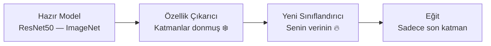

# PyTorch — Derin Öğrenme Temelleri

!!! note "Bu Sayfa Ne Anlatıyor?"
    PyTorch'u hiç kullanmamış biri için sıfırdan başlar. Tensor kavramından başlar, hazır model kullanmayı, kendi modelini eğitmeyi ve fine-tuning yapmayı anlatır. Her adım "neden yapıyoruz?" sorusuna cevap verir.

---

## PyTorch Nedir?

PyTorch, Facebook (Meta) tarafından geliştirilen bir **derin öğrenme çerçevesidir**. NumPy gibi düşün ama:

- GPU ile çalışabilir (100× daha hızlı)
- Sinir ağları otomatik türev alabilir (otogradient)
- Araştırmacılar ve endüstri tarafından en çok tercih edilen kütüphane

```bash
pip install torch torchvision torchaudio
# CUDA versiyonu (NVIDIA GPU varsa):
pip install torch torchvision --index-url https://download.pytorch.org/whl/cu118
```

---

## Tensor — Her Şeyin Temeli

Tensor, çok boyutlu sayı dizisidir. NumPy array'i gibi düşün ama GPU'da çalışabilir.

```python title="tensor_temelleri.py"
import torch
import numpy as np

# ──────────────────────────────────────────
# Tensor oluşturma
# ──────────────────────────────────────────
skaler   = torch.tensor(3.14)              # 0 boyutlu (tek sayı)
vektor   = torch.tensor([1.0, 2.0, 3.0])  # 1 boyutlu
matris   = torch.tensor([[1, 2], [3, 4]]) # 2 boyutlu
kup      = torch.zeros(3, 4, 5)           # 3 boyutlu, sıfırlarla dolu

print(vektor.shape)    # torch.Size([3])
print(matris.dtype)    # torch.int64
print(kup.ndim)        # 3

# Görüntü tensoru: [Batch, Kanal, Yükseklik, Genişlik]
resim_batch = torch.zeros(8, 3, 224, 224)   # 8 adet 224×224 RGB görüntü

# ──────────────────────────────────────────
# Temel işlemler
# ──────────────────────────────────────────
a = torch.tensor([1.0, 2.0, 3.0])
b = torch.tensor([4.0, 5.0, 6.0])
print(a + b)            # tensor([5., 7., 9.])
print(a * b)            # tensor([ 4., 10., 18.])  — eleman bazlı çarpma
print(torch.dot(a, b))  # tensor(32.) — iç çarpım

# Matris çarpımı
A = torch.rand(3, 4)
B = torch.rand(4, 5)
C = A @ B               # (3×4) × (4×5) = (3×5)

# ──────────────────────────────────────────
# NumPy ile dönüşüm
# ──────────────────────────────────────────
np_dizi = np.array([1.0, 2.0, 3.0])
tensor  = torch.from_numpy(np_dizi)    # NumPy → Tensor (bellek paylaşımı!)
geri    = tensor.numpy()               # Tensor → NumPy

# ──────────────────────────────────────────
# GPU'ya taşıma
# ──────────────────────────────────────────
device = torch.device("cuda" if torch.cuda.is_available() else "cpu")
print(f"Kullanılan cihaz: {device}")

tensor_gpu = vektor.to(device)         # GPU'ya gönder
tensor_cpu = tensor_gpu.cpu()          # CPU'ya geri al
```

---

## Otomatik Türev (Autograd)

Sinir ağlarını eğitmek için gradyan (türev) gerekir. PyTorch bunu otomatik hesaplar.

```python title="autograd.py"
# requires_grad=True: bu tensörün gradyanını takip et
x = torch.tensor(3.0, requires_grad=True)

# İleri geçiş
y = x ** 2 + 2 * x + 1    # y = x² + 2x + 1

# Geri geçiş (türev hesapla)
y.backward()

print(x.grad)   # dy/dx = 2x + 2 → x=3 için → 8.0
```

```python title="gradyan_descent.py"
# Basit gradyan iniş örneği
# Hedef: f(w) = (w - 5)² → minimum w = 5

w = torch.tensor(0.0, requires_grad=True)

for adim in range(100):
    kayip = (w - 5) ** 2       # İleri geçiş
    kayip.backward()            # Türev hesapla
    with torch.no_grad():
        w -= 0.1 * w.grad      # w = w - lr * df/dw
        w.grad.zero_()         # Gradyanı sıfırla! (önemli)

    if adim % 10 == 0:
        print(f"Adım {adim}: w={w.item():.3f}, kayıp={kayip.item():.4f}")

# Adım 0:   w=1.000, kayıp=16.0000
# Adım 90:  w=4.982, kayıp=0.0003
```

---

## Sinir Ağı Yapısı — nn.Module

Her sinir ağı `nn.Module` sınıfından türetilir.

```python title="basit_ag.py"
import torch
import torch.nn as nn

class BasitAg(nn.Module):
    def __init__(self):
        super().__init__()
        # Katmanları tanımla
        self.katman1 = nn.Linear(784, 256)   # 784 giriş, 256 çıkış
        self.katman2 = nn.Linear(256, 128)
        self.cikis   = nn.Linear(128, 10)    # 10 sınıf (MNIST rakamları)
        self.relu    = nn.ReLU()
        self.dropout = nn.Dropout(p=0.5)     # Overfitting önleme

    def forward(self, x):
        # İleri geçiş — veri bu sırayla akar
        x = self.relu(self.katman1(x))
        x = self.dropout(x)
        x = self.relu(self.katman2(x))
        x = self.cikis(x)
        return x   # Ham skorlar (softmax uygulanmamış)

model = BasitAg()
print(model)

# Parametre sayısını hesapla
toplam = sum(p.numel() for p in model.parameters())
print(f"Toplam parametre: {toplam:,}")   # ~236,000

# Test: rastgele görüntü ile ileri geçiş
x = torch.rand(32, 784)   # 32 görüntü, her biri 784 piksel
cikis = model(x)
print(cikis.shape)         # torch.Size([32, 10])
```

---

## Veri Yükleme — Dataset ve DataLoader

```python title="veri_yukleme.py"
import torch
from torch.utils.data import Dataset, DataLoader
from torchvision import datasets, transforms
from PIL import Image
import os

# ──────────────────────────────────────────
# Hazır veri seti (torchvision)
# ──────────────────────────────────────────
donusum = transforms.Compose([
    transforms.Resize((224, 224)),       # Boyutu sabitle
    transforms.RandomHorizontalFlip(),   # Veri çoğaltma (augmentation)
    transforms.ToTensor(),               # PIL/numpy → Tensor (0-255 → 0.0-1.0)
    transforms.Normalize(                # Normalizasyon (ImageNet ortalaması)
        mean=[0.485, 0.456, 0.406],
        std=[0.229, 0.224, 0.225]
    )
])

egitim_verisi = datasets.ImageFolder("data/train", transform=donusum)
test_verisi   = datasets.ImageFolder("data/test",  transform=donusum)

print(f"Sınıflar: {egitim_verisi.classes}")   # ['kedi', 'kopek', ...]
print(f"Eğitim örneği: {len(egitim_verisi)}")

egitim_yukleyici = DataLoader(egitim_verisi, batch_size=32, shuffle=True,  num_workers=4)
test_yukleyici   = DataLoader(test_verisi,   batch_size=64, shuffle=False, num_workers=4)

# ──────────────────────────────────────────
# Kendi Dataset sınıfın
# ──────────────────────────────────────────
class OzelDataset(Dataset):
    def __init__(self, resim_klasoru, transform=None):
        self.klasor = resim_klasoru
        self.transform = transform
        self.dosyalar = os.listdir(resim_klasoru)

    def __len__(self):
        return len(self.dosyalar)

    def __getitem__(self, idx):
        dosya = self.dosyalar[idx]
        resim = Image.open(os.path.join(self.klasor, dosya)).convert("RGB")
        etiket = int(dosya.split("_")[0])   # Dosya adından etiket çıkar

        if self.transform:
            resim = self.transform(resim)
        return resim, etiket
```

---

## Model Eğitimi — Standart Döngü

```python title="egitim_dongusu.py"
import torch
import torch.nn as nn
from torch.optim import Adam

device = torch.device("cuda" if torch.cuda.is_available() else "cpu")

model = BasitAg().to(device)
kayip_fonksiyonu = nn.CrossEntropyLoss()   # Sınıflandırma için standart
optimizer = Adam(model.parameters(), lr=1e-3, weight_decay=1e-4)

# Öğrenme hızı zamanlayıcı: her epoch'ta %90'a indir
scheduler = torch.optim.lr_scheduler.StepLR(optimizer, step_size=10, gamma=0.9)

def egitim_epogu(model, yukleyici):
    model.train()   # Dropout ve BatchNorm aktif
    toplam_kayip = 0.0
    dogru_sayisi = 0

    for resimler, etiketler in yukleyici:
        resimler = resimler.to(device)
        etiketler = etiketler.to(device)

        optimizer.zero_grad()            # 1. Gradyanı sıfırla
        cikis = model(resimler)          # 2. İleri geçiş
        kayip = kayip_fonksiyonu(cikis, etiketler)  # 3. Kaybı hesapla
        kayip.backward()                 # 4. Geri geçiş (gradyan hesapla)
        optimizer.step()                 # 5. Ağırlıkları güncelle

        toplam_kayip += kayip.item()
        _, tahmin = cikis.max(1)
        dogru_sayisi += (tahmin == etiketler).sum().item()

    return toplam_kayip / len(yukleyici), dogru_sayisi / len(yukleyici.dataset)

def degerlendirme_epogu(model, yukleyici):
    model.eval()   # Dropout ve BatchNorm devre dışı
    toplam_kayip = 0.0
    dogru_sayisi = 0

    with torch.no_grad():   # Gradyan hesaplama — bellek tasarrufu
        for resimler, etiketler in yukleyici:
            resimler = resimler.to(device)
            etiketler = etiketler.to(device)

            cikis = model(resimler)
            kayip = kayip_fonksiyonu(cikis, etiketler)
            toplam_kayip += kayip.item()
            _, tahmin = cikis.max(1)
            dogru_sayisi += (tahmin == etiketler).sum().item()

    return toplam_kayip / len(yukleyici), dogru_sayisi / len(yukleyici.dataset)

# ──────────────────────────────────────────
# Eğitim döngüsü
# ──────────────────────────────────────────
en_iyi_dogruluk = 0.0
for epoch in range(50):
    egitim_kayip, egitim_dogruluk     = egitim_epogu(model, egitim_yukleyici)
    degerlendirme_kayip, val_dogruluk = degerlendirme_epogu(model, test_yukleyici)
    scheduler.step()

    print(f"Epoch {epoch+1:2d} | "
          f"Eğitim: kayıp={egitim_kayip:.4f} doğruluk=%{egitim_dogruluk*100:.1f} | "
          f"Val: kayıp={degerlendirme_kayip:.4f} doğruluk=%{val_dogruluk*100:.1f}")

    # En iyi modeli kaydet
    if val_dogruluk > en_iyi_dogruluk:
        en_iyi_dogruluk = val_dogruluk
        torch.save(model.state_dict(), "en_iyi_model.pth")
        print(f"  → Yeni en iyi model kaydedildi (%{val_dogruluk*100:.1f})")
```

---

## Hazır Model Kullanma — torchvision.models

Sıfırdan eğitmek yerine zaten güçlü bir modeli yükleyip kullanabilirsin.

```python title="hazir_model.py"
import torch
from torchvision import models, transforms
from PIL import Image

device = torch.device("cuda" if torch.cuda.is_available() else "cpu")

# ──────────────────────────────────────────
# ImageNet'te eğitilmiş ResNet50 yükle
# ──────────────────────────────────────────
model = models.resnet50(weights=models.ResNet50_Weights.IMAGENET1K_V2)
model.eval().to(device)

# ImageNet sınıflarını yükle
import urllib.request, json
url = "https://raw.githubusercontent.com/anishathalye/imagenet-simple-labels/master/imagenet-simple-labels.json"
siniflar = json.load(urllib.request.urlopen(url))

# ──────────────────────────────────────────
# Görüntü sınıflandırma
# ──────────────────────────────────────────
donusum = transforms.Compose([
    transforms.Resize(256),
    transforms.CenterCrop(224),
    transforms.ToTensor(),
    transforms.Normalize([0.485, 0.456, 0.406], [0.229, 0.224, 0.225])
])

resim = Image.open("kopek.jpg").convert("RGB")
tensor = donusum(resim).unsqueeze(0).to(device)  # [1, 3, 224, 224]

with torch.no_grad():
    cikis = model(tensor)
    olasiliklar = torch.softmax(cikis, dim=1)
    en_yuksek = olasiliklar.topk(5)

print("En yüksek 5 tahmin:")
for olasilik, idx in zip(en_yuksek.values[0], en_yuksek.indices[0]):
    print(f"  {siniflar[idx]}: %{olasilik.item()*100:.1f}")
```

---

## Transfer Learning ve Fine-Tuning

**Transfer learning**: Büyük veri setiyle eğitilmiş modelin öğrendiği özellikleri kendi problemine aktar.

**Neden işe yarar?** ResNet kedi/köpek fotoğraflarında kenar, şekil, doku öğrendi. Sen de kendi verinde bu bilgileri kullanabilirsin — az veriyle yüksek doğruluk.



```python title="fine_tuning.py"
import torch
import torch.nn as nn
from torchvision import models

SINIF_SAYISI = 5   # Kendi veri setindeki sınıf sayısı
device = torch.device("cuda" if torch.cuda.is_available() else "cpu")

# ──────────────────────────────────────────
# Strateji 1: Özellik Çıkarma (Feature Extraction)
# Tüm katmanları dondur, sadece son katmanı eğit
# Az verin varsa, birkaç epoch yeterli → hızlı
# ──────────────────────────────────────────
model = models.resnet50(weights=models.ResNet50_Weights.IMAGENET1K_V2)

# Tüm katmanları dondur
for param in model.parameters():
    param.requires_grad = False

# Son katmanı değiştir (1000 ImageNet sınıfı → senin sınıf sayın)
model.fc = nn.Linear(model.fc.in_features, SINIF_SAYISI)
# Sadece fc katmanının requires_grad=True (otomatik)

model = model.to(device)

# Sadece son katmanın parametrelerini optimize et
optimizer = torch.optim.Adam(model.fc.parameters(), lr=1e-3)

# ──────────────────────────────────────────
# Strateji 2: Fine-Tuning
# Tüm katmanları eğit ama farklı öğrenme hızlarıyla
# Daha fazla verin varsa, daha iyi sonuç → yavaş
# ──────────────────────────────────────────
model2 = models.efficientnet_b4(weights=models.EfficientNet_B4_Weights.DEFAULT)
model2.classifier[1] = nn.Linear(model2.classifier[1].in_features, SINIF_SAYISI)

# Özellik katmanları: düşük öğrenme hızı (1e-4)
# Son sınıflandırıcı: yüksek öğrenme hızı (1e-3)
optimizer2 = torch.optim.Adam([
    {"params": model2.features.parameters(), "lr": 1e-4},
    {"params": model2.classifier.parameters(), "lr": 1e-3}
])

# ──────────────────────────────────────────
# Model kaydetme ve yükleme
# ──────────────────────────────────────────

# Sadece ağırlıkları kaydet (önerilen)
torch.save(model.state_dict(), "model_agirliklari.pth")

# Yükle
model_yuklu = models.resnet50()
model_yuklu.fc = nn.Linear(model_yuklu.fc.in_features, SINIF_SAYISI)
model_yuklu.load_state_dict(torch.load("model_agirliklari.pth"))
model_yuklu.eval()

# Tüm modeli kaydet (eğer mimarisi değişebilirse)
torch.save(model, "tum_model.pth")
model_tam = torch.load("tum_model.pth")
```

---

## Çıkarım — Modeli Kullanmak

```python title="cikirim.py"
import torch
from torchvision import transforms
from PIL import Image
import numpy as np

model.eval()

def tahmin_et(resim_yolu: str) -> tuple[str, float]:
    """Tek bir görüntü için sınıf tahmini yap"""
    resim = Image.open(resim_yolu).convert("RGB")
    tensor = donusum(resim).unsqueeze(0).to(device)   # Batch boyutu ekle

    with torch.no_grad():
        cikis = model(tensor)
        olasilik = torch.softmax(cikis, dim=1)
        en_yuksek_idx = olasilik.argmax(1).item()
        guven = olasilik[0, en_yuksek_idx].item()

    return siniflar[en_yuksek_idx], guven

sinif, guven = tahmin_et("test_resim.jpg")
print(f"Tahmin: {sinif} (güven: %{guven*100:.1f})")

# ──────────────────────────────────────────
# Gerçek zamanlı kamera ile çıkarım
# ──────────────────────────────────────────
import cv2

cap = cv2.VideoCapture(0)
while True:
    ret, frame = cap.read()
    if not ret:
        break

    resim = Image.fromarray(cv2.cvtColor(frame, cv2.COLOR_BGR2RGB))
    sinif, guven = tahmin_et_resim(resim)   # PIL Image versiyonu

    cv2.putText(frame, f"{sinif}: %{guven*100:.0f}",
                (10, 30), cv2.FONT_HERSHEY_SIMPLEX, 1, (0, 255, 0), 2)
    cv2.imshow("Canlı Tahmin", frame)

    if cv2.waitKey(1) & 0xFF == ord('q'):
        break
cap.release()
```

---

## Yaygın Sorunlar ve Çözümleri

!!! warning "Overfitting — Model Eğitim Verisini Ezberledi"
    Belirtisi: Eğitim doğruluğu yüksek, validasyon doğruluğu düşük.
    
    Çözümler:
    ```python
    # 1. Dropout ekle
    nn.Dropout(p=0.5)
    
    # 2. L2 regularization (weight decay)
    optimizer = Adam(params, lr=1e-3, weight_decay=1e-4)
    
    # 3. Veri çoğaltma (augmentation)
    transforms.RandomHorizontalFlip()
    transforms.RandomRotation(15)
    transforms.ColorJitter(brightness=0.2, contrast=0.2)
    
    # 4. Erken durdurma
    if val_kayip > en_iyi_kayip + 0.01:
        sabir_sayaci += 1
        if sabir_sayaci >= 10:
            break   # Eğitimi durdur
    ```

!!! warning "CUDA Belleği Doldu — out of memory"
    ```python
    # batch_size'ı küçült
    batch_size = 16  # 32 yerine
    
    # Gradyan akümülasyonu (küçük batch + 4 adımda bir güncelle)
    accumulation = 4
    for i, (resimler, etiketler) in enumerate(yukleyici):
        cikis = model(resimler)
        kayip = kayip_fonksiyonu(cikis, etiketler) / accumulation
        kayip.backward()
        if (i + 1) % accumulation == 0:
            optimizer.step()
            optimizer.zero_grad()
    
    # Mixed precision (yarı hassas) — belleği %50 azaltır
    from torch.cuda.amp import autocast, GradScaler
    scaler = GradScaler()
    with autocast():
        cikis = model(resimler)
        kayip = kayip_fonksiyonu(cikis, etiketler)
    scaler.scale(kayip).backward()
    scaler.step(optimizer)
    scaler.update()
    ```

!!! tip "Reproducibility — Aynı Sonucu Almak"
    ```python
    import random
    torch.manual_seed(42)
    np.random.seed(42)
    random.seed(42)
    torch.backends.cudnn.deterministic = True
    ```
