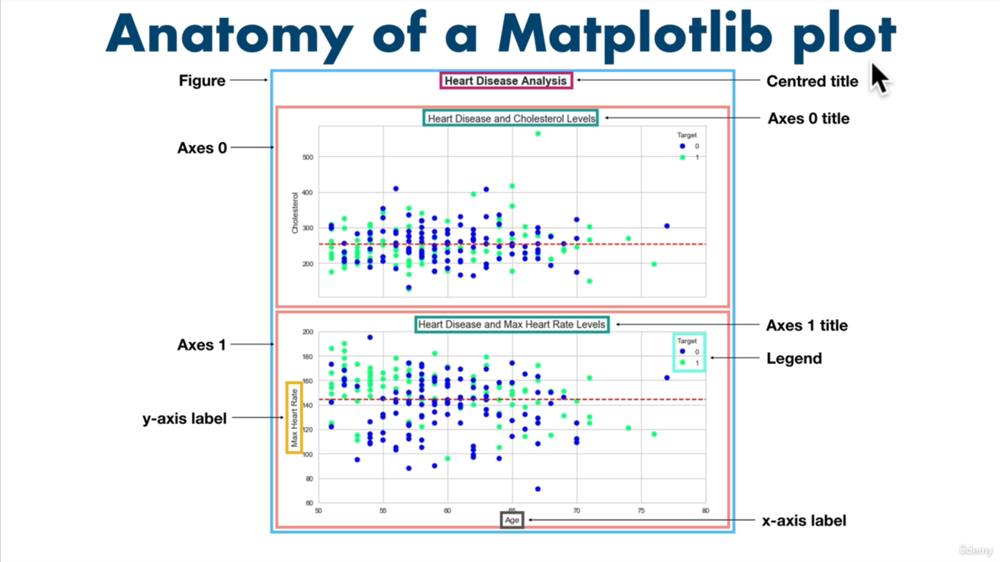
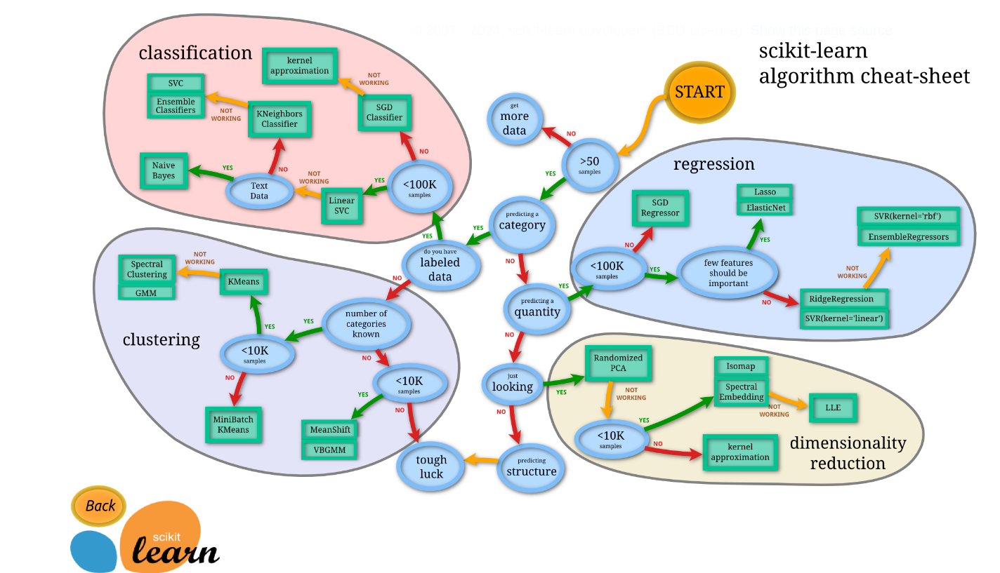

## Pandas
Pandas, Python’da veri analizi ve manipülasyonu için kullanılan bir kütüphanedir. Genellikle veri işleme, temizleme, dönüştürme ve analiz gibi veri bilimi ve veri analitiği projelerinde tercih edilir.

## NumPy
- NumPy, Python programlama dilinde bilimsel hesaplama ve çok boyutlu dizi işleme için kullanılan güçlü bir kütüphanedir.
- `ndarray` yapısı ile çok boyutlu diziler oluşturur.
- Diziler üzerinde hızlı matematiksel operasyonlar (aritmetik, istatistik, lineer cebir vb.) sunar. Bu özellikleri sayesinde NumPy, veri analizi, makine öğrenimi ve görüntü işleme başta olmak üzere pek çok alanda yaygın olarak kullanılır.

## Matplotlib
- Matplotlib, Python’da grafik ve görselleştirme oluşturmak için kullanılan kapsamlı bir kütüphanedir. Bilimsel topluluklar ve veri bilimcileri tarafından sıkça tercih edilir.
- **Çizgi grafikleri** (`plot`)
- **Saçılım grafikleri** (`scatter`)
- **Çubuk grafikleri** (`bar`)
- **Histogramlar** (`hist`)
- **3D grafikler** (`mpl_toolkits.mplot3d`) ve daha pek çok grafik türünü destekler.

## Scikit - Learn

1. An end-to-end Scikit-Learn work workflow
2. Getting the data ready
3. Choose the right estimator/algorithm for our problems
4. Fit the model/algorithm and use it to make predictions on our data
5. Evaluating a model
6. Save and load a trained model
7. Putting it all together

- Yapay zekâ uygulamalarında `X` ve `Y`, sıklıkla bağımsız ve bağımlı değişkenleri göstermek için kullanılır:
    - **X (Bağımsız Değişkenler):** Modelin girdi olarak kullandığı özelliklerdir. Örneğin bir ev fiyatı tahmin modelinde: Oda sayısı, Metrekare, Konum, Yaş
    - **Y (Bağımlı Değişken):** X özelliklerinden tahmin edilmek istenen hedef değişkendir. Aynı örnekte bu, evin fiyatıdır.

### RandomForestClassifier
- Birden çok karar ağacının (**decision tree**) ansamble edilmesiyle (**bagging**) oluşturulan, denetimli sınıflandırma algoritmasıdır.
- **Kullanım Alanı:** Sonucun kategorik olduğu (örneğin; bir kişinin hasta/sağlıklı, e-postanın spam/ham olması) problemlerde tercih edilir.
- **Özellikler:**
    - Alt örneklem (**bootstrap**) alma ve rastgele özellik seçimi ile ağaçlar arasında çeşitlilik sağlanır.
    - Aşırı öğrenme (**overfitting**) riski tek bir karar ağacına göre daha düşüktür.
- **Başlıca Parametreler:**
    - n_estimators: Ağaç sayısı (varsayılan 100).
    - max_depth: Ağaç derinliği sınırlaması.
    - max_features: Her bölünmede değerlendirilecek rastgele özellik sayısı.
- **Kütüphane:** `sklearn.ensemble.RandomForestClassifier`

### RandomForestRegressor
- RandomForestClassifier mantığının regresyon sorunlarına uyarlanmış halidir. Sürekli bir hedef değişkeni (örneğin; ev fiyatı, sıcaklık) tahmin etmek için kullanılır.
- **Kullanım Alanı:** Tahmin edilecek değerin kesikli değil de sürekli olduğu durumlar.
- Özellikler:
    - Ortalama alarak tahmin üretir (her ağacın çıktısının ortalaması).
    - Gürültüye karşı dayanıklıdır ve genellikle yüksek varyanslı modelleri dengeler.
    - Başlıca Parametreler: **RandomForestClassifier** ile benzerdir.
- Kütüphane: `sklearn.ensemble.RandomForestRegressor`