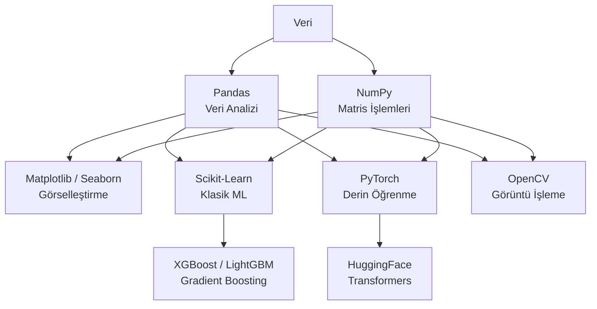

# AI / ML Araçları

!!! note "Genel Bakış"
    Python ekosistemi, veri bilimi ve makine öğrenimi için en zengin araç zincirine sahiptir. Bu sayfa; temel kütüphanelerin kullanım kalıplarını, pratik ipuçlarını ve ekosistem haritasını kapsar.



---

## NumPy — Sayısal Hesaplama

NumPy, Python'da çok boyutlu dizi (`ndarray`) işlemleri için temel kütüphanedir. Saf Python döngülerine kıyasla 10–100× hızlıdır.

```python title="NumPy Temel İşlemler"
import numpy as np

# Dizi oluşturma
a = np.array([1, 2, 3, 4, 5])             # 1D
b = np.array([[1, 2, 3], [4, 5, 6]])      # 2D (2×3)
c = np.zeros((3, 4))
d = np.ones((2, 3), dtype=np.float32)
e = np.arange(0, 10, 2)                   # [0, 2, 4, 6, 8]
f = np.linspace(0, 1, 100)               # 100 eşit aralıklı nokta
g = np.random.randn(3, 4)               # N(0,1) rastgele

# Boyut bilgisi
print(b.shape)    # (2, 3)
print(b.ndim)     # 2
print(b.dtype)    # int64
print(b.size)     # 6

# İndeksleme ve dilimleme
print(b[0, 1])    # 2
print(b[:, 1])    # Tüm satırlar, 2. sütun → [2, 5]
print(b[1, :])    # 2. satır → [4, 5, 6]
```

```python title="NumPy İşlemler"
a = np.array([1, 2, 3])
b = np.array([4, 5, 6])

# Element-wise işlemler
print(a + b)        # [5, 7, 9]
print(a * b)        # [4, 10, 18]
print(a ** 2)       # [1, 4, 9]
print(np.sqrt(a))   # [1., 1.41, 1.73]

# İstatistik
x = np.random.randn(100, 10)
print(x.mean())           # Genel ortalama
print(x.mean(axis=0))     # Her sütun ortalaması (100 örnekten)
print(x.std(axis=1))      # Her satır std sapması (10 özellikten)
print(np.percentile(x, 75))

# Matris işlemleri
A = np.random.randn(3, 4)
B = np.random.randn(4, 5)
C = A @ B               # Matris çarpımı → (3,5)
C = np.dot(A, B)        # Eşdeğer
AT = A.T                # Transpoz → (4,3)

# Doğrusal cebir
vals, vecs = np.linalg.eig(A @ A.T)   # Özdeğer/özvektör
inv = np.linalg.inv(A @ A.T)          # Matris tersi
U, S, Vt = np.linalg.svd(A)           # SVD ayrışımı

# Broadcasting
X = np.random.randn(100, 3)
mean = X.mean(axis=0)      # (3,)
std  = X.std(axis=0)       # (3,)
X_norm = (X - mean) / std  # Broadcasting: (100,3) - (3,) = (100,3)
```

```python title="NumPy Yeniden Şekillendirme"
a = np.arange(24)
b = a.reshape(4, 6)       # (4, 6)
c = a.reshape(2, 3, 4)    # (2, 3, 4) — 3D
d = b.reshape(-1)          # Düzleştir → (24,); -1 otomatik hesaplanır
e = b.reshape(-1, 2)       # (12, 2)

# Yığma
x = np.random.randn(3, 4)
y = np.random.randn(3, 4)
v = np.vstack([x, y])      # Dikey yığma → (6, 4)
h = np.hstack([x, y])      # Yatay yığma → (3, 8)
c2 = np.concatenate([x, y], axis=0)   # Eşdeğer vstack
```

---

## Pandas — Veri Analizi

Pandas, tablo formatındaki veri (CSV, Excel, SQL) üzerinde etiketli işlemler sağlar.

```python title="DataFrame Temel İşlemler"
import pandas as pd

# Yükleme
df = pd.read_csv("data.csv")
df = pd.read_excel("data.xlsx", sheet_name="Sheet1")
df = pd.read_json("data.json")

# Temel bilgi
print(df.shape)       # (satır, sütun)
print(df.dtypes)      # Her sütunun tipi
print(df.info())      # Tip + eksik değer özeti
print(df.describe())  # Sayısal istatistikler

# Seçim
df['sütun']                    # Tek sütun → Series
df[['col1', 'col2']]           # Çoklu sütun → DataFrame
df.iloc[0]                     # 0. satır (konum tabanlı)
df.iloc[0:5, 1:3]              # Satır 0-4, sütun 1-2
df.loc[df['yas'] > 30]         # Koşullu filtreleme
df.loc[(df['yas'] > 30) & (df['sehir'] == 'İstanbul')]
```

```python title="Veri Temizleme"
# Eksik değerler
df.isnull().sum()                          # Her sütunda eksik sayısı
df.dropna()                                # Eksik satırları sil
df.fillna(df.median(numeric_only=True))   # Medyan ile doldur
df['kolon'].fillna(df['kolon'].mode()[0]) # Mod ile doldur

# Kopyalar
df.drop_duplicates(inplace=True)
df.drop_duplicates(subset=['isim', 'email'])

# Tip dönüşümü
df['yas'] = df['yas'].astype(int)
df['tarih'] = pd.to_datetime(df['tarih'])

# Yeniden adlandırma
df.rename(columns={'old_name': 'new_name'}, inplace=True)

# Sütun silme
df.drop(columns=['gereksiz_col'], inplace=True)
```

```python title="Gruplama ve Aggregasyon"
# groupby
df.groupby('sehir')['maas'].mean()
df.groupby('sehir').agg({'maas': ['mean', 'std', 'count']})

# pivot tablo
pivot = df.pivot_table(values='satis', index='ay', columns='urun', aggfunc='sum')

# Merge / Join
df1.merge(df2, on='id', how='left')       # Left join
df1.merge(df2, on='id', how='inner')      # Inner join

# apply — her satır/sütuna özel fonksiyon
df['kategori'] = df['skor'].apply(lambda x: 'Yüksek' if x > 80 else 'Düşük')

# String işlemleri
df['isim'].str.lower()
df['isim'].str.contains('Ali')
df['metin'].str.replace(r'\d+', '', regex=True)

# Tarih işlemleri
df['tarih'].dt.year
df['tarih'].dt.month
df['tarih'].dt.dayofweek
```

---

## Matplotlib / Seaborn — Görselleştirme

```python title="Matplotlib Temel Grafikler"
import matplotlib.pyplot as plt

fig, axes = plt.subplots(2, 2, figsize=(12, 8))

# Çizgi
axes[0,0].plot(x, y, 'b-o', linewidth=2, markersize=5, label='Eğitim')
axes[0,0].plot(x, y_val, 'r--', label='Doğrulama')
axes[0,0].set_title('Kayıp Eğrisi')
axes[0,0].set_xlabel('Epoch')
axes[0,0].legend()
axes[0,0].grid(True, alpha=0.3)

# Histogram
axes[0,1].hist(data, bins=30, color='steelblue', edgecolor='black', alpha=0.7)
axes[0,1].set_title('Dağılım')

# Saçılım
axes[1,0].scatter(x, y, c=labels, cmap='viridis', alpha=0.6, s=20)
axes[1,0].set_title('Kümeleme')

# Bar grafik
axes[1,1].bar(categories, values, color='coral')
axes[1,1].set_title('Kategori Karşılaştırma')
plt.xticks(rotation=45)

plt.tight_layout()
plt.savefig('grafik.png', dpi=150, bbox_inches='tight')
plt.show()
```

```python title="Seaborn — İstatistiksel Görselleştirme"
import seaborn as sns

# Korelasyon ısı haritası
plt.figure(figsize=(10, 8))
sns.heatmap(df.corr(), annot=True, fmt='.2f',
            cmap='coolwarm', center=0, square=True)

# Dağılım grafiği çifti
sns.pairplot(df, hue='target', diag_kind='kde')

# Kutu grafik (outlier tespiti)
sns.boxplot(data=df, x='kategori', y='deger', palette='Set2')

# Violin plot
sns.violinplot(data=df, x='sınıf', y='özellik')

# Regresyon çizgisi ile saçılım
sns.regplot(data=df, x='alan', y='fiyat', scatter_kws={'alpha': 0.4})

# Count plot
sns.countplot(data=df, x='sehir', order=df['sehir'].value_counts().index[:10])

# Confusion matrix görselleştirme
from sklearn.metrics import ConfusionMatrixDisplay
ConfusionMatrixDisplay.from_predictions(y_test, y_pred,
                                        display_labels=class_names,
                                        cmap='Blues')
plt.title("Confusion Matrix")
plt.show()
```

---

## Scikit-Learn — Klasik Makine Öğrenimi

```python title="Tam Scikit-Learn İş Akışı"
from sklearn.datasets import load_breast_cancer
from sklearn.model_selection import train_test_split, cross_val_score, GridSearchCV
from sklearn.preprocessing import StandardScaler
from sklearn.pipeline import Pipeline
from sklearn.ensemble import RandomForestClassifier, GradientBoostingClassifier
from sklearn.metrics import classification_report, roc_auc_score
import joblib

# Veri
X, y = load_breast_cancer(return_X_y=True)
X_train, X_test, y_train, y_test = train_test_split(X, y, test_size=0.2,
                                                      stratify=y, random_state=42)

# Pipeline
pipe = Pipeline([
    ('scaler', StandardScaler()),
    ('model', RandomForestClassifier(n_estimators=200, random_state=42))
])

# Cross-validation
scores = cross_val_score(pipe, X_train, y_train, cv=5, scoring='roc_auc', n_jobs=-1)
print(f"CV AUC: {scores.mean():.3f} ± {scores.std():.3f}")

# Grid search
param_grid = {
    'model__n_estimators': [100, 200],
    'model__max_depth':    [None, 5, 10],
    'model__min_samples_leaf': [1, 5]
}
gs = GridSearchCV(pipe, param_grid, cv=5, scoring='roc_auc', n_jobs=-1)
gs.fit(X_train, y_train)

best_model = gs.best_estimator_
y_pred  = best_model.predict(X_test)
y_prob  = best_model.predict_proba(X_test)[:, 1]

print(classification_report(y_test, y_pred))
print(f"Test AUC: {roc_auc_score(y_test, y_prob):.4f}")

# Kayıt ve yükleme
joblib.dump(best_model, 'model.joblib')
loaded = joblib.load('model.joblib')
```

### Önemli Algoritmalar

```python title="Scikit-Learn Algoritmaları"
from sklearn.linear_model import LogisticRegression, Ridge, Lasso
from sklearn.svm import SVC, SVR
from sklearn.neighbors import KNeighborsClassifier
from sklearn.tree import DecisionTreeClassifier
from sklearn.ensemble import RandomForestClassifier, GradientBoostingClassifier
from sklearn.cluster import KMeans, DBSCAN
from sklearn.decomposition import PCA

# Sınıflandırma
lr  = LogisticRegression(C=1.0, max_iter=1000)
svm = SVC(C=1.0, kernel='rbf', probability=True)
knn = KNeighborsClassifier(n_neighbors=5)
dt  = DecisionTreeClassifier(max_depth=5, min_samples_leaf=10)
rf  = RandomForestClassifier(n_estimators=200, max_features='sqrt')
gb  = GradientBoostingClassifier(n_estimators=200, learning_rate=0.05, max_depth=4)

# Kümeleme
kmeans = KMeans(n_clusters=5, n_init=10, random_state=42)
dbscan = DBSCAN(eps=0.5, min_samples=5)

# Boyut indirgeme
pca = PCA(n_components=0.95)   # Kümülatif varyansın %95'ini koru
```

---

## PyTorch — Derin Öğrenme Çerçevesi

```python title="PyTorch Temel Yapılar"
import torch
import torch.nn as nn
import torch.optim as optim
from torch.utils.data import DataLoader, TensorDataset

# Tensor oluşturma
x = torch.tensor([1.0, 2.0, 3.0])
x = torch.zeros(3, 4)
x = torch.ones(3, 4)
x = torch.randn(3, 4)          # N(0,1)

# GPU kullanımı
device = torch.device('cuda' if torch.cuda.is_available() else 'cpu')
x = x.to(device)

# Autograd
x = torch.randn(3, requires_grad=True)
y = (x ** 2).sum()
y.backward()
print(x.grad)              # dy/dx = 2x

# İnferansa grad kapatma
with torch.no_grad():
    output = model(x)
```

```python title="PyTorch Eğitim Döngüsü"
def train_epoch(model, loader, optimizer, criterion, device):
    model.train()
    total_loss = 0.0
    for X_batch, y_batch in loader:
        X_batch, y_batch = X_batch.to(device), y_batch.to(device)
        optimizer.zero_grad()
        logits = model(X_batch)
        loss   = criterion(logits, y_batch)
        loss.backward()
        torch.nn.utils.clip_grad_norm_(model.parameters(), max_norm=1.0)
        optimizer.step()
        total_loss += loss.item()
    return total_loss / len(loader)

def eval_epoch(model, loader, criterion, device):
    model.eval()
    total_loss = 0.0
    with torch.no_grad():
        for X_batch, y_batch in loader:
            X_batch, y_batch = X_batch.to(device), y_batch.to(device)
            logits = model(X_batch)
            total_loss += criterion(logits, y_batch).item()
    return total_loss / len(loader)

# Learning rate scheduler
scheduler = optim.lr_scheduler.CosineAnnealingLR(optimizer, T_max=num_epochs)
# veya
scheduler = optim.lr_scheduler.ReduceLROnPlateau(optimizer, patience=5, factor=0.5)

for epoch in range(num_epochs):
    train_loss = train_epoch(model, train_loader, optimizer, criterion, device)
    val_loss   = eval_epoch(model, val_loader, criterion, device)
    scheduler.step()   # veya scheduler.step(val_loss) ReduceLROnPlateau için
    print(f"Epoch {epoch+1}: train={train_loss:.4f}  val={val_loss:.4f}")
```

```python title="Dataset ve DataLoader"
from torch.utils.data import Dataset, DataLoader
from torchvision import datasets, transforms

# Özel Dataset
class TabularDataset(Dataset):
    def __init__(self, X, y):
        self.X = torch.tensor(X, dtype=torch.float32)
        self.y = torch.tensor(y, dtype=torch.long)

    def __len__(self):
        return len(self.X)

    def __getitem__(self, idx):
        return self.X[idx], self.y[idx]

train_ds = TabularDataset(X_train, y_train)
train_loader = DataLoader(train_ds, batch_size=64, shuffle=True, num_workers=4)

# Görüntü Dataset (torchvision)
transform = transforms.Compose([
    transforms.Resize((224, 224)),
    transforms.ToTensor(),
    transforms.Normalize([0.485, 0.456, 0.406], [0.229, 0.224, 0.225])
])
dataset = datasets.ImageFolder("data/train", transform=transform)
loader  = DataLoader(dataset, batch_size=32, shuffle=True, num_workers=4)
```

---

## XGBoost / LightGBM

Tablo verisi için en güçlü gradient boosting uygulamalarıdır.

```python title="XGBoost"
import xgboost as xgb
from sklearn.model_selection import cross_val_score

model = xgb.XGBClassifier(
    n_estimators=500,
    learning_rate=0.05,
    max_depth=6,
    subsample=0.8,
    colsample_bytree=0.8,
    min_child_weight=5,
    gamma=0,
    reg_alpha=0.1,     # L1
    reg_lambda=1.0,    # L2
    use_label_encoder=False,
    eval_metric='logloss',
    early_stopping_rounds=50,
    random_state=42,
    n_jobs=-1
)

# Early stopping ile eğitim
model.fit(X_train, y_train,
          eval_set=[(X_val, y_val)],
          verbose=100)

# Feature importance
import matplotlib.pyplot as plt
xgb.plot_importance(model, max_num_features=20)
```

```python title="LightGBM"
import lightgbm as lgb

model = lgb.LGBMClassifier(
    n_estimators=500,
    learning_rate=0.05,
    num_leaves=31,
    max_depth=-1,
    min_child_samples=20,
    subsample=0.8,
    colsample_bytree=0.8,
    reg_alpha=0.1,
    reg_lambda=0.1,
    n_jobs=-1,
    random_state=42
)

callbacks = [lgb.early_stopping(50), lgb.log_evaluation(100)]
model.fit(X_train, y_train,
          eval_set=[(X_val, y_val)],
          callbacks=callbacks)
```

| | XGBoost | LightGBM |
|--|:-------:|:--------:|
| **Büyüme Stratejisi** | Level-wise | **Leaf-wise (daha hızlı)** |
| **Bellek** | Yüksek | Düşük |
| **Hız** | Orta | **Çok hızlı** |
| **Kategorik Destek** | Encoding gerekir | Doğrudan destekler |
| **Küçük veri** | İyi | Overfitting riski daha yüksek |

---

## HuggingFace Transformers

```python title="HuggingFace — Hızlı Kullanım"
from transformers import (
    AutoTokenizer, AutoModelForSequenceClassification,
    Trainer, TrainingArguments
)
import torch

# Tokenizer + Model yükle
model_name = "dbmdz/bert-base-turkish-cased"   # Türkçe BERT
tokenizer  = AutoTokenizer.from_pretrained(model_name)
model      = AutoModelForSequenceClassification.from_pretrained(
                 model_name, num_labels=2)

# Tokenizasyon
inputs = tokenizer(
    ["Bu film harikaydı!", "Çok kötü bir deneyim."],
    padding=True, truncation=True, max_length=128,
    return_tensors="pt"
)

# İnferens
model.eval()
with torch.no_grad():
    outputs = model(**inputs)
    logits  = outputs.logits
    probs   = torch.softmax(logits, dim=-1)
    preds   = torch.argmax(probs, dim=-1)

print(probs)    # Her sınıf için olasılıklar
```

```python title="Fine-tuning"
from datasets import Dataset

# Veri hazırla
train_dataset = Dataset.from_dict({
    'text': texts_train,
    'label': labels_train
})

def tokenize(batch):
    return tokenizer(batch['text'], truncation=True,
                     max_length=128, padding='max_length')

train_tokenized = train_dataset.map(tokenize, batched=True)

training_args = TrainingArguments(
    output_dir='./results',
    num_train_epochs=3,
    per_device_train_batch_size=16,
    per_device_eval_batch_size=32,
    learning_rate=2e-5,
    weight_decay=0.01,
    evaluation_strategy='epoch',
    save_strategy='epoch',
    load_best_model_at_end=True,
    fp16=True,           # GPU half-precision
)

trainer = Trainer(
    model=model,
    args=training_args,
    train_dataset=train_tokenized,
    eval_dataset=val_tokenized,
)
trainer.train()
```

---

## Ortam Kurulumu

```bash
# Conda ortamı (önerilen)
conda create -n mlenv python=3.11
conda activate mlenv

# Temel paketler
pip install numpy pandas matplotlib seaborn scikit-learn joblib

# Derin öğrenme
pip install torch torchvision torchaudio --index-url https://download.pytorch.org/whl/cu121

# Gradient boosting
pip install xgboost lightgbm

# HuggingFace
pip install transformers datasets accelerate

# Görüntü işleme
pip install opencv-python-headless Pillow ultralytics

# Açıklanabilirlik
pip install shap optuna

# Versiyon kontrol
pip freeze > requirements.txt
pip install -r requirements.txt
```

---

## Ekosistem Hızlı Başvuru

| Kütüphane | Kategori | Güçlü Yön |
|-----------|:--------:|----------|
| **NumPy** | Sayısal | Hızlı dizi operasyonları, lineer cebir |
| **Pandas** | Veri | Tablo veri analizi, CSV/Excel/SQL |
| **Matplotlib** | Görsel | Tam kontrol, publication grafik |
| **Seaborn** | Görsel | İstatistiksel, hızlı EDA |
| **Scikit-Learn** | Klasik ML | Pipeline, CV, metrikler, 50+ algoritma |
| **XGBoost** | Boosting | Tablo veri şampiyonu |
| **LightGBM** | Boosting | XGBoost'tan hızlı, büyük veri |
| **PyTorch** | DL | Araştırma, esneklik, debug |
| **TensorFlow/Keras** | DL | Production, TFLite edge deploy |
| **HuggingFace** | NLP/Vision | Önceden eğitilmiş model ekosistemi |
| **OpenCV** | Görüntü | Gerçek zamanlı görüntü işleme |
| **Ultralytics** | Nesne Tespiti | YOLOv8 — hızlı fine-tune |
| **SHAP** | Açıklama | Model yorumlanabilirliği |
| **Optuna** | Optimizasyon | Bayesian hiperparametre arama |
