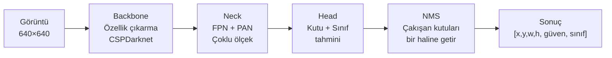
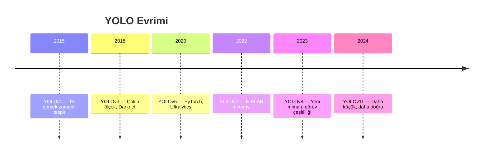

# YOLO — Nesne Tespiti ve Segmentasyon

!!! note "Bu Sayfa Ne Anlatıyor?"
    YOLO'yu hiç kullanmamış biri için sıfırdan başlar. Nesne tespitinin ne olduğunu açıklar, YOLO'nun nasıl çalıştığını anlatır, YOLOv8 ile hızlı başlangıç yapmayı ve kendi verisiyle eğitim sürecini gösterir.

---

## Nesne Tespiti Nedir?

Görüntü sınıflandırma: "Bu görüntüde kedi var mı?" → Evet/Hayır

Nesne tespiti: "Bu görüntüde kaç tane nesne var, ne, ve tam olarak nerede?" → Her nesne için kutu + etiket + güven skoru

```
┌─────────────────────────────────┐
│                                 │
│  ┌──────────┐  ┌────────────┐  │
│  │  Köpek   │  │    Kedi    │  │
│  │  %94     │  │    %87     │  │
│  └──────────┘  └────────────┘  │
│                                 │
└─────────────────────────────────┘
Çıktı: [(köpek, 0.94, [x,y,w,h]), (kedi, 0.87, [x,y,w,h])]
```

### Detection vs Segmentation vs Pose

| Görev | Ne Verir | Kullanım |
|-------|---------|---------|
| **Detection** | Bounding box (dikdörtgen) | Hız odaklı uygulamalar |
| **Segmentation** | Piksel maskesi (tam şekil) | Hassas sınır gerektiğinde |
| **Pose Estimation** | İskelet noktaları | İnsan hareketi analizi |
| **OBB** | Döndürülmüş kutu | Hava fotoğrafları, metinler |

---

## YOLO Nasıl Çalışır?

**YOLO = You Only Look Once** → Görüntüye bir kere bakar, tüm nesneleri aynı anda tespit eder.



**Backbone**: Görüntüden özellik çıkarır (kenar, şekil, doku)

**Neck (FPN + PAN)**: Farklı boyuttaki nesneleri yakalamak için birden fazla ölçekte çalışır — büyük nesneler için düşük çözünürlüklü özellik haritası, küçük nesneler için yüksek çözünürlüklü.

**Head**: Her hücre için "buraya kutu uyar mı?" diye sorar; kutu koordinatı ve sınıf olasılığı tahmin eder.

**NMS (Non-Maximum Suppression)**: Aynı nesne için birden fazla kutu üretilir. NMS en yüksek güvenli kutuyu tutar, diğerlerini siler.

---

## YOLOv8 — Hızlı Başlangıç

```bash
pip install ultralytics
```

```python title="hazir_model.py"
from ultralytics import YOLO
import cv2

# ──────────────────────────────────────────
# Hazır model yükle — internetten indirir
# ──────────────────────────────────────────
model = YOLO("yolov8n.pt")   # n=nano (en hızlı), s/m/l/x artar

# Model seçenekleri:
# yolov8n.pt  → ~3 MB,  80 sınıf COCO — en hızlı
# yolov8s.pt  → ~11 MB
# yolov8m.pt  → ~25 MB
# yolov8l.pt  → ~43 MB
# yolov8x.pt  → ~68 MB  — en doğru

# Görev bazlı modeller:
# yolov8n-seg.pt   → segmentasyon
# yolov8n-pose.pt  → poz tahmini
# yolov8n-obb.pt   → döndürülmüş kutu

# ──────────────────────────────────────────
# Tek görüntü üzerinde tespit
# ──────────────────────────────────────────
sonuclar = model("foto.jpg")

for sonuc in sonuclar:
    kutular = sonuc.boxes
    print(f"Tespit sayısı: {len(kutular)}")

    for kutu in kutular:
        x1, y1, x2, y2 = kutu.xyxy[0].tolist()    # Köşe koordinatları
        guven = kutu.conf[0].item()                  # Güven skoru
        sinif_idx = int(kutu.cls[0])
        sinif_adi = sonuc.names[sinif_idx]
        print(f"  {sinif_adi}: %{guven*100:.1f} @ [{x1:.0f},{y1:.0f},{x2:.0f},{y2:.0f}]")

    # Görselleştir ve kaydet
    sonuc.save("sonuc.jpg")            # Kutularla kaydet
    gorsel = sonuc.plot()              # numpy array — kendin çizebilirsin

# ──────────────────────────────────────────
# Kamera / video üzerinde gerçek zamanlı
# ──────────────────────────────────────────
sonuclar = model(source=0, stream=True, show=True)  # 0 = kamera

# Manuel kontrol isteniyorsa:
cap = cv2.VideoCapture(0)
while True:
    ret, frame = cap.read()
    if not ret:
        break

    sonuclar = model(frame, verbose=False)   # verbose=False → sessiz çalış
    for sonuc in sonuclar:
        frame = sonuc.plot()   # Kutuları görüntüye çiz

    cv2.imshow("YOLO", frame)
    if cv2.waitKey(1) & 0xFF == ord('q'):
        break
cap.release()
```

---

## Tespit Sonuçlarını İşlemek

```python title="sonuc_isleme.py"
from ultralytics import YOLO
import numpy as np

model = YOLO("yolov8m.pt")
sonuclar = model("sahne.jpg", conf=0.5, iou=0.45)
# conf=0.5 → güven skoru 0.5'in altındakileri görmezden gel
# iou=0.45 → NMS eşiği (düşük = daha az kutu)

for sonuc in sonuclar:
    # ── Bounding Box ──
    if sonuc.boxes is not None:
        for kutu in sonuc.boxes:
            xyxy    = kutu.xyxy[0].tolist()    # [x1, y1, x2, y2]
            xywh    = kutu.xywh[0].tolist()    # [cx, cy, w, h] — merkez format
            xywhn   = kutu.xywhn[0].tolist()   # normalize edilmiş (0-1 arası)
            guven   = kutu.conf[0].item()
            sinif   = int(kutu.cls[0])
            sinif_adi = sonuc.names[sinif]

    # ── Segmentasyon maskesi ──
    if sonuc.masks is not None:                 # yolov8n-seg.pt ile
        for maske in sonuc.masks:
            xy     = maske.xy[0]               # Kontur noktaları (N×2)
            maske_array = maske.data[0].numpy()  # İkili maske (H×W)

    # ── Poz tahmini ──
    if sonuc.keypoints is not None:             # yolov8n-pose.pt ile
        for kp in sonuc.keypoints:
            noktalar = kp.xy[0]                # (17, 2) — 17 iskelet noktası
            guvenler = kp.conf[0]              # Her nokta için güven skoru

# ──────────────────────────────────────────
# Belirli sınıfları filtrele
# ──────────────────────────────────────────
# COCO sınıf indeksleri: 0=kişi, 2=araba, 15=kedi, 16=köpek
sonuclar = model("sahne.jpg", classes=[0, 2])  # Sadece kişi ve araba
```

---

## Kendi Veri Setin ile Eğitim

### 1. Veri Seti Hazırlama

**YOLO format**: Her görüntü için bir `.txt` dosyası. Her satır bir nesne:
```
sinif_id  cx  cy  w  h
```
Tüm değerler 0-1 arası normalize.

```
Örnek: 640×480 görüntüde
  Kedi: x1=100, y1=150, x2=200, y2=300
  cx = (100+200)/2 / 640 = 0.234
  cy = (150+300)/2 / 480 = 0.469
  w  = (200-100) / 640   = 0.156
  h  = (300-150) / 480   = 0.313
  
  Dosya içeriği: 0 0.234 0.469 0.156 0.313
```

```
data/
├── images/
│   ├── train/    ← eğitim görüntüleri (jpg/png)
│   └── val/      ← doğrulama görüntüleri
└── labels/
    ├── train/    ← eğitim etiketleri (txt)
    └── val/      ← doğrulama etiketleri
```

```yaml title="data/dataset.yaml"
path: /absolute/path/to/data

train: images/train
val:   images/val
test:  images/test   # opsiyonel

nc: 3   # sınıf sayısı

names:
  0: kedi
  1: kopek
  2: kus
```

### 2. Etiketleme Araçları

```bash
# Roboflow — web tarayıcı tabanlı, ücretsiz
# https://roboflow.com  → YOLO formatında indir

# LabelImg — masaüstü, açık kaynak
pip install labelImg
labelImg

# CVAT — kurumsal seviye, açık kaynak
# https://cvat.ai
```

### 3. Modeli Eğitmek

```python title="egitim.py"
from ultralytics import YOLO

# Başlangıç noktası: hazır ağırlıklar (fine-tuning)
model = YOLO("yolov8n.pt")   # Önceden eğitilmiş → transfer learning

sonuclar = model.train(
    data="data/dataset.yaml",  # Veri seti tanımı
    epochs=100,                 # Kaç tur eğitim
    imgsz=640,                  # Görüntü boyutu
    batch=16,                   # Batch boyutu
    device=0,                   # GPU:0 (CPU için device="cpu")
    workers=8,                  # Veri yükleme iş parçacığı sayısı
    project="runs",             # Kayıt klasörü
    name="kedi_kopek_kus",      # Deney adı
    patience=50,                # Erken durdurma (50 epoch iyileşmezse)
    save=True,                  # En iyi ve son modeli kaydet
    save_period=10,             # Her 10 epoch'ta checkpoint
    lr0=0.01,                   # Başlangıç öğrenme hızı
    lrf=0.001,                  # Son öğrenme hızı
    augment=True,               # Veri çoğaltma
    # Augmentation parametreleri:
    fliplr=0.5,                 # Yatay çevirme olasılığı
    degrees=10.0,               # Döndürme açısı
    translate=0.1,              # Öteleme miktarı
    scale=0.5,                  # Ölçekleme
    mosaic=1.0,                 # 4 görüntü birleştirme (güçlü augmentation)
)

# Eğitim sonucu: runs/kedi_kopek_kus/weights/best.pt
print(f"En iyi mAP50: {sonuclar.results_dict['metrics/mAP50(B)']:.3f}")
```

### 4. Modeli Değerlendirme

```python title="degerlendirme.py"
model = YOLO("runs/kedi_kopek_kus/weights/best.pt")

# Doğrulama seti üzerinde metrikler
metrikler = model.val(data="data/dataset.yaml")

print(f"mAP50:    {metrikler.box.map50:.3f}")    # IoU@0.5
print(f"mAP50-95: {metrikler.box.map:.3f}")      # IoU@[0.5:0.95] — ana metrik
print(f"Precision: {metrikler.box.mp:.3f}")
print(f"Recall:    {metrikler.box.mr:.3f}")

# Sınıf bazlı metrikler
for i, sinif in enumerate(metrikler.names.values()):
    print(f"  {sinif}: AP50={metrikler.box.ap50[i]:.3f}")
```

---

## YOLO Sürümleri



| Model | mAP50-95 | Hız (ms) | Parametre |
|-------|:--------:|:--------:|:---------:|
| YOLOv8n | 37.3 | 0.99 | 3.2 M |
| YOLOv8s | 44.9 | 1.20 | 11.2 M |
| YOLOv8m | 50.2 | 1.83 | 25.9 M |
| YOLOv8l | 52.9 | 2.39 | 43.7 M |
| YOLOv8x | 53.9 | 3.53 | 68.2 M |

---

## Segmentasyon

```python title="segmentasyon.py"
from ultralytics import YOLO
import cv2
import numpy as np

model = YOLO("yolov8n-seg.pt")
sonuclar = model("foto.jpg")

for sonuc in sonuclar:
    img = sonuc.orig_img.copy()

    if sonuc.masks is None:
        continue

    for i, (maske, kutu) in enumerate(zip(sonuc.masks, sonuc.boxes)):
        # Maske: ikili görüntü (nesne=1, arka plan=0)
        maske_array = maske.data[0].cpu().numpy()
        maske_yeniboyut = cv2.resize(
            maske_array,
            (img.shape[1], img.shape[0])
        ).astype(np.uint8)

        # Renkli maskeyi görüntüye uygula
        renk = np.random.randint(0, 255, 3).tolist()
        renkli_maske = np.zeros_like(img)
        renkli_maske[maske_yeniboyut == 1] = renk

        img = cv2.addWeighted(img, 1.0, renkli_maske, 0.5, 0)

        # Kontur çiz
        konturlar, _ = cv2.findContours(maske_yeniboyut, cv2.RETR_EXTERNAL, cv2.CHAIN_APPROX_SIMPLE)
        cv2.drawContours(img, konturlar, -1, renk, 2)

        # Etiket
        sinif_adi = sonuc.names[int(kutu.cls[0])]
        x1, y1 = int(kutu.xyxy[0][0]), int(kutu.xyxy[0][1])
        cv2.putText(img, sinif_adi, (x1, y1-5), cv2.FONT_HERSHEY_SIMPLEX, 0.6, renk, 2)

cv2.imwrite("segmentasyon_sonuc.jpg", img)
```

---

## Özel Kullanım Senaryoları

### Gerçek Zamanlı Sayma

```python title="nesne_sayma.py"
from ultralytics import YOLO
from collections import Counter
import cv2

model = YOLO("yolov8n.pt")
cap = cv2.VideoCapture("trafik.mp4")

while True:
    ret, frame = cap.read()
    if not ret:
        break

    sonuclar = model(frame, verbose=False, classes=[2, 5, 7])  # araba, otobüs, kamyon
    sinif_sayaci = Counter()

    for sonuc in sonuclar:
        if sonuc.boxes is not None:
            for kutu in sonuc.boxes:
                sinif_adi = sonuc.names[int(kutu.cls[0])]
                sinif_sayaci[sinif_adi] += 1
        frame = sonuc.plot()

    # Sayım bilgisini ekrana yaz
    y = 30
    for sinif, sayi in sinif_sayaci.items():
        cv2.putText(frame, f"{sinif}: {sayi}", (10, y),
                    cv2.FONT_HERSHEY_SIMPLEX, 0.8, (0, 255, 0), 2)
        y += 30

    cv2.imshow("Trafik Sayım", frame)
    if cv2.waitKey(1) & 0xFF == ord('q'):
        break
```

### Özelleştirilmiş Eşik

```python
# Hassas uygulamalar için: güven eşiğini ayarla
sonuclar = model("foto.jpg",
    conf=0.7,      # Sadece çok emin olduğu tespitler
    iou=0.3,       # Çakışan kutularda daha katı (daha az kutu)
    max_det=100    # Maksimum tespit sayısı
)
```

!!! tip "Model Seçimi Rehberi"
    - **Gerçek zamanlı + sınırlı GPU** → `yolov8n` veya `yolov8s`
    - **Doğruluk önemli + güçlü GPU** → `yolov8l` veya `yolov8x`
    - **Jetson / Raspberry Pi** → `yolov8n` + TensorRT/ONNX optimizasyonu
    - **Hailo NPU** → `yolov8n` → DFC ile HEF'e derle

!!! warning "Sık Yapılan Hatalar"
    - Eğitim verisinde etiket hatası varsa model asla düzeltemez — kaliteli etiketleme şart
    - `imgsz` eğitim ve çıkarımda aynı olmalı
    - Çok az veri (< 100 görüntü/sınıf) → overfitting riski yüksek → veri çoğaltma
    - COCO modeli ile başlayın, ardından kendi verinizde fine-tune edin
