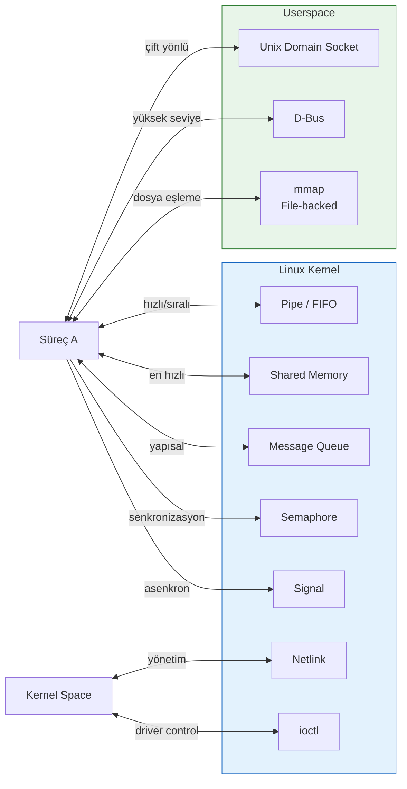
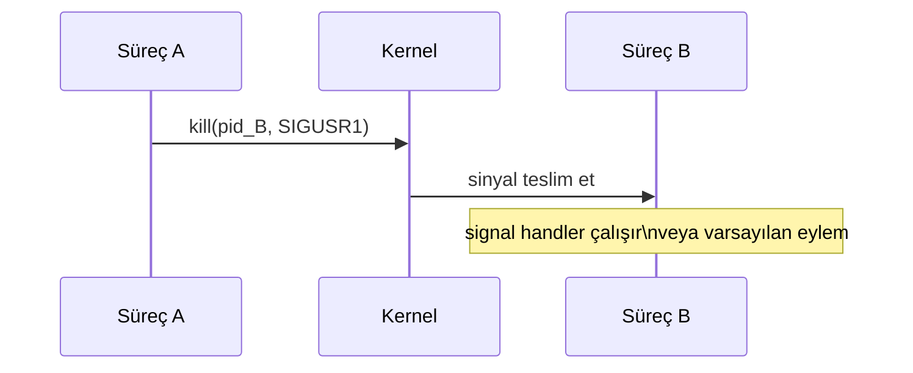
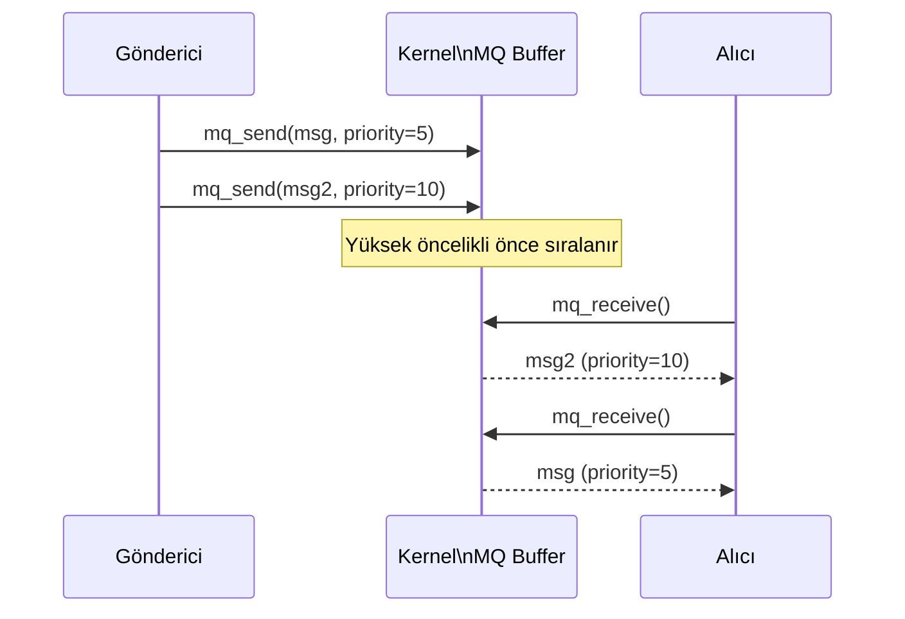
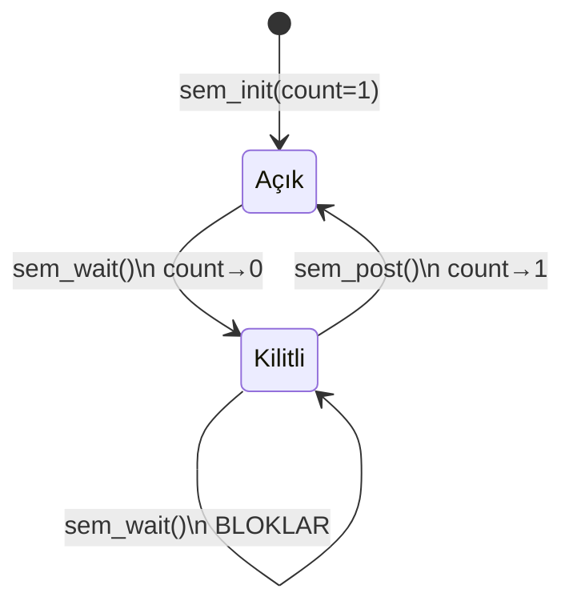
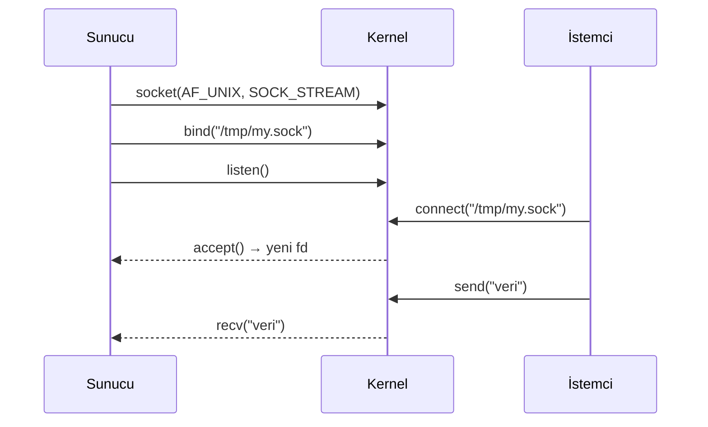
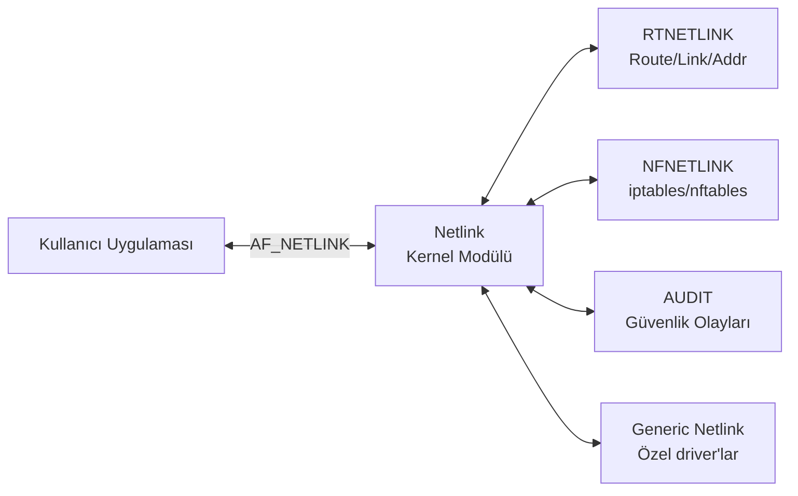
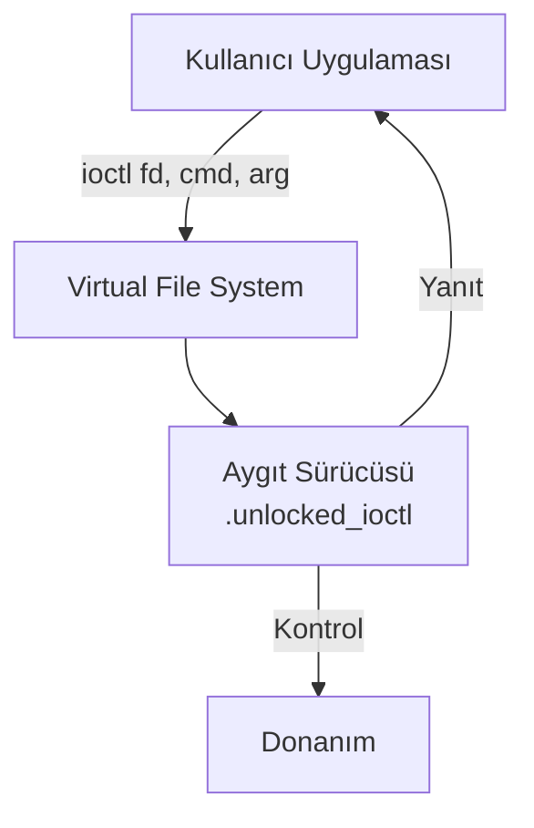
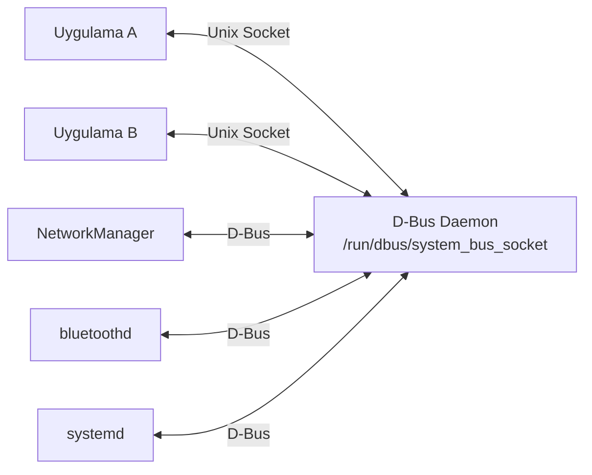
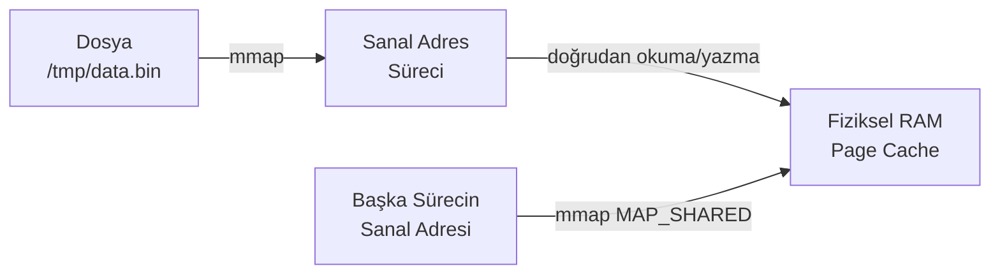
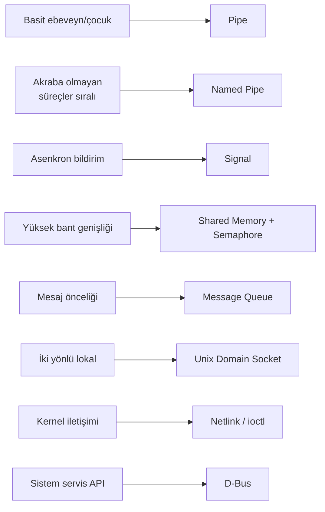

# IPC — Süreçler Arası İletişim

!!! note "Genel Bakış"
    **Inter-Process Communication (IPC)**, aynı makinede çalışan bağımsız süreçlerin veri paylaşmasını ve koordineli çalışmasını sağlayan mekanizmalar bütünüdür. Her yöntemin farklı performans, karmaşıklık ve kullanım senaryosu dengesi vardır.



---

## Pipe (Anonim Boru)

Ebeveyn ile alt süreç arasında tek yönlü veri kanalı oluşturur. Kernel tamponunda yaşar; dosya sisteminde görünmez.

```mermaid
graph LR
    A[Süreç A\nyazar] -->|write fd[1]| PIPE[Kernel Buffer\n4–64 KB]
    PIPE -->|read fd[0]| B[Süreç B\nokuyucu]
```

```c title="pipe_example.c"
#include <stdio.h>
#include <unistd.h>
#include <string.h>
#include <sys/wait.h>

int main(void) {
    int fd[2];          /* fd[0] = okuma, fd[1] = yazma */
    pipe(fd);

    pid_t pid = fork();

    if (pid == 0) {          /* Alt süreç — okuyucu */
        close(fd[1]);        /* Yazma ucunu kapat */
        char buf[64];
        ssize_t n = read(fd[0], buf, sizeof(buf));
        buf[n] = '\0';
        printf("Çocuk aldı: %s\n", buf);
        close(fd[0]);
    } else {                 /* Ebeveyn — yazıcı */
        close(fd[0]);        /* Okuma ucunu kapat */
        const char *msg = "merhaba";
        write(fd[1], msg, strlen(msg));
        close(fd[1]);
        wait(NULL);
    }
    return 0;
}
```

!!! tip "Shell'de Pipe"
    Terminaldeki `|` operatörü da aynı `pipe()` sistem çağrısını kullanır:
    ```bash
    ls -la | grep ".c" | wc -l
    # Her | için kernel bir pipe tamponu oluşturur
    ```

!!! warning "Dikkat Edilecekler"
    - Pipe **tek yönlü**dür. İki yönlü iletişim için iki pipe gerekir.
    - Tampon dolduğunda `write()` **bloklar**; tampon boşken `read()` **bloklar**.
    - Yazma ucunun tüm kopyaları kapanırsa `read()` **EOF** döner.
    - Pipe kapasitesi sistemde `ulimit -p` veya `/proc/sys/fs/pipe-max-size` ile görülür.

---

## Named Pipe (FIFO)

İsimli boru, dosya sisteminde görünen özel bir dosya türüdür. Akraba olmayan süreçler arasında da kullanılabilir. `mkfifo` ile oluşturulur.

```bash
# FIFO oluştur
mkfifo /tmp/myfifo

# Terminal 1 — okuyucu
cat /tmp/myfifo

# Terminal 2 — yazıcı
echo "veri" > /tmp/myfifo
```

```c title="fifo_writer.c"
#include <fcntl.h>
#include <unistd.h>
#include <sys/stat.h>
#include <string.h>

int main(void) {
    mkfifo("/tmp/myfifo", 0666);               /* Zaten varsa hata vermez */
    int fd = open("/tmp/myfifo", O_WRONLY);    /* Okuyucu bağlanana kadar bloklar */
    const char *msg = "FIFO üzerinden veri";
    write(fd, msg, strlen(msg));
    close(fd);
    return 0;
}
```

```c title="fifo_reader.c"
#include <fcntl.h>
#include <unistd.h>
#include <stdio.h>

int main(void) {
    int fd = open("/tmp/myfifo", O_RDONLY);
    char buf[128];
    ssize_t n = read(fd, buf, sizeof(buf) - 1);
    buf[n] = '\0';
    printf("Alındı: %s\n", buf);
    close(fd);
    return 0;
}
```

| Özellik | Anonim Pipe | Named Pipe (FIFO) |
|---------|:-----------:|:-----------------:|
| Dosya sistemi | Yok | `/tmp/fifo` gibi görünür |
| Akraba olmayan süreçler | ✗ | ✓ |
| Kalıcılık | Süreçle birlikte silinir | `unlink()` ile silinir |
| Yön | Tek yönlü | Tek yönlü |

---

## Signals (Sinyaller)

Sinyal, bir sürece asenkron olarak iletilen yazılımsal kesme mekanizmasıdır. Kernel veya başka bir süreç gönderebilir.



### Önemli Sinyaller

| Sinyal | Numara | Varsayılan Eylem | Açıklama |
|--------|:------:|:----------------:|---------|
| `SIGTERM` | 15 | Sonlandır | Nezaket isteği; yakalanabilir |
| `SIGKILL` | 9 | Sonlandır | **Kesin; yakalanmaz ve engellenemez** |
| `SIGINT` | 2 | Sonlandır | Ctrl+C |
| `SIGQUIT` | 3 | Core dump | Ctrl+\ |
| `SIGHUP` | 1 | Sonlandır | Terminal kapandı; daemon'lar yeniden yükle |
| `SIGUSR1` | 10 | Sonlandır | Kullanıcı tanımlı 1 |
| `SIGUSR2` | 12 | Sonlandır | Kullanıcı tanımlı 2 |
| `SIGALRM` | 14 | Sonlandır | `alarm()` zamanlayıcısı |
| `SIGCHLD` | 17 | Yoksay | Alt süreç durdu/sonlandı |
| `SIGPIPE` | 13 | Sonlandır | Okuyucusuz pipe'a yazma |
| `SIGSEGV` | 11 | Core dump | Geçersiz bellek erişimi |

```c title="signal_handler.c"
#include <stdio.h>
#include <signal.h>
#include <unistd.h>
#include <string.h>

volatile sig_atomic_t running = 1;

void handler(int sig) {
    if (sig == SIGUSR1) {
        /* Sinyal handler'da printf tehlikeli; write() kullan */
        const char msg[] = "SIGUSR1 alındı\n";
        write(STDOUT_FILENO, msg, sizeof(msg) - 1);
    } else if (sig == SIGTERM) {
        running = 0;
    }
}

int main(void) {
    struct sigaction sa = {0};
    sa.sa_handler = handler;
    sigemptyset(&sa.sa_mask);
    sigaction(SIGUSR1, &sa, NULL);
    sigaction(SIGTERM, &sa, NULL);

    printf("PID: %d\n", getpid());
    while (running) {
        pause();    /* Sinyali bekle */
    }
    puts("Temiz çıkış");
    return 0;
}
```

```bash
# Başka terminalden:
kill -SIGUSR1 <PID>
kill -SIGTERM <PID>
```

!!! danger "Sinyal Handler Güvenliği"
    Sinyal handler'ların içinde yalnızca **async-signal-safe** fonksiyonlar çağrılabilir. `printf`, `malloc`, `free` güvenli değildir — bunları handler içinde çağırmak tanımsız davranışa yol açar. Bunun yerine global bir bayrak (`sig_atomic_t`) set edip ana döngüde işleyin.

---

## Shared Memory (Paylaşılan Bellek)

En yüksek bant genişliğine sahip IPC yöntemidir. Verinin kopyalanması gerekmez; iki süreç aynı fiziksel sayfayı eşler.

```mermaid
graph LR
    PA[Süreç A\nVirtual Addr Space] -->|mmap| PHYS[Fiziksel RAM\nShared Page]
    PB[Süreç B\nVirtual Addr Space] -->|mmap| PHYS
    PHYS -.->|shm_open| SHM_OBJ[/dev/shm/myshm]
```

=== "Yazıcı Süreci"

    ```c title="shm_writer.c"
    #include <stdio.h>
    #include <fcntl.h>
    #include <sys/mman.h>
    #include <sys/stat.h>
    #include <unistd.h>
    #include <string.h>

    #define SHM_NAME  "/myshm"
    #define SHM_SIZE  4096

    int main(void) {
        /* Shared memory nesnesi oluştur */
        int fd = shm_open(SHM_NAME, O_CREAT | O_RDWR, 0666);
        ftruncate(fd, SHM_SIZE);

        /* Adres alanına eşle */
        void *ptr = mmap(NULL, SHM_SIZE,
                         PROT_READ | PROT_WRITE, MAP_SHARED, fd, 0);
        close(fd);

        /* Veri yaz */
        strcpy((char *)ptr, "Shared Memory'den merhaba!");

        printf("Veri yazıldı. Okuyucuyu bekliyor...\n");
        sleep(5);

        munmap(ptr, SHM_SIZE);
        shm_unlink(SHM_NAME);    /* Nesneyi sil */
        return 0;
    }
    ```

=== "Okuyucu Süreci"

    ```c title="shm_reader.c"
    #include <stdio.h>
    #include <fcntl.h>
    #include <sys/mman.h>
    #include <sys/stat.h>
    #include <unistd.h>

    #define SHM_NAME  "/myshm"
    #define SHM_SIZE  4096

    int main(void) {
        int fd = shm_open(SHM_NAME, O_RDONLY, 0666);
        if (fd == -1) { perror("shm_open"); return 1; }

        void *ptr = mmap(NULL, SHM_SIZE, PROT_READ, MAP_SHARED, fd, 0);
        close(fd);

        printf("Okunan: %s\n", (char *)ptr);

        munmap(ptr, SHM_SIZE);
        return 0;
    }
    ```

!!! warning "Senkronizasyon Zorunlu"
    Shared memory yarış koşuluna (race condition) açıktır. Eş zamanlı erişimi korumak için mutlaka **semaphore** veya **mutex** kullanın. Aksi takdirde okuyucu eksik ya da bozuk veri görebilir.

```bash
# /dev/shm altında shared memory nesnelerini gör
ls -la /dev/shm/

# Derleme
gcc shm_writer.c -o writer -lrt
gcc shm_reader.c -o reader -lrt
```

---

## POSIX Message Queue (Mesaj Kuyruğu)

Yapılandırılmış mesajları öncelik sırasına göre ileten kuyruk yapısıdır. Mesajlar kernel'de saklanır; gönderen ve alıcı aynı anda çalışmak zorunda değildir.



```c title="mqueue_example.c"
#include <stdio.h>
#include <mqueue.h>
#include <string.h>

#define MQ_NAME  "/mymq"

/* Gönderici */
void sender(void) {
    struct mq_attr attr = {
        .mq_flags   = 0,
        .mq_maxmsg  = 10,
        .mq_msgsize = 256,
        .mq_curmsgs = 0
    };

    mqd_t mq = mq_open(MQ_NAME, O_CREAT | O_WRONLY, 0666, &attr);
    const char *msg = "IPC mesajı";
    mq_send(mq, msg, strlen(msg) + 1, 5);   /* öncelik = 5 */
    mq_close(mq);
}

/* Alıcı */
void receiver(void) {
    mqd_t mq = mq_open(MQ_NAME, O_RDONLY);
    char buf[256];
    unsigned int prio;
    mq_receive(mq, buf, sizeof(buf), &prio);
    printf("Alındı (öncelik %u): %s\n", prio, buf);
    mq_close(mq);
    mq_unlink(MQ_NAME);
}
```

```bash
# Aktif message queue'ları listele
ls /dev/mqueue/
cat /proc/sys/fs/mqueue/msg_max   # Max mesaj sayısı
```

---

## POSIX Semaphore (Semafor)

Paylaşılan kaynağa eş zamanlı erişimi sınırlayan sayaç mekanizmasıdır. Shared memory ile birlikte sıkça kullanılır.



=== "Named Semaphore"

    ```c title="named_sem.c"
    #include <fcntl.h>
    #include <semaphore.h>
    #include <stdio.h>

    int main(void) {
        /* Adlandırılmış semafor: farklı süreçler arasında */
        sem_t *sem = sem_open("/mysem", O_CREAT, 0666, 1);

        sem_wait(sem);           /* Kilitli bölgeye gir (P) */
        /* --- Kritik bölge --- */
        puts("Kritik bölgedeyim");
        /* -------------------- */
        sem_post(sem);           /* Kilidi serbest bırak (V) */

        sem_close(sem);
        sem_unlink("/mysem");
        return 0;
    }
    ```

=== "Unnamed Semaphore (Thread)"

    ```c title="unnamed_sem.c"
    #include <semaphore.h>
    #include <pthread.h>
    #include <stdio.h>

    sem_t sem;

    void *worker(void *arg) {
        sem_wait(&sem);
        printf("Thread %ld çalışıyor\n", (long)arg);
        sem_post(&sem);
        return NULL;
    }

    int main(void) {
        sem_init(&sem, 0, 1);   /* 0 = thread paylaşımı, başlangıç=1 */

        pthread_t t1, t2;
        pthread_create(&t1, NULL, worker, (void *)1);
        pthread_create(&t2, NULL, worker, (void *)2);
        pthread_join(t1, NULL);
        pthread_join(t2, NULL);

        sem_destroy(&sem);
        return 0;
    }
    ```

---

## Unix Domain Socket (UDS)

Loopback olmadan, dosya sistemi üzerinden çift yönlü iletişim sağlar. Ağ protokol yükü yoktur; TCP/UNIX karşılaştırmasında UDS %30–50 daha hızlıdır.



=== "Sunucu"

    ```c title="uds_server.c"
    #include <stdio.h>
    #include <sys/socket.h>
    #include <sys/un.h>
    #include <unistd.h>
    #include <string.h>

    #define SOCK_PATH "/tmp/my.sock"

    int main(void) {
        int srv_fd = socket(AF_UNIX, SOCK_STREAM, 0);

        struct sockaddr_un addr = {.sun_family = AF_UNIX};
        strncpy(addr.sun_path, SOCK_PATH, sizeof(addr.sun_path) - 1);

        unlink(SOCK_PATH);
        bind(srv_fd, (struct sockaddr *)&addr, sizeof(addr));
        listen(srv_fd, 5);

        int cli_fd = accept(srv_fd, NULL, NULL);
        char buf[256];
        ssize_t n = recv(cli_fd, buf, sizeof(buf) - 1, 0);
        buf[n] = '\0';
        printf("Sunucu aldı: %s\n", buf);
        send(cli_fd, "tamam", 5, 0);

        close(cli_fd);
        close(srv_fd);
        unlink(SOCK_PATH);
        return 0;
    }
    ```

=== "İstemci"

    ```c title="uds_client.c"
    #include <stdio.h>
    #include <sys/socket.h>
    #include <sys/un.h>
    #include <unistd.h>
    #include <string.h>

    #define SOCK_PATH "/tmp/my.sock"

    int main(void) {
        int fd = socket(AF_UNIX, SOCK_STREAM, 0);

        struct sockaddr_un addr = {.sun_family = AF_UNIX};
        strncpy(addr.sun_path, SOCK_PATH, sizeof(addr.sun_path) - 1);

        connect(fd, (struct sockaddr *)&addr, sizeof(addr));
        send(fd, "merhaba sunucu", 14, 0);

        char buf[64];
        ssize_t n = recv(fd, buf, sizeof(buf) - 1, 0);
        buf[n] = '\0';
        printf("Yanıt: %s\n", buf);

        close(fd);
        return 0;
    }
    ```

---

## Netlink Socket (Kernel ↔ Userspace)

Netlink, kernel subsystem'larıyla kullanıcı alanı arasında çift yönlü, asenkron iletişim sağlayan özel bir soket ailesidir. `iproute2` araçları (`ip`, `ss`) Netlink kullanır.



```c title="netlink_example.c" linenums="1"
#include <stdio.h>
#include <string.h>
#include <unistd.h>
#include <sys/socket.h>
#include <linux/netlink.h>

int main(void) {
    int sock = socket(AF_NETLINK, SOCK_RAW, NETLINK_ROUTE);

    struct sockaddr_nl addr = {
        .nl_family = AF_NETLINK,
        .nl_pid    = getpid(),
        .nl_groups = 0
    };
    bind(sock, (struct sockaddr *)&addr, sizeof(addr));

    /* RTM_GETLINK isteği göndererek ağ arayüzlerini listele */
    struct {
        struct nlmsghdr hdr;
        struct rtgenmsg gen;
    } req = {
        .hdr = {
            .nlmsg_len   = NLMSG_LENGTH(sizeof(struct rtgenmsg)),
            .nlmsg_type  = RTM_GETLINK,
            .nlmsg_flags = NLM_F_REQUEST | NLM_F_DUMP,
            .nlmsg_seq   = 1,
            .nlmsg_pid   = getpid()
        },
        .gen.rtgen_family = AF_PACKET
    };

    send(sock, &req, req.hdr.nlmsg_len, 0);
    /* Yanıt işleme ... */
    close(sock);
    return 0;
}
```

---

## ioctl (Device Control)

`ioctl` (input/output control), aygıt sürücülerine `read`/`write` ile ifade edilemeyen özel komutlar göndermek için kullanılan sistem çağrısıdır. Bir "uzak fonksiyon çağrısı" gibi düşünülebilir.



```c title="ioctl_example.c"
#include <stdio.h>
#include <fcntl.h>
#include <sys/ioctl.h>
#include <net/if.h>

int main(void) {
    int sock = socket(AF_INET, SOCK_DGRAM, 0);

    /* Ağ arayüzü flag'larını al (SIOCGIFFLAGS) */
    struct ifreq ifr;
    strncpy(ifr.ifr_name, "eth0", IFNAMSIZ);

    if (ioctl(sock, SIOCGIFFLAGS, &ifr) == 0) {
        printf("eth0 flags: 0x%x\n", ifr.ifr_flags);
        if (ifr.ifr_flags & IFF_UP)
            puts("Arayüz aktif (UP)");
    }

    close(sock);
    return 0;
}
```

```bash
# Terminal termios — baud rate sorgusu
stty -F /dev/ttyUSB0

# ioctl kullanan araçlar
ethtool eth0      # Ethernet sürücü kontrolü
hdparm -I /dev/sda  # Disk bilgisi
v4l2-ctl --all    # Kamera ioctl çağrıları
```

---

## D-Bus

D-Bus, masaüstü uygulamaları ve sistem servisleri arasında yüksek seviyeli mesajlaşma sağlayan IPC ara katmanıdır. systemd, NetworkManager, BlueZ gibi kritik servisler D-Bus üzerinden kontrol edilir.



```bash
# D-Bus servisleri listele
busctl list

# NetworkManager arayüzlerini sorgula
busctl introspect org.freedesktop.NetworkManager \
    /org/freedesktop/NetworkManager

# Basit D-Bus çağrısı
busctl call org.freedesktop.NetworkManager \
    /org/freedesktop/NetworkManager \
    org.freedesktop.NetworkManager \
    GetDevices

# Systemd servis başlat
busctl call org.freedesktop.systemd1 \
    /org/freedesktop/systemd1 \
    org.freedesktop.systemd1.Manager \
    StartUnit ss nginx.service replace
```

```python title="dbus_python.py"
import dbus

bus = dbus.SystemBus()
nm = bus.get_object(
    'org.freedesktop.NetworkManager',
    '/org/freedesktop/NetworkManager'
)
iface = dbus.Interface(nm, 'org.freedesktop.NetworkManager')
devices = iface.GetDevices()
for dev in devices:
    print(dev)
```

---

## mmap — Bellek Eşlemeli Dosya

`mmap`, bir dosyayı veya anonim belleği sürecin adres alanına doğrudan eşler. Shared memory'nin dosya tabanlı alternatifidir ve sıfır kopyalamayla (zero-copy) dosya I/O gerçekleştirir.



=== "Dosya Eşleme"

    ```c title="mmap_file.c"
    #include <stdio.h>
    #include <fcntl.h>
    #include <sys/mman.h>
    #include <sys/stat.h>
    #include <unistd.h>

    int main(void) {
        int fd = open("data.bin", O_RDWR | O_CREAT, 0666);
        ftruncate(fd, 4096);

        char *ptr = mmap(NULL, 4096,
                         PROT_READ | PROT_WRITE, MAP_SHARED, fd, 0);
        close(fd);

        /* Doğrudan pointer üzerinden oku/yaz */
        ptr[0] = 'A';
        ptr[1] = 'B';

        msync(ptr, 4096, MS_SYNC);    /* Değişiklikleri diske yaz */
        munmap(ptr, 4096);
        return 0;
    }
    ```

=== "Anonim Paylaşım (Fork)"

    ```c title="mmap_anon.c"
    #include <stdio.h>
    #include <sys/mman.h>
    #include <sys/wait.h>
    #include <unistd.h>

    int main(void) {
        /* Fork öncesi anonim shared mapping */
        int *counter = mmap(NULL, sizeof(int),
                            PROT_READ | PROT_WRITE,
                            MAP_SHARED | MAP_ANONYMOUS, -1, 0);
        *counter = 0;

        if (fork() == 0) {
            (*counter)++;    /* Alt süreç paylaşılan sayacı artırır */
            _exit(0);
        }
        wait(NULL);
        printf("Sayaç: %d\n", *counter);   /* 1 görülmeli */
        munmap(counter, sizeof(int));
        return 0;
    }
    ```

---

## IPC Yöntemleri Karşılaştırması

| Yöntem | Hız | Veri Kopyası | Yön | Süreç Sınırı | Kalıcılık |
|--------|:---:|:------------:|:---:|:------------:|:---------:|
| Anonymous Pipe | Orta | 1 kopya | Tek | Akraba | Process ömrü |
| Named Pipe (FIFO) | Orta | 1 kopya | Tek | Herhangi | `unlink` ile |
| Signal | Çok hızlı | Veri yok | Tek | Herhangi | Anlık |
| Shared Memory | **En hızlı** | **0 kopya** | Çift | Herhangi | `shm_unlink` ile |
| Message Queue | Hızlı | 1 kopya | Çift | Herhangi | `mq_unlink` ile |
| Semaphore | — | Veri yok | — | Herhangi | `sem_unlink` ile |
| Unix Domain Socket | Hızlı | 1–2 kopya | Çift | Aynı makine | `unlink` ile |
| Netlink | Hızlı | 1 kopya | Çift | User/Kernel | — |
| D-Bus | Yavaş | 2+ kopya | Çift | Herhangi | — |
| mmap | **En hızlı** | **0 kopya** | Çift | Herhangi | Dosya tabanlı |



!!! example "Seçim Rehberi"
    - **En yüksek bant genişliği** → Shared Memory + Semaphore
    - **Akraba olmayan süreçler, iki yönlü** → Unix Domain Socket
    - **Kernel ↔ Userspace** → Netlink veya ioctl
    - **Sistem servisleri (NM, systemd)** → D-Bus
    - **Senkronizasyon primitifi** → Semaphore veya Mutex
    - **Ebeveyn/çocuk, basit** → Anonymous Pipe
