# Haberleşme Protokolleri

!!! note "Genel Bakış"
    Haberleşme protokolleri; cihazlar, sistemler ve uygulamalar arasında veri alışverişinin nasıl gerçekleşeceğini tanımlayan kurallar bütünüdür. Seri/paralel fiziksel katmandan uygulama seviyesi protokollerine kadar katmanlı bir yapı içinde incelenir.

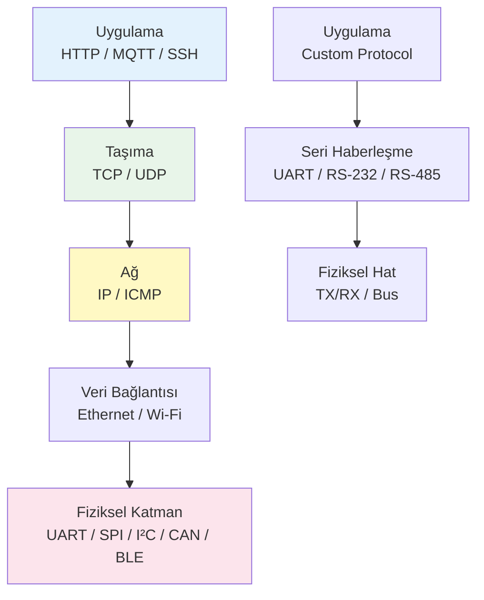

---

## UART (Universal Asynchronous Receiver/Transmitter)

UART, saat hattı olmayan eş zamansız seri haberleşme protokolüdür. İki hat (TX/RX) ve ortak toprak yeterlidir. Mikrodenetleyiciler ile PC/modüller arasındaki en yaygın düşük hızlı seri haberleşme yöntemidir.

### Çerçeve Yapısı

```
IDLE  START   D0   D1   D2   D3   D4   D5   D6   D7   PARITY  STOP
 1  |  0  |  x  |  x  |  x  |  x  |  x  |  x  |  x  |  x  |   x   |  1
     ←————————————————— 1 tam çerçeve ————————————————————————→
```

| Alan | Değer | Açıklama |
|------|:-----:|---------|
| Start bit | 0 | Çerçeve başladığını bildirir |
| Veri bitleri | 5–9 bit | Genellikle 8 bit (1 byte) |
| Parity bit | Opsiyonel | Hata tespiti: Odd/Even/None |
| Stop bit | 1 veya 2 | Hat tekrar IDLE'a döner |

### Baud Rate Hesaplama

Alıcı ve verici **aynı baud rate**'i kullanmalıdır. Tolerans ±2–3%'tir.

$$\text{Baud} = \frac{f_{clock}}{16 \times \text{BRR}}$$

| Baud Rate | Veri Hızı (8N1) | Yaygın Kullanım |
|:---------:|:---------------:|-----------------|
| 9600 | ~960 B/s | GPS, eski modüller |
| 115200 | ~11.5 KB/s | Arduino, debug |
| 460800 | ~46 KB/s | ESP32 flash |
| 921600 | ~92 KB/s | Yüksek hızlı debug |
| 4000000 | ~400 KB/s | STM32, FTDI FT4232 |

```c title="STM32 USART2 — Register Seviyesi"
/* APB1 clock = 42 MHz, hedef: 115200 baud */
RCC->APB1ENR |= RCC_APB1ENR_USART2EN;   /* Clock aç */
GPIOA->MODER |= (2 << 4) | (2 << 6);    /* PA2=TX, PA3=RX → Alternate */
GPIOA->AFR[0] |= (7 << 8) | (7 << 12); /* AF7 = USART2 */

USART2->BRR = 0x16D;       /* 42MHz / 115200 ≈ 365.0 → 0x16D */
USART2->CR1 = USART_CR1_TE | USART_CR1_RE | USART_CR1_UE;

/* Gönder */
while (!(USART2->SR & USART_SR_TXE));
USART2->DR = 'A';
```

```c title="Linux'ta UART (termios)"
#include <termios.h>
#include <fcntl.h>

int uart_open(const char *dev) {
    int fd = open(dev, O_RDWR | O_NOCTTY | O_SYNC);
    struct termios tty = {0};
    tcgetattr(fd, &tty);
    cfsetospeed(&tty, B115200);
    cfsetispeed(&tty, B115200);
    tty.c_cflag = CS8 | CREAD | CLOCAL;  /* 8N1 */
    tty.c_iflag = 0;
    tty.c_oflag = 0;
    tty.c_lflag = 0;
    tty.c_cc[VMIN]  = 1;
    tty.c_cc[VTIME] = 0;
    tcsetattr(fd, TCSANOW, &tty);
    return fd;
}
```

!!! tip "RS-232 vs RS-485"
    - **RS-232**: Noktadan noktaya, ±3–15V mantık, 15m maks.
    - **RS-485**: Diferansiyel çift, 32 cihaza kadar bus, 1200m, gürültüye dayanıklı, endüstri standardı.

---

## SPI (Serial Peripheral Interface)

SPI, 4 hat kullanan senkron, tam çift yönlü (full-duplex) seri haberleşme protokolüdür. Yüksek hız gerektiren sensörler, flash bellek, ekranlar ve ADC'lerde kullanılır.

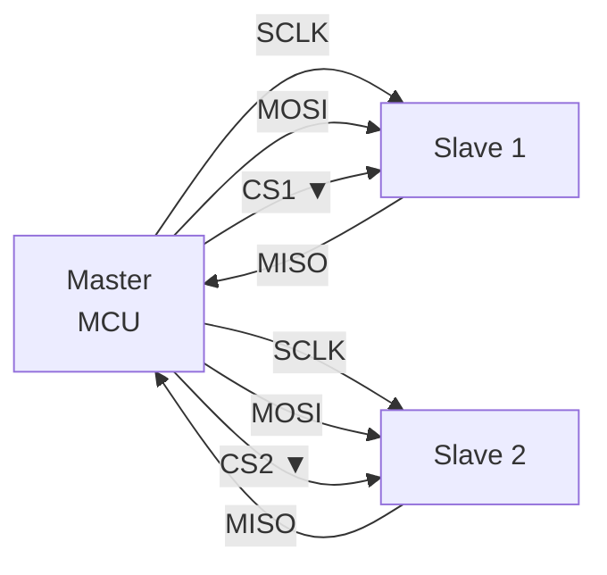

| Hat | Yön | Açıklama |
|-----|:---:|---------|
| SCLK | M→S | Saat sinyali; master üretir |
| MOSI | M→S | Master Out Slave In |
| MISO | S→M | Master In Slave Out |
| CS/SS | M→S | Chip Select; aktif LOW |

### CPOL / CPHA Modları

| Mod | CPOL | CPHA | Saat Boşta | Örnekleme |
|:---:|:----:|:----:|:----------:|:---------:|
| 0 | 0 | 0 | LOW | Yükselen kenar |
| 1 | 0 | 1 | LOW | Düşen kenar |
| 2 | 1 | 0 | HIGH | Düşen kenar |
| 3 | 1 | 1 | HIGH | Yükselen kenar |

```c title="STM32 SPI1 — Polling"
/* Yapılandırma (APB2 = 84 MHz, SPI Clk = 84/16 = 5.25 MHz) */
SPI1->CR1 = SPI_CR1_MSTR          /* Master */
          | SPI_CR1_SSM            /* Yazılımsal CS */
          | SPI_CR1_SSI
          | (3 << SPI_CR1_BR_Pos) /* BR=011 → ÷16 */
          | SPI_CR1_SPE;          /* SPI etkinleştir */

uint8_t spi_transfer(uint8_t data) {
    while (!(SPI1->SR & SPI_SR_TXE));   /* TX boş bekle */
    SPI1->DR = data;
    while (!(SPI1->SR & SPI_SR_RXNE));  /* RX hazır bekle */
    return SPI1->DR;
}

/* CS yönetimi */
#define CS_LOW()  GPIOA->BSRR = GPIO_BSRR_BR4
#define CS_HIGH() GPIOA->BSRR = GPIO_BSRR_BS4

CS_LOW();
spi_transfer(0x9F);           /* JEDEC ID oku */
uint8_t id = spi_transfer(0); /* Boş byte gönder, yanıt al */
CS_HIGH();
```

```bash title="Linux SPI (spidev)"
# spi-tools ile test
spi-config -d /dev/spidev0.0 -q
# Transfer: 0x9F gönder
python3 -c "
import spidev
spi = spidev.SpiDev()
spi.open(0, 0)
spi.max_speed_hz = 1000000
resp = spi.xfer2([0x9F, 0x00, 0x00])
print([hex(x) for x in resp])
spi.close()
"
```

---

## I²C (Inter-Integrated Circuit)

I²C, iki hatlı (SDA/SCL) senkron yarı çift yönlü (half-duplex) çoklu master-slave haberleşme protokolüdür. 7-bit adres şeması 128 cihaza kadar bus paylaşımına izin verir.

### Elektrik Özellikleri

| Parametre | Değer |
|-----------|:-----:|
| Hız (Standard) | 100 kHz |
| Hız (Fast) | 400 kHz |
| Hız (Fast+) | 1 MHz |
| Hız (High Speed) | 3.4 MHz |
| Pull-up | Genellikle 4.7 kΩ (3.3V) |
| Mantık düzeyi | Open-drain |

!!! warning "Pull-up Direnci"
    I²C hatları açık-drain çalışır; dışarıdan pull-up direnci **zorunludur**. Direnç değeri bus kapasitansına ve hıza göre seçilir. Düşük hız = yüksek direnç, yüksek hız = düşük direnç.

### Bus Sırası

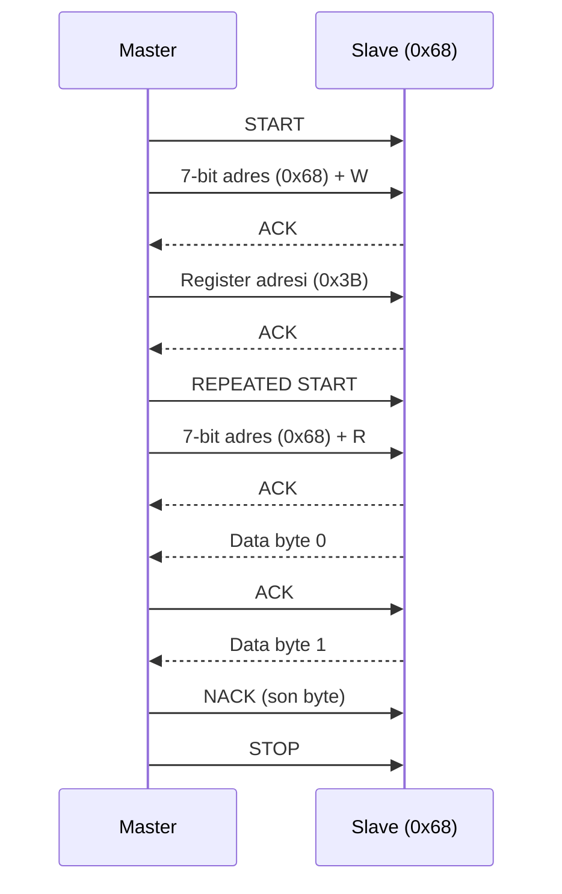

=== "HAL Örneği (STM32)"

    ```c title="i2c_hal.c"
    #include "stm32f4xx_hal.h"

    extern I2C_HandleTypeDef hi2c1;
    #define MPU6050_ADDR  (0x68 << 1)
    #define REG_ACCEL_X   0x3B

    void mpu6050_read(int16_t *accel) {
        uint8_t buf[6];
        uint8_t reg = REG_ACCEL_X;

        HAL_I2C_Master_Transmit(&hi2c1, MPU6050_ADDR,
                                &reg, 1, HAL_MAX_DELAY);
        HAL_I2C_Master_Receive(&hi2c1, MPU6050_ADDR,
                               buf, 6, HAL_MAX_DELAY);

        accel[0] = (int16_t)(buf[0] << 8 | buf[1]);
        accel[1] = (int16_t)(buf[2] << 8 | buf[3]);
        accel[2] = (int16_t)(buf[4] << 8 | buf[5]);
    }
    ```

=== "Register Seviyesi (STM32)"

    ```c title="i2c_register.c"
    /* START koşulu üret */
    I2C1->CR1 |= I2C_CR1_START;
    while (!(I2C1->SR1 & I2C_SR1_SB));

    /* Adres + Write gönder */
    I2C1->DR = (0x68 << 1) | 0;
    while (!(I2C1->SR1 & I2C_SR1_ADDR));
    (void)I2C1->SR2;   /* ADDR flag temizle */

    /* Register adresi gönder */
    I2C1->DR = 0x3B;
    while (!(I2C1->SR1 & I2C_SR1_TXE));

    /* REPEATED START */
    I2C1->CR1 |= I2C_CR1_START;
    while (!(I2C1->SR1 & I2C_SR1_SB));

    /* Adres + Read gönder */
    I2C1->DR = (0x68 << 1) | 1;
    while (!(I2C1->SR1 & I2C_SR1_ADDR));
    (void)I2C1->SR2;

    /* Veri oku */
    I2C1->CR1 &= ~I2C_CR1_ACK;   /* Son byte için ACK kapat */
    while (!(I2C1->SR1 & I2C_SR1_RXNE));
    uint8_t data = I2C1->DR;

    I2C1->CR1 |= I2C_CR1_STOP;
    ```

=== "Linux i2c-tools"

    ```bash
    # Bus'ta cihazları tara
    sudo i2cdetect -y 1

    # Register oku: bus=1, addr=0x68, reg=0x3B
    sudo i2cget -y 1 0x68 0x3B

    # Register yaz: 0x6B registerına 0x00 yaz (PWR_MGMT_1)
    sudo i2cset -y 1 0x68 0x6B 0x00

    # Python ile
    python3 -c "
    import smbus2
    bus = smbus2.SMBus(1)
    data = bus.read_i2c_block_data(0x68, 0x3B, 6)
    print(data)
    bus.close()
    "
    ```

---

## CAN Bus (Controller Area Network)

CAN, çoklu master destekli, diferansiyel çift üzerinden mesaj tabanlı haberleşme protokolüdür. Otomotiv, endüstriyel ve robot sistemlerinde standart haberleşme yöntemidir.

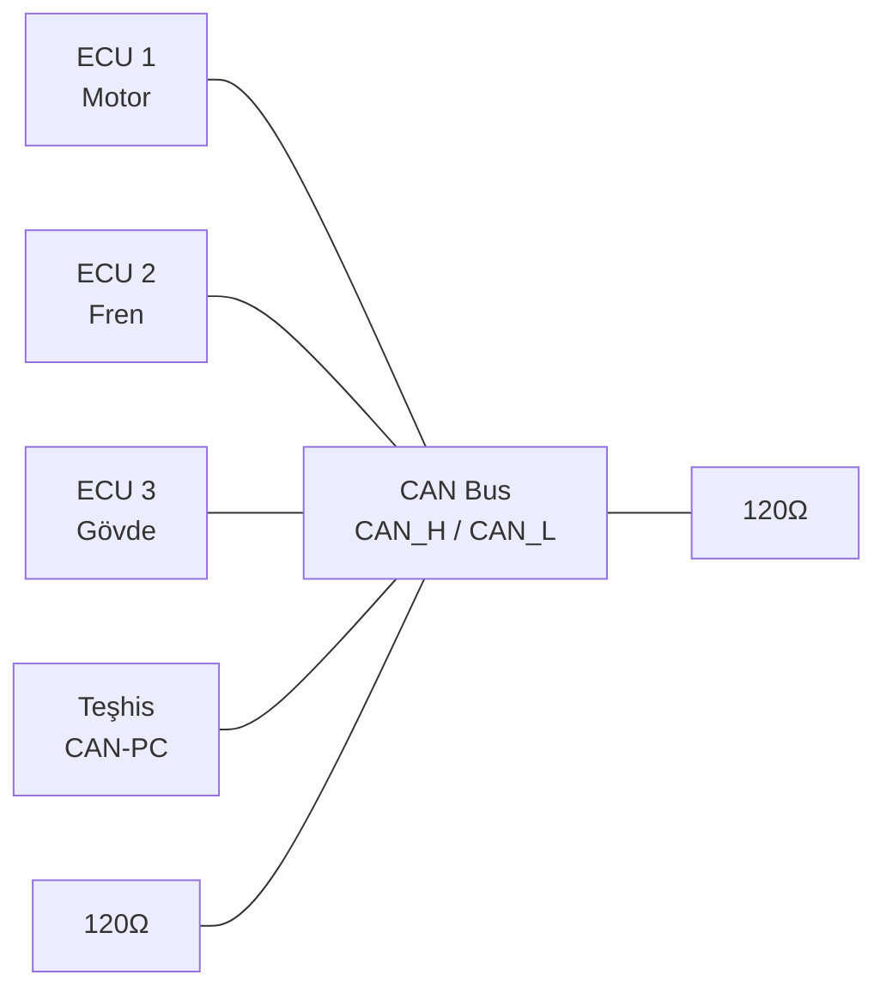

### CAN Çerçeve Yapısı (Standard Frame)

| Alan | Bit | Açıklama |
|------|:---:|---------|
| SOF | 1 | Start of Frame |
| Arbitration ID | 11 | Mesaj kimliği; **düşük ID = yüksek öncelik** |
| RTR | 1 | Remote Transmission Request |
| Control | 6 | DLC (data length code: 0–8 byte) |
| Data | 0–64 bit | Taşınan veri |
| CRC | 15 | Cyclic Redundancy Check |
| ACK | 2 | Alıcı onayı |
| EOF | 7 | End of Frame |

### Bit Arbitrasyon

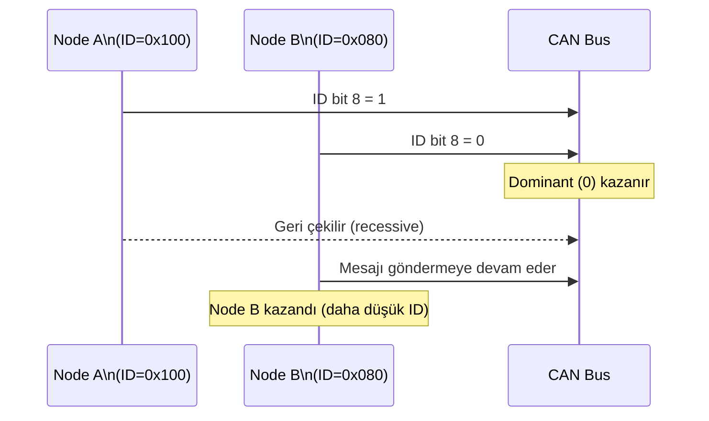

### Hız / Mesafe Tablosu

| Bit Rate | Maks. Kablo Uzunluğu |
|:--------:|:--------------------:|
| 1 Mbps | 25 m |
| 500 kbps | 100 m |
| 250 kbps | 250 m |
| 125 kbps | 500 m |
| 50 kbps | 1000 m |
| 10 kbps | 5000 m |

### Hata Durumları

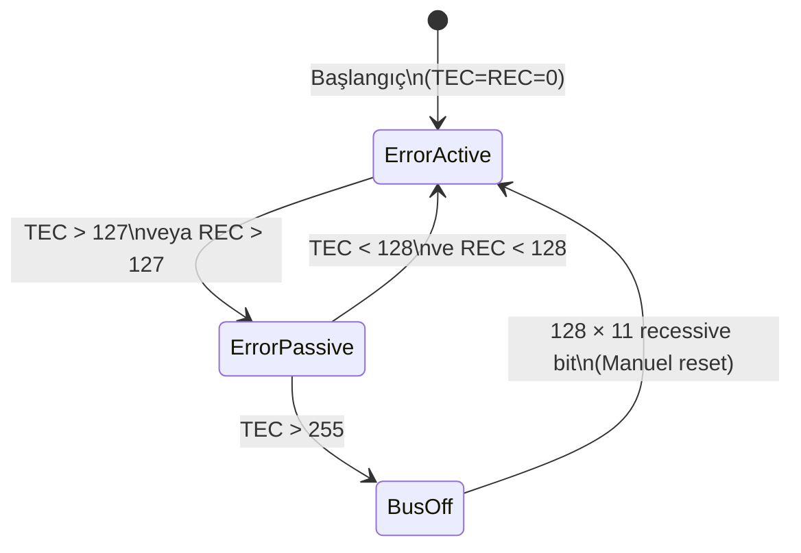

!!! danger "Bus-Off Durumu"
    TEC (Transmit Error Counter) 255'i aşarsa node bus-off olur ve bus'tan tamamen kopar. Geri dönüş için manuel reset veya donanım yeniden başlatma gerekir.

=== "STM32 bxCAN TX"

    ```c title="can_tx.c"
    CAN_TxHeaderTypeDef hdr = {
        .StdId = 0x100,
        .IDE   = CAN_ID_STD,
        .RTR   = CAN_RTR_DATA,
        .DLC   = 4
    };
    uint8_t data[4] = {0x01, 0x02, 0x03, 0x04};
    uint32_t mailbox;
    HAL_CAN_AddTxMessage(&hcan1, &hdr, data, &mailbox);
    ```

=== "STM32 bxCAN Filtre"

    ```c title="can_filter.c"
    CAN_FilterTypeDef f = {
        .FilterIdHigh         = 0x100 << 5,
        .FilterIdLow          = 0,
        .FilterMaskIdHigh     = 0x7FF << 5,   /* Tam eşleşme */
        .FilterMaskIdLow      = 0,
        .FilterFIFOAssignment = CAN_RX_FIFO0,
        .FilterBank           = 0,
        .FilterMode           = CAN_FILTERMODE_IDMASK,
        .FilterScale          = CAN_FILTERSCALE_32BIT,
        .FilterActivation     = ENABLE
    };
    HAL_CAN_ConfigFilter(&hcan1, &f);
    ```

=== "Linux SocketCAN"

    ```bash
    # Sanal CAN arayüzü
    sudo modprobe vcan
    sudo ip link add vcan0 type vcan
    sudo ip link set vcan0 up

    # CAN çerçevesi gönder
    cansend vcan0 100#01020304

    # Dinle (tüm çerçeveler)
    candump vcan0

    # Hata analizi
    canbusload vcan0
    ```

    ```python title="python-can"
    import can
    bus = can.interface.Bus(channel='vcan0', interface='socketcan')
    msg = can.Message(arbitration_id=0x100,
                      data=[0x01, 0x02, 0x03, 0x04],
                      is_extended_id=False)
    bus.send(msg)
    received = bus.recv(timeout=1.0)
    print(received)
    bus.shutdown()
    ```

---

## TCP / IP

TCP (Transmission Control Protocol), güvenilir, sıralı, çift yönlü bağlantı odaklı taşıma katmanı protokolüdür. IP, paketleri kaynak'tan hedef'e yönlendiren ağ katmanı protokolüdür.

### Bağlantı Kurma — Three-Way Handshake

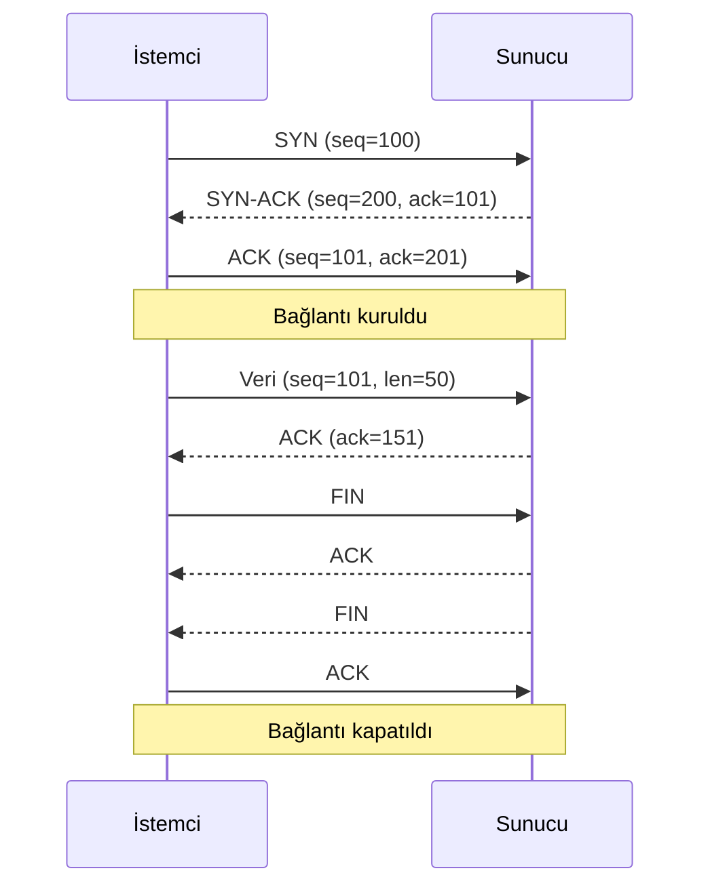

### TCP vs UDP Karşılaştırması

| Özellik | TCP | UDP |
|---------|:---:|:---:|
| Bağlantı | Bağlantılı | Bağlantısız |
| Güvenilirlik | ✓ Garanti | ✗ Best-effort |
| Sıralama | ✓ | ✗ |
| Akış kontrolü | ✓ | ✗ |
| Gecikme | Yüksek | **Düşük** |
| Boyut | Değişken | Maks. 64 KB |
| Kullanım | HTTP, SSH, FTP | DNS, DHCP, RTSP, Oyun |

```c title="TCP Server (POSIX)"
#include <sys/socket.h>
#include <netinet/in.h>
#include <arpa/inet.h>
#include <unistd.h>
#include <stdio.h>

int main(void) {
    int srv = socket(AF_INET, SOCK_STREAM, 0);

    int opt = 1;
    setsockopt(srv, SOL_SOCKET, SO_REUSEADDR, &opt, sizeof(opt));

    struct sockaddr_in addr = {
        .sin_family      = AF_INET,
        .sin_addr.s_addr = INADDR_ANY,
        .sin_port        = htons(8080)
    };
    bind(srv, (struct sockaddr *)&addr, sizeof(addr));
    listen(srv, 10);

    struct sockaddr_in cli_addr;
    socklen_t cli_len = sizeof(cli_addr);
    int cli = accept(srv, (struct sockaddr *)&cli_addr, &cli_len);

    printf("Bağlantı: %s\n", inet_ntoa(cli_addr.sin_addr));

    char buf[1024];
    ssize_t n = recv(cli, buf, sizeof(buf) - 1, 0);
    buf[n] = '\0';
    printf("Alındı: %s\n", buf);
    send(cli, "200 OK\r\n", 8, 0);

    close(cli);
    close(srv);
    return 0;
}
```

```c title="UDP Örneği"
#include <sys/socket.h>
#include <netinet/in.h>
#include <unistd.h>

/* Alıcı */
int sock = socket(AF_INET, SOCK_DGRAM, 0);
struct sockaddr_in addr = {
    .sin_family      = AF_INET,
    .sin_addr.s_addr = INADDR_ANY,
    .sin_port        = htons(5000)
};
bind(sock, (struct sockaddr *)&addr, sizeof(addr));

char buf[1024];
struct sockaddr_in sender;
socklen_t len = sizeof(sender);
recvfrom(sock, buf, sizeof(buf), 0, (struct sockaddr *)&sender, &len);
```

---

## HTTP / HTTPS

HTTP (HyperText Transfer Protocol), istemci-sunucu modelinde çalışan, metin tabanlı uygulama katmanı protokolüdür. HTTPS, TLS/SSL ile şifrelenmiş HTTP'dir.

| Sürüm | Özellik |
|:-----:|--------|
| HTTP/1.0 | Her istek için yeni bağlantı |
| HTTP/1.1 | Keep-Alive, Host header, chunked transfer |
| HTTP/2 | İkili format, multiplexing, header sıkıştırma (HPACK) |
| HTTP/3 | QUIC (UDP tabanlı), daha az gecikme |

### HTTP İstek Yapısı

```
GET /api/data HTTP/1.1
Host: example.com
Authorization: Bearer <token>
Content-Type: application/json
Accept: application/json

{"key": "value"}
```

### HTTP Yanıt Kodları

| Kod | Kategori | Örnekler |
|:---:|:--------:|---------|
| 1xx | Bilgi | 100 Continue |
| 2xx | Başarı | 200 OK, 201 Created, 204 No Content |
| 3xx | Yönlendirme | 301 Moved, 302 Found, 304 Not Modified |
| 4xx | İstemci Hatası | 400 Bad Request, 401 Unauthorized, 403 Forbidden, 404 Not Found |
| 5xx | Sunucu Hatası | 500 Internal Error, 502 Bad Gateway, 503 Service Unavailable |

```bash
# curl ile HTTP test
curl -v https://api.example.com/users          # GET
curl -X POST -H "Content-Type: application/json" \
     -d '{"name":"test"}' https://api.example.com/users    # POST
curl -I https://example.com                    # Sadece header
curl -o /dev/null -s -w "%{http_code}" https://example.com # Durum kodu
```

---

## WebSocket

WebSocket, HTTP Upgrade handshake ile kurulan, tek bağlantı üzerinden çift yönlü, gerçek zamanlı haberleşme protokolüdür.

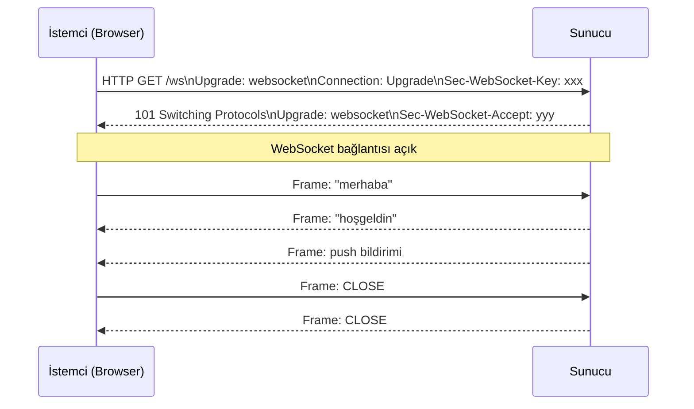

```python title="WebSocket Server (websockets)"
import asyncio
import websockets

async def handler(ws):
    async for msg in ws:
        print(f"Gelen: {msg}")
        await ws.send(f"Echo: {msg}")

async def main():
    async with websockets.serve(handler, "0.0.0.0", 8765):
        await asyncio.Future()  # Sonsuza kadar çalış

asyncio.run(main())
```

---

## MQTT

MQTT (Message Queuing Telemetry Transport), yayınla/abone ol (publish/subscribe) modeline dayalı, IoT için tasarlanmış hafif mesajlaşma protokolüdür. TCP üzerinde çalışır.

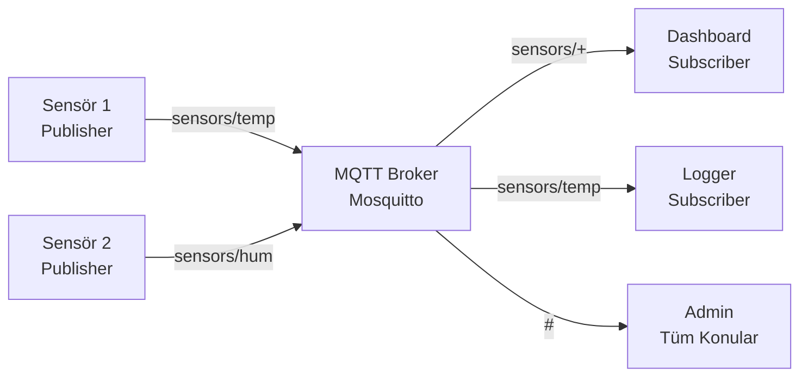

### QoS Seviyeleri

| QoS | Anlam | Kullanım |
|:---:|-------|---------|
| 0 | At most once — teslim garantisi yok | Sensör akışı |
| 1 | At least once — en az 1 teslim | Komutlar |
| 2 | Exactly once — tam 1 teslim | Kritik veriler |

```bash
# Mosquitto broker kur ve başlat
sudo apt install mosquitto mosquitto-clients
sudo systemctl start mosquitto

# Abone ol
mosquitto_sub -h localhost -t "sensors/#" -v

# Yayınla
mosquitto_pub -h localhost -t "sensors/temp" -m "23.5"
mosquitto_pub -h localhost -t "sensors/temp" -m "24.1" -q 1  # QoS 1
```

```python title="paho-mqtt istemci"
import paho.mqtt.client as mqtt

def on_message(client, userdata, msg):
    print(f"{msg.topic}: {msg.payload.decode()}")

client = mqtt.Client()
client.on_message = on_message
client.connect("localhost", 1883)
client.subscribe("sensors/#")

client.loop_start()

# Yayınla
client.publish("sensors/temp", "23.5", qos=1)

client.loop_stop()
client.disconnect()
```

---

## Bluetooth Classic ve BLE

### Bluetooth Protokol Yığını

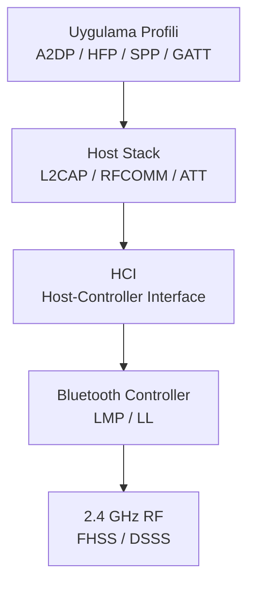

### Classic vs BLE Karşılaştırması

| Özellik | Bluetooth Classic (BR/EDR) | Bluetooth Low Energy (BLE) |
|---------|:--------------------------:|:--------------------------:|
| Kullanım | Ses/Veri akışı | Kısa periyodik veri |
| Frekans kanalları | 79 × 1 MHz | 40 × 2 MHz |
| Veri hızı | 1–3 Mbps (EDR) | 125 Kbps – 2 Mbps |
| Güç tüketimi | Yüksek | **Çok düşük** |
| Bağlantı süresi | ~100 ms | < 3 ms |
| Piconet | 1 Master + 7 Slave | Sınırsız (Mesh/Broadcast) |
| Profil | A2DP, HFP, SPP | GATT (Generic Attribute) |

### BLE GATT Mimarisi

```mermaid
graph TD
    CENTRAL[Central\nTelefon/PC] <-->|ATT Protocol| PERIPH[Peripheral\nSensör]
    PERIPH --> SVC1[Service: Battery 0x180F]
    PERIPH --> SVC2[Service: Heart Rate 0x180D]
    SVC1 --> CHAR1[Char: Battery Level\n0x2A19 | READ NOTIFY]
    SVC2 --> CHAR2[Char: HR Measurement\n0x2A37 | NOTIFY]
    CHAR2 --> DESC[CCC Descriptor\n0x2902 | Notify Enable]
```

```bash
# Linux'ta BLE araçları
bluetoothctl
  power on
  scan on
  connect AA:BB:CC:DD:EE:FF
  info AA:BB:CC:DD:EE:FF

# GATT okuma
gatttool -b AA:BB:CC:DD:EE:FF --char-read -a 0x0025

# Düşük seviye izleme
sudo btmon | grep -A5 "HCI Event"
```

```python title="BLE Python (bleak)"
import asyncio
from bleak import BleakClient

DEVICE = "AA:BB:CC:DD:EE:FF"
HR_CHAR = "00002a37-0000-1000-8000-00805f9b34fb"

async def main():
    async with BleakClient(DEVICE) as client:
        services = await client.get_services()
        for svc in services:
            print(f"Service: {svc.uuid}")

        def hr_callback(sender, data):
            print(f"HR: {data[1]} bpm")

        await client.start_notify(HR_CHAR, hr_callback)
        await asyncio.sleep(10)
        await client.stop_notify(HR_CHAR)

asyncio.run(main())
```

### Piconet ve Scatternet

| Yapı | Açıklama |
|------|---------|
| **Piconet** | 1 Master + maks. 7 aktif Slave |
| **Scatternet** | Birden fazla Piconet'in örtüşmesi; bir cihaz iki Piconet'te rol alabilir |
| **FHSS** | 79 kanalda saniyede 1600 hop — parazit direnci |

---

## Güvenlik Protokolleri

### TLS/SSL El Sıkışması

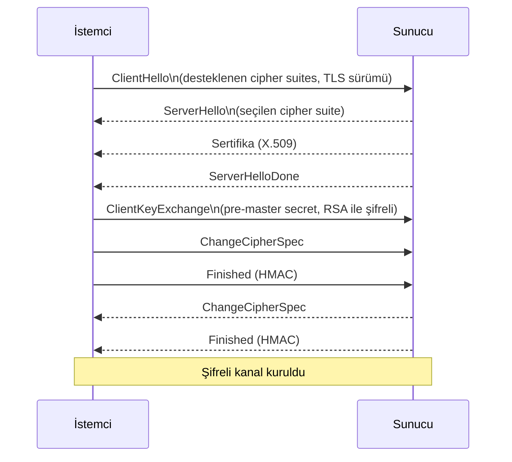

### RSA (Asimetrik Şifreleme)

RSA güvenliği, büyük sayıların asal çarpanlarına ayrılmasının hesaplama zorluğuna dayanır.

| Kavram | Açıklama |
|--------|---------|
| **Public Key** | Herkesle paylaşılır; yalnızca şifreler |
| **Private Key** | Gizli tutulur; şifreyi çözer ve imzalar |
| **Anahtar uzunluğu** | Minimum 2048-bit (≥4096-bit önerilir) |
| **Matematiksel temel** | n = p × q (büyük asal sayılar); e·d ≡ 1 mod φ(n) |

```bash
# RSA anahtar çifti oluştur
openssl genrsa -out private.pem 4096
openssl rsa -in private.pem -pubout -out public.pem

# Şifreleme / Deşifreleme
openssl rsautl -encrypt -pubin -inkey public.pem -in data.txt -out data.enc
openssl rsautl -decrypt -inkey private.pem -in data.enc -out data.dec

# Dijital imza
openssl dgst -sha256 -sign private.pem -out sig.bin data.txt
openssl dgst -sha256 -verify public.pem -signature sig.bin data.txt
```

### SSH (Secure Shell)

SSH, OSI uygulama katmanında çalışan, **TCP 22** portunu kullanan şifreli uzaktan erişim protokolüdür.

| Kimlik Doğrulama | Güvenlik | Avantaj |
|:----------------:|:--------:|--------|
| Parola | Orta | Kolay kurulum |
| RSA/Ed25519 Anahtar | **Yüksek** | Şifresiz, brute-force'a dayanıklı |
| FIDO2 / Hardware Key | En yüksek | Kimlik avına karşı dirençli |

```bash
# Ed25519 anahtar çifti (RSA'dan daha küçük ve hızlı)
ssh-keygen -t ed25519 -C "serkan@host"

# Public key'i sunucuya kopyala
ssh-copy-id user@server
# veya
cat ~/.ssh/id_ed25519.pub | ssh user@server "cat >> ~/.ssh/authorized_keys"

# SSH bağlantısı
ssh -p 2222 user@server            # Özel port
ssh -i ~/.ssh/id_ed25519 user@server  # Belirli anahtar

# Tünel — yerel yönlendirme (L)
ssh -L 8080:localhost:80 user@server   # localhost:8080 → sunucu:80

# Tünel — uzak yönlendirme (R)
ssh -R 9090:localhost:3000 user@server # sunucu:9090 → yerel:3000

# SOCKS5 proxy
ssh -D 1080 user@server   # Tüm trafiği sunucu üzerinden geçir
```

```ini title="/etc/ssh/sshd_config — Güvenlik Ayarları"
Port 2222                      # Varsayılan 22'yi değiştir
PermitRootLogin no             # Root girişi engelle
PasswordAuthentication no      # Sadece anahtar
PubkeyAuthentication yes
MaxAuthTries 3
LoginGraceTime 30
X11Forwarding no
AllowUsers serkan admin        # Sadece belirtilen kullanıcılar
```

---

## MAVLink

MAVLink (Micro Air Vehicle Link), insansız hava araçları (UAV/drone) ve otonom sistemler için tasarlanmış, son derece hafif ikili (binary) haberleşme protokolüdür. 2009'da Lorenz Meier tarafından geliştirilmiştir. ArduPilot, PX4 ve PX4-based tüm uçuş denetleyicileri MAVLink'i standart iletişim protokolü olarak kullanır.

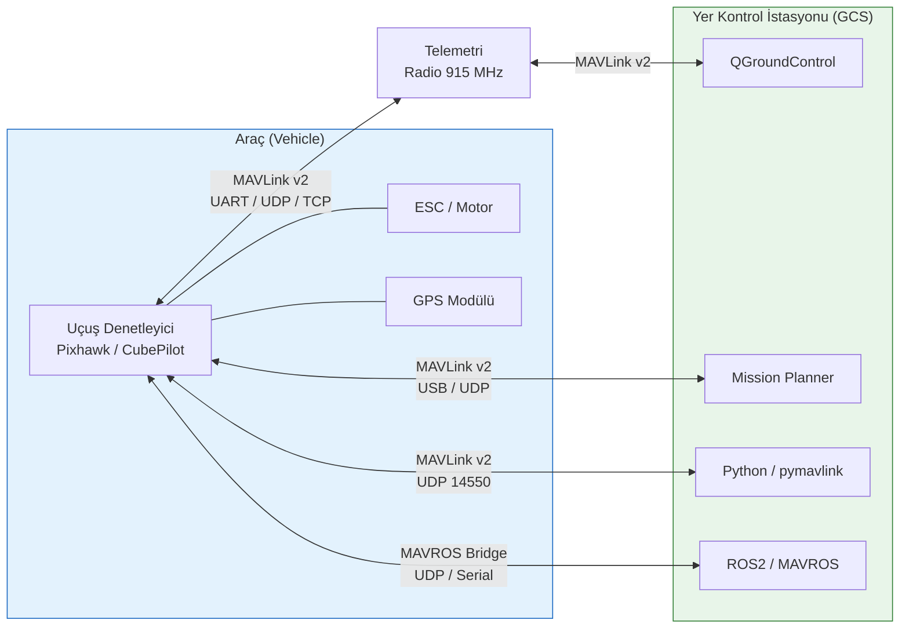

### MAVLink v1 vs v2

| Özellik | MAVLink v1 | MAVLink v2 |
|---------|:----------:|:----------:|
| Magic byte | `0xFE` | `0xFD` |
| Maks. payload | 255 byte | 255 byte |
| Message ID | 8 bit (0–255) | 24 bit (0–16M) |
| İmzalama | ✗ | ✓ (13 byte imza) |
| Boş alan atlama | ✗ | ✓ (trim) |
| Component metadata | ✗ | ✓ |
| Kullanım | Legacy | **Standart (önerilen)** |

### Paket Yapısı

=== "MAVLink v1"

    ```
    Byte:  0      1      2      3      4      5     6..N+5   N+6  N+7
           ┌──────┬──────┬──────┬──────┬──────┬──────┬───────┬──────┬──────┐
           │ 0xFE │ LEN  │ SEQ  │ SYS  │ COMP │ MSG  │ DATA  │ CRC  │ CRC  │
           │ STX  │(0-255│(0-255│  ID  │  ID  │  ID  │Payload│ LOW  │ HIGH │
           └──────┴──────┴──────┴──────┴──────┴──────┴───────┴──────┴──────┘
    ```

=== "MAVLink v2"

    ```
    Byte:  0      1      2      3      4      5     6  7  8   9..N+8   N+9 N+10  N+11..N+22
           ┌──────┬──────┬──────┬──────┬──────┬──────┬─────────┬──────────┬──────┬──────┬──────────────┐
           │ 0xFD │ LEN  │IFlag │CFlag │ SEQ  │ SYS  │  COMP   │  MSG ID  │ DATA │ CRC  │ SIGNATURE    │
           │  STX │      │      │      │      │  ID  │   ID    │ 24-bit   │      │2byte │ (opsiyonel)  │
           └──────┴──────┴──────┴──────┴──────┴──────┴─────────┴──────────┴──────┴──────┴──────────────┘
    ```

| Alan | Açıklama |
|------|---------|
| **STX** | Start of Frame sihirli byte |
| **LEN** | Payload uzunluğu (byte) |
| **SEQ** | Paket sıra numarası; kayıp tespiti için |
| **SYS ID** | Sistemi tanımlar (1–255; GCS genellikle 255) |
| **COMP ID** | Bileşeni tanımlar (Autopilot=1, Camera=100, vb.) |
| **MSG ID** | Mesaj tipi kimliği |
| **CRC** | CRC-16/MCRF4XX + mesaj extra CRC |

### Temel Mesaj Tipleri

| MSG ID | İsim | Açıklama | Frekans |
|:------:|------|---------|:-------:|
| 0 | `HEARTBEAT` | Sistem tipi, mod, durum | 1 Hz |
| 1 | `SYS_STATUS` | Batarya, CPU, sensör sağlığı | 1 Hz |
| 24 | `GPS_RAW_INT` | Ham GPS (lat/lon/alt/fix) | 5 Hz |
| 30 | `ATTITUDE` | Roll/Pitch/Yaw (radyan) | 10–50 Hz |
| 32 | `LOCAL_POSITION_NED` | Yerel NED konum | 10 Hz |
| 33 | `GLOBAL_POSITION_INT` | Global konum (cm, mm/s) | 10 Hz |
| 74 | `VFR_HUD` | Airspeed, groundspeed, heading, throttle | 4 Hz |
| 76 | `COMMAND_LONG` | Komut gönder (arm, takeoff, vb.) | — |
| 77 | `COMMAND_ACK` | Komut yanıtı | — |
| 83 | `ATTITUDE_TARGET` | İstenen attitude | — |
| 105 | `HIGHRES_IMU` | Yüksek çözünürlüklü IMU | 50–200 Hz |
| 147 | `BATTERY_STATUS` | Hücre gerilimleri | 1 Hz |
| 242 | `HOME_POSITION` | Home noktası | — |
| 253 | `STATUSTEXT` | İnsan okunabilir mesaj | Olay |

### Bağlantı Yöntemleri

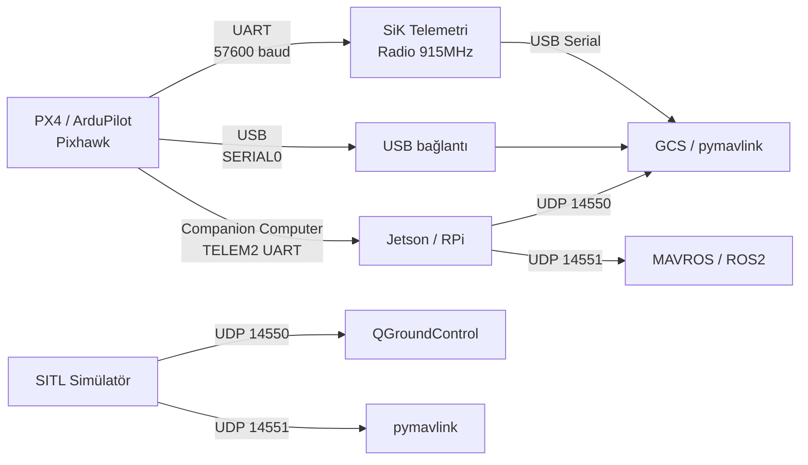

| Bağlantı | Port | Açıklama |
|----------|:----:|---------|
| USB / Serial | — | Doğrudan bağlantı; debug ve flash |
| UDP (GCS) | 14550 | Standart GCS portu |
| UDP (ikinci) | 14551 | İkinci istemci (MAVROS, script) |
| TCP | 5760 | SITL varsayılan TCP |
| UART (telemetri) | — | SiK radio, RFD900 |

### Uçuş Modları

=== "ArduCopter"

    | Mod | Açıklama |
    |-----|---------|
    | STABILIZE | Manuel; throttle ham, attitude stabilized |
    | ALT_HOLD | Yükseklik sabit, yatay manuel |
    | LOITER | GPS tutma |
    | AUTO | Görev planı izle |
    | GUIDED | Harici komutla hedefe git |
    | LAND | Otomatik iniş |
    | RTL | Return to Launch |
    | POSHOLD | GPS konum tutma |

=== "PX4 Multirotor"

    | Mod | Açıklama |
    |-----|---------|
    | Manual | Ham RC girişi |
    | Stabilized | Attitude stabilized |
    | Altitude | Yükseklik sabit |
    | Position | GPS konum tutma |
    | Mission | Otomatik görev |
    | Hold | Mevcut konumda bekle |
    | Return | Home'a dön |
    | Offboard | Harici bilgisayar kontrolü |

### pymavlink — Python Örneği

```python title="mavlink_connect.py"
from pymavlink import mavutil
import time

# Bağlantı kur
# Serial:  mavutil.mavlink_connection('/dev/ttyUSB0', baud=57600)
# UDP:     mavutil.mavlink_connection('udpin:0.0.0.0:14550')
# TCP:     mavutil.mavlink_connection('tcp:127.0.0.1:5760')
master = mavutil.mavlink_connection('udpin:0.0.0.0:14550')

# İlk HEARTBEAT bekle
master.wait_heartbeat()
print(f"HEARTBEAT alındı — system: {master.target_system}, "
      f"component: {master.target_component}")

# --- HEARTBEAT oku ---
while True:
    msg = master.recv_match(type='HEARTBEAT', blocking=True, timeout=3)
    if msg:
        mode = mavutil.mode_string_v10(msg)
        print(f"Mod: {mode}, Armed: {bool(msg.base_mode & 0x80)}")
        break
```

```python title="mavlink_arm_takeoff.py"
from pymavlink import mavutil
import time

master = mavutil.mavlink_connection('udpin:0.0.0.0:14550')
master.wait_heartbeat()

def send_command(command, param1=0, param2=0, param3=0,
                 param4=0, param5=0, param6=0, param7=0):
    master.mav.command_long_send(
        master.target_system,
        master.target_component,
        command,
        0,            # confirmation
        param1, param2, param3, param4, param5, param6, param7
    )
    ack = master.recv_match(type='COMMAND_ACK', blocking=True, timeout=5)
    return ack.result if ack else None

# ARM
result = send_command(mavutil.mavlink.MAV_CMD_COMPONENT_ARM_DISARM,
                      param1=1)   # 1=ARM, 0=DISARM
print("ARM:", result)
time.sleep(2)

# Takeoff — 10 metre
result = send_command(mavutil.mavlink.MAV_CMD_NAV_TAKEOFF,
                      param7=10.0)   # yükseklik (m)
print("TAKEOFF:", result)
```

```python title="mavlink_telemetry.py"
from pymavlink import mavutil

master = mavutil.mavlink_connection('udpin:0.0.0.0:14550')
master.wait_heartbeat()

# Belirli mesaj tiplerini iste (mesaj hızını ayarla)
# MAV_DATA_STREAM_POSITION = 6, 10 Hz
master.mav.request_data_stream_send(
    master.target_system,
    master.target_component,
    mavutil.mavlink.MAV_DATA_STREAM_POSITION,
    10,    # Hz
    1      # 1=başlat, 0=durdur
)

while True:
    msg = master.recv_match(
        type=['GLOBAL_POSITION_INT', 'ATTITUDE', 'BATTERY_STATUS'],
        blocking=True,
        timeout=1
    )
    if msg is None:
        continue

    if msg.get_type() == 'GLOBAL_POSITION_INT':
        lat = msg.lat / 1e7
        lon = msg.lon / 1e7
        alt = msg.relative_alt / 1000.0   # mm → m
        print(f"Konum: {lat:.6f}, {lon:.6f}, {alt:.1f}m")

    elif msg.get_type() == 'ATTITUDE':
        import math
        roll  = math.degrees(msg.roll)
        pitch = math.degrees(msg.pitch)
        yaw   = math.degrees(msg.yaw)
        print(f"Attitude: R={roll:.1f}° P={pitch:.1f}° Y={yaw:.1f}°")

    elif msg.get_type() == 'BATTERY_STATUS':
        voltage = msg.voltages[0] / 1000.0   # mV → V
        print(f"Batarya: {voltage:.2f}V")
```

```python title="mavlink_mission.py"
from pymavlink import mavutil
from pymavlink.dialects.v20 import ardupilotmega as mavlink2

master = mavutil.mavlink_connection('udpin:0.0.0.0:14550')
master.wait_heartbeat()

# Görev noktaları (waypoints)
waypoints = [
    # (seq, lat, lon, alt)
    (0, 0.0, 0.0, 0.0),         # Home (seq=0)
    (1, 39.925533, 32.866287, 30.0),
    (2, 39.926000, 32.867000, 30.0),
    (3, 39.925533, 32.866287, 30.0),
]

# Görev sayısını bildir
master.mav.mission_count_send(
    master.target_system,
    master.target_component,
    len(waypoints),
    mavlink2.MAV_MISSION_TYPE_MISSION
)

for seq, lat, lon, alt in waypoints:
    # MISSION_REQUEST bekle
    req = master.recv_match(type='MISSION_REQUEST', blocking=True, timeout=5)
    if req is None:
        break

    master.mav.mission_item_int_send(
        master.target_system,
        master.target_component,
        seq,
        mavlink2.MAV_FRAME_GLOBAL_RELATIVE_ALT,
        mavlink2.MAV_CMD_NAV_WAYPOINT,
        0,      # current (0=no, 2=guided)
        1,      # autocontinue
        0, 0, 0, float('nan'),  # param1-4
        int(lat * 1e7),
        int(lon * 1e7),
        alt
    )

# ACK bekle
ack = master.recv_match(type='MISSION_ACK', blocking=True, timeout=5)
print(f"Görev yüklendi: {ack.type}")
```

### MAVROS — ROS2 Entegrasyonu

MAVROS, MAVLink protokolünü ROS2 topic/service/action yapısına köprüleyen pakettir.

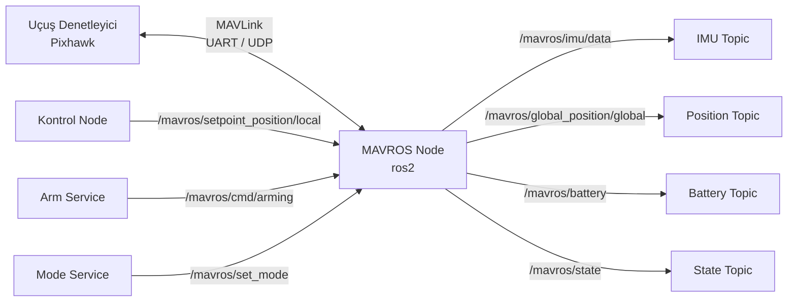

```bash
# MAVROS kurulum (ROS2 Humble)
sudo apt install ros-humble-mavros ros-humble-mavros-extras
ros2 run mavros install_geographiclib_datasets.sh

# Başlatma
ros2 launch mavros px4.launch fcu_url:="udp://:14540@localhost:14557"

# Konum dinle
ros2 topic echo /mavros/global_position/global

# State dinle (arm/mode)
ros2 topic echo /mavros/state

# ARM servisi
ros2 service call /mavros/cmd/arming mavros_msgs/srv/CommandBool \
    "{value: true}"

# Mod değiştir
ros2 service call /mavros/set_mode mavros_msgs/srv/SetMode \
    "{custom_mode: 'GUIDED'}"
```

```python title="mavros_offboard_node.py"
import rclpy
from rclpy.node import Node
from geometry_msgs.msg import PoseStamped
from mavros_msgs.msg import State
from mavros_msgs.srv import CommandBool, SetMode

class OffboardNode(Node):
    def __init__(self):
        super().__init__('offboard_node')
        self.state = State()

        self.state_sub = self.create_subscription(
            State, '/mavros/state',
            lambda msg: setattr(self, 'state', msg), 10)

        self.setpoint_pub = self.create_publisher(
            PoseStamped, '/mavros/setpoint_position/local', 10)

        self.arm_client  = self.create_client(CommandBool, '/mavros/cmd/arming')
        self.mode_client = self.create_client(SetMode, '/mavros/set_mode')

        self.target = PoseStamped()
        self.target.pose.position.z = 5.0   # 5 metre yükseklik

        # Setpoint yayınla (OFFBOARD modu için 2 Hz+ gerekli)
        self.timer = self.create_timer(0.05, self.timer_cb)
        self.offboard_set = False

    def timer_cb(self):
        self.target.header.stamp = self.get_clock().now().to_msg()
        self.setpoint_pub.publish(self.target)

        if not self.state.connected:
            return

        if not self.offboard_set and self.state.mode != 'OFFBOARD':
            req = SetMode.Request(custom_mode='OFFBOARD')
            self.mode_client.call_async(req)
            self.offboard_set = True

        if not self.state.armed:
            req = CommandBool.Request(value=True)
            self.arm_client.call_async(req)

def main():
    rclpy.init()
    rclpy.spin(OffboardNode())
    rclpy.shutdown()
```

### SITL (Software In The Loop) — Simülasyon

```bash
# ArduPilot SITL
git clone https://github.com/ArduPilot/ardupilot
cd ardupilot && git submodule update --init --recursive
./waf configure --board sitl
./waf copter
sim_vehicle.py -v ArduCopter --console --map

# PX4 SITL (Gazebo ile)
cd PX4-Autopilot
make px4_sitl gazebo-classic_iris

# MAVProxy — komut satırı GCS
mavproxy.py --master=udp:127.0.0.1:14550 --console

# Temel SITL komutları (MAVProxy içinde)
arm throttle       # ARM
mode guided        # GUIDED moda geç
takeoff 10         # 10m kalk
wp load mission.txt # Görev yükle
mode auto          # Görevi başlat
```

### MAVLink Mesaj İzleme

```bash
# mavlogdump — .tlog / .bin dosyası analizi
mavlogdump --types ATTITUDE,GPS_RAW_INT flight.tlog

# Python ile anlık izleme
python3 - <<'EOF'
from pymavlink import mavutil
master = mavutil.mavlink_connection('udpin:0.0.0.0:14550')
while True:
    msg = master.recv_match(blocking=True, timeout=1)
    if msg and msg.get_type() != 'BAD_DATA':
        print(msg)
EOF

# wireshark filtresi (UDP 14550)
# udp.port == 14550
```

!!! tip "Bağlantı Sorunlarında Kontrol Listesi"
    1. `fcu_url` doğru mu? (`/dev/ttyACM0` vs `udp://:14540@localhost:14557`)
    2. Baud rate eşleşiyor mu? (PX4 varsayılan: 57600 telemetri, 921600 USB)
    3. SYS_ID çakışması var mı? (Birden fazla cihazda aynı ID olmamalı)
    4. Güvenlik duvarı UDP portunu engelliyor mu?
    5. `mavlink_version` parametresi MAVLink v1/v2 ile uyumlu mu?

!!! warning "Güvenlik"
    MAVLink varsayılan yapılandırmasında şifreleme yoktur. Kamuya açık ağlarda telemetri için MAVLink v2 imzalama (`SIGNING_SETUP` mesajı) veya VPN/SSH tüneli kullanın. Kimlik doğrulamasız ARM komutu alabilmek ciddi güvenlik açığı oluşturur.

---

## Protokol Seçim Rehberi

| Senaryo | Önerilen Protokol |
|---------|:-----------------:|
| MCU ↔ Sensör (kısa mesafe, hızlı) | SPI |
| MCU ↔ Çoklu sensör (bus paylaşımı) | I²C |
| MCU ↔ PC debug / GPS / modem | UART |
| Araç içi ECU ağı | CAN Bus |
| Güvenilir ağ iletişimi | TCP/IP |
| Düşük gecikme, kayıp tolere | UDP |
| Web API | HTTP/HTTPS + REST |
| Gerçek zamanlı iki yönlü web | WebSocket |
| IoT sensör veri akışı | MQTT |
| Kısa mesafe kablosuz, ses | Bluetooth Classic |
| Pil ömrü kritik IoT | BLE |
| Uzaktan terminal erişimi | SSH |
| Yerel süreçler arası hızlı | Unix Domain Socket |
| Kernel ↔ Userspace | Netlink / ioctl |
| UAV / Drone iletişimi | MAVLink v2 |
