# Algoritmalar

!!! note "Genel Bakış"
    Bu sayfa algoritmaların **nasıl çalıştığını** ve **neden tercih edildiğini** açıklar. Kod değil mantık odaklıdır: her algoritmanın arka planını, zaman/mekan karmaşıklığını ve hangi problem tipine uygun olduğunu anlayabilmek için kaleme alınmıştır.

---

## Optical Flow

Optik akış, bir video karesindeki piksel veya özellik noktalarının bir sonraki kareye göre nasıl hareket ettiğini tahmin eder. Temelde iki hipoteze dayanır:

1. **Parlaklık sabiti:** Bir nesnenin üzerindeki pikselin parlaklığı kısa sürede değişmez.
2. **Küçük hareket:** Nesneler kareler arasında yalnızca küçük miktarda hareket eder.

Bu iki hipotezden **optik akış kısıtı** denklemi türetilir. Ancak bu denklem tek başına yeterli değildir (iki bilinmeyene karşı bir denklem — "aperture problemi"). Farklı yöntemler bu eksik bilgiyi farklı şekillerde tamamlar.

### Sparse vs Dense Optik Akış

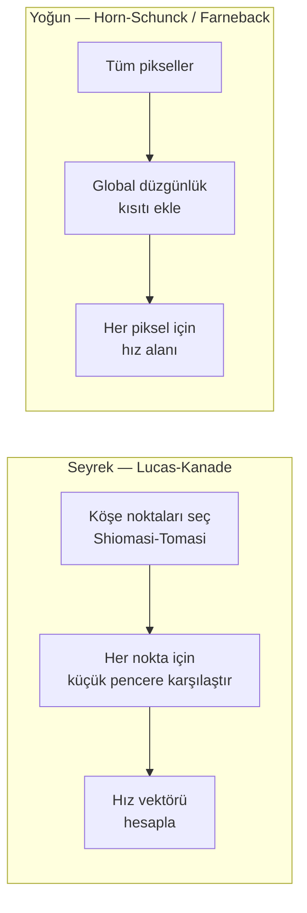

| | Lucas-Kanade (Seyrek) | Horn-Schunck / Farneback (Yoğun) |
|--|:---------------------:|:---------------------------------:|
| Hesaplama | Hızlı | Yavaş |
| Çıktı | Seçili noktalarda vektörler | Tüm piksellerde vektör alanı |
| Gürültüye dayanıklılık | İyi (pencere ortalaması) | Orta |
| Kullanım | VIO, feature tracking | Segmentasyon, arka plan çıkarma |

**Lucas-Kanade'nin zayıflığı:** Büyük hareketlerde başarısız olur. Çözüm: görüntü piramidi kullanmak — önce küçük çözünürlükte kaba hareket, sonra orijinal boyutta hassas hareket hesaplanır.

!!! tip "Robotik ve VIO'da Kullanımı"
    VIO sistemlerinde kamera çerçeveleri arasındaki özellik noktaları Lucas-Kanade ile takip edilir. Bu takip edilen noktaların 3D hareketi, IMU verileriyle birleştirilerek robot konumu hesaplanır.

---

## VIO — Visual Inertial Odometry

### VO ile VIO Arasındaki Fark

**VO (Visual Odometry):** Yalnızca kamera kullanarak robotun veya aracın hareketini tahmin eder. Ardışık görüntüler arasındaki özellik noktalarının değişimi, kameranın ne kadar hareket ettiğini ve döndüğünü verir.

**VIO (Visual Inertial Odometry):** Kamera + IMU (İvmeölçer + Jiroskop) birlikteliği. İki sensörün zayıf yönleri birbirini tamamlar.

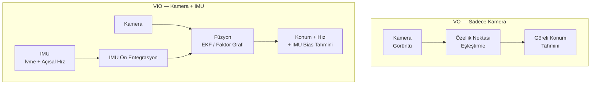

### VO'nun Sorunları — Neden IMU Eklenir?

| Sorun | VO'da Durum | VIO'da Çözüm |
|-------|:----------:|:------------:|
| **Ölçek belirsizliği** | Mono kamerada gerçek ölçek bilinemez — 1m mi, 10m mi? | IMU gerçek ivmeyi ölçer, ölçeği kurtarır |
| **Hızlı hareket / bulanıklık** | Görüntü takibi başarısız olur | IMU yüksek frekanslı (200-1000 Hz) köprü kurar |
| **Karanlık / doku yok** | Özellik bulunamaz, takip durur | IMU kısa süre devralır |
| **Drift (kayma)** | Hata birikir, uzun sürede konum kayar | IMU preintegrasyon kısa vadeli kesinlik sağlar |
| **Başlangıç** | Statik başlamak zorunda değil | IMU oryantasyon referansı sağlar (yerçekimi vektörü) |

**IMU'nun kendi sorunu:** Bias (sürüklenme) — ivmeölçer ve jiroskop sıfır girdisinde bile yavaşça kayar. Bu nedenle VIO sistemi hem robotu konumlandırır hem de IMU bias'ını sürekli tahmin eder.

### Sistem Mimarisi

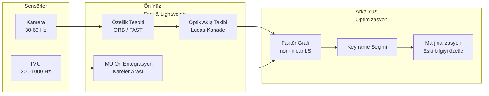

### Öne Çıkan VIO Sistemleri

| Sistem | Kamera Tipi | Algoritma | Açık Kaynak |
|--------|:-----------:|:---------:|:-----------:|
| **MSCKF** | Mono / Stereo | EKF tabanlı | ✓ |
| **VINS-Mono** | Mono | Kayma pencere optimizasyonu | ✓ |
| **VINS-Fusion** | Stereo / RGB-D | Grafik optimizasyonu | ✓ |
| **ORB-SLAM3** | Mono / Stereo / RGB-D | Faktör grafı + harita | ✓ |
| **Basalt** | Stereo | Non-linear optimizer | ✓ |
| **OpenVINS** | Mono / Stereo | MSCKF bazlı | ✓ |

---

### Stereo Kamera: Avantaj ve Dezavantajlar

Stereo kamera, sabit bir bazlık (baseline) mesafesiyle yerleştirilmiş iki kameradan oluşur. Sol ve sağ görüntüler arasındaki **disparity** (piksel kayması) doğrudan derinlik hesabına dönüştürülür.

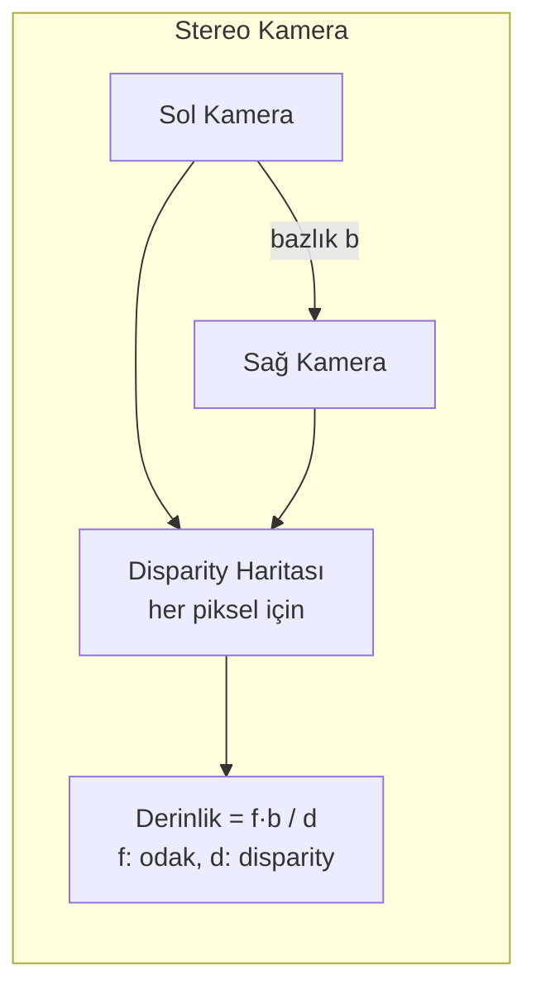

#### Avantajlar

| Avantaj | Açıklama |
|---------|---------|
| **Mutlak ölçek** | Bazlık mesafesi bilindiğinden derinlik gerçek metrik birimdedir; IMU'ya ihtiyaç kalmadan ölçek belirsizliği yoktur |
| **Hızlı başlatma** | Sistem ilk kareden itibaren doğru ölçekli çalışır; mono sistemlerde "ölçek başlatma" süreci (IMU ile hareket gerektirir) yoktur |
| **Statik başlama** | Robot hareket etmeden bile derinlik elde edilir; IMU ile başlatma için genellikle hareket gerekirken stereo'da bu şart yoktur |
| **Derinlik yoğunluğu** | Disparity haritası tüm pikseller için derinlik üretir; LIDAR'a kıyasla daha yoğun nokta bulutu |
| **IMU bağımsızlık** | Mono+IMU sistemlerde IMU bozulursa sistem çöker; stereo kendi başına çalışmaya devam edebilir |
| **Gece / Tekstür yok** | Aktif ışıkla (stereo + projektör) veya IR stereo ile çalışabilir |

#### Dezavantajlar

| Dezavantaj | Açıklama |
|-----------|---------|
| **Ağır kalibrasyon** | İki kameranın birbirine göreli konumu (ekstrinsik) hassas ve stabil olmalı; titreşim veya ısıl genleşme kalibrasyonu bozar |
| **Bazlık-menzil dengesi** | Kısa bazlık → yakın nesnelerde iyi, uzakta kötü. Uzun bazlık → tam tersi. Sabit bazlık her mesafeye optimal değil |
| **Stereo eşleştirme maliyeti** | Disparity hesaplaması CPU/GPU yoğun; SGBM, BM gibi algoritmalar gerçek zamanlı çalıştırmak donanım gerektirir |
| **Boyut ve ağırlık** | Mono kameraya göre daha büyük, daha ağır; küçük drone'larda sorun |
| **Tekstürsüz yüzey** | Düz duvar, boş koridor gibi yerlerde disparity hesaplanamaz; aktif ışık (Intel RealSense yapılandırmalı IR) gerekebilir |
| **Epipolar rectification** | Görüntüler her kullanımda düzeltilmeli (rectify); kalibrasyon kayması gerçek zamanlı tespiti zorlaştırır |

#### Mono vs Stereo Karşılaştırması

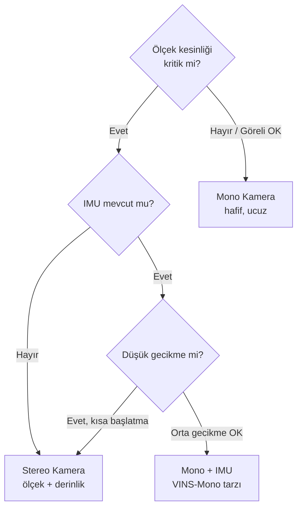

| Özellik | Mono | Mono+IMU | Stereo | Stereo+IMU |
|---------|:----:|:--------:|:------:|:----------:|
| Ölçek | ✗ | ✓ (başlatma sonrası) | ✓ | ✓ |
| Derinlik | ✗ | Kısmi | ✓ | ✓ |
| Kalibrasyon karmaşıklığı | Kolay | Orta | Orta | **Zor** |
| Boyut | Küçük | Küçük | Orta | Orta |
| Hesaplama | Düşük | Orta | **Yüksek** | **Yüksek** |
| Sağlamlık | Düşük | Orta | İyi | **En iyi** |

!!! tip "Pratik Öneri"
    Kapalı alan navigasyonu + metrik konum gerekliyse → **Stereo + IMU** (ORB-SLAM3 stereo-inertial).  
    Ağırlık kritikse (küçük drone) → **Mono + IMU** (VINS-Mono, OpenVINS).  
    Derinlik sensörü olarak (arm, obstacle avoidance) → **Stereo** veya **RGB-D**.

---

## Graf Algoritmaları

### BFS — Genişlik Öncelikli Arama

**Mantık:** Başlangıç düğümünden katman katman dışa doğru genişler. Önce tüm komşular ziyaret edilir, sonra komşuların komşuları. **Kuyruk (FIFO)** veri yapısıyla çalışır.

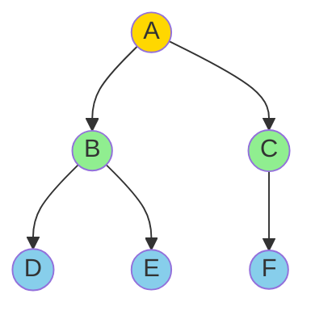

Ziyaret sırası: A → B → C → D → E → F (seviye seviye)

| Özellik | Değer |
|---------|-------|
| Zaman Karmaşıklığı | O(V + E) |
| Alan Karmaşıklığı | O(V) — kuyruktaki düğümler |
| En kısa yol (ağırlıksız) | ✓ Garanti |
| Döngü tespiti | ✓ |

**Ne zaman kullanılır?**
- Ağırlıksız grafta iki düğüm arasındaki en kısa yol
- Katman/seviye bazlı analiz (sosyal ağda 2. derece arkadaşlar)
- Web crawler'lar (bağlantı seviyesine göre tara)

---

### DFS — Derinlik Öncelikli Arama

**Mantık:** Bir yolu sonuna kadar takip eder, çıkmaz sokağa gelince geri döner ve başka bir yol dener. **Yığın (LIFO)** veya özyineleme ile çalışır.

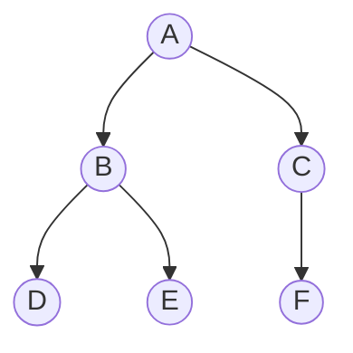

Ziyaret sırası: A → B → D → E → C → F (dala gir, bitince geri dön)

| Özellik | Değer |
|---------|-------|
| Zaman Karmaşıklığı | O(V + E) |
| Alan Karmaşıklığı | O(V) — özyineleme yığını |
| En kısa yol | ✗ Garanti etmez |
| Döngü tespiti | ✓ (geri kenar tespiti) |

**Ne zaman kullanılır?**
- Topolojik sıralama (bağımlılık çözümü — paket yöneticileri)
- Bağlantılı bileşen bulma
- Labirent çözme
- Döngü tespiti

!!! note "BFS vs DFS Seçim Kuralı"
    Hedefe **en kısa yol** arıyorsan → **BFS**.  
    Tüm olasılıkları **derinlemesine keşfet** veya **topolojik sıralama** gerekiyorsa → **DFS**.

---

### Dijkstra

**Mantık:** Negatif olmayan ağırlıklı grafta tek kaynaktan en kısa yolları bulur. Her adımda henüz işlenmemiş düğümler arasından **en düşük maliyetli** olanı seçer (greedy). Öncelik kuyruğu (min-heap) kullanır.

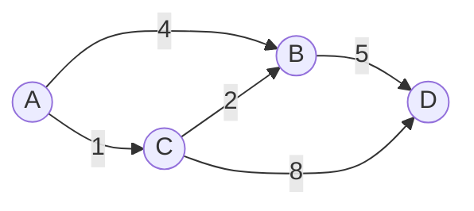

A'dan D'ye en kısa yol: A→C→B→D (1+2+5=8), A→C→D değil (1+8=9)

**Çalışma prensibi:**
1. Başlangıç düğümü mesafe=0, diğerleri sonsuz
2. Min-heap'ten en küçük mesafeli düğümü çıkar
3. Komşuların mesafelerini güncelle (relaxation)
4. Heap'e tekrar ekle
5. Tüm düğümler işlenene kadar devam et

| Özellik | Değer |
|---------|-------|
| Zaman Karmaşıklığı | O((V + E) log V) — min-heap ile |
| Negatif kenar | ✗ Desteklemez |
| Negatif döngü | ✗ Tespit edemez |

**Ne zaman kullanılır?**
- GPS yol bulma (haritalar)
- Ağ yönlendirme (OSPF protokolü)
- Robotik yol planlaması (maliyet haritaları)

---

### Bellman-Ford

**Mantık:** Dijkstra'nın yapamadığı şeyi yapar: **negatif ağırlıklı kenarları** işler ve **negatif döngü** tespit eder. Her kenarı V-1 kez gevşetir (relaxation). Dinamik programlama yaklaşımı.

**Çalışma prensibi:**
1. Başlangıç mesafe=0, diğerleri sonsuz
2. Tüm kenarlar üzerinden V-1 kez geçerek mesafeleri güncelle
3. V. geçişte hâlâ güncelleme olursa → negatif döngü var

| Özellik | Değer |
|---------|-------|
| Zaman Karmaşıklığı | O(V · E) |
| Negatif kenar | ✓ |
| Negatif döngü tespiti | ✓ |
| Dijkstra'dan yavaş mı? | Evet (genellikle) |

**Ne zaman kullanılır?**
- Negatif ağırlıklar içeren graflarda
- Finans: arbitraj fırsatı tespiti (negatif döngü = para kazanma döngüsü)
- Ağ protokollerinde (RIP — Routing Information Protocol)

---

### Floyd-Warshall

**Mantık:** Grafttaki **tüm çiftler arasındaki** en kısa yolları tek seferde hesaplar. Her düğümü potansiyel ara nokta olarak dener. Dinamik programlama.

**Temel fikir:** `dist[i][j]` = i'den j'ye en kısa yol. k. düğümü ara nokta olarak ekleyerek güncelle:

```
dist[i][j] = min(dist[i][j], dist[i][k] + dist[k][j])
```

| Özellik | Değer |
|---------|-------|
| Zaman Karmaşıklığı | O(V³) |
| Alan Karmaşıklığı | O(V²) — matris |
| Negatif kenar | ✓ |
| Negatif döngü tespiti | ✓ (köşegen eksi olursa) |
| Tek kaynak mı? | ✗ Tüm çiftler |

**Ne zaman kullanılır?**
- Graf küçük ve tüm çiftler arası mesafe gerekiyorsa
- Ağ gecikmesi matrisi hesaplama
- Erişilebilirlik analizi (hangi düğümler birbirine ulaşabilir?)

---

### A* (A-Star)

**Mantık:** Dijkstra + heuristik (tahmini mesafe). Her düğüm için gerçek maliyet `g(n)` ile hedefe tahmini mesafe `h(n)` toplanarak `f(n) = g(n) + h(n)` hesaplanır. Heuristik akıllıca yönlendirme sağlar.

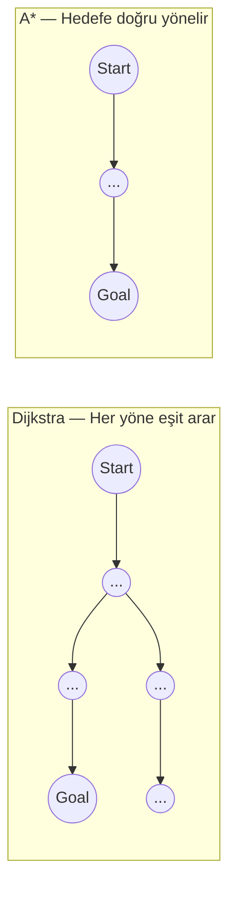

**Heuristik Kriterleri:**
- **Kabul edilebilir (admissible):** Gerçek maliyeti hiçbir zaman aşmaz → A* optimal çözüm garantisi verir
- Yaygın heuristikler: Manhattan mesafesi (ızgara), Öklid mesafesi (açık alan)

| Özellik | Dijkstra | A* |
|---------|:--------:|:--:|
| Optimal | ✓ | ✓ (kabul edilebilir h ile) |
| Hız | Orta | Daha hızlı (hedef yönlü) |
| Heuristik | ✗ | ✓ |
| Kullanım | Genel graf | Uzamsal yol bulma |

**Ne zaman kullanılır?**
- Robot navigasyonu (ROS Nav2 / costmap)
- Oyun yapay zekası (karakter yol bulma)
- GPS navigasyonu (coğrafi heuristik ile)

!!! tip "Kısa Karşılaştırma"
    | Algoritma | Negatif Kenar | Tüm Çiftler | Heuristik | Karmaşıklık |
    |-----------|:-------------:|:-----------:|:---------:|:-----------:|
    | BFS | ✗ (ağırlıksız) | ✗ | ✗ | O(V+E) |
    | Dijkstra | ✗ | ✗ | ✗ | O((V+E)logV) |
    | Bellman-Ford | ✓ | ✗ | ✗ | O(VE) |
    | Floyd-Warshall | ✓ | ✓ | ✗ | O(V³) |
    | A* | ✗ | ✗ | ✓ | O(E log V) |

---

## Sıralama Algoritmaları

### Bubble Sort — Kabarcık Sıralaması

**Mantık:** Komşu iki elemanı karşılaştırır, yanlış sıradaysa yer değiştirir. Her geçişte en büyük eleman sona "kabarcık gibi" yükselir. Saf kuvvet yöntemi.

```
[5, 3, 8, 1] → [3, 5, 1, 8] → [3, 1, 5, 8] → [1, 3, 5, 8]
```

| | Değer |
|--|-------|
| En iyi | O(n) — zaten sıralıysa (erken çıkış ile) |
| Ortalama / En kötü | O(n²) |
| Bellek | O(1) — yerinde |
| Kararlı (Stable) | ✓ |

**Kullanım:** Eğitim amaçlı. Gerçek sistemlerde kullanılmaz.

---

### Selection Sort — Seçme Sıralaması

**Mantık:** Her geçişte dizinin sıralanmamış kısmından **en küçük elemanı** bulur ve başa taşır. Bubble'dan farkı: swap sayısı azdır (en fazla n-1 swap).

```
[5, 3, 8, 1] → min=1 → [1, 3, 8, 5] → min=3 → [1, 3, 8, 5] → ...
```

| | Değer |
|--|-------|
| Her durumda | O(n²) — erken çıkış yok |
| Bellek | O(1) |
| Kararlı | ✗ |

**Kullanım:** Bellek yazma işlemi pahalıysa (flash bellek gibi) — swap sayısı minimumdur.

---

### Insertion Sort — Ekleme Sıralaması

**Mantık:** Kart oyunundaki gibi — sıralanmış kısma yeni elemanı doğru yerine ekler. Sıralı kısım solda büyür.

```
[5, 3, 8, 1]
→ [3, 5, 8, 1]   (3'ü doğru yere koy)
→ [3, 5, 8, 1]   (8 zaten doğru yerde)
→ [1, 3, 5, 8]   (1'i en başa ekle)
```

| | Değer |
|--|-------|
| En iyi | O(n) — neredeyse sıralıysa |
| En kötü | O(n²) |
| Bellek | O(1) |
| Kararlı | ✓ |
| Online | ✓ Veri geldikçe sıralayabilir |

**Kullanım:** Küçük veri (n < 20) veya neredeyse sıralı veri için pratik. Birçok hibrit algoritma (TimSort) küçük parçalarda insertion sort kullanır.

---

### Merge Sort — Birleştirme Sıralaması

**Mantık:** Böl-ve-yönet. Diziyi ikiye böler, her yarıyı özyinelemeli olarak sıralar, sonra iki sıralı yarıyı birleştirir.

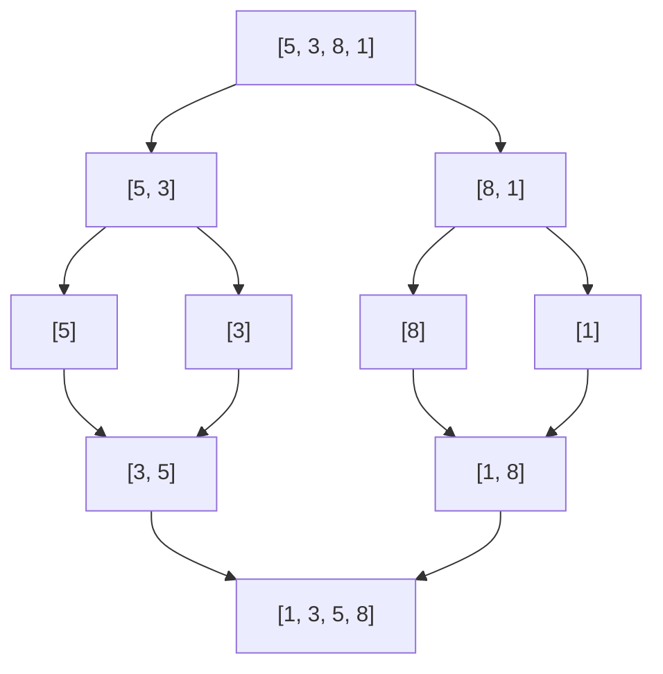

| | Değer |
|--|-------|
| Her durumda | O(n log n) |
| Bellek | O(n) — ek dizi gerektirir |
| Kararlı | ✓ |

**Kullanım:** Bağlı listeler için ideal (eleman kopyalamadan birleştirilir). Büyük veri kümelerinde garantili O(n log n). Dış sıralama (disk üzerindeki veriler).

---

### Quick Sort — Hızlı Sıralama

**Mantık:** Bir **pivot** seçer, pivot'tan küçükleri sola, büyükleri sağa taşır (partition). Sonra her iki tarafı özyinelemeli sıralar.

```
[5, 3, 8, 1]  → pivot=5
→ [3, 1 | 5 | 8]   (soldakiler < 5, sağdakiler > 5)
→ [1, 3 | 5 | 8]   (sol kısmı sırala)
→ [1, 3, 5, 8]
```

| | Değer |
|--|-------|
| Ortalama | O(n log n) |
| En kötü | O(n²) — pivot her seferinde min/max seçilirse |
| Bellek | O(log n) — özyineleme yığını |
| Kararlı | ✗ |

**Neden hızlı?** Bellek erişim örüntüsü cache'e dosttur (in-place, yerel erişim). Merge sort'un aksine ek bellek gerektirmez.

**Pivot seçimi kritik:** Rastgele pivot veya "median of three" yöntemi en kötü durum olasılığını azaltır.

**Kullanım:** Genel amaçlı sıralama için pratikte en hızlı. C++'ın `std::sort`, Java'nın `Arrays.sort(int[])` temelde introsort kullanır — quicksort bazlı.

---

### Heap Sort — Yığın Sıralaması

**Mantık:** Önce diziyi **max-heap** (her ebeveyn çocuklarından büyük) yapısına dönüştürür. Ardından heap'in kökünü (maksimum) sondan başa yerleştirir ve heap'i yeniden düzenler.

```
Heap oluştur: [5, 3, 8, 1] → [8, 3, 5, 1]
Max çıkar: [8] → [1, 3, 5] → heapify → [5, 3, 1]
Max çıkar: [8, 5] → [1, 3] → [3, 1]
...
Sonuç: [1, 3, 5, 8]
```

| | Değer |
|--|-------|
| Her durumda | O(n log n) |
| Bellek | O(1) — yerinde |
| Kararlı | ✗ |

**Quicksort ile farkı:** En kötü durumda bile O(n log n) garantisi verir, yerinde çalışır. Ancak cache performansı quicksort'tan zayıf (heap erişimi sıçramalı).

**Kullanım:** Bellek kısıtlı ve worst-case garantisi gereken durumlar.

---

### Karşılaştırma Tablosu

| Algoritma | En İyi | Ortalama | En Kötü | Bellek | Kararlı |
|-----------|:------:|:--------:|:-------:|:------:|:-------:|
| Bubble Sort | O(n) | O(n²) | O(n²) | O(1) | ✓ |
| Selection Sort | O(n²) | O(n²) | O(n²) | O(1) | ✗ |
| Insertion Sort | **O(n)** | O(n²) | O(n²) | O(1) | ✓ |
| Merge Sort | O(n log n) | O(n log n) | O(n log n) | O(n) | ✓ |
| Quick Sort | O(n log n) | **O(n log n)** | O(n²) | O(log n) | ✗ |
| Heap Sort | O(n log n) | O(n log n) | O(n log n) | **O(1)** | ✗ |

!!! tip "Pratikte Ne Kullanılır?"
    - Küçük veri (n < 20) → **Insertion Sort**
    - Genel amaç → **Quick Sort** (stdlib default)
    - Kararlılık şart → **Merge Sort** veya **TimSort** (Python default)
    - Bellek kısıtlı + worst-case garanti → **Heap Sort**
    - Neredeyse sıralı → **Insertion Sort**

---

## Arama Algoritmaları

### Linear Search — Doğrusal Arama

**Mantık:** Dizinin başından sonuna kadar teker teker her elemana bakılır. Bulunan ilk eşleşmede durur.

| Özellik | Değer |
|---------|-------|
| Zaman Karmaşıklığı | O(n) |
| Sıralanmış gerekir mi? | ✗ |
| Kullanım | Küçük / sırasız listeler |

**Ne zaman?** Veri küçükse, sıralanmamışsa veya yalnızca bir kez aranacaksa. Sıralama maliyeti aramanın faydası aştığında tercih edilir.

---

### Binary Search — İkili Arama

**Mantık:** **Sıralanmış** dizide orta elemana bakılır. Aranan değer ortadan küçükse sol yarıya, büyükse sağ yarıya odaklanılır. Her adımda arama alanı **ikiye bölünür**.

```
Dizi: [1, 3, 5, 8, 12, 17, 23]  Aranan: 12

Adım 1: mid=8  → 12 > 8, sağa bak  →  [12, 17, 23]
Adım 2: mid=17 → 12 < 17, sola bak →  [12]
Adım 3: mid=12 → Bulundu!
```

| Özellik | Değer |
|---------|-------|
| Zaman Karmaşıklığı | O(log n) |
| Sıralanmış gerekir mi? | ✓ Şart |
| Kullanım | Büyük sıralı diziler |

**Kritik nokta:** Sıralama maliyeti O(n log n), arama O(log n). Eğer veri nadiren değişiyor ve sık aranıyorsa sıralama maliyeti amortize edilir.

**Ne zaman?** Veritabanı indeksleri, kelime sözlükleri, sıralı sensor değerleri içinde eşik bulma.

---

## SOLID Prensipleri

Nesne yönelimli tasarımın 5 temel prensibi. Bakımı kolay, esnek, test edilebilir kod yazmanın kılavuzudur.

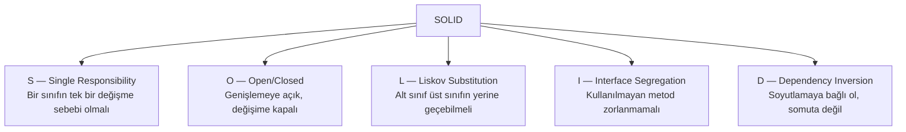

### S — Single Responsibility Principle

Bir sınıfın veya modülün **yalnızca bir değişme sebebi** olmalıdır. Bir sınıf hem veri çekiyorsa hem de formatlamaya karar veriyorsa ikisi ayrılmalıdır.

**İhlal:** `UserService` sınıfı hem kullanıcı doğrulama, hem veritabanı kaydı hem de e-posta gönderimi yapıyor.  
**Doğru:** `AuthService`, `UserRepository`, `EmailService` ayrı sınıflar.

**Neden?** Bir gereksinim değiştiğinde (e-posta formatı) yalnızca o sınıf değişmeli, başka sınıflar etkilenmemeli.

---

### O — Open/Closed Principle

Sınıflar **yeni özellik eklemek için açık**, **mevcut kodu değiştirmek için kapalı** olmalıdır. Yeni davranış eklemek için mevcut sınıfı düzenlemek yerine **genişletilir** (miras veya kompozisyon).

**İhlal:** `if shape == "circle" elif shape == "square"` — yeni şekil ekleyince mevcut kod değişir.  
**Doğru:** Her şekil `area()` arayüzünü uygular; yeni şekil eklenince mevcut kod dokunulmaz.

**Neden?** Test edilmiş koda dokunmak yeni hata riski yaratır.

---

### L — Liskov Substitution Principle

Bir üst sınıf nesnesi, **alt sınıf nesnesiyle yer değiştirilebilmeli** ve program doğru çalışmaya devam etmeli.

**İhlal:** `Rectangle.setWidth()` var, `Square(Rectangle)` bunu override eder ama yüksekliği de değiştirir. `Rectangle` bekleyen kod bozulur.  
**Doğru:** `Square` ve `Rectangle` ortak arayüzden türetilmeli ama birbirinden değil.

**Neden?** Kalıtım "is-a" ilişkisi sadece sözdizimsel değil, davranışsal da olmalı.

---

### I — Interface Segregation Principle

Sınıflar **kullanmadıkları metodları** içeren arayüzleri uygulamak zorunda bırakılmamalıdır. Büyük arayüzler küçük, odaklı arayüzlere bölünmeli.

**İhlal:** `IAnimal` arayüzü `fly()`, `swim()`, `run()` metodları içeriyor. Köpek `fly()` uygulamak zorunda kalıyor.  
**Doğru:** `IFlyable`, `ISwimmable`, `IRunnable` ayrı arayüzler. Her hayvan ilgili olanları uygular.

**Neden?** Gereksiz bağımlılık, "fat interface" değiştiğinde ilgisiz sınıfları da yeniden derlemeye zorlar.

---

### D — Dependency Inversion Principle

Üst seviye modüller alt seviye modüllere **doğrudan bağlı olmamalı**; her ikisi de **soyutlamaya** (arayüz/abstract) bağlı olmalıdır.

**İhlal:** `OrderService` içinde `new MySQLDatabase()` — MySQL'den PostgreSQL'e geçmek için `OrderService` kodu değişmeli.  
**Doğru:** `OrderService` bir `IDatabase` arayüzüne bağlı. `MySQLDatabase` ve `PostgreSQLDatabase` bu arayüzü uygular. Bağımlılık enjeksiyonu ile geçiş kolaydır.

**Neden?** Test sırasında gerçek veritabanı yerine `MockDatabase` enjekte edebilirsiniz. Bağımlılıklar tersine döner — üst seviye modüller altyapıyı dikte eder, altyapı üst seviyeye hizmet eder.

| Prensip | Kısa Kural | İhlal İşareti |
|---------|-----------|---------------|
| SRP | Bir sebep, bir sınıf | "Ve ayrıca" şeklinde açıklanan sınıf |
| OCP | Ekle, değiştirme | Her özellik eklemede mevcut kod düzenleniyor |
| LSP | Alt sınıf üstle değişebilir | Override sonrası `NotImplementedException` |
| ISP | Küçük, odaklı arayüzler | `pass` veya boş metod implementasyonları |
| DIP | Somuta değil soyuta bağlan | `new ConcreteClass()` bağımlılıklar içinde |
