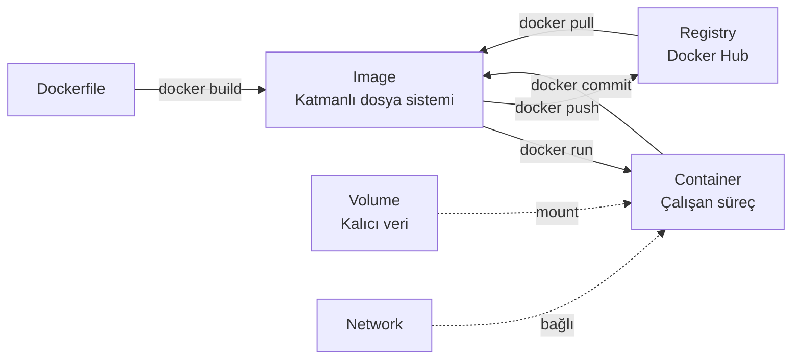
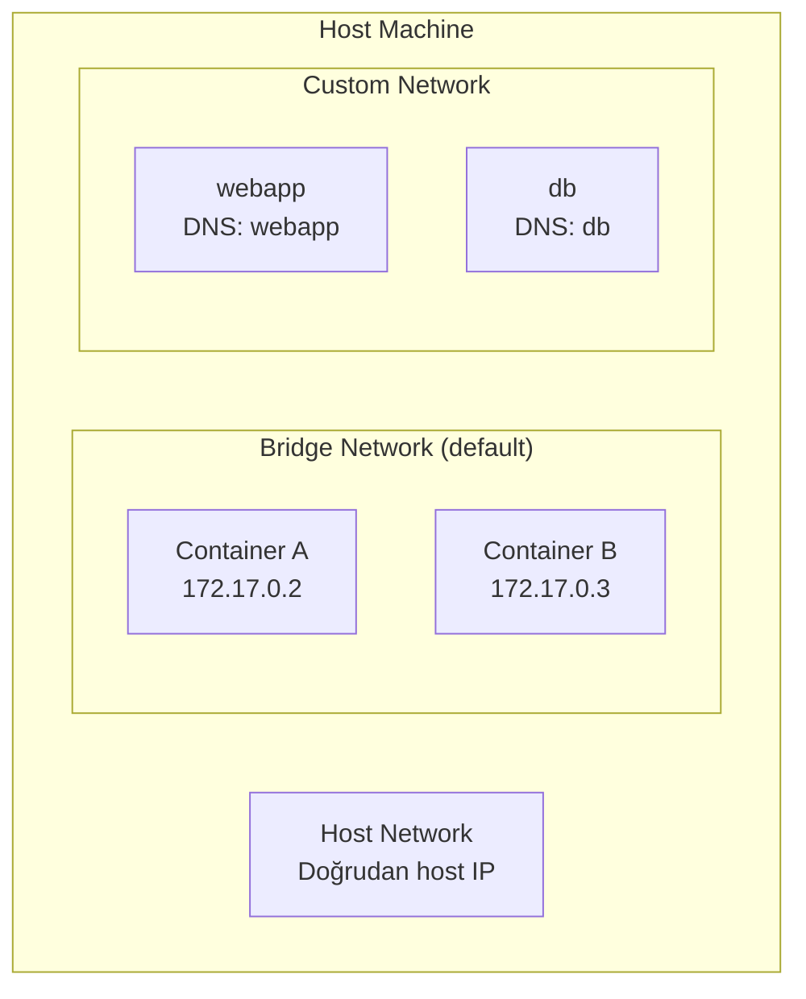

# Docker

## Temel Kavramlar



| Kavram | Açıklama |
|--------|---------|
| **Image** | Katmanlı, salt okunur dosya sistemi şablonu |
| **Container** | Image'ın çalışan örneği (namespace + cgroup ile izole) |
| **Volume** | Container yaşam döngüsünden bağımsız kalıcı veri |
| **Registry** | Image'ların depolandığı sunucu (Docker Hub, GHCR, ECR) |
| **Layer** | Her Dockerfile talimatı yeni bir katman oluşturur; katmanlar önbelleğe alınır |

---

## Image Yönetimi

```bash
docker pull ubuntu:22.04
docker pull node:20-slim
docker image ls
docker image ls --filter dangling=true  # Etiketlenmemiş eski imajlar
docker image tag ubuntu:22.04 myrepo/ubuntu:latest
docker image rm <IMAGE_ID>
docker image prune               # Kullanılmayan imajları temizle
docker image prune -a            # Tüm kullanılmayan imajlar
docker history <IMAGE>           # Katman geçmişi
docker inspect <IMAGE>           # Detaylı metadata
```

---

## Konteyner Yönetimi

```bash
docker run [OPTIONS] IMAGE [COMMAND]
```

| Bayrak | Açıklama |
|--------|---------|
| `-d` | Detached (arka plan) |
| `-it` | İnteraktif terminal |
| `--name <isim>` | Konteyner adı |
| `-p <host>:<container>` | Port yönlendirme |
| `-v <host>:<container>` | Volume mount |
| `-e KEY=VALUE` | Ortam değişkeni |
| `--network <ağ>` | Ağ bağlantısı |
| `--rm` | Durduğunda otomatik sil |
| `--restart always` | Her zaman yeniden başlat |
| `--memory 512m` | Bellek sınırı |
| `--cpus 1.5` | CPU sınırı |

```bash
# Örnek: MongoDB çalıştır
docker run -d \
  --name mongo \
  --restart unless-stopped \
  -p 27017:27017 \
  -v ~/mongo-data:/data/db \
  -e MONGO_INITDB_ROOT_USERNAME=admin \
  -e MONGO_INITDB_ROOT_PASSWORD=secret \
  mongo:7.0

# Konteyner yönetimi
docker ps                        # Çalışanlar
docker ps -a                     # Tümü
docker stop mongo
docker start mongo
docker restart mongo
docker rm mongo                  # Durdurulmuş olanı sil
docker rm -f mongo               # Çalışanı zorla sil
docker container prune           # Tüm durdurulmuş konteynerleri temizle

# İnceleme
docker logs mongo
docker logs -f mongo             # Canlı takip
docker logs --tail 50 mongo      # Son 50 satır
docker inspect mongo
docker stats                     # Canlı kaynak kullanımı
docker top mongo                 # Konteyner içindeki süreçler
docker exec -it mongo bash       # Çalışan konteynere gir
docker cp mongo:/etc/mongod.conf ./  # Dosya kopyala
```

### Restart Policy

| Politika | Davranış |
|----------|---------|
| `no` (default) | Asla yeniden başlatma |
| `always` | Her durumda yeniden başlat |
| `unless-stopped` | Manuel durdurulana kadar yeniden başlat |
| `on-failure[:N]` | Hata kodunda yeniden başlat (max N kez) |

---

## Dockerfile

### Komut Referansı

| Komut | Açıklama |
|-------|---------|
| `FROM` | Temel imaj |
| `RUN` | İmaj oluştururken çalıştır (yeni katman) |
| `COPY` | Host'tan imaja dosya kopyala |
| `ADD` | COPY + URL indirme + tar çıkarma |
| `WORKDIR` | Çalışma dizini ayarla |
| `ENV` | Ortam değişkeni (build + runtime) |
| `ARG` | Sadece build zamanı değişkeni |
| `EXPOSE` | Port belirtimi (bilgilendirme amaçlı) |
| `ENTRYPOINT` | Sabit başlangıç komutu |
| `CMD` | Varsayılan argümanlar (override edilebilir) |
| `HEALTHCHECK` | Sağlık kontrolü |
| `USER` | Kullanıcı bağlamı |

```dockerfile title="Temel Örnek — Node.js"
FROM node:20-slim

WORKDIR /app

# Önce bağımlılıkları kopyala (layer cache optimizasyonu)
COPY package*.json ./
RUN npm ci --only=production

COPY . .

EXPOSE 3000

USER node

CMD ["node", "index.js"]
```

!!! tip "Layer Cache Optimizasyonu"
    `COPY package.json` ve `RUN npm install` adımları, kaynak kodu değişmediği sürece önbellekten gelir. Bu nedenle bağımlılık kurulumu her zaman kaynak koddan önce yapılmalıdır.

### Multi-Stage Build — Küçük ve Güvenli İmaj

```dockerfile title="Multi-Stage — Go Uygulaması"
# ===== Aşama 1: Build =====
FROM golang:1.22 AS builder

WORKDIR /src
COPY go.mod go.sum ./
RUN go mod download

COPY . .
RUN CGO_ENABLED=0 GOOS=linux go build -o /app/server ./cmd/server

# ===== Aşama 2: Runtime =====
FROM scratch

# Sadece derlenmiş binary ve SSL sertifikaları
COPY --from=builder /etc/ssl/certs/ca-certificates.crt /etc/ssl/certs/
COPY --from=builder /app/server /server

EXPOSE 8080
ENTRYPOINT ["/server"]
```

```dockerfile title="Multi-Stage — C++ ROS 2 Paketi"
# Aşama 1: Build ortamı
FROM ros:humble AS builder

WORKDIR /ws
COPY src/ src/
RUN . /opt/ros/humble/setup.sh && \
    rosdep update && \
    rosdep install --from-paths src --ignore-src -y && \
    colcon build --cmake-args -DCMAKE_BUILD_TYPE=Release

# Aşama 2: Runtime
FROM ros:humble-ros-base

COPY --from=builder /ws/install /ws/install
COPY entrypoint.sh /entrypoint.sh
RUN chmod +x /entrypoint.sh

ENTRYPOINT ["/entrypoint.sh"]
CMD ["ros2", "launch", "my_pkg", "bringup.launch.py"]
```

!!! note "Multi-Stage Avantajları"
    - Build araçları (derleyici, SDK) son imaja dahil olmaz
    - İmaj boyutu dramatik küçülür (Go: 800MB → 10MB)
    - Güvenlik yüzeyi azalır (saldırı vektörü daha az)

### Health Check

```dockerfile
HEALTHCHECK --interval=30s --timeout=10s --start-period=5s --retries=3 \
    CMD curl -f http://localhost:8080/health || exit 1
```

```bash
docker inspect --format='{{.State.Health.Status}}' <container>
# healthy | unhealthy | starting
```

### .dockerignore

```text title=".dockerignore"
.git
node_modules
build/
dist/
*.log
.env
.env.*
**/*.test.js
**/__pycache__
```

---

## Docker Network



| Ağ Türü | Açıklama | Ne Zaman |
|---------|---------|---------|
| `bridge` | Varsayılan; izole köprü | Tekil container, basit test |
| `custom bridge` | Konteyner DNS ile isimle erişim | Docker Compose, çoklu servis |
| `host` | Host ağ yığınını paylaşır | Yüksek performans, port forward gerekmez |
| `none` | Ağ yok, tam izole | Güvenlik gerektiren durumlar |

```bash
docker network ls
docker network create --driver bridge \
    --subnet 172.20.0.0/16 \
    --gateway 172.20.0.1 \
    my_net

docker network connect my_net <container>
docker network disconnect my_net <container>
docker network rm my_net
docker network inspect my_net
```

!!! tip "Custom Network'ün Avantajı"
    Custom network'te konteynerler birbirini **isimle** bulur (DNS). `db` adlı konteyner `postgresql://db:5432` ile erişilebilir. Varsayılan bridge'de bu çalışmaz.

---

## Volume Yönetimi

```bash
docker volume ls
docker volume create my_volume
docker volume inspect my_volume
docker volume rm my_volume
docker volume prune             # Kullanılmayan volume'lar

# Mount tipleri
docker run -v my_volume:/data nginx          # Named volume (Docker yönetir)
docker run -v /host/path:/data nginx         # Bind mount (host dizin)
docker run --mount type=tmpfs,target=/tmp nginx  # Tmpfs (sadece bellekte)
```

| Mount Tipi | Veri Yönetimi | Paylaşım | Performans |
|-----------|:------------:|:--------:|:---------:|
| Named Volume | Docker | Konteynerler arası | İyi |
| Bind Mount | Host | Host + container | En iyi |
| Tmpfs | Bellek | Hayır | Çok hızlı |

---

## Docker Compose

```yaml title="docker-compose.yml"
version: "3.9"

services:
  webapp:
    build:
      context: .
      dockerfile: Dockerfile
      target: runtime          # Multi-stage hedef
    image: myapp:latest
    container_name: webapp
    ports:
      - "8080:8080"
    volumes:
      - ./config:/app/config:ro   # :ro = salt okunur
    environment:
      - NODE_ENV=production
      - DB_HOST=db
    env_file:
      - .env                   # Hassas değişkenler
    depends_on:
      db:
        condition: service_healthy  # Health check bekle
    networks:
      - backend
    restart: unless-stopped
    healthcheck:
      test: ["CMD", "curl", "-f", "http://localhost:8080/health"]
      interval: 30s
      timeout: 10s
      retries: 3
      start_period: 10s
    deploy:
      resources:
        limits:
          memory: 512M
          cpus: "1.0"

  db:
    image: postgres:16-alpine
    container_name: postgres
    volumes:
      - db_data:/var/lib/postgresql/data
      - ./init.sql:/docker-entrypoint-initdb.d/init.sql:ro
    environment:
      POSTGRES_USER: ${DB_USER}
      POSTGRES_PASSWORD: ${DB_PASS}
      POSTGRES_DB: ${DB_NAME}
    networks:
      - backend
    healthcheck:
      test: ["CMD-SHELL", "pg_isready -U ${DB_USER}"]
      interval: 10s
      timeout: 5s
      retries: 5

  redis:
    image: redis:7-alpine
    command: redis-server --appendonly yes
    volumes:
      - redis_data:/data
    networks:
      - backend

networks:
  backend:
    driver: bridge

volumes:
  db_data:
  redis_data:
```

```bash
docker compose up -d              # Başlat (arka planda)
docker compose up --build -d      # Yeniden build + başlat
docker compose down               # Durdur (volume'lar korunur)
docker compose down -v            # Durdur + volume'ları sil
docker compose ps                 # Durum
docker compose logs -f webapp     # Servis logu takip
docker compose exec webapp bash   # Servise gir
docker compose restart webapp     # Servisi yeniden başlat
docker compose pull               # Tüm imajları güncelle
docker compose config             # Derlenmiş YAML'i göster
```

---

## Pratik İpuçları

!!! tip "İmaj Boyutunu Küçültme"
    1. `slim`, `alpine`, `distroless` veya `scratch` tabanlı imajlar kullan
    2. `RUN` komutlarını `&&` ile birleştir (her `RUN` = 1 katman)
    3. `apt-get` sonrası `rm -rf /var/lib/apt/lists/*` ekle
    4. Multi-stage build kullan
    5. `.dockerignore` dosyasını oluştur

!!! tip "Güvenlik"
    - Container içinde `root` çalıştırma: `USER node` veya `USER 1001`
    - Sadece gerekli portları expose et
    - Sırları env'e değil Docker Secrets veya Vault'a koy
    - İmajları düzenli güncelle (CVE'ler için)
    - `docker scan <image>` ile güvenlik taraması yap

```bash
# Temizlik — disk alanı geri kazan
docker system prune              # Container + image + network (kullanılmayanlar)
docker system prune -a           # Volume hariç her şey
docker system prune -a --volumes # Volume dahil her şey
docker system df                 # Docker disk kullanımı
```
