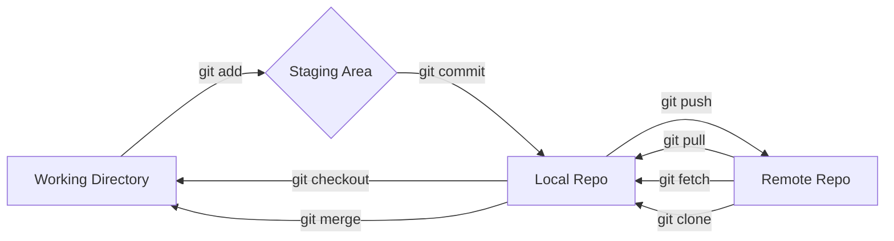
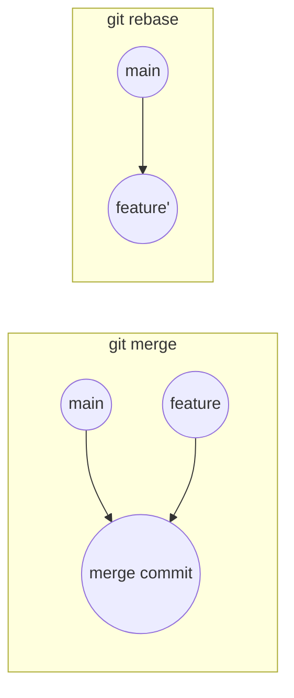

# Git



---

## Yapılandırma (Config)

- `--local` → Mevcut repo: `.git/config`
- `--global` → Kullanıcı: `~/.gitconfig`
- `--system` → Sistem: `/etc/gitconfig`

```bash
git config --global user.name  "Serkan"
git config --global user.email "serkanmazlum@gmail.com"
git config --global core.editor vim
git config --global core.excludesfile ~/.gitignore_global
git config --list
```

---

## Depo Oluşturma ve Klonlama

```bash
git init
git clone [URL]
git clone -b <branch> --recurse-submodules [URL]
```

---

## Durum ve .gitignore

```bash
git status           # Değişikliklerin durumu
git status -s        # Kısa format
git status --ignored # .gitignore'daki değişiklikler de görünür
```

| Sembol | Anlam |
|--------|-------|
| `??` | İzlenmeyen (untracked) dosya |
| `A` | Staging area'ya eklendi |
| `M` | Değiştirildi (modified) |
| `D` | Silindi (deleted) |

!!! note "Commit Sonrası .gitignore Eklemek"
    Önceden commit edilmiş bir dosyayı `.gitignore`'a eklemek onu takipten çıkarmaz. Önce: `git rm --cached <file>`

```bash title=".gitignore Örnekleri"
*.log
build/
.env
*.png
resimler/**
resimler/!deneme.png    # Bu dosya hariç
```

---

## Staging ve Commit

```bash
git add .                   # Tüm değişiklikleri ekle
git add path/to/file        # Belirli dosya
git commit -m "Mesaj"
git commit -am "Mesaj"      # git add + commit
git commit --amend          # Son commit'i düzenle
```

---

## Uzak Depolar (Remotes)

```bash
git remote -v
git remote add origin https://github.com/you/repo.git
git remote rm origin
git remote set-url origin git@github.com:you/repo.git
git remote rename oldname newname

git push origin main
git push --all
git push --force            # Dikkat!

git pull origin main        # fetch + merge
git fetch origin            # Sadece indir, birleştirme
```

!!! note "Pull = Fetch + Merge"
    `git pull` aslında `git fetch` + `git merge` kombinasyonudur.

---

## Branch Yönetimi

```bash
git branch                  # Branch listesi (* aktif)
git branch <isim>           # Yeni branch oluştur
git checkout -b feature-x   # Oluştur + geç
git checkout develop        # Branch değiştir
git switch develop          # Modern alternatif
git branch -d feature-x     # Güvenli sil (merge edilmediyse uyarır)
git branch -D feature-x     # Zorla sil
git branch -M main          # Ana branch'i yeniden adlandır
```

---

## Merge ve Rebase

```bash
git merge feature-x         # Mevcut branch'e birleştir
git rebase develop          # Temiz geçmiş için rebase
git rebase --abort          # Rebase iptal
git rebase --continue       # Çakışmayı çözdükten sonra devam
```



!!! warning "Rebase Uyarısı"
    Public/paylaşılan branch'lerde `rebase` kullanmayın. Geçmişi yeniden yazar, diğer geliştiriciler için sorun çıkarır.

---

## Stash — Değişiklikleri Geçici Sakla

```bash
git stash                   # Değişiklikleri sakla
git stash push -m "mesaj"   # Açıklama ile sakla
git stash list              # Stash listesi
git stash pop               # Son stash'i uygula ve sil
git stash apply stash@{2}   # Belirli stash'i uygula (silmez)
git stash drop stash@{0}    # Stash'i sil
git stash clear             # Tüm stash'leri sil
git stash branch yeni-dal   # Stash'ten yeni branch oluştur
```

---

## Cherry-pick — Tek Commit Taşı

```bash
git cherry-pick <commit-hash>        # Tek commit'i al
git cherry-pick A..B                 # A'dan B'ye aralık (A dahil değil)
git cherry-pick --no-commit <hash>   # Stage'e ekle ama commit etme
git cherry-pick --abort              # İptal
```

---

## Reset ve Revert

```bash
# Staging'i geri al, dosyaya dokunma
git reset HEAD <file>
git restore --staged <file>  # Modern yol

# Soft: commit'i geri al, değişiklikler staged'de kalsın
git reset --soft HEAD~1

# Mixed (default): commit + stage'i geri al, dosyalar değişmiş kalır
git reset HEAD~1

# Hard: commit + stage + çalışma dizinini sıfırla (KALICİ!)
git reset --hard HEAD~1

# Güvenli geri alma: yeni "geri alma commit'i" oluşturur
git revert <commit-hash>
```

!!! danger "git reset --hard"
    Kaydedilmemiş tüm değişiklikler kalıcı olarak silinir. Paylaşılan commit'lerde kullanmayın.

---

## Log ve İnceleme

```bash
git log
git log --oneline
git log --oneline --graph --all     # Tüm branch'ler görsel
git log -p                          # Diff ile
git log --stat                      # Dosya değişim özeti
git log --committer="serkan"
git log -- path/to/file             # Dosya geçmişi
git log --since="2 weeks ago"
git log --grep="feat:"              # Commit mesajı filtresi

git diff                            # Working dir vs index
git diff --cached                   # Index vs son commit
git show <commit>                   # Commit detayı
git blame <file>                    # Satır bazlı yazar bilgisi
```

---

## Bisect — Hatayı İkili Aramayla Bul

```bash
git bisect start
git bisect bad                      # Şu an hatalı
git bisect good v1.0                # Bu tag'de iyiydi
# Git otomatik commit'leri ikiye böler, test et:
git bisect good                     # Bu commit iyi
git bisect bad                      # Bu commit kötü
# En sonunda hatalı commit bulunur
git bisect reset                    # Bisect'ten çık
```

---

## Etiketleme (Tags)

```bash
git tag
git tag v1.0.0
git tag -a v1.0.0 -m "Sürüm 1.0.0"  # Açıklamalı tag
git show v1.0.0
git push origin --tags
git push origin v1.0.0
git push origin --delete v1.0.0
git push origin :refs/tags/v1.0.0   # Eski yol
```

---

## Alt Modüller (Submodules)

`.gitmodules` dosyasına alt modüller kaydedilir.

```bash
git submodule add [URL] path/to/sub
git submodule update --init --recursive
git submodule update --remote
git diff --cached --submodule
```

---

## Geçici Dosya İzleme Hariç Tutma

```bash
# Takip edilen dosyayı geçici olarak görmezden gel
git update-index --skip-worktree path/to/file

# Tekrar dahil et
git update-index --no-skip-worktree path/to/file
```

---

## Fork Edilmiş Repoyu Senkronize Etme

```bash
# 1. Upstream ekle
git remote add upstream https://github.com/orijinal/repo.git
git fetch upstream

# 2. Upstream branch'lerini yerelde oluştur
git branch -r \
  | grep -v '->' \
  | grep '^  upstream/' \
  | sed 's@  upstream/@@' \
  | xargs -n1 git branch --track

# 3. Origin'e gönder
git push origin --all

# 4. Branch commit sayısı
git rev-list --count release/1.14
```

---

## Geçmişten Büyük Dosyaları Temizleme

```bash
git filter-branch --force \
  --index-filter \
    'git rm --cached --ignore-unmatch -r *.png *.jpg *.pdf *.zip *.mp4' \
  --prune-empty \
  --tag-name-filter cat \
  -- --all
```

!!! warning "Uyarı"
    Bu işlem tüm commit geçmişini yeniden yazar. Paylaşılan repoda çok dikkatli kullanılmalıdır!

---

## Branching Stratejileri

=== "Git Flow"

    ```mermaid
    graph LR
        M[main] --> H[hotfix]
        M --> D[develop]
        D --> F1[feature/login]
        D --> F2[feature/api]
        D --> R[release/1.0]
        R --> M
        H --> M
        H --> D
    ```

    - `main`: Üretimdeki stabil kod
    - `develop`: Geliştirme entegrasyon branch'i
    - `feature/*`: Yeni özellikler
    - `release/*`: Sürüm hazırlığı
    - `hotfix/*`: Acil üretim düzeltmeleri

=== "GitHub Flow"

    ```mermaid
    graph LR
        M[main] --> F[feature branch]
        F -->|Pull Request + Review| M
    ```

    - Tek uzun ömürlü branch: `main`
    - Her özellik için branch aç, PR ile birleştir
    - Basit ve CI/CD odaklı

=== "Trunk Based"

    - Herkes doğrudan `main`/`trunk`'a pushlar
    - Çok kısa ömürlü feature branch'ler (1-2 gün)
    - Feature flags ile tamamlanmamış özellikler gizlenir
    - Sürekli entegrasyon zorunlu

| Strateji | Takım Büyüklüğü | Sürüm Sıklığı | Karmaşıklık |
|----------|:--------------:|:-------------:|:-----------:|
| Git Flow | Büyük | Periyodik | Yüksek |
| GitHub Flow | Küçük-Orta | Sürekli | Düşük |
| Trunk Based | Her boyut | Çok sık | Orta |

---

## Hızlı Başvuru

| Komut | Açıklama |
|-------|---------|
| `git stash` | Değişiklikleri geçici sakla |
| `git cherry-pick <hash>` | Tek commit taşı |
| `git revert <hash>` | Güvenli geri al |
| `git reset --soft HEAD~1` | Son commit'i geri al, değişiklikler korunsun |
| `git bisect` | Hatalı commit'i ikili aramayla bul |
| `git blame <file>` | Satır bazlı yazar/commit |
| `git reflog` | Tüm HEAD geçmişi (kurtarma için) |
