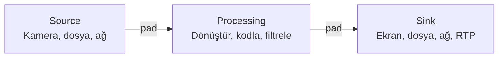

# GStreamer

## Genel Bakış

GStreamer, ses, video ve multimedya verilerinin işlenmesi, kodlanması ve akışı için açık kaynaklı bir çerçevedir. Pipeline (boru hattı) modeliyle çalışır: veri, birbiriyle bağlanmış **element** zincirinden geçer.



---

## Temel Kavramlar

| Kavram | Açıklama |
|--------|---------|
| **Pipeline** | Element zinciri; veri kaynaktan sink'e akar |
| **Element** | Tek bir iş yapan bileşen (kaynak, codec, dönüştürücü, sink) |
| **Pad** | Elementler arası veri bağlantı noktası |
| **Source Pad** | Elementten dışarı veri gönderir |
| **Sink Pad** | Elemente veri alır |
| **Caps** | Capabilities — pad'lerin kabul ettiği format (video/x-raw, format=BGR, width=1280, ...) |
| **Bus** | Pipeline'dan uygulama katmanına mesaj iletir (hata, EOS, durum) |
| **Bin** | Birden fazla elementi saran konteyner |

---

## gst-launch Komutları

### Temel Test

```bash
# Test kaynağıyla ekrana görüntü
gst-launch-1.0 videotestsrc ! videoconvert ! autovideosink

# Ses test tonu
gst-launch-1.0 audiotestsrc ! autoaudiosink

# Ayrıntılı çıktı
gst-launch-1.0 -v videotestsrc ! videoconvert ! autovideosink

# Belirli süre çalıştır (5 saniye)
timeout 5 gst-launch-1.0 videotestsrc ! videoconvert ! autovideosink
```

### USB / V4L2 Kamera

```bash
# Kamera görüntüsünü ekrana göster
gst-launch-1.0 v4l2src device=/dev/video0 \
    ! video/x-raw,width=1280,height=720,framerate=30/1 \
    ! videoconvert \
    ! autovideosink

# Kamera → Dosyaya kaydet (MP4)
gst-launch-1.0 v4l2src device=/dev/video0 \
    ! video/x-raw,width=1280,height=720,framerate=30/1 \
    ! videoconvert \
    ! x264enc tune=zerolatency \
    ! mp4mux \
    ! filesink location=output.mp4

# Kamera → MJPEG donanım çıkışı → JPG sıkıştırma (USB cam için)
gst-launch-1.0 v4l2src device=/dev/video0 \
    ! image/jpeg,width=1280,height=720 \
    ! jpegdec \
    ! videoconvert \
    ! autovideosink
```

### Jetson / MIPI CSI Kamera (nvarguscamerasrc)

```bash
# Jetson'da CSI kamera görüntüsü
gst-launch-1.0 nvarguscamerasrc sensor-id=0 \
    ! 'video/x-raw(memory:NVMM),width=1920,height=1080,framerate=30/1' \
    ! nvvidconv \
    ! video/x-raw,format=BGRx \
    ! videoconvert \
    ! video/x-raw,format=BGR \
    ! autovideosink

# Jetson'da CSI kamera → Dosya kayıt (H265 donanım codec)
gst-launch-1.0 nvarguscamerasrc sensor-id=0 \
    ! 'video/x-raw(memory:NVMM),width=1920,height=1080,framerate=30/1' \
    ! nvv4l2h265enc bitrate=8000000 \
    ! h265parse \
    ! matroskamux \
    ! filesink location=jetson_output.mkv

# Jetson kamera servisi yeniden başlat (kamera kilitlenirse)
sudo service nvargus-daemon restart
```

### RTSP Yayını (Gönder ve Al)

```bash
# RTSP yayını AL (ağdan görüntü çek)
gst-launch-1.0 rtspsrc location=rtsp://192.168.1.100:8554/stream \
    ! rtph264depay \
    ! h264parse \
    ! avdec_h264 \
    ! videoconvert \
    ! autovideosink sync=false

# RTSP yayını düşük gecikme ile al
gst-launch-1.0 rtspsrc location=rtsp://192.168.1.100:8554/stream \
    latency=0 buffer-mode=auto \
    ! decodebin \
    ! videoconvert \
    ! autovideosink sync=false

# UDP'den RTP video al
gst-launch-1.0 udpsrc port=5000 \
    ! application/x-rtp,encoding-name=H264,payload=96 \
    ! rtph264depay \
    ! h264parse \
    ! avdec_h264 \
    ! videoconvert \
    ! autovideosink

# Kamera → UDP RTP gönder
gst-launch-1.0 v4l2src device=/dev/video0 \
    ! video/x-raw,width=640,height=480,framerate=30/1 \
    ! videoconvert \
    ! x264enc tune=zerolatency bitrate=2000 speed-preset=ultrafast \
    ! rtph264pay \
    ! udpsink host=192.168.1.50 port=5000
```

### Dosya İşlemleri

```bash
# Video dosyasını oynat
gst-launch-1.0 filesrc location=video.mp4 \
    ! qtdemux \
    ! h264parse \
    ! avdec_h264 \
    ! videoconvert \
    ! autovideosink

# Kolayca oynat (otomatik format tespiti)
gst-launch-1.0 playbin uri=file:///path/to/video.mp4

# Video dönüştür: MP4 → MKV
gst-launch-1.0 filesrc location=input.mp4 \
    ! qtdemux name=demux \
    demux.video_0 ! queue ! h264parse ! matroskamux name=mux \
    mux. ! filesink location=output.mkv

# Çözünürlük değiştir
gst-launch-1.0 filesrc location=input.mp4 \
    ! decodebin \
    ! videoscale \
    ! video/x-raw,width=1280,height=720 \
    ! x264enc \
    ! mp4mux \
    ! filesink location=resized.mp4
```

---

## Python ile GStreamer (gi/PyGObject)

```python title="Kamera Görüntüsü Yakalama"
import gi
gi.require_version('Gst', '1.0')
from gi.repository import Gst, GLib
import numpy as np
import cv2

Gst.init(None)

pipeline_str = (
    "v4l2src device=/dev/video0 "
    "! video/x-raw,width=1280,height=720,framerate=30/1 "
    "! videoconvert "
    "! video/x-raw,format=BGR "
    "! appsink name=sink emit-signals=true max-buffers=1 drop=true"
)

pipeline = Gst.parse_launch(pipeline_str)
sink = pipeline.get_by_name("sink")

def on_new_sample(sink):
    sample = sink.emit("pull-sample")
    if sample:
        buf = sample.get_buffer()
        caps = sample.get_caps()
        w = caps.get_structure(0).get_value("width")
        h = caps.get_structure(0).get_value("height")
        ok, mapinfo = buf.map(Gst.MapFlags.READ)
        if ok:
            frame = np.frombuffer(mapinfo.data, dtype=np.uint8).reshape(h, w, 3)
            cv2.imshow("Frame", frame)
            cv2.waitKey(1)
            buf.unmap(mapinfo)
    return Gst.FlowReturn.OK

sink.connect("new-sample", on_new_sample)
pipeline.set_state(Gst.State.PLAYING)

try:
    loop = GLib.MainLoop()
    loop.run()
except KeyboardInterrupt:
    pass
finally:
    pipeline.set_state(Gst.State.NULL)
    cv2.destroyAllWindows()
```

```python title="OpenCV VideoCapture ile GStreamer Backend"
import cv2

# GStreamer pipeline'ı OpenCV'ye ver
pipeline = (
    "v4l2src device=/dev/video0 "
    "! video/x-raw,width=1280,height=720,framerate=30/1 "
    "! videoconvert "
    "! video/x-raw,format=BGR "
    "! appsink"
)

cap = cv2.VideoCapture(pipeline, cv2.CAP_GSTREAMER)

if not cap.isOpened():
    raise RuntimeError("Pipeline açılamadı")

while True:
    ret, frame = cap.read()
    if not ret:
        break
    cv2.imshow("Camera", frame)
    if cv2.waitKey(1) & 0xFF == ord('q'):
        break

cap.release()
cv2.destroyAllWindows()
```

```python title="Jetson CSI Kamera — OpenCV GStreamer"
def jetson_pipeline(sensor_id=0, width=1920, height=1080, fps=30):
    return (
        f"nvarguscamerasrc sensor-id={sensor_id} "
        f"! video/x-raw(memory:NVMM),width={width},height={height},"
        f"format=NV12,framerate={fps}/1 "
        "! nvvidconv flip-method=0 "
        f"! video/x-raw,width={width},height={height},format=BGRx "
        "! videoconvert "
        "! video/x-raw,format=BGR "
        "! appsink"
    )

cap = cv2.VideoCapture(jetson_pipeline(), cv2.CAP_GSTREAMER)
```

---

## ROS 2 ile GStreamer

```bash
# ros2 için gstreamer bridge paketi
sudo apt install ros-humble-gstreamer-image-transport

# RTSP stream → ROS 2 topic
ros2 run gstreamer_image_transport gstreamer_image_transport_node \
    --ros-args \
    -p pipeline:="rtspsrc location=rtsp://cam/stream ! decodebin ! videoconvert ! appsink"
```

---

## Hata Ayıklama

```bash
# Debug seviyesi (0: kapalı, 5: maksimum)
export GST_DEBUG=3
export GST_DEBUG=rtspsrc:5,rtph264depay:4    # Element bazlı seviye

# Element bilgisi
gst-inspect-1.0 v4l2src                # Element özellikleri ve pad'ler
gst-inspect-1.0 --plugins              # Tüm yüklü plugin'ler
gst-inspect-1.0 --list-all             # Tüm elementler

# Medya dosyası analiz
gst-discoverer-1.0 video.mp4
gst-discoverer-1.0 rtsp://192.168.1.100:8554/stream

# V4L2 cihaz listesi
v4l2-ctl --list-devices
v4l2-ctl -d /dev/video0 --all
v4l2-ctl -d /dev/video0 --list-formats-ext  # Desteklenen formatlar

# GUI uzak erişimde
export DISPLAY=:0
```

!!! tip "Pipeline Hata Ayıklama Tüyosu"
    Pipeline çalışmıyorsa adım adım daralt: önce `videotestsrc ! autovideosink` çalıştığını doğrula, sonra birer birer element ekle. `GST_DEBUG=3` ile element aralarında caps uyumsuzluklarını gör.

!!! warning "sync=false"
    Ağdan gelen akışlarda (`rtspsrc`, `udpsrc`) `autovideosink sync=false` eklemezseniz buffer dolup video donabilir. Gerçek zamanlı izleme için zorunlu.

---

## Codec ve Format Referansı

| Codec | Encoder | Decoder | Kullanım |
|-------|:-------:|:-------:|---------|
| H.264 | `x264enc` / `nvv4l2h264enc` | `avdec_h264` | Genel amaç, RTSP |
| H.265 | `x265enc` / `nvv4l2h265enc` | `avdec_h265` | Yüksek sıkıştırma |
| MJPEG | `jpegenc` | `jpegdec` | USB kamera donanım çıkışı |
| VP8 | `vp8enc` | `vp8dec` | WebRTC |
| AV1 | `av1enc` | `av1dec` | Modern, açık kaynak |

| Format | Açıklama | Kullanım |
|--------|---------|---------|
| `BGR` | OpenCV varsayılanı | cv2.imread çıkışı |
| `RGB` | Standart | PIL, TF |
| `NV12` | YUV 4:2:0 planar | Donanım codec girişi |
| `I420` | YUV planar | FFmpeg, encode |
| `BGRA` | Alpha kanallı BGR | GUI uygulamaları |

---

## Hızlı Başvuru

| Görev | Pipeline Özeti |
|-------|---------------|
| USB Kamera → Ekran | `v4l2src ! videoconvert ! autovideosink` |
| Kamera → Dosya (H264) | `v4l2src ! videoconvert ! x264enc ! mp4mux ! filesink` |
| Kamera → UDP RTP | `v4l2src ! x264enc ! rtph264pay ! udpsink` |
| UDP RTP → Ekran | `udpsrc ! rtph264depay ! avdec_h264 ! autovideosink` |
| RTSP → Ekran | `rtspsrc ! decodebin ! videoconvert ! autovideosink sync=false` |
| Dosya Oynat | `playbin uri=file:///path/to/file` |
| Jetson CSI → BGR | `nvarguscamerasrc ! nvvidconv ! videoconvert ! appsink` |
| Kamera → OpenCV | Pipeline sonuna `appsink` ekle, `CAP_GSTREAMER` ile aç |
