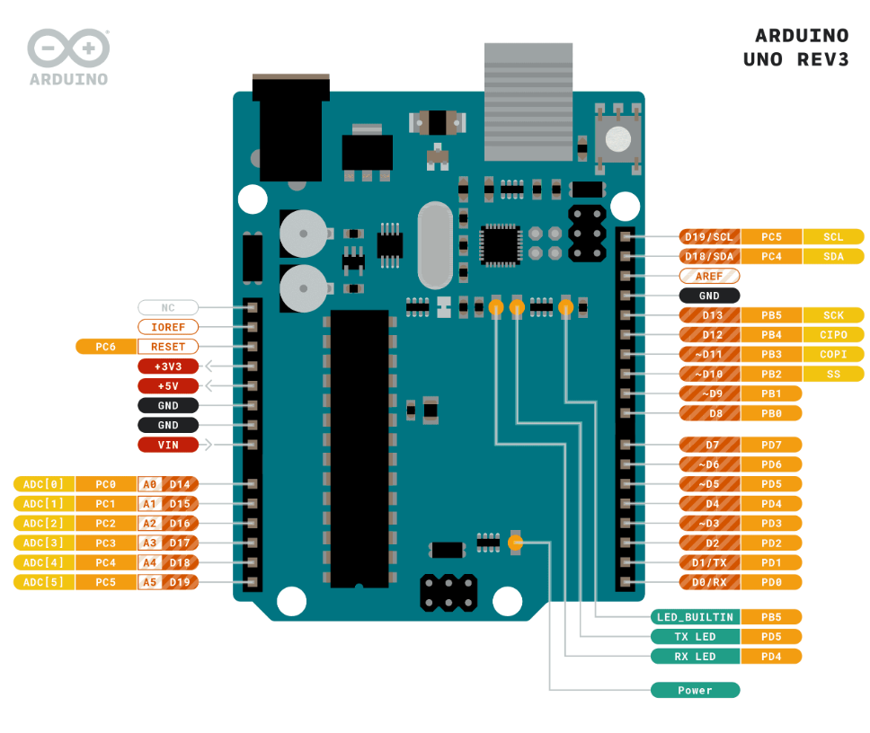
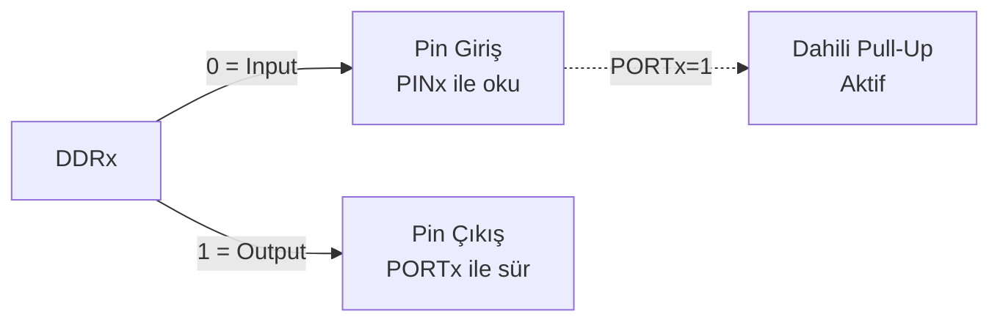
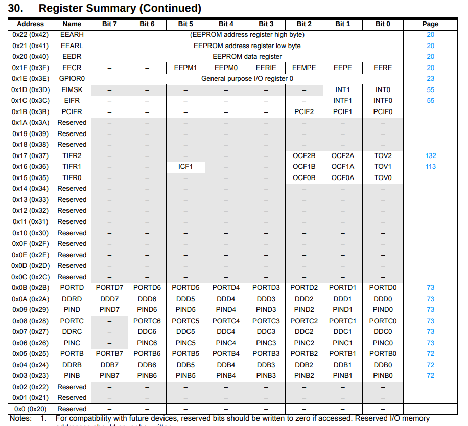
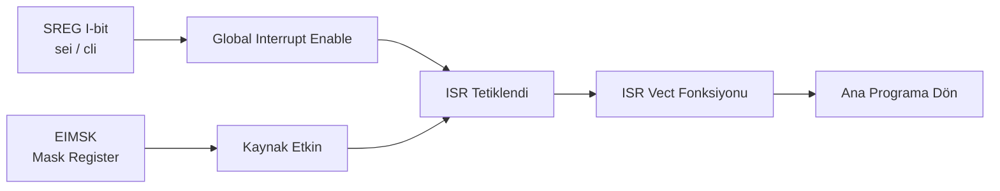

# AVR Mikrodenetleyici

!!! note "Genel Bakış"
    AVR, Microchip (eski Atmel) tarafından üretilen 8-bit RISC mikrodenetleyici ailesidir. Harvard mimarisi, tek döngülü komut yürütme ve zengin I/O yapısıyla gömülü sistemlerde öğrenme ve üretim amacıyla yaygın kullanılır. Tipik temsilciler: ATmega328P (Arduino Uno), ATmega2560 (Arduino Mega), ATtiny85.



---

## GPIO Kontrolü

AVR'de her port üç register ile kontrol edilir:

| Register | İşlevi |
|----------|--------|
| `DDRx` | Data Direction Register — 0: Giriş, 1: Çıkış |
| `PORTx` | Output Register — çıkış seviyesi veya pull-up kontrolü |
| `PINx` | Input Register — pinin anlık dijital seviyesini okur |



```c
/* Temel kalıplar */
DDRD |=  (1 << 5);    /* PD5 → Çıkış */
DDRD &= ~(1 << 3);    /* PD3 → Giriş */

PORTD |=  (1 << 5);   /* PD5 = HIGH (5V) */
PORTD &= ~(1 << 5);   /* PD5 = LOW  (0V) */
PORTD ^=  (1 << 5);   /* PD5 = Toggle */

/* Giriş okuma */
uint8_t durum = (PIND >> 3) & 1;  /* PD3 bit oku */
```

!!! tip "Pull-Up Aktifleştirme"
    ```c
    DDRD  &= ~(1 << 3);  /* PD3 giriş */
    PORTD |=  (1 << 3);  /* PD3 pull-up açık */
    /* Tüm pull-up'ları devre dışı bırak: */
    MCUCR |= (1 << PUD);
    ```

!!! note "uint8_t Kullanımı"
    AVR 8-bit mimarisinde `int` yerine `uint8_t`, `uint16_t` gibi sabit genişlikli tipler kullanılmalıdır. `int`, host derleyiciye göre 16 veya 32 bit olabilir; bu gömülü sistemlerde beklenmedik davranışa yol açar.

---

## Register Adresleri

AVR portları, belleğe eşlenmiş (memory-mapped) I/O register'larıdır. `DDRD` adresi `0x2A`'dır:

```c
#define myDDRD *((volatile uint8_t*)0x2A)
myDDRD = 0xFF;  /* Tüm PORTD pinleri çıkış */
```



---

## Örnek: LED Sürme

```c title="LED Chase (PORTD)" linenums="1"
#include <avr/io.h>
#include <util/delay.h>

int main(void) {
    DDRD = 0xFF;   /* Tüm PORTD çıkış */

    while (1) {
        /* Sırayla yak */
        for (uint8_t i = 0; i < 8; i++) {
            PORTD = (1 << i);
            _delay_ms(100);
        }

        /* Sırayla söndür */
        for (uint8_t i = 0; i < 8; i++) {
            PORTD &= ~(1 << i);
            _delay_ms(100);
        }
    }
    return 0;
}
```

### Buton Debounce

```c
/* Yazılımsal debouncing — titreşim giderme */
if (!(PINB & (1 << PB0))) {    /* Aktif-LOW buton basıldı mı? */
    _delay_ms(50);              /* Titreşim bekle */
    if (!(PINB & (1 << PB0))) { /* Hala basılı mı? */
        /* Geçerli basış işle */
    }
}
```

!!! note "Aktif-HIGH vs Aktif-LOW"
    Pull-up direnci ile bağlı butona **basılmadığında** pin HIGH, basıldığında LOW'dur (aktif-LOW). Bu nedenle okuma `!(PINB & (1 << PB0))` şeklinde ters mantıkla yapılır.

---

## ISR — Interrupt Service Routine



### Dış Kesme (INT0 / INT1)

```c title="Dış Kesme INT0" linenums="1"
#include <avr/io.h>
#include <avr/interrupt.h>

int main(void) {
    EIMSK |= (1 << INT0);          /* INT0 maskesini aç */
    EICRA |= (1 << ISC01);         /* ISC01=1, ISC00=0 → Düşen kenar */
    sei();                          /* Global interrupt aç */
    while (1) { /* Ana döngü */ }
}

ISR(INT0_vect) {
    /* INT0 kesmesi gerçekleşince çalışır */
    PORTB ^= (1 << PB5);           /* LED toggle */
}
```

| Register | İşlevi |
|----------|--------|
| `SREG (I-bit)` | Global interrupt enable; `sei()` / `cli()` |
| `EIMSK` | External Interrupt Mask (INT0, INT1 etkinleştir) |
| `EICRA` | INT0/INT1 tetikleme kenarı (yükselen/düşen/değişim) |
| `EIFR` | External Interrupt Flag (bayrağı temizle) |
| `MCUCR` | MCU Control (PUD — pull-up disable) |

| EICRA Değeri | INT0 Tetiklenme |
|:------------:|:---------------:|
| ISC01=0, ISC00=0 | Düşük seviye |
| ISC01=0, ISC00=1 | Herhangi değişim |
| ISC01=1, ISC00=0 | Düşen kenar |
| ISC01=1, ISC00=1 | Yükselen kenar |

### Pin Change Interrupt (PCINT)

Herhangi bir pine bağlı değişimi yakalamak için; INT0/INT1'den farklı olarak kenar seçimi yoktur — her değişimde tetiklenir.

```c
PCICR  |= (1 << PCIE0);   /* PCINT[7:0] → Port B izle */
PCMSK0 |= (1 << PCINT0);  /* PB0'ı izle */
sei();

ISR(PCINT0_vect) {
    /* PB0 değişti — hangi kenar olduğunu IDR ile tespit et */
}
```

---

## Timer / Counter

### Timer Tipleri

| Timer | Bit | Maksimum | Özellikler |
|-------|:---:|:--------:|-----------|
| Timer0 | 8-bit | 255 | PWM, millis(), delay() için kullanılır |
| Timer1 | 16-bit | 65535 | Yüksek çözünürlüklü zamanlama, servo |
| Timer2 | 8-bit | 255 | Asenkron (32.768 kHz) RTC için |

### Çalışma Modları

| Mod | WGM Bitleri | Açıklama |
|-----|:-----------:|---------|
| Normal | 0 | 0 → MAX → 0 sayar; TOP = 0xFF/0xFFFF |
| CTC | 2 | OCR değerinde sıfırlanır (frekans üretimi) |
| Fast PWM | 3 | Hızlı tek-eğim PWM |
| Phase Correct PWM | 1 | Çift-eğim; daha düzgün PWM |

### CTC Modu — Frekans Hesabı

```
F_OUT = F_CPU / (2 × Prescaler × (OCRnA + 1))

Örnek: F_CPU=16MHz, Prescaler=64, 10 ms kesme:
OCRnA = (16_000_000 / (64 × 1000)) - 1 = 249
```

```c title="Timer1 CTC — 1 ms Kesme" linenums="1"
#include <avr/io.h>
#include <avr/interrupt.h>

volatile uint32_t ms_ticks = 0;

void timer1_init(void) {
    TCCR1B |= (1 << WGM12);              /* CTC modu */
    OCR1A   = (16000000UL / 64 / 1000) - 1;  /* 1 ms = 249 */
    TCCR1B |= (1 << CS11) | (1 << CS10); /* Prescaler = 64 */
    TIMSK1 |= (1 << OCIE1A);             /* Compare A kesmesi */
    sei();
}

ISR(TIMER1_COMPA_vect) {
    ms_ticks++;
}

int main(void) {
    timer1_init();
    while (1) {
        if (ms_ticks >= 500) {
            ms_ticks = 0;
            PORTB ^= (1 << PB5);  /* 500 ms'de bir LED toggle */
        }
    }
}
```

### Prescaler Seçimi

| CS12 | CS11 | CS10 | Prescaler | Timer0/1 |
|:----:|:----:|:----:|:---------:|:--------:|
| 0 | 0 | 1 | 1 | Clock/1 |
| 0 | 1 | 0 | 8 | Clock/8 |
| 0 | 1 | 1 | 64 | Clock/64 |
| 1 | 0 | 0 | 256 | Clock/256 |
| 1 | 0 | 1 | 1024 | Clock/1024 |

### PWM

```c
/* Timer0 Fast PWM — PD6 (OC0A) */
DDRD  |= (1 << PD6);           /* OC0A pini çıkış */
TCCR0A = (1 << COM0A1)         /* Non-inverting */
       | (1 << WGM01) | (1 << WGM00); /* Fast PWM */
TCCR0B = (1 << CS01);          /* Prescaler = 8 */
OCR0A  = 128;                  /* %50 duty cycle (0–255) */
```

!!! tip "PWM Çözünürlüğü"
    8-bit Timer: 256 adım → %0.39 duty cycle çözünürlüğü.
    16-bit Timer1: 65536 adım → çok daha hassas servo kontrol.

---

## ADC (Analog-Digital Converter)

```c
void adc_init(void) {
    ADMUX  = (1 << REFS0);       /* AVcc referans, ADC0 seçili */
    ADCSRA = (1 << ADEN)         /* ADC enable */
           | (1 << ADPS2) | (1 << ADPS1) | (1 << ADPS0); /* /128 prescaler */
}

uint16_t adc_read(uint8_t kanal) {
    ADMUX = (ADMUX & 0xF0) | (kanal & 0x0F);  /* Kanal seç */
    ADCSRA |= (1 << ADSC);                     /* Dönüşüm başlat */
    while (ADCSRA & (1 << ADSC));              /* Tamamlanmasını bekle */
    return ADC;                                 /* 10-bit sonuç */
}

int main(void) {
    adc_init();
    uint16_t deger = adc_read(0);   /* ADC0 (PC0) — 0..1023 */
    /* Gerilim = deger * (5.0 / 1024) */
}
```

---

## USART (Serial Communication)

```c
#define BAUD 9600
#define UBRR_VAL ((F_CPU / (16UL * BAUD)) - 1)

void usart_init(void) {
    UBRR0H = (UBRR_VAL >> 8);
    UBRR0L =  UBRR_VAL;
    UCSR0B = (1 << TXEN0) | (1 << RXEN0);   /* TX + RX aktif */
    UCSR0C = (1 << UCSZ01) | (1 << UCSZ00); /* 8-bit, 1 stop, no parity */
}

void usart_send(uint8_t veri) {
    while (!(UCSR0A & (1 << UDRE0)));  /* Buffer boşalana dek bekle */
    UDR0 = veri;
}

uint8_t usart_recv(void) {
    while (!(UCSR0A & (1 << RXC0)));   /* Veri gelene dek bekle */
    return UDR0;
}

/* printf yönlendirme */
int uart_putchar(char c, FILE *stream) {
    usart_send((uint8_t)c);
    return 0;
}
FILE uart_stdout = FDEV_SETUP_STREAM(uart_putchar, NULL, _FDEV_SETUP_WRITE);

int main(void) {
    usart_init();
    stdout = &uart_stdout;
    printf("Merhaba AVR!\r\n");
}
```

---

## Güç Yönetimi

| Uyku Modu | CPU | I/O Clk | Timer | ADC | Uyandıran |
|-----------|:---:|:--------:|:-----:|:---:|---------|
| Idle | ✗ | ✓ | ✓ | ✓ | Her kesme |
| ADC Noise Reduction | ✗ | ✗ | ✗ | ✓ | ADC tamamlama |
| Power-Save | ✗ | ✗ | Timer2 | ✗ | Async Timer2, TWINT |
| Power-Down | ✗ | ✗ | ✗ | ✗ | Sadece INT, Watchdog, TWI addr |

```c
#include <avr/sleep.h>

set_sleep_mode(SLEEP_MODE_IDLE);
sleep_enable();
sleep_cpu();          /* Uyku */
sleep_disable();      /* Kesme sonrası uyandı */
```