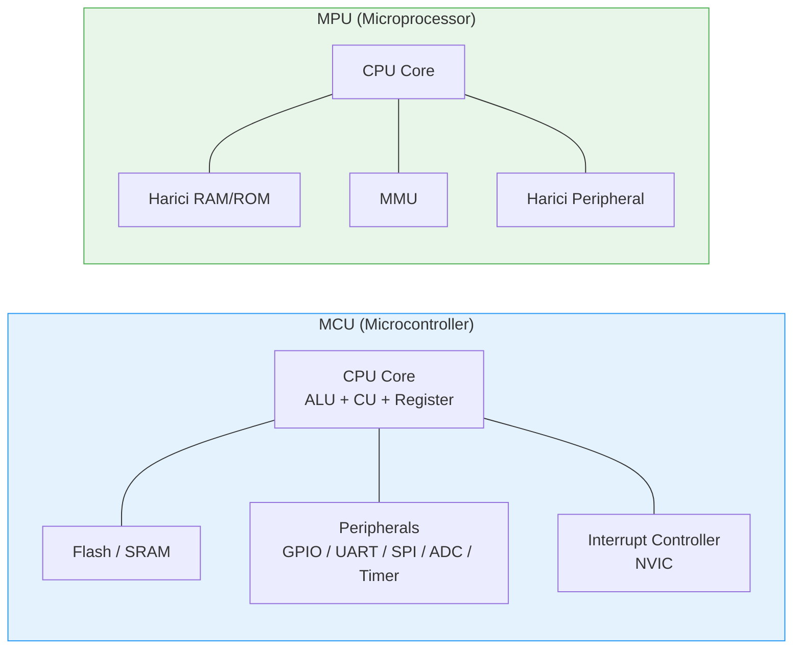
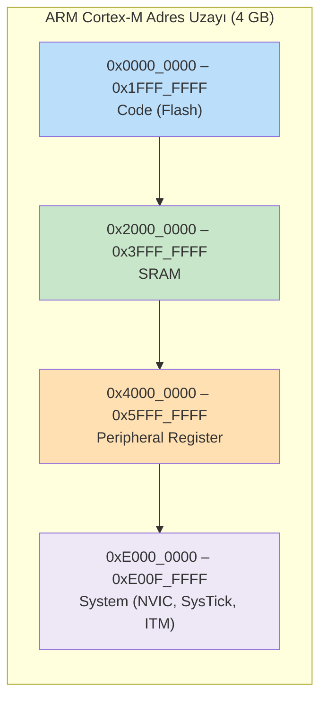
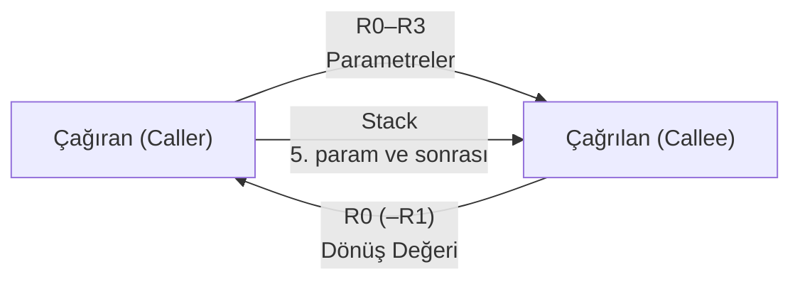
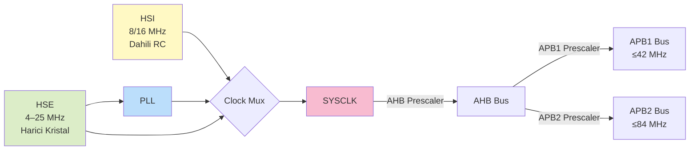
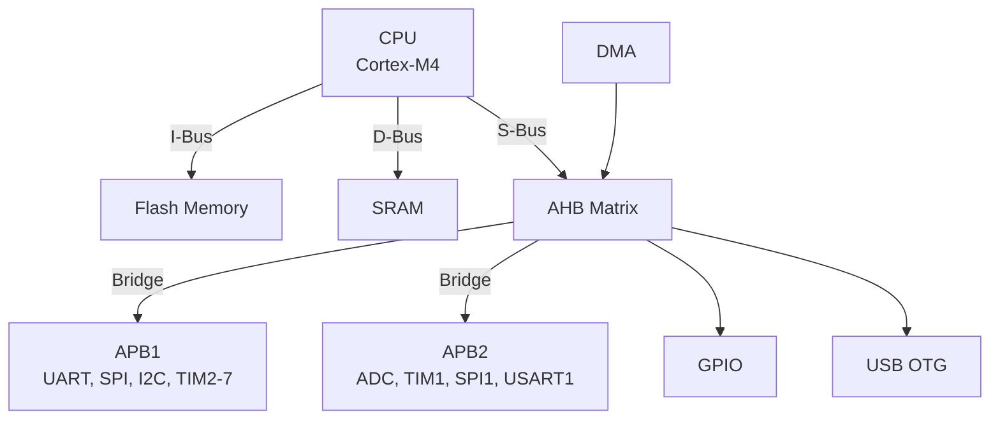
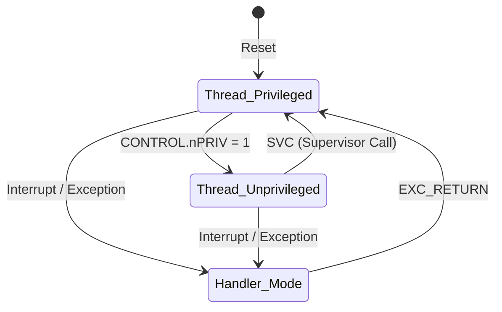
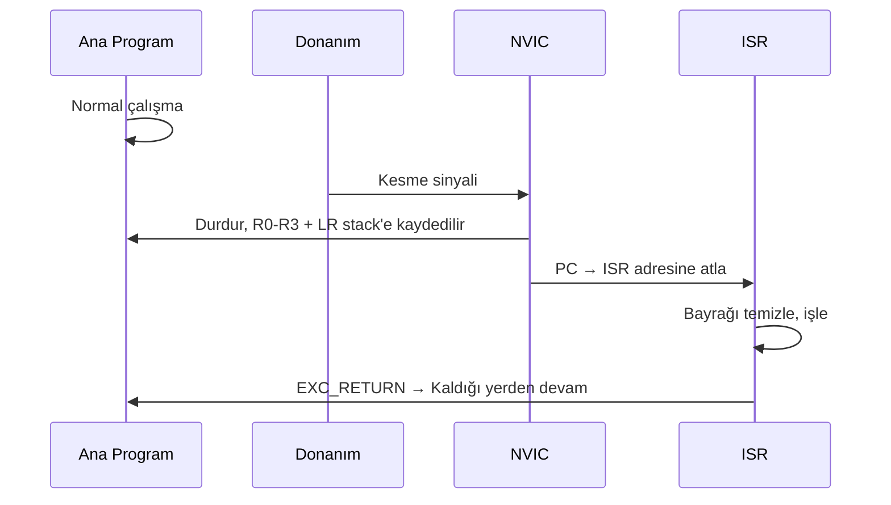
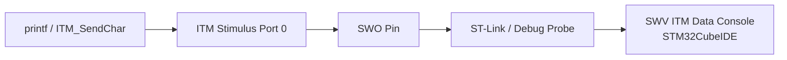
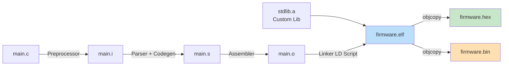

# Gömülü Sistem Kavramları

!!! note "Genel Bakış"
    Gömülü sistemler, belirli bir donanıma ve göreve özel, genellikle gerçek zamanlı kısıtlarla çalışan bilgisayar sistemleridir. Bu bölüm, ARM Cortex-M tabanlı mikrodenetleyicilerde bilinmesi gereken temel mimari ve donanım kavramlarını kapsar.


---

## CPU — MPU — MCU



| Özellik | CPU | MPU | MCU |
|---------|:---:|:---:|:---:|
| İşlemci | ✓ | ✓ | ✓ |
| Dahili Bellek | ✗ | ✗ | ✓ (Flash + SRAM) |
| Dahili Peripheral | ✗ | ✗ | ✓ |
| MMU | ✗ | ✓ | ✗ (genellikle MPU) |
| İşletim Sistemi | ✗ | Linux vb. | Bare-metal / RTOS |
| Kullanım Alanı | Hesaplama | PC, SBC | IoT, gömülü, otomotiv |

!!! note "CPU vs MCU"
    - **MCU:** Tek çipte CPU + Flash + SRAM + peripheral. Düşük maliyet, düşük güç. STM32, AVR, PIC.
    - **MPU:** Sadece işlemci çekirdeği; bellek ve periferaller harici. Raspberry Pi (BCM2837), i.MX8.

---

## Terimler

| Terim | Açıklama |
|-------|---------|
| **ALU** | Aritmetik (toplama, çıkarma) ve mantıksal (AND, OR, XOR) işlemler |
| **CU (Control Unit)** | Komutları sırayla okur, çözümler, kontrol sinyalleri üretir |
| **Register** | CPU içindeki çok hızlı, küçük kapasiteli geçici depolama |
| **Peripheral** | CPU çekirdeği dışında donanımsal iş yapan modüller (GPIO, UART, ADC…) |
| **FPU** | Kayan nokta işlemlerini yazılım yerine donanımda yapar |
| **T Bit** | İşlemcinin hangi komut setini çalıştırdığını belirler (ARM/Thumb) |
| **PLL** | Düşük frekanslı giriş sinyalini çarparak yüksek frekans üretir |
| **Callee-saved** | Fonksiyon kullanılan register'ları işi bitince eski haline getirir (R4–R11) |

!!! danger "T Bit — HardFault Sebebi"
    Cortex-M mimarisinde T Bit **her zaman 1** olmalıdır (Thumb modu). Yanlış adresleme veya hatalı fonksiyon işaretçisi T Bit'i 0'a düşürür → `HardFault`. LSB = 1 → Thumb, LSB = 0 → ARM (Cortex-M'de desteklenmez).

---

## Bellek Mimarisi



### Stack Belleği

| Pointer | Kullanım Alanı | Mod |
|---------|---------------|-----|
| **MSP** (Main Stack Pointer) | Kesme (ISR) ve sistem başlatma | Privileged |
| **PSP** (Process Stack Pointer) | RTOS thread'leri; her task kendi PSP'sine sahip | Thread (user) |

```c
/* PSP kullanımı (CMSIS) */
__set_PSP(0x20002000);
__set_CONTROL(__get_CONTROL() | 2);  /* SPSEL = 1 → PSP seç */
```

### Heap Belleği

!!! warning "Gömülü Sistemlerde Heap Kullanımı"
    `malloc`/`free` çağrıları deterministik değildir ve bellek parçalanmasına (fragmentation) yol açabilir. Kritik güvenlik sistemlerinde ve sıkı gerçek zamanlı uygulamalarda heap kullanımından kaçınılır; statik tampon ve memory pool tercih edilir.

---

## AAPCS (ARM Procedure Call Standard)



| Register Grubu | Roller | Kim Korur? |
|----------------|--------|-----------|
| R0 – R3 | Parametre + dönüş değeri | Caller-saved (caller korumalı) |
| R4 – R11 | Genel amaçlı uzun ömürlü | Callee-saved (callee korumalı) |
| R12 (IP) | Geçici / derleyici ara değeri | Caller-saved |
| SP (R13) | Stack pointer | Otomatik |
| LR (R14) | Geri dönüş adresi | Caller-saved |
| PC (R15) | Program counter | Otomatik |

---

## NVIC (Nested Vectored Interrupt Controller)

ARM Cortex-M kesme yönetim donanımıdır.

| Özellik | Açıklama |
|---------|---------|
| **Vectored** | Her kesme için vektör tablosunda önceden tanımlı ISR adresi |
| **Nested** | Yüksek öncelikli kesme, düşük öncelikli ISR'ı kesebilir |
| **Öncelik** | 0 (en yüksek) → 255 (en düşük); sayı küçüldükçe öncelik artar |
| **Enable/Disable** | `NVIC_EnableIRQ(IRQn)` / `NVIC_DisableIRQ(IRQn)` |

!!! note "Sabit Öncelikli İstisnalar"
    Reset (-3), NMI (-2), HardFault (-1) sabittir ve değiştirilemez; diğer kesmelerin önceliği yazılımla ayarlanabilir.

---

## RCC — HSI — HSE — PLL



| Kaynak | Tip | Doğruluk | Kullanım |
|--------|-----|:--------:|---------|
| **HSI** | Dahili RC | ±1 % | Hızlı başlatma, genel amaçlı |
| **HSE** | Harici kristal | < 100 ppm | USB, CAN, hassas UART |
| **LSI** | Dahili RC, 32 kHz | Düşük | IWDG, RTC (düşük hassasiyet) |
| **LSE** | Harici 32.768 kHz | Çok yüksek | RTC (yüksek hassasiyet) |
| **PLL** | HSI/HSE tabanlı çarpan | HSE kadar | Yüksek sistem frekansı |

---

## AHB — APB Bus Mimarisi



| Özellik | AHB | APB |
|---------|:---:|:---:|
| Hız | Yüksek (burst, pipeline) | Düşük (basit, pipelinesız) |
| Gecikme | Düşük | Yüksek |
| Karmaşıklık | Yüksek | Düşük |
| Güç | Yüksek | Düşük |
| Tipik bağlılar | CPU, DMA, GPIO, USB | UART, SPI, I2C, Timer |

---

## Bit-Banding

Belirli bir bellek bölgesindeki her bit için ayrı alias adresi üretir; RMW (Read-Modify-Write) döngüsünü atomik tek yazıya indirir.

| Bölge | Gerçek Adres | Alias Başlangıcı |
|-------|:------------:|:---------------:|
| SRAM | 0x2000_0000 – 0x200F_FFFF | 0x2200_0000 |
| Peripheral | 0x4000_0000 – 0x400F_FFFF | 0x4200_0000 |

```c
/* Alias adresi hesabı */
#define BB_ADDR(base, byte_off, bit) \
    ((base##_BB) + (byte_off)*32 + (bit)*4)

/* GPIOA ODR bit 5 = Alias adresi üzerinden atomic set */
*(volatile uint32_t*)BB_ADDR(PERIPH, 0x40020014 - 0x40000000, 5) = 1;
```

!!! note "Cortex-M7 ve Sonrası"
    Bit-Banding Cortex-M0/M0+/M3/M4/M4F'te desteklenir. Cortex-M7 ve M23/M33'te kaldırılmıştır; yerini atomik `LDREX/STREX` ve C11 `_Atomic` almaktadır.

---

## Erişim Seviyeleri ve Modlar



| Mod | Erişim | Açıklama |
|-----|:------:|---------|
| **Handler Mode** | Privileged (zorunlu) | ISR ve exception handler'lar |
| **Thread — Privileged** | Tam erişim | Kernel kodu, RTOS kodu |
| **Thread — Unprivileged** | Kısıtlı | Kullanıcı uygulama kodu (MPU korumalı) |

---

## ISR (Interrupt Service Routine)



!!! danger "ISR Tasarım Kuralları"
    - ISR mümkün olduğunca **kısa** tutulmalı; ağır işler ana döngüye veya RTOS task'ına bırakılmalı.
    - ISR içinde `while()` veya bloklu bekleme **kesinlikle yasak**.
    - Kesme bayrağı temizlenmezse ISR sürekli tetiklenir (interrupt storm).
    - ISR ile paylaşılan veriler `volatile` ile işaretlenmelidir.

---

## SVC (Supervisor Call) ve Debug Arayüzleri

### SVC

Kullanıcı kodundan kernel/RTOS servislerine güvenli geçiş yöntemi:

```c
__ASM("svc 5");   /* SVC #5 ile kernel çağrısı */
```

### SWD vs JTAG

| Özellik | JTAG | SWD |
|---------|:----:|:---:|
| Pin sayısı | 4–5 | 2 (SWDIO, SWCLK) |
| Zincirleme | ✓ (daisy-chain) | ✗ |
| ARM Cortex-M | ✓ | ✓ (tercih edilen) |
| Trace çıkışı | ✓ (ETM) | ✓ (SWO) |
| Kullanım | FPGA, üretim testi | MCU debug |

!!! note "OpenOCD"
    OpenOCD (Open On-Chip Debugger), JTAG/SWD üzerinden mikrodenetleyici programlama ve debug yapılmasını sağlayan açık kaynaklı debug sunucusudur. GDB ile birlikte `arm-none-eabi-gdb` + OpenOCD + ST-Link/J-Link üçlüsü tipik geliştirme ortamını oluşturur.

---

## ITM (Instrumentation Trace Macrocell)

ARM Cortex-M3 ve üzeri çekirdeklerde bulunan, **UART kullanmadan** SWO pini üzerinden gerçek zamanlı log ve trace gönderme altyapısı.



!!! note "Cortex-M0/M0+/M1 ITM Yoktur"
    Bu çekirdekler alan ve maliyet odaklı tasarlandığından CoreSight debug altyapısı (ITM, DWT, ETM) içermez. M3 ve sonrasında kullanılabilir.

---

## GPIO — Nibble — Bit İşlemleri

| Terim | Açıklama |
|-------|---------|
| **Nibble** | 4 bit; 0x0–0xF arası hex değer |
| **MSB** | Most Significant Bit — en soldaki bit |
| **LSB** | Least Significant Bit — en sağdaki bit |

| Operatör | İşlem |
|----------|-------|
| `&` | Bitwise AND — bit maskeleme için |
| `\|` | Bitwise OR — bit set için |
| `^` | Bitwise XOR — bit toggle için |
| `~` | Bitwise NOT — tüm bitleri çevirir |
| `<<` | Bit sola kaydır |
| `>>` | Bit sağa kaydır |

```c
/* Set, Clear, Toggle kalıpları */
REG |=  (1 << N);    /* Bit N'yi SET et         */
REG &= ~(1 << N);    /* Bit N'yi CLEAR et       */
REG ^=  (1 << N);    /* Bit N'yi TOGGLE et      */
bit = (REG >> N) & 1; /* Bit N'yi oku           */
```

---

## Cross Compiler

Geliştirme ortamında (x86/macOS/Windows) çalışıp hedef mimari (ARM Cortex-M) için kod üreten derleyici.

```
arm-none-eabi-gcc
│   │    │      └─ gcc (GNU Compiler Collection)
│   │    └─ eabi (Embedded Application Binary Interface)
│   └─ none (İşletim sistemi yok — bare-metal)
└─ arm (ARM mimarisi)
```

| Çıktı Formatı | Uzantı | Açıklama |
|---------------|:------:|---------|
| ELF | `.elf` | Debug bilgisi + sembol tablosu; GDB ile kullanılır |
| Intel HEX | `.hex` | ASCII kodlu; bootloader ile flashing |
| Binary | `.bin` | Saf makine kodu; doğrudan flash adresine yazılır |



```bash
arm-none-eabi-gcc   -mcpu=cortex-m4 -mthumb -c main.c -o main.o
arm-none-eabi-ld    main.o -T linker.ld -o firmware.elf
arm-none-eabi-objcopy -O ihex   firmware.elf firmware.hex
arm-none-eabi-objcopy -O binary firmware.elf firmware.bin
arm-none-eabi-size  firmware.elf   # Flash ve RAM kullanımı
```