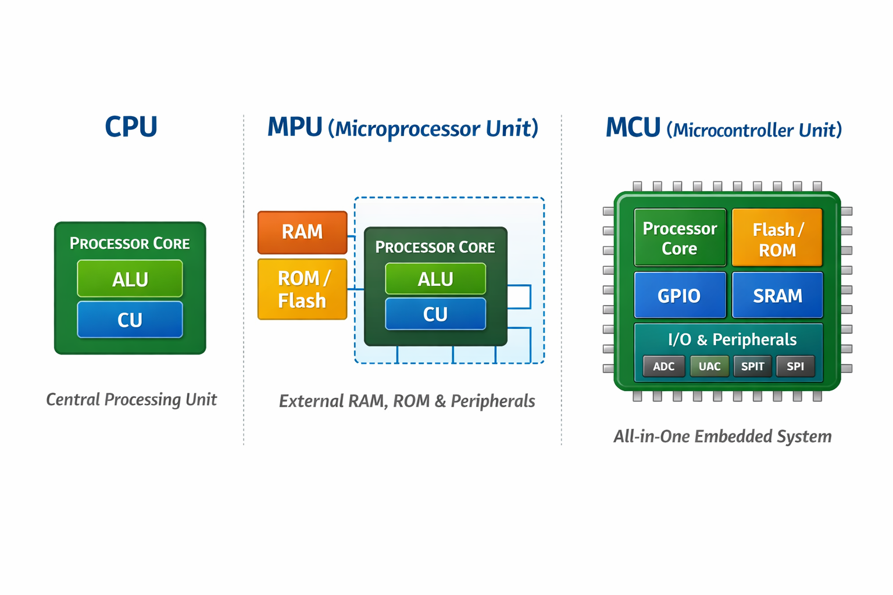
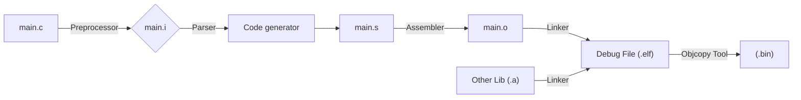

## Terimler
- **Peripheral:** CPU çekirdeğinin dışında kalan ve donanımsal bir iş yapan tüm modüllerdir. (GPIO, TIMER, USART / UART, SPI, I2C, ADC, DMA, USB vs.)
- **ALU (Arithmetic Logic Unit):** Aritmetik (toplama, çıkarma, çarpma vb.) ve mantıksal (AND, OR, XOR vb.) işlemleri gerçekleştirir.
- **CU (Control Unit):** Komutları sırayla okur, çözümler ve diğer donanım birimlerini yönlendiren kontrol sinyallerini üretir. Sistem bileşenleri arasında senkronizasyon sağlar.
- **Register:** Çok hızlı, küçük kapasiteli geçici depolama birimleridir.
- **callee-saved:** Bir fonksiyon bu register’ları kullanıyorsa, işi bitince eski haline geri getirme olayıdır.
- **FPU (Floating Point Unit):** Kayan noktalı (float/double) işlemleri CPU yerine donanım üzerinde gerçekleştirerek işlemciyi rahatlatır; FPU yoksa veya devre dışıysa bu hesaplamalar yazılımsal olarak CPU’ya bindirilir, FPU aktif olduğunda ise aynı işlemler donanım seviyesinde yürütülür.
- **T Bit:** İşlemcinin komutları hangi dilde çalıştıracağını belirleyen hayati bir kontrol bitidir; Cortex-M mimarisinde yalnızca Thumb komutları desteklendiği için bu bit her zaman 1 olmak zorundadır ve yanlış bir adresleme veya hatalı fonksiyon çağrısı sonucu **T bit’in 0** durumuna düşmesi, işlemcinin geçersiz bir yürütme durumuna girmesine ve doğrudan `HardFault` oluşmasına neden olur.
    - LSB = 1 → Thumb Modu (Tüm komutların 16 bit uzunluğunda olması)
    - LSB = 0 → ARM Modu (Tüm komutların 32 bit uzunluğunda olması)
- **PLL (Phase Locked Loop):**Giriş olarak verilen düşük frekanslı ve kararlı bir clock kaynağını (örn. kristal veya internal RC) referans alarak, bunu çarpan ve bölücüler yardımıyla daha yüksek ve sistem gereksinimlerine uygun frekanslara dönüştüren dahili saat üretim birimidir. Sistem clock’unun, bus clock’larının ve peripheral clock’larının performans gereksinimlerine göre ölçeklenmesini sağlar. Yanlış PLL konfigürasyonu, zamanlama hatalarına, çevre birimlerinin çalışmamasına veya sistem kararsızlığına yol açabilir.

## CPU - MPU - MCU
- **CPU (Central Processing Unit) - Processor**, bir sistemde komutları alan, yorumlayan ve yürüten merkezi işlem birimidir. Bilgisayarlarda, **mikroişlemcilerde (MPU)** ve **mikrodenetleyicilerde (MCU)** temel bileşen olarak yer alır. Program akışını yönetir, hesaplamaları gerçekleştirir ve sistemin genel çalışma düzenini koordine eder.
- **MPU (Microprocessor Unit)**, temel olarak yalnızca işlemci çekirdeğini içeren bir bileşendir. Bellek ve çevresel birimler harici olarak bağlanır. Yüksek işlem gücü ve esnek yapı sunar.
    - Harici RAM, ROM/Flash ve çevresel birimlere (GPIO, UART, SPI vb.) ihtiyaç duyar.
    - Genellikle MMU (Memory Management Unit) içerir.
    - Linux gibi işletim sistemlerini çalıştırabilir.
    - PC’ler, sunucular ve embedded Linux tabanlı sistemlerde yaygın olarak kullanılır.
- **MCU (Microcontroller Unit)**, tek bir entegre çipte işlemci çekirdeği + bellek + çevre birimleri (GPIO, timer, ADC, UART, I²C, SPI vb.) barındıran tam donanımlı gömülü sistem bileşenidir.
    - **Dahili Bellek:** Flash/ROM (Program kodu depolama), SRAM (Veri ve stack alanı)
    - **Çevresel Birimler:** GPIO, ADC, Timers/Counter, UART, SPI, I²C, CAN, USB vb. 
    - **Avantajları:** Düşük maliyet, düşük güç tüketimi, tek kartta tüm bileşenler.

| Özellik |	MPU | 	MCU |
|------|----------|-----------|
| İşlemci |	Var (yalnızca çekirdek) | 	Var (çekirdek + çevresel birimler) |
| Bellek	| Harici RAM/ROM |	Dahili Flash + SRAM |
| Çevresel Birimler |	Harici eklentilerle sağlanır |	Dahili UART, GPIO, ADC, timer vb. modüller |
| Kullanım Alanı	| PC, sunucu, yüksek performans	 | Gömülü sistem, IoT, otomotiv, endüstri |


## AAPCS 
- **AAPCS (ARM Architecture Procedure Call Standard)**, ARM mimarisinde fonksiyon çağrı sözleşmesini tanımlar. Amaçlar:
    - **Parametre İletimi:** İlk dört parametre `r0–r3` register’larında, fazlası stack taşınır.
    - **Geri Dönüş Adresi:** `lr` (link register) içinde saklanır.
    - **Yığın Düzeni:** Yeni çerçevede önce geri dönüş adresi, sonra yerel register kurtarma alanı, en altta yerel değişkenler yer alır.
    - **Kayıt Koru:** Callee‑saved (`r4–r11`) ve Caller‑saved (`r0–r3, r12, lr`) register’lar ayrıştırılır.
- Bu standart, farklı derleyiciler ve kütüphaneler arasında uyum ve taşınabilirlik sağlar.


## Memory
- **Stack Memory:** Fonksiyon çağrıldığında bellek ayrılır, fonksiyon bittiğinde otomatik olarak geri verilir.
    - **Yerel Değişkenler:** Fonksiyonlara ait yerel değişkenler ve dönüş adresleri stack üzerinde tutulur.
    - **Yapı:** Her fonksiyon çağrısı için ayrı bir *stack frame* oluşturulur.
    - **Sınır:** Boyutu sınırlıdır; kontrolsüz kullanım *stack overflow* hatasına yol açabilir.

- **Heap Memory:**  Bellek, çalışma zamanı sırasında `malloc`, `calloc`, `new` gibi fonksiyonlarla ayrılır.
    - **Yaşam Süresi:** Açıkça serbest bırakılana (`free`, `delete`) kadar bellekte kalır.
    - **Kullanım Alanı:** Boyutu önceden bilinmeyen veri yapıları ve uzun ömürlü nesneler için kullanılır.
    - **Risk:** Yanlış yönetim bellek sızıntılarına (*memory leak*) ve parçalanmaya (*fragmentation*) neden olabilir.

- ARM Cortex‑M işlemcide iki ayrı stack kullanılır:
    - **MSP (Main Stack Pointer):** Sistem başlangıcında yığını MSP yönetir.
    - **PSP (Process Stack Pointer):** OS/RTOS kullanıldığında, her thread kendi PSP yığınına sahip olabilir.

!!! example "Bilgi"
    | İşaretçi	| Kullanım Alanı	| Mod |
    |------|----------|-----------|
    | MSP	| Kesme servis rutinleri ve sistem başlatma |	Privileged (kernel) |
    | PSP	| Uygulama kodu ve thread işlemleri	| Thread (user) |

    ```c
    // PSP kullanımı örneği (CMSIS)
    __set_PSP(0x20002000);       // PSP başlangıç adresini ayarla
    __set_CONTROL(__get_CONTROL() | 2); // CONTROL register’da SPSEL bit’i = 1 (PSP seç)
    ```


## Bit-Banding
- **Bit‑Banding**, belirli bellek bölgesindeki her biti ayrı bir adrese eşler. Böylece tek adımla tek bir biti set/clear edebilirsiniz:
- Memory Region: 0x20000000–0x200FFFFF
- Alias Region: 0x22000000–0x23FFFFFF
- Hesaplama Formülü: `alias_addr = alias_base + (byte_offset × 32) + (bit_number × 4)`

| Register |	Açıklama |
|-----|---------------|
| ODR	| Output Data Register (çıkış verisi) |
| IDR	| Input Data Register (giriş verisi) |
| BSRR	| Bit Set/Reset Register (set ve reset için) |
| BRR	| Bit Reset Register (sadece reset için) |


## Access Levels 
Gömülü sistemlerde erişim seviyeleri, kodun hangi modda çalıştığını ve hangi kaynaklara erişebileceğini belirler

| Mod	| Açıklama |
|----|----|
| Handler Mode	| Kesme ve istisna işleyicilerinin (ISR) çalıştığı, her zaman ayrıcalıklı modu. |
| Thread/User Mode |	Normal uygulama kodunun çalıştığı mod; ister ayrıcalıklı, ister kısıtlı olabilir. |
| PAL (Privileged Access) |	Tüm sistem kaynaklarına tam erişime izin verir (örn. donanım kontrolü). |
| NPAL (Non‑Privileged) |	Korunan belleğe ve kritik birimlere erişimi sınırlandırır. |


## NVIC (Nested Vectored Interrupt Controller)
ARM Cortex‑M mikrodenetleyicilerinde kesme yönetimini üstlenen donanım modülüdür:

- **Vectored Interrupts:** Her kesme kaynağı için önceden tanımlı vektör tablosu (ISR adresleri).
- **Öncelik Seviyeleri:** 0 (en yüksek) → 255 (en düşük) arası öncelik atayarak, kritik kesmelere öncelik verebilirsiniz.
- **Nesting (İç İçe Kesme):** Daha yüksek öncelikli kesme, daha düşük öncelikli bir ISR çalışırken bile tetiklenip işlenebilir.
- **Enable/Disable:** İstediğiniz kesmeyi `NVIC_EnableIRQ(IRQn)` ve `NVIC_DisableIRQ(IRQn)` ile kontrol edebilirsiniz.

## RCC - HSI - HSE 
- **RCC (Reset and Clock Control)**, mikrodenetleyicideki tüm modüllere saat (clock) sinyallerini sağlayan ve donanım-software sıfırlama (reset) işlemlerini yöneten merkezi bir birimdir.
    - **Saat Kaynak Seçimi:** Dahili osilatör (HSI), harici kristal (HSE) veya PLL (Phase‑Locked Loop) kullanımı
    - `AHB, APB1/APB2` gibi bus’lar için bölme (prescaler) değerlerini ayarlar
    - **PLL** parametreleriyle sistem saat hızını (SYSCLK) optimize eder
    - **Güç Tüketimi:** Düşük güçlü modlar için clock gating (kullanılmayan modülleri durdurma)
    - Sistem reset’i, güç reset’i, bağımsız watchdog reset’i gibi kaynakları kontrol eder
    - Her modülün reset bit’ini (örneğin `RCC_APB1RSTR`) yazarak o çevresel birimi yeniden başlatır
- **HSI (High-Speed Internal) Oscillator:** MCU içinde entegre edilmiştir (Dahili osilatör).
    - **Frekans:** STM32 modellerine göre genellikle 8 MHz veya 16 MHz.
    - **Avantaj:** Harici kristal gerekmez, hızlı başlar ve düşük güç tüketir.
    - **Dezavantaj:** Doğruluğu `±1 %` civarında; hassas zamanlama gerektiren protokoller için ideal değil.
- **HSE (High-Speed External) Oscillator:** Harici kristal veya dış saat sinyali kullanır.
    - **Desteklenen frekans:** 4 MHz – 25 MHz
    - **Avantaj:** Çok daha kararlı ve doğru saat kaynağı.
    - **Kullanım:** USB, CAN, SDIO, yüksek hızlı UART gibi hassas zamanlama gerektiren iletişimler.


## AHB - APB 
- **AHB (Advanced High-performance Bus):**, ARM AMBA (Advanced Microcontroller Bus Architecture) ailesinin yüksek hızlı veri yolu katmanıdır. Özellikleri:
    - **Yüksek Bant Genişliği:** Burst transfer desteği sayesinde ardışık veri bloklarını kesintisiz taşır.
    - **Düşük Gecikme:** Pipeline mimarisiyle her döngüde bir transfer başlatılabilir.
    - **Multi‑Master Desteği:** Birden fazla bus master (ör. DMA, CPU) arasında arbitraj yaparak kontrolü paylaşır.
    - **Ana işlemci (CPU)** ve **DMA** birimi doğrudan AHB’ye bağlıdır.
    - **Sistem bellekleri** (SRAM/Flash) ve sabit bellek arayüzleri genellikle AHB üzerinden erişilir.

- **APB (Advanced Peripheral Bus):**, AMBA ailesinin düşük hızlı çevre birimleri için tasarlanmış basitleştirilmiş veri yoludur:
    - **Düşük Karmaşıklık:** Tek döngülü, pipelineless tasarım; aracılar (bridges) üzerinden AHB’ye bağlanır.
    - **Düşük Güç Tüketimi:** Çevresel birimleri gerektikçe uyandıracak şekilde çalışır.
    - **Tipik Kullanım:** UART, SPI, I²C, Timer’lar gibi düşük hızlı algılayıcı ve kontrol modülleri APB üzerinde yer alır.

| Özelikler | **AHP** | **APB** |
| --- | --- | --- |
| Hız | Yüksek hızda veri iletimi | Düşük hızda veri iletimi |
| Veri Transferi | Burst transfer, pipelining, yüksek hız | Tek veri transferi, basit iletişim |
| Yapı | Karmaşık, daha fazla donanım gereksinimi | Basit, düşük maliyetli |
| Gecikme | Düşük gecikme | Yüksek gecikme |
| Uygulama Alanları |  CPU, DMA, bellek arayüzleri, büyük veri transferi | Çevre birimleri (UART, I2C, GPIO, Timer vb.) ile iletişim |
| Bağlantı Tipi | Master/slave yapısı, daha karmaşık bağlantılar | Basit veri iletimi ve bağlantılar
| Güç Tüketimi | Yüksek güç tüketimi | Düşük güç tüketimi |


## Burst Transfer
- Yüksek hızlı veri yollarında ardışık ve blok halinde veri iletimi sağlayan yöntemdir:
- **Blok İletimi:** Birçok küçük hatta tek tek veri yerine, büyük bir veri bloğu peş peşe aktarılır.
- **Verimlilik:** Her küçük veri paketi için ayrı başlatma/durdurma/idare işlemi yapılmaz; başlatma/durdurma maliyeti tek seferde ödenir.
- **Düşük Gecikme:** Pipeline desteğiyle, her clock döngüsünde yeni bir veri kelimesi transfer edilebilir.
- **Yüksek Bant Genişliği:** Burst modunda, topyekûn aktarım hızında ciddi artış sağlar.

## ISR (Interrupt Service Routine)

- **interrupt** oluştuğunda otomatik olarak çağrılan kesme işleyici fonksiyonudur. Ana program akışı duraklar, **ISR** çalışır, sonra ana programa döner.
- CPU **LR** (link register) içerisine dönüş adresini kaydeder
- Kesme kaynağı bayrağını temizleyip (ör. `EXTI->PR |= …`) ilgili işlemi yapar
- **R0–R12** → Genel amaçlı register’lar
- **SP** (Stack Pointer) → Geçici veri ve ISR dönüş adresi
- **LR** (Link Register) → ISR öncesi dönüş adresi
- **PC** (Program Counter) → Bir sonraki yürütülecek komut


## SVC (Supervisor Call)

Yazılım kesmesi (`svc`) aracılığıyla kullanıcı uygulamasından çekirdek veya RTOS hizmetlerine (ör. bellek ayırma, görev oluşturma) erişim sağlar.

```asm
SVC #5    ; SVC numarası 5 ile çekirdek çağrısı
```

```c
__ASM("svc 5");
```

## SWD (Serial Wire Debug)
- ARM Cortex‑M programlama ve hata ayıklama amacıyla kullanılan, az (2) pinli (SWDIO, SWCLK) ve düşük overhead’li bir debug arayüzüdür.
- **Düşük pin sayısı** ile JTAG’a göre avantajlı
- Gerçek zamanlı bellek okuma/yazma, register izleme
- **SWO** (Serial Wire Output) ile trace mesajlarını aktarır

## JTAG (Joint Test Action Group)
- Elektronik bileşenlerin test ve hata ayıklama standardıdır:
- 4 - 5 pinli protokol (TCK, TMS, TDI, TDO, TRST)
- Boundary‑scan test, IC programlama, çekirdek debug
- SWD’ın alt kümesi olarak bazı ARM çekirdeklerinde desteklenir
- JTAG, çoklu cihaz desteği ve **boundary-scan** gibi üretim odaklı yetenekler sunduğu için vardır; SWD ise ARM mikrodenetleyicilerde aynı debug işlevlerini daha az pinle sağlamak amacıyla geliştirilmiş bir alternatiftir

|  | **JTAG** | **SWD** |
| --- | --- | --- |
| **Pin Sayısı** | 5-6 pin | 2 pin |
| **Temel Pinler** | TDI, TDO, TMS, TCK, TRST (opsiyonel) | SWDIO, SWCLK |
| **Zincirleme Desteği** | Var, birden fazla cihazı zincirleme olarak bağlayabilir | Yok, her cihaz için ayrı bağlantı gereklidir |
| **Hız ve Performans** | Daha fazla veri iletimi, daha yüksek hız, ancak karmaşık sistemlerde yavaş olabilir | Daha hızlı veri iletimi, düşük pin sayısı ile daha hızlı sonuç alabilirsiniz |
| **Karmaşıklık** | Daha karmaşık, çok sayıda pin ve yapılandırma gerektirir | Daha basit, düşük pin sayısı ve yapılandırma gerektirir |
| **Kullanım Alanları** | Daha büyük ve karmaşık sistemler, FPGA'lar, bellekler, CPU'lar | ARM Cortex-M mikrodenetleyiciler, düşük pinli yapılar |
| **Debugging Yeteneği** | Kapsamlı debugging, register işlemleri ve sistem izleme | Temel debugging, register okuma/yazma, programlama |
| **Zamanlayıcı Desteği** | Yüksek hızda test ve iletişim gerektiren sistemler için uygundur | Düşük pin sayısı ile hızlı hata ayıklama sağlar |
| **Enerji Tüketimi** | Daha fazla enerji tüketebilir, daha fazla pin kullanıldığı için | Daha az enerji tüketir, çünkü sadece 2 pin kullanılır |
| **Karmaşık Sistemler İçin Uygunluk** | Yüksek hızda ve karmaşık sistemlerde kullanılır | Daha basit ve düşük pin sayısına sahip sistemler için uygundur |

!!! note "Not"
    OpenOCD (Open On-Chip Debugger), mikrodenetleyici ve SoC’lere JTAG/SWD üzerinden programlama ve hata ayıklama yapılmasını sağlayan açık kaynaklı bir debug sunucusudur.

## ITM (Instrumentation Trace Macrocell)
- ITM, ARM Cortex‑M tabanlı mikrodenetleyicilerde yerleşik olarak bulunan, **gerçek zamanlı izleme** ve **hata ayıklama** altyapısıdır:
- **Gerçek Zamanlı İzleme:** Kodunuzun akışını, fonksiyon çağrılarını veya değişken değerlerini canlı olarak “trace” edebilirsiniz.
- **Düşük Gecikme:** `SWO` (Serial Wire Output) pininden taşan veriyi, sistem performansını etkilemeden aktarır.
- **Performans Analizi:** Zaman damgalı etiketler (timestamps) sayesinde hangi kod bloğunun ne kadar sürdüğünü ölçebilir, darboğazları hızla tespit edebilirsiniz.
- **Özelleştirilebilir Paketler:** Hem ARM tarafından tanımlı standart trace paketlerini hem de kendi veri formatlarınızı kullanabilirsiniz.
- Zamanlama hatalarını keşfetme
- Döngü sayımlarını ve iş parçacıkları arasındaki geçişleri izleme
- Kalıcı log alınamayan gerçek zamanlı sistemlerde debug

!!! note "Not"
    Cortex-M0/M0+/M1/M2 çekirdekleri düşük alan ve maliyet odaklı tasarlandığı için CoreSight debug altyapısını (ITM, DWT, ETM) içermez; Cortex-M3 ve sonrası ise ileri seviye debug ve izleme (trace) gereksinimleri nedeniyle ITM’ye geçmiştir.

## GPIO  - Nibble
- Mikrodenetleyici veya işlemci üzerinde bulunan; dijital giriş (input) veya dijital çıkış (output) olarak yapılandırılabilen, donanım seviyesinde kontrol edilen genel amaçlı pinlerdir.
- 4 bitten oluşan bir veri birimidir → 0000–1111 (hex’de 0–F)
    - **MSB (Most Significant Bit)** en soldaki bittir
    - **LSB (Least Significant Bit)** en sağdaki bittir.
- `&` Bitwise And, `|` Bitwise Or, `^` Bitwise XOR
- `~` Bitwise NOT, `<<` Bitwise Shift Left, `>>` Bitwise Shift Right

## Cross Compiler 
- Bir x86 veya macOS/Windows gibi “geliştirme host” makinenizde çalışıp, farklı bir “hedef” platform (ör. ARM Cortex‑M) için derlenmiş kod üreten derleyicidir. En yaygın örnek:

```
arm-none-eabi-gcc
│   │    │      └─ gcc (GNU Compiler Collection)
│   │    └─ eabi (Embedded Application Binary Interface)
│   └─ none (OS yok: bare‑metal)
└─ arm (ARM mimarisi)
```

- Çıktı Dosya Biçimleri
    - **ELF (.elf):** Çalıştırılabilir, simge tablosu ve debug bilgisi içerir. (Linux/Unix standardı)
    - **HEX (.hex):** Intel HEX formatı; her satırda adres + byte dizisi ASCII olarak saklanır. Mikrodenetleyici bootloader’larına uygundur.
    - **BIN (.bin):** Saf makine kodu; hiçbir meta‑veri içermez, doğrudan belleğe veya flash’a yazılır.
- **Tipik Derleme Akışı**
    - `arm-none-eabi-gcc -c main.c -o main.o` → Derleme
    - `arm-none-eabi-ld main.o -T linker_script.ld -o firmware.elf` → Bağlama
    - `arm-none-eabi-objcopy -O ihex firmware.elf firmware.hex` → HEX’e dönüştürme
    - `arm-none-eabi-objcopy -O binary firmware.elf firmware.bin` → BIN’e dönüştürme




