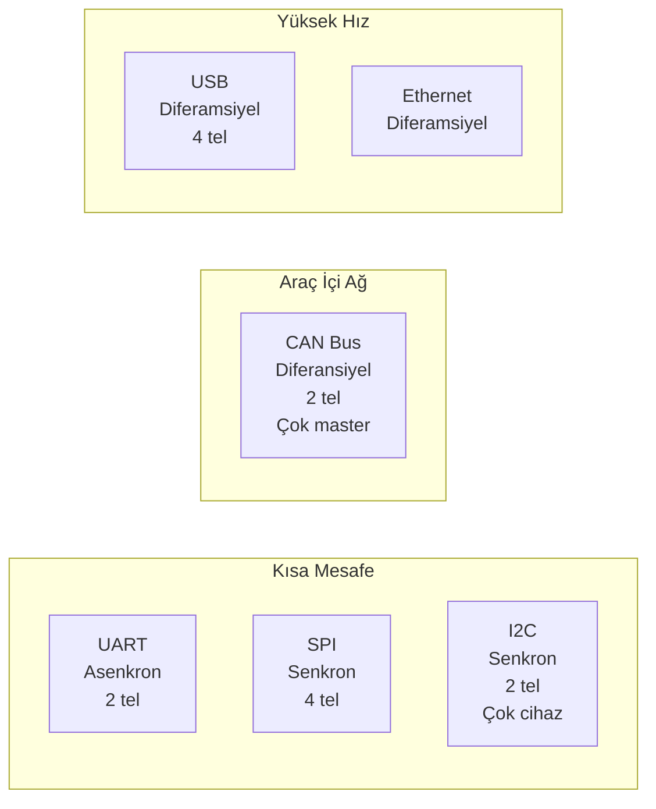
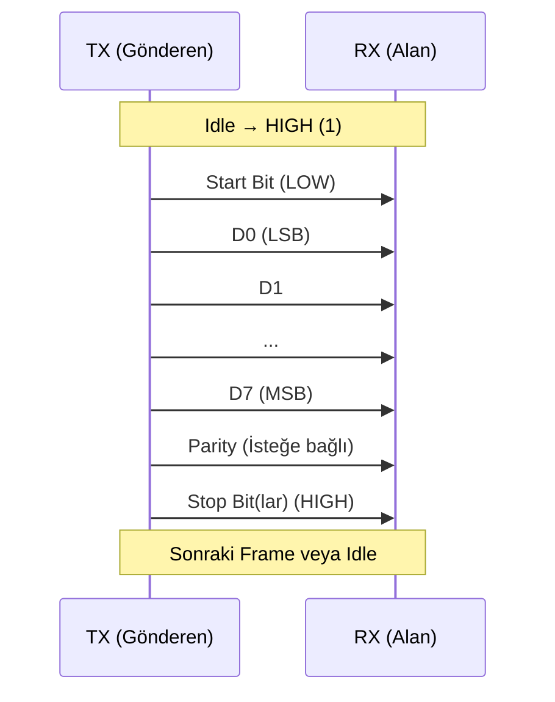
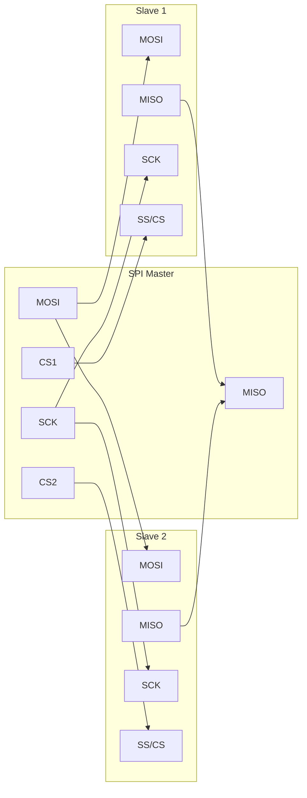
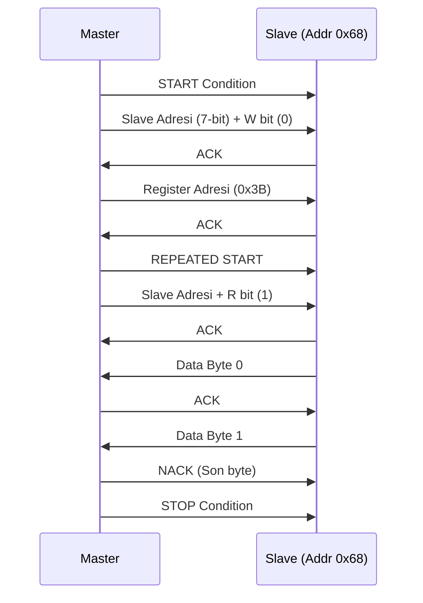
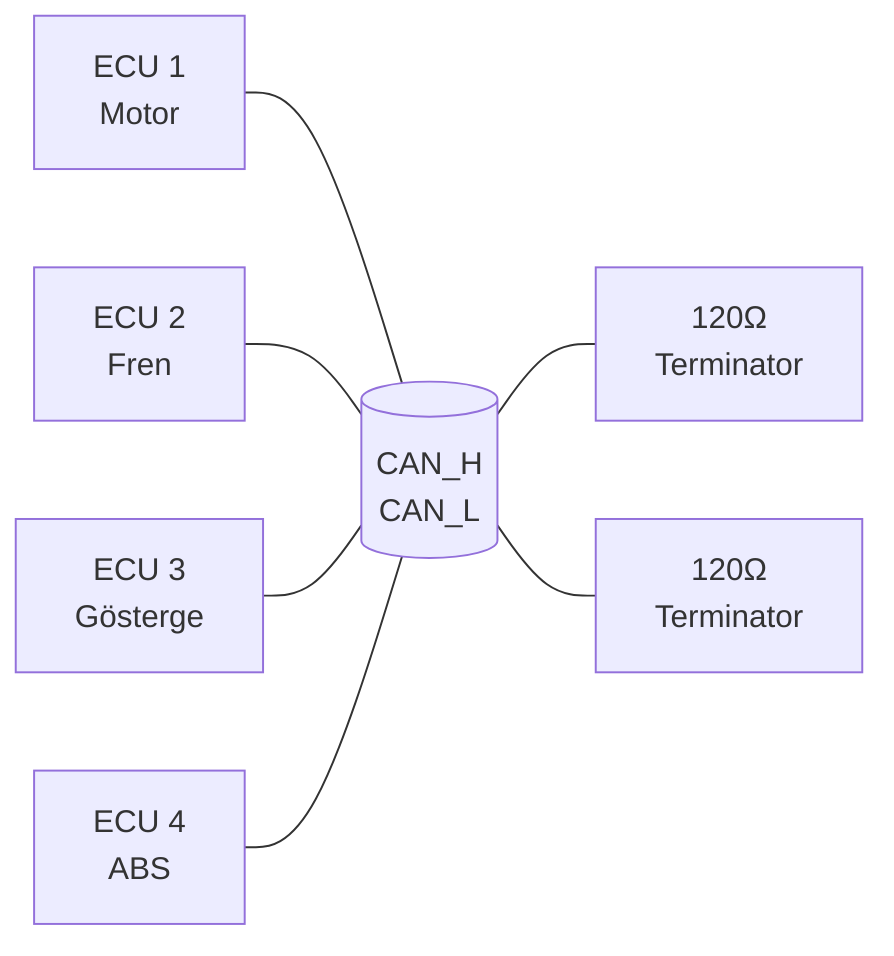
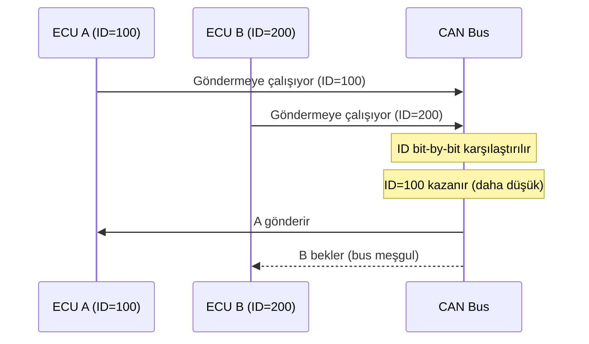
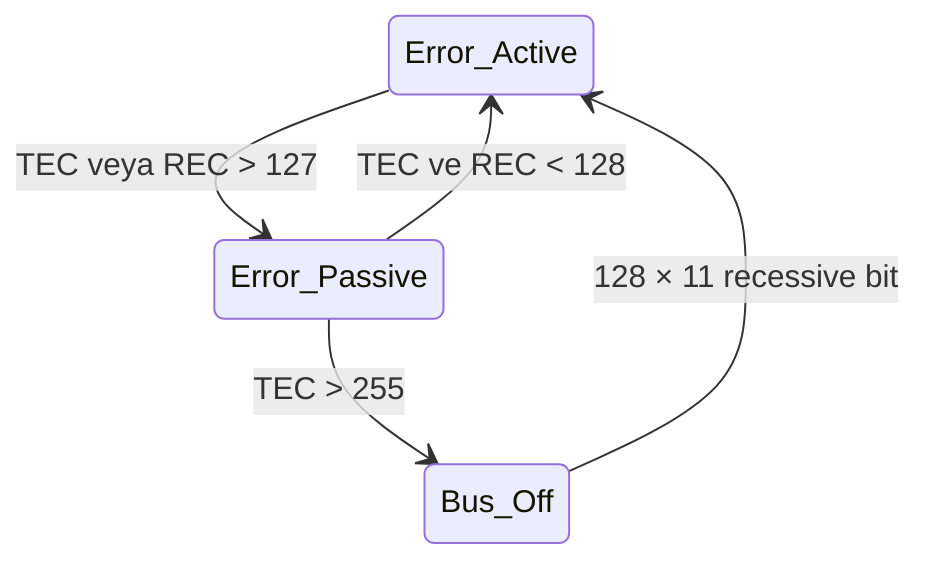

# Haberleşme Protokolleri

!!! note "Genel Bakış"
    Gömülü sistemlerde sensörler, aktüatörler ve işlemciler arası haberleşme için standart seri protokoller kullanılır. Her protokolün fiziksel katman, timing ve hata yönetimi açısından kendine özgü özellikleri vardır. Bu bölüm UART, SPI, I²C ve CAN protokollerini kapsar.



---

## UART / USART

**Universal Asynchronous Receiver-Transmitter** — ortak clock olmaksızın asenkron seri iletişim.



### Çerçeve Yapısı

| Alan | Genişlik | Açıklama |
|------|:--------:|---------|
| Start Bit | 1 bit | LOW — frame başlangıcı |
| Veri | 5–9 bit | LSB önce; genellikle 8-bit |
| Parity | 0–1 bit | None / Even / Odd |
| Stop Bit | 1–2 bit | HIGH — frame sonu |

### Baud Rate Hesabı

```
UBRR = (F_CPU / (16 × Baud)) - 1          // Normal hız
UBRR = (F_CPU / (8 × Baud)) - 1           // 2× hız (U2X=1)

F_CPU=16 MHz, Baud=9600:
UBRR = (16_000_000 / (16 × 9600)) - 1 = 103
```

!!! note "Baud Rate Hatası"
    Yaygın F_CPU değerlerinde tam baud rate çıkmaz; %2'nin üzerindeki hata iletişim bozulmasına neden olur. 11.0592 MHz kristal, popüler baud rate'lerin sıfır hatayla üretilmesini sağlar.

### STM32 USART Örneği

```c title="STM32 USART2 Başlatma"
/* USART2: PA2=TX, PA3=RX — APB1'de */
RCC->APB1ENR |= RCC_APB1ENR_USART2EN;
RCC->AHB1ENR |= RCC_AHB1ENR_GPIOAEN;

/* PA2/PA3 → AF7 (USART2) */
GPIOA->MODER  |= (2 << 4) | (2 << 6);   /* Alternate Function */
GPIOA->AFR[0] |= (7 << 8) | (7 << 12); /* AF7 */

USART2->BRR = 42000000 / 115200;  /* APB1=42MHz, Baud=115200 */
USART2->CR1 = USART_CR1_TE | USART_CR1_RE | USART_CR1_UE;

/* Gönder */
void usart2_send(uint8_t ch) {
    while (!(USART2->SR & USART_SR_TXE));
    USART2->DR = ch;
}

/* Al */
uint8_t usart2_recv(void) {
    while (!(USART2->SR & USART_SR_RXNE));
    return USART2->DR;
}
```

| Özellik | Değer |
|---------|-------|
| Topoloji | Point-to-Point |
| Kablo | TX→RX, RX→TX (çapraz) |
| Clock | Ortak referans yok — sadece baud rate eşleşmeli |
| Hız | 115.2 kbps (tipik) → 10+ Mbps (bazı USART) |
| Mesafe | ~15 m (RS-232 seviye dönüştürücüyle) |
| Veri yönü | Full-duplex (TX + RX eş zamanlı) |

---

## SPI (Serial Peripheral Interface)

Senkron, full-duplex, tek-master çok-slave seri protokol.



### Sinyal Açıklamaları

| Pin | Yön | Açıklama |
|-----|:---:|---------|
| **MOSI** | Master→Slave | Master Out Slave In |
| **MISO** | Slave→Master | Master In Slave Out |
| **SCK** (SCLK) | Master→Slave | Clock — master üretir |
| **CS** (SS, NSS) | Master→Slave | Chip Select — LOW=aktif |

### SPI Modları (CPOL ve CPHA)

| Mod | CPOL | CPHA | Clock Boşta | Örnekleme Kenarı |
|:---:|:----:|:----:|:----------:|:----------------:|
| 0 | 0 | 0 | LOW | Yükselen |
| 1 | 0 | 1 | LOW | Düşen |
| 2 | 1 | 0 | HIGH | Düşen |
| 3 | 1 | 1 | HIGH | Yükselen |

!!! tip "Mod Seçimi"
    Slave cihazın datasheet'inde CPOL/CPHA veya SPI Mode 0–3 belirtilir. En yaygın kullanılan Mod 0 ve Mod 3'tür.

### STM32 SPI Örneği

```c title="STM32 SPI1 — Polling"
/* SPI1: PA5=SCK, PA6=MISO, PA7=MOSI */
RCC->APB2ENR |= RCC_APB2ENR_SPI1EN;
RCC->AHB1ENR |= RCC_AHB1ENR_GPIOAEN;

/* PA5/PA6/PA7 → AF5 */
GPIOA->MODER  |= (2<<10)|(2<<12)|(2<<14);
GPIOA->AFR[0] |= (5<<20)|(5<<24)|(5<<28);

/* CS → PA4, GPIO çıkış */
GPIOA->MODER |= (1 << 8);
GPIOA->BSRR   = (1 << 4);  /* CS HIGH (deaktif) */

SPI1->CR1 = SPI_CR1_MSTR          /* Master */
           | SPI_CR1_BR_1          /* fPCLK/8 */
           | SPI_CR1_SSM           /* Software NSS */
           | SPI_CR1_SSI
           | SPI_CR1_SPE;          /* SPI enable */

uint8_t spi_transfer(uint8_t veri) {
    while (!(SPI1->SR & SPI_SR_TXE));
    SPI1->DR = veri;
    while (!(SPI1->SR & SPI_SR_RXNE));
    return SPI1->DR;
}

/* Kullanım */
GPIOA->BSRR = (1 << (4 + 16));   /* CS LOW */
uint8_t cevap = spi_transfer(0x9F); /* ID oku */
GPIOA->BSRR = (1 << 4);           /* CS HIGH */
```

| Özellik | Değer |
|---------|-------|
| Topoloji | Master + N Slave (ayrı CS hattı her birine) |
| Hız | 10–100 Mbps |
| Veri yönü | Full-duplex (eş zamanlı MOSI+MISO) |
| Pin sayısı | 3 + N (N = slave sayısı, CS başına 1) |
| Hata tespiti | Yok (uygulama katmanında yapılmalı) |

---

## I²C (Inter-Integrated Circuit)

İki tel (SDA + SCL) ile çok-master, çok-slave senkron protokol. Her slave'in benzersiz 7 veya 10-bit adresi vardır.



### Bus Durumları

| Durum | SDA | SCL | Açıklama |
|-------|:---:|:---:|---------|
| Idle | HIGH | HIGH | Açık (open-drain pull-up) |
| **START** | HIGH → LOW | HIGH | Yeni transfer başlıyor |
| Veri | Geçerli bit | ↑ pulse | SCL HIGH iken SDA sabit |
| **STOP** | LOW → HIGH | HIGH | Transfer sonu |
| **R-START** | HIGH → LOW | HIGH | STOP olmadan yeni transfer |

### Hız Modları

| Mod | Hız | Kullanım |
|-----|:---:|---------|
| Standard | 100 kHz | Genel amaçlı |
| Fast | 400 kHz | Yaygın sensörler |
| Fast Plus | 1 MHz | Yüksek hızlı sensörler |
| High-Speed | 3.4 MHz | Özel donanım |

### STM32 I²C Örneği

```c title="STM32 I2C1 — HAL ile MPU6050 okuma"
/* HAL kullanımı (tercih edilen) */
#include "stm32f4xx_hal.h"

extern I2C_HandleTypeDef hi2c1;
#define MPU6050_ADDR (0x68 << 1)   /* HAL 8-bit adres kullanır */

/* Yazma */
uint8_t reg = 0x6B, val = 0x00;   /* PWR_MGMT_1 = 0 */
HAL_I2C_Master_Transmit(&hi2c1, MPU6050_ADDR, (uint8_t[]){reg, val}, 2, 100);

/* Okuma */
uint8_t veri[6];
uint8_t reg_start = 0x3B;
HAL_I2C_Master_Transmit(&hi2c1, MPU6050_ADDR, &reg_start, 1, 100);
HAL_I2C_Master_Receive (&hi2c1, MPU6050_ADDR, veri, 6, 100);
```

```c title="Register Seviyesi I2C — STM32F4"
void i2c1_write(uint8_t addr, uint8_t reg, uint8_t val) {
    /* START */
    I2C1->CR1 |= I2C_CR1_START;
    while (!(I2C1->SR1 & I2C_SR1_SB));

    /* Slave adres + Write */
    I2C1->DR = (addr << 1);
    while (!(I2C1->SR1 & I2C_SR1_ADDR));
    (void)I2C1->SR2;  /* SR2 okuyarak ADDR temizle */

    /* Register adresi */
    I2C1->DR = reg;
    while (!(I2C1->SR1 & I2C_SR1_TXE));

    /* Veri */
    I2C1->DR = val;
    while (!(I2C1->SR1 & I2C_SR1_BTF));

    /* STOP */
    I2C1->CR1 |= I2C_CR1_STOP;
}
```

!!! danger "I²C Pull-Up Direnci"
    SDA ve SCL hatları open-drain; her zaman pull-up direnci şart. Düşük hız (100 kHz) için 10 kΩ, yüksek hız için 2.2 kΩ–4.7 kΩ tipik değerlerdir. Pull-up olmadan bus asla HIGH'a gidemez → iletişim imkânsız.

!!! note "I²C Adres Tarama"
    ```c
    /* Tüm adreslere START + Adres gönder; ACK gelirse cihaz var */
    for (uint8_t addr = 1; addr < 128; addr++) {
        if (HAL_I2C_IsDeviceReady(&hi2c1, addr << 1, 1, 10) == HAL_OK)
            printf("Cihaz bulundu: 0x%02X\r\n", addr);
    }
    ```

| Özellik | Değer |
|---------|-------|
| Topoloji | Multi-master, multi-slave |
| Kablo | SDA + SCL (2 tel + GND + VCC) |
| Adres | 7-bit (128 cihaz) veya 10-bit |
| Hız | 100 kHz – 3.4 MHz |
| Hata tespiti | ACK/NACK mekanizması |

---

## SPI vs I²C Karşılaştırması

| Özellik | SPI | I²C |
|---------|:---:|:---:|
| Tel sayısı | 4+ | 2 |
| Hız | ≥10 Mbps | ≤3.4 Mbps |
| Mesafe | Kısa (PCB içi) | Kısa (PCB içi) |
| Multi-slave | CS başına 1 pin | Adres sistemi |
| Full-duplex | ✓ | ✗ (half-duplex) |
| Donanım karmaşıklığı | Düşük | Orta (pull-up, arbitration) |
| Hata tespiti | Yok | ACK/NACK |
| Tipik cihazlar | Flash, Display, DAC, ADC | Sensörler, EEPROM, RTC |

---

## CAN Bus (Controller Area Network)

Araç içi ve endüstriyel sistemlerde yüksek güvenilirlikli, çok-master, diferansiyel seri ağ protokolü.



### CAN Çerçeve Yapısı (Standard Frame)

```
| SOF | ID[10:0] | RTR | IDE | r0 | DLC[3:0] | Data[0:7 bytes] | CRC | ACK | EOF |
```

| Alan | Bit | Açıklama |
|------|:---:|---------|
| SOF | 1 | Start of Frame — dominant (0) |
| Identifier (ID) | 11 (veya 29) | Mesaj kimliği **ve önceliği** |
| RTR | 1 | Remote Transmission Request |
| DLC | 4 | Data Length Code (0–8 byte) |
| Data | 0–64 bit | Veri |
| CRC | 15+1 | Hata tespiti |
| ACK | 2 | Herhangi bir alıcı dominant çeker |
| EOF | 7 | End of Frame |

!!! note "ID = Öncelik"
    CAN'da ID hem mesajı tanımlar hem de bus arbitrasyonunda önceliği belirler. **Düşük ID → Yüksek öncelik.** ID=0 en yüksek önceliklidir.

### CSMA/CA — Bus Arbitrasyonu



### CAN Hız ve Mesafe

| Hız | Maksimum Mesafe |
|:---:|:---------------:|
| 1 Mbps | 40 m |
| 500 kbps | 100 m |
| 250 kbps | 250 m |
| 125 kbps | 500 m |
| 10 kbps | 6000 m |

### STM32 CAN Örneği

```c title="STM32 bxCAN — Mesaj Gönder"
CAN_TxHeaderTypeDef txHeader;
uint8_t txData[8] = {0x01, 0x02, 0x03, 0x04};
uint32_t txMailbox;

txHeader.StdId = 0x123;          /* 11-bit ID */
txHeader.IDE   = CAN_ID_STD;
txHeader.RTR   = CAN_RTR_DATA;
txHeader.DLC   = 4;              /* 4 byte veri */

HAL_CAN_AddTxMessage(&hcan1, &txHeader, txData, &txMailbox);

/* Filtre — sadece ID=0x123 mesajları kabul et */
CAN_FilterTypeDef filtre;
filtre.FilterIdHigh         = 0x123 << 5;
filtre.FilterIdLow          = 0;
filtre.FilterMaskIdHigh     = 0x7FF << 5;  /* Tam eşleşme */
filtre.FilterMaskIdLow      = 0;
filtre.FilterBank           = 0;
filtre.FilterMode           = CAN_FILTERMODE_IDMASK;
filtre.FilterScale          = CAN_FILTERSCALE_32BIT;
filtre.FilterActivation     = ENABLE;
filtre.SlaveStartFilterBank = 14;
HAL_CAN_ConfigFilter(&hcan1, &filtre);
```

### CAN Hata Yönetimi

| Hata | Açıklama |
|------|---------|
| Bit Error | Gönderilen bit != okunan bit |
| Stuff Error | 5 ardışık aynı bit → Stuffing kuralı ihlali |
| CRC Error | CRC uyuşmazlığı |
| Form Error | Sabit alanlar yanlış (EOF, ACK) |
| ACK Error | Hiç kimse ACK çekmedi |



!!! danger "Bus-Off Durumu"
    Hata sayacı (TEC > 255) limitini aşarsa node bus'tan kendini çıkarır. Otomotiv sistemlerinde Bus-Off kurtarma yazılımla yönetilmeli ve watchdog ile izlenmelidir.

---

## USB (Kısa Özet)

USB, PC ve gömülü cihazlar arasında yüksek hızlı, hot-pluggable haberleşme sağlar.

| Standart | Hız | Kullanım |
|----------|:---:|---------|
| USB 1.1 FS | 12 Mbps | HID (klavye, fare) |
| USB 2.0 HS | 480 Mbps | Mass Storage, CDC |
| USB 3.0 | 5 Gbps | Kamera, yüksek bant genişliği |

| Cihaz Sınıfı | Kısaltma | Örnek |
|-------------|:--------:|-------|
| Communication Device | CDC | Virtual COM Port |
| Human Interface Device | HID | Klavye, fare, gamepad |
| Mass Storage | MSC | USB bellek |
| Device Firmware Upgrade | DFU | Bootloader |
| Vendor Specific | — | Özel protokoller |

!!! tip "STM32 USB CDC — Virtual COM Port"
    STM32CubeMX'te USB_OTG_FS → Device → CDC seçilir; otomatik üretilen `usbd_cdc_if.c` içindeki `CDC_Transmit_FS()` ile veri gönderilebilir. PC'de sürücü gerekmez — standart COM port olarak görünür.

---

## Protokol Seçim Rehberi

| Gereksinim | Önerilen Protokol |
|-----------|:-----------------:|
| Tek cihaz, yüksek hız, tam-çift | SPI |
| Çok cihaz, az pin, düşük-orta hız | I²C |
| Basit seri debug / PC haberleşmesi | UART |
| Araç içi ağ, yüksek güvenilirlik | CAN |
| PC bağlantısı, plug-and-play | USB |
| 10 Mbps+ endüstriyel Ethernet | Ethernet |