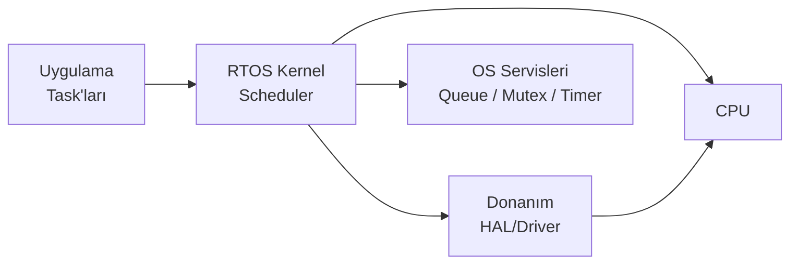
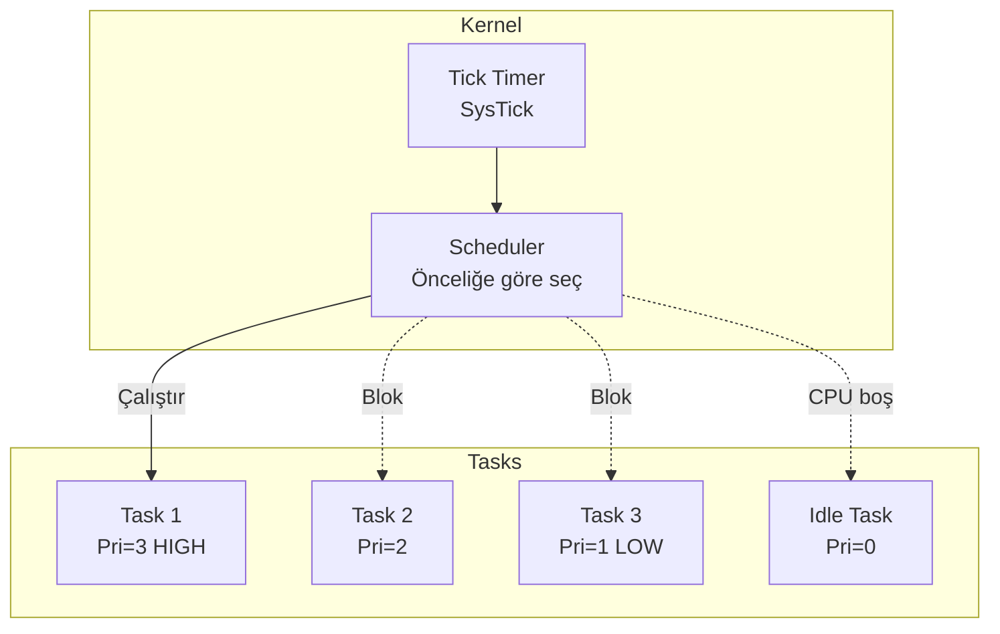
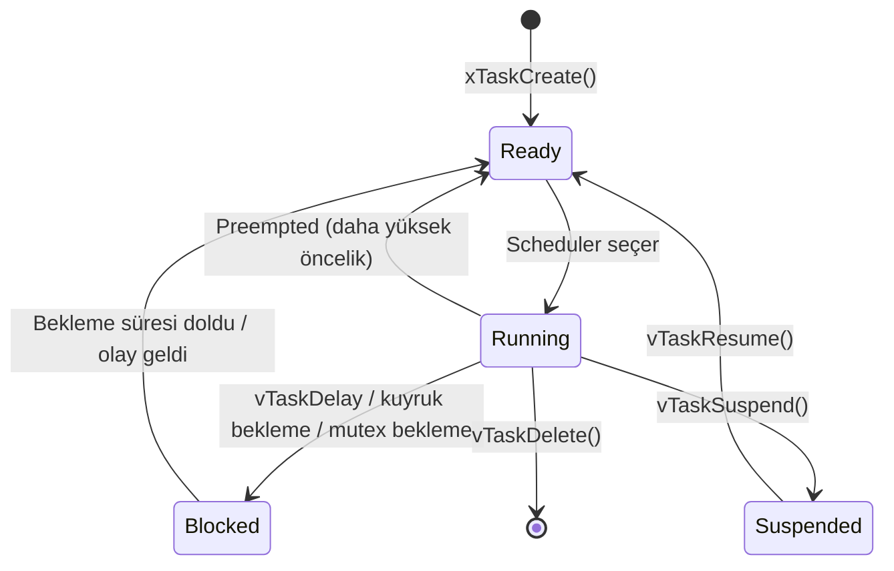
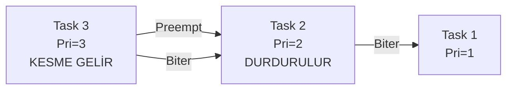

# RTOS — Gerçek Zamanlı İşletim Sistemleri

!!! note "Genel Bakış"
    RTOS (Real-Time Operating System), deterministik zamanlama garantisi veren, gömülü sistemler için tasarlanmış işletim sistemidir. Klasik işletim sistemlerinden farkı, görevlerin **belirli bir süre içinde** tamamlanma garantisidir. Bu bölüm FreeRTOS temel alınarak yazılmıştır; kavramlar diğer RTOS (Zephyr, ThreadX, embOS) için de büyük ölçüde geçerlidir.



---

## RTOS vs Bare-Metal

| Özellik | Bare-Metal | RTOS |
|---------|:----------:|:----:|
| Zamanlama | Manuel (super-loop) | Kernel scheduler |
| Eşzamanlılık | Zor (ISR + flags) | Task + IPC primitifleri |
| Deterministm | Değişken | Garanti (hard/soft RT) |
| Karmaşıklık | Düşük | Orta |
| RAM/Flash | Çok az | Fazla (çekirdek için) |
| Debug | Basit | Stack overflow, deadlock riski |

!!! tip "Ne Zaman RTOS?"
    Birden fazla bağımsız görevi aynı anda yürütmek, zamanlama, kaynak paylaşımı ve öncelik yönetimi gerektiğinde RTOS kullanın. Tek görev, düşük gecikme yeterliyse bare-metal tercih edilebilir.

---

## FreeRTOS Temel Kavramları



### Task Durumları



| Durum | Açıklama |
|-------|---------|
| **Ready** | CPU'ya atanmayı bekliyor |
| **Running** | Aktif olarak CPU'da çalışıyor |
| **Blocked** | Event, kuyruk mesajı veya delay bekliyor |
| **Suspended** | Dış çağrıyla askıya alındı |

---

## Task Yönetimi

```c title="FreeRTOS Task Oluşturma"
#include "FreeRTOS.h"
#include "task.h"

/* Task fonksiyonu — sonsuz döngü içermeli */
void vLedTask(void *pvParameters) {
    (void)pvParameters;
    const TickType_t xDelay = pdMS_TO_TICKS(500);

    for (;;) {
        HAL_GPIO_TogglePin(GPIOA, GPIO_PIN_5);
        vTaskDelay(xDelay);  /* Bloklayan bekleme; CPU serbest kalır */
    }
}

void vSensorTask(void *pvParameters) {
    uint16_t adc_val;
    for (;;) {
        adc_val = adc_read(0);
        /* İşle... */
        vTaskDelay(pdMS_TO_TICKS(100));
    }
}

int main(void) {
    HAL_Init();
    SystemClock_Config();

    /* Task oluştur */
    xTaskCreate(
        vLedTask,          /* Fonksiyon pointer */
        "LED",             /* Debug adı */
        128,               /* Stack boyutu (word cinsinden) */
        NULL,              /* Parametre */
        2,                 /* Öncelik (0=idle, yüksek=daha öncelikli) */
        NULL               /* Task handle (isteğe bağlı) */
    );

    xTaskCreate(vSensorTask, "Sensor", 256, NULL, 3, NULL);

    vTaskStartScheduler();   /* Scheduler başlat — buradan dönmez */
    for (;;);                /* Teorik erişilmez */
}
```

### Task Önceliği

!!! note "Öncelik Seçimi"
    FreeRTOS'ta sayı **büyüdükçe** öncelik **artar** (Linux'un tersine). `configMAX_PRIORITIES` (FreeRTOSConfig.h) üst sınırı belirler; varsayılan 5'tir. ISR ile etkileşen task'lar, ISR önceliğinden düşük tutulmalı.

| Öncelik | Kullanım |
|:-------:|---------|
| 0 | Idle Task (FreeRTOS dahili) |
| 1 | Arka plan görevleri (log, telemetri) |
| 2 | Genel uygulama görevleri |
| 3 | Zamana duyarlı görevler |
| 4 | Kritik görevler (motor, güvenlik) |

---

## Queue (Mesaj Kuyruğu)

Task'lar arası veri iletiminin birincil yöntemi. Thread-safe, ISR'dan kullanılabilir.

```c title="Queue Örneği — ADC → İşleyici"
#include "queue.h"

QueueHandle_t xAdcQueue;

/* ISR veya ADC Task */
void vAdcTask(void *pv) {
    uint16_t deger;
    for (;;) {
        deger = adc_read(0);
        xQueueSend(xAdcQueue, &deger, pdMS_TO_TICKS(10));
        vTaskDelay(pdMS_TO_TICKS(50));
    }
}

/* İşleyici Task */
void vProcessTask(void *pv) {
    uint16_t alinan;
    for (;;) {
        if (xQueueReceive(xAdcQueue, &alinan, portMAX_DELAY) == pdTRUE) {
            /* alinan işle */
        }
    }
}

int main(void) {
    /* 10 elemanlı uint16_t kuyruğu */
    xAdcQueue = xQueueCreate(10, sizeof(uint16_t));
    xTaskCreate(vAdcTask,     "ADC",  128, NULL, 2, NULL);
    xTaskCreate(vProcessTask, "Proc", 256, NULL, 3, NULL);
    vTaskStartScheduler();
}
```

### ISR'dan Queue Kullanımı

```c
void USART2_IRQHandler(void) {
    BaseType_t xHigherPriorityTaskWoken = pdFALSE;
    uint8_t byte = USART2->DR;

    xQueueSendFromISR(xRxQueue, &byte, &xHigherPriorityTaskWoken);
    portYIELD_FROM_ISR(xHigherPriorityTaskWoken); /* Gerekirse context switch */
}
```

!!! danger "ISR'da FromISR Versiyonu"
    ISR içinde `xQueueSend()` değil **`xQueueSendFromISR()`** kullanın. Normal API'lar scheduler ile etkileşir ve ISR bağlamında çalışmazlar. `portYIELD_FROM_ISR()` çağrısı, daha yüksek öncelikli bir task'ın uyandırılmasını sağlar.

---

## Semaphore ve Mutex

### Binary Semaphore

Sinyal vermek için kullanılır — bir task bekler, başkası (veya ISR) sinyaller.

```c title="Binary Semaphore — ISR → Task"
#include "semphr.h"

SemaphoreHandle_t xButtonSem;

void EXTI0_IRQHandler(void) {
    BaseType_t xWoken = pdFALSE;
    xSemaphoreGiveFromISR(xButtonSem, &xWoken);
    portYIELD_FROM_ISR(xWoken);
    __HAL_GPIO_EXTI_CLEAR_IT(GPIO_PIN_0);
}

void vButtonTask(void *pv) {
    for (;;) {
        xSemaphoreTake(xButtonSem, portMAX_DELAY);
        /* Buton basışı işle */
    }
}

int main(void) {
    xButtonSem = xSemaphoreCreateBinary();
    xTaskCreate(vButtonTask, "Btn", 128, NULL, 3, NULL);
    vTaskStartScheduler();
}
```

### Counting Semaphore

Sınırlı kaynak sayısını takip eder.

```c
/* 5 bağlantı slotu yönetimi */
SemaphoreHandle_t xConnSem = xSemaphoreCreateCounting(5, 5);

void vConnectTask(void *pv) {
    if (xSemaphoreTake(xConnSem, pdMS_TO_TICKS(100)) == pdTRUE) {
        /* Bağlantı kur — slot rezerve edildi */
        /* ... işlem ... */
        xSemaphoreGive(xConnSem);  /* Slot serbest bırak */
    }
}
```

### Mutex

Paylaşılan kaynağa erişimi korur; **priority inheritance** mekanizmasıyla öncelik terslemesini (priority inversion) önler.

```c title="Mutex — Paylaşılan UART"
SemaphoreHandle_t xUartMutex;

void vTask1(void *pv) {
    for (;;) {
        xSemaphoreTake(xUartMutex, portMAX_DELAY); /* Kilidi al */
        printf("Task 1\r\n");                        /* Atomik UART kullan */
        xSemaphoreGive(xUartMutex);                 /* Kilidi bırak */
        vTaskDelay(pdMS_TO_TICKS(100));
    }
}
```

!!! danger "Deadlock"
    İki task birbirinin mutex'ini bekliyorsa ölü kilit (deadlock) oluşur. Her zaman aynı sırayla mutex alın ve `portMAX_DELAY` yerine zaman aşımı kullanmayı değerlendirin.

### Binary Semaphore vs Mutex

| Özellik | Binary Semaphore | Mutex |
|---------|:----------------:|:-----:|
| Kullanım | Task-Task / ISR-Task sinyal | Kritik bölge koruması |
| Priority Inheritance | ✗ | ✓ |
| ISR'dan verilebilir | ✓ | ✗ |
| Sahiplik | Yok | Alan task sahibi |

---

## Software Timer

Periyodik veya tek-atış zamanlayıcı; timer daemon task'ı içinde çalışır.

```c title="Tek-Atış ve Periyodik Timer"
#include "timers.h"

void vTimerCallback(TimerHandle_t xTimer) {
    uint32_t id = (uint32_t)pvTimerGetTimerID(xTimer);
    if (id == 1)
        HAL_GPIO_TogglePin(GPIOA, GPIO_PIN_5);
}

int main(void) {
    TimerHandle_t xPeriodic = xTimerCreate(
        "LED_Timer",
        pdMS_TO_TICKS(500),   /* Periyot */
        pdTRUE,               /* Auto-reload (periyodik) */
        (void*)1,             /* Timer ID */
        vTimerCallback
    );
    xTimerStart(xPeriodic, 0);

    /* Tek-atış: 2 saniye sonra bir kez çalışır */
    TimerHandle_t xOneShot = xTimerCreate(
        "OneShot", pdMS_TO_TICKS(2000), pdFALSE, (void*)2, vTimerCallback
    );
    xTimerStart(xOneShot, 0);

    vTaskStartScheduler();
}
```

!!! note "Timer Daemon Task"
    Software timer callback'leri scheduler'dan ayrı bir daemon task'ında çalışır. Bu nedenle callback'ler kısa ve hızlı olmalı; blocking API çağrılmamalıdır.

---

## Event Groups

Birden fazla olayı tek bir handle üzerinden takip etmek için bit flag koleksiyonu.

```c title="Event Group — Çoklu Olay Bekleme"
#include "event_groups.h"

#define EVT_SENSOR_READY   (1 << 0)
#define EVT_NETWORK_READY  (1 << 1)
#define EVT_BUTTON_PRESSED (1 << 2)

EventGroupHandle_t xEvents;

void vSensorTask(void *pv) {
    /* Sensor init... */
    xEventGroupSetBits(xEvents, EVT_SENSOR_READY);
    vTaskDelete(NULL);
}

void vMainTask(void *pv) {
    /* Her ikisini de bekle */
    EventBits_t bits = xEventGroupWaitBits(
        xEvents,
        EVT_SENSOR_READY | EVT_NETWORK_READY,
        pdTRUE,        /* Okuduktan sonra bit'leri temizle */
        pdTRUE,        /* AND — ikisi de set olmalı */
        portMAX_DELAY
    );
    /* Her iki event geldi — başla */
}
```

---

## FreeRTOSConfig.h — Önemli Ayarlar

```c title="FreeRTOSConfig.h (STM32 tipik)"
#define configUSE_PREEMPTION          1       /* Öncelikli zamanlayıcı */
#define configUSE_IDLE_HOOK           0
#define configUSE_TICK_HOOK           0
#define configCPU_CLOCK_HZ            168000000UL  /* STM32F4 168 MHz */
#define configTICK_RATE_HZ            1000          /* 1 ms tick */
#define configMAX_PRIORITIES          5
#define configMINIMAL_STACK_SIZE      128    /* word (4 byte) */
#define configTOTAL_HEAP_SIZE         (15 * 1024)
#define configUSE_MUTEXES             1
#define configUSE_RECURSIVE_MUTEXES   1
#define configUSE_COUNTING_SEMAPHORES 1
#define configUSE_TIMERS              1
#define configTIMER_TASK_STACK_DEPTH  256
#define configTIMER_TASK_PRIORITY     (configMAX_PRIORITIES - 1)
#define INCLUDE_vTaskDelay            1
#define INCLUDE_vTaskDelete           1
#define INCLUDE_vTaskSuspend          1
#define configASSERT(x) if((x) == 0) { taskDISABLE_INTERRUPTS(); for(;;); }
```

!!! warning "configTOTAL_HEAP_SIZE"
    FreeRTOS, task stack'leri ve kernel nesneleri için bu havuzdan tahsis yapar. Her task'ın stack boyutunu `uxTaskGetStackHighWaterMark()` ile izleyin; taşma = HardFault.

---

## Stack Taşması Tespiti

```c title="Stack Overflow Hook"
/* FreeRTOSConfig.h */
#define configCHECK_FOR_STACK_OVERFLOW  2   /* Mod 2 = tam kontrol */
#define configUSE_MALLOC_FAILED_HOOK    1

/* Uygulama kodunda */
void vApplicationStackOverflowHook(TaskHandle_t xTask, char *pcTaskName) {
    (void)xTask;
    /* pcTaskName → hangi task taştı */
    __disable_irq();
    for (;;);  /* Veya loglama, watchdog reset */
}

void vApplicationMallocFailedHook(void) {
    __disable_irq();
    for (;;);
}
```

!!! tip "Stack Boyutu Belirleme"
    ```c
    UBaseType_t watermark = uxTaskGetStackHighWaterMark(taskHandle);
    /* watermark = kalan minimum stack word sayısı */
    /* watermark < 10 → stack taşması riski */
    ```

---

## Memory Yönetimi — Heap Seçimi

FreeRTOS beş heap implementasyonu sunar:

| Heap | Açıklama | Kullanım |
|:----:|---------|---------|
| **heap_1** | `malloc` yok, sadece tahsis | Statik, hiçbir şey silinmez |
| **heap_2** | `free` var, birleştirme yok | Sabit boyut nesneler |
| **heap_3** | Standart `malloc/free` wrapper | Genel, thread-safe wrapper |
| **heap_4** | Bitişik blok birleştirme | **Önerilen genel amaçlı** |
| **heap_5** | Birden fazla heap bölgesi | Çok-bölge bellek haritası |

!!! tip "Önerilen: heap_4"
    Parçalanmayı `heap_2`'den iyi yönetir, birden fazla bölge gerektirmez. Çoğu STM32 projesinde varsayılan tercih.

---

## Zamanlama Modelleri

### Preemptive (Öncelikli)



Yüksek öncelikli task hazır olduğunda düşük öncelikliyi anında keser.

### Cooperative (İşbirlikçi)

Task kendi kendine çekilmediği sürece CPU'yu bırakmaz (`taskYIELD()` veya blocking çağrı). Her task iyi niyetli olmalı — tek kötü task tüm sistemi bloke eder.

---

## Kritik Bölge ve Kesme Yönetimi

```c
/* Task bağlamında — scheduler'ı askıya alır */
taskENTER_CRITICAL();
/* Kesintisiz kritik kod */
taskEXIT_CRITICAL();

/* ISR bağlamında */
taskENTER_CRITICAL_FROM_ISR();
taskEXIT_CRITICAL_FROM_ISR(uxSavedInterruptStatus);

/* Tüm görev geçişlerini durdur */
vTaskSuspendAll();
/* ... */
xTaskResumeAll();
```

!!! danger "Kritik Bölgede Gecikme Yasak"
    `taskENTER_CRITICAL()` içinde `vTaskDelay()` çağrısı yapılamaz; deadlock oluşur. Kesmeleri en kısa sürede serbest bırakın — her fazladan microsecond gerçek zamanlılığı bozar.

---

## Gerçek Zamanlılık — Hard vs Soft RT

| Tür | Tanım | Örnekler |
|-----|-------|---------|
| **Hard RT** | Deadline aşımı = sistem arızası | Airbag, pacemaker, ABS |
| **Soft RT** | Deadline aşımı = performans düşüşü | Video stream, ses işleme |
| **Firm RT** | Deadline aşımı = sonuç geçersiz, ama güvensiz değil | Borsa sistemleri |

!!! note "FreeRTOS ve Hard RT"
    FreeRTOS bir soft/firm RTOS'tur. Kritik hard-RT sistemler için AUTOSAR veya DO-178C sertifikalı RTOS (SafeRTOS, QNX, INTEGRITY) tercih edilir.

---

## FreeRTOS API Özet

| Kategori | Fonksiyon | Açıklama |
|----------|-----------|---------|
| **Task** | `xTaskCreate` | Task oluştur |
| | `vTaskDelete` | Task sil |
| | `vTaskDelay` | ms cinsinden bloklayan gecikme |
| | `vTaskDelayUntil` | Periyodik görev için |
| | `uxTaskGetStackHighWaterMark` | Stack kullanım istatistiği |
| **Queue** | `xQueueCreate` | Kuyruk oluştur |
| | `xQueueSend` / `FromISR` | Kuyruğa veri gönder |
| | `xQueueReceive` | Kuyruktan veri al |
| **Semaphore** | `xSemaphoreCreateBinary` | Binary semaphore |
| | `xSemaphoreCreateMutex` | Mutex |
| | `xSemaphoreTake` / `Give` | Al / ver |
| **Timer** | `xTimerCreate` | Software timer oluştur |
| | `xTimerStart` / `Stop` | Başlat / durdur |
| **Event** | `xEventGroupCreate` | Event group |
| | `xEventGroupWaitBits` | Bit(ler) için bekle |
| | `xEventGroupSetBits` | Bit(ler) set et |