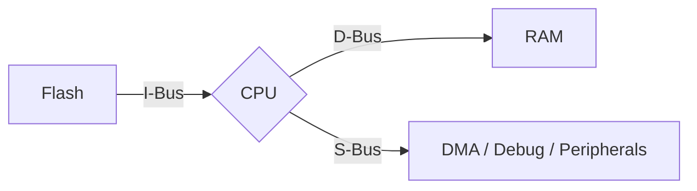
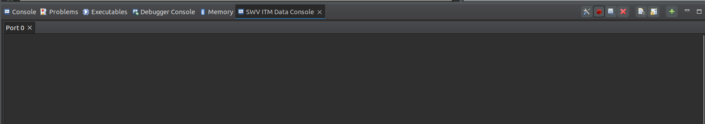

# STM32 Programlama Notları

## Gerekli Dökümanlar

- **Reference Manual**
- **Technical Reference Manual**
    - **RCC (Reset and Clock Control):** Clock mimarisini anlatır
- **Datasheet:**
    - **Memory Mapping:** MCU’nun Flash, RAM ve peripheral register’larının adres uzayında hangi başlangıç adreslerinde ve hangi aralıklarda konumlandığını gösteren bölümdür.
    - **Alternate Function Mapping:** Pinlerin hangi alternatif işlevleri desteklediğini gösterir.
    - **Block Diagram:** MCU içindeki birimlerin birbirine fiziksel bağlantılarını görsel olarak sunar.
    - **Bus Matrix:** MCU'nun verinin nereden nereye, hangi yollarla, ne hızda ve nasıl aktığını sistem seviyesinde tanımlar
- **Cortex-M4 Devices Generic User Guide**
    - **Interrupt Program Status Register:** İşlemcinin hangi interrupt veya exception içinde çalıştığını nasıl tespit edeceğini öğretir.Exception numaraları, handler bağlamı ve interrupt akışının yazılım tarafından nasıl okunacağını açıklar.
    - **General Data Processing Instructions:** ARM çekirdeğinde aritmetik, mantıksal ve veri taşıma işlemlerinin assembly seviyesinde nasıl yapıldığını öğretir. **ADD, SUB, MOV, AND, ORR** gibi talimatların çalışma mantığı ve etkiledikleri bayraklar bu bölümde açıklanır.


| Özellik | Generic User Guide | Technical Reference Manual (TRM) |
|--------|--------|--------------------|
| Tür | Kullanım Kılavuzu | Teknik Spesifikasyon |
| Hedef | "How to use?" | "How it works?" |
| Odağı | Yazılım Geliştirme | Donanım Tasarımı |
| Seviye | Üst seviye, pratik | Düşük seviye, detaylı |


## Bus
- **I-Bus (Instruction Bus / ICODE):** CPU’nun Flash / Instruction memory’den komutları (instruction) almak için kullandığı veri yoludur.
    - CPU’nun çalıştıracağı komutları almak için kullandığı veri yoludur.
    - Genellikle Flash memory’ye bağlıdır.
    - CPU her clock’ta instruction fetch yaptığı için sürekli aktiftir.
- **D-Bus (Data Bus / DCODE):** CPU’nun RAM ve peripheral register’larından veri okuma/yazma işlemleri için kullandığı veri yoludur.
    - CPU’nun RAM veya peripheral register’larına veri okuma/yazma yaptığı veri yoludur.
    - Load (LDR) ve Store (STR) talimatları bu yolu kullanır.
    - Stack erişimleri (push/pop) de bu bus üzerindendir.
- **S-Bus (System Bus):** DMA, debug birimleri ve diğer sistem bileşenlerinin bellek ve peripheral’lara erişimini sağlayan ortak veri yoludur.
    - DMA, Debug (SWD/SWV)
    - Peripheral bus köprüleri bu bus üzerinden çalışır.



!!! note "Not"
    - I-Bus komutları, D-Bus CPU verilerini, S-Bus ise sistem bileşenlerinin bellek erişimini taşır; amaç paralellik ve performanstır.
    - I-Bus → Komutlar ve salt-okunur içerik
    - D-Bus → Değişken veri (RAM, stack, heap)

!!! note "Not"
    STM32 tabanlı embedded sistemlerde const anahtar kelimesi, bir verinin bellekte nereye yerleştirileceğini, hangi bus üzerinden erişileceğini ve çalışma zamanı davranışını doğrudan belirler.
    - `const char` Veri Flash memory içerisinde, genellikle .rodata (read-only data) bölümüne yerleştirilir. CPU bu veriye Instruction Bus (I-Bus) üzerinden erişir. RAM tüketimi yoktur.
    - `char` Veri RAM içerisine yerleştirilir (.data veya .bss bölgesi). CPU erişimi Data Bus (D-Bus) üzerinden gerçekleştirilir.

## STM32CubeIDE Debug

- **Breakpoint (Yazılım Kırılma Noktası):** Belirli bir kod satırında programın durdurulmasını sağlar.
- **Watchpoint (Data Watchpoint):** Belirli bir değişken veya bellek adresi okunduğunda/yazıldığında CPU’yu durdurur.
- **Step Debug Komutları:** 
    - **Step Into:** Fonksiyonun içine girer.
    - **Step Over:** Fonksiyonu tek adımda geçer.
    - **Step Return (Step Out):** Mevcut fonksiyondan çıkar.
- **Variables View:** Geçerli scope’taki local, global ve static değişkenleri otomatik gösterir.
- **Expressions View:** Kullanıcı tarafından manuel tanımlanan değişken ve ifadeleri izler.
- **Registers View:** CPU register’larını (R0–R15, SP, LR, PC, xPSR) gösterir.
- **Memory View:** Belirli bir bellek adresinin içeriğini ham (raw) olarak gösterir.
- **Disassembly View:** C kodunun karşılık geldiği assembly talimatlarını gösterir.
- **Live Expressions / Live Variables:** Program çalışırken (halt etmeden) değişkenleri izleme imkânı sunar. 
- **Fault Analysis (HardFault / UsageFault):** Stack frame, Register durumu, Fault status register’ları incelenebilir.
- **SWV / ITM Trace (Varsa):** Gerçek zamanlı veri ve log akışı sağlar. 
- **SFR (Special Function Registers) Window:** Bu pencereler, STM32 üzerinde yazılımın bellek, register ve yürütme durumunun farklı seviyelerde gözlemlenmesini sağlar.
### ITM Tabanlı printf Debug
`ITM_SendChar` fonksiyonu, `printf` çağrılarının libc seviyesinde kullandığı `_write` syscall’ini donanıma bağlamak amacıyla **syscalls.c** dosyasına eklenir. Bu yapı sayesinde standart çıktı, UART kullanmadan SWD/ITM hattı üzerinden debug arayüzüne yönlendirilir. (Bu yöntem, Cortex-M3 ve üzeri çekirdeklerde desteklenen ITM altyapısını kullanır ve debug sırasında minimum runtime overhead ile loglama imkânı sağlar)

```c title="syscalls.c"
#define DEMCR           (*((volatile uint32_t*)0xE000EDFC))
#define ITM_STIMULUS0   (*((volatile uint32_t*)0xE0000000))
#define ITM_TCR         (*((volatile uint32_t*)0xE0000E00))

void ITM_SendChar(uint8_t ch) {
    DEMCR |= (1 << 24);        // TRCENA enable
    ITM_TCR |= 1;              // ITM Stimulus Port 0 enable
    while ((ITM_STIMULUS0 & 1) == 0);
    ITM_STIMULUS0 = ch;
}

__attribute__((weak)) int _write(int file, char *ptr, int len)
{
  (void)file;
  int DataIdx;

  for (DataIdx = 0; DataIdx < len; DataIdx++)
  {
    // __io_putchar(*ptr++);
    ITM_SendChar(*ptr++);
  }
  return len;
}
```

- **Debug Configurations → ST-Link GDB Server**
    - Interface: SWD
    - SN: (Hedef cihaza ait seri numarası)
    - Serial Wire Viewer (SWV): Enable edilir
- **SWV ITM Data Console’un Açılması**
    - **Window → Show View → SWV → SWV ITM Data Console** seçilir.
    - Sağ üstte yer alan Configure Trace butonu ile trace ayarları yapılır.
    - ITM Port 0 seçilir. (Port 0’ın seçilme nedeni, yazılım tarafında verinin `ITM_STIMULUS0` üzerinden, yani ITM’nin 0 numaralı stimulus portundan gönderilmesidir.)
    - Ayarlar tamamlandıktan sonra Start Trace butonuna basılarak izleme başlatılır.

Bu işlemler sonucunda, uygulama içerisindeki `printf` çıktıları SWD/ITM hattı üzerinden gerçek zamanlı olarak SWV ITM Data Console ekranında görüntülenir. (printf son kısmında `\n` kullanılmalıdır.)

!!! example "Not" 
    Alt kısımda yer alan görsel, SWV ITM Data Console ekranını göstermektedir; sağ üstteki ilk buton Configure Trace, ikinci buton ise Start Trace işlevini yerine getirir.
       

## Register
- Debug Modunda -> **Window → Show View → Registers**, debug sırasında CPU’nun o anki donanımsal durumunu doğrudan görmenizi sağlar.
- **R0–R3:** Fonksiyonlara gönderilen parametrelerin ve fonksiyonlardan dönen sonuçların taşınması için standart olarak kullanılan, aynı zamanda bir kesme (interrupt) meydana geldiğinde donanım tarafından otomatik olarak korunarak stack’e kaydedilen, bu sayede program akışının bozulmasını önleyen en kritik ve en sık kullanılan register’lardır.
- **R4–R11:** Fonksiyonların veya algoritmaların daha uzun süre boyunca ihtiyaç duyduğu ara değerleri tutmak için kullanılan, içerikleri fonksiyonlar arasında rastgele değişmemesi gereken ve bu yüzden kullanılan fonksiyon tarafından korunması beklenen, görece daha “kalıcı” çalışma register’larıdır.
- **R12 (IP – Intra-Procedure Register):** Çoğunlukla derleyici tarafından fonksiyon çağrıları sırasında veya karmaşık işlemlerde kısa ömürlü geçici değerleri tutmak amacıyla kullanılan, yazılımcının doğrudan anlam yüklemesinin beklenmediği ve daha çok derleyicinin iç düzenini kolaylaştıran yardımcı bir register’dır.
- **SP (Stack Pointer):** Stack’in tepe adresini gösteren ve fonksiyon çağrıları ile kesmelerin güvenli şekilde çalışmasını sağlayan hayati bir register’dır; Cortex-M mimarisinde stack aşağı doğru büyür, interrupt’lar her zaman MSP’yi kullanırken uygulama kodları PSP üzerinden çalışabilir ve bu çift stack yapısı sistemin hem kararlı hem de güvenli olmasını sağlar.
- **xPSR (Program Status Register):** İşlemcinin o anki çalışma durumunu özetleyen ve üç farklı bölümden oluşan temel bir register’dır; APSR yapılan işlemlerin sonucunu ve karşılaştırma bilgilerini tutarken, IPSR işlemcinin bir kesme içinde olup olmadığını gösterir ve EPSR ise işlemcinin komutları hangi çalışma biçiminde yürüttüğünü belirleyerek sistemin doğru ve güvenli şekilde çalışmasını sağlar.
- **PC (Program Counter):** İşlemcinin her an hangi komutu çalıştıracağını belirleyen, program akışının kalbi sayılabilecek register’dır; normalde komutlar sırayla ilerledikçe artar, dallanma ve fonksiyon çağrılarıyla kontrollü biçimde değiştirilir ve kesmeler sırasında stack üzerinden korunarak programın kaldığı yerden güvenli şekilde devam etmesini sağlar
- **LR (Link Register):** Fonksiyon çağrıları sırasında programın geri döneceği adresi saklayan ve böylece kod akışının doğru yerden devam etmesini sağlayan kritik bir register’dır; normal fonksiyonlarda gerçek bir geri dönüş adresi tutarken, interrupt durumlarında özel kodlanmış değerler alarak işlemcinin hangi moda ve hangi stack yapısına döneceğini belirler.

## RCC
Modern mikrodenetleyici mimarilerinde çevre birimlerinin (peripheral) kullanımı, yalnızca ilgili register’lara değer yazmakla sınırlı değildir. STM32 ailesinde bir peripheral’ın aktif olarak çalışabilmesi için önce saatinin (peripheral clock) açılması zorunludur. Bu yaklaşım, performanstan çok güç verimliliğini ve sistem kontrolünü merkeze alan bir tasarım tercihidir.

Mikrodenetleyici reset veya power-on sonrası başlatıldığında, hemen hemen tüm peripheral clock’lar kapalı durumdadır. Bunun nedeni basittir: kullanılmayan donanım bloklarının clock alması, gereksiz güç tüketimine yol açar. Bu nedenle STM32, yazılımcıyı bilinçli olmaya zorlar; “kullanacaksan aç, işin bitince kapat” yaklaşımı benimsenmiştir.

Bu clock yönetimi, STM32 mimarisinde RCC (Reset and Clock Control) adı verilen sistem peripheral’ı üzerinden yapılır. RCC, mikrodenetleyicinin kalbi sayılabilecek bir bloktur ve AHB, APB, memory domain gibi tüm clock alanlarının kontrolünden sorumludur.

Bir peripheral’ın register’larına yazılan değerlerin etkili olabilmesi için, o peripheral’ın clock alıyor olması gerekir. Aksi halde, yazılım doğru olsa bile donanım bu konfigürasyonu yok sayar. Bu durum, özellikle düşük seviyeli (register-level) programlama yapanlar için kritik bir farkındalıktır.

Örneğin ADC peripheral’ı ele alındığında, ADC’nin kontrol register’larından biri olan CR1 üzerinde bir bit set edilmek istenebilir. Register adresi doğru hesaplanmış, pointer doğru tanımlanmış ve ilgili bit set edilmiş olsa bile, ADC clock’u RCC üzerinden açılmamışsa bu değişiklik donanımda karşılık bulmaz. Debug sırasında SFR (Special Function Register) penceresinde bitin hâlâ sıfır olduğu açıkça görülür.

## MCO (Microcontroller Clock Output)

MCO, STM32 mikrodenetleyicilerinde dahili saat sinyalini dışarıya çıkarmak için kullanılan bir pin özelliğidir. Mikrodenetleyicinin iç saat kaynaklarından birini seçerek bu sinyali bir GPIO pininden dış dünyaya sağlar.

STM32 mikrodenetleyicilerde MCO1 ve MCO2 olmak üzere iki adet clock output sinyali bulunur. Bunlar doğrudan fiziksel pinler değil, mikrodenetleyici içindeki sinyallerdir. Yazılım yoluyla seçilen bu sinyaller, uygun GPIO pinlerine yönlendirilerek dışarı alınır.

- Sistem saat sinyalini ölçmek için
- PLL çıkışını doğrulamak için
- Saat kaynaklarının stabilitesini test etmek
- Diğer mikrokontrolörleri senkronize etmek
- Harici ADC/DAC'ler için saat sinyali sağlamak
- Communication cihazlarına (Ethernet, USB) saat sağlamak

## HSI (High Speed Internal)
Mikrodenetleyici içinde yer alan dahili RC osilatördür. Harici bileşen gerektirmeden sistem saat kaynağı sağlar. Başlatma süresi kısa ve maliyeti düşüktür; ancak frekans doğruluğu ve sıcaklık kararlılığı sınırlıdır. Genellikle genel amaçlı MCU çalışması, düşük maliyetli uygulamalar ve yüksek hassasiyet gerektirmeyen haberleşme senaryolarında kullanılır.

## HSE (High Speed External)
Mikrodenetleyici dışına bağlanan kristal veya harici osilatör tabanlı saat kaynağıdır. Yüksek frekans doğruluğu, düşük jitter ve uzun vadeli kararlılık sunar. USB, Ethernet, CAN, RF ve hassas zamanlama gerektiren uygulamalarda tercih edilir. Harici bileşen gereksinimi ve daha uzun başlatma süresi dezavantajlarıdır.

## Vektör Tablosu Nedir?
Vektör tablosu, işlemcinin içine yüklediğimiz kodun en başında yer alan bir adres listesidir. Bu tablo, "Eğer şu olay (kesme/hata) gerçekleşirse, bellekteki şu adrese git ve oradaki kodu çalıştır" diyen bir rehberdir.
- **Tanım:** Vektör tablosu, aslında bir adresler tablosudur.
- **İçerik:** Bu tabloda "Exception Handler" (İstisna İşleyicileri) ve "Interrupt Handler" (Kesme İşleyicileri) dediğimiz özel fonksiyonların bellek adresleri tutulur.
- **Kapsam:** Cortex-M4 mimarisinde (STM32F407 gibi) genellikle 15 sistem istisnası ve 240'a kadar harici kesme (interrupt) bulunur.
- **Position (Konum/IRQ Numarası):** NVIC (Kesme Denetleyicisi) açısından kesmenin numarasıdır. Sistem istisnalarının (Reset, NMI vb.) konumları sabittir, üretici (ST) bunları değiştiremez çünkü ARM tasarımıdır.
- **Priority (Öncelik):** Hangi olayın daha önemli olduğunu belirler. Reset (-3), NMI (-2) ve HardFault (-1) en yüksek önceliğe sahiptir ve sabittir (fixed). Diğerleri yazılımla değiştirilebilir (settable).
- **Address (Adres):** En önemli kısımdır. İşlemci bir kesme aldığında, o kesmeye ait fonksiyonun kodunun bellekte nerede olduğunu bu sütundaki adrese bakarak anlar.
## ARM GCC Inline Assembly

- Inline assembly, C/C++ kodu içinde `asm` veya `__asm__` anahtar kelimesi ile doğrudan assembly (işlemci komutu) yazılmasıdır.
- `volatile` "Bu kod yan etkilidir, sakın optimize etme" anlamına gelir.
    - Derleyicinin optimizasyonu devre dışı bırakır
    - Belleğe veya donanım register’larına yazılan değişkenlerin her erişimde gerçekten okunmasını sağlar.
    - **Kesme (ISR)** veya **donanım etkileşimleri** sonucu değişebilecek veriler için zorunludur.  
- **LDR (Load Register)**, ARM mimarisinde RAM’de bulunan bir veriyi alıp CPU register’ına yükleyen assembly talimatıdır
- **STR (Store Register)**, CPU register’ında bulunan bir veriyi RAM’e yazan assembly talimatıdır.
- **ADD**, Register’lar arasında toplama yapar.
- **MOV (Move)**, bir register’a doğrudan bir değeri veya başka bir register’ın içeriğini kopyalar.
- **[] (Bracket kullanımı)**, register’ın bir adres tuttuğunu ve bu adresin işaret ettiği RAM içeriğine erişileceğini ifade eder.
- **= (Literal / Pseudo-instruction)**, assembly seviyesinde sabit bir değerin veya adresin bir register’a yüklenmesini sağlayan derleyici yardımcısıdır.


```c
volatile uint32_t timer_ticks;

int add_numbers(int a, int b) {
    int result;
    __asm volatile("LDR R1, =#0x2001000");
	__asm volatile("LDR R2, =#0x2001004");
	__asm volatile("LDR R0, [R1]");       // [] bellekte adreste bulunan değeri getirmek için kullanılır
	__asm volatile("LDR R1, [R2]");
	__asm volatile("ADD R0, R0, R1");
	__asm volatile("STR R0, [R2]");
    return result;
}
```

!!! note "Not"
    Daha fazla bilgi için **“Cortex‑M4 Devices Generic User Guide”** içindeki **“The Cortex‑M4 Instruction Set”** bölümüne bakın.

## Struct Hizalaması ve Padding
- C’de struct’lar, içindeki en büyük veri tipinin hizalanma gereksinimine göre `padding` ekler.  Bellek düzenini sıkı kontrolü için kullanılır

```c
#pragma pack(push, 1)
typedef struct {
    char a;   // 1 byte
    int  b;   // 4 byte
} PackedStruct;
#pragma pack(pop)


typedef struct __attribute__((packed)) {
    char a;
    int  b;
} PackedStruct;
```


## GPIO Başlatma ve Kullanımı
- Clock Aktifleştirme İlgili GPIO portunun saatini açın: `RCC->AHB1ENR |= RCC_AHB1ENR_GPIOAEN;`
- Pin Modu ve Özellikleri `GPIOx->MODER`, `OTYPER`, `OSPEEDR`, `PUPDR` register’larını kullanarak:

```c
// PA5
GPIOA->MODER   &= ~(3 << (5*2));
GPIOA->MODER   |=  (1 << (5*2));       // 01 = output
GPIOA->OTYPER  &= ~(1 << 5);           // 0 = push‑pull
GPIOA->OSPEEDR |=  (3 << (5*2));       // 11 = high speed
GPIOA->PUPDR   &= ~(3 << (5*2));       // 00 = no pull‑up/down
```

```c title="output" linenums="1"
GPIOA->ODR |=  (1 << 5);  // PA5 = HIGH
GPIOA->ODR &= ~(1 << 5);  // PA5 = LOW
```

```c title="Input" linenums="1"
uint8_t state = (GPIOA->IDR & (1 << 5)) ? 1 : 0;
```

## STM32CubeIDE
- `Ctrl + O`     : Açık dosyada fonksiyon ve sembolleri listeler
- `Ctrl + Space` : Kod tamamlama (auto‑complete)
- **Kod Optimizasyonu (STM32CubeIDE):** `Project > C/C++ Build > Optimization Level` ile derleyici optimizasyon seviyesini belirler.

!!! danger "Not"
    Yüksek optimizasyon **kod boyutunu azaltır**, ancak bazen **kritik kod parçalarını kaldırabilir**.
