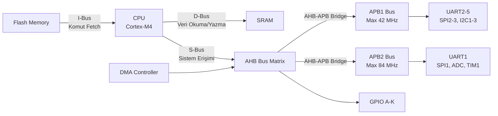
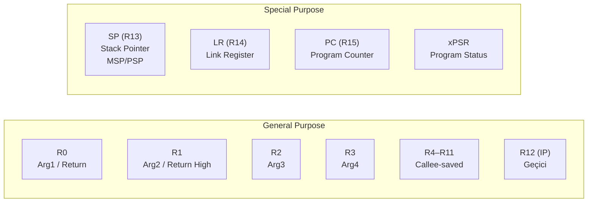

# STM32 Programlama Notları

!!! note "Genel Bakış"
    STM32, STMicroelectronics tarafından üretilen, ARM Cortex-M tabanlı 32-bit mikrodenetleyici ailesidir. Register seviyesinde programlama; CMSIS, HAL ve LL sürücüleri ile desteklenir. Bu bölüm özellikle STM32F4 (Cortex-M4) serisini referans alır.

---

## Gerekli Dökümanlar

| Döküman | Kapsam | Kullanım |
|---------|--------|---------|
| **Datasheet** | Pin haritası, elektriksel özellikler, bellek haritası | Donanım tasarımı |
| **Reference Manual** | Peripheral register'ları, RCC, GPIO, Timer, DMA | Yazılım geliştirme |
| **Cortex-M4 Generic User Guide** | CPU register'ları, komut seti, NVIC, SysTick | Bare-metal / assembly |
| **Cortex-M4 Technical Reference Manual** | Çekirdek donanımının "nasıl çalışır" detayları | Derin optimizasyon |
| **Errata Sheet** | Çip silikon hataları ve geçici çözümler | Üretim kalitesi |

!!! tip "Hangi Dökümanı Ne Zaman?"
    - GPIO/UART/SPI/I2C → **Reference Manual**'daki ilgili peripheral bölümü
    - Cortex-M NVIC, SysTick → **Generic User Guide**
    - Pin alternatif fonksiyonları → **Datasheet Alternate Function Mapping** tablosu

---

## Bus Mimarisi



| Bus | İçerik | Not |
|-----|--------|-----|
| **I-Bus** | Flash → Komut fetch | Her clock'ta aktif |
| **D-Bus** | RAM + peripheral veri | LDR/STR, push/pop |
| **S-Bus** | DMA, debug, sistem peripheral | AHB matrisine bağlı |

!!! note "const ve Bus İlişkisi"
    ```c
    const char mesaj[] = "merhaba";  /* Flash → I-Bus erişimi, RAM kullanmaz */
    char buffer[32];                  /* SRAM → D-Bus erişimi */
    ```

---

## RCC (Reset and Clock Control)

MCU başladığında neredeyse tüm peripheral clock'lar **kapalıdır**. Peripheral kullanmadan önce RCC üzerinden saat açılmazsa, register'a doğru değer yazılsa bile donanım bunu yok sayar.

```c
/* GPIOA clock aktifleştirme */
RCC->AHB1ENR |= RCC_AHB1ENR_GPIOAEN;

/* ADC1 clock aktifleştirme */
RCC->APB2ENR |= RCC_APB2ENR_ADC1EN;

/* USART2 clock aktifleştirme */
RCC->APB1ENR |= RCC_APB1ENR_USART2EN;
```

!!! danger "Clock Açmadan Peripheral Kullanımı"
    Register değeri debug'da SFR penceresinde sıfır görünür ve her yazma işlemi etkisiz kalır. Bu durum, özellikle başlangıç aşamasındaki en yaygın hatadır.

### MCO (Microcontroller Clock Output)

Dahili saat sinyalini GPIO pini üzerinden dışarıya çıkarır. Osilatör stabilitesini ölçmek, PLL çıkışını doğrulamak veya harici cihazlara saat sağlamak için kullanılır.

```c
/* PA8 → MCO1 (HSE) */
RCC->CFGR |= RCC_CFGR_MCO1_1;  /* MCO1 = HSE */
/* PA8'i AF0 moduna al */
GPIOA->MODER |= GPIO_MODER_MODE8_1;
GPIOA->AFR[1] = 0;  /* AF0 = MCO */
```

---

## Register Seti (Cortex-M4)



| Register | Görev | Koruyan |
|----------|-------|:-------:|
| R0–R3 | Parametre + dönüş; kesme'de otomatik stack'e alınır | Caller |
| R4–R11 | Kalıcı değerler; callee korur | Callee |
| R12 (IP) | Derleyici ara değeri | Caller |
| SP (R13) | Stack tepe adresi; MSP veya PSP | Otomatik |
| LR (R14) | Geri dönüş adresi; ISR'da EXC_RETURN | Caller |
| PC (R15) | Sonraki komut adresi | Otomatik |
| xPSR | APSR (bayraklar) + IPSR (kesme no) + EPSR (Thumb T-bit) | Otomatik |

---

## Vektör Tablosu

Flash'ın başında yer alan, her kesme/exception kaynağı için ISR adreslerini tutan dizi.

```c
/* startup_stm32f4xx.s içinde (tipik) */
__Vectors:
    .word  _estack           /* 0x0000_0000 — Başlangıç MSP değeri   */
    .word  Reset_Handler     /* 0x0000_0004 — Reset                  */
    .word  NMI_Handler       /* 0x0000_0008 — Non-Maskable Interrupt */
    .word  HardFault_Handler /* 0x0000_000C — HardFault              */
    .word  MemManage_Handler /* MPU Fault                            */
    .word  BusFault_Handler
    .word  UsageFault_Handler
    /* ... */
    .word  EXTI0_IRQHandler  /* Harici kesme 0                       */
```

| Öncelik | Exception | Açıklama |
|:-------:|-----------|---------|
| -3 | **Reset** | İşlemci ilk çalıştığında |
| -2 | **NMI** | Non-maskable; sönmez |
| -1 | **HardFault** | Tüm hataların son noktası |
| Ayarlı | SysTick | RTOS tick kaynağı |
| Ayarlı | IRQ 0–239 | Peripheral kesmeler (EXTI, UART vb.) |

---

## GPIO

### Register'lar

| Register | Bit Genişliği | Açıklama |
|----------|:------------:|---------|
| `MODER` | 2 bit/pin | 00=Giriş, 01=Çıkış, 10=AF, 11=Analog |
| `OTYPER` | 1 bit/pin | 0=Push-Pull, 1=Open-Drain |
| `OSPEEDR` | 2 bit/pin | 00=Düşük, 01=Orta, 10=Hızlı, 11=Çok Hızlı |
| `PUPDR` | 2 bit/pin | 00=Yok, 01=Pull-Up, 10=Pull-Down |
| `ODR` | 1 bit/pin | Çıkış veri register'ı |
| `IDR` | 1 bit/pin | Giriş veri register'ı |
| `BSRR` | 32 bit | [15:0]=Set, [31:16]=Reset; atomik |

```c
/* Tam GPIO başlatma — PA5 çıkış */
RCC->AHB1ENR |= RCC_AHB1ENR_GPIOAEN;    /* 1. Clock aç */

GPIOA->MODER   &= ~(3UL << (5*2));
GPIOA->MODER   |=  (1UL << (5*2));       /* 01 = Çıkış */
GPIOA->OTYPER  &= ~(1UL << 5);           /* 0  = Push-Pull */
GPIOA->OSPEEDR |=  (3UL << (5*2));       /* 11 = Very High Speed */
GPIOA->PUPDR   &= ~(3UL << (5*2));       /* 00 = No Pull */

/* Kullanım */
GPIOA->BSRR = (1 << 5);        /* PA5 = HIGH (atomik) */
GPIOA->BSRR = (1 << (5 + 16)); /* PA5 = LOW  (atomik) */

uint8_t pin = (GPIOA->IDR >> 5) & 1; /* PA5 oku */
```

!!! tip "BSRR vs ODR"
    `ODR` doğrudan yazma RMW (Read-Modify-Write) gerektirir ve kesme bağlamında **atomik değildir**. `BSRR` tek yazmayla set/reset yapar — her zaman `BSRR` tercih edin.

---

## Inline Assembly (ARM GCC)

```c
/* Temel sözdizimi */
__asm volatile (
    "ASM_KOMUT operand1, operand2"
    : /* çıkış kısıtları */
    : /* giriş kısıtları */
    : /* clobber listesi */
);
```

| Komut | Açıklama |
|-------|---------|
| `MOV Rd, Rn` | Rn değerini Rd'ye kopyala |
| `LDR Rd, [Rn]` | Rn adresindeki bellekten Rd'ye yükle |
| `STR Rn, [Rd]` | Rn'yi Rd adresine yaz |
| `ADD Rd, Rn, Rm` | Rd = Rn + Rm |
| `DSB` | Data Synchronization Barrier |
| `ISB` | Instruction Synchronization Barrier |
| `NOP` | İşlem yok (zamanlama için) |

```c
volatile uint32_t val;

__asm volatile (
    "LDR R1, =0x20001000   \n"
    "LDR R0, [R1]          \n"   /* R0 = RAM[0x20001000] */
    "ADD R0, R0, #1        \n"   /* R0++ */
    "STR R0, [R1]          \n"   /* Geri yaz */
    ::: "r0", "r1", "memory"
);
```

!!! note "volatile ve Inline Assembly"
    `__asm volatile` derleyicinin bu kodu optimize edip kaldırmasını engeller. Donanım register'larına veya donanım etkisine sahip belleklere erişimde zorunludur.

---

## ITM ile printf Debug

UART kullanmadan `printf` çıktısını SWD/ITM hattı üzerinden alma yöntemi.

```c title="syscalls.c"
#define DEMCR         (*((volatile uint32_t*)0xE000EDFC))
#define ITM_STIMULUS0 (*((volatile uint32_t*)0xE0000000))
#define ITM_TCR       (*((volatile uint32_t*)0xE0000E00))

void ITM_SendChar(uint8_t ch) {
    DEMCR |= (1 << 24);                    /* TRCENA enable */
    ITM_TCR |= 1;                          /* Stimulus Port 0 enable */
    while ((ITM_STIMULUS0 & 1) == 0);      /* Port hazır olana dek bekle */
    ITM_STIMULUS0 = ch;                    /* Karakteri gönder */
}

__attribute__((weak)) int _write(int file, char *ptr, int len) {
    (void)file;
    for (int i = 0; i < len; i++)
        ITM_SendChar((uint8_t)ptr[i]);
    return len;
}
```

**Yapılandırma Adımları:**

1. Debug Configuration → ST-Link → Interface: **SWD** + **Serial Wire Viewer (SWV): Enable**
2. **Window → Show View → SWV → SWV ITM Data Console**
3. "Configure Trace" → **ITM Port 0** seç → **Start Trace**

!!! example "SWV ITM Data Console"
    

---

## STM32CubeIDE — Debug Görünümleri

| Görünüm | Açıklama |
|---------|---------|
| **Variables** | Geçerli scope'taki yerel/global/static değişkenler |
| **Expressions** | Kullanıcı tanımlı ifade ve değişken izleme |
| **Registers** | CPU register'ları (R0–R15, xPSR, MSP, PSP) |
| **SFR Window** | Peripheral register'ları; clock açık olmazsa sıfır gösterir |
| **Memory** | Belirli bir adresten ham bellek içeriği |
| **Disassembly** | C kodu ↔ Assembly görünümü |
| **Live Expressions** | Halt etmeden çalışırken değişken izleme |

| Debug Komutu | Kısayol | Açıklama |
|-------------|:-------:|---------|
| Step Into | F5 | Fonksiyon içine girer |
| Step Over | F6 | Fonksiyonu tek adımda geçer |
| Step Return | F7 | Mevcut fonksiyondan çıkar |
| Resume | F8 | Bir sonraki breakpoint'e kadar çalıştır |

!!! tip "Watchpoint Kullanımı"
    Değişken değiştiğinde programı durdur: **Expressions** görünümünde değişkene sağ tıkla → **Add Watchpoint**. Bellek bozulma ve beklenmedik değişim sorunlarında çok değerlidir.

---

## Struct Hizalaması ve Padding

C'de struct'lar içindeki en büyük tipinin hizalama gereksinimine göre padding ekler.

```c
struct Normal {
    char  a;   /*  1 byte  */
               /*  3 byte padding  */
    int   b;   /*  4 byte — toplam 8 byte */
};

/* Padding kaldır — donanım register map veya network paket için */
#pragma pack(push, 1)
typedef struct {
    char a;    /* 1 byte */
    int  b;    /* 4 byte — toplam 5 byte */
} PackedStruct;
#pragma pack(pop)

/* GCC alternatifi */
typedef struct __attribute__((packed)) {
    char a;
    int  b;
} PackedGCC;
```

!!! warning "Packed Struct ve Performans"
    Hizalanmamış erişim bazı ARM mimarilerinde (Cortex-M0) `HardFault` yaratır. Cortex-M3/M4 hizalanmamış erişimi destekler ancak ek döngü maliyeti oluşturur. Packed struct'ı yalnızca gerektiğinde (register haritası, protokol çerçevesi) kullanın.

---

## STM32CubeIDE Kısayolları

| Kısayol | Açıklama |
|---------|---------|
| `Ctrl + Space` | Kod tamamlama |
| `Ctrl + O` | Açık dosyada fonksiyon/sembol listesi |
| `Ctrl + Shift + F` | Kod biçimlendirme |
| `F3` | Tanıma git |
| `Alt + ←` | Önceki konuma geri dön |
| `Ctrl + F` | Dosyada ara |
| `Ctrl + H` | Proje genelinde ara |

!!! danger "Optimizasyon ve Debug"
    Yüksek optimizasyon (`-O2`, `-O3`) değişkenleri optimize edip kaldırabilir; debug'da değerler yanlış görünür veya breakpoint'ler çalışmaz. Debug yapılarında `-O0` veya `-Og` (debug-friendly) kullanın.