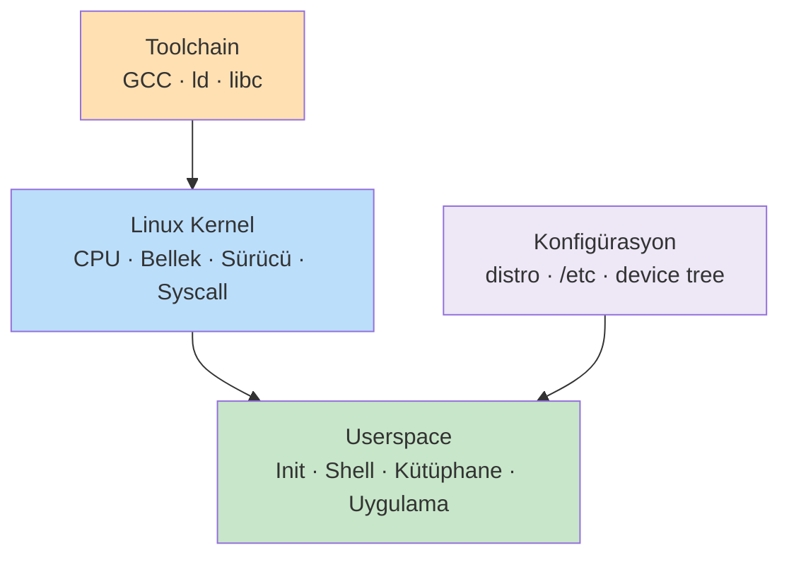
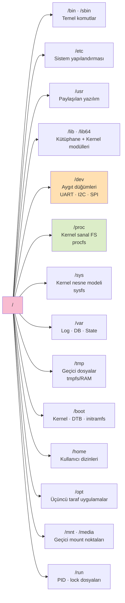
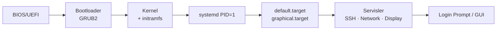

# Linux Temel Bilgiler

!!! note "Genel Bakış"
    Linux, **Kernel + Userspace + Toolchain + Konfigürasyon** katmanlarından oluşan özgür ve açık kaynaklı bir işletim sistemi çekirdeğidir. Gömülü cihazlardan sunuculara kadar geniş bir yelpazede kullanılır. Bu bölüm hem masaüstü/sunucu hem de gömülü Linux geliştirme için temel kavramları kapsar.



---

## Temel Kavramlar

| Kavram | Açıklama |
|--------|----------|
| `#` | Terminalde **root** kullanıcısını simgeler. Shell betiklerinde yorum satırıdır. |
| `$` | Terminalde standart kullanıcıyı simgeler. |
| **Soft Link** | Hedef dosyanın yoluna referans; asıl dosya silinirse işlevsiz kalır. |
| **Hard Link** | Dosyanın inode'una doğrudan bağlanır; asıl dosya silinse de veri korunur. |
| **inode** | Dosyanın veri bloklarını ve meta bilgilerini (izin, boyut, tarih) tutan benzersiz yapı. |
| **Daemon** | Sistem başlangıcında başlayan, arka planda çalışan uzun ömürlü servisler. |
| **Process** | Bellekte yürütülen, belirli bir yaşam döngüsüne sahip aktif program örneği. |
| **Scheduler** | CPU zamanını process'ler arasında paylaştıran kernel alt sistemi. |
| **Polling** | CPU'nun bir donanımın durumunu belirli aralıklarla aktif olarak kontrol etmesi. |

!!! tip "Büyük/Küçük Harf Duyarlılığı"
    Linux **büyük/küçük harf duyarlıdır.** `File.txt` ile `file.txt` farklı dosyalardır. `README.md` ≠ `readme.md`

---

## Dosya Sistemi Hiyerarşisi (FHS)



| Dizin | Açıklama |
|-------|----------|
| `/` | Tüm dosya sisteminin kökü. |
| `/bin`, `/sbin` | Kritik sistem komutları. Modern distro'larda `/usr/bin`'e symlink. |
| `/etc` | Statik sistem yapılandırma dosyaları (ağ, kullanıcı, güvenlik). |
| `/usr` | Paylaşılan kullanıcı programları ve kütüphaneler (salt okunur). |
| `/lib`, `/lib64` | Dinamik kütüphaneler ve kernel modülleri (`/lib/modules/<versiyon>/`). |
| `/dev` | Donanım aygıt düğümleri — UART, I2C, SPI, disk vb. kernel'in userspace arayüzü. |
| `/proc` | Kernel runtime durumunun sanal görünümü (procfs). |
| `/sys` | Kernel nesne modelinin userspace arayüzü (sysfs). |
| `/var` | Çalışma zamanında değişen kalıcı veriler — loglar, state. |
| `/tmp` | Geçici dosyalar; genellikle RAM'de (tmpfs). Yeniden başlatmada silinir. |
| `/boot` | Kernel image, DTB, initramfs gibi önyükleme dosyaları. |

!!! info "/proc — Debug İçin Kullanışlı Dosyalar"
    | Dosya | İçerik |
    |-------|--------|
    | `/proc/cmdline` | Kernel başlatma parametreleri |
    | `/proc/meminfo` | Bellek kullanım bilgisi |
    | `/proc/cpuinfo` | İşlemci bilgisi |
    | `/proc/<pid>/` | Belirli bir process'in detayları |
    | `/proc/<pid>/maps` | Process bellek haritası |
    | `/proc/<pid>/fd/` | Açık dosya tanımlayıcıları |

---

## Dosya Türleri ve İzinler

### Dosya Türleri

`ls -l` çıktısında baştaki karakter dosya türünü belirtir:

| Karakter | Tür |
|:--------:|-----|
| `-` | Düzenli dosya (Regular File) |
| `d` | Dizin (Directory) |
| `l` | Sembolik Link |
| `c` | Karakter Aygıtı (terminal, seri port) |
| `b` | Blok Aygıtı (disk, USB) |
| `s` | Soket (Socket) |
| `p` | Adlandırılmış Boru Hattı (Named Pipe / FIFO) |

!!! tip "Gizli Dosyalar"
    Adı `.` ile başlayan dosyalar gizlidir; `ls -a` ile görüntülenebilir. `.bashrc`, `.gitconfig`, `.ssh/` gibi yapılandırma dosyaları bu gruptadır.

### Dosya İzinleri

```
  Tür     Sahip    Grup     Diğer
   d      r w x    r w -    - w -

   r (Read / Okuma)       = 4
   w (Write / Yazma)      = 2
   x (Execute / Çalıştır) = 1
   - (İzin yok)           = 0
```

Örnek: `rwxr-x---` → sahip: **7**, grup: **5**, diğer: **0** → `chmod 750`

```bash
chmod 755 script.sh      # rwxr-xr-x
chmod +x  script.sh      # Sadece execute ekle
chmod g-w dosya.txt      # Gruptan yazma kaldır
chmod u=rw,go=r dosya    # Detaylı format

chown serkan:arge dosya.txt   # Sahip ve grup değiştir
chgrp arge dizin              # Sadece grup
```

---

## G/Ç Yönlendirme Operatörleri

| Operatör | Açıklama |
|----------|----------|
| `>` | Stdout'u dosyaya yazar; dosya varsa **üzerine yazar**. |
| `>>` | Stdout'u dosyanın **sonuna ekler**; mevcut veriyi korur. |
| `<` | Stdin'i klavye yerine **dosyadan alır**. |
| `2>` | Yalnızca **stderr** (hata mesajları) dosyaya yönlendirir. |
| `&>` | Hem stdout hem stderr'ı aynı dosyaya yönlendirir. |
| `tee` | Çıktıyı hem terminale basar hem dosyaya yazar. `-a` ile ekler. |
| `;` | Komutları sırayla çalıştırır; başarı durumu gözetilmez. |
| `&&` | Sol komut başarılıysa sağdakini çalıştırır. |
| `\|\|` | Sol komut başarısızsa sağdakini çalıştırır. |
| `&` | Komutu **arka planda** çalıştırır; terminal serbest kalır. |
| `\|` | Bir komutun çıktısını bir sonrakinin girdisine bağlar. |

```bash
echo "merhaba" > dosya.txt          # Dosyaya yaz (üzerine yazar)
ls >> dosya.txt                      # Dosyaya ekle
cat < dosya.txt                      # Dosyadan oku
telnet localhost 2> hata.txt         # Hataları dosyaya yönlendir
ls /tmp 2>/dev/null                  # Hata mesajını yok say
komut &> tum_cikti.txt               # Stdout + stderr → dosya
echo "merhaba" | tee -a dosya.txt   # Hem ekrana hem dosyaya yaz
cmd1 && cmd2                         # cmd1 başarılıysa cmd2 çalışır
cmd1 || cmd2                         # cmd1 başarısızsa cmd2 çalışır
sleep 10 &                           # Arka planda çalıştır
```

---

## Regular Expression (Regex)

=== "Temel Karakterler"

    | Karakter | Anlamı | Örnek | Eşleşen |
    |----------|--------|-------|---------|
    | `.` | Herhangi bir karakter | `a.c` | `abc`, `axc`, `a1c` |
    | `*` | Öncekinden 0 veya daha fazla | `ab*c` | `ac`, `abc`, `abbc` |
    | `+` | Öncekinden 1 veya daha fazla (ERE) | `ab+c` | `abc`, `abbc` |
    | `?` | Önceki opsiyonel (ERE) | `colou?r` | `color`, `colour` |
    | `^` | Satır başı | `^Hata` | "Hata" ile başlayan satırlar |
    | `$` | Satır sonu | `Hata$` | "Hata" ile biten satırlar |
    | `[]` | Karakter sınıfı | `[abc]` | `a`, `b` veya `c` |
    | `[^]` | Hariç tutma | `[^0-9]` | Rakam olmayan her karakter |
    | `{n,m}` | n ile m arası tekrar | `a{2,4}` | `aa`, `aaa`, `aaaa` |
    | `()` | Gruplama | `(ab)+` | `ab`, `abab`, `ababab` |
    | `\|` | Alternatif (veya) | `kedi\|köpek` | `kedi` veya `köpek` |
    | `\d` | Rakam | `\d{3}` | `123` |
    | `\w` | Kelime karakteri | `\w+` | `merhaba_123` |
    | `\s` | Boşluk karakteri | `\s+` | boşluk, tab |

=== "POSIX Sınıfları"

    | Sınıf | Anlamı |
    |-------|--------|
    | `[[:digit:]]` | Rakamlar (0–9) |
    | `[[:alpha:]]` | Harfler |
    | `[[:alnum:]]` | Harf ve rakamlar |
    | `[[:space:]]` | Boşluk karakterleri |
    | `[[:upper:]]` | Büyük harfler |
    | `[[:lower:]]` | Küçük harfler |
    | `[[:punct:]]` | Noktalama işaretleri |

=== "grep Örnekleri"

    ```bash
    grep "hata" dosya.log                                          # Tam eşleşme
    grep -i "hata" dosya.log                                       # Büyük/küçük harf duyarsız
    grep "^Error" dosya.log                                        # Satır başı
    grep "failed$" dosya.log                                       # Satır sonu
    grep -E "[0-9]+" dosya.log                                     # ERE ile rakam ara
    grep -E "([0-9]{1,3}\.){3}[0-9]{1,3}" dosya.log              # IP adresi
    grep -E "hata|uyarı" dosya.log                                 # Birden fazla kalıp
    grep -v "debug" dosya.log                                      # Eşleşmeyenleri göster
    grep -r -E "TODO|FIXME" /proje/                                # Özyinelemeli arama
    grep -o -E "[a-zA-Z0-9._%+-]+@[a-zA-Z0-9.-]+\.[a-zA-Z]{2,}" dosya.txt
    ```

=== "Yaygın Kalıplar"

    ```text
    # E-posta
    [a-zA-Z0-9._%+-]+@[a-zA-Z0-9.-]+\.[a-zA-Z]{2,}

    # IPv4 adresi
    ^([0-9]{1,3}\.){3}[0-9]{1,3}$

    # Tarih (YYYY-MM-DD)
    ^[0-9]{4}-[0-9]{2}-[0-9]{2}$

    # URL
    ^https?://[a-zA-Z0-9.-]+\.[a-zA-Z]{2,}(/\S*)?$

    # Türkiye telefon (05XX XXX XX XX)
    ^0[0-9]{3}[ ]?[0-9]{3}[ ]?[0-9]{2}[ ]?[0-9]{2}$
    ```

!!! note "BRE vs ERE"
    - **BRE (Basic):** `grep`, `sed` varsayılanı. `+`, `?`, `|`, `()` için `\` gerekir.
    - **ERE (Extended):** `grep -E`, `egrep`, `awk`. Özel karakterler doğrudan kullanılır.

---

## Sistem Günlükleri

| Kaynak | Açıklama |
|--------|----------|
| `/var/log/boot.log` | Önyükleme mesajları |
| `/var/log/auth.log` | Kimlik doğrulama ve güvenlik olayları |
| `/var/log/syslog` | Genel sistem mesajları (Debian/Ubuntu) |
| `/var/log/messages` | Genel sistem mesajları (RHEL/CentOS) |
| `/var/log/kern.log` | Kernel detaylı kayıtları |
| `dmesg` | Kernel ring buffer çıktısı |
| `journalctl` | systemd journal kayıtları |

```bash
journalctl -b                     # Son önyüklemeden itibaren tüm loglar
journalctl -u nginx               # Belirli bir servisin logları
journalctl -f                     # Canlı log takibi (tail -f benzeri)
journalctl -p err                 # Sadece hata seviyesi
journalctl --since "1 hour ago"   # Son 1 saatin logları
dmesg | grep -i error             # Kernel hata mesajlarını filtrele
dmesg -T                          # İnsan okunabilir timestamp
```

---

## Run Levels ve Systemd Targets



| Run Level | Anlamı | systemd Target |
|:---------:|--------|----------------|
| 0 | Kapatma | `poweroff.target` |
| 1 | Tek kullanıcı (bakım) | `rescue.target` |
| 3 | Çoklu kullanıcı + ağ | `multi-user.target` |
| 5 | Grafik arayüz + ağ | `graphical.target` |
| 6 | Yeniden başlatma | `reboot.target` |

```bash
systemctl isolate multi-user.target    # Target geçişi
systemctl get-default                  # Varsayılan target
systemctl set-default graphical.target # Varsayılan değiştir
sudo init 3                            # SysV run level değiştir
```

---

## Kernel Modülleri ve Sürücüler

```mermaid
graph LR
    HW[Donanım] --> DRV[Kernel Driver\n.ko modülü]
    DRV --> DEV_NODE[/dev/ttyUSB0\n/dev/i2c-1]
    DEV_NODE --> APP[Kullanıcı Uygulaması]
    DRV --> SYSFS[/sys/bus/...\nSysfs arayüzü]
```

| Komut | Açıklama |
|-------|----------|
| `lsmod` | Yüklü kernel modüllerini listeler |
| `modprobe <modül>` | Modül yükler (bağımlılıkları da yükler) |
| `rmmod <modül>` | Modülü kaldırır |
| `modinfo <modül>` | Modül meta bilgisini gösterir |
| `insmod <dosya.ko>` | Belirtilen `.ko` dosyasını yükler (bağımlılık yönetmez) |

```bash
lsmod | grep usb           # USB ile ilgili modüller
modinfo usbserial          # usbserial modülü hakkında bilgi
sudo modprobe i2c-dev      # i2c-dev modülünü yükle
sudo modprobe -r i2c-dev   # Modülü kaldır
```

---

## Linux Kernel ve Userspace İletişim Mekanizmaları

```mermaid
graph LR
    APP[Kullanıcı Uygulaması\nC / Python / ...] -->|system call| KERNEL[Linux Kernel]
    APP -->|ioctl()| DEV[Cihaz Sürücüsü]
    KERNEL -->|Netlink socket| NL[AF_NETLINK]
    PROC[/proc · /sys · /dev] <--> KERNEL
    APP <--> PROC
```

| Mekanizma | Açıklama |
|-----------|---------|
| **System Call** | Kullanıcı modunun kernel hizmetlerine erişmesi: `open()`, `read()`, `write()`, `ioctl()` |
| **ioctl** | Sürücülere özel kontrol komutları; cihaz özelliklerine göre farklı anlam taşır |
| **Netlink Socket** | Kernel ↔ Userspace mesajlaşma; `AF_NETLINK` ailesi; network config için yaygın |
| **Device File** | `/dev` altındaki düğümler; blok ve karakter aygıtlara okuma/yazma arayüzü |
| **sysfs** | `/sys` üzerinden sürücü ve donanım parametrelerine R/W erişim |
| **procfs** | `/proc` üzerinden kernel runtime state'ini okuma |

---

## Device Tree (Gömülü Linux)

| Format | Açıklama |
|--------|----------|
| `.dts` | Device Tree Source — insan tarafından okunabilir metin |
| `.dtb` | Device Tree Blob — derlenmiş ikili format |
| `.dtso` | Overlay — temel DTB üzerine eklenti |

```bash
dtc -I dts -O dtb -o output.dtb input.dts   # .dts → .dtb derleme
dtc -I dtb -O dts -o output.dts input.dtb   # .dtb → .dts tersine çevirme
cat /proc/device-tree/compatible             # Aktif donanım platformunu gör
```

---

## Terminal Kısayolları

| Kısayol | İşlev |
|---------|-------|
| `Ctrl + C` | Çalışan komutu sonlandırır |
| `Ctrl + Z` | Çalışan komutu duraklatır (arka plana alır) |
| `Ctrl + R` | Komut geçmişinde arama |
| `Ctrl + U` | İmlecin solundaki her şeyi siler |
| `Ctrl + A` | Satır başına git |
| `Ctrl + E` | Satır sonuna git |
| `Ctrl + L` | Terminali temizler (`clear` gibi) |
| `Ctrl + S` | Terminal çıktı akışını durdurur |
| `Ctrl + Q` | Durdurulan akışı sürdürür |
| `Alt + F2` | Komut çalıştırma penceresi (grafik ortam) |