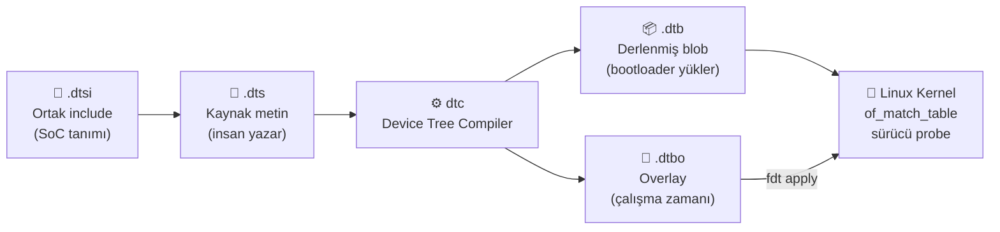
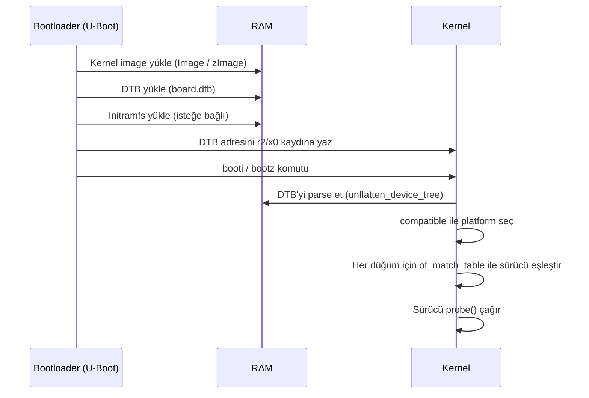

# Device Tree (DTS / DTB)

!!! abstract "Tanım"
    Device Tree, gömülü sistemlerde donanım kaynaklarını (bellek haritası, kesmeler, saatler, GPIO vb.) yazılımdan bağımsız olarak tanımlayan hiyerarşik veri yapısıdır. Kernel'e "hangi donanım var, nerede ve nasıl bağlı" bilgisini bootloader üzerinden aktarır.

    **Neden gerekli?** ARM Linux çekirdeği 2011 öncesinde her kart için ayrı `board file` (arch/arm/mach-*) içeriyordu. Linus Torvalds bu durumu *"a frankly embarrassing mess"* olarak nitelendirdi ve tüm ARM platformlarının Device Tree kullanması zorunlu kıldı. Sonuç: tek bir kernel binary farklı donanımlarda çalışabilir hale geldi.



---

## DTS Sözdizimi

### Temel Yapı

```dts
/dts-v1/;               // DTS versiyon etiketi — zorunlu

#include "bcm2835.dtsi"  // SoC tanımını dahil et

/ {                      // Kök düğüm
    #address-cells = <1>;    // Alt düğümlerin reg adres alanı (kelime sayısı)
    #size-cells    = <1>;    // Alt düğümlerin reg boyut alanı

    compatible = "raspberrypi,3-model-b", "brcm,bcm2837";
    model      = "Raspberry Pi 3 Model B";

    memory@0 {
        device_type = "memory";
        reg = <0x0 0x40000000>;     // başlangıç=0x0, boyut=1 GiB
    };

    chosen {
        bootargs = "console=ttyS0,115200 root=/dev/mmcblk0p2 rootwait";
        stdout-path = "serial0:115200n8";
    };
};
```

### Özellik Türleri

```dts
node@ADRES {
    // 32-bit sayı
    clock-frequency = <125000000>;

    // 32-bit sayı dizisi
    reg = <0x20000000 0x10000>;       // adres + boyut

    // String
    compatible = "vendor,chip-name";

    // String listesi (önce özele, sonra genele)
    compatible = "fsl,imx6ul-uart", "fsl,imx6q-uart";

    // Boolean (sadece varlığı anlamlıdır)
    interrupt-controller;

    // Byte dizisi (MAC adresi vb.)
    local-mac-address = [DE AD BE EF 12 34];

    // Phandle — başka düğüme referans
    clocks = <&clk_ctrl 5>;

    // Boş bırakma
    status = "";

    // Özellik silme (overlay'lerde)
    /delete-property/ some-property;
};
```

---

## Kritik Özellikler

### compatible — Sürücü Eşleştirme

Kernel'in hangi sürücüyü yükleyeceğini belirleyen **en önemli özelliktir.**

```dts
compatible = "vendor,specific-chip", "vendor,generic-family";
//            ^^                      ^^
//            Özel eşleşme (önce)    Genel geri dönüş (sonra)
```

Kernel lookup sırası:
1. `vendor,specific-chip` → eşleşen sürücü arar
2. Bulamazsa `vendor,generic-family` → genel sürücü
3. Hiçbiri yoksa → sürücü yüklenmez, düğüm çalışmaz

```c
// Kernel sürücüsü tarafında
static const struct of_device_id my_ids[] = {
    { .compatible = "vendor,specific-chip" },
    { .compatible = "vendor,generic-family" },
    { }
};
MODULE_DEVICE_TABLE(of, my_ids);
```

### reg — Adres ve Boyut

Üst düğümdeki `#address-cells` ve `#size-cells` kaç kelime kullanılacağını belirler.

```dts
// 32-bit sistem: 1 address-cell, 1 size-cell
uart0: serial@101f1000 {
    reg = <0x101f1000 0x1000>;
//        ^adres      ^boyut
};

// 64-bit sistem: 2 address-cell, 2 size-cell
pcie: pcie@fd000000 {
    reg = <0x0 0xfd000000  0x0 0x1000000>;
//        ^hi ^lo adres    ^hi ^lo boyut
};

// Çoklu bölge (tek reg içinde)
ethernet@ff700000 {
    reg = <0xff700000 0x2000   // MAC kayıtları
           0xffb90000 0x1000>; // PHY kayıtları
};
```

### interrupts — Kesme Tanımı

```dts
// Kesme kontrolörü tanımı
gic: interrupt-controller@1c81000 {
    compatible = "arm,gic-400";
    interrupt-controller;           // Bu düğüm bir kesme kontrolörüdür
    #interrupt-cells = <3>;         // Her kesme için 3 hücre gerekli
    reg = <0x1c81000 0x1000
           0x1c82000 0x2000>;
};

// Kesme kullanan cihaz
uart0: serial@1c28000 {
    interrupt-parent = <&gic>;      // Hangi kontrolöre bağlı
    interrupts = <GIC_SPI 0 IRQ_TYPE_LEVEL_HIGH>;
//               ^tip     ^no  ^tetikleme türü
};

// GPIO kesmesi (çoğu gömülü sistemde yaygın)
sensor@48 {
    interrupt-parent = <&gpio>;
    interrupts = <17 IRQ_TYPE_EDGE_FALLING>; // GPIO17, düşen kenar
};
```

| Tetikleme Türü | Değer | Açıklama |
|----------------|:-----:|---------|
| `IRQ_TYPE_EDGE_RISING` | 1 | Yükselen kenar |
| `IRQ_TYPE_EDGE_FALLING` | 2 | Düşen kenar |
| `IRQ_TYPE_EDGE_BOTH` | 3 | Her iki kenar |
| `IRQ_TYPE_LEVEL_HIGH` | 4 | Seviye yüksek |
| `IRQ_TYPE_LEVEL_LOW` | 8 | Seviye düşük |

### clocks — Saat Kaynağı

```dts
// Saat kontrolörü
clk_ctrl: clock@7e101000 {
    compatible = "brcm,bcm2835-cprman";
    #clock-cells = <1>;              // Her referans için 1 hücre
    reg = <0x7e101000 0x2000>;
    clocks = <&osc>;                 // Kristal osilatör kaynağı
};

// Saate ihtiyaç duyan cihaz
uart0: serial@7e201000 {
    clocks = <&clk_ctrl BCM2835_CLOCK_UART>,   // UART saati
             <&clk_ctrl BCM2835_CLOCK_VPU>;    // APB veri yolu
    clock-names = "uartclk", "apb_pclk";       // İsimlendirme
};
```

### pinctrl — Pin Çoğullama

Çoğu SoC'ta GPIO pinleri farklı fonksiyonlar için yapılandırılabilir (UART TX/RX, I2C SDA/SCL, SPI vb.). Bu yapılandırma DT ile yapılır.

```dts
// Pin kontrolörü tanımı
pinctrl: pinctrl@7e200000 {
    compatible = "brcm,bcm2835-gpio";
    reg = <0x7e200000 0xb4>;

    // I2C-1 pin konfigürasyonu
    i2c1_pins: i2c1 {
        brcm,pins     = <2 3>;      // GPIO2 (SDA), GPIO3 (SCL)
        brcm,function = <4 4>;      // ALT0 = I2C fonksiyonu
        brcm,pull     = <2 2>;      // Pull-up
    };

    // UART0 pin konfigürasyonu
    uart0_pins: uart0 {
        brcm,pins     = <14 15>;    // GPIO14 (TX), GPIO15 (RX)
        brcm,function = <4 4>;      // ALT0 = UART
        brcm,pull     = <0 2>;      // TX: pull-none, RX: pull-up
    };
};

// Kullanım — cihaz kendi pinlerini belirtir
uart0: serial@7e201000 {
    pinctrl-names = "default";
    pinctrl-0     = <&uart0_pins>; // "default" durumunda bu konfigürasyon
};
```

### status — Etkinleştirme / Devre Dışı

```dts
// Temel DTB'de devre dışı (SoC default)
i2c1: i2c@7e804000 {
    compatible = "brcm,bcm2835-i2c";
    status = "disabled";
};

// Board DTS'de etkinleştirme
&i2c1 {           // & ile mevcut düğümü referans alır
    status = "okay";
    clock-frequency = <400000>;   // 400 kHz Fast Mode
};
```

| Değer | Anlam |
|-------|-------|
| `"okay"` | Etkin, sürücü probe edilecek |
| `"disabled"` | Devre dışı, sürücü yüklenmez |
| `"reserved"` | Başka bir işlemci/firmware kullanıyor |
| `"fail"` | Cihaz arızalı (runtime tespiti) |

---

## Tam Pratik Örnekler

### I2C Sensör — MPU-6050 IMU

```dts
&i2c1 {
    status = "okay";
    clock-frequency = <400000>;

    mpu6050: imu@68 {
        compatible = "invensense,mpu6050";
        reg = <0x68>;               // I2C 7-bit adresi

        interrupt-parent = <&gpio>;
        interrupts = <4 IRQ_TYPE_EDGE_RISING>;  // GPIO4, INT pini

        // Sensör montaj matrisi (koordinat sistemi dönüşümü)
        mount-matrix =
            "1",  "0",  "0",
            "0",  "1",  "0",
            "0",  "0",  "1";
    };

    // Aynı bus'ta ikinci sensör
    bmp280: pressure@76 {
        compatible = "bosch,bmp280";
        reg = <0x76>;
    };
};
```

### SPI Flash Bellek — W25Q128

```dts
&spi0 {
    status = "okay";
    cs-gpios = <&gpio 8 GPIO_ACTIVE_LOW>;   // Manuel CS kontrolü

    flash@0 {
        compatible = "winbond,w25q128", "jedec,spi-nor";
        reg = <0>;                            // CS0
        spi-max-frequency = <50000000>;       // 50 MHz
        spi-rx-bus-width = <4>;              // Quad-SPI okuma
        spi-tx-bus-width = <1>;              // Standart yazma

        // Bölümleme tablosu
        partitions {
            compatible = "fixed-partitions";
            #address-cells = <1>;
            #size-cells = <1>;

            bootloader@0 {
                label = "bootloader";
                reg = <0x0 0x40000>;          // 256 KB
                read-only;
            };
            firmware@40000 {
                label = "firmware";
                reg = <0x40000 0xfc0000>;     // ~15.75 MB
            };
        };
    };
};
```

### GPIO LED ve Buton

```dts
/ {
    gpio-keys {
        compatible = "gpio-keys";
        #address-cells = <1>;
        #size-cells = <0>;

        button@0 {
            label = "User Button";
            linux,code = <KEY_ENTER>;
            gpios = <&gpio 22 GPIO_ACTIVE_LOW>;
            debounce-interval = <50>;   // ms
            wakeup-source;              // Uyku modundan uyandırabilir
        };
    };

    gpio-leds {
        compatible = "gpio-leds";

        led_green {
            label = "status:green";
            gpios = <&gpio 27 GPIO_ACTIVE_HIGH>;
            linux,default-trigger = "heartbeat";  // 1 Hz yanıp sönme
        };

        led_red {
            label = "status:red";
            gpios = <&gpio 17 GPIO_ACTIVE_HIGH>;
            linux,default-trigger = "none";
            default-state = "off";
        };

        led_blue {
            label = "status:blue";
            gpios = <&gpio 24 GPIO_ACTIVE_HIGH>;
            linux,default-trigger = "mmc0";       // SD kart etkinliği
        };
    };
};
```

### UART Konsol

```dts
// SoC DTSI'de temel tanım (devre dışı)
uart0: serial@7e201000 {
    compatible = "arm,pl011", "arm,primecell";
    reg = <0x7e201000 0x200>;
    interrupts = <GIC_SPI 57 IRQ_TYPE_LEVEL_HIGH>;
    clocks = <&clocks BCM2835_CLOCK_UART>,
             <&clocks BCM2835_CLOCK_VPU>;
    clock-names = "uartclk", "apb_pclk";
    status = "disabled";
};

// Board DTS'de etkinleştirme
&uart0 {
    status = "okay";
    pinctrl-names = "default";
    pinctrl-0 = <&uart0_pins>;
};

// Kernel konsolunu UART0'a yönlendir
/ {
    chosen {
        stdout-path = "serial0:115200n8";
        // n8 = no parity, 8 data bits
    };
};
```

### PWM Fan Kontrolü

```dts
&pwm {
    status = "okay";
    pinctrl-names = "default";
    pinctrl-0 = <&pwm0_gpio18>;   // GPIO18 = PWM0
    assigned-clocks = <&clocks BCM2835_CLOCK_PWM>;
    assigned-clock-rates = <10000000>;  // 10 MHz kaynak saat
};

/ {
    fan0: pwm-fan {
        compatible = "pwm-fan";
        #cooling-cells = <2>;
        pwms = <&pwm 0 25000>;          // Kanal 0, periyot 25µs (40 kHz)
        cooling-levels = <0 64 128 192 255>;  // 0%,25%,50%,75%,100%

        // Termal yönetim
        thermal-zones {
            cpu-thermal {
                trips {
                    fan_on: fan-on {
                        temperature = <55000>;   // 55°C'de başla
                        hysteresis  = <5000>;    // 50°C'nin altında dur
                        type = "active";
                    };
                };
                cooling-maps {
                    map0 {
                        trip         = <&fan_on>;
                        cooling-device = <&fan0 1 4>;
                    };
                };
            };
        };
    };
};
```

---

## Device Tree Overlay

Overlay'ler temel DTB'yi değiştirmeden ek donanım tanımlamak için kullanılır. Raspberry Pi'de `config.txt`'te `dtoverlay=` ile yüklenir.

```dts
/dts-v1/;
/plugin/;       // Overlay olduğunu belirtir

/ {
    compatible = "brcm,bcm2835";    // Hangi platform için geçerli

    // Fragment 0: I2C'yi etkinleştir ve sensör ekle
    fragment@0 {
        target = <&i2c1>;           // Mevcut düğümü hedef al
        __overlay__ {
            status = "okay";
            clock-frequency = <400000>;

            bmp280@76 {
                compatible = "bosch,bmp280";
                reg = <0x76>;
            };
        };
    };

    // Fragment 1: GPIO pinlerini I2C moduna al
    fragment@1 {
        target = <&gpio>;
        __overlay__ {
            bmp280_i2c_pins: bmp280-i2c {
                brcm,pins     = <2 3>;
                brcm,function = <4 4>;
                brcm,pull     = <2 2>;
            };
        };
    };

    // Parametre tanımı — config.txt'ten kullanıcı özelleştirebilir
    __overrides__ {
        addr = <&bmp280@76>, "reg:0";         // I2C adres parametresi
        speed = <&i2c1>, "clock-frequency:0"; // Hız parametresi
    };
};
```

```ini title="/boot/firmware/config.txt"
# Overlay'i parametrelerle yükle
dtoverlay=bmp280,addr=0x77,speed=100000
```

---

## DTC — Device Tree Compiler

```bash
# Derleme: .dts → .dtb
dtc -I dts -O dtb -o output.dtb input.dts

# Tersine çevirme: .dtb → .dts (analiz/debug)
dtc -I dtb -O dts -o output.dts input.dtb

# Overlay derleme (-@ sembol tablosu ekler)
dtc -I dts -O dtb -@ -o overlay.dtbo overlay.dts

# Uyarılarla derleme
dtc -W no-unit_address_vs_reg -I dts -O dtb -o out.dtb in.dts

# fdtdump — ham blob görüntüleme
fdtdump output.dtb | head -100

# fdtget — belirli özelliği oku
fdtget output.dtb /soc/serial@7e201000 compatible
fdtget -t s output.dtb / model

# fdtput — özellik değiştir (binary içinde)
fdtput -t s output.dtb /soc/serial@7e201000 status "okay"

# fdtoverlay — overlay uygula
fdtoverlay -i base.dtb -o result.dtb overlay.dtbo
```

---

## Boot Süreci — DTB Nasıl Yüklenir?



### U-Boot Komutları

```bash
# U-Boot shell — DTB yükle ve kernel başlat
load mmc 0:1 ${fdt_addr_r}    bcm2711-rpi-4-b.dtb
load mmc 0:1 ${kernel_addr_r} Image
booti ${kernel_addr_r} - ${fdt_addr_r}

# Overlay uygulama (U-Boot 2018.01+)
load mmc 0:1 0x3000000 overlays/uart1.dtbo
fdt addr  ${fdt_addr_r}
fdt resize 65536                   # DTB boyutunu büyüt
fdt apply 0x3000000               # Overlay uygula
booti ${kernel_addr_r} - ${fdt_addr_r}

# FDT komutları ile inceleme
fdt print /                        # Kök düğümü göster
fdt print /soc/serial@7e201000    # UART düğümü
fdt list  /soc                     # Alt düğümleri listele
```

---

## Çalışma Zamanı Debug

```bash
# Aktif DTB'yi procfs üzerinden oku
ls /proc/device-tree/
cat /proc/device-tree/model                        # Kart modeli
cat /proc/device-tree/compatible                   # Platform uyumluluk
xxd /proc/device-tree/soc/serial@7e201000/reg     # Kayıt adresi

# Tam DTB'yi okunabilir formata dönüştür
dtc -I fs -O dts /proc/device-tree/ 2>/dev/null | less

# sysfs üzerinden sürücü durumu
ls -la /sys/bus/platform/devices/               # Platform cihazları
ls -la /sys/bus/i2c/devices/                   # I2C cihazları
ls -la /sys/bus/spi/devices/                   # SPI cihazları
cat /sys/bus/i2c/devices/1-0068/name           # Sürücünün tanıdığı isim

# Kernel mesajları — DT ve sürücü hataları
dmesg | grep "OF:"       # Open Firmware / Device Tree mesajları
dmesg | grep "DT:"
dmesg | grep "pinctrl"
dmesg | grep "probe"     # Sürücü probe sonuçları

# Raspberry Pi — overlay yönetimi
dtoverlay my_overlay.dtbo          # Overlay yükle
dtoverlay -l                       # Yüklü overlay'leri listele
dtoverlay -r my_overlay            # Overlay kaldır
dtoverlay -h i2c1                  # Overlay parametrelerini göster
```

---

## Raspberry Pi Overlay Referansı

```ini title="/boot/firmware/config.txt"
# --- Arayüz Overlay'leri ---
dtoverlay=i2c0                          # I2C-0 (GPIO0/1)
dtoverlay=i2c1                          # I2C-1 (GPIO2/3) — varsayılan
dtoverlay=i2c6                          # I2C-6 (Pi 4+)
dtparam=i2c_arm_baudrate=400000         # I2C hızı 400 kHz

dtoverlay=spi0-1cs                      # SPI0 (GPIO7-11), 1 CS hattı
dtoverlay=spi0-2cs                      # SPI0, 2 CS hattı (GPIO7, GPIO8)

dtoverlay=uart0                         # UART0 (GPIO14/15)
dtoverlay=uart1                         # UART1 (GPIO14/15)
dtoverlay=uart2                         # UART2 (GPIO0/1)

# --- Donanım PWM ---
dtoverlay=pwm,pin=18,func=2             # GPIO18 = PWM0
dtoverlay=pwm-2chan,pin=18,func=2,pin2=19,func2=2

# --- Kamera Overlay'leri ---
dtoverlay=imx219                        # Pi Kamera V2 (Sony IMX219)
dtoverlay=imx477                        # Pi Kamera HQ (Sony IMX477)
dtoverlay=imx708                        # Pi Kamera Module 3
dtoverlay=ov5647                        # Pi Kamera V1

# --- GPIO ---
dtoverlay=gpio-fan,gpiopin=14,temp=60000   # GPIO14 fan, 60°C eşiği
dtoverlay=gpio-key,gpio=17,keycode=28,label="ENTER"

# --- Diğer ---
dtoverlay=disable-bt                    # Bluetooth'u devre dışı bırak
dtoverlay=disable-wifi                  # Wi-Fi'ı devre dışı bırak
dtoverlay=watchdog                      # Donanım watchdog etkinleştir
dtparam=watchdog=on
```

---

## Yaygın Hatalar ve Çözümleri

### address-cells / size-cells Uyumsuzluğu

```dts
// HATALI — üst 2 address-cell tanımlıyor, alt 1 cell veriyor
soc {
    #address-cells = <2>;
    #size-cells    = <1>;

    uart@7e201000 {
        reg = <0x7e201000 0x200>;        // HATA: 3 hücre olmalı
    };
};

// DOĞRU
    uart@7e201000 {
        reg = <0x0 0x7e201000 0x200>;    // hi=0, lo=0x7e201000, size=0x200
    };
```

### Eksik interrupt-controller Tanımı

```dts
// HATALI
gpio: gpio@7e200000 {
    compatible = "brcm,bcm2835-gpio";
    // interrupt-controller;   ← eksik
    // #interrupt-cells = <2>; ← eksik
};

uart0: serial@7e201000 {
    interrupt-parent = <&gpio>;     // gpio kontrolör değil → sürücü çalışmaz
    interrupts = <57 0>;
};
```

### Hatalı compatible Formatı

```dts
compatible = "Broadcom,BCM2835";    // HATALI — büyük harf yasak
compatible = "brcm,bcm2835";        // DOĞRU — her zaman küçük harf, tire ile

// vendor,device formatı: vendor kısa kod (brcm, fsl, ti, snps, nxp...)
```

### Düğüm Adresi ve reg Uyumsuzluğu

```dts
// HATALI — düğüm adresindeki @ADRES, reg ile eşleşmeli
uart@20000 {
    reg = <0x7e201000 0x200>;   // HATA: 0x20000 ≠ 0x7e201000
};

// DOĞRU
uart@7e201000 {
    reg = <0x7e201000 0x200>;
};
```

### status = "ok" Hatalı Yazım

```dts
status = "ok";      // HATALI — "ok" kernel tarafından tanınmaz
status = "okay";    // DOĞRU
```

---

## Sık Kullanılan Referanslar

| Başlık Dosyası | Açıklama | Yer |
|----------------|---------|-----|
| `dt-bindings/gpio/gpio.h` | `GPIO_ACTIVE_HIGH`, `GPIO_ACTIVE_LOW` | kernel/include |
| `dt-bindings/interrupt-controller/irq.h` | `IRQ_TYPE_*` sabitleri | kernel/include |
| `dt-bindings/interrupt-controller/arm-gic.h` | `GIC_SPI`, `GIC_PPI` | kernel/include |
| `dt-bindings/clock/bcm2835.h` | BCM2835 saat ID'leri | kernel/include |

```bash
# Mevcut binding belgelerini incele
ls /usr/share/doc/device-tree-compiler/

# Kernel kaynaklarında bağlama belgeleri
ls Documentation/devicetree/bindings/

# Spesifik binding
cat Documentation/devicetree/bindings/i2c/i2c.yaml
cat Documentation/devicetree/bindings/spi/spi-controller.yaml
```
