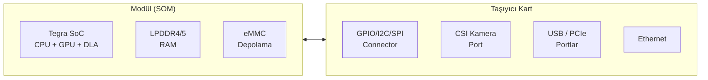
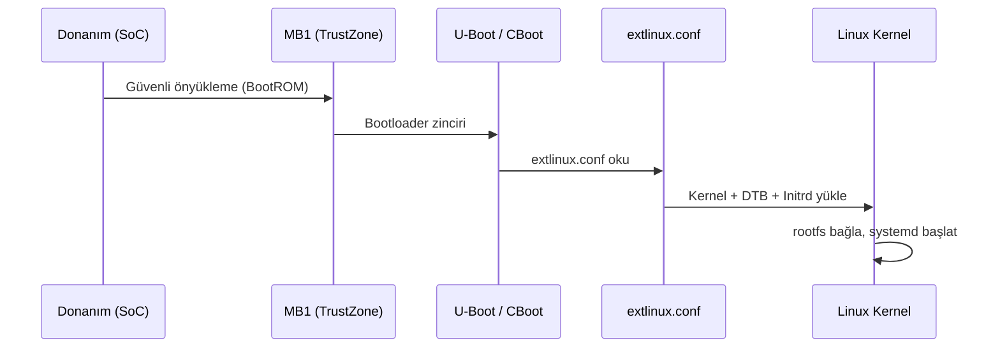

# NVIDIA Jetson

!!! abstract "Tanım"
    NVIDIA Jetson, uç cihazlarda (edge) yapay zeka ve gömülü Linux uygulamaları için tasarlanmış SoC tabanlı bilgisayar modül serisidir. CUDA çekirdekleri, Tensor Core'lar ve Video Encoder/Decoder donanımı ile görüntü işleme, robot algısı ve derin öğrenme çıkarımı iş yüklerinde yüksek verim sağlar.



| Modül | CPU | GPU | RAM | L4T Desteği |
|-------|-----|-----|-----|-------------|
| Nano | 4× Cortex-A57 | 128 CUDA | 4 GB | R32.x (JetPack 4.x) |
| Xavier NX | 6× Carmel ARMv8.2 | 384 CUDA + 48 Tensor | 8/16 GB | R32.x, R35.x |
| AGX Xavier | 8× Carmel ARMv8.2 | 512 CUDA + 64 Tensor | 32 GB | R32.x, R35.x |
| AGX Orin | 12× Cortex-A78AE | 2048 CUDA + 64 Tensor | 32/64 GB | R35.x (JetPack 5.x) |

---

## L4T — Linux for Tegra

L4T (Linux for Tegra), NVIDIA'nın Jetson platformu için özelleştirilmiş Ubuntu tabanlı Linux dağıtımıdır.

```bash
# L4T sürümünü öğren
cat /etc/nv_tegra_release
# R32 (release), REVISION: 7.3

# JetPack sürümü
dpkg -l | grep nvidia-jetpack

# Donanım bilgisi
cat /proc/cpuinfo | grep "Hardware"
cat /proc/cpuinfo | grep "Revision"

# GPU bilgisi
nvidia-smi   # Xavier/Orin
tegrastats   # Tüm Jetson modelleri için daha ayrıntılı
```

### tegrastats — Gerçek Zamanlı İzleme

```bash
sudo tegrastats                        # Gerçek zamanlı izleme
sudo tegrastats --interval 2000       # 2 saniyede bir
sudo tegrastats --logfile /tmp/stats.log --start  # Arka planda logla
sudo tegrastats --stop                 # Durdu

# Örnek çıktı:
# RAM 1200/3964MB (lfb 512x4MB) SWAP 0/1982MB
# CPU [23%@1479,18%@1479] EMC_FREQ 0% GR3D_FREQ 0%
# AO@35.5C CPU@42.5C GPU@40C PLL@39C
```

### nvpmodel — Güç Modu

```bash
sudo nvpmodel -q verbose   # Aktif mod ve detaylar
sudo nvpmodel -m 0         # MAXN — maksimum performans
sudo nvpmodel -m 1         # 5W / 10W — düşük güç

# Sonraki açılışta da geçerli olsun
sudo nvpmodel -m 0
```

| Jetson Nano | Mod | CPU | GPU |
|:-----------:|:---:|:---:|:---:|
| 0 | MAXN | 4 çekirdek @ 1.479 GHz | 128 core @ 921 MHz |
| 1 | 5W | 2 çekirdek @ 918 MHz | 128 core @ 640 MHz |

```bash
# Jetclocks — tüm saatleri maksimuma al (benchmark için)
sudo jetson_clocks          # Maksimum frekans kilitle
sudo jetson_clocks --show   # Mevcut frekansları göster
sudo jetson_clocks --restore  # Varsayılana dön
```

---

## Önyükleme Yapılandırması

### extlinux.conf

Jetson, GRUB yerine `extlinux.conf` kullanır. Bu dosya, `flash.sh` tarafından eMMC birinci bölümüne (`mmcblk0p1`) yazılır.

```bash
# Dosya konumu (Jetson üzerinde)
cat /boot/extlinux/extlinux.conf
```

```ini title="/boot/extlinux/extlinux.conf"
TIMEOUT 30
DEFAULT primary

MENU TITLE L4T boot options

LABEL primary
    MENU LABEL primary kernel
    LINUX /boot/Image
    INITRD /boot/initrd
    FDT /boot/dtb/kernel_tegra210-p3448-0000-p3449-0000-b00.dtb
    APPEND ${cbootargs} quiet root=/dev/mmcblk0p1 rw rootfstype=ext4 \
           console=ttyS0,115200n8 console=tty0 fbcon=map:0 net.ifnames=0

# SD karttan önyükleme için:
# root=/dev/mmcblk1p1 veya root=/dev/sda1
```

```bash
# Yeni DTB yükle ve önyükleme için ayarla
sudo mount /dev/mmcblk0p1 /mnt
sudo cp yeni_board.dtb /mnt/boot/dtb/
sudo nano /mnt/boot/extlinux/extlinux.conf   # FDT satırını güncelle
sudo sync && sudo umount /mnt && sudo reboot
```

### Önyükleme Sırası



---

## Kernel Derleme

Özel sürücü eklemek, kernel seçenekleri değiştirmek veya DTS güncellemek için kernel kaynak kodundan derleme yapmak gerekir.

### 1. Kaynak Kodu İndir

```bash
# L4T R32.7.3 için
mkdir -p ~/jetson/kernel && cd ~/jetson/kernel

wget https://developer.nvidia.com/embedded/l4t/r32_release_v7.3/sources/t210/public_sources.tbz2
tar xf public_sources.tbz2
tar xf Linux_for_Tegra/source/public/kernel_src.tbz2

# Kaynak dizini
ls kernel/kernel-4.9/
```

### 2. Cross-Compile Ortamı

```bash
# ARM64 cross-compiler
sudo apt install gcc-aarch64-linux-gnu g++-aarch64-linux-gnu

# Ortam değişkenleri
export ARCH=arm64
export CROSS_COMPILE=aarch64-linux-gnu-
export LOCALVERSION=-tegra

# Çekirdek kaynak dizinine gir
cd kernel/kernel-4.9
```

### 3. Konfigürasyon

```bash
# Varsayılan Jetson Nano konfigürasyonu
make tegra_defconfig

# veya mevcut sistemin konfigürasyonunu kopyala
scp pi@jetson:/proc/config.gz .
gunzip config.gz && cp config .config
make olddefconfig

# Menü arayüzü ile özelleştirme
make menuconfig

# Belirli seçenekler
scripts/config --enable CONFIG_CAN
scripts/config --enable CONFIG_CAN_RAW
scripts/config --enable CONFIG_CAN_SOCKETCAN
scripts/config --module CONFIG_USB_SERIAL_CH341
```

### 4. Derleme

```bash
# CPU çekirdek sayısına göre paralel derleme
make -j$(nproc) Image modules dtbs

# Modülleri yükle (hedef dizine)
make INSTALL_MOD_PATH=/tmp/modules modules_install

# Derleme çıktıları
ls arch/arm64/boot/Image           # Sıkıştırılmamış kernel
ls arch/arm64/boot/dts/nvidia/     # DTB dosyaları
```

### 5. Jetson'a Kopyala ve Uygula

```bash
# SSH üzerinden kopyala
JETSON="pi@192.168.1.100"

scp arch/arm64/boot/Image ${JETSON}:/tmp/
scp arch/arm64/boot/dts/nvidia/tegra210-p3448-0000-p3449-0000-b00.dtb ${JETSON}:/tmp/

ssh ${JETSON} bash << 'EOF'
    sudo cp /tmp/Image /boot/Image
    sudo cp /tmp/*.dtb /boot/dtb/
    sudo sync
    sudo reboot
EOF

# Modülleri kopyala
rsync -avz /tmp/modules/ ${JETSON}:/
ssh ${JETSON} "sudo depmod -a && sudo reboot"
```

!!! tip "İpucu: out-of-tree Modül"
    Tüm kernel'i yeniden derlemek yerine, yalnızca özel sürücünüzü modül olarak derleyebilirsiniz:
    ```bash
    make -C /path/to/kernel-source M=$(pwd) modules
    make -C /path/to/kernel-source M=$(pwd) INSTALL_MOD_PATH=/tmp/mods modules_install
    ```

---

## Docker — Jetson'da Konteyner

NVIDIA, Jetson için GPU hızlandırması destekleyen `nvidia-docker2` sunmaktadır.

### Kurulum

```bash
# Docker kurulumu
sudo apt install docker.io
sudo usermod -aG docker $USER

# NVIDIA Container Runtime
distribution=$(. /etc/os-release;echo $ID$VERSION_ID)
curl -s -L https://nvidia.github.io/nvidia-docker/gpgkey | sudo apt-key add -
curl -s -L https://nvidia.github.io/nvidia-docker/$distribution/nvidia-docker.list | \
    sudo tee /etc/apt/sources.list.d/nvidia-docker.list

sudo apt update && sudo apt install nvidia-docker2
sudo systemctl restart docker
```

### Kullanım

```bash
# NVIDIA Docker ile GPU erişimli konteyner çalıştır
sudo docker run --runtime nvidia --rm -it \
    nvcr.io/nvidia/l4t-base:r32.7.1 bash

# Konteyner içinde GPU doğrulama
nvidia-smi        # Xavier/AGX
tegrastats        # Nano

# CUDA örnek çalıştırma
docker run --runtime nvidia --rm nvcr.io/nvidia/l4t-base:r32.7.1 \
    /usr/local/cuda/samples/1_Utilities/deviceQuery/deviceQuery
```

### docker-compose ile GPU

```yaml title="docker-compose.yml"
version: '3.8'
services:
  inference:
    image: nvcr.io/nvidia/l4t-pytorch:r32.7.1-pth1.10-py3
    runtime: nvidia
    environment:
      - NVIDIA_VISIBLE_DEVICES=all
    volumes:
      - ./models:/models
      - /tmp/argus_socket:/tmp/argus_socket   # Kamera erişimi
    devices:
      - /dev/video0:/dev/video0               # V4L2 kamera
```

```bash
docker-compose up -d
```

---

## TensorRT — Çıkarım Hızlandırma

TensorRT, NVIDIA'nın derin öğrenme modellerini Jetson GPU'sunda optimize eden ve hızlandıran kütüphanedir. JetPack ile birlikte gelir.

### TensorRT Sürümü

```bash
dpkg -l | grep tensorrt
python3 -c "import tensorrt; print(tensorrt.__version__)"

# TRT kütüphane konumu
ls /usr/lib/aarch64-linux-gnu/libTRT*
ls /usr/include/aarch64-linux-gnu/NvInfer.h
```

### ONNX Modeli TensorRT'ye Dönüştürme

```bash
# trtexec — komut satırı dönüştürücü
trtexec --onnx=model.onnx --saveEngine=model.trt

# FP16 hassasiyetle (daha hızlı, biraz daha az doğru)
trtexec --onnx=model.onnx --fp16 --saveEngine=model_fp16.trt

# INT8 kalibrasyonlu (en hızlı)
trtexec --onnx=model.onnx --int8 \
    --calib=calibration_data/ \
    --saveEngine=model_int8.trt

# Performans testi
trtexec --loadEngine=model.trt --iterations=100
```

### Python ile TensorRT Çıkarım

```python
import tensorrt as trt
import numpy as np
import pycuda.driver as cuda
import pycuda.autoinit

TRT_LOGGER = trt.Logger(trt.Logger.WARNING)

def load_engine(engine_path: str) -> trt.ICudaEngine:
    with open(engine_path, "rb") as f, \
         trt.Runtime(TRT_LOGGER) as runtime:
        return runtime.deserialize_cuda_engine(f.read())

def infer(engine: trt.ICudaEngine, input_data: np.ndarray) -> np.ndarray:
    context = engine.create_execution_context()

    # Bellek tahsisi
    h_input  = cuda.pagelocked_empty(trt.volume(engine.get_binding_shape(0)), np.float32)
    h_output = cuda.pagelocked_empty(trt.volume(engine.get_binding_shape(1)), np.float32)
    d_input  = cuda.mem_alloc(h_input.nbytes)
    d_output = cuda.mem_alloc(h_output.nbytes)

    stream = cuda.Stream()

    # Giriş verisini kopyala ve çalıştır
    np.copyto(h_input, input_data.ravel())
    cuda.memcpy_htod_async(d_input, h_input, stream)
    context.execute_async_v2([int(d_input), int(d_output)], stream.handle)
    cuda.memcpy_dtoh_async(h_output, d_output, stream)
    stream.synchronize()

    return h_output

# Kullanım
engine = load_engine("model.trt")
result = infer(engine, np.random.randn(1, 3, 224, 224).astype(np.float32))
```

### DeepStream

```bash
# DeepStream versiyon kontrolü
deepstream-app --version

# Örnek pipeline çalıştırma
deepstream-app -c /opt/nvidia/deepstream/deepstream/samples/configs/deepstream-app/source1_usb_dec_infer_resnet_int8.txt
```

---

## CAN Bus — SocketCAN

Robotic ve endüstriyel uygulamalarda yaygın kullanılan CAN protokolü, Jetson'da SocketCAN çerçevesi ile yönetilir.

### CAN Arayüzü Etkinleştirme

```bash
# Yüklü CAN modüllerini kontrol et
lsmod | grep can

# CAN modüllerini yükle
sudo modprobe can
sudo modprobe can_raw
sudo modprobe mttcan    # NVIDIA Tegra native CAN (Xavier+)

# veya USB-CAN adaptörü için
sudo modprobe can_dev
sudo modprobe gs_usb    # Geschwister Schneider USB/CAN

# Kalıcı yükleme
echo -e "can\ncan_raw\nmttcan" | sudo tee /etc/modules-load.d/can.conf
```

### CAN Arayüzü Yapılandırma

```bash
# Hızı ayarla ve arayüzü başlat
sudo ip link set can0 type can bitrate 500000
sudo ip link set can0 up

# Loopback test modu
sudo ip link set can0 type can bitrate 500000 loopback on
sudo ip link set can0 up

# Hata toleranslı mod (gürültülü hatlarda)
sudo ip link set can0 type can bitrate 500000 \
    restart-ms 100 \
    berr-reporting on

# Arayüz durumu
ip -details -statistics link show can0
```

### can-utils ile Test

```bash
# can-utils kurulumu
sudo apt install can-utils

# CAN mesajlarını dinle
candump can0

# Belirli ID filtreleme
candump can0,100:7FF     # 0x100-0x7FF aralığı
candump can0 -l          # Loga kaydet

# CAN mesajı gönder (ID=0x123, 8 byte veri)
cansend can0 123#DEADBEEF01020304

# CAN bus istatistikleri
canbusload can0@500000

# Periyodik mesaj gönderme
cangen can0 -g 10 -I 0x100 -L 8 -D i
#            ^10ms  ^ID      ^8byte ^artan sayı
```

### Python ile CAN

```python
import can
import time

# Bus oluştur
bus = can.interface.Bus(channel='can0', bustype='socketcan')

# Mesaj gönder
msg = can.Message(
    arbitration_id=0x123,
    data=[0xDE, 0xAD, 0xBE, 0xEF, 0x01, 0x02, 0x03, 0x04],
    is_extended_id=False
)
bus.send(msg)

# Mesaj al (bloklu)
message = bus.recv(timeout=1.0)
if message:
    print(f"ID: 0x{message.arbitration_id:X}, Veri: {message.data.hex()}")

# Periyodik dinleyici
def on_message(msg):
    print(f"[{msg.timestamp:.3f}] ID=0x{msg.arbitration_id:03X} "
          f"DLC={msg.dlc} DATA={msg.data.hex()}")

notifier = can.Notifier(bus, [can.Printer()])
time.sleep(10)
notifier.stop()
bus.shutdown()
```

### DTS — Tegra Native CAN

```dts
/* Jetson Xavier NX — mttcan */
mttcan@c310000 {
    status = "okay";
};

&mttcan0 {
    status = "okay";
    pinctrl-names = "default";
    pinctrl-0 = <&can0_state>;
};
```

```bash
# Tegra native CAN'ı sysfs ile kontrol et
ls /sys/class/net/ | grep can
ethtool -i can0   # Sürücü: mttcan
```

---

## Watchdog — Donanım İzleme

Watchdog timer, sistem kilitlenmesinde veya yazılım takılmasında otomatik sıfırlama yapar.

### Kernel Watchdog

```bash
# Watchdog aygıtını kontrol et
ls -la /dev/watchdog*
dmesg | grep -i watchdog

# Watchdog bilgisi
wdctl /dev/watchdog0

# Basit test — 10 saniye içinde beslenmezse sıfırlar
sudo bash -c "exec 3>/dev/watchdog; sleep 20"
# ^^^ tehlikeli! test için loopback modda kullan

# watchdog daemon
sudo apt install watchdog

# /etc/watchdog.conf
# watchdog-device = /dev/watchdog
# interval = 10
# max-load-1 = 24
# min-memory = 1
```

```ini title="/etc/watchdog.conf"
watchdog-device     = /dev/watchdog
watchdog-timeout    = 30      # Sıfırlama eşiği (saniye)
interval            = 10      # Besleme aralığı (saniye)
max-load-1          = 24      # 1 dakika ortalama yük eşiği
min-memory          = 1024    # KB cinsinden minimum serbest RAM
ping                = 8.8.8.8 # Ağ bağlantısı kontrolü (isteğe bağlı)
```

```bash
sudo systemctl enable --now watchdog
sudo systemctl status watchdog
```

### Programatik Watchdog Besleme (C)

```c
#include <fcntl.h>
#include <unistd.h>
#include <sys/ioctl.h>
#include <linux/watchdog.h>
#include <pthread.h>

static int wdt_fd = -1;
static volatile int running = 1;

static void *watchdog_thread(void *arg) {
    int timeout = 10;
    ioctl(wdt_fd, WDIOC_SETTIMEOUT, &timeout);

    while (running) {
        ioctl(wdt_fd, WDIOC_KEEPALIVE, NULL);  // Watchdog besle
        sleep(5);
    }
    return NULL;
}

int main(void) {
    wdt_fd = open("/dev/watchdog", O_WRONLY);

    pthread_t tid;
    pthread_create(&tid, NULL, watchdog_thread, NULL);

    // Ana uygulama kodu...

    running = 0;
    pthread_join(tid, NULL);

    // Watchdog'u güvenli kapat (magic close)
    write(wdt_fd, "V", 1);
    close(wdt_fd);
    return 0;
}
```

---

## SPI — Ayrıntılı Kullanım

```bash
# spidev modülü yüklü mü?
lsmod | grep spidev
ls /dev/spidev*

# Kalıcı yükleme
echo spidev | sudo tee -a /etc/modules

# spi-tools ile test
sudo apt install spi-tools
spi-config -d /dev/spidev0.0 -q    # Mevcut yapılandırma

# SPI parametrelerini ayarla
spi-config -d /dev/spidev0.0 \
    -m 0 \              # Mode 0 (CPOL=0, CPHA=0)
    -s 1000000 \        # 1 MHz
    -b 8                # 8 bit/word
```

```python
import spidev
import time

spi = spidev.SpiDev()
spi.open(0, 0)          # Bus 0, CS 0

spi.max_speed_hz  = 1_000_000  # 1 MHz
spi.mode          = 0b00        # Mode 0
spi.bits_per_word = 8

# Veri gönder ve al (full-duplex)
response = spi.xfer2([0x01, 0x02, 0x03])
print(f"Yanıt: {response}")

# Sadece gönder (MISO'yu yoksay)
spi.writebytes([0xFF, 0x00])

# Tek byte oku
data = spi.readbytes(4)

spi.close()
```

---

## UART / Seri Haberleşme Debug

```bash
# Mevcut seri portlar
ls /dev/ttyTHS* /dev/ttyS* /dev/ttyUSB* 2>/dev/null

# Jetson Nano — UART2 = debug konsol (/dev/ttyS0)
# Jetson Xavier NX — UART1 = /dev/ttyTHS0

# Port yapılandırması
sudo stty -F /dev/ttyTHS0 raw speed 115200

# minicom ile bağlan
sudo minicom -D /dev/ttyTHS0 -b 115200

# picocom — daha hafif alternatif
sudo picocom -b 115200 /dev/ttyTHS0

# Python ile seri okuma
python3 - << 'EOF'
import serial
port = serial.Serial('/dev/ttyTHS0', baudrate=115200, timeout=1)
while True:
    line = port.readline()
    if line:
        print(line.decode('utf-8', errors='replace').strip())
EOF

# UART loopback testi (TX'i RX'e bağla)
sudo python3 -c "
import serial
s = serial.Serial('/dev/ttyTHS0', 115200, timeout=1)
s.write(b'Loopback testi\n')
print(s.readline())
s.close()
"
```

```bash
# RS-485 için flow control (DE/RE pini GPIO ile)
# /etc/systemd/system/rs485.service örneği:
# ExecStartPre=/usr/bin/gpio-rs485-enable.sh
```

---

## Sistem Debug ve Tanılama

```bash
# Kernel oops / panic geçmişi
sudo cat /var/log/kern.log | grep -i "oops\|panic\|BUG"
journalctl -k --since "1 hour ago"

# Bellek sızıntısı tespiti
sudo dmesg | grep -i "oom\|out of memory\|kill process"
cat /proc/meminfo | grep -E "MemFree|Cached|Slab"

# I/O durumu
iostat -x 1 5             # Disk I/O istatistikleri
sudo iotop                # Process bazlı I/O izleme

# CPU gecikme analizi
sudo perf sched record -- sleep 5
sudo perf sched latency --sort max

# Termal log
watch -n 2 'cat /sys/class/thermal/thermal_zone*/temp \
    | paste - /sys/class/thermal/thermal_zone*/type'

# GPU kullanımı (Xavier+)
cat /sys/devices/gpu.0/load   # % olarak GPU yükü
```

---

## Kamera Hızlı Referans

```bash
# Bağlı kameraları listele
v4l2-ctl --list-devices
ls /dev/video*

# Kamera yetenekleri
v4l2-ctl -d /dev/video0 --all
v4l2-ctl -d /dev/video0 --list-formats-ext

# Görüntü yakala (JPEG)
v4l2-ctl -d /dev/video0 \
    --set-fmt-video=width=1920,height=1080,pixelformat=MJPG \
    --stream-mmap --stream-to=frame.jpg --stream-count=1

# libargus / nvarguscamerasrc (CSI kamera)
# GStreamer ile önizleme
gst-launch-1.0 nvarguscamerasrc sensor-id=0 ! \
    'video/x-raw(memory:NVMM),format=NV12,width=1920,height=1080,framerate=30/1' ! \
    nvvidconv ! nvoverlaysink -e

# H.264 kayıt
gst-launch-1.0 nvarguscamerasrc sensor-id=0 ! \
    'video/x-raw(memory:NVMM),format=NV12,framerate=30/1' ! \
    nvv4l2h264enc ! h264parse ! mp4mux ! \
    filesink location=video.mp4 -e

# UDP yayın (ağ üzerinden)
gst-launch-1.0 nvarguscamerasrc sensor-id=0 ! \
    'video/x-raw(memory:NVMM),format=NV12,framerate=30/1' ! \
    nvv4l2h264enc ! rtph264pay ! \
    udpsink host=192.168.1.50 port=5000
```

---

## GPIO — Tegra Pin Numarası Hesaplama

Jetson'da GPIO sysfs numaraları, `tegra-gpio.h` dosyasındaki formül ile hesaplanır.

### Formül

```c
// tegra194-gpio.h (Xavier NX) veya tegra210-gpio.h (Nano)
#define TEGRA_GPIO(port, offset)  ((TEGRA_GPIO_PORT_##port * 8) + offset)

// Port sabitleri (A=0, B=1, C=2, ... BB=27, CC=28...)
#define TEGRA_GPIO_PORT_A   0
#define TEGRA_GPIO_PORT_B   1
...
#define TEGRA_GPIO_PORT_S  18
#define TEGRA_GPIO_PORT_T  19
#define TEGRA_GPIO_PORT_BB 27
```

### Hesaplama Örneği

Pinmux Excel dosyasından `GPIO3_PT.00` (CAM1_PWDN pini) için:

```
GPIO3_PT.00 → Port = T → TEGRA_GPIO_PORT_T = 19, Offset = 0
sysfs numarası = (19 × 8) + 0 = 152  →  hex: 0x98
```

```
GPIO3_PS.01 → Port = S → TEGRA_GPIO_PORT_S = 18, Offset = 1
sysfs numarası = (18 × 8) + 1 = 145  →  hex: 0x91
```

### sysfs ile GPIO Kontrolü

```bash
# GPIO pini etkinleştir
echo 152 > /sys/class/gpio/export

# Yönü ayarla
echo out > /sys/class/gpio/gpio152/direction
echo in  > /sys/class/gpio/gpio152/direction

# Değer yaz/oku
echo 1 > /sys/class/gpio/gpio152/value   # HIGH
echo 0 > /sys/class/gpio/gpio152/value   # LOW
cat    /sys/class/gpio/gpio152/value     # Oku

# Tüm GPIO hatlarını listele
sudo cat /sys/kernel/debug/gpio

# Pinmux kayıtlarını görüntüle
sudo cat /sys/kernel/debug/tegra_pinctrl_reg
sudo cat /sys/kernel/debug/tegra_pinctrl_reg | grep cam4
```

### GPIO Denetleyici Türleri

```bash
# Hangi GPIO denetleyicileri var?
sudo dmesg | grep "registered GPIO"

# Örnek çıktı:
# gpiochip0 (tegra-gpio)    →  GPIO  0-255 : formül ile hesapla
# gpiochip1 (max77620-gpio) →  GPIO 504-511 : sysfs = chip_base + pin
```

| Denetleyici | sysfs Aralığı | Formül |
|-------------|:-------------:|--------|
| `tegra-gpio` | 0–255 | `(PORT × 8) + offset` |
| `max77620-gpio` | 504–511 | `504 + pin_index` |

### DTS'de GPIO Referansı

```dts
// GPIO phandle ile DTS'de kullanım
reset-gpios = <&gpio TEGRA_GPIO(S, 1) GPIO_ACTIVE_HIGH>;
pwdn-gpios  = <&gpio TEGRA_GPIO(T, 0) GPIO_ACTIVE_HIGH>;

// Ham phandle ile (derlenmiş DTB'de)
pwdn-gpios  = <0x5b 0x98 0x0>;
//             ^phandle ^sysfs_no ^flags
```

### Python — Jetson.GPIO

```python
import Jetson.GPIO as GPIO
import time

GPIO.setmode(GPIO.BCM)  # veya GPIO.BOARD (fiziksel pin)

# Çıkış pini
GPIO.setup(18, GPIO.OUT, initial=GPIO.LOW)
GPIO.output(18, GPIO.HIGH)
time.sleep(0.5)
GPIO.output(18, GPIO.LOW)

# Giriş pini + interrupt
def button_callback(channel):
    print(f"Pin {channel} tetiklendi!")

GPIO.setup(11, GPIO.IN, pull_up_down=GPIO.PUD_UP)
GPIO.add_event_detect(11, GPIO.FALLING, callback=button_callback, bouncetime=200)

try:
    while True:
        time.sleep(1)
except KeyboardInterrupt:
    GPIO.cleanup()
```

---

## BSP — Kısa Hazırlık Rehberi

Özel taşıyıcı kart için L4T BSP hazırlamak ve müşteriye dağıtmak için temel adımlar.

```bash
# 1. Docker yapı ortamı (Ubuntu 18.04)
docker run -it --privileged \
    --name l4t-build \
    -v /dev:/dev \
    -v $HOME/l4t:/work \
    ubuntu:18.04 bash

# 2. Bağımlılıklar
apt-get install -y binutils perl python3 python3-pip libxml2-utils \
    device-tree-compiler abootimg cpp dosfstools openssl uuid-runtime \
    qemu-user-static binfmt-support bc liblz4-tool bzip2 lbzip2 rsync

pip3 install pycryptodome

# 3. L4T Driver Package + Sample Rootfs indir ve aç
cd /work
tar xf Jetson_Linux_R32.7.3_aarch64.tbz2
cd Linux_for_Tegra/rootfs
sudo tar xpf ../../Tegra_Linux_Sample-Root-Filesystem_R32.7.3_aarch64.tbz2
cd ..
# NOT: apply_binaries.sh'yi henüz ÇALIŞTIRMA — müşteri kendi host'unda çalıştıracak

# 4. Özel board dosyalarını yerleştir
sudo cp my_board.conf     Linux_for_Tegra/
sudo cp my_board.dtb      Linux_for_Tegra/kernel/dtb/
sudo cp init_script.py    Linux_for_Tegra/rootfs/usr/local/sbin/
sudo cp my_service.service Linux_for_Tegra/rootfs/etc/systemd/system/
sudo ln -sf /etc/systemd/system/my_service.service \
    Linux_for_Tegra/rootfs/etc/systemd/system/multi-user.target.wants/my_service.service

# 5. Gerekli kernel modülünü etkinleştir
grep -qxF spidev Linux_for_Tegra/rootfs/etc/modules || \
    echo spidev >> Linux_for_Tegra/rootfs/etc/modules

# 6. BSP'yi paketle
tar -I lbzip2 -cpf My_BSP_R32.7.3.tbz2 --numeric-owner Linux_for_Tegra
```

### Flash Komutları

```bash
# apply_binaries.sh çalıştır (müşteri tarafında)
cd Linux_for_Tegra
sudo ./apply_binaries.sh

# eMMC'ye flash
sudo ./flash.sh my-board-config mmcblk0p1

# SD karta flash (önce prepare_sd_card.sh)
sudo ./prepare_sd_card.sh /dev/sdX
sudo ./flash.sh my-board-config external

# Force Recovery modu:
# FRCV + RST butonlarını basılı tut → güç ver → 10s bekle → RST bırak → FRCV bırak
# Ardından USB bağla ve lsusb ile "NVIDIA Corp." görün
lsusb | grep NVIDIA
```

---

## Faydalı Araçlar

```bash
# Jetson GPIO Python kütüphanesi (RPi.GPIO benzeri API)
pip3 install Jetson.GPIO
python3 -c "import Jetson.GPIO as GPIO; GPIO.setmode(GPIO.BCM)"

# jtop — interaktif sistem monitörü (htop gibi)
sudo pip3 install jetson-stats
sudo jtop

# jetson_release — sistem bilgisi özeti
sudo jetson_release -v

# L4T versiyon öğren
dpkg -l | grep "l4t\|nvidia-l4t"

# devmem2 — MMIO kayıt okuma/yazma (dikkatli kullan!)
sudo apt install devmem2
sudo devmem2 0x2430038 w         # Belirtilen adresi oku
sudo devmem2 0x2430038 w 0x1    # Adrese değer yaz
```
