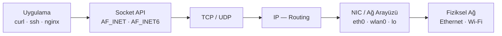

# Ağ Kavramları ve Yapılandırma

!!! note "Genel Bakış"
    Linux ağ yönetimi, IP katmanı protokollerinden uygulama düzeyi güvenlik araçlarına kadar geniş bir yelpazeyi kapsar. Bu bölüm temel ağ kavramlarını, Linux komutlarını ve yapılandırma yöntemlerini sistematik biçimde açıklar.



---

## Temel Kavramlar

### IP Adresleri ve Sınıfları

| Sınıf | Aralık | Kullanım |
|:-----:|--------|---------|
| A | 0.0.0.0 – 127.255.255.255 | Çok büyük ağlar |
| B | 128.0.0.0 – 191.255.255.255 | Orta boy ağlar |
| C | 192.0.0.0 – 223.255.255.255 | Küçük ağlar |
| D | 224.0.0.0 – 239.255.255.255 | Multicast |
| E | 240.0.0.0 – 255.255.255.255 | Deneysel / rezerve |

| Özel Adres | Anlamı |
|:----------:|--------|
| `127.0.0.1` | Loopback (kendi cihaz) |
| `169.254.x.x` | Link-local (APIPA — DHCP yoksa) |
| `10.x.x.x`, `172.16-31.x.x`, `192.168.x.x` | Özel (Private) ağlar |
| `0.0.0.0` | Tüm arayüzleri dinle |
| `255.255.255.255` | Broadcast |

### Subnet Mask ve CIDR

```
IP: 192.168.1.100
Mask: 255.255.255.0  →  /24

255 = 11111111 (8 bit ağ)
  0 = 00000000 (8 bit host)
/24 → ilk 24 bit ağ, son 8 bit host → 254 kullanılabilir host
```

| CIDR | Subnet Mask | Host Sayısı |
|:----:|:-----------:|:-----------:|
| /8 | 255.0.0.0 | 16.777.214 |
| /16 | 255.255.0.0 | 65.534 |
| /24 | 255.255.255.0 | 254 |
| /28 | 255.255.255.240 | 14 |
| /30 | 255.255.255.252 | 2 |

### MAC Adresi

- 48-bit donanım adresi; üretici tarafından NIC'e atanır
- OSI Katman 2 (Veri Bağlantı); LAN içi iletişimde kullanılır
- IP adresinden bağımsız çalışır

```bash
ip link show eth0
# link/ether 00:1a:2b:3c:4d:5e brd ff:ff:ff:ff:ff:ff

# Geçici MAC değiştirme (boot sonrası sıfırlanır)
sudo ip link set dev eth0 down
sudo ip link set dev eth0 address 02:42:ac:11:00:01
sudo ip link set dev eth0 up
```

---

## `ip` Komutu — Modern Ağ Yönetimi

`ip`, `ifconfig`, `route`, `arp` gibi eski araçların yerini alan modern Linux ağ yapılandırma komutudur.

```bash
# Arayüzler
ip link             # Tüm arayüzleri listele
ip -br link         # Özetli çıktı
ip link set eth0 up
ip link set eth0 down

# IP Adresleri
ip addr             # veya ip a
ip -br addr
ip addr add 192.168.1.50/24 dev eth0   # Geçici IP ekle
ip addr del 192.168.1.50/24 dev eth0   # IP sil

# Routing
ip route                                         # Routing tablosu
ip route add default via 192.168.1.1            # Gateway ekle
ip route add 10.0.0.0/8 via 10.0.0.1 dev eth1  # Statik rota
ip route del default

# ARP / Komşu Tablosu
ip neigh            # Komşu tablosu (ARP)

# İstatistikler
ip -s link          # Paket sayaçları
```

!!! tip "ifconfig'den ip'ye Geçiş"
    | eski | yeni |
    |------|------|
    | `ifconfig` | `ip addr` |
    | `route -n` | `ip route` |
    | `arp -n` | `ip neigh` |
    | `ifconfig eth0 up/down` | `ip link set eth0 up/down` |

---

## NetworkManager ve nmcli

```bash
nmcli general status           # Genel durum
nmcli device status            # Arayüz bazlı durum
nmcli connection show          # Tüm profiller
nmcli connection show --active # Aktif profiller

# Ethernet — statik IP
nmcli con mod "Wired connection 1" \
    ipv4.method manual \
    ipv4.addresses 192.168.1.50/24 \
    ipv4.gateway 192.168.1.1 \
    ipv4.dns "8.8.8.8 1.1.1.1"
nmcli con up "Wired connection 1"

# Ethernet — DHCP
sudo nmcli connection add \
    type ethernet ifname eth0 \
    con-name eth0 \
    ipv4.method auto ipv6.method ignore

# Wi-Fi
nmcli radio wifi on
nmcli dev wifi list
nmcli dev wifi connect "SSID_ADI" password "SIFRE"

# Profil önceliği
nmcli con mod "EvWifi" connection.autoconnect-priority 10

# Yeniden yükle
sudo nmcli connection reload
sudo systemctl restart NetworkManager
```

```bash
nmtui   # Metin tabanlı grafik arayüz (nmcli alternatifi)
```

---

## DNS ve Hostname

```bash
# DNS sorgusu
dig +short example.com             # Hızlı A kaydı
dig MX gmail.com                   # MX kaydı
dig @8.8.8.8 example.com          # Belirli DNS sunucu
nslookup example.com
nslookup -type=MX gmail.com

# Reverse DNS
dig -x 8.8.8.8

# Yerel çözünürlük
cat /etc/hosts                     # Statik isim-IP eşlemesi
cat /etc/resolv.conf               # DNS sunucu listesi

# Hostname
hostname                           # Ad
hostname -I                        # IP adresleri
sudo hostnamectl set-hostname yeni-ad
```

!!! note "/etc/hosts"
    `/etc/hosts` DNS'den önce sorgulanır. Küçük ölçekli ağlarda veya test ortamında cihazlara isimle erişmek için kullanılır:
    ```
    192.168.1.10  pi pi.local
    192.168.1.20  devbox.local
    ```

---

## Port ve Bağlantı İzleme

```bash
# ss — modern netstat alternatifi
ss -lntp     # Dinleyen TCP portları + process
ss -lunp     # Dinleyen UDP portları + process
ss -nt       # Tüm aktif TCP bağlantıları
ss -s        # Özet istatistik

# Belirli porta bakış
ss -tnp state established '( dport = :80 or sport = :80 )'
```

| Bayrak | Anlam |
|:------:|-------|
| `-l` | Listening (dinleyen) socket'ler |
| `-n` | Numeric (DNS çözme yapma) |
| `-t` | TCP |
| `-u` | UDP |
| `-p` | Process (PID ve uygulama adı) |

---

## Ağ Teşhis Araçları

```bash
# Bağlantı testi
ping -c 4 8.8.8.8              # 4 paket gönder
ping -i 0.2 -c 100 host        # 200ms aralıkla

# Rota izleme
traceroute 8.8.8.8
mtr 8.8.8.8                    # Gerçek zamanlı traceroute (daha iyi)

# Ağ tarama
netdiscover -i eth0            # LAN cihazlarını bul
nmap -sn 192.168.1.0/24        # Ping taraması
nmap -sV -p 22,80,443 host     # Servis versiyonu tespiti

# Bandwidth testi
iperf3 -s                      # Sunucu modu
iperf3 -c 192.168.1.1          # İstemci modu
```

---

## SSH (Secure Shell)

```mermaid
sequenceDiagram
    participant C as İstemci
    participant S as Sunucu (sshd)

    C->>S: TCP bağlantısı (port 22)
    S->>C: Server Key Exchange (algoritma müzakeresi)
    C->>S: Client Hello
    Note over C,S: Diffie-Hellman Anahtar Değişimi
    C->>S: Kullanıcı kimlik doğrulama\n(şifre veya anahtar)
    S->>C: Kimlik doğrulama başarılı
    C<-->S: Şifreli oturum (AES, ChaCha20)
```

```bash
# Temel bağlantı
ssh kullanici@192.168.1.10
ssh -p 2222 kullanici@host     # Farklı port
ssh -i ~/.ssh/id_ed25519 user@host  # Belirli anahtar

# Anahtar tabanlı kimlik doğrulama
ssh-keygen -t ed25519 -C "yorum"    # Anahtar çifti oluştur
ssh-copy-id kullanici@host          # Public key'i sunucuya kopyala
ssh-add ~/.ssh/id_ed25519           # Agent'a ekle

# Tünel
ssh -L 8080:localhost:80 user@host  # Yerel port yönlendirme
ssh -R 9090:localhost:3000 user@host  # Uzak port yönlendirme
ssh -D 1080 user@host               # SOCKS proxy

# Bağlantısız komut çalıştırma
ssh user@host "df -h && uptime"
ssh user@host 'bash -s' < local_script.sh
```

### SSH Yapılandırması

```bash title="/etc/ssh/sshd_config (önemli ayarlar)"
Port 22                          # Farklı porta taşı
PermitRootLogin no               # Root girişini engelle
PasswordAuthentication no        # Sadece anahtar
PubkeyAuthentication yes
AuthorizedKeysFile .ssh/authorized_keys
AllowUsers serkan mert           # Sadece bu kullanıcılar
ClientAliveInterval 300          # Keep-alive aralığı (s)
ClientAliveCountMax 3            # Maksimum keep-alive sayısı
MaxAuthTries 3                   # Maksimum deneme sayısı
```

```bash
sudo systemctl restart sshd      # Ayarları uygula
sudo sshd -t                     # Yapılandırmayı doğrula
```

!!! danger "Root SSH Erişimini Kapatın"
    Üretim sunucularında `PermitRootLogin no` ve `PasswordAuthentication no` ayarları **zorunludur**. Ayrıca varsayılan 22 portunu değiştirmek brute-force saldırılarını önemli ölçüde azaltır.

---

## Dosya Aktarımı

=== "SCP"

    ```bash
    # Yerel → Uzak
    scp dosya.txt user@host:/remote/path/

    # Uzak → Yerel
    scp user@host:/remote/file.txt /local/

    # Dizin kopyalama
    scp -r ./proje user@host:~/
    ```

=== "rsync"

    ```bash
    # Yerel dizin senkronize et
    rsync -avz --progress /kaynak/ /hedef/

    # Uzak sunucuya
    rsync -avz --progress --delete \
        /local/data/ user@host:/backup/data/

    # --dry-run ile önce test et
    rsync -avz --dry-run /src/ /dst/

    # SSH üzerinden
    rsync -avz -e "ssh -p 2222" /src/ user@host:/dst/
    ```

    | Bayrak | Anlam |
    |:------:|-------|
    | `-a` | Arşiv (izin, tarih, semlink koru) |
    | `-v` | Ayrıntılı çıktı |
    | `-z` | Aktarımda sıkıştır |
    | `--delete` | Hedefte fazla olan dosyaları sil |
    | `--progress` | İlerleme göster |
    | `--dry-run` | Gerçekten yazmadan simülasyon |

=== "FTP / SFTP"

    ```bash
    # SFTP (SSH üzerinden şifreli FTP)
    sftp user@host
    # SFTP komutları
    # ls, cd, get, put, mkdir, rm, bye

    sftp> get uzak_dosya.txt ./
    sftp> put yerel_dosya.txt /remote/

    # FTP (şifresiz — güvensiz, production'da kullanmayın)
    ftp ftp.example.com
    ```

---

## Firewall — ufw ve iptables

=== "ufw (Uncomplicated Firewall)"

    ```bash
    sudo ufw enable
    sudo ufw disable
    sudo ufw status verbose

    # Kural ekleme
    sudo ufw allow 22/tcp         # SSH
    sudo ufw allow 80/tcp         # HTTP
    sudo ufw allow from 192.168.1.0/24 to any port 3306  # MySQL sadece LAN

    # Kural silme
    sudo ufw delete allow 80/tcp
    sudo ufw delete 3              # Numara ile sil

    # Varsayılan politika
    sudo ufw default deny incoming
    sudo ufw default allow outgoing

    # Uygulama profili
    sudo ufw app list
    sudo ufw allow OpenSSH
    ```

=== "iptables"

    ```bash
    # Mevcut kuralları görüntüle
    sudo iptables -L -n -v --line-numbers

    # Kural ekleme
    sudo iptables -A INPUT -p tcp --dport 22 -j ACCEPT
    sudo iptables -A INPUT -p tcp --dport 80 -j ACCEPT
    sudo iptables -A INPUT -m state --state ESTABLISHED,RELATED -j ACCEPT
    sudo iptables -A INPUT -j DROP   # Kalanları reddet

    # NAT (router olarak)
    sudo iptables -t nat -A POSTROUTING -o eth0 -j MASQUERADE
    sudo sysctl -w net.ipv4.ip_forward=1

    # Kaydet / Yükle
    sudo iptables-save > /etc/iptables/rules.v4
    sudo iptables-restore < /etc/iptables/rules.v4
    ```

---

## DHCP, Cockpit ve Diğer Servisler

### DHCP

Dynamic Host Configuration Protocol; LAN'a katılan cihazlara otomatik IP, subnet mask, gateway ve DNS atar.

```bash
# DHCP lease yenile
sudo dhclient -r eth0    # Mevcut lease bırak
sudo dhclient eth0       # Yeni IP iste
```

### Cockpit (Web GUI)

```bash
sudo apt install cockpit
sudo systemctl enable --now cockpit
# Tarayıcıda: https://sunucu-ip:9090
```

### Uzak Arayüzler

```bash
# IP üzerinden VNC (masaüstü paylaşımı)
# x0vncserver -display :0 -passwordfile ~/.vnc/passwd

# XRDP (Windows RDP ile bağlantı)
sudo apt install xrdp
sudo systemctl enable --now xrdp
```

---

## Ağ Dosya Paylaşımı

```bash
# NFS — Dosya sistemi paylaşımı
# /etc/exports dosyasına ekle:
# /data 192.168.1.0/24(rw,sync,no_subtree_check)
sudo exportfs -ra               # Export'ları yenile
sudo mount -t nfs host:/data /mnt/nfs

# Samba — Windows ile dosya paylaşımı
sudo apt install samba
# /etc/samba/smb.conf düzenle
sudo smbpasswd -a kullanici
sudo systemctl restart smbd
```