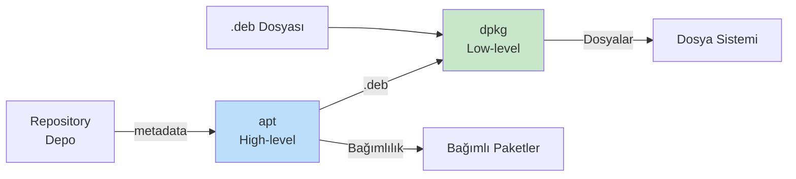

# Paket Yönetimi

!!! note "Genel Bakış"
    Linux paket yönetimi; yazılım kurma, güncelleme ve kaldırma işlemlerini sistematik biçimde yöneten araçlar bütünüdür. Debian/Ubuntu için `dpkg` + `apt` zinciri, Python için `pip`, evrensel paketler için `snap` ve `flatpak` temel araçlardır.



---

## dpkg — Düşük Seviye Paket Yöneticisi

`dpkg`, Debian paket sisteminin en alt katmanıdır. `.deb` dosyalarını doğrudan sisteme kurar; ancak bağımlılık çözümlemez.

```bash
dpkg -i <paket>.deb      # Paket kur
dpkg -r <paket>          # Paketi kaldır (yapılandırma dosyaları kalır)
dpkg -P <paket>          # Paketi ve yapılandırmasını tamamen kaldır

dpkg -l                  # Kurulu paket listesi ve durumları
dpkg -L <paket>          # Paketin kurduğu dosyalar
dpkg -S <dosya_yolu>     # Bir dosyanın hangi pakete ait olduğu
dpkg -s <paket>          # Paket durumu (status)

dpkg --configure -a      # Tamamlanamamış kurulumları tamamla
```

!!! warning "half-installed / unconfigured"
    Bağımlılık eksikse kurulum `half-installed` veya `unconfigured` durumda kalır. `package is not fully configured` hatası alınır. Çözüm:
    ```bash
    dpkg --configure -a
    apt install -f        # Eksik bağımlılıkları kur
    ```

---

## apt — Yüksek Seviye Paket Yöneticisi

`apt`, `dpkg`'yi kullanarak çalışır; repository'den indirme, bağımlılık çözümleme ve hata kurtarma ekler.

```bash
# Güncelleme
apt update                      # Repository metadata'sını indir (paket kurmaz)
apt upgrade                     # Kurulu paketleri güncelle
apt full-upgrade                # Bağımlılık değişimleriyle tam güncelleme
apt dist-upgrade                # full-upgrade'in eski adı

# Kurma / Kaldırma
apt install <paket>             # Paket ve bağımlılıklarını kur
apt install <paket>=<versiyon>  # Belirli sürümü kur
apt reinstall <paket>           # Yeniden yükle
apt remove <paket>              # Paketi kaldır (yapılandırma kalır)
apt purge <paket>               # Paketi + yapılandırmayı tamamen kaldır
apt autoremove                  # Artık gerekmeyen paketleri kaldır
apt clean                       # İndirilen .deb cache'ini temizle
apt autoclean                   # Sadece eskimiş cache'i temizle

# Arama ve Bilgi
apt search <kelime>             # Paket ara
apt show <paket>                # Paket bilgisi
apt policy <paket>              # Kurulu ve mevcut sürüm + öncelik
apt list --installed            # Kurulu paketler
apt list --upgradable           # Güncellenebilir paketler

# Bağımlılık onarımı
apt install -f                  # Bozuk bağımlılıkları düzelt
```

### apt vs apt-get

| Özellik | `apt` | `apt-get` |
|---------|:-----:|:---------:|
| Hedef kitle | Son kullanıcı | Script / otomasyon |
| Progress bar | ✓ | ✗ |
| Stabil API | Script için uygun değil | ✓ |
| Renkli çıktı | ✓ | ✗ |
| Önerilen tercih | İnteraktif terminal | Shell script |

!!! tip "Script'lerde apt-get Kullan"
    `apt` UI öğeleri ekleyebilir veya uyarı gösterebilir. Otomasyon script'lerinde `apt-get` daha tutarlıdır.

---

## apt-cache — Metadata Sorgulama

```bash
apt-cache show <paket>          # Detaylı paket bilgisi
apt-cache showpkg <paket>       # Bağımlılık grafiği
apt-cache policy <paket>        # Sürüm ve pin bilgisi
apt-cache search <kelime>       # Açıklamada arama
apt-cache depends <paket>       # Doğrudan bağımlılıklar
apt-cache rdepends <paket>      # Ters bağımlılıklar (kim kullanıyor)
```

---

## Repository Yönetimi

```bash
# Depo listesi
cat /etc/apt/sources.list
ls /etc/apt/sources.list.d/

# Depo ekle (Ubuntu PPA)
sudo add-apt-repository ppa:user/repo
sudo apt update

# Depo ekle (3. taraf)
curl -fsSL https://example.com/gpg.key | sudo gpg --dearmor -o /etc/apt/keyrings/example.gpg
echo "deb [signed-by=/etc/apt/keyrings/example.gpg] https://example.com/repo stable main" | \
    sudo tee /etc/apt/sources.list.d/example.list
sudo apt update

# Pin — belirli paketi belirli sürümde kilitle
# /etc/apt/preferences.d/mypin
# Package: nginx
# Pin: version 1.24.*
# Pin-Priority: 1001
```

---

## pip — Python Paket Yöneticisi

```bash
# Kurma
pip install numpy
pip install numpy==1.25.0       # Belirli sürüm
pip install "numpy>=1.20,<2.0"  # Sürüm aralığı
pip install -r requirements.txt  # Dosyadan toplu kur
pip install -e .                  # Geliştirme (editable) modu

# Güncelleme
pip install --upgrade numpy
pip list --outdated               # Güncellenebilir paketler
pip install --upgrade pip         # pip'i güncelle

# Bilgi ve listeleme
pip show numpy                    # Paket bilgisi
pip list                          # Kurulu paketler
pip freeze                        # requirements.txt formatında
pip freeze > requirements.txt

# Kaldırma
pip uninstall numpy
pip uninstall -r requirements.txt -y

# Arama (PyPI)
pip search numpy                  # Eski pypi API kaldırıldı; pip index kullan
```

!!! warning "pip ile Sistem Python'u Değiştirme"
    Ubuntu/Debian'da `sudo pip install ...` sistem Python paketlerini bozabilir. `python3 -m pip install --user ...` (kullanıcı bazlı) veya sanal ortam kullanın.

### Sanal Ortam (venv)

```bash
# Oluştur
python3 -m venv myenv

# Aktifleştir
source myenv/bin/activate         # Linux/macOS
myenv\Scripts\activate            # Windows

# İçinde pip normal çalışır
pip install flask
pip freeze > requirements.txt

# Deaktifleştir
deactivate

# Conda alternatifi
conda create -n myenv python=3.11
conda activate myenv
conda install numpy
```

---

## snap — Evrensel Paket Yöneticisi

Snap, uygulamayı bağımlılıklarıyla birlikte yalıtılmış container içinde çalıştırır.

```bash
snap find <uygulama>             # Ara
snap install <uygulama>          # Kur
snap install <uygulama> --classic  # Klasik (izolasyonsuz)
snap refresh <uygulama>          # Güncelle
snap refresh                     # Tümünü güncelle
snap remove <uygulama>           # Kaldır
snap list                        # Kurulular
snap info <uygulama>             # Bilgi
```

---

## Paket Sistemi Karşılaştırması

| Özellik | apt (deb) | snap | flatpak | pip |
|---------|:---------:|:----:|:-------:|:---:|
| Hedef | Sistem | Uygulama | Uygulama | Python |
| İzolasyon | Yok | ✓ | ✓ | venv ile |
| Otomatik güncelleme | ✗ | ✓ | ✗ | ✗ |
| Boyut | Küçük | Büyük | Büyük | Küçük |
| Hız | Hızlı | Yavaş | Yavaş | Hızlı |
| Sandboxing | ✗ | AppArmor | Bubblewrap | ✗ |

---

## Sistem Güncelleştirme — En İyi Pratikler

```bash
# Güvenli tam güncelleme sırası
sudo apt update
sudo apt upgrade -y
sudo apt full-upgrade -y
sudo apt autoremove --purge -y
sudo apt clean

# Güncelleme öncesi ne değişeceğini gör
apt list --upgradable

# Belirli paketi tutma (pin)
sudo apt-mark hold linux-image-generic
sudo apt-mark showhold

# Kernel güncelleme sonrası eski kernel temizleme
sudo apt autoremove --purge
```

!!! danger "Otomatik Güncelleme"
    Üretim sunucularında `unattended-upgrades` ile **sadece güvenlik** güncellemelerini otomatik alın; tam sistem güncellemelerini planlı bakım penceresinde manuel yapın.

```bash
sudo apt install unattended-upgrades
sudo dpkg-reconfigure unattended-upgrades
# /etc/apt/apt.conf.d/50unattended-upgrades ile yapılandır
```