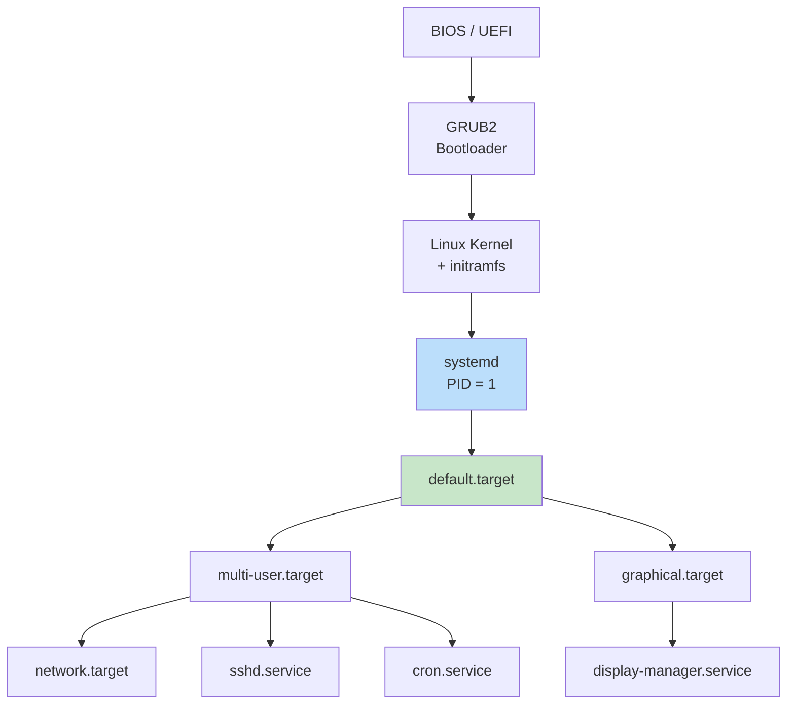

# Servisler ve Daemon Yönetimi

!!! note "Genel Bakış"
    `systemd`, modern Linux dağıtımlarında PID 1 olarak çalışan sistem ve servis yöneticisidir. Paralel başlatma, bağımlılık grafiği, merkezi log (journald) ve gelişmiş servis denetimi sağlar. Bu bölüm systemd, systemctl ve journalctl araçlarını kapsar.



---

## Systemd Unit Türleri

| Uzantı | Tür | Açıklama |
|:------:|-----|---------|
| `.service` | Service | Arka plan hizmetleri (daemon) |
| `.target` | Target | Unit grupları; run level yerine geçer |
| `.socket` | Socket | Socket-activated servisler |
| `.timer` | Timer | Zamanlanmış görevler (cron alternatifi) |
| `.mount` | Mount | Dosya sistemi otomatik mount |
| `.path` | Path | Dosya/dizin değişikliklerini tetikleyici |
| `.slice` | Slice | Cgroups kaynak sınırı grubu |

**Unit dosyaları konumları:**

| Konum | Kapsam | Öncelik |
|-------|--------|:-------:|
| `/etc/systemd/system/` | Sistem geneli (admin değişikliği) | Yüksek |
| `/usr/lib/systemd/system/` | Dağıtım paketleri | Orta |
| `~/.config/systemd/user/` | Kullanıcı bazlı | — |

---

## Service Dosyası Yapısı

```ini title="/etc/systemd/system/my-app.service"
[Unit]
Description=My Application Service
Documentation=https://example.com/docs
After=network.target postgresql.service
Wants=postgresql.service
Conflicts=conflicting.service

[Service]
Type=simple
User=appuser
Group=appgroup
WorkingDirectory=/opt/myapp
ExecStart=/usr/bin/python3 /opt/myapp/main.py
ExecReload=/bin/kill -HUP $MAINPID
ExecStop=/bin/kill -SIGTERM $MAINPID
Restart=on-failure
RestartSec=5s
TimeoutStopSec=30s

# Ortam değişkenleri
Environment=ENV=production
EnvironmentFile=/etc/myapp/env

# Kaynak sınırları
LimitNOFILE=65536
MemoryMax=512M

[Install]
WantedBy=multi-user.target
```

### [Unit] Bölümü

| Direktif | Açıklama |
|----------|---------|
| `Description` | İnsan okunabilir kısa açıklama |
| `After` | Başlama sırasını belirler; belirtilen unit'ten sonra başlar |
| `Before` | Belirtilen unit'ten önce başlar |
| `Wants` | Zayıf bağımlılık; bağımlı unit başlamasa da devam eder |
| `Requires` | Güçlü bağımlılık; bağımlı başlamazsa bu da başlamaz |
| `Conflicts` | Çakışan unit; biri başlayınca diğeri durur |

### [Service] Bölümü

| Direktif | Açıklama |
|----------|---------|
| `Type=simple` | ExecStart fork etmeden çalışır (varsayılan) |
| `Type=forking` | Daemon arka plana fork ettiğinde kabul edilir |
| `Type=oneshot` | Tek seferlik kısa işler |
| `Type=notify` | Daemon sd_notify() ile hazır sinyali gönderir |
| `Restart=no` | Yeniden başlatma yok |
| `Restart=on-failure` | Başarısız çıkışta yeniden başlat |
| `Restart=always` | Her zaman yeniden başlat |
| `User` | Hangi kullanıcı altında çalışacağı |
| `Environment` | Ortam değişkeni |
| `EnvironmentFile` | Dosyadan ortam değişkeni yükle |
| `WorkingDirectory` | Çalışma dizini |

### [Install] Bölümü

| Direktif | Açıklama |
|----------|---------|
| `WantedBy=multi-user.target` | `systemctl enable` ile bu target'a bağlanır |
| `RequiredBy` | Zorunlu bağımlılık olarak bağlanır |
| `Also` | Bu unit enable edildiğinde başka unit de enable et |

---

## Gerçek Örnekler

=== "ROS2 Servisi"

    ```ini
    [Unit]
    Description=ROS 2 Startup Service
    After=network.target

    [Service]
    Type=simple
    User=rosuser
    Environment=HOME=/home/rosuser
    ExecStartPre=/bin/sleep 5
    ExecStart=/home/rosuser/start_ros2.sh
    Restart=on-failure
    RestartSec=10s

    [Install]
    WantedBy=multi-user.target
    ```

=== "Python Web Servisi"

    ```ini
    [Unit]
    Description=FastAPI Application
    After=network.target

    [Service]
    Type=simple
    User=webuser
    WorkingDirectory=/opt/api
    EnvironmentFile=/opt/api/.env
    ExecStart=/opt/api/venv/bin/uvicorn main:app --host 0.0.0.0 --port 8000
    Restart=always
    RestartSec=3s
    StandardOutput=journal
    StandardError=journal

    [Install]
    WantedBy=multi-user.target
    ```

=== "Periyodik Görev (Timer)"

    ```ini title="backup.timer"
    [Unit]
    Description=Daily Backup Timer

    [Timer]
    OnCalendar=*-*-* 02:00:00
    Persistent=true

    [Install]
    WantedBy=timers.target
    ```

    ```ini title="backup.service"
    [Unit]
    Description=Daily Backup Service

    [Service]
    Type=oneshot
    ExecStart=/usr/local/bin/backup.sh
    ```

    ```bash
    sudo systemctl enable --now backup.timer
    systemctl list-timers
    ```

---

## systemctl Komutları

```bash
# Servis kontrolü
sudo systemctl start   my.service
sudo systemctl stop    my.service
sudo systemctl restart my.service
sudo systemctl reload  my.service     # Yapılandırmayı yeniden yükle (fork yok)
sudo systemctl status  my.service

# Otomatik başlatma
sudo systemctl enable  my.service     # Boot'ta başlat
sudo systemctl disable my.service     # Boot'ta başlatma
sudo systemctl enable --now my.service  # Enable + hemen başlat
sudo systemctl is-enabled my.service
sudo systemctl is-active  my.service

# Unit listesi
systemctl list-units --all
systemctl list-units --type=service --state=running
systemctl list-units --type=target
systemctl list-timers

# Birim yenileme
sudo systemctl daemon-reload           # Değişen unit dosyalarını tanı

# Sistem geneli
sudo systemctl poweroff
sudo systemctl reboot
sudo systemctl suspend
sudo systemctl hibernate
sudo systemctl rescue                  # Kurtarma moduna geç
```

---

## journalctl — Log Yönetimi

```mermaid
graph LR
    SVC[Service / Kernel] -->|stdout/stderr| JOURNAL[journald\n/run/log/journal]
    JOURNAL -->|journalctl| USER[Kullanıcı]
    JOURNAL -->|kalıcı| DISK[/var/log/journal]
```

```bash
# Temel kullanım
journalctl                          # Tüm loglar
journalctl -b                       # Son boot'tan itibaren
journalctl -b -1                    # Bir önceki boot
journalctl -f                       # Canlı takip (tail -f)

# Servis filtreleme
journalctl -u sshd
journalctl -u sshd -f               # SSH loglarını canlı izle
journalctl -u nginx --since today

# Zaman filtresi
journalctl --since "2024-01-01 08:00:00"
journalctl --until "2024-01-02"
journalctl --since "1 hour ago"

# Öncelik filtresi
journalctl -p err                   # Sadece hata ve üzeri
journalctl -p warning               # Uyarı ve üzeri
# debug(7) info(6) notice(5) warning(4) err(3) crit(2) alert(1) emerg(0)

# Çıktı formatı
journalctl -o json-pretty           # JSON formatı
journalctl -o short-precise         # Mikrosaniye hassasiyetiyle
journalctl --no-pager               # Sayfalama olmadan
journalctl -n 50                    # Son 50 satır

# Kernel mesajları
journalctl -k                       # Kernel logları
journalctl -k -b                    # Bu boot'taki kernel logları

# Disk kullanımı ve temizlik
journalctl --disk-usage
sudo journalctl --vacuum-size=500M  # 500 MB'dan fazlasını sil
sudo journalctl --vacuum-time=30d   # 30 günden eskiyi sil
```

### journald Yapılandırması

```ini title="/etc/systemd/journald.conf"
[Journal]
Storage=persistent           # Logları disk'e yaz (auto/volatile/persistent)
Compress=yes                 # Sıkıştır
SystemMaxUse=500M            # Maksimum disk alanı
SystemKeepFree=200M          # Minimum boş alan bırak
MaxRetentionSec=1month       # En uzun saklama süresi
ForwardToSyslog=no           # /var/log/syslog'a da yönlendir
```

---

## Cron vs systemd Timer

| Özellik | cron | systemd timer |
|---------|:----:|:-------------:|
| Başarısız job retry | ✗ | ✓ |
| Log (journald) | ✗ (mail) | ✓ |
| Boot'ta kaçırılan job | ✗ | ✓ (Persistent=true) |
| Bağımlılık yönetimi | ✗ | ✓ |
| Kolaylık | Yüksek | Orta |

!!! tip "Cron Hâlâ Geçerli"
    Basit zamanlama gereksinimleri için `crontab -e` hızlıdır. Retry, logging veya servis bağımlılığı gerektiren kritik görevler için systemd timer tercih edin.

---

## Ortak Sistem Servisleri

| Servis | Açıklama |
|--------|---------|
| `sshd` | SSH sunucusu |
| `NetworkManager` | Ağ yönetimi |
| `cron` / `crond` | Zamanlanmış görevler |
| `rsyslog` | Syslog daemon |
| `udev` | Aygıt olaylarını yönetir |
| `dbus` | Süreçler arası mesajlaşma (IPC) |
| `avahi-daemon` | mDNS/DNS-SD yerel ağ keşfi |
| `bluetooth` | Bluetooth yönetimi |
| `cups` | Yazıcı yönetimi |
| `snapd` | Snap paket yöneticisi |