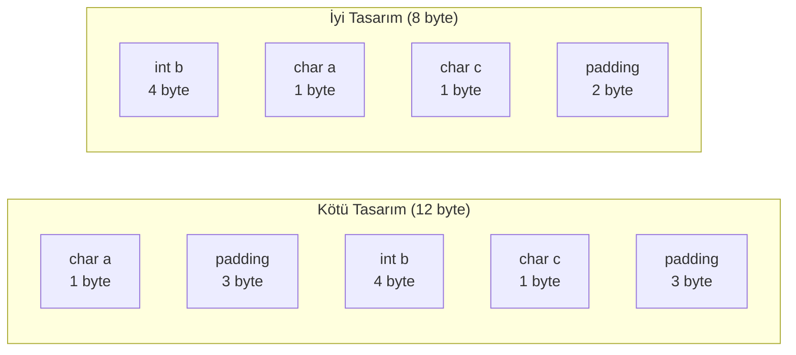
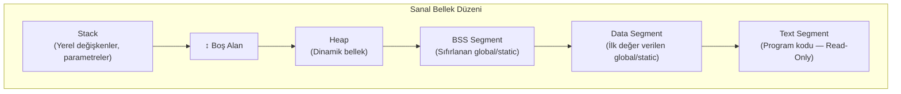
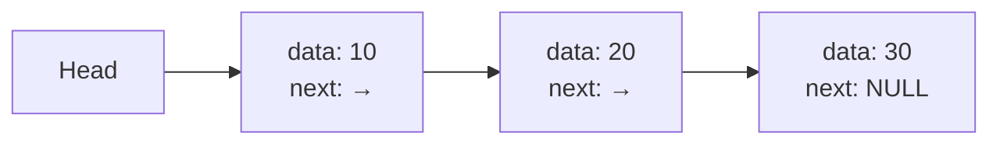
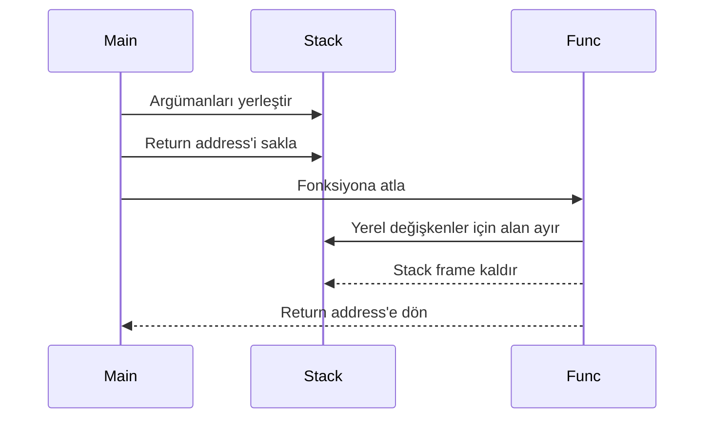
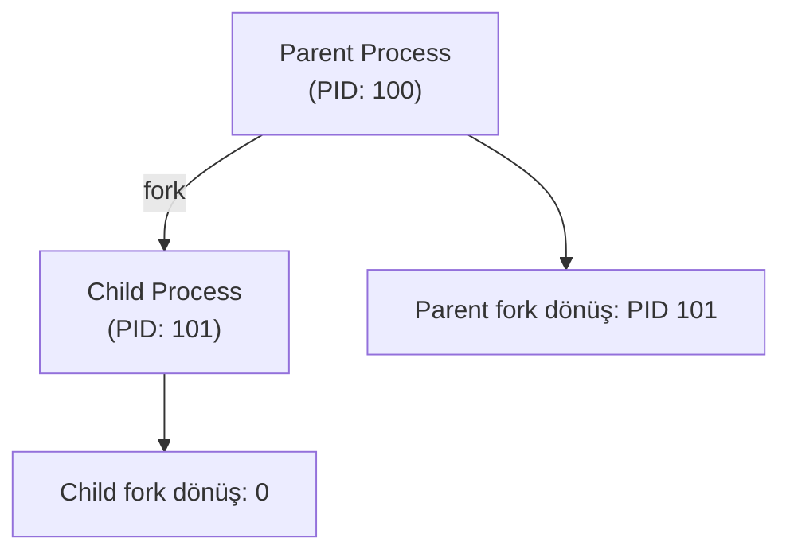

# C Programlama

!!! note "Genel Bakış"
    C, donanıma yakın kontrol, yüksek performans ve taşınabilirlik sunan sistem programlama dilidir. Gömülü sistemler, işletim sistemi çekirdekleri ve kritik uygulamalar için yaygın olarak tercih edilir.

---

## Temel Kavramlar

### Kapsam (Scope)

| Kapsam | Açıklama |
|--------|---------|
| **File Scope (Global)** | Tüm dosya genelinde görünürdür |
| **Block Scope (Local)** | Yalnızca tanımlandığı `{ }` bloğu içinde geçerlidir |

### Tür Dönüşümü (Type Conversion)

| Tür | Açıklama | Örnek |
|-----|---------|-------|
| **Implicit (Örtük)** | Derleyicinin otomatik dönüştürmesi | `int x = 3.14;` → `x = 3` |
| **Explicit (Açık / Cast)** | Geliştiricinin manuel dönüştürmesi | `int x = (int)y;` |

### Depolama Sınıfları

| Anahtar Kelime | Yaşam Süresi | Kapsam | Açıklama |
|----------------|-------------|--------|---------|
| `auto` | Block | Local | Varsayılan yerel değişken sınıfı; artık kullanılmaz |
| `register` | Block | Local | CPU register'ında tutulmasını önerir; adresi alınamaz (`&`) |
| `static` (local) | Program | Local | Fonksiyon bittikten sonra değerini korur; Data Segment'te tutulur |
| `static` (global) | Program | File | Değişkeni/fonksiyonu yalnızca o `.c` dosyasına özel yapar |
| `extern` | Program | Global | Değişkenin/fonksiyonun başka bir dosyada tanımlı olduğunu bildirir |
| `volatile` | Block | Local | Derleyici optimizasyonunu engeller; doğrudan bellekten okur |

!!! tip "static — Global Seviye"
    Bir global değişken veya fonksiyonun başına `static` koyulursa, o sembol yalnızca tanımlandığı `.c` dosyasına özel (private) hale gelir. Başka bir dosya onu `extern` ile bile çağıramaz. İsim çakışmalarını önlemek için etkili bir yöntemdir.

!!! tip "volatile — Donanım Programcısının Dostu"
    Donanım register'ları, ISR içinde değiştirilen değişkenler veya paylaşılan bellek alanları `volatile` ile işaretlenmelidir. Aksi hâlde derleyici optimizasyon aşamasında bu değişkene yapılan erişimleri kaldırabilir.

### Temel Operatörler

| Operatör | Açıklama |
|----------|---------|
| `sizeof` | Veri tipi veya değişkenin bellekte kapladığı boyutu **byte** cinsinden döndürür. Fonksiyon değil, derleme zamanı operatörüdür (`sizeof(a++)` ifadesinde `a++` çalıştırılmaz) |
| `const` | Verinin değerini sabitler; yanlışlıkla değiştirilmeye karşı koruma sağlar |
| `typedef` | Mevcut bir veri tipine takma isim (alias) verir; gerçek bir C deyimidir, tip güvenliği sağlar |

!!! example "#define vs typedef"
    ```c
    #define PTR_INT int*
    typedef int* t_ptr_int;

    PTR_INT  p1, p2;      // p1: pointer, p2: int  ← yanlış davranış!
    t_ptr_int p3, p4;     // p3 ve p4: ikisi de pointer ← doğru
    ```

### Faydalı String/Bellek Fonksiyonları

| Fonksiyon | Açıklama |
|-----------|---------|
| `sprintf(buf, fmt, ...)` | Formatlanmış veriyi ekrana değil, `char` dizisine yazar |
| `sscanf(str, fmt, ...)` | Karakter dizisini belirtilen formatla analiz edip veri çıkarır |

### Dosya Modu (Text vs Binary)

| Mod | Flagler | Açıklama |
|-----|---------|---------|
| **Text** | `"r"`, `"w"` | Satır sonu karakterleri işletim sistemine göre otomatik dönüştürülür |
| **Binary** | `"rb"`, `"wb"` | Diskteki byte'lara hiç dokunulmaz; gömülü sistemlerde tercih edilir |

| fseek Sabiti | Açıklama |
|-------------|---------|
| `SEEK_SET` | Dosyanın en başından `offset` kadar ilerler |
| `SEEK_CUR` | İmlecin bulunduğu yerden `offset` kadar ilerler |
| `SEEK_END` | Dosyanın sonundan geriye/ileriye gider |

---

## Kontrol Akışı

### Koşul İfadeleri

C dilinde koşul yapıları: `if-else`, `switch-case`, `? :` (ternary), `goto`

!!! note "Jump Table Nasıl Çalışır?"
    `case` değerleri ardışık ve düzenli olduğunda derleyici gizli bir pointer dizisi (jump table) oluşturur. Kontrol değişkeni doğrudan bu dizinin indeksi olarak kullanılır; işlemci `O(1)` karmaşıklıkla doğrudan ilgili bloğa atlar.

    `case` değerleri çok dağınıksa (`case 1:`, `case 1500:`) derleyici tablo oluşturamaz ve arka planda yavaş `if-else` mantığına döner.

!!! danger "break Unutma Tuzağı (Fall-Through)"
    Bir `case` bloğunun sonuna `break;` koyulmazsa, kod bir sonraki `case`'in içine de girer. Bu bilinçli yapılıyorsa, derleyici uyarısından kaçınmak için `[[fallthrough]];` (C23) özniteliği kullanılmalıdır.

### Döngüler

C dilinde döngü yapıları: `for`, `while`, `do-while`

| Deyim | Etki |
|-------|------|
| `break` | Döngüyü sonlandırır |
| `continue` | Bir sonraki iterasyona geçer |
| `return` | Fonksiyondan çıkar |

```c
if (printf("Hello World")) {}  // ";" kullanılmadan çıktı oluşturur (bir kez)
while (printf("Hello World"))  // ";" kullanılmadan çıktı oluşturur (sonsuz)
```

!!! tip "Cache Locality ve Döngü Sırası"
    C dilinde çok boyutlu diziler bellekte **satır satır (Row-Major Order)** saklanır. Döngülerin sırası performansı ciddi ölçüde etkiler.

    ```c
    // DOĞRU: Cache Friendly — yan yana bellek hücrelerine sıralı erişim
    for (int i = 0; i < 1000; i++)
        for (int j = 0; j < 1000; j++)
            matris[i][j] = 0;

    // YANLIŞ: Cache Miss — bellekte sürekli uzak adreslere atlanır
    for (int j = 0; j < 1000; j++)
        for (int i = 0; i < 1000; i++)
            matris[i][j] = 0;
    ```

---

## Veri Türleri

### Temel Tipler

| Tip | Boyut | Açıklama |
|-----|-------|---------|
| `char` | 1 byte | Karakter veya küçük tam sayı |
| `int` | 2 veya 4 byte | Tam sayı (mimariye bağlı) |
| `float` | 4 byte | Tek hassasiyetli ondalık |
| `double` | 8 byte | Çift hassasiyetli ondalık |
| `void` | — | Tip yok; fonksiyon dönüş tipi veya generic pointer için |
| `enum` | `int` boyutu | Numaralandırma; varsayılan olarak `0`'dan başlar |

!!! note "Sabit Boyutlu Tipler"
    Veri boyutları derleyici ve mimariye göre değişkendir. Pointer'lar **32-bit** sistemlerde 4 byte, **64-bit** sistemlerde 8 byte kaplar. Sabit boyut için `<stdint.h>` kütüphanesi (`int8_t`, `uint8_t`, `uint32_t` vb.) kullanılmalıdır.

### struct ve union

| Yapı | Bellek | Açıklama |
|------|--------|---------|
| `struct` | Üyelerin toplamı (+ padding) | Her üye kendi bellek alanına sahiptir |
| `union` | En büyük üye kadar | Tüm üyeler aynı bellek alanını paylaşır |

!!! tip "__attribute__((packed))"
    `__attribute__((packed))` hizalama boşluklarını (padding) engelleyerek yapının bellekte tam ihtiyaç duyduğu boyutta yer kaplamasını sağlar. Gömülü sistemlerde donanım register haritalarına doğrudan map etmek için kullanılır.

```c
typedef struct {            // packed sayesinde 48 byte yerine 40 byte olur
    uint8_t  a;
    uint16_t b;
    uint16_t c;
} __attribute__((packed)) Foo;

typedef unsigned char BYTE;
typedef unsigned int  WORD;

int snake_case_variable;   // Snake Case
int camelCaseVariable;     // Camel Case
int PascalCaseVariable;    // Pascal Case
```

!!! note "Flexible Array Member (FAM)"
    Bir `struct` içinde tutulacak veri miktarı derleme zamanında bilinmiyorsa **FAM** kullanılır. Boyutsuz dizi yalnızca struct'ın **son elemanı** olabilir.

    ```c
    typedef struct {
        int  len;
        char data[];   // Flexible Array Member
    } Packet;

    int n = 50;
    Packet *p = malloc(sizeof(Packet) + n);  // data artık 50 byte olur
    ```

---

## Bit-Field

`struct` içinde `:` kullanılarak bir değişkenin bellekte **tam olarak kaç bit** kaplayacağı belirlenir.

```c
struct Register {
    uint8_t active : 1;
    uint8_t        : 3;  // İsimsiz 3 bitlik padding (rezerve alan)
    uint8_t mode   : 4;
};

struct AracKontrol {
    uint8_t led_durumu : 1;  // Açık/Kapalı — 1 bit
    uint8_t far_modu   : 2;  // 00, 01, 10, 11 — 2 bit
    uint8_t sicaklik   : 7;  // 0-120 derece — 7 bit
};
// sizeof(AracKontrol) = 2 byte
// led_durumu + far_modu = 3 bit → ilk byte'a sığar
// sicaklik 7 bit → bölünmemek için tamamen ikinci byte'a taşınır
```

!!! tip "Bit-Field Kısıtlamaları"
    1. İşlemciler belleği en az **byte** seviyesinde adresler. Dolayısıyla bit alanlarının adresi alınamaz (`&araba.led_durumu` → `cannot take address of bit-field` hatası).
    2. Bit alanlarından oluşan dizi oluşturulamaz (`led_durumu[5]` geçersiz).
    3. Bitlerin yerleşim sırası (Big/Little-Endian) derleyiciye ve mimariye bağlıdır. Ham paketleri doğrudan Bit-Field struct'ına `memcpy` etmek tehlikelidir.

!!! danger "Bit-Field Overflow ve İşaret Tuzağı"
    ```c
    struct AracKontrol araba;
    araba.far_modu = 4;  // 4 = 0b100 → 2 bitlik alana sığmaz
                         // Derleyici yalnızca ilk 2 biti alır (00) → sonuç: 0
    ```

    Bit alanı `unsigned` yerine `int` (signed) seçilirse MSB işaret biti olur:

    ```c
    struct Tehlikeli { int durum : 1; };  // 1 bitlik signed alan
    struct Tehlikeli t;
    t.durum = 1;
    printf("%d\n", t.durum);  // Çıktı: 1 değil, -1 !
    ```

    Donanım register'ları için kesinlikle `unsigned int` veya `uint8_t` / `uint32_t` kullanılmalıdır.

### Endianness

Birden fazla byte kaplayan bir verinin bellekte hangi byte sırasıyla yazılacağını belirleyen mimari kuraldır.

| Terim | Açıklama |
|-------|---------|
| **MSB** (Most Significant Byte) | En yüksek değeri taşıyan byte |
| **LSB** (Least Significant Byte) | En düşük değeri taşıyan byte |

!!! example "4 byte'lık `int sayi = 0x12345678;`"
    | Adres | Little-Endian | Big-Endian |
    |-------|:-------------:|:----------:|
    | `0x00` | `78` (LSB) | `12` (MSB) |
    | `0x01` | `56` | `34` |
    | `0x02` | `34` | `56` |
    | `0x03` | `12` (MSB) | `78` (LSB) |

```c
// Sistemin Endianness'ini tespit etme
unsigned int test = 1;    // Bellekte: 0x00000001
char *p = (char *)&test;

if (*p == 1)
    printf("Little-Endian\n");  // [01 00 00 00]
else
    printf("Big-Endian\n");     // [00 00 00 01]
```

### Two's Complement (İki'ye Tümleyen)

Bilgisayarlar negatif sayıları **Two's Complement** yöntemiyle saklar. Bu sayede toplama ve çıkarma işlemleri **aynı donanım** (toplama devresi) ile gerçekleştirilebilir; `5 - 3` yerine `5 + (-3)` hesaplanır.

!!! tip "Neden Bu Yöntem?"
    `-5` sayısını 8 bit ile temsil etmek:

    1. Pozitif halini yaz: `+5` → `00000101`
    2. Bitleri ters çevir (One's Complement): `11111010`
    3. 1 ekle (Two's Complement): `11111011` → `0xFB`

    Doğrulama — `5 + (-5)`:
    ```
      00000101  (+5)
    + 11111011  (-5)
    ----------
     100000000  ← 9. bit taşar ve dışarı atılır → sonuç: 00000000 = 0 ✓
    ```

| Durum | Açıklama |
|-------|---------|
| `signed char`: `127 + 1` | **Signed Overflow** → Undefined Behavior (UB); pratikte `-128` görülür |
| `unsigned char`: `255 + 1` | Tanımlı davranış: `0`'a döner (modular arithmetic) |

---

## Bellek Hizalaması (Memory Alignment ve Padding)

İşlemciler bellekten **bloklar halinde** veri okur: 32-bit işlemci → 4 byte, 64-bit işlemci → 8 byte. Değişkenlerin kendi boyutlarının katı olan adreslere yerleşmesi, **Alignment** olarak adlandırılır.



```c
// Kötü Tasarım — 12 byte
struct Data1 {
    char a;    // 1 byte + 3 byte padding
    int  b;    // 4 byte
    char c;    // 1 byte + 3 byte padding
};

// İyi Tasarım — 8 byte (büyükten küçüğe sırala)
struct Data2 {
    int  b;    // 4 byte
    char a;    // 1 byte
    char c;    // 1 byte + 2 byte padding
};
```

!!! tip "Kural"
    `struct` üyelerini büyükten küçüğe sıralamak padding'i minimize eder ve bellek kullanımını optimize eder.

---

## Bellek Yönetimi: Stack ve Heap



### Stack (Yığın)

- **Çalışma Mantığı:** LIFO (Last In, First Out). İşlemci tarafından doğrudan yönetilir; çok hızlıdır.
- **Kapsam:** Fonksiyon çağrıları, parametreler ve yerel değişkenler burada tutulur. Fonksiyon return ettiğinde bellek otomatik temizlenir.
- **Risk:** Boyutu sınırlıdır. Aşırı büyük yerel diziler veya kontrolsüz özyinelemeli (recursive) fonksiyonlar **Stack Overflow** hatasına yol açar.

### Heap

- **Çalışma Mantığı:** Dinamik bellek bölgesidir. `malloc()`, `calloc()`, `realloc()` ile çalışma zamanında tahsis edilir.
- **Kapsam:** Verilerin ömrü fonksiyonlara bağlı değildir; `free()` edilene kadar bellekte kalır.
- **Risk:** Yönetim programcıdadır. **Memory Leak** (serbest bırakılmayan bellek) ve **Dangling Pointer** (serbest bırakılmış alana erişim) temel riskleridir.

### Dinamik Bellek Fonksiyonları

| Fonksiyon | Başlangıç Değeri | Açıklama |
|-----------|:----------------:|---------|
| `malloc(n)` | Garbage (çöp) | `n` byte ayırır; içeriği sıfırlamaz |
| `calloc(count, size)` | `0` | `count * size` byte ayırır; tüm byte'ları sıfırlar |
| `realloc(ptr, n)` | Korunur | Mevcut bloğu `n` byte'a yeniden boyutlandırır |
| `free(ptr)` | — | Ayrılan belleği işletim sistemine iade eder |

```c
int n = 10;

int *ptr_1 = malloc(n * sizeof(int));   // İçerisi çöp dolu
int *ptr_2 = calloc(n, sizeof(int));    // İçerisi 0

if (ptr_1 == NULL || ptr_2 == NULL)
    return -1;

int *ptr_3 = realloc(ptr_2, 20 * sizeof(int));

for (int i = 0; i < n; i++)
    ptr_1[i] = i * 10;

free(ptr_1);
free(ptr_2);
free(ptr_3);
```

!!! danger "Dikkat Edilmesi Gereken Konular"
    **1. Memory Leak:** Belleği `free()` etmeden pointer'ı kaybedersen, o bellek program kapanana kadar RAM'de kilitli kalır. 7/24 çalışan sistemlerde zamanla RAM tükenmesine yol açar.

    **2. Dangling Pointer:** `free(p)` işleminden hemen sonra `p = NULL;` yapılmazsa pointer eski (geçersiz) adresi göstermeye devam eder.

    **3. realloc Tuzağı:** `p = realloc(p, 10000);` şeklinde yazılırsa, `realloc` başarısız olduğunda `p`'ye `NULL` atanır ve eski adres kaybolur. Geçici pointer kullanılmalıdır:
    ```c
    int *tmp = realloc(ptr, yeni_boyut);
    if (tmp == NULL) { /* hata yönet */ }
    else ptr = tmp;
    ```

---

## Dinamik Veri Yapıları

Heap kullanılarak oluşturulan, boyutu çalışma zamanında değişebilen esnek veri yapılarıdır.

### Bağlı Listeler (Linked Lists)

Bellekte ardışık yer kaplamayan, heap'te dağınık hâlde bulunan düğümlerin (node) pointer'lar aracılığıyla birbirine bağlandığı yapılardır.

- **Self-Referential Struct:** Bir struct içinde kendi tipinden bir pointer barındırılmasıdır; bağlı listenin temel yapı taşıdır.



!!! danger "Zinciri Koparmak (Memory Leak)"
    Bir düğüm `free()` edilmeden önce sonraki düğümün adresi yedeklenmezse, tüm sonraki elemanlara erişim kalıcı olarak kaybolur.

!!! danger "Döngüsel Tuzak (Infinite Loop)"
    Bir düğümün `next` pointer'ı yanlışlıkla önceki bir düğüme bağlanırsa, listeyi gezen fonksiyonlar **sonsuz döngüye** girer.

### Queue (Kuyruk)

- **Çalışma Mantığı:** FIFO (First In, First Out — İlk giren ilk çıkar).
- **Operasyonlar:** Eleman ekleme kuyruğun **arkasından (Rear/Enqueue)**, çıkarma ise **önünden (Front/Dequeue)** yapılır.

---

## Bitwise Operatörler

| Operatör | Tür | Açıklama |
|----------|-----|---------|
| `&` | Bitwise AND | Her iki bitte de 1 ise sonuç 1 |
| `|` | Bitwise OR | Herhangi bir bitte 1 ise sonuç 1 |
| `^` | Bitwise XOR | Bitler farklıysa sonuç 1 |
| `~` | Bitwise NOT | Tüm bitleri tersine çevirir |
| `<<` | Left Shift | Sola kaydırma; `n` kez kaydırmak `2^n` ile çarpmaktır |
| `>>` | Right Shift | Sağa kaydırma; `n` kez kaydırmak `2^n`'e bölmektir |
| `&&` | Logical AND | Sonuç yalnızca `true`/`false`; **Short-Circuit** özelliği var |
| `||` | Logical OR | Sonuç yalnızca `true`/`false`; **Short-Circuit** özelliği var |

!!! tip "Short-Circuit Evaluation"
    `if(a && 5/a)` ifadesinde `a = 0` ise sol taraf `false` olduğu için sağ taraf (`5/a`) hiç değerlendirilmez. Bu sayede `division by zero` hatası önlenmiş olur.

!!! note "Postfix vs Prefix"
    - **Postfix** (`i++`): Mevcut değeri kullan, sonra artır.
    - **Prefix** (`++i`): Önce artır, sonra kullan.

---

## Pointer

Bir değişken bellekte bir değer saklar. Pointer ise içinde **bellek adresi** saklar.

| Operatör | İsim | Açıklama |
|----------|------|---------|
| `&` | Address-of | Değişkenin RAM'deki adresini verir |
| `*` | Dereference | Pointer'ın işaret ettiği adresteki değeri okur veya değiştirir |

```c
int  x = 10;
int *p = &x;   // p, x'in adresini tutuyor
*p = 20;       // x artık 20
```

!!! note "Neden Her Tipin Kendi Pointer'ı Var?"
    Pointer'a gidildiğinde o adresten **kaç byte okunacağı ve nasıl yorumlanacağı** bilgisi tipin içindedir:

    | Pointer Tipi | Okunan Boyut |
    |-------------|:------------:|
    | `char *` | 1 byte |
    | `int *` | 4 byte |
    | `double *` | 8 byte |

### Pointer Aritmetiği

Pointer matematiği, işaret ettiği veri tipinin boyutuna (`sizeof`) göre ölçeklenir.

```c
int dizi[3] = {10, 20, 30};
int *p = dizi;  // p → dizi[0] (örn: 0x1000)

p++;  // p → 0x1000 + sizeof(int) = 0x1004 (dizi[1])
```

### Diziler

Dizi adı, **ilk elemanının başlangıç adresini gösteren sabit bir pointer'dır**. Derleyici `dizi[i]` ifadesini `*(dizi + i)` olarak ele alır.

```c
int dizi[5] = {10, 20, 30, 40, 50};

int *p1 = dizi;       // Eşdeğer
int *p2 = &dizi[0];   // Eşdeğer

printf("%d", dizi[2]);  // Eşdeğer
printf("%d", 2[dizi]);  // Eşdeğer → *(dizi + 2) = *(2 + dizi)
```

### String (Metin)

C'de yerleşik string tipi yoktur. Metinler `char` dizileri olarak tutulur ve sonları `\0` (Null Terminator) ile belirtilir.

!!! danger "Stack vs Read-Only Data"
    ```c
    char  str1[] = "Hello";   // Stack — değiştirilebilir
    char *str2   = "Hello";   // Read-Only Data Segment — değiştirilemez!
    ```
    `str2[0] = 'M';` → **Segmentation Fault**. String literal pointer'ı için mutlaka `const char *str2` kullanılmalıdır.

| Fonksiyon | Açıklama |
|-----------|---------|
| `strcpy(dest, src)` | `src`'yi `dest`'e kopyalar; sınır kontrolü yapmaz — güvensiz |
| `strncpy(dest, src, n)` | En fazla `n` byte kopyalar — güvenli |
| `strlen(s)` | `\0` görene kadar karakterleri sayar (runtime) |
| `memset(ptr, val, n)` | `n` byte'ı `val` ile doldurur |
| `memcpy(dst, src, n)` | `n` byte'ı kaynaktan hedefe kopyalar (overlap'te UB) |
| `memmove(dst, src, n)` | `memcpy` gibi çalışır; overlap olan bölgelerde de güvenlidir |

```c
char text[100] = "C Language";
printf("%zu\n", sizeof(text));  // 100 — bellekte ayrılan alan
printf("%zu\n", strlen(text));  // 10  — görünen karakter sayısı
```

### Generic Pointer (`void*`)

Tipi önceden bilinmeyen pointer'lar için kullanılır. Doğrudan dereference edilemez; kullanılmadan önce cast edilmelidir.

```c
int   a    = 5;
void *vptr = &a;  // Her tipten adres atanabilir

// printf("%d", *vptr);        // HATA! Tip bilinmiyor
printf("%d", *(int *)vptr);    // DOĞRU: önce int*'a cast et
```

### const Pointer Çeşitleri

!!! note "Sağdan Sola Okuma Kuralı"
    | Tanım | İsim | Adres Değişir mi? | Değer Değişir mi? |
    |-------|------|:-----------------:|:-----------------:|
    | `const int *p` | Pointer to Constant | ✓ | ✗ |
    | `int *const p` | Constant Pointer | ✗ | ✓ |
    | `const int *const p` | Constant Pointer to Constant | ✗ | ✗ |

    ```c
    int x = 10, y = 20;
    const int *p  = &x;
    int *const p1 = &x;

    // *p  = 15;  // HATA  — değer sabittir
    p  = &y;      // GEÇERLI — pointer başka adrese bakabilir

    *p1 = 15;     // GEÇERLI — değer değiştirilebilir
    // p1 = &y;   // HATA  — pointer sabittir
    ```

### Pointer to Pointer

Bir pointer da bellekte yer kaplayan bir değişkendir ve onun da bir adresi vardır.

```c
int  x  = 5;
int *p  = &x;   // p  → x'in adresi
int **pp = &p;  // pp → p pointer'ının adresi

// **pp == 5, *pp == p, pp == &p
```

### Function Pointers (Fonksiyon Göstericileri)

Fonksiyonların bellekte bir adresi vardır. Bu adresler pointer'larda saklanarak callback mekanizmaları ve dinamik dispatch kurulabilir.

```c
int topla(int a, int b) { return a + b; }
int cikar(int a, int b) { return a - b; }
int carp(int a, int b)  { return a * b; }

typedef int (*IslemPtr)(int, int);  // typedef ile okunabilirlik artar

int compute(IslemPtr op, int x, int y) {
    return op(x, y);
}

int main(void) {
    int (*fp)(int, int) = topla;  // İmza: (int, int) → int

    printf("%d\n", fp(5, 3));        // 8
    printf("%d\n", (*fp)(10, 20));   // 30 — iki yöntem de geçerli

    // Fonksiyon tablosu — switch-case gerektirmez
    IslemPtr tablo[3] = {topla, cikar, carp};
    printf("%d\n", tablo[2](10, 5)); // 50 — carp

    printf("%d\n", compute(topla, 5, 3));
    printf("%d\n", compute(cikar, 5, 3));
    return 0;
}
```

---

## Önişlemci Komutları (`#`)

Önişlemci saf bir **metin düzenleyicisidir**. Yalnızca `#` ile başlayan satırları okur; kesme-biçme-yapıştırma işlemleri yaparak saf C kodunu derleyiciye teslim eder.

| Direktif | Açıklama |
|----------|---------|
| `#include` | Başlık dosyası ekler |
| `#define` | Sembol veya makro tanımlar (text replacement; tip kontrolü yapmaz) |
| `#ifdef / #ifndef / #endif` | Koşullu derleme ve Include Guard |
| `#pragma once` | Include Guard'ın modern alternatifi |

!!! tip "Makro Özel Operatörleri"
    | Operatör | Açıklama |
    |----------|---------|
    | `#` | Argümanı **string literal**'e dönüştürür (Stringification) |
    | `##` | İki sembolü birleştirerek yeni bir tanımlayıcı oluşturur (Token Pasting) |

!!! note "Önceden Tanımlı Makrolar"
    | Makro | Açıklama |
    |-------|---------|
    | `__FILE__` | Kaynak dosyanın adı (string) |
    | `__LINE__` | Geçerli satır numarası (int) |
    | `__DATE__` | Derleme tarihi (string) |
    | `__TIME__` | Derleme saati (string) |

```c
// donanim.h
#ifndef DONANIM_H
#define DONANIM_H
// veya direkt:
// #pragma once

#define __MUTLAK_SONUC__   // boş define — belge amacıyla kullanılır

#define PRINT_DEBUG(var) \
    printf(#var " = %d\n", var)

#define DEGISKEN_YARAT(id) \
    int kullanici_##id = id

#define LOG_ERROR(msg) \
    printf("[HATA] %s:%d -> %s\n", __FILE__, __LINE__, msg)

int __MUTLAK_SONUC__ degisken;

void test(void) {
    int sensor_isi = 45;
    PRINT_DEBUG(sensor_isi);           // sensor_isi = 45

    DEGISKEN_YARAT(5);                 // → int kullanici_5 = 5;
    printf("%d\n", kullanici_5);       // 5

    LOG_ERROR("Kritik donanim eksik!");
}

#endif  // DONANIM_H
```

!!! danger "Makro Tuzakları"
    ```c
    #define KARE(x) x * x
    int sonuc = KARE(3 + 2);  // 3 + 2 * 3 + 2 = 11  ← yanlış!
    ```
    Her argümanı ve tüm makroyu paranteze al: `#define KARE(x) ((x) * (x))`

    Daha güvenlisi: küçük ve sık kullanılan fonksiyonlarda `inline` tercih edilir (tip güvenliği sağlar).

---

## Fonksiyonlar

Bir fonksiyon çağrıldığında işlemci, mevcut kod akışını durdurarak fonksiyonun bulunduğu adrese gider. Bu süreçte **Stack Frame** oluşturulur.



| Fonksiyon Türü | Açıklama |
|----------------|---------|
| **Normal** | Stack frame oluşturularak çağrılır |
| **Recursive** | Fonksiyonun kendi kendini çağırması; her çağrıda yeni frame açılır |
| **Variadic** | `stdarg.h` ile değişken sayıda parametre alır (`printf` gibi) |
| **inline** | Derleyiciye fonksiyon gövdesini çağrıldığı yere kopyalamasını önerir; küçük ve sık çağrılan fonksiyonlarda overhead'i azaltır |

!!! tip "inline vs Makro"
    | Özellik | `inline` | `#define` |
    |---------|:--------:|:---------:|
    | Tip kontrolü | ✓ | ✗ |
    | Scope kuralları | ✓ | ✗ |
    | Debugger görünürlüğü | ✓ | ✗ |
    | Garanti | Öneri (derleyici görmezden gelebilir) | Kesin metin ikamesi |

---

## Concurrency ve Parallelism

### Multi-processing (`fork`)

`fork()` çağrıldığında işletim sistemi, mevcut sürecin birebir kopyasını oluşturur. Hem parent hem de child `fork()` satırından itibaren çalışmaya devam eder.



| Özellik | Multi-processing | Multi-threading |
|---------|:---------------:|:---------------:|
| Bellek alanı | Ayrı | Paylaşımlı (Heap/Global) |
| İzolasyon | Tam | Yok |
| Maliyet | Yüksek (context switch) | Düşük (lightweight) |
| İletişim | IPC (Pipe, Shared Mem) | Ortak bellek |
| Race Condition riski | Düşük | Yüksek |

```c
pid_t pid = fork();

if (pid < 0) {
    return 1;                    // fork başarısız
} else if (pid == 0) {           // Child süreci
    for (int i = 0; i < 5; i++) {
        printf("Child çalışıyor... i = %d\n", i);
        sleep(1);
    }
} else {                         // Parent süreci
    for (int i = 0; i < 5; i++) {
        printf("Parent çalışıyor... i = %d\n", i);
        sleep(1);
    }
    wait(NULL);  // Zombi süreç oluşmasını önle
    printf("Parent: Child bitti, kapanıyorum.\n");
}
```

### Multi-threading (`pthread`)

Aynı süreç içindeki thread'ler kod, veri ve heap alanını paylaşır. Her thread'in yalnızca kendi Stack alanı ayrıdır.

```c
void *thread_func_1(void *arg) {
    for (int i = 0; i < 5; i++) {
        printf("Thread 1 çalışıyor... i = %d\n", i);
        sleep(1);
    }
    return NULL;
}

void *thread_func_2(void *arg) {
    for (int i = 0; i < 5; i++) {
        printf("Thread 2 çalışıyor... i = %d\n", i);
        sleep(1);
    }
    return NULL;
}

int main(void) {
    pthread_t t1, t2;

    pthread_create(&t1, NULL, thread_func_1, NULL);
    pthread_create(&t2, NULL, thread_func_2, NULL);

    pthread_join(t1, NULL);  // t1 bitene kadar main'i bloke et
    pthread_join(t2, NULL);

    printf("Tüm thread'ler bitti.\n");
    return 0;
}
```

---

## Mutex (Mutual Exclusion)

Aynı veriye eş zamanlı erişimden kaynaklanan **Race Condition** hatalarını önlemek için kullanılan senkronizasyon mekanizmasıdır. Mutex, kritik bölgeye yalnızca bir thread'in aynı anda girmesini garanti eder.

```c
#include <pthread.h>

pthread_mutex_t lock = PTHREAD_MUTEX_INITIALIZER;
int counter = 0;

void *increment(void *arg) {
    for (int i = 0; i < 100000; i++) {
        pthread_mutex_lock(&lock);    // Kilitle
        counter++;                    // Kritik bölge
        pthread_mutex_unlock(&lock);  // Kilidi aç
    }
    return NULL;
}
```

!!! danger "Deadlock"
    İki veya daha fazla thread'in birbirlerinin elindeki kilitleri açmasını sonsuza kadar beklemesi durumudur.

    ```
    Thread A → Mutex 1 kilitli, Mutex 2 bekliyor
    Thread B → Mutex 2 kilitli, Mutex 1 bekliyor
    Sonuç: Program dondu ∞
    ```

    Çözüm: Tüm thread'lerin kilitleri **her zaman aynı sırayla** almasını zorunlu kılmak.

---

## Hata Yönetimi

C dilinde yerleşik `try-catch` mekanizması yoktur. Hata yönetimi dönüş değerleri, `errno` ve `assert` üzerinden yapılır.

### errno

Standart kütüphane fonksiyonları hata oluştuğunda işletim sistemi tarafından set edilen `errno` global değişkenine kod yazar.

| Errno Kodu | Açıklama |
|------------|---------|
| `ENOENT` | Dosya veya dizin bulunamadı |
| `EACCES` | İzin hatası (yetkisiz erişim) |
| `ENOMEM` | RAM'de yeterli yer yok |

### assert

Kodun çalışması esnasında **"kesinlikle doğru olması gereken"** varsayımları kontrol eder. Koşul yanlışsa program durur ve hatanın dosya/satır bilgisini basar.

!!! note "assert Production'da Devre Dışı Bırakma"
    `#define NDEBUG` makrosu tanımlandığında ön işlemci tüm `assert` satırlarını siler. Sıfır maliyetle production hazır hâle gelir.

---

## Yaygın Hatalar

### Linker Hataları

Derleyici her `.c` dosyasını ayrı ayrı `object file`'a dönüştürür. Linker bu dosyaları birleştirirken bir fonksiyonun veya değişkenin tanımını bulamazsa hata verir.

| Hata | Nedeni |
|------|--------|
| `undefined reference to 'X'` | Fonksiyonun prototipi var, gövdesi yok; ilgili `.c` derlemeye eklenmemiş |
| `multiple definition of 'X'` | Aynı global değişken/fonksiyon birden fazla `.c`'de tanımlanmış |

!!! tip "Kurallar"
    - `.c` dosyaları `#include` edilmez; yalnızca `.h` dosyaları eklenir.
    - Başka dosyalarda kullanılacak global değişkenler tek bir `.c`'de tanımlanır, `.h`'da `extern` ile bildirilir.

### Makro Tehlikeleri

```c
#define KARE(x) x * x
int sonuc = KARE(3 + 2);  // 3 + 2 * 3 + 2 = 11 ← 25 değil!
```

Her argümanı ve tüm ifadeyi paranteze al: `#define KARE(x) ((x) * (x))`

### Undefined Behavior (UB)

C standardı belirli durumlarda derleyiciye davranışı garanti etme yükümlülüğü vermez.

| UB Türü | Açıklama |
|---------|---------|
| **Uninitialized Variable** | İlk değer atanmamış değişken; bellekte kalan çöp değer okunur |
| **Out of Bounds** | Dizi sınırı aşılırsa komşu bellek alanı bozulabilir |
| **Signed Overflow** | İşaretli tam sayı sınırını aşması |
| **Dangling Pointer** | `free()` sonrası geçersiz adrese erişim |
| **Null Pointer Dereference** | `NULL` pointer'ının içeriğini okuma/yazma |