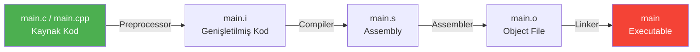
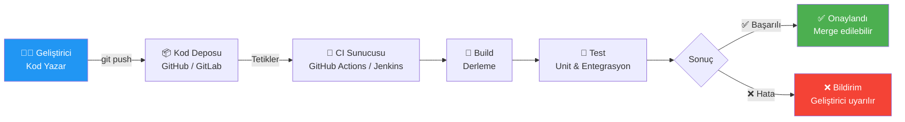
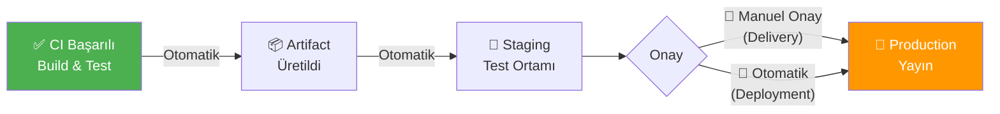
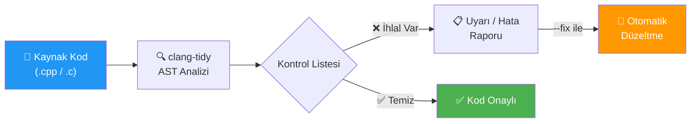

# Compiler

!!! note "Genel Bakış"
    Yazdığın C/C++ kodu bilgisayarın doğrudan anlayabileceği bir şey değildir. İnsan için okunabilir metin, işlemcinin çalıştırabileceği makine diline dönüşmeden önce dört farklı aşamadan geçer: **Preprocessor → Compiler → Assembler → Linker**. Her aşama farklı bir sorunu çözer ve farklı bir çıktı üretir.



---

## Derleme Aşamaları

Her aşama bağımsız bir araçtır ve belirli bir dönüşüm yapar. `gcc` komutu bunların hepsini sırayla çalıştırır; ama `-E`, `-S`, `-c` bayraklarıyla istediğin noktada durup ara çıktıları inceleyebilirsin. Bu, hata ayıklamada çok değerlidir.

| # | Aşama | Girdi | Çıktı | Ne Yapar? |
|---|-------|-------|-------|-----------|
| 1 | **Preprocessing** | `.c` / `.cpp` | `.i` | `#include` dosyalarını yerleştirir, macro'ları açar, `#ifdef` bloklarını değerlendirir, yorum satırlarını siler |
| 2 | **Compilation** | `.i` | `.s` | Temizlenmiş C/C++ kodunu hedef mimarinin assembly diline çevirir; asıl derleme burada olur |
| 3 | **Assembly** | `.s` | `.o` | Assembly kodunu binary makine diline dönüştürerek object file üretir |
| 4 | **Linking** | `.o` + kütüphaneler | executable | Tüm object file'ları ve kütüphaneleri birleştirerek çalıştırılabilir program üretir; sembol referanslarını çözümler |

!!! tip "Neden Birden Fazla Aşama Var?"
    Her aşamanın bağımsız olması önemli avantajlar sağlar. 100 dosyadan oluşan projede sadece bir dosya değiştiğinde yalnızca o dosya yeniden derlenir; diğer 99 dosyanın `.o` dosyaları kullanılır. Bu incremental build'in temelidir.

!!! example "Aşamaları Tek Tek Çalıştırma"
    ```bash
    gcc -E main.c -o main.i         # 1. Preprocessing  → .i  (macro açılmış hali gör)
    gcc -S main.i -o main.s         # 2. Compilation    → .s  (üretilen assembly'yi incele)
    gcc -c main.s -o main.o         # 3. Assembly       → .o  (object file)
    gcc main.o -o main              # 4. Linking        → executable

    gcc -save-temps main.c -o main  # Tek komut, tüm ara dosyaları sakla
    ```

!!! note "Ara Dosyaları İncelemek Ne İşe Yarar?"
    - **`.i` dosyası:** Macro'nun tam olarak neye açıldığını, hangi header'ın dahil edildiğini görmek için.
    - **`.s` dosyası:** Derleyicinin ürettiği assembly'yi görerek optimizasyonların etkisini analiz etmek için.
    - **`.o` dosyası:** `nm` veya `objdump` ile sembolleri inceleyerek linker hatalarının kaynağını bulmak için.

---

## GCC / G++ Parametreleri

**Problem:** Varsayılan derleme ayarları pek çok hatayı sessizce geçer. Derleyici uyarıları ve optimizasyon seviyeleri bilinçli seçilmezse hem hatalı hem de yavaş kod üretilir.

!!! tip "Geliştirme vs Production Ayarları"
    - **Geliştirme:** `-Wall -Wextra -g -O0` — tüm uyarılar açık, optimizasyon kapalı, debug bilgisi mevcut.
    - **Production:** `-Wall -Wextra -Werror -O2` — uyarılar hata sayılır, iyi optimizasyon.
    - **Minimum standart:** `-Wall -Wextra` her ortamda olmalı. Susturulan uyarı = gizlenen bug.

### Uyarı Parametreleri

| Parametre | Açıklama |
|-----------|----------|
| `-Wall` | Temel warning mesajlarını aktif eder (adına rağmen "tümünü" değil, yaygın olanları açar) |
| `-Wextra` | `-Wall`'ın kapsamadığı ek uyarıları gösterir |
| `-Wconversion` | Veri kaybına yol açabilecek type dönüşümlerini uyarır (`int` → `char` gibi) |
| `-Wsign-conversion` | Signed/unsigned dönüşümlerindeki riskleri bildirir |
| `-Werror` | Tüm uyarıları hata olarak ele alır; uyarı varsa derleme durur |
| `-Wpedantic` | Standart dışı uzantılar kullanıldığında uyarır |

### Optimizasyon Seviyeleri

| Parametre | Açıklama |
|-----------|----------|
| `-O0` | Optimizasyon yok; varsayılan. Debug için idealdir çünkü kod satır satır çalışır |
| `-O1` | Temel optimizasyonlar; derleme süresi az artar, çalışma hızı iyileşir |
| `-O2` | Güçlü optimizasyonlar; production için standart tercih |
| `-O3` | Agresif optimizasyon; `-O2`'den daha hızlı olabilir ama bazen beklenmeyen davranış |
| `-Os` | Boyut optimizasyonu; gömülü sistemlerde flash alanı kısıtlıysa kullanılır |
| `-Og` | Debug ile uyumlu optimizasyon; `-O0`'dan hızlı ama debugger'ı bozmaz |

!!! warning "-O2 ile -O0 Arasındaki Fark"
    Debug sırasında `-O2` ile derleme yaparsan breakpoint'ler beklenmedik sırada durabilir, bazı değişkenler kaybolur. Bunun nedeni derleyicinin kodu yeniden düzenlemesidir. Debug için her zaman `-O0` veya `-Og` kullan.

### Diğer Önemli Parametreler

| Parametre | Açıklama |
|-----------|----------|
| `-std=c++17` | Kaynak kodun belirtilen C++ standardına göre derleneceğini belirtir |
| `-g` | Debug bilgisi ekler; GDB, Valgrind gibi araçlarla kullanım için şarttır |
| `-I<dizin>` | Header dosyalarının aranacağı ek dizini (include path) ekler |
| `-o <dosya>` | Çıktı dosyasının adını belirtir |
| `-c` | Yalnızca object file üretir; link aşamasını atlar |
| `-E` | Yalnızca preprocessor çıktısı üretir |
| `-S` | Yalnızca assembly çıktısı üretir |

!!! example "Kullanım Örnekleri"
    ```bash
    gcc  -o output main.c   -Wall -Wextra -Wconversion -Wsign-conversion
    g++  -o output main.cpp -std=c++17 -Wall -Wextra -Werror -O2
    g++  -o output main.cpp -std=c++17 -I./include -I/usr/local/include
    g++  -o output main.cpp -g -O0     # Debug derlemesi
    g++  -o output main.cpp -Os        # Gömülü sistem için boyut optimizasyonu
    ```

!!! note "VS Code Derleyici Ayarları"
    ```json title="tasks.json"
    {
        "version": "2.0.0",
        "tasks": [
            {
                "label": "C++ Build",
                "type": "shell",
                "command": "g++",
                "args": [
                    "-std=c++20", "-Wall", "-Wextra",
                    "-Wconversion", "-Wsign-conversion",
                    "-Werror", "-o", "main", "main.cpp"
                ],
                "group": { "kind": "build", "isDefault": true }
            }
        ]
    }
    ```

---

## Kconfig ve Menuconfig

**Problem:** Büyük projelerde (özellikle Linux kernel ve gömülü sistemlerde) yüzlerce özellik var: bazıları opsiyonel, bazıları birbiriyle çelişiyor, bazıları başka özelliklere bağımlı. Bu özelliklerin derleme öncesinde yönetilmesi gerekiyor. Bunu elle `#define` ile yapmak hem hatalıdır hem de bakımı imkânsız hale gelir.

**Çözüm:** Kconfig + Menuconfig ikilisi bu konfigürasyonu yapılandırılmış, bağımlılık farkında ve kullanıcı dostu bir şekilde yönetir.

!!! tip "İkisi Arasındaki Fark"
    - **Kconfig:** Hangi özelliklerin var olduğunu, birbirleriyle ilişkilerini ve varsayılan değerlerini tanımlayan metin tabanlı konfigürasyon *dili*dir. Sadece tanımlar.
    - **Menuconfig:** Kconfig dosyalarını okuyarak geliştirici için terminal tabanlı arayüz sunan *araçtır*. `make menuconfig` komutuyla açılır.

Sonuç: Seçimler `.config` dosyasına yazılır, derleme sistemi bu dosyayı okuyarak neyin dahil edileceğine karar verir.

### Veri Türleri

| Tür | Açıklama |
|-----|----------|
| `bool` | Açık (`y`) / Kapalı (`n`) |
| `tristate` | Kapalı (`n`) / Açık (`y`) / Modül (`m`) — kernel modülleri için |
| `string` | Metin değeri |
| `int` | Ondalık sayı |
| `hex` | Onaltılık sayı |

### Anahtar Kelimeler

| Kelime | Açıklama |
|--------|----------|
| `mainmenu` | Konfigürasyon ekranının ana başlığını tanımlar |
| `comment` | Arayüzde görünecek bilgi/açıklama satırı ekler |
| `menu / endmenu` | Seçenekleri hiyerarşik alt menü altında gruplar |
| `choice / endchoice` | Listeden yalnızca tek seçime izin veren grup oluşturur |
| `config` | Yeni bir yapılandırma parametresi tanımlar |
| `default` | Parametrenin varsayılan değerini belirler |
| `depends on` | Seçeneğin görünürlüğünü başka bir parametreye bağlar; bağımlılık karşılanmazsa gizlenir |
| `select` | Bu seçenek aktif edildiğinde bağımlılıklarını otomatik etkinleştirir |
| `range` | `int` veya `hex` girdilerin min/max sınırlarını belirler |
| `help` | Yardım butonuna basıldığında gösterilecek açıklama metnini içerir |

!!! example "Örnek Kconfig"
    ```kconfig
    mainmenu "Proje Konfigürasyonu"

    config ENABLE_LOGGING
        bool "Loglama aktif et"
        default y
        help
            Sistem loglarını aktif eder.

    config LOG_LEVEL
        int "Log seviyesi"
        range 0 5
        default 3
        depends on ENABLE_LOGGING  # Loglama kapalıysa bu seçenek gizlenir
    ```

---

## Make

**Problem:** 50 dosyadan oluşan bir proje düşün. Her değişiklikte tüm dosyaları yeniden derlemek hem zaman kaybıdır hem de gereksizdir. Hangi dosyanın hangi dosyaya bağımlı olduğunu elle takip etmek ise hata kaynağıdır.

**Çözüm:** Make, kaynak dosyalar arasındaki bağımlılıkları tanımlamanı sağlar. Bir dosya değiştiğinde yalnızca ona bağımlı olanları yeniden derler. Bu **incremental build** (artımlı derleme) özelliğidir.

**Analoji:** Fabrika montaj hattı gibi düşün. Her parça belirli parçalara bağımlıdır. Bir parça değiştiğinde sadece o parçadan etkilenen sonraki adımlar tekrarlanır; baştan başlanmaz.

```makefile
target: dependencies
	command   # TAB ile girintilenmeli, boşluk değil!
```

### Özel Karakterler

| Karakter | Açıklama |
|----------|----------|
| `#` | Yorum satırı |
| `@` | Komutun kendisini terminalde gizler; yalnızca çıktısını gösterir |
| `$` | Değişkenlere veya otomatik değişkenlere referans verir |
| `\` | Uzun satırı bir sonraki satırda devam ettirir |

### Değişken Atama Operatörleri

| Operatör | Tür | Açıklama |
|----------|-----|----------|
| `=` | Recursive (gecikmeli) | Değişken kullanıldığı andaki güncel içeriğe göre değerlenir |
| `:=` | Simple (anında) | Atama anında değerlendirilir ve sabitlenir; öngörülebilir davranış |
| `?=` | Koşullu | Değişken tanımlı değilse atar; tanımlıysa mevcut değeri korur |
| `+=` | Ekleme | Mevcut değerin sonuna yeni değer ekler |

!!! tip "Hangi Atama Operatörü Kullanılmalı?"
    Genel kural olarak `:=` tercih edilmeli. `=` kullanımı döngüsel referans riskini artırır ve büyük projelerde beklenmeyen davranışa yol açabilir. `wildcard` fonksiyonu **mutlaka** `:=` ile kullanılmalı; aksi hâlde genişletilmez.

### Otomatik Değişkenler

| Değişken | Açıklama |
|----------|----------|
| `$@` | Mevcut kuralın **target** adı |
| `$^` | Target'a ait **tüm dependency**'lerin listesi |
| `$<` | Target'ı tetikleyen **ilk dependency** |
| `$?` | Target'tan **daha yeni** olan dependency'lerin listesi |

### Joker ve Pattern Karakterler

| Karakter | Açıklama |
|----------|----------|
| `*` | Dosya adı genişletmesinde tüm dosyalarla eşleşir (wildcard) |
| `%` | Pattern kurallarında değişken kısmı temsil eder — `%.o: %.c` tüm `.c` dosyaları için geçerli olur |
| `:` | Target ile dependency arasındaki ilişkiyi kurar |
| `::` | Aynı target için birbirinden bağımsız birden fazla kural tanımlar |

### Make Bayrakları

| Bayrak | Açıklama |
|--------|----------|
| `make -s` | Silent mode; komutların kendisini terminale basmaz |
| `make -k` | Hata olsa bile bağımsız diğer target'lar derlemeye devam eder |
| `make -i` | Hataları yok sayarak sona kadar devam eder |
| `make -j<n>` | `n` paralel iş parçacığıyla derler — `make -j$(nproc)` tüm çekirdekleri kullanır |

!!! danger "Kritik Kurallar"
    1. Makefile komut satırları **kesinlikle TAB** ile girintilenmeli. Boşluk (Space) kullanılması `Makefile:N: *** missing separator` hatasına yol açar.
    2. Target adında gerçek bir dosya veya dizin varsa Make "zaten güncel" sayar ve komutu çalıştırmaz. Bunu önlemek için `.PHONY` kullanılır.
    3. `wildcard` fonksiyonu mutlaka `:=` ile kullanılmalıdır; aksi hâlde genişletilmez.

!!! example "Örnek Makefile"
    ```makefile
    CC     := gcc
    CFLAGS := -Wall -Wextra -O2
    SRC    := $(wildcard *.c)
    OBJ    := $(SRC:.c=.o)
    TARGET := output

    .PHONY: all clean

    all: $(TARGET)

    $(TARGET): $(OBJ)
    	$(CC) $^ -o $@

    %.o: %.c
    	$(CC) $(CFLAGS) -c $< -o $@

    clean:
    	rm -f $(OBJ) $(TARGET)
    ```

---

## CMake

**Problem:** Make ile yazılan Makefile'lar platforma özgüdür — Linux'ta yazılan Makefile Windows'ta çalışmaz. Farklı derleyiciler (GCC, Clang, MSVC) farklı bayraklar kullanır. Büyük projelerde bağımlılık yönetimi elle yapılması neredeyse imkânsız hale gelir.

**Çözüm:** CMake bir **meta-build sistemidir** — doğrudan derleme yapmaz. Platformdan bağımsız `CMakeLists.txt` dosyalarını okur ve hedef platforma uygun Makefile, Ninja veya Visual Studio proje dosyalarını üretir.

**İki Adımlı Süreç:**
1. **Configure:** `cmake -S . -B build` — CMakeLists.txt okunur, sistemi analiz eder, build dosyaları üretilir.
2. **Build:** `cmake --build build` — Üretilen build dosyaları kullanılarak derleme yapılır.


### Dosya Türleri

| Dosya | Açıklama |
|-------|----------|
| `CMakeLists.txt` | Projenin her dizininde yer alan ana yapı taşı; CMake'in okuduğu tanım dosyası |
| `<script>.cmake` | `cmake -P` ile doğrudan çalıştırılan script dosyaları |
| `<module>.cmake` | `include()` veya `find_package()` ile dahil edilen yardımcı modüller |

### Temel Komutlar

| Komut | Açıklama |
|-------|----------|
| `cmake_minimum_required(VERSION x.y)` | Minimum CMake sürümünü zorunlu kılar; her dosyanın ilk satırı olmalı |
| `project(ad VERSION x.y LANGUAGES CXX)` | Proje adını, versiyonunu ve dillerini tanımlar |
| `add_executable(hedef kaynak...)` | Kaynak kodlardan çalıştırılabilir program üretir |
| `add_library(hedef TÜR kaynak...)` | Static, shared veya interface kütüphane üretir |
| `add_subdirectory(dizin)` | Alt dizindeki `CMakeLists.txt` dosyasını çalıştırır |
| `target_include_directories(hedef KAPSAM dizin...)` | Header arama dizinlerini hedefe tanımlar |
| `target_link_libraries(hedef KAPSAM kütüphane...)` | Hedefe kütüphane bağlar |

### Kapsam Belirteçleri (PUBLIC / PRIVATE / INTERFACE)

Modern CMake'in en kritik kavramı budur. Bir kütüphane tanımlarken bağımlılıkların kimleri etkileyeceğini belirler.

!!! tip "Kapsam Mantığı"
    | Belirteç | Hedef kullanır | Tüketiciler kullanır | Ne zaman? |
    |----------|:--------------:|:-------------------:|-----------|
    | `PUBLIC` | ✓ | ✓ | Header'ları dışarıya açık bir kütüphane |
    | `PRIVATE` | ✓ | ✗ | Sadece bu hedefin iç uygulaması |
    | `INTERFACE` | ✗ | ✓ | Header-only kütüphaneler |

    **Örnek:** `mathlib` kütüphanesi `Eigen` header'larını kullanıyor. Eğer `mathlib`'in kendi `.cpp` dosyaları kullanıyorsa ama dışarı açık API'si kullanmıyorsa `PRIVATE`. Eğer `mathlib`'i kullanan projelerin de `Eigen` header'larına ihtiyacı varsa `PUBLIC`.

### Değişken Yönetimi

| Komut | Açıklama |
|-------|----------|
| `set(VAR değer)` | Değişken tanımlar; `${VAR}` ile erişilir |
| `unset(VAR)` | Değişkeni bellekten siler |
| `$ENV{VAR}` | İşletim sistemi ortam değişkenine erişir |
| `set(VAR değer CACHE TÜR "açıklama" [FORCE])` | Cache'e yazılan kalıcı değişken; `cmake -DVAR=değer` ile dışarıdan geçirilir |

!!! note "Tırnak ve Liste Davranışı"
    ```cmake
    set(LIST_VAR a b c)      # Liste: ["a", "b", "c"]
    set(STR_VAR "a b c")     # Tek string: "a b c"
    set(LIST_VAR2 "a;b;c")   # Liste: ["a", "b", "c"]  (noktalı virgül ayraç)
    ```

### Akış Kontrolü

| Komut | Açıklama |
|-------|----------|
| `if / elseif / else / endif` | Koşullu bloklar |
| `foreach / endforeach` | Döngü |
| `while / endwhile` | Koşul döngüsü |
| `function / endfunction` | Local scope'lu fonksiyon |
| `macro / endmacro` | Inline yapıştırılan makro (parent scope kullanır) |

!!! tip "function vs macro — Önemli Fark"
    `function` yeni bir scope açar; içerideki değişkenler dışarıyı etkilemez. Dışarıyı etkilemesi için `PARENT_SCOPE` kullanılır.
    `macro` çağrıldığı yere kopyalanır ve o noktanın scope'unu doğrudan kullanır. Bu beklenmedik yan etkilere yol açabilir — genel kural olarak `function` tercih edilmeli.

!!! example "foreach Kullanımı"
    ```cmake
    foreach(x RANGE 10)       # 0'dan 10'a kadar (10 dahil)
    foreach(x RANGE 10 20)    # 10'dan 20'ye kadar
    foreach(x RANGE 10 20 5)  # 10'dan 20'ye 5'erli artışla

    foreach(item IN LISTS MY_LIST)
        message(STATUS "Eleman: ${item}")
    endforeach()
    ```

!!! tip "if Koşul Operatörleri"
    **1, TRUE, Y, YES, ON** doğru; **0, FALSE, N, NO, OFF, IGNORE, NOTFOUND** ve boş string yanlış kabul edilir.

    | Operatör | Açıklama |
    |----------|----------|
    | `DEFINED` | Değişkenin tanımlı olup olmadığını kontrol eder |
    | `COMMAND` | CMake komutunun mevcut olup olmadığını kontrol eder |
    | `EXISTS` | Dosya veya dizin yolunun var olup olmadığını kontrol eder |
    | `STREQUAL` | İki string değerin eşitliğini kontrol eder |
    | `STRGREATER` / `STRLESS` | String karşılaştırması |
    | `NOT`, `AND`, `OR` | Mantıksal operatörler |

### Yardımcı Komutlar

| Komut | Açıklama |
|-------|----------|
| `message(DURUM "metin")` | Terminale çıktı basar (`STATUS`, `WARNING`, `FATAL_ERROR`) |
| `include(dosya)` | `.cmake` dosyasını dahil eder |
| `find_package(pkg REQUIRED)` | Sistemde kurulu paketi arar; `REQUIRED` varsa bulamazsa hata verir |
| `option(VAR "açıklama" ON/OFF)` | Kullanıcıya açma/kapama anahtarı sunar; `cmake -DVAR=ON` ile geçirilir |
| `install(TARGETS/FILES ...)` | `make install` için kurulum kurallarını tanımlar |
| `file(GLOB VAR şablon)` | Şablona uyan dosyaları listeler |
| `add_compile_options(flags...)` | Geçerli dizindeki tüm hedeflere derleyici parametresi ekler |
| `add_custom_command(...)` | Derleme sürecine özel komut adımı ekler |
| `add_custom_target(...)` | Dosya üretmeyen bağımsız build hedefi oluşturur (ör: `format`, `docs`) |
| `execute_process(COMMAND ...)` | Yapılandırma anında terminal komutu çalıştırır |
| `cmake_policy(...)` | Sürümler arası davranış uyumluluğunu yönetir |

!!! note "execute_process Parametreleri"
    | Parametre | Açıklama |
    |-----------|----------|
    | `COMMAND` | Çalıştırılacak komutu tanımlar |
    | `WORKING_DIRECTORY` | Komutun çalışacağı dizini belirtir |
    | `RESULT_VARIABLE` | Başarıda `0`, hata durumunda `1` döner |
    | `OUTPUT_VARIABLE` | Komut çıktısını değişkene atar |
    | `ERROR_VARIABLE` | Hata mesajını sakladığı değişkeni belirtir |

### Önemli CMake Değişkenleri

| Değişken | Açıklama |
|----------|----------|
| `PROJECT_NAME` | `project()` komutundaki güncel proje adı |
| `CMAKE_PROJECT_NAME` | Kök dizindeki ana proje adı |
| `CMAKE_VERSION` | Çalışan CMake sürümü |
| `CMAKE_GENERATOR` | Kullanılan build sistemi (Ninja, Unix Makefiles) |
| `CMAKE_SOURCE_DIR` | Ana proje dizininin tam yolu |
| `CMAKE_CURRENT_SOURCE_DIR` | İşlenen `CMakeLists.txt`'in bulunduğu dizin |
| `PROJECT_SOURCE_DIR` | En son çağrılan `project()` komutuna ait dizin |
| `CMAKE_BINARY_DIR` | Ana build dizini |
| `CMAKE_SYSTEM_NAME` | Hedef işletim sistemi (Linux, Windows, Darwin) |
| `CMAKE_INSTALL_PREFIX` | `install()` komutunun hedef kök dizini |
| `CMAKE_MODULE_PATH` | Ek modüllerin aranacağı klasör yolları |

### CMake CLI

```bash
cmake --help                         # Genel yardım
cmake --help-variable-list           # Kullanılabilir değişkenleri listeler
cmake --help-variable CMAKE_VERSION  # Belirli değişken hakkında detay

cmake -S . -B build                  # Kaynak ve build dizinini tanımla
cmake --build build                  # Derle
cmake --build build --target clean   # Belirli target'ı çalıştır
cmake -P script.cmake                # Script modunda çalıştır (derleme yapmaz)

cmake -G "Ninja" -DCMAKE_BUILD_TYPE=Release -S . -B build
```

=== "Derleme Yöntem 1"
    ```bash
    mkdir build && cd build
    cmake ..
    make
    ```

=== "Derleme Yöntem 2"
    ```bash
    cmake -S . -B build
    cd build && make
    ```

=== "Derleme Yöntem 3 (Önerilen)"
    ```bash
    cmake -B build
    cmake --build build   # Platform bağımsız; Ninja veya Make kullanılabilir
    ```

!!! danger "Dikkat Edilmesi Gerekenler"
    1. **`file(GLOB)` yerine kaynak dosyaları elle listele.** `GLOB` yeni dosya eklendiğinde CMake'i otomatik tetiklemez; elle eklenen dosya derlemeye dahil olmayabilir.
    2. **`CACHE` değişkenleri `build/CMakeCache.txt` dosyasında saklanır.** Komut satırından `-D` ile verilen değerlerin önbelleği ezmesi için `FORCE` kullanılır ya da `CMakeCache.txt` silinir.
    3. **`CMakeLists.txt` dosyası `-P` (Script modu) ile çalıştırılamaz.** `-P` yalnızca `add_executable` gibi derleme hedefleri içermeyen saf `.cmake` script dosyaları içindir.

!!! example "Minimal CMakeLists.txt"
    ```cmake
    cmake_minimum_required(VERSION 3.20)
    project(MyProject VERSION 1.0 LANGUAGES CXX)

    set(CMAKE_CXX_STANDARD 17)
    set(CMAKE_CXX_STANDARD_REQUIRED ON)

    add_executable(myapp
        src/main.cpp
        src/utils.cpp
    )

    target_include_directories(myapp PRIVATE include/)
    target_compile_options(myapp PRIVATE -Wall -Wextra)
    ```

---

## CI (Continuous Integration)

**Problem:** 10 kişilik ekipte herkes kendi bilgisayarında "çalışıyor" diyor ama kod birleştirilince hiçbir şey çalışmıyor. Ya da bir geliştirici farkında olmadan bir başkasının kodunu bozdu, hata üretime kadar fark edilmedi. "Bende çalışıyor" sendromunun sistematik çözümü gerekiyor.

**Çözüm:** CI, her kod değişikliğinde (commit/pull request) otomatik olarak derleme ve testleri çalıştırır. Sorunları dakikalar içinde raporlar; production'a geçmeden yakalar.

**Analoji:** Fabrikada kalite kontrol hattı. Her parça üretim sonunda kontrol noktasından geçer. Sorunlu parça hemen fark edilir, monte edilmeden önce geri döner.



### CI Temel Kavramlar

| Kavram | Açıklama |
|--------|----------|
| **Pipeline** | CI sürecindeki adımların sıralı çalıştığı yapı (build → test → raporlama) |
| **Job** | Pipeline içinde bağımsız olarak çalışan bir görev birimi; paralel çalışabilir |
| **Step / Stage** | Job içindeki tek bir komut ya da eylem |
| **Trigger** | Pipeline'ı başlatan olay (push, pull request, schedule gibi) |
| **Artifact** | Build sonucunda üretilen çıktı dosyaları (binary, rapor, paket) |
| **Runner / Agent** | CI komutlarını çalıştıran sunucu veya sanal makine |

### Popüler CI Araçları

| Araç | Açıklama |
|------|----------|
| **GitHub Actions** | GitHub'a entegre, YAML tabanlı; ek kurulum gerektirmez |
| **GitLab CI/CD** | GitLab'a gömülü, `.gitlab-ci.yml` ile yapılandırılır |
| **Jenkins** | Açık kaynak, eklenti tabanlı; kendi sunucunda çalıştırırsın, tam kontrol |
| **CircleCI** | Bulut tabanlı, hızlı kurulum |
| **Travis CI** | Açık kaynak projeler için yaygın kullanılırdı; günümüzde GitHub Actions daha tercih edilir |

!!! example "GitHub Actions ile C++ CI (`.github/workflows/ci.yml`)"
    ```yaml
    name: C++ CI

    on:
      push:
        branches: [ main, develop ]
      pull_request:
        branches: [ main ]

    jobs:
      build-and-test:
        runs-on: ubuntu-latest

        steps:
          - name: Kodu İndir
            uses: actions/checkout@v4

          - name: Bağımlılıkları Kur
            run: sudo apt-get install -y cmake g++ ninja-build

          - name: CMake ile Yapılandır
            run: cmake -B build -G Ninja -DCMAKE_BUILD_TYPE=Release

          - name: Derle
            run: cmake --build build

          - name: Testleri Çalıştır
            run: cd build && ctest --output-on-failure
    ```

!!! tip "İyi Bir CI Pipeline'ının Özellikleri"
    1. **Hızlı olmalı:** 10 dakikayı geçen pipeline'lar geliştiricileri yavaşlatır ve atlanmaya başlar.
    2. **Deterministik olmalı:** Aynı kod her çalıştırmada aynı sonucu vermelidir. "Bazen geçiyor bazen geçmiyor" olan test güvenilmezdir.
    3. **Anlamlı hata mesajı üretmeli:** Sorunun kaynağını açıkça göstermelidir; geliştirici log'un içinde kaybolmamalı.
    4. **Her commit'te çalışmalı:** Özellikle ana branch'e giden her değişiklikte tetiklenmelidir.

---

## CD (Continuous Delivery / Deployment)

**Problem:** CI ile kod her an çalışır durumda. Ama production'a almak hâlâ manuel, zahmetli ve hata prone bir süreç. "Deploy etmek korkutucu" haline gelince ekipler deploy'u erteleyerek büyük değişiklik paketleri biriktirir. Bu da riski artırır.

**Çözüm:** CD, production'a alma sürecini otomatize eder. Deploy sık yapıldıkça küçük değişiklikler gider ve risk azalır.

!!! tip "Delivery vs Deployment Farkı"
    | | Continuous Delivery | Continuous Deployment |
    |-|--------------------|-----------------------|
    | **Tanım** | Yazılım her an yayına alınmaya **hazır** tutulur | Yazılım her başarılı build'de **otomatik** olarak yayına alınır |
    | **Son adım** | İnsan onayı gerekir | Tamamen otomatik |
    | **Kullanım alanı** | Kritik sistemler, finans, sağlık | SaaS uygulamaları, web servisleri |



### CD Ortamları

| Ortam | Açıklama |
|-------|----------|
| **Development (Dev)** | Geliştiricilerin aktif çalıştığı, en sık değişen ortam |
| **Staging** | Production'ın birebir kopyası; son testler burada yapılır; kullanıcılar görmez |
| **Production (Prod)** | Gerçek kullanıcıların eriştiği canlı ortam |

### Temel CD Stratejileri

| Strateji | Açıklama |
|----------|----------|
| **Blue-Green Deployment** | İki özdeş ortam tutulur; yeni versiyon "yeşil"e alınır, sorun yoksa trafik anahtarlanır. Sorun çıkarsa anında eski ortama geri dönülür |
| **Canary Release** | Yeni versiyon önce %1-5 kullanıcıya sunulur, sorun yoksa kademeli genişletilir. Risk minimize edilir |
| **Rolling Update** | Sunucular sırayla güncellenir; sistem hiç tamamen kapanmaz |
| **Feature Flag** | Yeni özellik kodda mevcut ama yapılandırmayla açık/kapalı kontrol edilir. Deploy ile release birbirinden ayrılır |

!!! example "GitHub Actions ile CD (Staging'e Otomatik Deploy)"
    ```yaml
    name: CD - Staging Deploy

    on:
      push:
        branches: [ main ]

    jobs:
      deploy-staging:
        runs-on: ubuntu-latest
        needs: build-and-test       # CI job'ı başarılıysa çalışır

        steps:
          - name: Kodu İndir
            uses: actions/checkout@v4

          - name: Docker Image Oluştur
            run: docker build -t myapp:${{ github.sha }} .

          - name: Staging'e Gönder
            run: |
              docker tag myapp:${{ github.sha }} registry.example.com/myapp:staging
              docker push registry.example.com/myapp:staging

          - name: Staging Ortamını Güncelle
            run: ssh deploy@staging.example.com "docker pull && docker-compose up -d"

      deploy-production:
        runs-on: ubuntu-latest
        needs: deploy-staging
        environment:
          name: production          # GitHub'da manuel onay gerektirir
        steps:
          - name: Production'a Deploy
            run: ssh deploy@prod.example.com "docker pull && docker-compose up -d"
    ```

!!! danger "CD için Kritik Noktalar"
    1. **Rollback planı:** Her deployment geri alınabilmeli; önceki versiyona dönmek hızlı ve güvenli olmalıdır.
    2. **Health check:** Deploy sonrası uygulamanın ayakta olduğu doğrulanmalı, sorun varsa otomatik rollback tetiklenmelidir.
    3. **Secret yönetimi:** Parola, API anahtarı asla kaynak kodda bulunmamalı; CI/CD sistemi secret store'lardan okumalıdır.
    4. **Ortam değişkenleri:** Dev/Staging/Prod farkları kod değil, konfigürasyon üzerinden yönetilmelidir.

---

## clang-tidy

**Problem:** Derleyici uyarıları pek çok hatayı yakalar ama hepsini yakalamaz. Bellek sızıntısı, null pointer dereference, kullanımdan sonra move gibi hatalar derleme zamanında görünmez, runtime'da patlar. Üstelik eski C++ kodunun modern idiomlarla modernleştirilmesi gerekebilir.

**Çözüm:** clang-tidy, LLVM/Clang altyapısını kullanan bir **statik analiz** ve **linting** aracıdır. Kodu çalıştırmadan, AST (Abstract Syntax Tree) üzerinde analiz ederek potansiyel hataları, stil ihlallerini ve modernleştirme fırsatlarını tespit eder.

!!! note "Statik Analiz Nedir?"
    Programın kaynak kodu üzerinde **çalıştırılmadan** yapılan inceleme. Derleyici uyarılarının ötesine geçer: mantık hataları, kaynak sızıntıları, güvenlik açıkları. Kod review'dan farklı olarak otomatiktir ve her commit'te çalışır.



### Kontrol Kategorileri

| Kategori | Prefix | Açıklama |
|----------|--------|----------|
| **Clang Analizör** | `clang-analyzer-*` | Bellek sızıntısı, null pointer dereference gibi ciddi hatalar |
| **C++ Modernizasyon** | `modernize-*` | Eski C++ kodunu C++11/14/17 idiomlarına dönüştürür |
| **Performans** | `performance-*` | Gereksiz kopyalama, verimsiz döngü gibi sorunları yakalar |
| **Okunabilirlik** | `readability-*` | İsimlendirme, karmaşıklık ve anlaşılırlık sorunlarını raporlar |
| **Güvenlik** | `cert-*` | CERT C/C++ güvenli kodlama standartlarını uygular |
| **Google Stili** | `google-*` | Google C++ stil kurallarını kontrol eder |
| **Hata Yatkınlığı** | `bugprone-*` | Sık yapılan mantık hatalarını ve tehlikeli kalıpları saptar |
| **Taşınabilirlik** | `portability-*` | Platformlar arası uyumsuzlukları bildirir |

### Kurulum ve Temel Kullanım

```bash
# Kurulum (Ubuntu/Debian)
sudo apt-get install clang-tidy

# Tek dosyayı analiz et
clang-tidy main.cpp -- -std=c++17

# Tüm kontrolleri etkinleştir
clang-tidy main.cpp --checks="*" -- -std=c++17

# Belirli kategorileri seç
clang-tidy main.cpp --checks="modernize-*,bugprone-*,performance-*" -- -std=c++17

# Sorunları otomatik düzelt
clang-tidy main.cpp --checks="modernize-*" --fix -- -std=c++17

# CMake build diziniyle kullan (compile_commands.json gerekir)
clang-tidy -p build/ main.cpp
```

!!! note "compile_commands.json Nedir?"
    clang-tidy her dosyanın nasıl derlendiğini bilmek ister: hangi include path'ler, hangi bayraklar. Bu bilgiyi `compile_commands.json` dosyasından okur. Olmadan include path'lerini bulamaz ve yanlış analiz yapar. CMake ile üretmek için:
    ```bash
    cmake -B build -DCMAKE_EXPORT_COMPILE_COMMANDS=ON
    ```

### `.clang-tidy` Yapılandırma Dosyası

Proje kök dizinine `.clang-tidy` dosyası eklenerek kontroller kalıcı olarak yapılandırılır; her geliştirici ve CI aynı kuralları kullanır.

!!! example "`.clang-tidy` Örneği"
    ```yaml
    ---
    Checks: >
      -*,
      clang-analyzer-*,
      modernize-*,
      bugprone-*,
      performance-*,
      readability-identifier-naming,
      -modernize-use-trailing-return-type

    WarningsAsErrors: "bugprone-*"

    CheckOptions:
      - key: readability-identifier-naming.ClassCase
        value: CamelCase
      - key: readability-identifier-naming.FunctionCase
        value: camelCase
      - key: readability-identifier-naming.VariableCase
        value: lower_case
      - key: readability-identifier-naming.ConstantCase
        value: UPPER_CASE
    ```

### CMake ile Entegrasyon

!!! example "CMakeLists.txt'te clang-tidy"
    ```cmake
    find_program(CLANG_TIDY clang-tidy)
    if(CLANG_TIDY)
        set(CMAKE_CXX_CLANG_TIDY
            ${CLANG_TIDY}
            --checks=modernize-*,bugprone-*,performance-*
            --warnings-as-errors=bugprone-*)
    endif()
    ```

!!! tip "Sık Kullanılan Kontroller"
    | Kontrol | Açıklama |
    |---------|----------|
    | `modernize-use-nullptr` | `NULL` yerine `nullptr` kullanımını önerir |
    | `modernize-use-auto` | Tip açık olduğunda `auto` kullanımını önerir |
    | `modernize-range-based-for` | İndeks döngülerini range-based for'a çevirir |
    | `modernize-use-override` | Virtual fonksiyon override'larına `override` eklenmesini zorunlu kılar |
    | `bugprone-use-after-move` | `std::move` sonrası nesne kullanımını tespit eder |
    | `performance-unnecessary-copy-initialization` | Gereksiz kopyalamaları işaret eder |
    | `clang-analyzer-cplusplus.NewDelete` | Bellek sızıntılarını ve çifte silmeleri tespit eder |

---

## clang-format

**Problem:** 5 kişilik ekipte herkes farklı girinti, parantez ve boşluk stili kullanıyor. Code review'ların önemli kısmı "neden burada boşluk var" tartışmalarıyla geçiyor. Bir dosyaya birden fazla kişi dokunduğunda git diff anlamsız değişikliklerle dolup taşıyor.

**Çözüm:** clang-format, kaynak kodunu otomatik olarak biçimlendiren bir araçtır. Bir kez yapılandırıldıktan sonra herkes aynı formata sahip olur. Code review'lar yalnızca mantıksal değişikliklere odaklanabilir.

!!! note "Otomatik Formatlama Neden Önemli?"
    Kodu elle formatlamak zaman kaybıdır. `clang-format` kullanıldığında ekip farklı editörler kullansa bile her commit aynı formata sahip olur. Bu özellikle gömülü sistemlerde ve büyük C++ projelerinde standart bir pratiktir.

### Yerleşik Stil Şablonları

| Stil | Açıklama |
|------|----------|
| `LLVM` | LLVM projesinin kodlama standartları |
| `Google` | Google C++ Stil Kılavuzu |
| `Chromium` | Google'ın Chromium projesi stili |
| `Mozilla` | Mozilla kodlama standartları |
| `WebKit` | WebKit projesinin stili |
| `Microsoft` | Microsoft C++ kodlama stili |
| `GNU` | GNU projesinin stil kuralları |

### Kurulum ve Temel Kullanım

```bash
# Kurulum (Ubuntu/Debian)
sudo apt-get install clang-format

# Çıktıyı terminale yaz (dosyayı değiştirmez — önizleme için)
clang-format main.cpp

# Dosyayı yerinde formatla
clang-format -i main.cpp

# Belirli bir stil şablonuyla formatla
clang-format -i --style=Google main.cpp

# Birden fazla dosyayı formatla
clang-format -i --style=LLVM src/*.cpp include/*.h

# CI'da format kontrolü — değişiklik varsa hata döner, dosyayı değiştirmez
clang-format --dry-run --Werror main.cpp
```

### `.clang-format` Yapılandırma Dosyası

Proje kök dizinindeki `.clang-format` dosyası tüm ekip için ortak kuralları tanımlar. clang-format çalıştırıldığında üst dizinlere bakarak bu dosyayı bulur.

!!! example "`.clang-format` Örneği"
    ```yaml
    ---
    BasedOnStyle: LLVM

    # Girinti
    IndentWidth: 4
    TabWidth: 4
    UseTab: Never
    AccessModifierOffset: -4

    # Satır uzunluğu
    ColumnLimit: 120

    # Süslü parantez stili
    BreakBeforeBraces: Allman    # Her { yeni satırda

    # Boşluk kuralları
    SpaceBeforeParens: ControlStatements
    SpaceInEmptyParentheses: false
    SpacesInAngles: false

    # Pointer ve referans hizalama
    PointerAlignment: Left       # int* ptr  (sola yapışık)

    # Include sıralama
    SortIncludes: CaseSensitive
    IncludeBlocks: Regroup

    # Constructor initializer listesi
    BreakConstructorInitializers: BeforeColon

    # Namespace içi girinti
    NamespaceIndentation: None
    ```

!!! tip "BreakBeforeBraces Seçenekleri"
    | Değer | Görünüm | Kullanım |
    |-------|---------|----------|
    | `Allman` | `{` her zaman yeni satırda | C/C++ geleneksel stili |
    | `Attach` | `{` önceki satırın sonunda | Java / Google stili |
    | `Linux` | Fonksiyonda `{` yeni satır, kontrolde ekli | Linux kernel stili |

### Editör ve CI Entegrasyonu

=== "VS Code"
    ```json title=".vscode/settings.json"
    {
        "editor.formatOnSave": true,
        "editor.defaultFormatter": "xaver.clang-format",
        "C_Cpp.clang_format_style": "file",
        "C_Cpp.clang_format_fallbackStyle": "LLVM"
    }
    ```

=== "CMake"
    ```cmake title="CMakeLists.txt"
    find_program(CLANG_FORMAT clang-format)
    if(CLANG_FORMAT)
        file(GLOB_RECURSE ALL_SOURCE_FILES
            ${CMAKE_SOURCE_DIR}/src/*.cpp
            ${CMAKE_SOURCE_DIR}/include/*.h)

        add_custom_target(format
            COMMAND ${CLANG_FORMAT} -i --style=file ${ALL_SOURCE_FILES}
            COMMENT "Kod formatlaniyor...")

        add_custom_target(format-check
            COMMAND ${CLANG_FORMAT} --dry-run --Werror ${ALL_SOURCE_FILES}
            COMMENT "Format kontrolu yapiliyor...")
    endif()
    ```

=== "GitHub Actions"
    ```yaml title=".github/workflows/format-check.yml"
    name: Format Check

    on: [ push, pull_request ]

    jobs:
      clang-format:
        runs-on: ubuntu-latest
        steps:
          - uses: actions/checkout@v4

          - name: clang-format Kur
            run: sudo apt-get install -y clang-format

          - name: Format Kontrolü
            run: |
              find src/ include/ -name "*.cpp" -o -name "*.h" | \
              xargs clang-format --dry-run --Werror
    ```

!!! tip "Mevcut Koddan Stil Üretme"
    Mevcut projeye `.clang-format` dosyasını sıfırdan yazmak yerine LLVM'den türetip ayarlamak daha kolaydır:
    ```bash
    clang-format --dump-config --style=LLVM > .clang-format
    # Sonra .clang-format dosyasını tercihlerine göre düzenle
    ```

!!! danger "Dikkat Edilmesi Gerekenler"
    1. `.clang-format` dosyası proje kök dizininde olmalıdır; yoksa clang-format üst dizinlere bakarak arar ve yanlış kurallar uygulayabilir.
    2. Mevcut projeye ilk kez `clang-format -i` uygulandığında çok büyük bir diff oluşur. Bu değişikliği tek bir ayrı "style: apply clang-format" commit'ine toplamak git history'nin okunabilirliğini korur.
    3. `ColumnLimit: 0` satır kesimi yapılmamasını sağlar; büyük projelerde okunabilirliği bozabilir.
