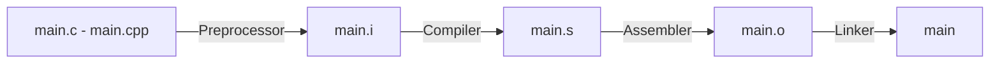

# Compiler



## Derleme Aşamaları

1. **Pre-processing:** Macro ifadeleri çözümlenir, yorum satırları temizlenir ve kod saf C/Cpp kodu haline getirilir.

2. **Compilation:** Temizlenen C/Cpp kodu, hedef işlemcinin mimarisine uygun assembly diline çevrilir.

3. **Assembly:** Assembly kodu, makine diline (0 ve 1) dönüştürülerek bir object file oluşturulur.

4. **Linking:** Programda kullanılan kütüphaneler ve farklı object file dosyaları bir araya getirilerek nihai executable dosya üretilir.

## GCC / G++ Parametreleri

- **Wall:** Kod içerisindeki temel warning mesajlarını aktif eder. 
- **Wextra:** Standart uyarıların ötesinde, daha detaylı ve hassas warning mesajlarının gösterilmesini sağlar.
- **Wconversion:** Veri kaybına yol açabilecek type conversion işlemleriyle ilgili uyarıları tetikler.
- **Wsign-conversion:** Signed ve unsigned veri türleri arasında yapılan dönüşümlerdeki olası risklere karşı uyarı verir.
- **std=c++11:** Derleme işlemi sırasında kaynak kodun C++11 standardına göre işleneceğini belirtir.
- **I:** Projede kullanılan header file dosyalarının aranacağı dizini (include path) tanımlar.
- **O:** Optimizasyon seviyesini ayarlar.

!!! example "Örnek Kullanımlar"
	```bash
	gcc -E main.c -o main.i         # Pre-processing .i dosyası
	gcc -S main.i -o main.s         # Compilation .s dosyası
	gcc -c main.s -o main.o         # Assembly .o dosyası
	gcc main.o -o main              # Linking 
	gcc -save-temps main.c -o main  # Tek komutta tüm adımlar 

	gcc -o main.o main.c -Wall -Wextra -Wconversion -Wsign-conversion
	g++ -o main.o main.cpp -std=c++11 -I/source/includes -O2
	```

!!! note "VS Code Derleyici Ayarları"
	```json title="tasks.json" linenums="1" hl_lines="8"
	{
		"version": "2.0.0",
		"tasks": [
			{
				"label": "C++ Build",
				"type": "shell",
				"command": "g++",
				"args": ["-std=c++20", "-Wall", "-Wextra", "-Wconversion", "-Wsign-conversion", "-Werror", "-o", "main", "main.cpp"],
				"group": {
				"kind": "build",
				"isDefault": true
				}
			}
		]
	}
	```


## Kconfig ve Menuconfig 

- **Kconfig (Altyapı ve Sözdizimi Katmanı):** Projedeki özelliklerin, bağımlılıkların ve varsayılan değerlerin tanımlandığı metin tabanlı konfigürasyon dosyalarıdır.
- **Menuconfig (Arayüz Katmanı):** Kconfig dosyalarında tanımlanan kuralları okuyarak geliştiriciye grafiksel veya terminal tabanlı bir görsel arayüz sunan araçtır.

- **Veri Türleri:** Tanımlanan değişkenin türünü belirler. `bool`, `string`, `int`, `hex` (onaltılık sayı) ve `tristate` (n: kapalı, y: açık, m: modül) türleri mevcuttur. 
- **`mainmenu`:** Konfigürasyon ekranının en üstünde yer alacak ana başlığı tanımlar.
- **`comment`:** Geliştiriciye bilgi vermek amacıyla arayüzde görünecek açıklama satırları ekler.
- **`menu / endmenu`:** Seçenekleri hiyerarşik bir alt menü altında gruplar.
- **`choice / endchoice`:** Kullanıcının listeden sadece tek bir seçeneği seçebileceği çoktan seçmeli gruplar oluşturur.
- **`config`:** Yeni bir yapılandırma parametresi tanımlar.
- **`default`:** Parametrenin başlangıçtaki varsayılan değerini belirler.
- **`depends on`:** Bir seçeneğin görünür veya seçilebilir olmasını başka bir parametrenin durumuna bağlar (dependency).
- **`select`:** Bir seçenek aktif edildiğinde, ihtiyaç duyduğu diğer bağımlılıkları otomatik olarak etkinleştirir.
- **`range`:** int veya hex türündeki sayısal girdilerin minimum ve maksimum sınırlarını belirler.
- **`help`:** Kullanıcının arayüzde yardım butonuna bastığında göreceği detaylı açıklama metnini içerir.


## Make

- **`#`:** Yorum satırı işaretidir.
- **`@`:** Başına geldiği komutun kendisini terminal çıktısında gizler, sadece komutun ürettiği sonucu gösterir.
- **`$`:** Değişkenlere veya otomatik değişkenlere referans vermek için kullanılır.
- **`=`:** Gecikmeli (recursive) değişken ataması yapar. Değişkenin değeri, çağrıldığı andaki güncel içeriğe göre belirlenir.
- **`:=`:** Anında (simple) değerlendirilerek değişken atar.
- **`?=`:** Eğer değişken daha önce tanımlanmamışsa varsayılan değeri atar, tanımlıysa mevcut değeri korur.
- **`$@`:** Mevcut kuralın target adını temsil eden otomatik değişkendir.
- **`$^`:** Target'a ait tüm dependencies listesini tutan otomatik değişkendir.
- **`$<`:** Target'ın tetiklenmesini sağlayan first dependency ifade eden otomatik değişkendir.
- **`$?`:** Target dosyasından daha yeni bir değiştirilme tarihine (timestamp) sahip olan dependencies listeler.
- **`*`:** Dosya adı genişletmede kullanılan joker karakterdir (wildcard); belirtilen dizindeki tüm dosyalarla eşleşir.
- **`%`:** Şablon (pattern) eşleştirmelerinde değişken olan dinamik kısmı temsil eder. Yapısal kurallarda pattern rule tanımlamak için de kullanılır (Örn: %.o: %.c).
- **`:`** Bir target ile onun çalışması için gereken dependencies arasındaki ilişkiyi kurar.
- **`::`:** Aynı target adı için birbirinden bağımsız ve farklı zamanlarda çalışabilecek birden fazla kural tanımlanmasını sağlar.
- **`\`:** Uzun komutların veya satırların bir sonraki satırdan devam ettiğini belirten satır birleştirme karakteridir.
- **`make -s`:** Komutları sessiz modda (silent mode) çalıştırır; terminale işlem adımlarını basmaz.
- **`make -k`:** Bir kuralda hata oluşsa bile, o hatadan bağımsız olan diğer targets derlenmesine devam eder (keep going).
- **`make -i`:** Derleme sırasında karşılaşılan hataları ignore eder sürecin sonuna kadar devam etmesini sağlar.

```Makefile
target: dependencies
	command
```

!!! note "Kritik Kural"
	1. Makefile kurallarının altındaki komut satırlarında girintileme işlemi kesinlikle **TAB** karakteri ile yapılmalıdır. **Boşluk (Space)** kullanılması durumunda derleyici hata verecektir.

	2. Makefile dosyasının bulunduğu dizinde kullandığımız target adında bir dizin veya dosya varsa make ile bu target çalıştırdığımızda `make: '...' is up to date.` hatası alırız. Bu hatanın önüne geçmek için `.PHONY` kullanılır. Direkt olarak target çalışmasını sağlar.

	3. `wildcard` fonksiyonu mutlaka `:=` ile birlikte kullanılmalıdır aksi halde genişletilmez

!!! note "Not"
	Bu kullanım tüm .c dosyalarını .o uzantılı versiyonlara çevirir
	```make
	SRC := $(wildcard *.c)
	OBJ := $(SRC:.c=.o)
	```

## CMake

CMake, platformlar arası derleme süreçlerini otomatikleştirmek ve build dosyalarını (Makefile, Ninja vb.) oluşturmak için kullanılan bir meta-derleme sistemidir.

- **Directories (CMakeLists.txt):** Projenin ana ve alt dizinlerinde yer alır. Derleme mimarisini, hedefleri ve bağımlılıkları tanımlayan ana yapı taşlarıdır.

- **Scripts (`<script>.cmake`):** cmake -P komutuyla doğrudan terminalden çalıştırılabilen, derleme sürecinden bağımsız dosya veya dizin işlemlerini otomatikleştiren betiklerdir

- **Modules (`<module>.cmake`):** include() veya find_package() komutları vasıtasıyla ana build sürecine dahil edilen, harici kütüphaneleri bulma veya özel fonksiyonları projeye katma işlevi gören yardımcı dosyalardır.

- **`if - elseif - else`:** Mantıksal koşul bloklarıdır. **1, TRUE, Y, YES, ON** ifadeleri doğru; **0, FALSE, N, NO, OFF, IGNORE, NOTFOUND ve boş metinler** yanlış kabul edilir.
	- **DEFINED** Değişkenin tanımlı olup olmadığı kontrol edilir.
	- **COMMAND** Belirtilen CMake komutunun mevcut olup olmadığını kontrol eder.
	- **EXISTS**  Belirtilen dosya veya klasör yolunun fiziksel olarak var olup olmadığını kontrol eder.
	- **STREQUAL** İki string değerin eşit olup olmadığını kontrol eder.
	- **NOT** , **AND**, **OR**
	- **STRGREATER** , **STRLESS**

- **`foreach` ve `while`:** Belirli bir dosya listesi veya şart sağlandığı sürece döngüler yürütür.

```cmake
foreach(x RANGE 10)       # 0'dan 10'a kadar (10 dahil)
foreach(x RANGE 10 20)    # 10'dan 20've kadar
foreach(x RANGE 10 20 5)  # 10'dan 20'ye 5'erli artışla
```

- **`function`:** Çağrıldığı yerde local scope oluşturur. Fonksiyon içindeki değişikliklerin dışarıyı etkilemesi için `PARENT_SCOPE` anahtar kelimesi kullanılmalıdır.
	- **ARGC:** Fonksiyona girilen toplam argüman sayısı.
	- **ARGV:** Girilen tüm argümanların listesi.
	- **ARGN:** Belirlenen parametre isimlerinin dışında kalan ekstra argümanların listesi.

- **`macro`:** Çağrıldığı yere doğrudan kopyalanarak yapıştırılır (inline). Çağrıldığı yerdeki kapsamı (parent scope) kullanır ve oradaki değişkenleri değiştirebilir.

- **`cmake_minimum_required`:** Projenin sorunsuz derlenebilmesi için gereken minimum CMake sürümünü zorunlu kılar.

- **`project`:** Projenin adını, versiyonunu ve kullanılacak programlama dillerini (C, CXX vb.) tanımlar.

- **`add_executable`:** Belirtilen kaynak kodlardan çalıştırılabilir bir nihai program (executable) hedefi oluşturur.

- **`add_library`:** Proje içinde kullanılacak veya dışarıya sunulacak kütüphane (static, shared veya interface) hedefleri oluşturur.

- **`add_subdirectory`:** Belirtilen alt dizine geçiş yaparak oradaki CMakeLists.txt dosyasının çalıştırılmasını sağlar.

- **`target_include_directories`:** Oluşturulan bir hedefe özel header arama dizinlerini tanımlar.
    - **PUBLIC:** Hem hedef hem tüketiciler
    - **PRIVATE:** Tanımlanan dizinleri sadece ilgili hedefin kendisi kullanır; bu hedefi tüketen diğer projeler bu dizinleri görmez
    - **INTERFACE:** İlgili hedefin kendisi derlenirken bu dizinleri kullanmaz, ancak bu hedefi projesine dahil eden tüketiciler bu dizinleri otomatik olarak içeri alır.

- **`include`:** Harici bir .cmake betiğini veya kütüphane yapılandırma dosyasını mevcut CMake akışına dahil eder.

- **`set`:** Bir CMake değişkeni oluşturur. Değişken değerine `${DEGISKEN_ADI}` şeklinde erişilir. Tırnak kullanırsan araya boşluk koysan bile CMake onu tek bir bütün string kabul eder. Araya elle `;` koyarsan listeye çevirir. Tırnak kullanmazsan, her boşluk otomatik olarak bir `;` (yani liste elemanı) halini alır.
- **`unset`:** Tanımlanmış bir değişkeni bellekten silerek tanımsız hale getirir.

- **$ENV{}`:** İşletim sistemine ait ortam değişkenlerine erişmek veya onları değiştirmek için kullanılır.

- **`list(param1 param2 ...)`:** Değişken listeleri üzerinde işlem yapar. `param1` listesi ne yapılacağı, `param2` listenin adıdır. (APPEND, REMOVE_AT, REMOVE_ITEM, REMOVE_DUPLICATES, SORT, INSERT, REVERSE, LENGTH, GET, SUBLIST, JOIN, FIND)

- **`string(param1 param2 ... param_out)`:** Metin ifadelerinin üzerinde işlem yapılmasını sağlar. `param1` ne yapılacağını, `param2` dize ifadesi ve `param_out` çıktıyı tutan değişkendir. (FIND, REPLACE, PREPEND, APPEND, TOLOWER, TOUPPER, LENGTH)

- **`message:`** Terminale çıktı basılmasını sağlar.
	- `message(STATUS "Cmake File Status Worked...")`
	- `message(DEBUG "Cmake File Debug Worked...")`
	- `message(WARNING "Cmake File WARNING Worked...")`
	- `message(FATAL ERROR "Cmake File FATAL ERROR Worked...")`
	- `message("Cmake File Worked...")`

- **`set_target_properties` / `set_property`:** Belirli bir hedefe veya nesneye (C++ standart versiyonu, çıktı adı vb.) özel nitelikler ve kurallar atar.

- **`install`:** Derleme sonucunda üretilen dosyaların, kütüphanelerin veya başlık dosyalarının hedef işletim sistemindeki belirli dizinlere (Örn: `/usr/local/bin`) kurulma kurallarını belirler.
	- **FILES** dosyayı kopyalar
	- **TARGETS**` add_executable()` veya `add_library()` ile oluşturulan hedefleri (binary veya kütüphane) kurar.
	- **EXPORT** Yaptığımız dosyaları `find_package` komutu ile bulmamızı sağlayacak şekilde gerekli forma dönüştürür.

- **`find_package`:** Sistemde kurulu harici paketleri arar. Önce `Find<paket_adi>.cmake` biçimindeki **MODULE** modunu, bulamazsa `<paket_adi>-config.cmake` biçimindeki **CONFIG** modunu tarar. 
	- **REQUIRED** ifadesi paketin bulunmasını zorunlu kılar. 

- **`option`:** Kullanıcıya derleme sürecini özelleştirebileceği **ON/OFF** anahtarları sunar. Terminalden `cmake -DENABLE_FEATURE=ON ..` şeklinde tetiklenebilir.

- **`add_compile_options`:** Geçerli dizin ve altındaki tüm hedeflere uygulanacak derleyici parametrelerini (Örn: `-Wall`) ekler.

- **`add_compile_definitions` ve `add_definitions`:** Kod içerisinden erişilebilecek derleme zamanı makroları tanımlar (Eski bir komut olan `add_definitions` yerine hedef bazlı yönetim için `target_compile_definitions` kullanımı modern CMake standartlarında daha çok önerilir).

- **`file(GLOB)` / `file(GLOB_RECURSE)`:** Belirtilen şablona uyan dosyaları tarayarak bir liste oluşturur (**GLOB_RECURSE** alt klasörleri de tarar).

- **`add_custom_command`:** Belirli bir dosya çıktısı üretmek amacıyla derleme sürecine özel bir komut adımı (Örn: kod üretici çalıştırma) ekler.

- **`add_custom_target`:** Fiziksel bir dosya çıktısı olmasa bile, sadece istenen komutları çalıştırmak üzere bağımsız bir build hedefi (Örn: make documentation) oluşturur.

- **`execute_process`:** Yapılandırma anında terminal üzerinde harici komutlar (Örn: git clone) çalıştırır. 
	- **COMMAND:**  Çalıştırılacak komutu ifade edin
	- **WORKING_DIRECTORY:** Komutların çalışacağı dizini ifade eder.
	- **RESULT_VARIABLE:** Komutun sonucu başarılı olursa 0, başarısız olursa 1 değerini döndürür.
	- **OUTPUT_VARIABLE:** Komut çıktısını değişkene atar.
	- **ERROR_VARIABLE:** Komutta bir hata oluşursa bu hatayı sakladığı değişkeni ayarlarız.

- **`cmake_policy`:** Eski ve yeni CMake sürümleri arasındaki davranış değişikliklerini ve geriye dönük uyumluluk kurallarını yönetir.


```bash 
cmake --help                     # CMake ve build yöntemleri hakkında genel bilgi.
cmake --help-variable-list       # Kullanılabilir değişkenleri listeler.
cmake --help-variable [variable] # Belirtilen değişken hakkında detaylı bilgi.

cmake -S . -B build              # -S cmake'in bulunduğu dizin, -B hedef dizin
cmake --build build              # Belirtilen kurallara göre dizini derler (make)
cmake -P a.cmake                 # -P derleme yapmadan dosyayı yürütür.

cmake -G "Ninja" -DCMAKE_BUILD_TYPE=Release -S . -B build
```

!!! note "Not"
	1. Modern CMake pratiklerinde, yeni dosyalar eklendiğinde CMake'in bunu otomatik fark edip yeniden tetiklenmemesi riskinden dolayı kaynak kodları listelerken `file(GLOB)` yerine dosyaları tek tek elle yazmak tercih edilir.

	2. `CACHE` anahtar kelimesiyle tanımlanan değişkenler, build/CMakeCache.txt dosyasında saklanır. Bu sayede her cmake komutu çalıştığında değerler tekrar hesaplanmaz, doğrudan bellekten okunarak hızlı erişim sağlanır. Komut satırından `-D` parametresiyle gönderilen değerlerin önbellekteki eski değerlerin üzerine zorla yazılması için FORCE ifadesi kullanılır
    ```cmake
    # Cache değişkeni tanımlama şablonu:
	set(DEGISKEN_ADI "Değer" CACHE TUR "Açıklama Metni" [FORCE])

	# Örnek Kullanım:
	set(ENABLE_LOGGING ON CACHE BOOL "Sistem loglarını aktif eder" FORCE)

	3. `CMakeLists.txt` içinde `add_executable` veya project gibi derleme hedefleri barındırdığı için `-P` (Script modu) ile çalıştırılamaz, hata verir. `-P` parametresi sadece saf script komutları içeren `.cmake` dosyaları için geçerlidir.
    ```


| Değişken | Anlamı |
|--------|--------|
| `PROJECT_NAME`              | `project()` komutunda belirtilen güncel proje adı |
| `CMAKE_PROJECT_NAME`        | En üst (kök) dizindeki ana `project()` adı |
| `CMAKE_VERSION`             | Sistemde çalışan güncel CMake sürümü |
| `CMAKE_GENERATOR`           | Yapı oluşturucuyu belirtir (Ninja, Unix Makefiles) |
| `CMAKE_SOURCE_DIR`          | Ana (kök) proje dizininin tam yolu |
| `CMAKE_CURRENT_SOURCE_DIR`  | O anda işlenen CMakeLists.txt dosyasının bulunduğu dizin |
| `PROJECT_SOURCE_DIR`        | En son çağrılan project() komutuna ait dizin yolu |
| `CMAKE_BINARY_DIR`          | Çıktıların üretildiği ana build dizini |
| `CMAKE_SYSTEM`              | Hedef işletim sisteminin tam adı ve versiyonu |
| `CMAKE_SYSTEM_NAME`         | Hedef işletim sisteminin kısa adı (Linux, Windows, Darwin) |
| `CMAKE_INSTALL_PREFIX`      | install() komutunun dosyaları kuracağı kök dizin yolu |
| `CMAKE_MODULE_PATH`         | CMake'in ek modülleri (.cmake) arayacağı özel klasör yolları |


=== "Derleme Yöntem 1"

    ```cmake
    mkdir build  
    cd build  
    cmake ..  
    make
    ```

=== "Derleme Yöntem 2"

    ```cmake
    cmake -S . -B build  
    cd build  
    make 
    ```

=== "Derleme Yöntem 3"

    ```cmake
    cmake -B build  
    cmake --build build
    ```
    