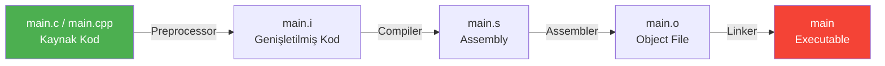

# Compiler

!!! note "Genel Bakış"
    C/C++ kaynak kodu çalıştırılabilir bir programa dönüştürülürken dört aşamadan geçer: **Preprocessor → Compiler → Assembler → Linker**.



---

## Derleme Aşamaları

| # | Aşama | Girdi | Çıktı | Açıklama |
|---|-------|-------|-------|---------|
| 1 | **Preprocessing** | `.c` / `.cpp` | `.i` | Macro ifadeleri çözümlenir, `#include` dosyaları gömülür, yorum satırları temizlenir |
| 2 | **Compilation** | `.i` | `.s` | Temizlenen kod, hedef mimarinin assembly diline çevrilir |
| 3 | **Assembly** | `.s` | `.o` | Assembly kodu makine diline (binary) dönüştürülerek object file oluşturulur |
| 4 | **Linking** | `.o` + kütüphaneler | executable | Object file'lar ve kütüphaneler birleştirilerek nihai çalıştırılabilir dosya üretilir |

!!! example "Adım Adım Derleme"
    ```bash
    gcc -E main.c -o main.i         # 1. Preprocessing  → .i
    gcc -S main.i -o main.s         # 2. Compilation    → .s (assembly)
    gcc -c main.s -o main.o         # 3. Assembly       → .o (object)
    gcc main.o -o main              # 4. Linking        → executable

    gcc -save-temps main.c -o main  # Tek komut, tüm ara dosyalar saklanır
    ```

---

## GCC / G++ Parametreleri

!!! tip "Temel Öneri"
    Geliştirme ortamında `-Wall -Wextra` kombinasyonu minimum standart olarak benimsenmelidir. Production derlemelerinde `-Werror` eklenerek uyarılar hata olarak ele alınır.

| Parametre | Açıklama |
|-----------|---------|
| `-Wall` | Temel warning mesajlarını aktif eder |
| `-Wextra` | Standart uyarıların ötesinde daha hassas uyarıları gösterir |
| `-Wconversion` | Veri kaybına yol açabilecek type conversion işlemlerini uyarır |
| `-Wsign-conversion` | Signed/unsigned dönüşümlerindeki riskleri bildirir |
| `-Werror` | Tüm uyarıları hata olarak ele alır; uyarı varsa derleme durur |
| `-std=c++17` | Kaynak kodun belirtilen C++ standardına göre derleneceğini belirtir |
| `-I<dizin>` | Header dosyalarının aranacağı ek dizini (include path) ekler |
| `-O<n>` | Optimizasyon seviyesini ayarlar (`0`: yok, `1-3`: artan, `s`: boyut) |
| `-g` | Debug bilgisi ekler; GDB gibi araçlarla kullanım için gereklidir |
| `-o <dosya>` | Çıktı dosyasının adını belirtir |
| `-c` | Yalnızca object file üretir; link aşamasını atlar |
| `-E` | Yalnızca preprocessor çıktısı üretir |
| `-S` | Yalnızca assembly çıktısı üretir |

!!! example "Kullanım Örnekleri"
    ```bash
    gcc  -o output main.c   -Wall -Wextra -Wconversion -Wsign-conversion
    g++  -o output main.cpp -std=c++17 -Wall -Wextra -Werror -O2
    g++  -o output main.cpp -std=c++11 -I./include -I/usr/local/include
    g++  -o output main.cpp -g -O0     # Debug derlemesi (optimizasyon kapalı)
    ```

!!! note "VS Code Derleyici Ayarları"
    ```json title="tasks.json"
    {
        "version": "2.0.0",
        "tasks": [
            {
                "label": "C++ Build",
                "type": "shell",
                "command": "g++",
                "args": [
                    "-std=c++20", "-Wall", "-Wextra",
                    "-Wconversion", "-Wsign-conversion",
                    "-Werror", "-o", "main", "main.cpp"
                ],
                "group": { "kind": "build", "isDefault": true }
            }
        ]
    }
    ```

---

## Kconfig ve Menuconfig

**Kconfig** ve **Menuconfig**, özellikle Linux kernel ve gömülü sistem projelerinde derleme öncesi konfigürasyon yönetimini sağlayan araçlardır.

!!! tip "Katman Ayrımı"
    - **Kconfig:** Projedeki özelliklerin, bağımlılıkların ve varsayılan değerlerin tanımlandığı metin tabanlı konfigürasyon dosyasıdır.
    - **Menuconfig:** Kconfig dosyalarını okuyarak geliştiriciye terminal veya grafik tabanlı arayüz sunan araçtır.

### Veri Türleri

| Tür | Açıklama |
|-----|---------|
| `bool` | Açık (`y`) / Kapalı (`n`) |
| `tristate` | Kapalı (`n`) / Açık (`y`) / Modül (`m`) |
| `string` | Metin değeri |
| `int` | Ondalık sayı |
| `hex` | Onaltılık sayı |

### Anahtar Kelimeler

| Kelime | Açıklama |
|--------|---------|
| `mainmenu` | Konfigürasyon ekranının ana başlığını tanımlar |
| `comment` | Arayüzde görünecek bilgi/açıklama satırı ekler |
| `menu / endmenu` | Seçenekleri hiyerarşik alt menü altında gruplar |
| `choice / endchoice` | Listeden yalnızca tek seçime izin veren grup oluşturur |
| `config` | Yeni bir yapılandırma parametresi tanımlar |
| `default` | Parametrenin başlangıç varsayılan değerini belirler |
| `depends on` | Seçeneğin görünürlüğünü başka bir parametreye bağlar |
| `select` | Seçenek aktif edildiğinde bağımlılıklarını otomatik etkinleştirir |
| `range` | `int` veya `hex` girdilerin min/max sınırlarını belirler |
| `help` | Yardım butonuna basıldığında gösterilecek açıklama metnini içerir |

!!! example "Örnek Kconfig"
    ```kconfig
    mainmenu "Proje Konfigürasyonu"

    config ENABLE_LOGGING
        bool "Loglama aktif et"
        default y
        help
            Sistem loglarını aktif eder.

    config LOG_LEVEL
        int "Log seviyesi"
        range 0 5
        default 3
        depends on ENABLE_LOGGING
    ```

---

## Make

Make, kaynak dosyalar arasındaki bağımlılıkları takip ederek yalnızca değişen dosyaları yeniden derleyen bir build otomasyon aracıdır.

```makefile
target: dependencies
	command   # TAB ile girintilenmeli, boşluk değil!
```

### Özel Karakterler

| Karakter | Açıklama |
|----------|---------|
| `#` | Yorum satırı |
| `@` | Komutun kendisini terminalde gizler; yalnızca çıktısını gösterir |
| `$` | Değişkenlere veya otomatik değişkenlere referans verir |
| `\` | Uzun satırı bir sonraki satırda devam ettirir |

### Değişken Atama Operatörleri

| Operatör | Tür | Açıklama |
|----------|-----|---------|
| `=` | Recursive (gecikmeli) | Değişken çağrıldığı andaki güncel içeriğe göre değerlenir |
| `:=` | Simple (anında) | Atama anında değerlendirilerek sabitlenir |
| `?=` | Koşullu | Değişken tanımlı değilse atar; tanımlıysa mevcut değeri korur |
| `+=` | Ekleme | Mevcut değerin sonuna yeni değeri ekler |

### Otomatik Değişkenler

| Değişken | Açıklama |
|----------|---------|
| `$@` | Mevcut kuralın **target** adı |
| `$^` | Target'a ait **tüm dependency**'lerin listesi |
| `$<` | Target'ı tetikleyen **ilk dependency** |
| `$?` | Target'tan **daha yeni** olan dependency'lerin listesi |

### Joker ve Pattern Karakterler

| Karakter | Açıklama |
|----------|---------|
| `*` | Dosya adı genişletmesinde tüm dosyalarla eşleşir (wildcard) |
| `%` | Pattern kurallarında değişken kısmı temsil eder (örn: `%.o: %.c`) |
| `:` | Target ile dependency arasındaki ilişkiyi kurar |
| `::` | Aynı target için birbirinden bağımsız birden fazla kural tanımlar |

### Make Bayrakları

| Bayrak | Açıklama |
|--------|---------|
| `make -s` | Silent mode; komutların kendisini terminale basmaz |
| `make -k` | Hata olsa bile bağımsız diğer target'lar derlemeye devam eder |
| `make -i` | Hataları yok sayarak sona kadar devam eder |
| `make -j<n>` | `n` paralel iş parçacığıyla derler (örn: `make -j4`) |

!!! danger "Kritik Kurallar"
    1. Makefile komut satırları **kesinlikle TAB** ile girintilenmeli. Boşluk (Space) kullanılması `Makefile:N: *** missing separator` hatasına yol açar.
    2. Target adında bir dizin veya dosya varsa `make: '...' is up to date.` hatası oluşur. Bunu önlemek için `.PHONY` kullanılır.
    3. `wildcard` fonksiyonu mutlaka `:=` ile kullanılmalıdır; aksi hâlde genişletilmez.

!!! example "Örnek Makefile"
    ```makefile
    CC     := gcc
    CFLAGS := -Wall -Wextra -O2
    SRC    := $(wildcard *.c)
    OBJ    := $(SRC:.c=.o)
    TARGET := output

    .PHONY: all clean

    all: $(TARGET)

    $(TARGET): $(OBJ)
    	$(CC) $^ -o $@

    %.o: %.c
    	$(CC) $(CFLAGS) -c $< -o $@

    clean:
    	rm -f $(OBJ) $(TARGET)
    ```

---

## CMake

CMake, platformlar arası derleme süreçlerini otomatikleştiren ve Makefile, Ninja gibi build dosyalarını üreten bir meta-derleme sistemidir.


### Dosya Türleri

| Dosya | Açıklama |
|-------|---------|
| `CMakeLists.txt` | Projenin her dizininde yer alan ana yapı taşı |
| `<script>.cmake` | `cmake -P` ile doğrudan çalıştırılan script dosyaları |
| `<module>.cmake` | `include()` veya `find_package()` ile dahil edilen yardımcı modüller |

### Temel Komutlar

| Komut | Açıklama |
|-------|---------|
| `cmake_minimum_required(VERSION x.y)` | Minimum CMake sürümünü zorunlu kılar |
| `project(ad VERSION x.y LANGUAGES CXX)` | Proje adını, versiyonunu ve dillerini tanımlar |
| `add_executable(hedef kaynak...)` | Kaynak kodlardan çalıştırılabilir program üretir |
| `add_library(hedef TÜR kaynak...)` | Static, shared veya interface kütüphane üretir |
| `add_subdirectory(dizin)` | Alt dizindeki `CMakeLists.txt` dosyasını çalıştırır |
| `target_include_directories(hedef KAPSAM dizin...)` | Header arama dizinlerini hedefe tanımlar |
| `target_link_libraries(hedef KAPSAM kütüphane...)` | Hedefe kütüphane bağlar |

### Kapsam Belirteçleri

!!! tip "PUBLIC / PRIVATE / INTERFACE"
    | Belirteç | Hedef kullanır | Tüketiciler kullanır |
    |----------|:--------------:|:-------------------:|
    | `PUBLIC` | ✓ | ✓ |
    | `PRIVATE` | ✓ | ✗ |
    | `INTERFACE` | ✗ | ✓ |

### Değişken Yönetimi

| Komut | Açıklama |
|-------|---------|
| `set(VAR değer)` | Değişken tanımlar; `${VAR}` ile erişilir |
| `unset(VAR)` | Değişkeni bellekten siler |
| `$ENV{VAR}` | İşletim sistemi ortam değişkenine erişir |
| `set(VAR değer CACHE TÜR "açıklama" [FORCE])` | Cache'e yazılan kalıcı değişken |

!!! note "Tırnak ve Liste Davranışı"
    ```cmake
    set(LIST_VAR a b c)      # Liste: ["a", "b", "c"]
    set(STR_VAR "a b c")     # Tek string: "a b c"
    set(LIST_VAR2 "a;b;c")   # Liste: ["a", "b", "c"]  (manuel ayraç)
    ```

### Akış Kontrolü

| Komut | Açıklama |
|-------|---------|
| `if / elseif / else / endif` | Koşullu bloklar |
| `foreach / endforeach` | Döngü |
| `while / endwhile` | Koşul döngüsü |
| `function / endfunction` | Local scope'lu fonksiyon |
| `macro / endmacro` | Inline yapıştırılan makro (parent scope kullanır) |

!!! tip "function vs macro"
    `function` yeni bir scope açar; içerideki değişkenler dışarıyı etkilemez, etkilemesi için `PARENT_SCOPE` kullanılır.
    `macro` çağrıldığı yere kopyalanır ve o noktanın scope'unu doğrudan kullanır.

!!! example "foreach Kullanımı"
    ```cmake
    foreach(x RANGE 10)       # 0'dan 10'a kadar (10 dahil)
    foreach(x RANGE 10 20)    # 10'dan 20'ye kadar
    foreach(x RANGE 10 20 5)  # 10'dan 20'ye 5'erli artışla

    foreach(item IN LISTS MY_LIST)
        message(STATUS "Eleman: ${item}")
    endforeach()
    ```

!!! tip "if Koşul Operatörleri"
    **1, TRUE, Y, YES, ON** ifadeleri doğru; **0, FALSE, N, NO, OFF, IGNORE, NOTFOUND** ve boş string'ler yanlış kabul edilir.

    | Operatör | Açıklama |
    |----------|---------|
    | `DEFINED` | Değişkenin tanımlı olup olmadığını kontrol eder |
    | `COMMAND` | Belirtilen CMake komutunun mevcut olup olmadığını kontrol eder |
    | `EXISTS` | Dosya veya dizin yolunun var olup olmadığını kontrol eder |
    | `STREQUAL` | İki string değerin eşitliğini kontrol eder |
    | `STRGREATER` / `STRLESS` | String karşılaştırması |
    | `NOT`, `AND`, `OR` | Mantıksal operatörler |

### Yardımcı Komutlar

| Komut | Açıklama |
|-------|---------|
| `message(DURUM "metin")` | Terminale çıktı basar (`STATUS`, `WARNING`, `FATAL_ERROR`) |
| `include(dosya)` | `.cmake` dosyasını dahil eder |
| `find_package(pkg REQUIRED)` | Sistemde kurulu paketi arar |
| `option(VAR "açıklama" ON/OFF)` | Kullanıcıya açma/kapama anahtarı sunar |
| `install(TARGETS/FILES ...)` | Kurulum kurallarını tanımlar |
| `file(GLOB VAR şablon)` | Şablona uyan dosyaları listeler |
| `add_compile_options(flags...)` | Geçerli dizindeki tüm hedeflere derleyici parametresi ekler |
| `add_custom_command(...)` | Derleme sürecine özel komut adımı ekler |
| `add_custom_target(...)` | Dosya üretmeyen bağımsız build hedefi oluşturur |
| `execute_process(COMMAND ...)` | Yapılandırma anında terminal komutu çalıştırır |
| `cmake_policy(...)` | Sürümler arası davranış uyumluluğunu yönetir |

!!! note "execute_process Parametreleri"
    | Parametre | Açıklama |
    |-----------|---------|
    | `COMMAND` | Çalıştırılacak komutu tanımlar |
    | `WORKING_DIRECTORY` | Komutun çalışacağı dizini belirtir |
    | `RESULT_VARIABLE` | Başarıda `0`, hata durumunda `1` döner |
    | `OUTPUT_VARIABLE` | Komut çıktısını değişkene atar |
    | `ERROR_VARIABLE` | Hata mesajını sakladığı değişkeni belirtir |

### Önemli CMake Değişkenleri

| Değişken | Açıklama |
|----------|---------|
| `PROJECT_NAME` | `project()` komutundaki güncel proje adı |
| `CMAKE_PROJECT_NAME` | Kök dizindeki ana proje adı |
| `CMAKE_VERSION` | Çalışan CMake sürümü |
| `CMAKE_GENERATOR` | Kullanılan build sistemi (Ninja, Unix Makefiles) |
| `CMAKE_SOURCE_DIR` | Ana proje dizininin tam yolu |
| `CMAKE_CURRENT_SOURCE_DIR` | İşlenen `CMakeLists.txt`'in bulunduğu dizin |
| `PROJECT_SOURCE_DIR` | En son çağrılan `project()` komutuna ait dizin |
| `CMAKE_BINARY_DIR` | Ana build dizini |
| `CMAKE_SYSTEM_NAME` | Hedef işletim sistemi (Linux, Windows, Darwin) |
| `CMAKE_INSTALL_PREFIX` | `install()` komutunun hedef kök dizini |
| `CMAKE_MODULE_PATH` | Ek modüllerin aranacağı klasör yolları |

### CMake CLI

```bash
cmake --help                         # Genel yardım
cmake --help-variable-list           # Kullanılabilir değişkenleri listeler
cmake --help-variable CMAKE_VERSION  # Belirli değişken hakkında detay

cmake -S . -B build                  # Kaynak dizin ve build dizini tanımla
cmake --build build                  # Build dizinini derle
cmake -P script.cmake                # Script modunda çalıştır (derleme yapmaz)

cmake -G "Ninja" -DCMAKE_BUILD_TYPE=Release -S . -B build
```

=== "Derleme Yöntem 1"
    ```bash
    mkdir build && cd build
    cmake ..
    make
    ```

=== "Derleme Yöntem 2"
    ```bash
    cmake -S . -B build
    cd build && make
    ```

=== "Derleme Yöntem 3"
    ```bash
    cmake -B build
    cmake --build build
    ```

!!! danger "Dikkat Edilmesi Gerekenler"
    1. Modern CMake'te `file(GLOB)` yerine kaynak dosyaları elle listelemek tercih edilir. `GLOB`, yeni dosyalar eklendiğinde CMake'in otomatik yeniden tetiklenmemesine yol açabilir.
    2. `CACHE` değişkenleri `build/CMakeCache.txt` dosyasında saklanır. Komut satırından `-D` ile verilen değerlerin önbellekteki değerlerin üzerine yazılması için `FORCE` kullanılır.
    3. `CMakeLists.txt` dosyası `-P` (Script modu) ile çalıştırılamaz. `-P` yalnızca `add_executable` gibi derleme hedefleri içermeyen saf `.cmake` script dosyaları içindir.

!!! example "Minimal CMakeLists.txt"
    ```cmake
    cmake_minimum_required(VERSION 3.20)
    project(MyProject VERSION 1.0 LANGUAGES CXX)

    set(CMAKE_CXX_STANDARD 17)
    set(CMAKE_CXX_STANDARD_REQUIRED ON)

    add_executable(myapp
        src/main.cpp
        src/utils.cpp
    )

    target_include_directories(myapp PRIVATE include/)
    target_compile_options(myapp PRIVATE -Wall -Wextra)
    ```