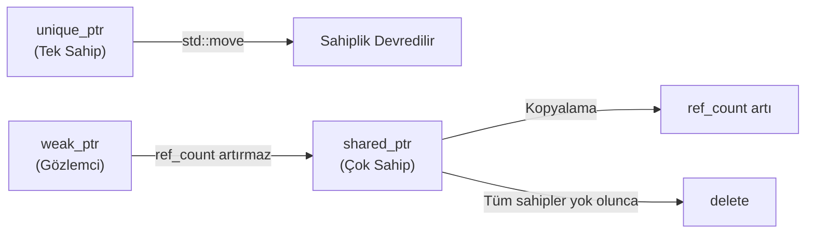
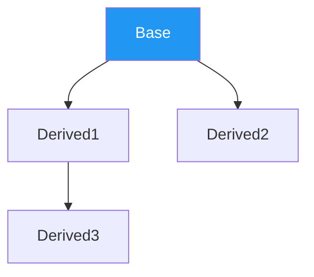
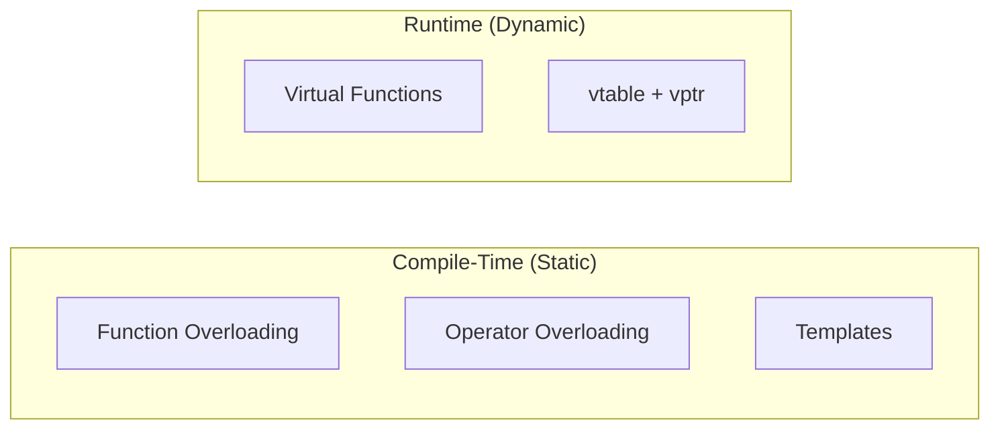

# C++ Programlama

!!! note "Genel Bakış"
    C++, C'nin sistem programlama gücünü nesne yönelimli programlama, generic programlama ve modern soyutlamalarla birleştiren çok paradigmalı bir dildir. "Zero-overhead abstraction" ilkesi temel felsefesidir: kullanmadığın şey için bedel ödemezsin.

---

## Temel Kavramlar

### Değişken Başlatma

| Yöntem | Sözdizimi | Açıklama |
|--------|-----------|---------|
| Copy initialization | `int a = 5;` | C'den gelen klasik yöntem |
| Direct initialization | `int b(5);` | Constructor çağrısına benzer |
| **List initialization** | `int c{5};` | Modern ve en güvenli yöntem |

!!! tip "Neden List Initialization?"
    **Daraltıcı dönüşümlere (narrowing conversion) izin vermez.** `int x{3.14}` derleme hatası verir; `int x = 3.14` ise sessizce `3` atar. Yeni kodda her zaman `{}` tercih edilmelidir.

### Önemli Anahtar Kelimeler

| Anahtar Kelime | Açıklama |
|----------------|---------|
| `constexpr` | Derleme zamanında kesin sabit; `const`'tan güçlüdür (`const` runtime'da da değer alabilir) |
| `consteval` | Her çağrısı derleme zamanında zorunlu olarak değerlendirilir (C++20) |
| `[[maybe_unused]]` | Kullanılmayan değişken için derleyici uyarısını bastırır (C++17) |
| `auto` | Değişken tipini sağ taraftaki ifadeden çıkarır; sıfır runtime maliyeti |
| `decltype` | İfadenin tam tipini `const`/referans niteliğiyle birlikte verir |
| `::` | Önünde isim yoksa global kapsamı ifade eder |

!!! note "Sayı Gösterimleri"
    ```cpp
    int ondalik = 100'000'000;  // ' digit separator (C++14)
    int oktal   = 012;          // Sekizlik
    int hex     = 0x1F;         // Onaltılık
    int binary  = 0b1010;       // İkilik (C++14)

    std::cout << std::oct << n;  // Sekizlik çıktı
    std::cout << std::hex << n;  // Onaltılık çıktı
    ```

### Veri Tipleri ve Tür Takma Adları

```cpp
typedef unsigned long long ULLI1;  // C tarzı (eski)
using   ULLI2 = unsigned long long; // Modern C++ (tercih edilmeli)
```

| Özellik | C | C++ |
|---------|---|-----|
| `struct` tanımlama | `struct Adi var;` veya `typedef` şart | `Adi var;` doğrudan kullanılabilir |
| `struct` içi fonksiyon | Yasak | Tam destekli |
| `enum` tip güvenliği | Zayıf; `int`'e karışabilir | `enum class` ile tamamen izole |
| `enum` kapsam | Tanımlandığı kapsama sızar | `enum class` ile kendi kapsamı |
| `enum` boyutu | Derleyiciye bağlı | `: type` ile yazılımcı belirler |

### std::string ve std::string_view

| | `std::string` | `std::string_view` |
|--|:-------------:|:------------------:|
| Bellek sahibi | ✓ | ✗ (sadece bakış) |
| Bellek ayırır | ✓ | ✗ |
| Değiştirilebilir | ✓ | ✗ |
| Kopyalama maliyeti | Yüksek | Sıfır |
| Ömür bağımlılığı | Kendi yönetir | Gösterdiği veriye bağımlı |

!!! danger "std::string_view Ömür Riski"
    `string_view` gösterdiği verinin sahibi değildir. Kaynak string destroy edilirse `string_view` geçersiz bir veriye işaret eder.

### Prefix vs Postfix

| Operatör | Davranış | Performans |
|----------|----------|-----------|
| `++i` (Prefix) | Hemen artırır, nesnenin referansını döndürür | Geçici nesne oluşturmaz |
| `i++` (Postfix) | Kopyayı alır, ardından artırır, kopyayı döndürür | Geçici nesne oluşturur |

!!! tip "Spaceship Operator (C++20)"
    `<=>` tek bir satırda iki değerin küçüklük, büyüklük ve eşitlik durumunu analiz eder; `std::strong_ordering` veya `std::partial_ordering` döner.

### Kontrol Akışı

```cpp
// Short-Circuit Evaluation
// ptr nullptr ise ptr->data asla çalıştırılmaz → Null Pointer Dereference önlenir
if (ptr != nullptr && ptr->data == 5) { /* ... */ }
```

- **Range-based for loop:** Koleksiyon üzerinde sıralı gezinme. Kopyalamayı önlemek için `const auto&` kullanılır.

```cpp
std::vector<int> sayilar = {10, 20, 30};
for (const auto& sayi : sayilar) {
    std::cout << sayi << ' ';
}
```

---

## Type Casting

C++'ın dört özel cast operatörü, C'nin tek formatlı `(tip)deger` dönüşümüne karşı tip güvenliği ve niyet netliği sağlar.

| Cast Operatörü | Zaman | Maliyet | Amaç |
|----------------|-------|---------|------|
| `static_cast` | Derleme | Sıfır | Mantıksal, güvenli tip dönüşümleri |
| `dynamic_cast` | Runtime | **Yüksek** (RTTI + vtable taraması) | Polimorfik hiyerarşide güvenli downcast |
| `const_cast` | Derleme | Sıfır | `const`/`volatile` niteleyici manipülasyonu |
| `reinterpret_cast` | Derleme | Sıfır | Bit seviyesinde ham ve tehlikeli dönüşüm |

=== "static_cast"
    ```cpp
    double pi  = 3.14159;
    int    tam = static_cast<int>(pi);   // Güvenli; niyet açık

    void *raw = &tam;
    int  *ptr = static_cast<int*>(raw);  // Geçerli

    // char* ptr2 = static_cast<char*>(ptr); // HATA — ilişkisiz tipler
    ```

=== "dynamic_cast"
    ```cpp
    class Base    { virtual void f() {} };   // virtual şart (vtable gerekli)
    class Derived : public Base { public: void alt() {} };

    Base *b = new Base();
    Derived *d = dynamic_cast<Derived*>(b);

    if (d != nullptr)
        d->alt();         // Başarılı dönüşüm
    else
        /* Nesne gerçekte Base; dönüşüm başarısız */;
    ```

=== "const_cast"
    ```cpp
    void eski_c_func(char* str) { /* yazmıyor ama char* bekliyor */ }

    void modern(const char* s) {
        // eski_c_func(s);                    // HATA
        eski_c_func(const_cast<char*>(s));    // Zorunluluktan kabul
    }
    ```

=== "reinterpret_cast"
    ```cpp
    struct AgPaketi { unsigned int id; float veri; };

    char raw[8] = {0};   // Network'ten gelen ham 8 byte
    AgPaketi *p = reinterpret_cast<AgPaketi*>(raw);
    // Sıfır güvenlik. Yalnızca donanım/network düzeyinde kullanılır.
    ```

!!! danger "C-Style Cast Neden Tehlikeli?"
    ```cpp
    const int sabit = 10;
    int *p = (int*)&sabit;   // const kırıldı → Undefined Behavior
    ```
    C-style cast arka planda const kaldırma, alakasız pointer dönüşümü ve sayısal dönüşüm işlemlerini ayırt etmeksizin uygular; niyeti derleyiciye aktaramaz.

---

## Namespace

Mantıksal olarak ilişkili kod bloklarını, sınıfları ve fonksiyonları belirli bir isim altında gruplayan ve global kapsamdan izole eden sanal kapsamdır.

=== "main.hpp"
    ```cpp
    #pragma once    // Include Guard

    namespace A::B {    // C++17 — iç içe yazım
        void foo();
    }

    namespace V1 {
        void doSomething() { std::cout << "V1\n"; }
    }
    inline namespace V2 {    // Varsayılan sürüm
        void doSomething() { std::cout << "V2\n"; }
    }

    struct Foo { int a, b, c; };
    using ULLI = unsigned long long;

    void info();
    ```

=== "main.cpp"
    ```cpp
    using namespace std;   // Tüm std isimlerini açar
    // using std::cout;    // Sadece belirli bir isim

    // Designated Initializer (C++20)
    Foo f0 {1, 2, 3};          // Sırayla atar
    Foo f1 {.a = 1, .c = 3};   // b = 0 (varsayılan)

    int main() {
        V1::doSomething();  // "V1"
        V2::doSomething();  // "V2"
        doSomething();      // inline namespace → "V2"

        auto f = []() { std::cout << "Hello\n"; };
        f();
    }
    ```

!!! note "İsimsiz (Anonymous) Namespace"
    ```cpp
    namespace {
        void gizli() { /* Yalnızca bu .cpp dosyasına görünür */ }
    }
    ```
    C'deki dosya-seviyesi `static`'in modern C++ karşılığıdır. Başka hiçbir dosya `extern` ile bile erişemez.

!!! tip "Inline Namespace — Sürüm Yönetimi"
    ```cpp
    namespace Lib {
        inline namespace V2 { void hesapla(int x) {} }   // Güncel sürüm
        namespace V1        { void hesapla(double x) {} } // Eski sürüm
    }
    Lib::hesapla(5);      // → V2 (inline)
    Lib::V1::hesapla(5.5); // → V1 (açık)
    ```

---

## Standart IO

| Nesne | Açıklama |
|-------|---------|
| `std::cout` | Tamponlu; buffer dolduğunda veya flush olduğunda yazar |
| `std::cerr` | Tamponsuz; hata anında anında yazar (çökme senaryolarında kritik) |
| `<<` | Insertion — veriyi akışa gönderir |
| `>>` | Extraction — akıştan veri çeker; boşluk/tab/newline'da durur |

!!! tip "std::endl vs '\\n'"
    `std::endl` yeni satır ekler **ve** buffer'ı flush eder. Performans kritik sistemlerde bu flush bottleneck yaratabilir. Sadece yeni satır için `'\n'` kullanın; flush gerektiğinde `std::flush` çağırın.

| Format Manipülatör | Açıklama |
|-------------------|---------|
| `std::setw(n)` | Minimum karakter genişliği (sağa hizalı) |
| `std::setprecision(n)` | Ondalık basamak sayısı |
| `std::fixed` | Bilimsel gösterim yerine sabit ondalık |
| `std::hex` / `std::oct` / `std::dec` | Sayı tabanı seçimi |

```cpp
std::cout << std::fixed << std::setprecision(2) << 3.14159; // 3.14
std::cout << std::setw(10) << "test";                       // "      test"
```

---

## Fonksiyonlar

### Overloading ve Name Mangling

C++ derleyicisi, aşırı yüklenmiş fonksiyonları birbirinden ayırmak için arka planda benzersiz isimler üretir; buna **Name Mangling** denir.

!!! note "extern \"C\" — C Kütüphane Entegrasyonu"
    ```cpp
    extern "C" {
        void c_func(int x);  // Name mangling uygulanmaz; saf C sembolü kalır
    }
    ```

### Varsayılan Parametreler

Varsayılan değer ataması sağdan sola yapılır. Varsayılan parametrenin sağında varsayılansız parametre bulunamaz.

```cpp
void f(int a, int b = 10, int c = 20);  // Geçerli
// void g(int a = 10, int b);           // HATA
```

### Lambda İfadeleri

İsmi olmayan, tanımlandığı yerde kullanılabilen küçük fonksiyonlardır.

```cpp
// [capture](parametreler) -> dönüş_tipi { gövde }
auto topla = [](int a, int b) -> int { return a + b; };
```

| Capture | Açıklama |
|---------|---------|
| `[]` | Hiçbir dış değişkene erişemez |
| `[x]` | `x`'in kopyasını alır |
| `[&x]` | `x`'e referansla erişir |
| `[=]` | Tüm dış değişkenleri kopyayla yakalar |
| `[&]` | Tüm dış değişkenleri referansla yakalar |

!!! tip "mutable Lambda"
    Değer olarak yakalanan değişkeni lambda içinde değiştirmek için `mutable` eklenir:
    ```cpp
    int count = 0;
    auto inc = [count]() mutable { return ++count; };
    ```

---

## Pointer

### nullptr vs NULL

| | `NULL` | `nullptr` |
|--|:------:|:---------:|
| Tür | `0` (tam sayı) | `std::nullptr_t` |
| Overloading güvenliği | ✗ — `0` ile karışır | ✓ |
| C++ versiyonu | C'den miras | C++11 |

!!! note "C++ Güvenlik Notu"
    Modern C++ mimarisinde ham pointer (`*`) ve `delete` kullanımı birer güvenlik zafiyeti (code smell) olarak görülür. Bunların yerini `nullptr` ve Akıllı İşaretçiler almıştır.

### Pointer vs Referans

| Kriter | Pointer (`*`) | Referans (`&`) |
|--------|:------------:|:--------------:|
| Bağımsız nesne | ✓ (kendi bellek alanı var) | ✗ (takma isim) |
| Null değeri | ✓ (`nullptr`) | ✗ |
| Yeniden bağlanabilir | ✓ | ✗ |
| İlk değersiz bırakılabilir | ✓ | ✗ |
| Dereference operatörü | Açıkça `*` veya `->` | Gerekmez |
| sizeof davranışı | Pointer'ın kendi boyutu (8 byte / 64-bit) | Bağlandığı nesnenin boyutu |
| Multi-level | ✓ (`int**`) | ✗ |

### Smart Pointers

C++11'in RAII prensibiyle hayatımıza giren akıllı işaretçiler, `delete` kullanma zorunluluğunu ortadan kaldırır.



| Smart Pointer | Sahiplik | Kopyalanabilir | Kullanım |
|---------------|:--------:|:--------------:|---------|
| `unique_ptr` | Tek sahip | ✗ (sadece `move`) | Varsayılan tercih; zero-overhead |
| `shared_ptr` | Çok sahip | ✓ (ref count artar) | Paylaşımlı sahiplik |
| `weak_ptr` | Sahipsiz gözlemci | ✓ | Döngüsel bağımlılığı kırar |

```cpp
auto ptr = std::make_unique<int>(42);           // C++14
auto arr = std::make_unique<int[]>(5);          // 5 elemanlık dizi
auto sp  = std::make_shared<std::string>("hi"); // Paylaşımlı
```

!!! danger "Döngüsel Bağımlılık"
    İki `shared_ptr` birbirini tutarsa ref count hiç sıfırlanmaz → Memory Leak. Döngüyü kırmak için bir yönü `weak_ptr` yapın.

---

## Dosya İşlemleri

| Sınıf | Amaç |
|-------|------|
| `std::ifstream` | Dosyadan okuma |
| `std::ofstream` | Dosyaya yazma (yoksa oluşturur, varsa içini temizler) |
| `std::fstream` | Hem okuma hem yazma |

| | Text Modu | Binary Modu |
|--|:---------:|:-----------:|
| Satır sonu | `\n` ↔ `\r\n` (OS'a göre otomatik) | Dönüşüm yok |
| Metotlar | `<<`, `>>`, `getline()` | `.write()`, `.read()` |
| Performans | Dönüşüm yüzünden yavaş | Hızlı |

!!! note "Otomatik Kapatma"
    Dosyayı `.close()` ile manuel kapatmak şart değildir. Sınıfın destructor'ı scope dışına çıkıldığında dosyayı otomatik kapatır (RAII).

---

## Hata Yönetimi

=== "Hata Kodları"
    ```cpp
    enum class Hata { OK, DOSYA_YOK, IZINSIZ };

    Hata dosyaOku(const std::string& yol, std::string& cikti) {
        // başarılı: cikti doldurulur, Hata::OK döner
        // başarısız: Hata kodu döner
    }
    ```

=== "Exceptions"
    ```cpp
    double bolme(double a, double b) {
        if (b == 0.0)
            throw std::invalid_argument("Sıfıra bölme!");
        return a / b;
    }

    try {
        double r = bolme(10.0, 0.0);
    } catch (const std::invalid_argument& e) {
        std::cerr << "Hata: " << e.what() << '\n';
    } catch (const std::exception& e) {
        std::cerr << "Genel hata: " << e.what() << '\n';
    }
    ```

!!! tip "noexcept"
    `noexcept` derleyiciye "Bu fonksiyon asla exception fırlatmaz" garantisi verir; stack unwinding kodu üretilmez, binary küçülür, optimizasyon artar. Eğer `noexcept` fonksiyon içinde exception fırlatılırsa program anında `std::terminate()` ile çöker.

!!! danger "RAII + Exceptions"
    Ham pointer kullanıyorsanız stack unwinding sırasında `delete` çağrılmaz → Memory Leak. Kaynakları her zaman `unique_ptr` veya RAII sınıflarıyla yönetin.

---

## Template

Veri tipini koddan ayırarak aynı algoritmayı farklı tipler için tekrar yazmayı önler.

```cpp
template <typename T>
T maxVal(T a, T b) { return (a > b) ? a : b; }

// Explicit
std::cout << maxVal<double>(5.5, 3.2) << '\n';
// Implicit (Template Argument Deduction)
std::cout << maxVal(10, 20) << '\n';
```

!!! note "Tür Argümanı Çıkarımı"
    Tüm argümanlar aynı türdense `<>` yazmaya gerek yoktur; derleyici otomatik çıkarım yapar.

### Class Templates

```cpp
template <typename T, size_t N>
class FixedArray {
    T data[N];
public:
    void  set(size_t i, const T& v) { data[i] = v; }
    T     get(size_t i) const       { return data[i]; }
};

FixedArray<std::string, 5> arr;
```

### Template Specialization

Genel şablonun belirli bir tip için farklı çalışması gerektiğinde kullanılır.

```cpp
template <typename T>
bool isEqual(T a, T b) { return a == b; }

// const char* için özelleştirme (pointer karşılaştırmasını önler)
template <>
bool isEqual<const char*>(const char* a, const char* b) {
    return std::strcmp(a, b) == 0;
}
```

---

## OOP

### struct vs class

| | `struct` | `class` |
|--|:--------:|:-------:|
| Varsayılan erişim | `public` | `private` |
| Varsayılan kalıtım | `public` | `private` |
| Teknik fark | Yalnızca bu iki kural farklı |

!!! tip "Kural"
    Passive data (sadece veri tutan) yapılar için `struct`; davranışı olan, kapsülleme gerektiren yapılar için `class` tercih edilir.

### Constructor ve Özel Üyeler

```cpp
class MyClass {
public:
    MyClass() = default;              // Derleyici varsayılanını oluştur
    MyClass(const MyClass&) = delete; // Kopyayı yasakla
    explicit MyClass(int x);          // Örtük dönüşümü engelle
};
```

!!! note "Rule of Three / Five / Zero"
    - **Rule of Three:** Copy Constructor, Copy Assignment Operator, Destructor birlikte tanımlanmalı.
    - **Rule of Five (C++11):** + Move Constructor, Move Assignment Operator.
    - **Rule of Zero:** Akıllı pointer ve RAII kullanılıyorsa hiçbirini tanımlamaya gerek yoktur.

!!! danger "Shallow vs Deep Copy"
    - **Shallow Copy:** Pointer adresi kopyalanır; iki nesne aynı Heap'i gösterir → **Double Free Crash**.
    - **Deep Copy:** Heap'te yeni alan açılır, veri kopyalanır; nesneler bağımsızlaşır.

### Inheritance (Kalıtım)



| Kalıtım Türü | Yapı | İlişki |
|-------------|------|--------|
| Single | `A → B` | Baba → Çocuk |
| Multiple | `A + B → C` | Anne + Baba → Çocuk |
| Multilevel | `A → B → C` | Dede → Baba → Torun |
| Hierarchical | `A → B` ve `A → C` | Tek ebeveynin birden fazla çocuğu |

| Base Üyesi | public kalıtım | protected kalıtım | private kalıtım |
|------------|:--------------:|:-----------------:|:---------------:|
| `public` | `public` | `protected` | `private` |
| `protected` | `protected` | `protected` | `private` |
| `private` | Erişilemez | Erişilemez | Erişilemez |

!!! danger "Virtual Destructor"
    Base class pointer üzerinden Derived nesne yönetilecekse destructor **kesinlikle `virtual`** olmalıdır. Aksi hâlde `delete base_ptr` yalnızca Base destructor'ını çağırır; Derived'ın heap kaynakları sızar.

### Polymorphism



| Tür | Çözülme Zamanı | Maliyet | Mekanizma |
|-----|:--------------:|:-------:|-----------|
| Compile-Time | Derleme | Sıfır | Overloading, Templates |
| Runtime | Çalışma zamanı | vtable indirection | `virtual` + kalıtım |

!!! note "vtable / vptr Mekanizması"
    ```
    Base *ptr = new Derived();
    ptr->method();
    ```
    1. Nesnenin içindeki gizli `vptr`'ye git
    2. `vptr`'nin işaret ettiği sınıfın `VTABLE`'ına ulaş
    3. Tablodaki doğru indeksteki fonksiyon adresini çöz
    4. O fonksiyonu çağır

    Bu ekstra pointer takibi (indirection) cache-miss olasılığını artırır ve küçük bir runtime maliyeti oluşturur.

!!! tip "Pure Virtual ve Abstract Class"
    ```cpp
    class Shape {
    public:
        virtual double area() = 0;   // Pure virtual → Abstract class
        virtual ~Shape() = default;  // Virtual destructor zorunlu
    };
    // Shape s;  // HATA — doğrudan nesne oluşturulamaz
    ```

!!! note "override Anahtar Kelimesi"
    Zorunlu değil ama güçlü bir derleme güvencesidir. İmza yanlış yazılırsa derleyici `override` ile hata verir; yoksa sessizce yeni bir overload oluşturur ve runtime polymorphism bozulur.

!!! danger "Object Slicing"
    Derived nesneyi Base'e **değer olarak** atamak Derived'a ait kısmı keser. Polymorphism için daima **pointer veya referans** kullanın.

### Operator Overloading

!!! note "Kurallar"
    - Yeni operatör icat edilemez.
    - Temel tiplerin davranışı değiştirilemez (en az bir işlenen kullanıcı tanımlı tip olmalı).
    - Operatör önceliği ve ilişkilendirilebilirlik değiştirilemez.
    - `.`, `.*`, `::`, `?:`, `sizeof` aşırı yüklenemez.

=== "Üye Fonksiyon"
    ```cpp
    class Vec2 {
    public:
        float x, y;
        Vec2 operator+(const Vec2& rhs) const {
            return {x + rhs.x, y + rhs.y};
        }
    };
    ```

=== "Friend Global Fonksiyon"
    ```cpp
    class Vec2 {
        float x, y;
        friend std::ostream& operator<<(std::ostream& os, const Vec2& v);
    };
    std::ostream& operator<<(std::ostream& os, const Vec2& v) {
        return os << '(' << v.x << ", " << v.y << ')';
    }
    ```

### Friend Yapıları

!!! note "Friend Kuralları"
    - **Karşılıklı değildir:** `A`, `B`'yi friend ilan ederse `B` `A`'nın private'larına erişir; ama `A`, `B`'ninkine erişemez.
    - **Geçişli değildir:** `A-B` dost, `B-C` dost ise `A-C` otomatik dost değildir.
    - **Miras kalmaz:** Base'in dostu Derived'ın private'larına erişemez.

---

## STL (Standard Template Library)

### Sequence Containers Karşılaştırması

| | `array` | `vector` | `deque` | `list` |
|--|:-------:|:--------:|:-------:|:------:|
| Bellek | Stack (Ardışık) | Heap (Ardışık) | Heap (Parçalı Bloklar) | Heap (Dağınık Node) |
| Rastgele Erişim `[]` | O(1) ⚡ | O(1) ⚡ | O(1) ufak maliyet | O(N) ✗ |
| Sona Ekleme | N/A | O(1)* | O(1) | O(1) |
| Başa Ekleme | N/A | O(N) ✗ | O(1) ⚡ | O(1) ⚡ |
| Araya Ekleme | N/A | O(N) | O(N) | **O(1)** ⚡ |
| Cache Locality | ⚡⚡⚡ | ⚡⚡ | ⚡ | ✗ |
| Boyut | Sabit (Compile-time) | Dinamik | Dinamik | Dinamik |

*`vector` kapasitesi dolunca reallocation → O(N)

#### Vector

Dinamik boyutlu, bellekte **ardışık** dizi; en sık kullanılan konteyner.

| Fonksiyon | Açıklama |
|-----------|---------|
| `size()` | Aktif eleman sayısı |
| `capacity()` | Reallocation olmadan tutulabilecek maksimum eleman sayısı |
| `reserve(n)` | Capacity'yi en az `n` yapar; size değişmez |
| `resize(n)` | Size'ı `n` yapar; yeni elemanlar default-construct edilir |
| `push_back(v)` | Dışarıda oluşturulmuş nesneyi kopyalar/taşır |
| `emplace_back(...)` | Nesneyi **içeride in-place** inşa eder; geçici nesne oluşturmaz |

!!! note "Reallocation Zinciri"
    Kapasite dolduğunda: **Yeni alan aç → Taşı/Kopyala → Eski alanı serbest bırak**. Bu işlem sırasında tüm pointer, referans ve iterator'lar geçersiz kalır (**Iterator Invalidation**).

!!! tip "Erase-Remove Idiom"
    Döngü içinde `erase()` çağırmak O(N²)'dir. Bunun yerine:
    ```cpp
    vec.erase(std::remove(vec.begin(), vec.end(), deger), vec.end()); // O(N)
    ```

!!! note "vector\\<bool\\> — Özel Durum"
    Standart, her `bool` için 1 bit ayırarak space optimize eder. Sonuç: adres (`&`) alınamaz, thread-safe değildir. Gerçek `bool` vektörü için `std::vector<char>` veya `std::bitset` tercih edin.

```cpp
std::vector<int> v;
v.reserve(10);    // Kapasite = 10, size = 0

v.push_back(1);
v.push_back(2);

std::cout << v.size();      // 2
std::cout << v.capacity();  // 10
```

#### Deque

Hem başından hem sonundan O(1) ekleme/silme yapabilen, **parçalı bellek blokları** kullanan konteyner.

!!! note "Deque vs Vector"
    - `vector` kapasitesi dolduğunda tüm belleği kopyalar → ani latency spike.
    - `deque` eski elemanları taşımaz, yeni blok bağlar → daha stabil.
    - Ortadan ekleme/silme her ikisinde de O(N).

```cpp
// Deque'de olan ama vector'de olmayan:
push_front(), pop_front()

// Vector'de olan ama deque'de olmayan:
capacity(), reserve(), shrink_to_fit()
```

#### List / Forward_list

Her düğüm bağımsız Node; bellekte ardışık değil.

| | `list` | `forward_list` |
|--|:------:|:--------------:|
| Yön | Çift yönlü | Tek yönlü |
| Düğüm pointer sayısı | 2 (prev + next) | 1 (next) |
| `size()` | ✓ | ✗ (O(N) saymak gerekir) |
| Bellek per eleman | +16 byte | +8 byte |

!!! note "forward_list — C Felsefesi"
    Ham C tek yönlü bağlı listesinden daha fazla bellek kaplamasın ve yavaş olmasın ilkesiyle tasarlanmıştır. `push_back` yoktur (sona gitmek O(N)); `insert_after`/`erase_after` kullanılır.

```cpp
// list'e özgü algoritmalar
list.sort();               // O(N log N) — sadece pointer bağlarını günceller
list.reverse();            // O(N)
list.unique();             // Ardışık tekrarları siler (önce sort() tavsiye edilir)
list.splice(iter, other);  // Kopyasız O(1) aktarım
```

#### Array

Boyutu derleme zamanında sabit olan, **Stack'te** tutulan konteyner.

```cpp
std::array<int, 5> arr = {5, 2, 9, 1, 6};

std::sort(arr.begin(), arr.end());

try {
    arr.at(10) = 99;   // Sınır dışı → std::out_of_range
} catch (const std::out_of_range& e) {
    std::cerr << e.what() << '\n';
}

std::array<int, 5> kopya = arr;  // Ham C dizisinin aksine doğrudan kopyalanabilir
```

### Associative Containers

İç yapı: **Red-Black Tree** (Self-balancing BST). Otomatik sıralama, O(log N) arama/ekleme/silme.

| Container | Anahtar | Tekrar | Operatör[] |
|-----------|:-------:|:------:|:----------:|
| `set` | Değerin kendisi | ✗ | ✗ |
| `multiset` | Değerin kendisi | ✓ | ✗ |
| `map` | Key (unique) | ✗ (key) | ✓ |
| `multimap` | Key (non-unique) | ✓ | ✗ |

!!! tip "map operator[]"
    `m[key]` key yoksa **varsayılan değerle oluşturur**. Sadece kontrol edecekseniz `find()` veya `contains()` (C++20) kullanın.

### Unordered Containers

İç yapı: **Hash Table**. Ortalama O(1) arama/ekleme/silme; sıralama garantisi yok.

| Container | Anahtar | Tekrar |
|-----------|:-------:|:------:|
| `unordered_set` | Değerin kendisi | ✗ |
| `unordered_map` | Key (unique) | ✗ |

| | `map` / `set` | `unordered_map` / `unordered_set` |
|--|:------------:|:---------------------------------:|
| Veri Yapısı | Red-Black Tree | Hash Table |
| Arama | O(log N) | Ortalama O(1) |
| Sıralama | ✓ (otomatik) | ✗ |
| Range sorgusu | ✓ | ✗ |

!!! tip "Ne Zaman Hangisini Kullanmak Gerekir?"
    - Sıralama veya range sorgusu gerekiyorsa → `map`/`set`
    - Maksimum hız, sıralama gerekmiyorsa → `unordered_map`/`unordered_set`

### Container Adaptors

| Adaptor | Prensibi | Arka Planda | Temel Operasyonlar |
|---------|:--------:|:-----------:|--------------------|
| `stack` | LIFO | `deque` | `push`, `pop`, `top` |
| `queue` | FIFO | `deque` | `push`, `pop`, `front`, `back` |
| `priority_queue` | Öncelikli FIFO | `vector` + heap | `push`, `pop`, `top` |

### STL Algorithms

| Algoritma | Karmaşıklık | Açıklama |
|-----------|:-----------:|---------|
| `std::sort` | O(N log N) | Sıralar |
| `std::find` | O(N) | İlk eşleşmede durur, iterator döner |
| `std::count` | O(N) | Sona kadar gider, sayı döner |
| `std::transform` | O(N) | Her elemanı fonksiyondan geçirir |
| `std::accumulate` | O(N) | Elemanları tek değere indirger (`<numeric>`) |
| `std::remove` / `std::remove_if` | O(N) | Erase-Remove idiom için kullanılır |

---

## Modern C++ (C++11 ve Sonrası)

| Özellik | Versiyon | Açıklama |
|---------|:--------:|---------|
| `auto` | C++11 | Derleme zamanında tip çıkarımı; runtime maliyeti yok |
| `decltype` | C++11 | İfadenin tam tipini const/ref ile birlikte verir |
| Lambda | C++11 | İsimsiz fonksiyon nesneleri |
| `nullptr` | C++11 | Tip güvenli null pointer sabiti |
| Smart Pointers | C++11 | `unique_ptr`, `shared_ptr`, `weak_ptr` |
| `constexpr` | C++11 | Derleme zamanı sabit |
| Range-based for | C++11 | `for (auto& x : container)` |
| `std::move` | C++11 | Nesneyi kopyalamadan taşır |
| `=default`/`=delete` | C++11 | Özel üyeleri açıkça yönetir |
| Variadic Templates | C++11 | Değişken sayıda şablon argümanı |
| `std::atomic` | C++11 | Lock-free senkronizasyon |
| `[[maybe_unused]]` | C++17 | Kullanılmayan sembol uyarısını bastırır |
| CTAD | C++17 | Sınıf şablon argümanı otomatik çıkarımı |
| Structured Bindings | C++17 | `auto [key, val] = pair;` |
| `consteval` | C++20 | Derleme zamanında zorunlu değerlendirme |
| `<=>` Spaceship | C++20 | Üç yönlü karşılaştırma operatörü |
| `contains()` | C++20 | Associative container varlık kontrolü |

---

## RAII (Resource Acquisition Is Initialization)

Modern C++ bellek güvenliğinin temel felsefesidir: **Bir kaynak edinildiğinde (constructor), onun serbest bırakılması (destructor) garanti altına alınır.**

C++'ta fonksiyon sonlandığında (normal veya exception ile), kapsamdaki tüm yerel nesnelerin destructor'ları otomatik çağrılır — **Stack Unwinding**. RAII bu garantiyi kullanarak kaynak yönetimini otomatize eder.

| Kaynak Türü | RAII Sınıfı |
|-------------|------------|
| Bellek | `std::unique_ptr`, `std::shared_ptr` |
| Dosya | `std::ifstream`, `std::ofstream` |
| Mutex kilidi | `std::lock_guard`, `std::unique_lock` |

```cpp
void process() {
    auto f   = std::ifstream("data.txt");        // Dosya açıldı
    auto ptr = std::make_unique<Data>(42);       // Bellek alındı
    auto lk  = std::lock_guard(mutex_);         // Kilit alındı
    // ...
}   // Scope bitti → destructor'lar çağrıldı; dosya kapandı, bellek iade edildi, kilit açıldı
```

---

## Multithreading

### std::thread

```cpp
void gorv(int id) { std::cout << "Thread " << id << '\n'; }

std::thread t(gorv, 42);
t.join();     // Ana thread bekler, t biter → kaynaklar temizlenir
// t.detach(); // Arka plana alır; main bitince detached thread de sonlanır
```

!!! danger "join veya detach Zorunlu"
    `std::thread` nesnesi join veya detach yapılmadan destroy edilirse destructor `std::terminate()` çağırır → program çöker.

### Senkronizasyon Mekanizmaları

| Mekanizma | Açıklama | Ne Zaman |
|-----------|---------|---------|
| `std::mutex` | Temel kilit; critical section'a tek thread | Genel amaçlı koruma |
| `std::recursive_mutex` | Aynı thread aynı kilidi tekrar alabilir | Recursive fonksiyonlar |
| `std::shared_mutex` | Çok okuyucu / tek yazıcı (Reader-Writer) | Ağırlıklı okuma senaryoları |
| `std::lock_guard` | RAII mutex wrapper; scope bitince kilit açılır | Basit critical section |
| `std::unique_lock` | `lock_guard`'dan esnek; defer/try lock destekler | Karmaşık kilit senaryoları |
| `std::atomic<T>` | Lock-free; CPU donanımsal atomik işlem | Sayaç, flag gibi basit tipler |

```cpp
std::mutex  mtx;
int         counter = 0;

void increment() {
    for (int i = 0; i < 100'000; i++) {
        std::lock_guard<std::mutex> lk(mtx);  // RAII — scope bitince açılır
        ++counter;
    }
}
```

!!! danger "Data Race"
    Birden fazla thread aynı değişkene eş zamanlı erişip en az biri yazma yapıyorsa **Data Race** oluşur. C++'ta Data Race **Undefined Behavior**'dır.

!!! danger "Deadlock"
    İki thread birbirinin elindeki kilidi bekler → program sonsuza kadar bloke olur.
    ```
    Thread A → Mutex1 kilitli, Mutex2 bekliyor
    Thread B → Mutex2 kilitli, Mutex1 bekliyor  → Deadlock ∞
    ```
    Çözüm: Tüm thread'lerin kilitleri **her zaman aynı sırayla** alması.

### std::atomic

Lock-free alternatif; doğrudan CPU seviyesinde bölünemez (atomic) işlem yapar.

```cpp
std::atomic<int> counter{0};

void increment() {
    for (int i = 0; i < 100'000; i++)
        ++counter;  // Mutex gerekmez; atomik
}
```

### std::condition_variable

Bir koşul sağlanana kadar thread'i bloke eder; sürekli döngü (busy-wait) yazmayı önler.

```cpp
std::mutex              mtx;
std::condition_variable cv;
std::queue<int>         buffer;

void producer() {
    std::lock_guard lk(mtx);
    buffer.push(42);
    cv.notify_one();                               // bekleyen thread'i uyandır
}

void consumer() {
    std::unique_lock lk(mtx);
    cv.wait(lk, []{ return !buffer.empty(); });   // spurious wakeup koruması
    int val = buffer.front(); buffer.pop();
}
```

!!! danger "notify → wait sırası"
    `notify_one` çağrısı `wait`'ten önce gelirse bildirim kaybolur. Koşul değişkenini her zaman bir mutex ile birlikte kullanın.

### Futures ve Async

| | `std::async` | `std::promise` / `std::future` |
|--|:------------:|:------------------------------:|
| Kullanım kolaylığı | ✓ (yüksek seviye) | Manuel kontrol |
| Dönüş değeri | `std::future<T>` | `future` ile `promise`'i çiftle |

```cpp
// std::async — arka planda çalıştır, sonucu future ile al
std::future<int> f = std::async(std::launch::async, []() {
    return 42;
});
std::cout << f.get() << '\n';  // Hazır olana kadar bekler
```

---

## Move Semantics

### Rvalue Referanslar ve std::move

Rvalue referansı (`&&`) geçici ya da "artık kullanılmayacak" nesnelere bağlanır. `std::move` bir nesneyi rvalue'ya çevirir; kopyalamak yerine iç kaynakları taşır.

```cpp
std::string a = "uzun bir metin";
std::string b = std::move(a);  // a'nın tamponu b'ye aktarıldı — kopya yok
// a artık geçerli ama boş; kullanılmamalı
```

Move constructor ve move assignment, Rule of Five kapsamında tanımlanır:

```cpp
class Buffer {
    int* data; size_t size;
public:
    Buffer(Buffer&& other) noexcept        // Move constructor
        : data(other.data), size(other.size)
    { other.data = nullptr; other.size = 0; }

    Buffer& operator=(Buffer&& other) noexcept {  // Move assignment
        if (this != &other) { delete[] data; data = other.data; other.data = nullptr; }
        return *this;
    }
};
```

### Perfect Forwarding

`std::forward`, şablon fonksiyonlarda argümanı orijinal değer kategorisiyle (lvalue/rvalue) iletir. Aksi hâlde her şey lvalue olarak iletilir ve taşıma fırsatı kaçar.

```cpp
template <typename T>
void wrapper(T&& arg) {
    target(std::forward<T>(arg));  // lvalue gelirse lvalue, rvalue gelirse rvalue
}
```

!!! note "std::move vs std::forward"
    `std::move` — koşulsuz rvalue'ya çevirir. `std::forward` — orijinal kategoriyi korur; yalnızca şablon kodda kullanılır.

---

## Utility Types

### std::optional (C++17)

Değeri olmayabilecek sonuçlar için; `nullptr` veya sentinel değer kullanmayı önler.

```cpp
std::optional<int> divide(int a, int b) {
    if (b == 0) return std::nullopt;
    return a / b;
}

auto r = divide(10, 0);
r.has_value();           // false
r.value_or(0);           // değer yoksa 0 döner; exception fırlatmaz
```

### std::variant (C++17)

Tür güvenli union; birden fazla tipten birini tutabilir; aktif olmayan tipe erişim exception fırlatır.

```cpp
std::variant<int, float, std::string> v = "merhaba";

std::get<std::string>(v);                          // "merhaba"
std::visit([](auto& x){ std::cout << x; }, v);    // tüm olası tipleri işler
```

### std::span (C++20)

Bellek sahibi olmadan array, vector veya pointer üzerinde güvenli bir pencere sunar.

```cpp
void process(std::span<int> data) {
    for (auto x : data) std::cout << x << ' ';
}

std::vector<int> v   = {1, 2, 3};
int              arr[] = {4, 5, 6};

process(v);    // vector geçerli
process(arr);  // ham dizi de geçerli — pointer + boyut çifti yazmak gerekmez
```

!!! tip "std::span ne zaman kullanılır?"
    Fonksiyona "veriyi oku ama sahiplenme" semantiği vermek istediğinde. `const std::span<const T>` read-only görünüm sağlar.

---

## Derleme Zamanı Programlama

### if constexpr (C++17)

Şablon kodu içinde derleme zamanında dal seçimi yapar; seçilmeyen dal derlenmez, bu sayede tip uyumsuzluğu hatası oluşmaz.

```cpp
template <typename T>
void print(T val) {
    if constexpr (std::is_integral_v<T>)
        std::cout << "tamsayı: " << val;
    else if constexpr (std::is_floating_point_v<T>)
        std::cout << "ondalık: " << val;
    else
        std::cout << "diğer: " << val;
}
```

### Concepts (C++20)

Şablon parametrelerine anlamlı kısıtlamalar ekler; SFINAE'nin yerini alan, okunabilir hata mesajları üreten modern alternatif.

```cpp
template <typename T>
concept Sayisal = std::is_arithmetic_v<T>;

template <Sayisal T>
T topla(T a, T b) { return a + b; }

// topla("a", "b");  → Açık hata: "T, Sayisal kavramını karşılamıyor"
// SFINAE ile aynı hata onlarca satır karmaşık mesaj olurdu
```

| | SFINAE | Concepts |
|--|:------:|:--------:|
| Hata mesajı | Karmaşık ve uzun | Net ve okunabilir |
| Sözdizimi | `enable_if`, `void_t` karmaşası | `requires` / `concept` anahtar kelimeleri |
| Versiyon | C++98+ | C++20 |