# Design Pattern

!!! note "Genel Bakış"
    Design Pattern'ler, yazılım geliştirmede sıkça karşılaşılan problemlere karşı geliştirilmiş kanıtlanmış çözüm şablonlarıdır. Bunlar belirli bir kod parçası değil, bir **düşünce biçimidir** — aynı problem farklı dillerde farklı kodla yazılabilir ama aynı desen kullanılabilir. GoF (Gang of Four) sınıflandırmasına göre üç ana kategoriye ayrılır: **Creational** (nesne oluşturma), **Structural** (yapısal ilişkiler) ve **Behavioral** (davranışsal iletişim).

!!! abstract "Desenleri Öğrenmenin Değeri"
    Her desen bir probleme yanıt verir. Deseni ezberlemek değil, **hangi problemin** o deseni doğurduğunu anlamak önemlidir. "Bu kodu nasıl düzgün yazarım?" sorusundan önce "Bu problem daha önce çözülmüş mü?" sorusunu sormayı öğretir.

---

## Creational (Yaratıcı Desenler)

Nesne **oluşturma** süreçlerini soyutlayan desenlerdir. "Nesneyi `new` ile direkt oluşturmak neden yetmez?" sorusunun cevabıdır. Sistem, hangi sınıfın örneğini alacağını bilmeden doğru nesneyi doğru zamanda üretebilmelidir.

---

### Factory Method

**Özü:** Nesne oluşturma kararını alt sınıflara bırakır.

**Problem:** Kod belirli bir iş yapar ama bu işi yapacak nesneyi direkt `new` ile oluşturduğunda, nesne türü ilerleyen süreçte değişince o koda dokunmak zorunlu kalırsın. Bu Open/Closed Principle'ı ihlal eder — mevcut koda dokunmadan genişleyebilmek gerekir.

**Analoji:** Bir şube müdürü çalışana "bu görevi üstlen" der ama görevi kimin yapacağına işe alım departmanı karar verir. Müdür kimin işe alındığını bilmez; sadece işin yapılacağını bilir.

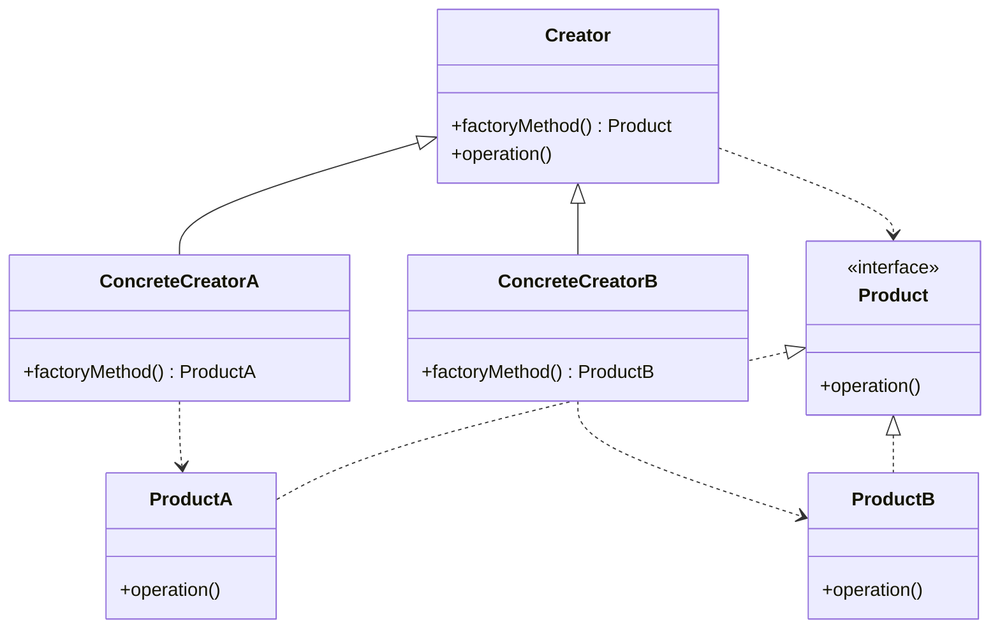

**Nasıl Çalışır:** Üst sınıf (`Creator`) bir `factoryMethod()` tanımlar ama ne üretileceğini bilmez. Alt sınıflar bu metodu override ederek hangi nesnenin üretileceğine karar verir. Üst sınıf sadece "bir ürün oluştur ve kullan" der, somut sınıfı bilmez.

!!! example "Gerçek Senaryo"
    Bir lojistik sisteminde kara, deniz ve hava taşımacılığı var. Sipariş yönetimi sadece "taşıma başlat" der. `RoadLogistics` Truck üretir, `SeaLogistics` Ship üretir. Yeni bir hava hattı eklemek istediğinde mevcut kodun hiçbirine dokunmadan yeni bir `AirLogistics` sınıfı yazarsın.

!!! tip "Ne Zaman Kullanılır?"
    - Hangi nesnenin oluşturulacağı çalışma zamanında belli oluyorsa
    - Yeni ürün türleri eklenecek ve mevcut koda dokunmak istemiyorsan
    - Ürün oluşturma sürecinin ortak bir şablonu var ama somut tipler değişiyorsa

!!! danger "Ne Zaman Kullanılmaz"
    Nesne türleri sabitse ve değişmeyecekse gereksiz soyutlamadır. Direkt `new` daha sade ve anlaşılır olur.

---

### Abstract Factory

**Özü:** Birbiriyle uyumlu nesne aileleri üretir; yanlış kombinasyonu imkânsız kılar.

**Problem:** Factory Method tek bir nesne üretir. Ama bazı sistemlerde birlikte çalışması gereken, birbiriyle uyumlu birden fazla nesne gerekir. Bunları ayrı ayrı oluşturmak yanlış kombinasyona yol açabilir (Windows butonu + Mac menüsü gibi).

**Analoji:** Mobilya mağazasında "Mid-century" tarz koleksiyon seçtiğinde, o koleksiyonun koltuk, masa ve rafı otomatik olarak uyumludur. Ayrı ayrı seçsen yanlış eşleştirme yapabilirsin.

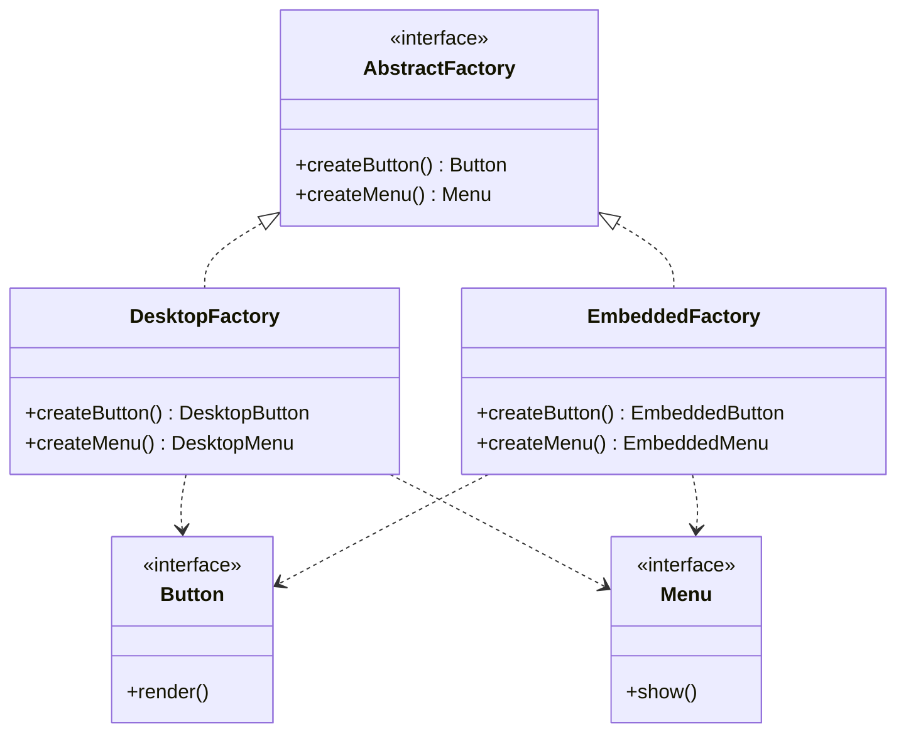

**Nasıl Çalışır:** `AbstractFactory` birden fazla ürün oluşturma metodunu tanımlar. Her konkret fabrika, aynı aileden tüm ürünleri üretir. İstemci hangi fabrikayı kullandığını bilir ama fabrikaların içindeki somut sınıfları bilmez.

!!! example "Gerçek Senaryo"
    Cross-platform UI kütüphanesi: `WindowsFactory` her şeyin Windows stilini, `MacFactory` Mac stilini üretir. Uygulama platform seçimine göre fabrikayı değiştirir; tüm bileşenler otomatik uyumlu gelir.

!!! tip "Ne Zaman Kullanılır?"
    - Bir "tema" veya "platform" kavramıyla birden fazla nesnenin birlikte değişmesi gerektiğinde
    - Ürünlerin yanlış kombinasyonlarını derleme aşamasında önlemek istediğinde
    - İstemci kodu aynı kalırken sadece hangi ailenin kullanıldığı değişiyorsa

!!! tip "Factory Method ile Farkı"
    Factory Method **tek bir ürün** üretir, sınıf kalıtımıyla çalışır. Abstract Factory **uyumlu bir ürün ailesi** üretir, nesne bileşimiyle çalışır.

---

### Builder

**Özü:** Karmaşık nesnenin oluşturulmasını adım adım kontrol eder.

**Problem:** Bir nesnenin 10+ parametresi varsa ve bazıları opsiyonelse constructor felakete döner. `new Car(red, 4, true, false, null, "sport", 2.0)` — hangi parametre ne anlama geliyor? Ayrıca aynı nesnenin birden fazla varyantı olabilir (spor araba, SUV, elektrikli). Buna **Telescoping Constructor Anti-Pattern** denir: her kombinasyon için ayrı constructor yazmak zorunda kalırsın.

**Analoji:** Ev inşa etmek gibi düşün. Temel atılır, duvarlar örülür, çatı kurulur, içi döşenir. Her adım bağımsız ama sıralı. Hangi inşaat şirketi (builder) seçersen o şirkete göre sonuç değişir.

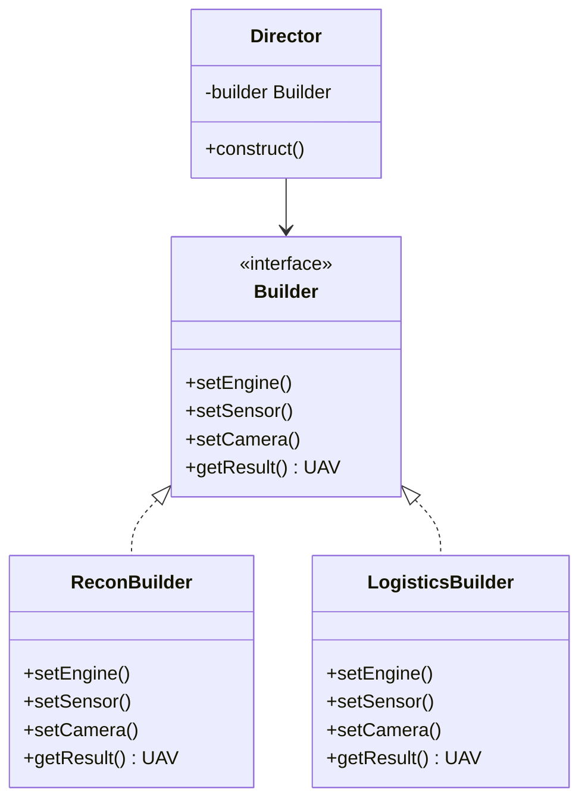

**Nasıl Çalışır:** Builder arayüzü yapım adımlarını tanımlar. Her konkret Builder bu adımları farklı biçimde uygular. `Director` (isteğe bağlı) hangi adımların hangi sırayla çağrılacağını bilir. Son olarak `getResult()` ile tamamlanmış nesne alınır.

!!! example "Gerçek Senaryo"
    İHA (İnsansız Hava Aracı) konfigürasyonu: aynı platform üzerinde keşif amaçlı (termal kamera, uzun menzil pili) veya lojistik amaçlı (kargo sistemi, kısa menzil) yapılandırma yapılabilir. `ReconBuilder` ve `LogisticsBuilder` aynı adımları farklı değerlerle doldurur. Director her iki İHA için de aynı `construct()` akışını çağırır.

!!! tip "Ne Zaman Kullanılır?"
    - 4'ten fazla parametreli constructor varsa
    - Opsiyonel parametreler çoksa
    - Aynı nesnenin birden fazla varyantı inşa edilecekse
    - Nesne oluşturma süreci birden fazla adım gerektiriyorsa

!!! note "Modern Dillerde Fluent Builder"
    `Car.builder().color("red").wheels(4).sport(true).build()` — zincirleme çağrı (method chaining) ile Builder'ın kullanıcı dostu hali. Pek çok modern kütüphanede bu yaklaşım kullanılır.

---

### Prototype

**Özü:** Sıfırdan oluşturmak yerine, var olan nesneyi klonla.

**Problem:** Bazı nesneler oluşturulması pahalıdır: veritabanı sorgusu, dosya okuma, ağır hesaplama gerektirebilir. Üstelik nesnenin karmaşık bir iç durumu varsa bunu sıfırdan tekrar kurmak hem zaman hem de kaynak israfıdır. İkinci sorun: bir nesneyi kopyalamak istiyorsun ama sınıfını bilmiyorsun (sadece soyut arayüzü biliyorsun), dolayısıyla direkt `new` kullanamazsın.

**Analoji:** Hücre bölünmesi — yeni hücre üretmek için sıfırdan tüm genetik bilgiyi oluşturmak yerine mevcut hücreyi kopyala ve gerekli küçük değişiklikleri yap.

**Nasıl Çalışır:** Her nesne kendi `clone()` metodunu uygular. İstemci kopyasını almak istediği nesneden `clone()` çağırır. İç yapıyı bilmesine gerek yoktur.

!!! warning "Deep Copy vs Shallow Copy — Kritik Nokta"
    **Shallow copy:** iç nesnelerin referansları kopyalanır, aynı belleği paylaşırlar. Bir kopyadaki değişiklik diğerini etkiler. **Deep copy:** tüm iç nesneler de ayrı kopyalanır. Prototype uygularken hangi derinlikte kopyalama yapılacağı açıkça belirlenmeli; yanlış seçim sessiz hatalara yol açar.

!!! example "Gerçek Senaryo"
    Simülasyon ortamında yüzlerce sensör modeli var; hepsinin temel konfigürasyonu aynı ama küçük parametreler farklı. Temel sensör bir kez yapılandırılır, geri kalanlar klonlanır ve sadece farklı olan parametre güncellenir. Hem hız kazanılır hem de tutarlı başlangıç yapısı korunur.

!!! tip "Ne Zaman Kullanılır?"
    - Nesne oluşturma maliyeti yüksekse (DB sorgusu, ağ çağrısı, ağır hesaplama)
    - Nesnenin sınıfını bilmeden kopyası gerekiyorsa
    - Sadece küçük farklılıklarla çok sayıda benzer nesne üretilecekse

---

### Singleton

**Özü:** Sistem genelinde yalnızca tek bir örnek garanti eder ve ona kontrollü erişim noktası sağlar.

**Problem:** Bazı kaynakların birden fazla örneğinin olması anlamsız veya tehlikelidir: birden fazla logger çakışabilir, birden fazla config manager farklı ayarlar okuyabilir, birden fazla connection pool gereksiz kaynak tüketebilir.

**Analoji:** Bir ülkede tek bir hükümet olur. Birden fazla olursa çelişkili kararlar çıkar, kaos oluşur.

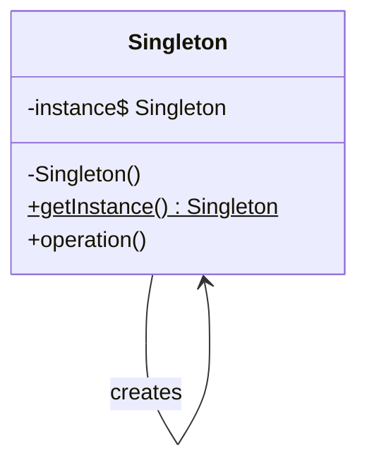

**Nasıl Çalışır:** Constructor private'tır — dışarıdan `new` ile örnek alınamaz. Tek erişim noktası statik `getInstance()` metodudur. İlk çağrıda örnek oluşturulur, sonraki çağrılarda aynı örnek döner.

!!! danger "Ciddi Tuzaklar Var — Dikkatli Kullanın"
    - **Test edilemezlik:** Global durum yarattığı için unit testlerde izole etmek zordur. Bir testin değiştirdiği state başka testi etkiler.
    - **Gizli bağımlılık:** Sınıfın hangi bağımlılıklara sahip olduğu constructor'dan anlaşılmaz; Singleton sınıf içinde gizlenir.
    - **Thread safety:** Multi-thread ortamda dikkatli implemente edilmesi gerekir (C++11 sonrasında static local variable yaklaşımı en güvenlidir).
    - **Çoğu durumda yanlış araç:** "Tek örnek" isteği genellikle Dependency Injection ile daha temiz çözülür.

!!! tip "Ne Zaman Kullanılır?"
    Gerçekten sistem genelinde tek örnek **zorunlu** olduğunda: logger, yapılandırma yöneticisi, thread pool, donanım sürücüsü arayüzü. Bunların dışında DI container tercih edilmeli.

---

## Structural (Yapısal Desenler)

Sınıflar ve nesneler arasındaki **ilişkileri** düzenleyerek daha büyük, daha esnek yapıların kurulmasını kolaylaştıran desenlerdir. Amaç: bileşenleri birleştirirken bağımlılıkları yönetmek.

---

### Adapter

**Özü:** Uyumsuz arayüzleri birbirine bağlayan çevirmen.

**Problem:** Kullanmak istediğin bir kütüphane veya servis var ama arayüzü sisteminde beklenen arayüzle uyuşmuyor. Kütüphaneyi değiştiremezsin (üçüncü parti), kendi kodunu da köklü değiştirmek istemiyorsun.

**Analoji:** Seyahatte farklı priz adaptörü kullanırsın. Cihazın (istemci) ve prizin (servis) hiçbiri değişmez; sadece araya bir adaptör girer.

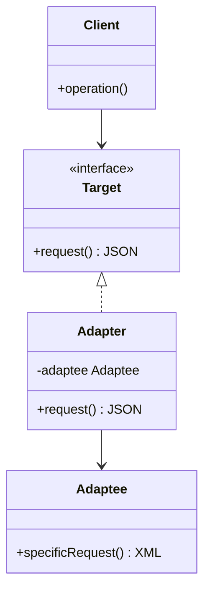

**Nasıl Çalışır:** Adapter, istemcinin beklediği `Target` arayüzünü uygular. İçinde `Adaptee` nesnesini tutar. İstemci `request()` çağırdığında, Adapter bunu `Adaptee`'nin uyumsuz metoduna çevirir.

!!! example "Gerçek Senaryo"
    Sistemin standart veri formatı JSON, ama entegre etmen gereken harici bir sensör servisi XML döndürüyor. Adapter araya girerek XML'i JSON'a çevirir. Ne sisteme ne de sensör servisine dokunmazsın.

!!! tip "Ne Zaman Kullanılır?"
    - Üçüncü parti kütüphane entegrasyonunda (arayüz değiştirilemez)
    - Legacy sistem ile yeni sistem arasında köprü kurulurken
    - Aynı işi yapan ama farklı arayüzlere sahip birden fazla servis kullanılacaksa

!!! note "Bridge ile Farkı"
    Adapter **mevcut** uyumsuzluğu giderir (reaktif çözüm). Bridge ise tasarım aşamasında kasıtlı olarak soyutlamayı implementasyondan ayırır (proaktif tasarım).

---

### Bridge

**Özü:** Soyutlamayı implementasyondan ayırır; her ikisi bağımsız olarak geliştirilebilir.

**Problem:** İki boyutta değişen bir sistemi kalıtımla modellemek istiyorsun. 3 şekil × 3 renk = 9 sınıf. Yeni renk eklenince 3 sınıf daha, yeni şekil eklenince 3 sınıf daha. Bu **sınıf patlaması** sürdürülemez.

**Analoji:** Uzaktan kumanda (soyutlama) ve TV (implementasyon) ayrıdır. Farklı kumanda modelleri (temel, gelişmiş) farklı TV markaları (Sony, Samsung) ile çalışabilir. Her ikisi bağımsız olarak genişleyebilir.

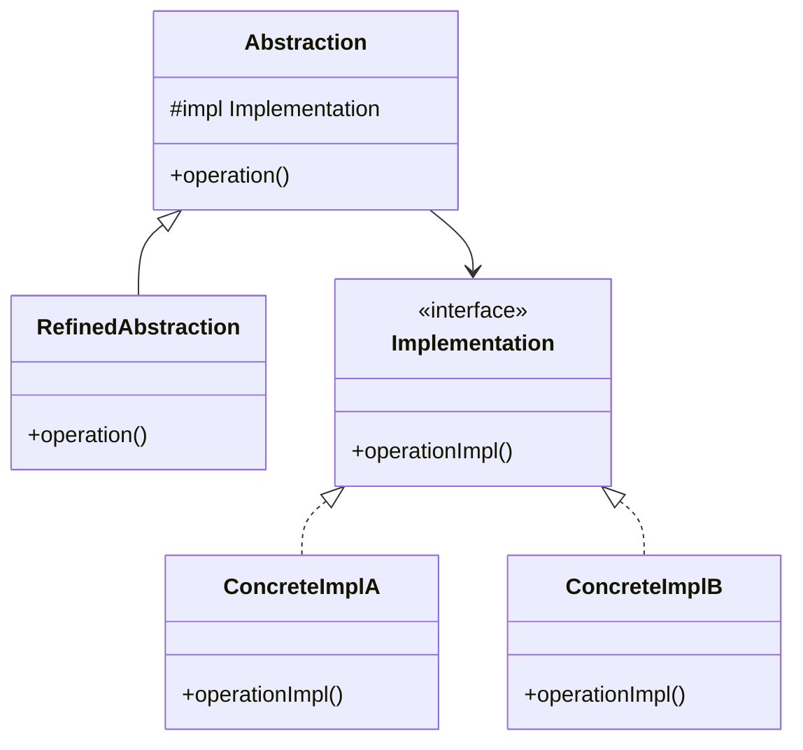

**Nasıl Çalışır:** Soyutlama katmanı bir `Implementation` referansı tutar. Kendi metodları bu implementasyona delege eder. İki hiyerarşi birbirinden bağımsız büyüyebilir. 3 şekil + 3 renk = toplam 6 sınıf (9 yerine).

!!! example "Gerçek Senaryo"
    Görüntü işleme sistemi: farklı veri kaynakları (kamera, dosya, ağ akışı) × farklı işleme algoritmaları (filtreleme, sıkıştırma, nesne tespiti). Bridge ile kaynak ve algoritma birbirinden ayrılır. Yeni kamera tipi eklenince algoritmalara dokunulmaz; yeni algoritma eklenince kaynaklara dokunulmaz.

!!! tip "Ne Zaman Kullanılır?"
    - İki bağımsız boyutta büyüyecek bir sistem tasarlarken
    - Runtime'da implementasyonu değiştirme ihtiyacı olduğunda
    - Platform bağımsızlığı gerektiğinde (farklı OS, farklı donanım)

---

### Composite

**Özü:** Tekil nesneleri ve nesne gruplarını aynı arayüzle kullan.

**Problem:** Ağaç yapısı gibi hiyerarşik bir veri var: dosyalar ve klasörler, askerler ve birlikler, UI bileşenleri ve konteynerler. İstemcinin "bu bir yaprak mı, yoksa grup mu?" diye sorgulamadan işlem yapabilmesi gerekiyor.

**Analoji:** Askeri hiyerarşi — tek bir asker de "ateş et" emri alır, tüm bir tugay da. Komutan kimi emrettiğini sorgulamaz; emir kademelere göre aşağı iner.

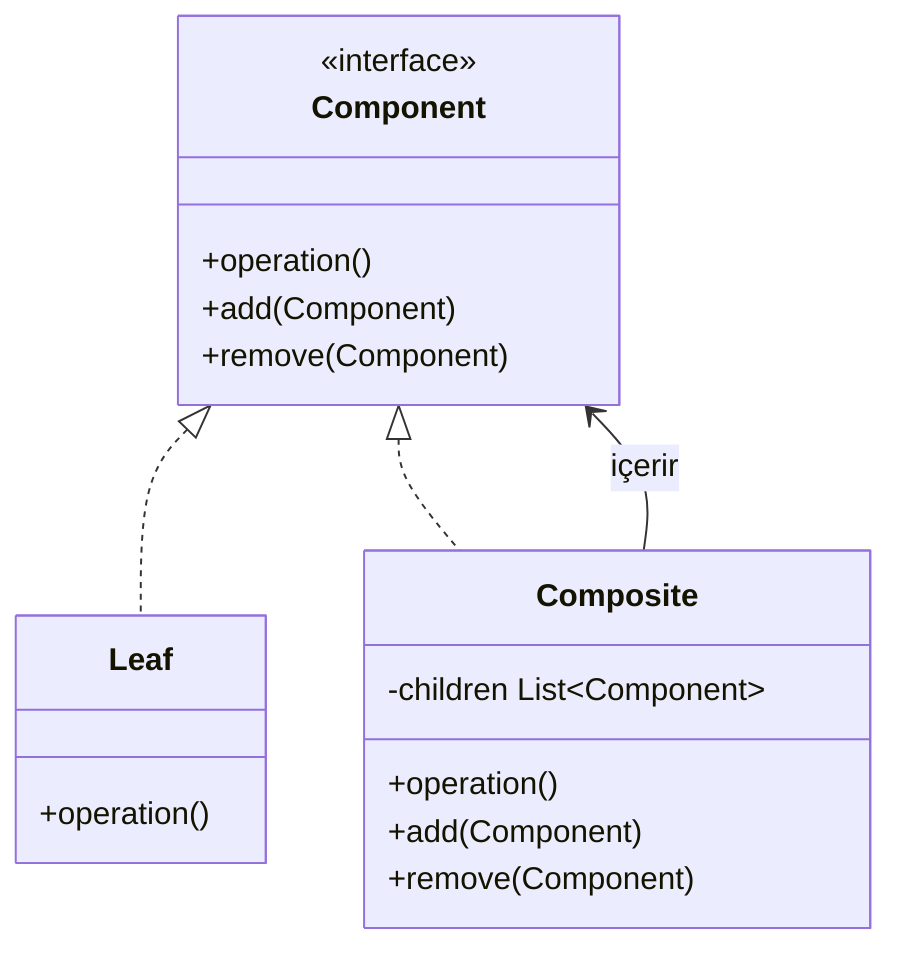

**Nasıl Çalışır:** Her şey (hem yaprak hem grup) aynı `Component` arayüzünü uygular. `Composite` nesnesi çocuklarını tutar ve kendine gelen `operation()` çağrısını tüm çocuklarına iletir. İstemci her ikisine de aynı şekilde davranır.

!!! example "Gerçek Senaryo"
    Dosya sistemi: "boyut hesapla" komutu bir dosyaya da klasöre de uygulanabilir. Klasör, kendi içindeki tüm dosya ve alt klasörlerin boyutunu toplar. Kod yazan kişi her iki durumu ayrı ayrı ele almak zorunda kalmaz.

!!! tip "Ne Zaman Kullanılır?"
    - Ağaç yapısı temsil edilecekse
    - İstemcinin tekil ve bileşik nesneleri aynı şekilde kullanması gerekiyorsa
    - Hiyerarşinin derinliği önceden belli değilse

---

### Decorator

**Özü:** Nesneye çalışma zamanında yeni davranış ekler; kalıtım kullanmaz.

**Problem:** Bir nesneye davranış eklemek istiyorsun ama alt sınıf açmak istemiyorsun. Çok fazla kombinasyon varsa (şifreli+sıkıştırılmış, sadece şifreli, sadece sıkıştırılmış, ikisi de yok — her biri için ayrı sınıf mı?) ya da davranışın çalışma zamanında dinamik olarak eklenmesi/çıkarılması gerekiyorsa.

**Analoji:** Kahve siparişi — temel espresso, üzerine süt ekle (cafe latte), üzerine krema ekle (cappuccino). Her katman bir öncekini "sarar" ve yeni davranış ekler. Kombinasyonlar serbesttir.

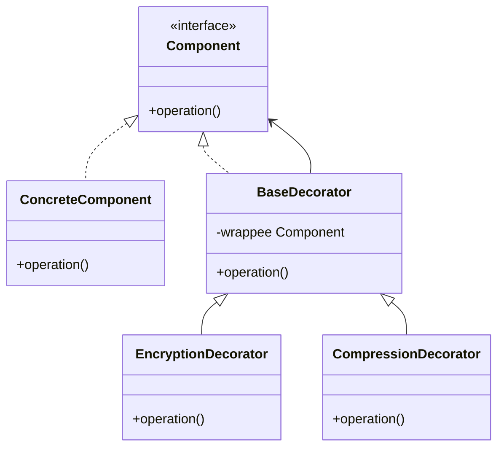

**Nasıl Çalışır:** Decorator, sardığı nesneyle aynı arayüzü uygular. `operation()` çağrıldığında önce/sonra kendi davranışını ekler ve sarılan nesnenin `operation()`'ını da çağırır. Birden fazla Decorator zincir şeklinde birbirini sarabilir.

!!! example "Gerçek Senaryo"
    Haberleşme modülü: temel veri gönderimi var. Bazı senaryolarda şifreleme, bazılarında sıkıştırma, bazılarında ikisi birden gerekiyor. Her kombinasyon için ayrı sınıf açmak yerine `EncryptionDecorator` ve `CompressionDecorator` isteğe bağlı zincire eklenir ve çıkarılabilir.

!!! tip "Ne Zaman Kullanılır?"
    - Nesneye çalışma zamanında dinamik davranış eklenmesi/çıkarılması gerektiğinde
    - Çok sayıda bağımsız özellik birbirleriyle kombine edilebilecekse
    - Alt sınıf açmak sınıf sayısını patlatacaksa

!!! note "Kalıtıma Karşı Avantajı"
    Kalıtım derleme zamanında sabittir. Decorator çalışma zamanında esnektir ve kombine edilebilir.

---

### Facade

**Özü:** Karmaşık alt sistemin önüne sade bir yüz koyar.

**Problem:** Bir alt sistem birden fazla sınıftan oluşuyor; birini kullanmak için diğerini başlatman, birini diğerine bağlaman gerekiyor. İstemci bu karmaşıklığa maruz kalıyor ve alt sistemin iç detaylarını bilmek zorunda kalıyor.

**Analoji:** Ev sinema sistemi kurarken — TV'yi aç, amplifikatörü doğru girişe al, Blu-ray'i bağla, ışıkları kıs, perdeleri indir. Ya da "film izleme modunu başlat" diyen tek buton — hepsini sıralı yapar.

**Nasıl Çalışır:** Facade tüm alt sistemlerin referanslarını tutar. İstemciye basit, yüksek seviyeli metodlar sunar. Bu metodların içinde gerekli alt sistem çağrıları doğru sırayla yapılır.

!!! example "Gerçek Senaryo"
    Bir multimedya sistemi: ses sürücüsü, video codec, ağ tamponu, donanım hızlandırıcı ayrı ayrı çalışıyor. `MediaFacade.play(file)` tek çağrısı tüm bu bileşenleri doğru sırayla başlatır ve senkronize eder.

!!! tip "Ne Zaman Kullanılır?"
    - Karmaşık bir kütüphane veya framework'e basit bir giriş noktası sağlamak istediğinde
    - Alt sistem bağımlılıklarını istemciden gizlemek istediğinde
    - Katmanlı mimaride katmanlar arası erişimi tek noktadan yönetmek için

!!! note "Önemli Ayrım"
    Facade alt sistemi gizlemez, sadece basit bir arayüz ekler. İsteyen istemci hâlâ alt sistemle doğrudan etkileşebilir. Bu bir kısıtlama değil, kolaylıktır.

---

### Flyweight

**Özü:** Çok sayıda benzer nesnenin ortak verilerini paylaştır; belleği boşa harcama.

**Problem:** Binlerce (ya da milyonlarca) benzer nesne oluşturuyorsun. Her nesne aynı verinin kopyasını taşıyorsa bellek tükenir.

**Analoji:** Kelime işlemcide her karakter için ayrı bir nesne oluşturuluyor. Her "A" harfinin font, boyut, stil bilgisini ayrı ayrı tutmak yerine bu bilgiler paylaşılır. Sadece pozisyon bilgisi her karakter için ayrı tutulur.

**Nasıl Çalışır:**

- **Intrinsic (içsel, değişmez) durum:** Tüm örneklerde aynı olan veri. Flyweight nesnesinde saklanır ve paylaşılır.
- **Extrinsic (dışsal, değişken) durum:** Her örnek için farklı olan veri. Flyweight'e parametre olarak dışarıdan geçirilir, içinde saklanmaz.

!!! example "Gerçek Senaryo"
    Harita uygulamasında 10.000 ağaç nesnesi: her ağacın türü, rengi ve 3D modeli aynı (intrinsic). Sadece konum bilgisi farklı (extrinsic). 10.000 ayrı büyük nesne yerine tek bir `TreeType` nesnesi paylaşılır, konumlar ayrı tutulur. Bellek kullanımı dramatik biçimde düşer.

!!! tip "Ne Zaman Kullanılır?"
    - Çok sayıda benzer nesne oluşturulacak ve bellek kritikse
    - Nesnenin büyük kısmı paylaşılabilir (intrinsic) durumdan oluşuyorsa
    - Oyun motorları, grafik sistemleri, metin işleme motorları

!!! danger "Dikkat"
    Extrinsic durumu yönetmek karmaşıklaşır. Nesne sayısı gerçekten büyük değilse eklenen karmaşıklık faydasızdır. Önce profil et, sonra uygula.

---

### Proxy

**Özü:** Başka bir nesneye erişimi kontrol eden ya da yöneten vekil nesne.

**Problem:** Bir nesneye erişmeden önce ek kontrol yapmak istiyorsun: yetki kontrolü, önbellekleme, gecikmeli yükleme, loglama. Ama bu kontrolleri nesnenin kendisine eklemek onun sorumluluklarını genişletir ve Tek Sorumluluk Prensibi'ni ihlal eder.

**Analoji:** Şirket avukatı müvekkil adına iş yapar. Sözleşme imzalamak için doğrudan müvekkile ulaşmak zorunda değilsin. Avukat (proxy) müvekkili temsil eder ve gerekli kontrolleri yapar.

**Proxy Türleri:**

| Tür | Amaç |
|-----|------|
| **Virtual Proxy** | Gecikmeli başlatma — pahalı nesneyi gerçekten gerektiğinde oluştur |
| **Protection Proxy** | Erişim kontrolü — kim neyi görebilir/yapabilir |
| **Caching Proxy** | Önbellekleme — aynı sonucu tekrar hesaplama |
| **Remote Proxy** | Uzak nesneye yerel arayüzden eriş (RPC, stub) |

!!! example "Gerçek Senaryo"
    Büyük veri dosyası yükleyen bir sistem: dosya henüz gerekmeyebilir. Virtual Proxy ile gerçek dosya nesnesi `load()` ilk çağrılana kadar oluşturulmaz. Kullanıcı dosyayı hiç açmazsa kaynak harcanmamış olur.

!!! tip "Ne Zaman Kullanılır?"
    - Pahalı nesnenin gecikmeli başlatılması gerekiyorsa (Virtual)
    - Nesneyi değiştirmeden erişim kontrolü eklemek istiyorsan (Protection)
    - Ağ çağrılarını veya hesaplamaları önbelleğe almak istiyorsan (Caching)

---

## Behavioral (Davranışsal Desenler)

Nesneler arasındaki **iletişimi** ve **sorumluluk dağılımını** düzenleyen desenlerdir. "Kim ne yapmalı? Kimin kimi bilmesi gerekiyor?" sorularını yanıtlar.

---

### Chain of Responsibility

**Özü:** İsteği bir zincir boyunca ilet; kimin işleyeceğini başlatıcı bilmek zorunda değil.

**Problem:** Bir istek birden fazla işleyici tarafından ele alınabilir ama hangisinin devreye gireceği önceden belli değil veya değişebilir. İstemci koduna "bu durumda A'ya git, şu durumda B'ye git" yazmak kodu kırılgan yapar.

**Analoji:** Şirket içi onay süreci: 1.000 TL'ye kadar müdür onaylar, 10.000 TL'ye kadar direktör, üzeri CEO. Her onaylayan kendi limitini aşan talepleri bir üst kademeye iletir. Talep sahibi kime gideceğini bilmez; zincire bırakır.

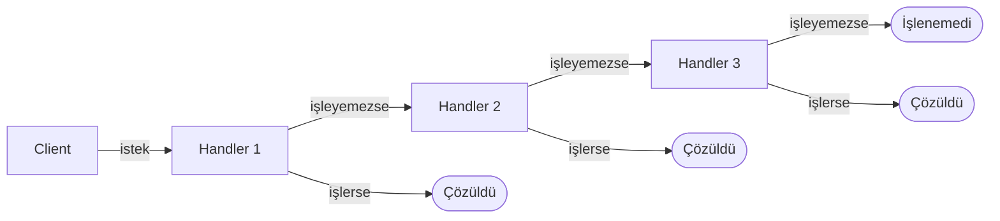

**Nasıl Çalışır:** Her işleyici bir sonraki işleyiciye referans tutar. İsteği işleyebiliyorsa işler, işleyemiyorsa zincirdeki bir sonrakine iletir. İstemci sadece zincirin başını bilir.

!!! example "Gerçek Senaryo"
    Web framework'lerindeki middleware pipeline: istek sırıyla kimlik doğrulama, yetkilendirme, rate limiting, loglama katmanlarından geçer. Her katman isteği işler veya reddeder; reddedilmezse bir sonrakine iletir.

!!! tip "Ne Zaman Kullanılır?"
    - Birden fazla nesnenin aynı isteği işleyebileceği ve hangisinin işleyeceğinin önceden bilinmediği durumlarda
    - İşleyici kümesinin çalışma zamanında dinamik değişmesi gerektiğinde
    - İsteğin birden fazla işleyiciden sırayla geçmesi gerektiğinde (middleware pattern)

!!! danger "Dikkat"
    Zincir sonuna kadar hiçbir işleyici devreye girmezse istek yanıtsız kalır. Zincir sonunda default bir işleyici tanımlamak iyi pratiktir.

---

### Command

**Özü:** Bir eylemi nesne olarak kapsüller; sakla, kuyruğa al, geri al.

**Problem:** Bir işlem yapmak istiyorsun ama işlemi yapacak kodu hemen çalıştırmak istemiyorsun. Ya da aynı işlemi farklı bağlamlarda (menü tıklaması, tuş basımı, zamanlayıcı) tetiklemek istiyorsun. Ya da "geri al" (undo) özelliği gerekiyor.

**Analoji:** Restoran siparişi — garson siparişi kağıda yazar (komut), mutfağa verir, aşçı kağıdı okuyarak yemeği hazırlar. Garson pişirme detaylarını bilmez. Sipariş nesnesi: başlatan (garson), uygulayan (aşçı) ve işlem (yemek) arasındaki bağı koparır.

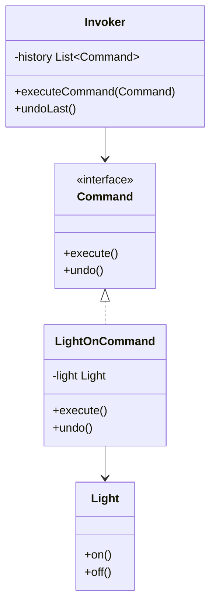

**Nasıl Çalışır:** Her işlem bir `Command` nesnesine dönüştürülür. `execute()` işlemi yapar, `undo()` geri alır. `Invoker` komutları kuyruğa alır ve çalıştırır. `Receiver` gerçek işi yapan nesnedir.

!!! example "Gerçek Senaryo"
    Metin editörü: her yazma, silme, formatlama işlemi bir Command nesnesidir. Ctrl+Z her seferinde son Command'ın `undo()`'sunu çağırır. İşlemler log'lanabilir, tekrar oynatılabilir (macro), hatta ağ üzerinden gönderilebilir.

!!! tip "Ne Zaman Kullanılır?"
    - Undo/redo gerektiğinde
    - İşlemleri log'lamak veya sıraya almak (queue) gerektiğinde
    - Aynı işlemi farklı tetikleyicilerden (buton, tuş kısayolu, menü) çağırmak istediğinde
    - İşlemi tetikleyen ile gerçekleştiren arasındaki bağımlılığı kesmek gerektiğinde

---

### Interpreter

**Özü:** Özel bir dili veya ifade gramerini sınıf hiyerarşisiyle temsil et ve yorumla.

**Problem:** Tekrarlayan, belirli kurallara sahip bir mini dil veya ifade sistemi oluşturman gerekiyor: SQL benzeri basit sorgular, kural motoru için koşul ifadeleri, matematiksel ifadeler gibi.

**Nasıl Çalışır:** Her gramer kuralı bir sınıf olur (`TerminalExpr`, `AndExpr`, `OrExpr`). İfade bir ağaca dönüştürülür ve `interpret()` her düğüm için recursive çağrılır.

!!! example "Gerçek Senaryo"
    IoT sisteminde cihaz kuralları: `"sıcaklık > 80 AND nem < 30"` ifadesi parse edilir. `AndExpr` iki alt ifade tutar. Sistem bu ağacı yürüterek kuralı değerlendirir. Yeni kural tipi eklemek için yeni bir sınıf yazılır.

!!! tip "Ne Zaman Kullanılır?"
    - Basit, tekrarlayan bir gramer yapısı varsa
    - Kullanıcı tanımlı kurallar/ifadeler çalışma zamanında parse edilecekse
    - Gramer sık değişmeyecekse

!!! danger "Sınırlı Kullanım Alanı"
    Gramer karmaşıklaştıkça sınıf sayısı ve bakım maliyeti patlar. Gerçek dil işleme ihtiyacında ANTLR, yacc/bison gibi parser generator araçları kullanılmalı.

---

### Iterator

**Özü:** Koleksiyonun iç yapısını açığa çıkarmadan elemanları üzerinde dolaş.

**Problem:** Liste, ağaç, graf veya özel bir veri yapısı üzerinde dolaşmak istiyorsun. Her veri yapısı için farklı dolaşım kodu yazmak istemiyorsun. Üstelik aynı veri yapısı farklı sıralarda dolaşılabilmeli (önce derinlik, önce genişlik gibi).

**Analoji:** Netflix'te içerik listesi — ister grid görünümde ister liste görünümde gez. Görünüm değişse de "bir sonraki içerik" mantığı aynı. İç yapıyı bilmeden geziniyorsun.

**Nasıl Çalışır:** `Iterator` arayüzü `hasNext()` ve `next()` metodlarını tanımlar. Her koleksiyon kendi Iterator'ını döner. İstemci koleksiyonun yapısını bilmeden döngüyle dolaşır.

!!! note "Modern Dillerde Standart Hale Geldi"
    Python'da `for x in obj` (dunder metodlar), C++'da range-based for ve STL iteratorlar, Java'da `Iterable/Iterator` — hepsi bu desenin dil seviyesindeki uygulamalarıdır. Günümüzde çoğu durumda language feature'ı kullanırsın; deseni sıfırdan yazmak nadirdir.

!!! tip "Ne Zaman Kullanılır?"
    - Özel veri yapısı oluşturup for-each ile kullanılabilmesini istediğinde
    - Aynı koleksiyon üzerinde farklı dolaşım sırası gerektiğinde
    - İstemcinin veri yapısının iç detaylarından bağımsız olmasını istediğinde

---

### Mediator

**Özü:** Nesnelerin birbirini doğrudan tanıması yerine iletişimi merkezi bir aracıya delege et.

**Problem:** Birden fazla nesne birbirleriyle iletişim kuruyor. Her nesne diğerlerini doğrudan tanıdığında bağımlılık ağı karmaşık bir örümcek ağına döner. Birini değiştirmek diğerlerini etkiler.

**Analoji:** Hava trafik kontrolü — uçaklar birbirleriyle doğrudan konuşmaz, tümü kontrol kulesiyle konuşur. 10 uçakla 10×9=90 doğrudan bağlantı yerine 10 bağlantı yeterlidir.

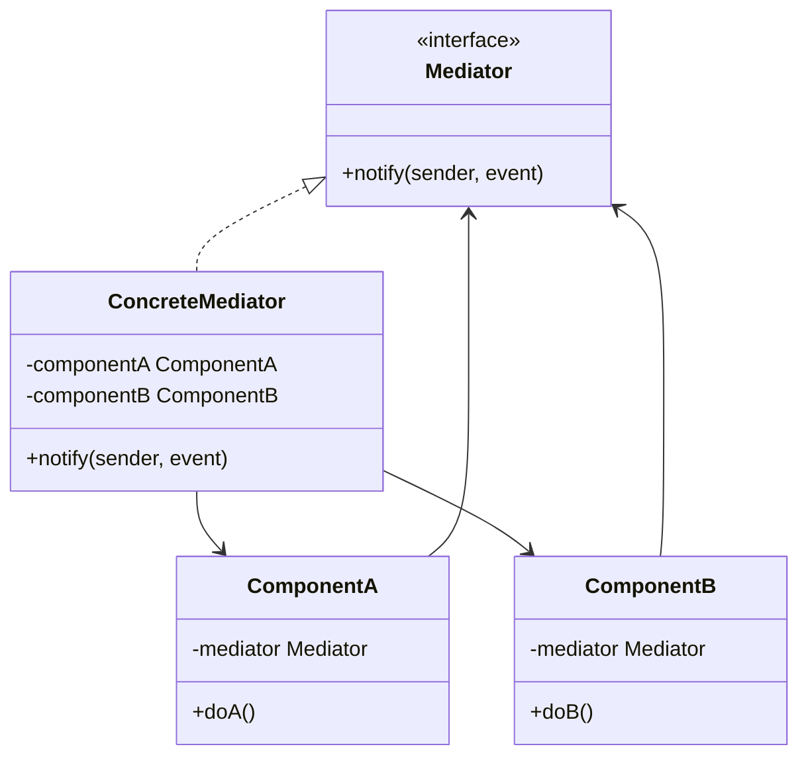

**Nasıl Çalışır:** Her bileşen sadece `Mediator`'ı tanır. Bir şey olduğunda `mediator.notify(this, "event")` çağırır. Mediator kimin ne zaman ne yapacağına karar verir ve ilgili bileşeni tetikler.

!!! example "Gerçek Senaryo"
    Chat uygulaması: kullanıcılar birbirini doğrudan bilmez. Mesajlaşma sunucusu (Mediator) mesajı alır, ilgili kullanıcılara iletir, grupları yönetir. Yeni bir kullanıcı eklenmesi diğer kullanıcıların kodunu etkilemez.

!!! tip "Ne Zaman Kullanılır?"
    - Çok sayıda nesne arasındaki bağımlılıklar spaghetti'ye dönüşüyorsa
    - Nesnelerin yeniden kullanılabilirliği bağımlılıklar yüzünden azalıyorsa
    - İletişim mantığını tek bir noktada toplamak istediğinde

!!! danger "Dikkat"
    Mediator kendisi "God Object"e dönüşebilir. Tüm mantık Mediator'a yığılırsa monolitik bir iletişim merkezi ortaya çıkar. Mediator'ın sorumluluklarını sınırlı tut.

---

### Memento

**Özü:** Nesnenin iç durumunu kapsüllemeyi bozmadan kaydet; gerektiğinde geri yükle.

**Problem:** Bir nesnenin önceki durumuna geri dönmek istiyorsun. Ama nesnenin iç durumu private — dışarıdan okuyamazsın. Durumu dışa aktarmak encapsulation'ı bozar.

**Analoji:** Video oyununda kaydetme noktası (checkpoint). Oyun motoruna iç mekanizmaları bilmeden "buraya kaydet" ve "buraya geri dön" diyebiliyorsun.

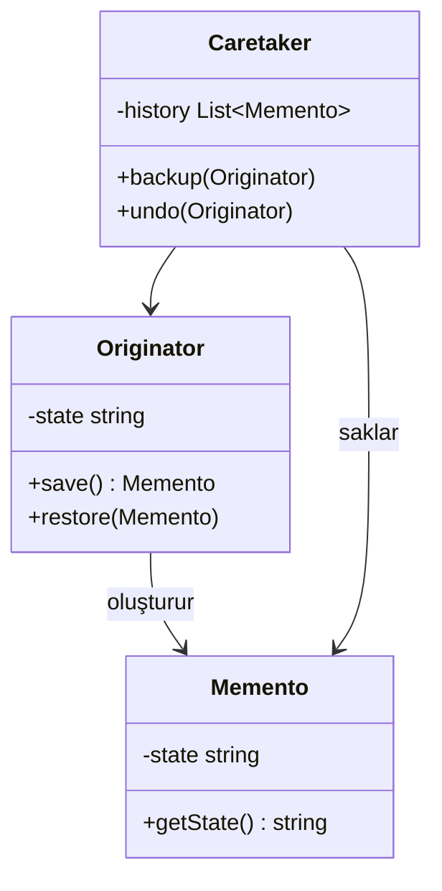

**Nasıl Çalışır:**

- **Originator:** Durumu olan asıl nesne. `save()` ile kendi durumunun anlık görüntüsünü Memento olarak döner.
- **Memento:** Durumu saklayan opak nesne. Sadece Originator içini okuyabilir.
- **Caretaker:** Memento'ları saklar ama içini okuyamaz. Undo için Originator'a geri verir.

!!! example "Gerçek Senaryo"
    Metin editörü Ctrl+Z: her değişiklik öncesi `editor.save()` çağrılır, dönen Memento geçmişe eklenir. Ctrl+Z'de son Memento alınır ve `editor.restore(memento)` çağrılır. Editörün içindeki karmaşık durumun tamamı kurtarılır.

!!! tip "Ne Zaman Kullanılır?"
    - Undo/redo gerektiğinde ve nesnenin iç durumu karmaşıksa
    - Nesnenin durumunun anlık görüntüsünü almak gerektiğinde
    - Encapsulation'ı bozmadan durum geçmişi yönetimi gerektiğinde

!!! tip "Command ile Farkı"
    Command undo için *işlemi tersine çeviren kod* yazar (davranış odaklı). Memento *önceki durumu saklar* (veri odaklı). Karmaşık durum geri almaları için Memento daha uygundur; çünkü ters işlemi yazmak bazen imkânsız veya çok karmaşıktır.

---

### Observer

**Özü:** Bir nesnedeki değişikliği ilgilenen herkese otomatik bildir.

**Problem:** Bir nesnenin durumu değiştiğinde buna bağlı diğer nesnelerin de güncellenmesi gerekiyor. Ama bu bağımlı nesneler dinamik olarak değişebilir ve hepsini tek tek çağırmak sıkı bağımlılık yaratır.

**Analoji:** Gazete aboneliği — gazete her yayınlandığında abone olan herkese otomatik gönderilir. Gazete kaç abonesi olduğunu veya ne yaptıklarını bilmez. İsteyen abone olur, isteyen aboneliği iptal eder.

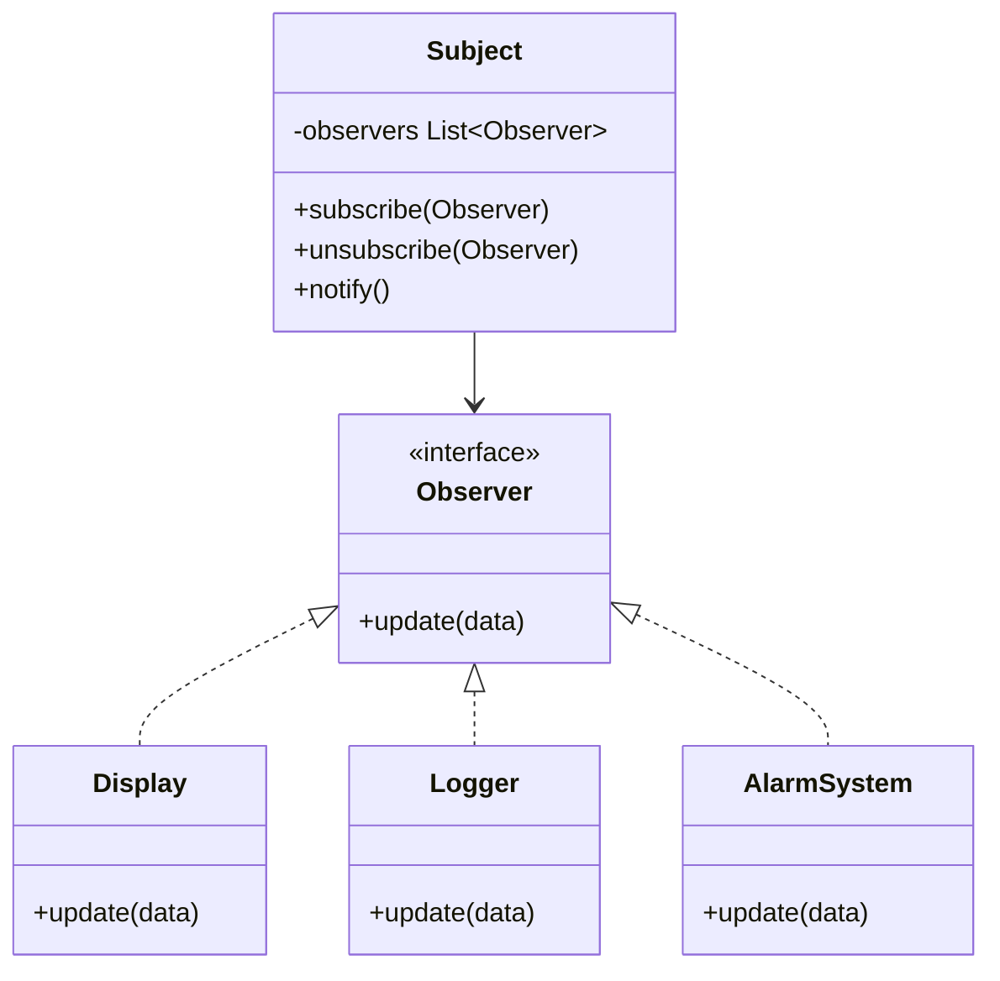

**Nasıl Çalışır:** `Subject` (yayıncı) Observer listesi tutar. Durum değişince `notify()` çağırır — tüm Observer'ların `update()` metodu tetiklenir. Observer'lar `subscribe()`/`unsubscribe()` ile listeye girip çıkabilir.

!!! example "Gerçek Senaryo"
    Sensör sistemi: sıcaklık sensörü her ölçüm yaptığında izleme ekranı, log kaydı ve alarm modülü otomatik haberdar olur. Yeni bir "SMS uyarısı" modülü eklemek istersen sadece Observer'a kaydettirirsin; sensör koduna dokunmazsın.

!!! tip "Ne Zaman Kullanılır?"
    - Bir nesnenin değişikliği belirsiz sayıda başka nesneyi tetikleyecekse
    - Yayıncı ile abonelerin gevşek bağlı (loose coupling) olması gerekiyorsa
    - Event-driven mimari, reaktif sistemler, GUI event handling

!!! note "Publish-Subscribe ile İlişki"
    Observer, publish-subscribe mimarisinin temel prensibidir. Modern sistemlerde (Kafka, RabbitMQ, Redux, event bus) bu desenin çeşitli varyasyonları uygulanır.

---

### State

**Özü:** Nesnenin davranışı iç durumuna göre değişir; durum geçişlerini if/else yerine ayrı nesnelerle yönet.

**Problem:** Bir nesnenin birden fazla durumu var ve her durumda aynı metodlar farklı davranıyor. Bunu if/else veya switch ile yönetmek hem uzar hem kırılganlaşır. Yeni durum eklenince mevcut kodun her yerine if eklenmesi gerekir.

**Analoji:** Trafik lambası — kırmızıda "dur", yeşilde "geç", sarıda "yavaşla". Aynı "ne yapmalıyım?" sorusunun cevabı lambanın durumuna göre tamamen değişir. Her durum kendi kurallarını bilir.

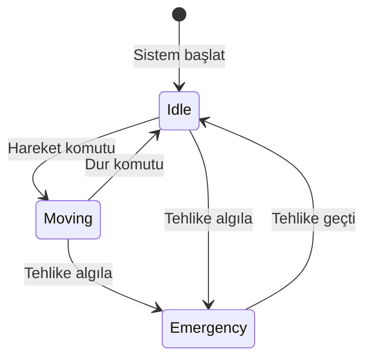

**Nasıl Çalışır:** Her durum ayrı bir sınıf olur; tümü aynı `State` arayüzünü uygular. Context nesnesi mevcut durumuna referans tutar; metodları çağrıldığında mevcut State nesnesine delege eder. Durum geçişleri State sınıflarının içinde yönetilir.

!!! example "Gerçek Senaryo"
    Otonom araç: `IdleState`, `MovingState`, `EmergencyState` ayrı sınıflar. "Engel algılandı" komutu verildiğinde Moving durumundaki araç Emergency'ye geçer. Her durum kendi tepkisini bilir. Yeni bir durum (`ParkingState`) eklemek mevcut durumları etkilemez.

!!! tip "Ne Zaman Kullanılır?"
    - Nesnenin davranışı durumuna göre köklü biçimde değişiyorsa
    - Çok sayıda if/else veya switch-case ile durum yönetiliyorsa
    - Durum sayısı artacaksa ve her durumun kendi karmaşık davranışı varsa
    - Durum geçişleri açıkça modellenmek isteniyorsa (state machine)

!!! tip "Strategy ile Farkı"
    Strategy'de istemci algoritmayı seçer ve genellikle değiştirmez. State'de nesne kendi durumunu ve geçişlerini yönetir; değişimler otomatik gerçekleşebilir. State nesneleri birbirini tanıyabilir; Strategy nesneleri genellikle birbirinden habersizdir.

---

### Strategy

**Özü:** Aynı işi yapan farklı algoritmalar arasında çalışma zamanında geçiş yap.

**Problem:** Bir işlemin birden fazla yapılış biçimi var ve hangisinin kullanılacağı değişebilir. Tüm algoritmaları tek bir sınıfa koymak hem şişirir hem de Open/Closed Principle'ı ihlal eder — yeni algoritma eklemek mevcut koda dokunmayı gerektirir.

**Analoji:** Navigasyon uygulaması — en kısa yol, en hızlı yol, en az yakıt harcayan yol. Algoritma farklı ama "rota bul" talebi aynı. Kullanıcı tercihine göre strateji değişir.

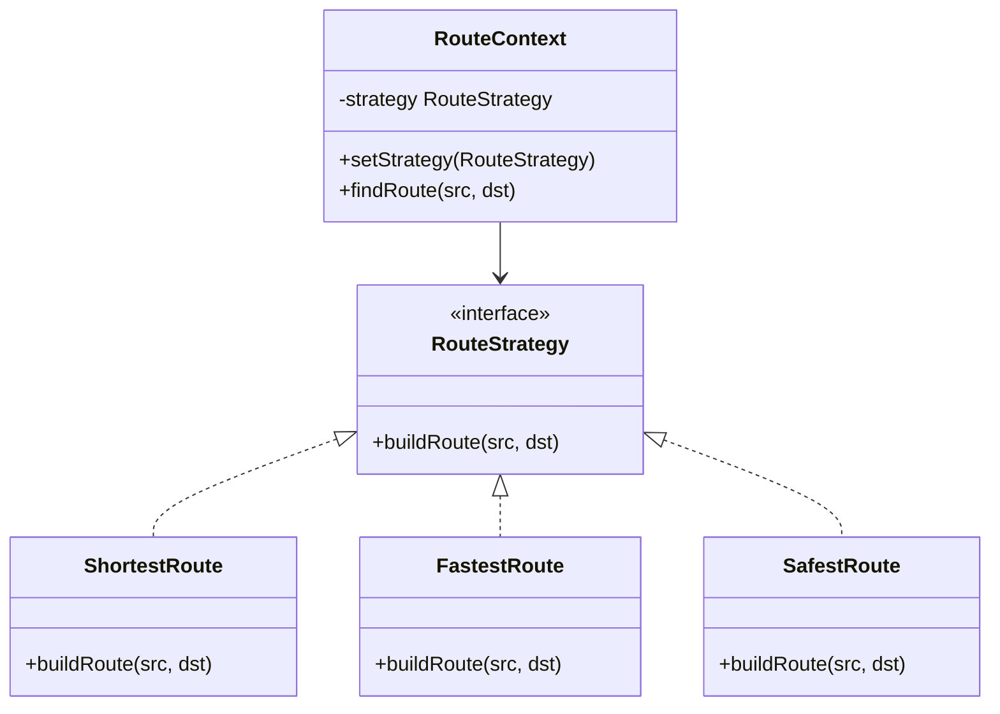

**Nasıl Çalışır:** Her algoritma ayrı bir sınıfa (`ConcreteStrategy`) taşınır. Tümü aynı `Strategy` arayüzünü uygular. `Context` nesnesi algoritma detaylarını bilmez; çalışma zamanında `setStrategy()` ile strateji değiştirilebilir.

!!! example "Gerçek Senaryo"
    Sıralama sistemi: küçük veri için insertion sort, büyük veri için quicksort, neredeyse sıralı veri için merge sort tercih edilir. Context veri boyutuna göre strateji seçer. Yeni algoritma eklemek için sadece yeni bir Strategy sınıfı yazılır; Context'e dokunulmaz.

!!! tip "Ne Zaman Kullanılır?"
    - Aynı işi yapan birden fazla algoritma varsa ve aralarında çalışma zamanında geçiş gerekiyorsa
    - Algoritma detaylarını istemciden gizlemek istediğinde
    - Koşullu algoritmik dallanma (if/else zinciri) kodu karmaşıklaştırıyorsa

---

### Template Method

**Özü:** Algoritmanın iskeletini üst sınıfa yaz; değişen adımları alt sınıflara bırak.

**Problem:** Birden fazla sınıf aynı genel akışı paylaşıyor ama bazı adımlarda farklı davranıyor. Ortak akışı kopyala-yapıştırla her sınıfa yazmak kod tekrarına yol açar ve bakımı zorlaştırır.

**Analoji:** Franchise restoranı — tüm şubeler aynı müşteri hizmet protokolünü uygular (karşıla, siparişi al, hazırla, sun, ödeme al). Ama hazırlama adımı her ürün için farklıdır. Protokol sabittir; hazırlama detayı değişkendir.

**Nasıl Çalışır:** Üst sınıf `templateMethod()` tanımlar — genel akışı sabit sırayla çağırır. Değişmez adımlar üst sınıfta uygulanır. Değişen adımlar abstract veya override edilebilir (hook) metodlar olarak tanımlanır. Alt sınıflar sadece bu adımları override eder; genel akışa dokunamaz.

!!! example "Gerçek Senaryo"
    Veri işleme pipeline'ı: her kaynak için sıra aynı — oku, doğrula, işle, raporla. `CSVProcessor` okuma ve işleme adımlarını CSV mantığıyla uygular. `XMLProcessor` aynı adımları XML için uygular. Doğrulama ve raporlama üst sınıftan kalıtılır ve değişmez.

!!! tip "Ne Zaman Kullanılır?"
    - Birden fazla sınıfın aynı algoritmik iskelet üzerinde çalıştığı ama belirli adımların farklılaştığı durumlarda
    - Kod tekrarını ortadan kaldırmak için ortak akış üst sınıfa çekilmek istendiğinde
    - Alt sınıfların tüm algoritmayı değiştirmesini engellemek ama özelleştirmesine izin vermek gerektiğinde

!!! note "Hollywood Prensibi"
    "Bizi arama, biz seni ararız" — Alt sınıf adımları uygular ama akışın ne zaman ve hangi sırayla çalışacağını üst sınıf yönetir. Kontrolün ters çevrilmesidir.

!!! tip "Strategy ile Farkı"
    Template Method kalıtım kullanır; algoritmanın iskeletini değiştirmeyi engeller. Strategy bileşim (composition) kullanır; tüm algoritmayı çalışma zamanında değiştirebilir.

---

### Visitor

**Özü:** Kararlı nesne yapısına, nesneleri değiştirmeden yeni operasyonlar ekle.

**Problem:** Birçok farklı nesne türünden oluşan bir yapı var (AST, belge, nesne grafiği). Bu yapı üzerinde sık sık yeni operasyonlar eklenmesi gerekiyor (analiz, optimizasyon, yazdırma, serileştirme). Her yeni operasyon için her nesne sınıfına dokunmak Open/Closed Principle'ı ihlal eder.

**Analoji:** Vergi denetçisi — şehirdeki her farklı iş yeri türünü (restoran, mağaza, fabrika) ziyaret eder. Her yerin kendine özgü vergi hesaplama kuralları var. Denetçi yeni bir hesaplama metodu getirdiğinde iş yerlerine dokunmaz; sadece yeni bir denetçi (Visitor) oluşturulur.

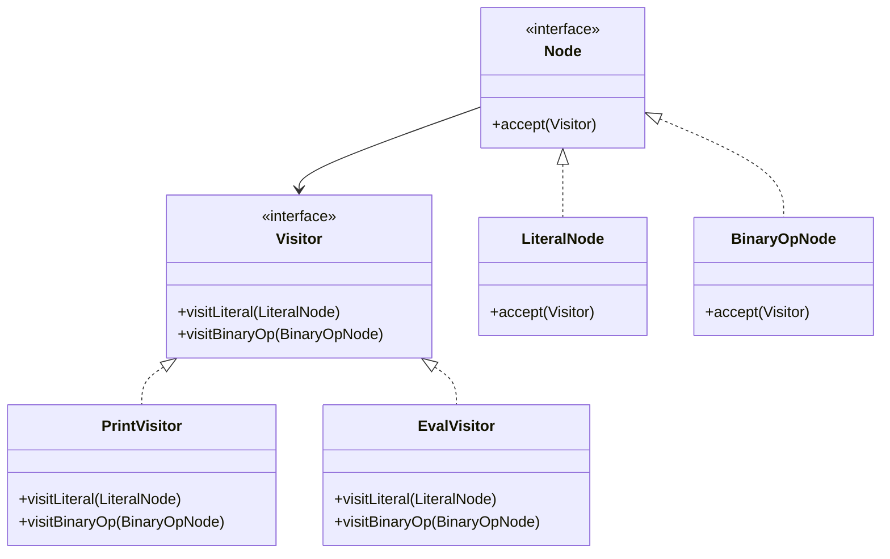

**Nasıl Çalışır:** Her nesne türü `accept(Visitor v)` metodunu uygular ve `v.visit(this)` çağırır (double dispatch). Yeni operasyon eklemek = yeni bir Visitor sınıfı yazmak. Var olan nesnelere dokunulmaz.

!!! example "Gerçek Senaryo"
    Derleyici: AST (Abstract Syntax Tree) üzerinde tip kontrolü, optimizasyon, kod üretimi, hata raporlama gibi farklı geçişler yapılır. Her geçiş ayrı bir Visitor'dır. AST node sınıfları değişmez; yeni analiz eklemek yeni Visitor yazmak demektir.

!!! tip "Ne Zaman Kullanılır?"
    - Nesne yapısı kararlı (sık değişmiyor) ama üzerindeki operasyonlar sık ekleniyor/değişiyorsa
    - Birçok farklı türde nesne üzerinde aynı gruptan işlemler yapılacaksa
    - Nesne sınıflarına davranış eklemek yerine ayrı operasyon sınıfları isteniyorsa

!!! danger "Ne Zaman Kullanılmaz"
    Yeni eleman türü eklendiğinde tüm Visitor implementasyonları güncellenmek zorundadır. Eğer nesne yapısı (element türleri) sık değişiyorsa Visitor uygun değildir — her değişiklik tüm Visitor'lara yayılır.
