# Design Pattern

!!! note "Genel Bakış"
    Design Pattern'ler, yazılım geliştirmede sıkça karşılaşılan problemlere karşı geliştirilmiş tekrar kullanılabilir çözüm şablonlarıdır. GoF (Gang of Four) sınıflandırmasına göre üç ana kategoriye ayrılır: **Creational**, **Structural** ve **Behavioral**.

---

## Creational

Nesne oluşturma süreçlerini soyutlayan, sistemin hangi sınıfların örnekleneceğinden bağımsız çalışmasını sağlayan desenlerdir.

---

### Factory Method

Nesne oluşturma sorumluluğunu doğrudan istemci kodundan alarak bir fabrika metoduna devreden bir tasarım desenidir. Sistemin hangi somut sınıfı üreteceğine dair bilgi merkezi bir noktada toplanır; üst seviye bileşenler alt seviye detaylardan soyutlanır.

!!! tip "Temel Prensip"
    Open/Closed Principle gereği yeni bir nesne türü eklendiğinde mevcut istemci kodu değiştirilmez; yalnızca yeni bir `ConcreteCreator` sınıfı eklenir.

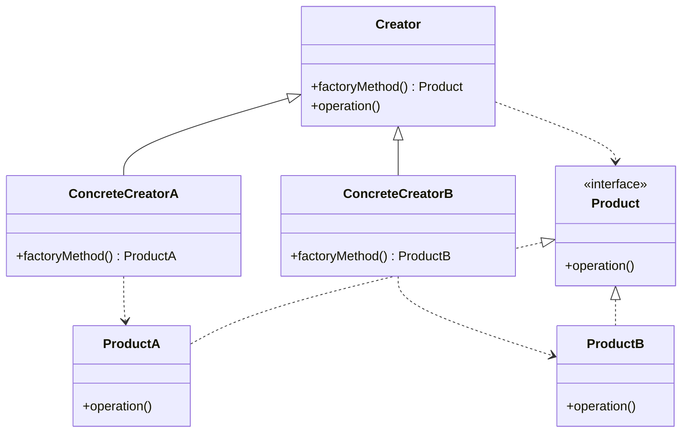

!!! example "Kavramsal Örnek"
    Bir lojistik sisteminde kara, deniz ve hava taşımacılığı yapılmaktadır. Sipariş yönetim sistemi yalnızca "taşıma" işlemini bilir; taşımanın kamyon, gemi ya da uçak ile yapılacağını bilmez. Factory Method, sipariş türüne göre doğru taşıma nesnesini üretir. Sipariş sistemi "taşıma başlat" talebinde bulunur, hangi aracın kullanıldığı detayından tamamen soyutlanır.

=== "C++"
    ```cpp
    class Transport {
    public:
        virtual void deliver() = 0;
        virtual ~Transport() = default;
    };

    class Truck : public Transport {
    public:
        void deliver() override { /* kara taşımacılığı */ }
    };

    class Ship : public Transport {
    public:
        void deliver() override { /* deniz taşımacılığı */ }
    };

    class Logistics {
    public:
        virtual Transport* createTransport() = 0;
        void planDelivery() {
            Transport* t = createTransport();
            t->deliver();
        }
    };

    class RoadLogistics : public Logistics {
    public:
        Transport* createTransport() override { return new Truck(); }
    };

    class SeaLogistics : public Logistics {
    public:
        Transport* createTransport() override { return new Ship(); }
    };
    ```

=== "Python"
    ```python
    from abc import ABC, abstractmethod

    class Transport(ABC):
        @abstractmethod
        def deliver(self): pass

    class Truck(Transport):
        def deliver(self): print("Kara taşımacılığı")

    class Ship(Transport):
        def deliver(self): print("Deniz taşımacılığı")

    class Logistics(ABC):
        @abstractmethod
        def create_transport(self) -> Transport: pass

        def plan_delivery(self):
            transport = self.create_transport()
            transport.deliver()

    class RoadLogistics(Logistics):
        def create_transport(self) -> Transport:
            return Truck()
    ```

!!! danger "Dikkat"
    Her nesne oluşturma senaryosu için Factory Method gerekmez. Nesne türleri sabitse ve değişmeyecekse doğrudan örnekleme daha sade bir çözümdür.

---

### Abstract Factory

Birbiriyle ilişkili nesnelerin, somut sınıfları belirtilmeden bir "ürün ailesi" olarak oluşturulmasını sağlayan bir tasarım desenidir. Aynı aileye ait nesnelerin birbiriyle uyumlu olmasını garanti eder ve istemci tarafında yanlış kombinasyonların oluşmasını engeller.

!!! tip "Factory Method ile Fark"
    Factory Method **tek bir ürün** üretir. Abstract Factory ise **birbiriyle uyumlu bir ürün ailesi** üretir.

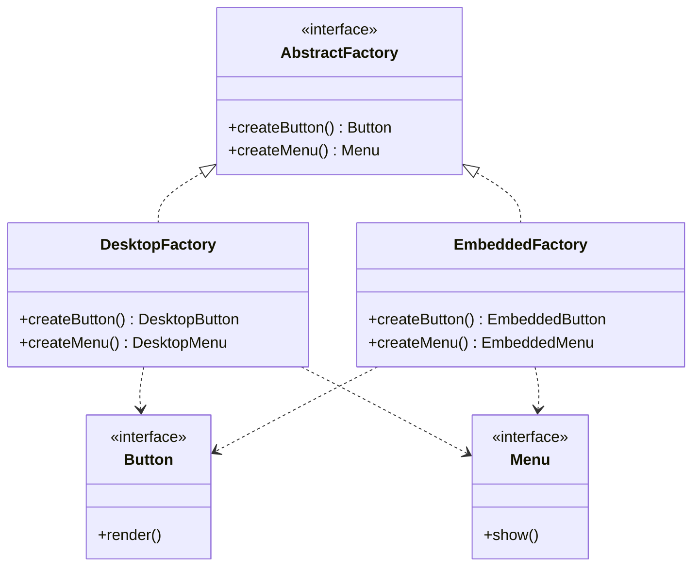

!!! example "Kavramsal Örnek"
    Bir kullanıcı arayüzü kütüphanesinin hem masaüstü hem de gömülü sistemler için çalıştığını düşünelim. Abstract Factory, hangi platform seçildiyse o platforma ait tüm bileşenleri (buton, menü, pencere) uyumlu biçimde üretir. Farklı platformlara ait bileşenlerin yanlışlıkla bir arada kullanılması derleme aşamasında önlenir.

---

### Builder

Karmaşık nesnelerin oluşturma sürecini, nesnenin son temsilinden ayıran bir tasarım desenidir. Çok sayıda opsiyonel parametresi bulunan veya farklı konfigürasyonlarla üretilebilen nesneler için kullanılır. Aynı oluşturma süreci kullanılarak farklı varyantlarda nesneler üretilebilir.

!!! note "Ne Zaman Kullanılır?"
    Bir sınıfın constructor'ında 4'ten fazla parametre bulunuyorsa ya da bazı parametreler opsiyonelse Builder deseni değerlendirilmelidir. Telescoping constructor anti-pattern'inin çözümüdür.

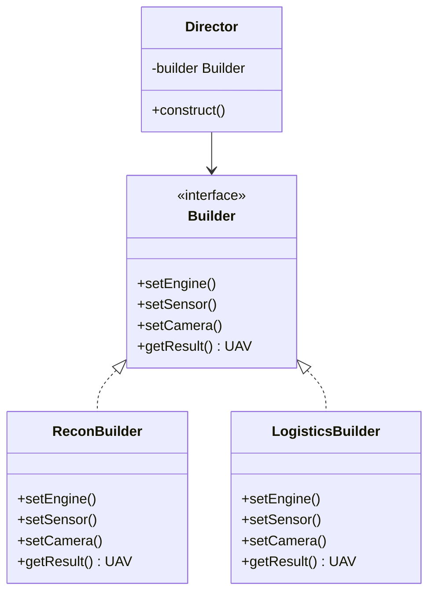

!!! example "Kavramsal Örnek"
    Aynı İHA (İnsansız Hava Aracı) platformu üzerinde farklı sensörler, haberleşme modülleri ve güç sistemleri seçilebilir. Builder ile adım adım keşif amaçlı veya lojistik amaçlı İHA konfigürasyonları oluşturulur. Oluşturma süreci standart kalırken ortaya çıkan ürün değişir.

=== "C++"
    ```cpp
    struct UAV {
        std::string engine, sensor, camera;
    };

    class UAVBuilder {
    protected:
        UAV uav;
    public:
        virtual void setEngine()  = 0;
        virtual void setSensor()  = 0;
        virtual void setCamera()  = 0;
        UAV getResult() { return uav; }
    };

    class ReconBuilder : public UAVBuilder {
    public:
        void setEngine() override { uav.engine = "Elektrik"; }
        void setSensor() override { uav.sensor = "Termal";   }
        void setCamera() override { uav.camera = "4K";       }
    };

    class Director {
        UAVBuilder* builder;
    public:
        explicit Director(UAVBuilder* b) : builder(b) {}
        UAV construct() {
            builder->setEngine();
            builder->setSensor();
            builder->setCamera();
            return builder->getResult();
        }
    };
    ```

=== "Python"
    ```python
    class UAV:
        def __init__(self):
            self.engine = self.sensor = self.camera = None

    class ReconBuilder:
        def __init__(self): self.uav = UAV()
        def set_engine(self): self.uav.engine = "Elektrik"
        def set_sensor(self): self.uav.sensor = "Termal"
        def set_camera(self): self.uav.camera = "4K"
        def get_result(self): return self.uav

    class Director:
        def construct(self, builder) -> UAV:
            builder.set_engine()
            builder.set_sensor()
            builder.set_camera()
            return builder.get_result()
    ```

---

### Prototype

Yeni nesnelerin sıfırdan oluşturulması yerine, mevcut bir nesnenin kopyalanması (klonlanması) yoluyla üretilmesini sağlayan bir tasarım desenidir. Nesne oluşturma maliyetinin yüksek olduğu veya nesnenin karmaşık bir başlangıç konfigürasyonuna sahip olduğu durumlarda tercih edilir.

!!! note "Deep Copy vs Shallow Copy"
    Prototype uygulanırken nesnenin derin kopyasının (deep copy) mı yoksa sığ kopyasının (shallow copy) mı alınacağı kritik bir tasarım kararıdır. İç içe geçmiş nesneler için derin kopyalama zorunludur; aksi hâlde kopyalar aynı bellek adresini paylaşır.

!!! example "Kavramsal Örnek"
    Simülasyon ortamında aynı temel özelliklere sahip, yalnızca küçük parametre farklılıkları bulunan yüzlerce sensör modeline ihtiyaç duyulmaktadır. Prototype ile önceden yapılandırılmış bir sensör klonlanır ve yalnızca gerekli parametreler güncellenir. Hem zaman kazanılır hem de tutarlı bir başlangıç yapısı korunur.

=== "C++"
    ```cpp
    class Sensor {
    public:
        std::string type;
        double sensitivity;
        virtual Sensor* clone() const = 0;
        virtual ~Sensor() = default;
    };

    class ThermalSensor : public Sensor {
    public:
        ThermalSensor* clone() const override {
            return new ThermalSensor(*this);
        }
    };
    ```

=== "Python"
    ```python
    import copy

    class Sensor:
        def __init__(self, sensor_type: str, sensitivity: float):
            self.type        = sensor_type
            self.sensitivity = sensitivity

        def clone(self):
            return copy.deepcopy(self)

    base    = Sensor("Thermal", 0.95)
    variant = base.clone()
    variant.sensitivity = 0.80
    ```

---

### Singleton

Bir sınıftan sistem genelinde yalnızca tek bir örnek oluşturulmasını ve bu örneğe kontrollü bir erişim noktası sağlanmasını garanti eden bir tasarım desenidir. Paylaşılan kaynakların yönetimi, global konfigürasyon veya sistem çapında tekil olması gereken servisler için kullanılır.

!!! danger "Dikkatli Kullanın"
    Singleton global durum yaratarak bağımlılıkları gizler ve birim testlerini zorlaştırır. Gerçekten tekil olması gereken kaynaklar (logger, konfigürasyon yöneticisi) dışında kullanımından kaçınılmalıdır. Aşırı kullanımı mimari bağımlılıkları artırır.

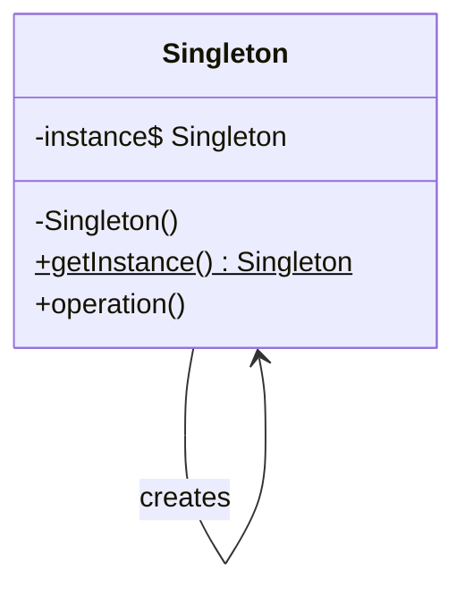

!!! example "Kavramsal Örnek"
    Bir sistemde merkezi konfigürasyon yöneticisi tüm modüller tarafından kullanılmaktadır. Birden fazla örnek oluşturulursa ayarlar tutarsızlaşır ve beklenmeyen davranışlar ortaya çıkar. Singleton, tüm bileşenlerin aynı konfigürasyon kaynağını kullanmasını garanti eder.

=== "C++ (Thread-Safe)"
    ```cpp
    #include <mutex>

    class ConfigManager {
    private:
        static ConfigManager* instance;
        static std::mutex     mutex_;
        ConfigManager() = default;

    public:
        static ConfigManager* getInstance() {
            std::lock_guard<std::mutex> lock(mutex_);
            if (!instance)
                instance = new ConfigManager();
            return instance;
        }
        ConfigManager(const ConfigManager&)            = delete;
        ConfigManager& operator=(const ConfigManager&) = delete;
    };
    ```

=== "Python"
    ```python
    class ConfigManager:
        _instance = None

        def __new__(cls):
            if not cls._instance:
                cls._instance = super().__new__(cls)
            return cls._instance
    ```

---

## Structural

Sınıflar ve nesneler arasındaki ilişkileri düzenleyerek daha büyük yapıların kurulmasını kolaylaştıran desenlerdir.

---

### Adapter

Birbiriyle uyumsuz arayüzlere sahip bileşenlerin birlikte çalışmasını sağlayan bir yapısal tasarım desenidir. Mevcut bir sınıfın arayüzünü istemcinin beklediği arayüze dönüştürerek, kodu değiştirmeden uyumluluk sağlar.

!!! tip "Ne Zaman Kullanılır?"
    - Üçüncü parti kütüphane entegrasyonunda
    - Legacy sistemlerle çalışırken
    - Değiştirilemeyen harici bileşenlerle arayüz uyumluluğu gerektiğinde

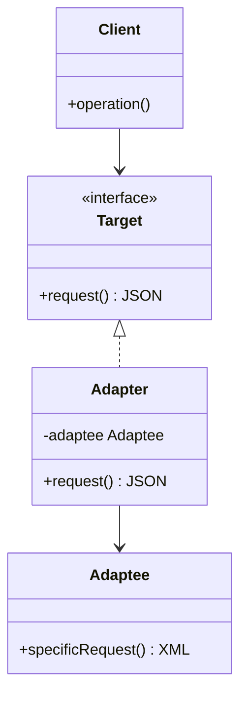

!!! example "Kavramsal Örnek"
    Sistemin standart veri formatı JSON iken, entegre edilmesi gereken harici servis XML formatında veri üretmektedir. Adapter, XML veriyi alıp JSON yapısına dönüştürerek üst seviye bileşenlerin bu farklılıktan etkilenmeden çalışmasını sağlar.

---

### Bridge

Soyutlama (abstraction) ile implementasyonu birbirinden ayırarak her ikisinin bağımsız olarak geliştirilebilmesini sağlayan bir tasarım desenidir. Sınıf hiyerarşisinin kontrolsüz büyümesini engeller; "çok boyutlu değişkenlik" içeren sistemlerde esnekliği artırır.

!!! note "Adapter ile Fark"
    Adapter mevcut uyumsuzluğu giderir (reaktif). Bridge ise tasarım aşamasında soyutlama ve implementasyonu ayrı tutmak için kullanılır (proaktif).

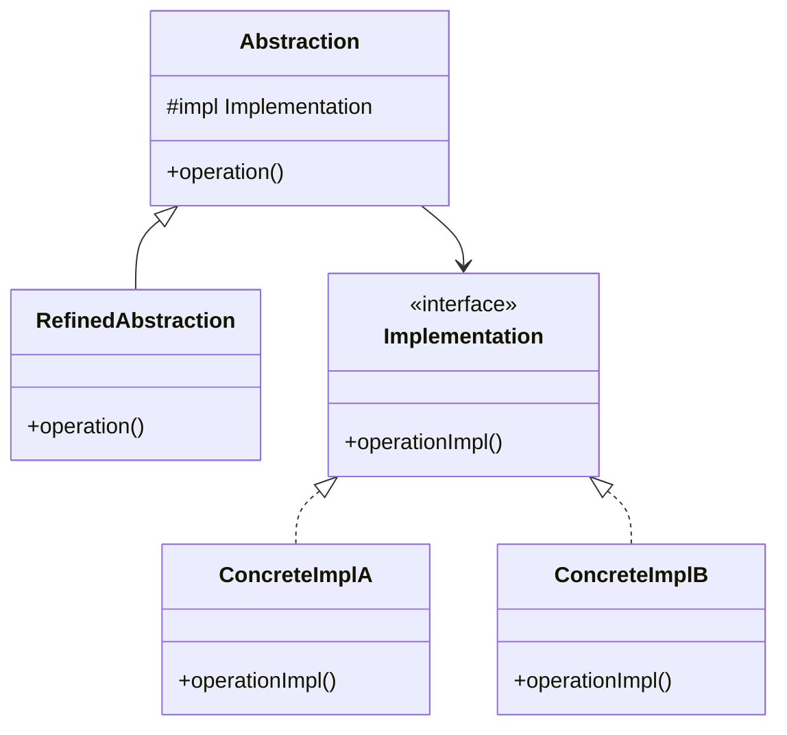

!!! example "Kavramsal Örnek"
    Bir görüntü işleme sistemi farklı görüntü kaynakları (kamera, dosya, ağ) ve farklı işleme yöntemlerini (filtreleme, sıkıştırma, analiz) desteklemektedir. Bridge ile kaynak ve algoritma birbirinden ayrılır. Yeni bir kamera türü eklendiğinde mevcut işleme yöntemleri etkilenmez; yeni bir algoritma eklendiğinde ise kaynaklar değişmeden kullanılır.

---

### Composite

Nesneleri ağaç (tree) yapısı içinde organize ederek, tekil nesneler ile nesne gruplarının aynı arayüz üzerinden yönetilmesini sağlayan bir tasarım desenidir. İstemci, tekil mi yoksa bileşik bir yapı ile çalıştığını bilmeden işlem yapabilir.

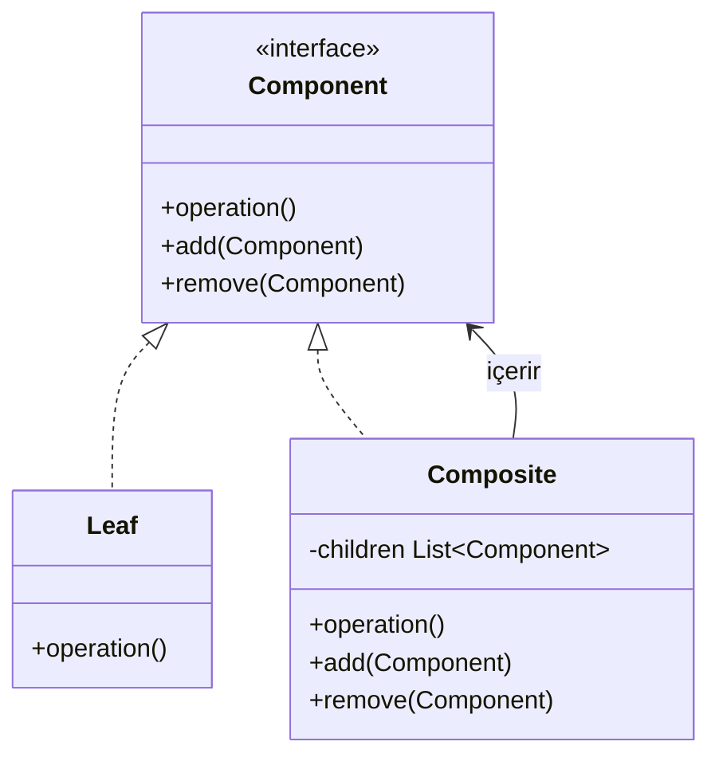

!!! example "Kavramsal Örnek"
    Bir dosya sistemi yapısında dosyalar tekil nesneler, klasörler ise dosya ve alt klasörlerden oluşan bileşik yapılardır. "Boyut hesapla" işlemi hem bir dosya hem de bir klasör üzerinde aynı şekilde çağrılabilir; klasör tüm alt elemanların toplamını otomatik döndürür.

---

### Decorator

Bir nesneye çalışma zamanında yeni davranışlar ekleyen bir tasarım desenidir. Kalıtım (inheritance) kullanmadan nesnenin sorumluluklarını genişletir; sınıf sayısının kontrolsüz artmasını önler ve birden fazla davranış kombine edilebilir.

!!! tip "Kalıtıma Karşı Avantajı"
    Kalıtım derleme zamanında sabit bir davranış ekler. Decorator ise çalışma zamanında isteğe bağlı olarak katmanlanabilir. Birden fazla Decorator zincir şeklinde kombine edilebilir.

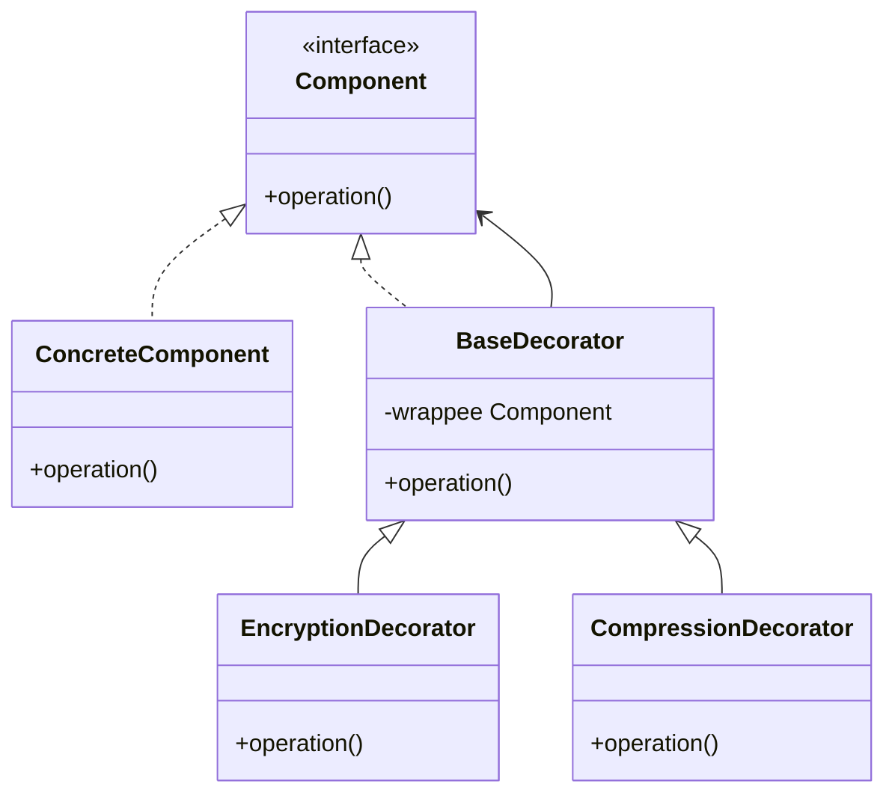

!!! example "Kavramsal Örnek"
    Bir haberleşme modülünde temel veri gönderimi yapılmaktadır. Bazı senaryolarda şifreleme, bazılarında sıkıştırma gerekmektedir. Decorator ile temel gönderim yapısı korunur; ihtiyaç duyulduğunda şifreleme veya sıkıştırma katmanları eklenerek davranış genişletilir. Bu katmanlar isteğe bağlı olarak kombine edilebilir.

---

### Facade

Karmaşık bir alt sistemin önüne basitleştirilmiş ve tek bir giriş noktası koyarak istemcinin bu alt sistemle olan etkileşimini kolaylaştıran bir tasarım desenidir. Amaç, istemcinin sistem içindeki detaylı bağımlılıkları bilmesini engellemek ve kullanım kolaylığı sağlamaktır.

!!! note "Önemli Ayrım"
    Facade alt sistemi gizlemez, sadece basit bir arayüz sunar. İsteyen istemci hâlâ alt sistemle doğrudan etkileşime geçebilir.

!!! example "Kavramsal Örnek"
    Bir multimedya sisteminde ses, video, ağ ve donanım sürücüleri ayrı ayrı çalışmaktadır. Facade, "medya oynat" gibi tek bir operasyon sunarak istemcinin bu alt sistemlerin başlatılması, senkronizasyonu ve kapatılması gibi detaylarla uğraşmasını engeller.

---

### Flyweight

Çok sayıda benzer nesnenin bulunduğu sistemlerde bellek kullanımını optimize etmek için kullanılan bir tasarım desenidir. Nesnelerin ortak (intrinsic) durumlarını paylaşarak her nesne için aynı verinin tekrar tutulmasını önler.

!!! tip "Intrinsic vs Extrinsic"
    - **Intrinsic (paylaşılan, değişmez):** Tüm örnekler için aynı olan veriler. Flyweight nesnesinin içinde tutulur.
    - **Extrinsic (bağlamsal, değişken):** Her nesne için farklı olan veriler. Dışarıdan geçirilir, Flyweight içinde saklanmaz.

!!! example "Kavramsal Örnek"
    Bir harita uygulamasında binlerce ağaç nesnesi bulunmaktadır. Ağaçların türü, rengi ve 3D modeli paylaşılan veridir (intrinsic); yalnızca konum bilgisi her ağaç için ayrıdır (extrinsic). Flyweight ile ağaç model bilgisi tek bir yerde tutulur ve bellek tüketimi önemli ölçüde azaltılır.

---

### Proxy

Başka bir nesneye erişimi kontrol eden veya yöneten bir ara katman nesnesidir. Erişim kontrolü, gecikmeli başlatma (lazy initialization), önbellekleme veya loglama gibi gereksinimler için kullanılır.

!!! note "Proxy Türleri"
    - **Virtual Proxy:** Gecikmeli başlatma — kaynak ağır nesneler için
    - **Protection Proxy:** Erişim kontrolü — yetkilendirme gereksinimleri için
    - **Caching Proxy:** Önbellekleme — tekrar eden maliyetli sorgular için
    - **Remote Proxy:** Uzak nesneye yerel arayüzden erişim sağlama

!!! example "Kavramsal Örnek"
    Uzak bir sunucudan büyük boyutlu veri çeken bir sistem düşünelim. Caching Proxy ile ilk istekte veri sunucudan alınır ve önbelleğe konur. Sonraki taleplerde aynı veri doğrudan proxy üzerinden sunularak performans artırılır ve sunucu yükü azaltılır.

---

## Behavioral

Nesneler arasındaki iletişim ve sorumluluk dağılımını düzenleyen desenlerdir.

---

### Chain of Responsibility

Bir isteğin birden fazla nesne tarafından ele alınabileceği durumlarda, isteği gönderen ile isteği işleyen arasındaki sıkı bağımlılığı ortadan kaldıran bir tasarım desenidir. İstek, zincir hâlinde sıralanmış işleyiciler boyunca iletilir ve uygun olan işleyici tarafından karşılanır.


!!! example "Kavramsal Örnek"
    Bir teknik destek sisteminde talepler; seviye 1, 2 ve 3 destek ekipleri tarafından ele alınmaktadır. Basit sorunlar ilk seviyede çözülürken daha karmaşık talepler otomatik olarak üst seviyeye aktarılır. Talep sahibi, isteğin hangi ekip tarafından çözüldüğünü bilmeden süreci başlatır.

=== "C++"
    ```cpp
    class Handler {
    protected:
        Handler* next = nullptr;
    public:
        void setNext(Handler* h) { next = h; }
        virtual void handle(int level) {
            if (next) next->handle(level);
        }
    };

    class Level1 : public Handler {
    public:
        void handle(int level) override {
            if (level <= 1) { /* çöz */ }
            else Handler::handle(level);
        }
    };
    ```

---

### Command

Bir isteği nesne olarak kapsülleyerek; isteğin parametreleriyle birlikte saklanmasını, kuyruklanmasını veya geri alınmasını (undo/redo) mümkün kılan bir tasarım desenidir. İsteği başlatan nesne ile isteği yerine getiren nesne arasındaki bağımlılığı minimize eder.

!!! tip "Undo/Redo Desteği"
    Command deseni undo/redo özelliğinin en temiz implementasyon yoludur. Her komut nesnesine `execute()` ve `undo()` metodu eklenerek işlem geçmişi yönetilebilir.

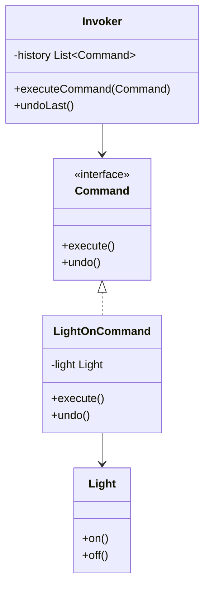

!!! example "Kavramsal Örnek"
    Bir uzaktan kumanda sisteminde farklı cihazlar (ışık, klima, perde) kontrol edilmektedir. Her buton belirli bir işlemi temsil eden komut nesnesine bağlıdır. Kumanda, hangi cihazın nasıl çalıştığını bilmeden yalnızca ilgili komutu tetikler.

---

### Interpreter

Belirli bir dil veya ifade yapısının kurallarını sınıf hiyerarşisi ile temsil ederek, bu ifadelerin yorumlanmasını sağlayan bir tasarım desenidir. Genellikle basit ve sık tekrarlanan kurallara sahip mini dillerde veya yapılandırılabilir ifade sistemlerinde kullanılır.

!!! danger "Sınırlı Kullanım Alanı"
    Interpreter deseni karmaşık gramer yapıları için uygun değildir. Gramer büyüdükçe sınıf sayısı hızla artar ve yönetilemez hâle gelir. Karmaşık diller için ANTLR gibi parser generator araçları tercih edilmelidir.

!!! example "Kavramsal Örnek"
    Bir konfigürasyon dosyasında `AND`, `OR`, `NOT` gibi mantıksal ifadelerle kurallar tanımlanmaktadır. Interpreter bu ifadeleri parse eder ve sistemin davranışını kurallara göre dinamik olarak belirler.

=== "C++"
    ```cpp
    #include <map>
    #include <string>

    class Expression {
    public:
        virtual bool interpret(std::map<std::string, bool>& ctx) = 0;
        virtual ~Expression() = default;
    };

    class TerminalExpr : public Expression {
        std::string name;
    public:
        explicit TerminalExpr(std::string n) : name(std::move(n)) {}
        bool interpret(std::map<std::string, bool>& ctx) override {
            return ctx[name];
        }
    };

    class AndExpr : public Expression {
        Expression* left;
        Expression* right;
    public:
        AndExpr(Expression* l, Expression* r) : left(l), right(r) {}
        bool interpret(std::map<std::string, bool>& ctx) override {
            return left->interpret(ctx) && right->interpret(ctx);
        }
    };
    ```

=== "Python"
    ```python
    class Expression:
        def interpret(self, context: dict) -> bool: ...

    class TerminalExpr(Expression):
        def __init__(self, name): self.name = name
        def interpret(self, context): return context[self.name]

    class AndExpr(Expression):
        def __init__(self, left, right): self.left, self.right = left, right
        def interpret(self, context):
            return self.left.interpret(context) and self.right.interpret(context)
    ```

---

### Iterator

Bir koleksiyonun iç yapısını açığa çıkarmadan, elemanları üzerinde sıralı bir şekilde gezinilmesini sağlayan bir tasarım desenidir. Farklı veri yapılarının aynı erişim mantığıyla kullanılmasına imkân tanır.

!!! note "Modern Dillerde"
    Python'daki `for x in iterable` yapısı, C++'daki range-based for döngüsü ve STL iterator'ları bu desenin dil seviyesindeki implementasyonlarıdır.

!!! example "Kavramsal Örnek"
    Bir sistemde liste, ağaç ve grafik yapılarında tutulan veriler bulunmaktadır. Iterator sayesinde istemci, bu veri yapılarının nasıl saklandığını bilmeden elemanlar üzerinde tek tip bir dolaşım mantığıyla işlem yapabilir.

=== "C++"
    ```cpp
    class Iterator {
    public:
        virtual bool hasNext() = 0;
        virtual int  next()    = 0;
        virtual ~Iterator()    = default;
    };

    class NumberList {
        std::vector<int> data;
    public:
        void add(int val) { data.push_back(val); }

        class ListIterator : public Iterator {
            const std::vector<int>& data;
            size_t pos = 0;
        public:
            explicit ListIterator(const std::vector<int>& d) : data(d) {}
            bool hasNext() override { return pos < data.size(); }
            int  next()    override { return data[pos++]; }
        };

        ListIterator createIterator() { return ListIterator(data); }
    };
    ```

---

### Mediator

Birden fazla nesne arasındaki doğrudan iletişimi ortadan kaldırarak, bu iletişimi merkezi bir aracı nesne üzerinden yöneten bir tasarım desenidir. Her nesne yalnızca Mediator'ı tanır; nesneler arası bağımlılıklar azaltılır.

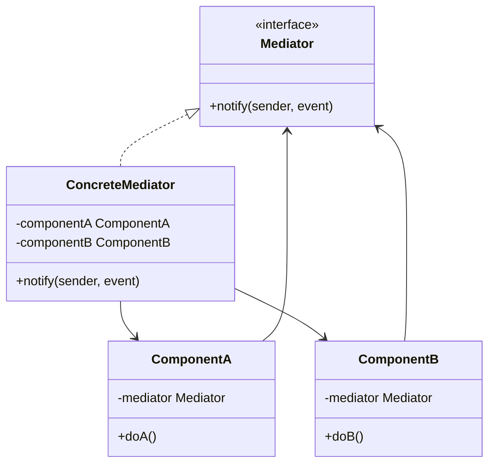

!!! example "Kavramsal Örnek"
    Bir hava trafik kontrol sisteminde uçaklar birbirleriyle doğrudan iletişim kurmaz. Tüm koordinasyon merkezi kontrol kulesi üzerinden sağlanır. Mediator, uçaklar arasındaki etkileşimi düzenleyerek karmaşıklığı tek noktada toplar.

---

### Memento

Bir nesnenin iç durumunu kapsülleme ilkesini ihlal etmeden dışarıya aktararak, gerektiğinde bu duruma geri dönülmesini sağlayan bir tasarım desenidir. Undo/redo ve durum geçmişi yönetiminde kullanılır.

!!! tip "Command ile Fark"
    Command undo için *işlemi tersine çeviren* kod yazar. Memento ise nesnenin *önceki durumunu saklayarak* geri dönüşü sağlar. Karmaşık durum geri almaları için Memento daha uygundur.

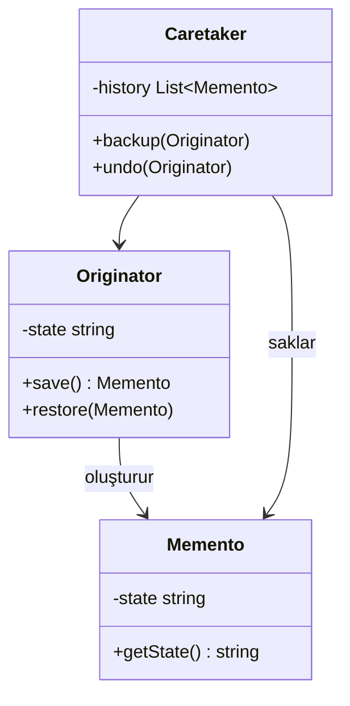

!!! example "Kavramsal Örnek"
    Bir metin editöründe her düzenleme öncesinde belgenin durumu bir Memento nesnesi olarak saklanır. Kullanıcı "geri al" (Ctrl+Z) dediğinde Caretaker en son Memento'yu Originator'a geri yükler.

=== "C++"
    ```cpp
    class Memento {
        std::string state;
    public:
        explicit Memento(std::string s) : state(std::move(s)) {}
        std::string getState() const { return state; }
    };

    class Editor {
        std::string content;
    public:
        void write(const std::string& text) { content += text; }
        Memento save()                      { return Memento(content); }
        void restore(const Memento& m)      { content = m.getState(); }
    };

    class History {
        std::vector<Memento> snapshots;
    public:
        void push(Memento m)   { snapshots.push_back(std::move(m)); }
        Memento pop() {
            auto m = snapshots.back();
            snapshots.pop_back();
            return m;
        }
    };
    ```

=== "Python"
    ```python
    class Memento:
        def __init__(self, state: str): self._state = state
        def get_state(self) -> str:    return self._state

    class Editor:
        def __init__(self): self.content = ""
        def write(self, text): self.content += text
        def save(self):        return Memento(self.content)
        def restore(self, m):  self.content = m.get_state()

    class History:
        def __init__(self): self._stack = []
        def push(self, m):  self._stack.append(m)
        def pop(self):      return self._stack.pop()
    ```

---

### Observer

Bir nesnede meydana gelen durum değişikliklerinin, buna bağlı diğer nesnelere otomatik olarak bildirilmesini sağlayan bir tasarım desenidir. Olay tabanlı (event-driven) mimarilerin temel yapı taşıdır.

!!! tip "Publish-Subscribe ile İlişki"
    Observer deseni publish-subscribe mimarisinin temel prensibiyle aynıdır. Modern mesajlaşma sistemlerinin (Kafka, RabbitMQ, event bus) kökeni bu desene dayanır.

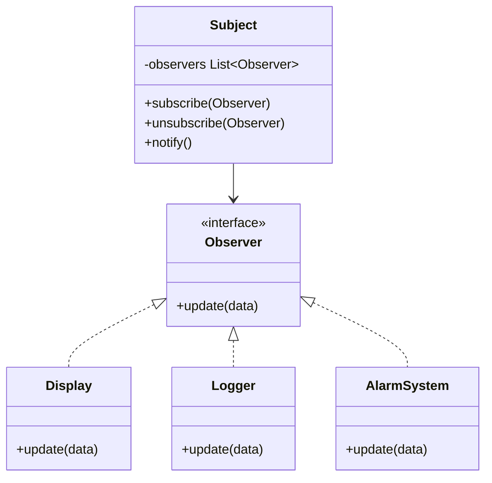

!!! example "Kavramsal Örnek"
    Bir sensör verisi güncellendiğinde; izleme ekranı, kayıt sistemi ve alarm modülü bu değişiklikten eş zamanlı olarak haberdar edilir. Sensör bu bileşenleri doğrudan çağırmaz; yalnızca durumunun değiştiğini bildirir.

---

### State

Bir nesnenin iç durumuna bağlı olarak davranışını değiştirmesini sağlayan bir tasarım desenidir. Çok sayıda koşul ifadesi (`if/else`, `switch`) kullanımını ortadan kaldırarak duruma özel davranışları ayrı yapılar hâline getirir.

!!! note "Strategy ile Fark"
    Strategy'de istemci hangi algoritmayı kullanacağını seçer ve genellikle değiştirmez. State'de ise nesne kendi durumunu ve buna bağlı geçişleri yönetir; durum değişimleri otomatik olarak gerçekleşebilir.

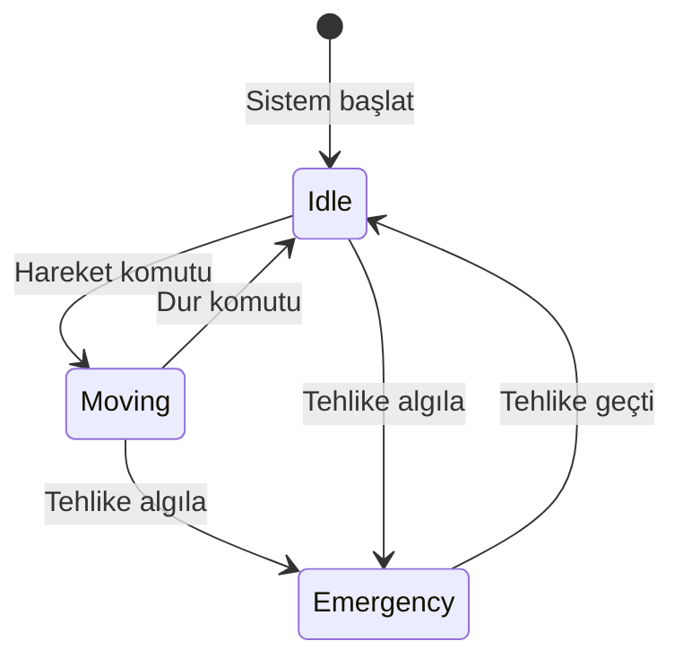

!!! example "Kavramsal Örnek"
    Bir otonom aracın "beklemede", "hareket hâlinde" ve "acil durum" çalışma modları vardır. Her mod kendi davranış kurallarını içerir. State kullanıldığında araç mevcut durumuna göre farklı tepkiler verirken kod if/else zincirlerinden arındırılır.

---

### Strategy

Aynı işi yapan ancak farklı algoritmalara sahip davranışların çalışma zamanında değiştirilebilir olmasını sağlayan bir tasarım desenidir. Algoritma ailesini kapsüller ve istemcinin algoritma detaylarından bağımsız çalışmasını sağlar.

!!! tip "Ne Zaman Kullanılır?"
    Bir işlemin birden fazla yapılış biçimi varsa ve bu biçimler çalışma zamanında değişebiliyorsa Strategy kullanılır. Örneğin sıralama algoritması, sıkıştırma yöntemi, ödeme yöntemi.

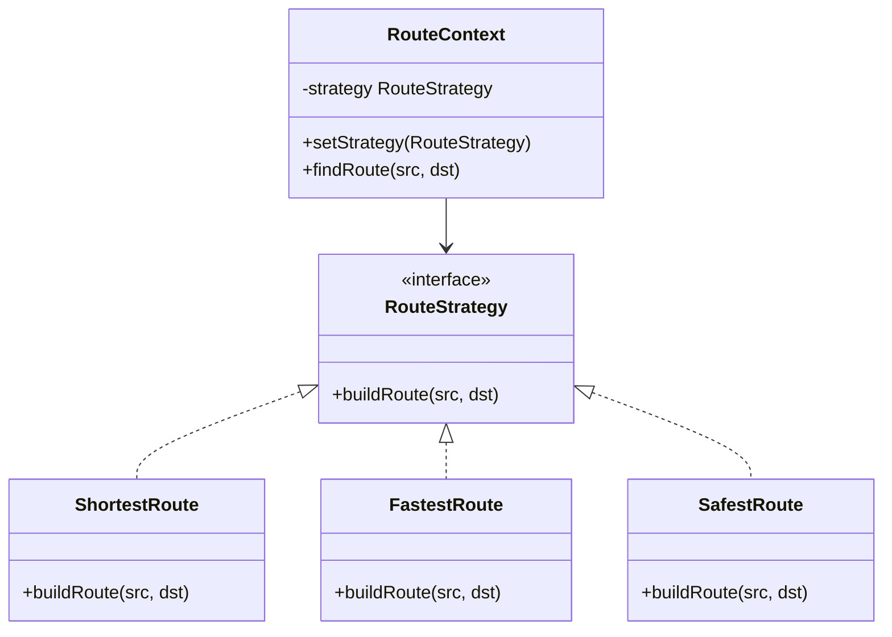

!!! example "Kavramsal Örnek"
    Bir rota planlama sisteminde en kısa yol, en hızlı yol ve en güvenli yol seçenekleri bulunmaktadır. Kullanıcı tercihine göre uygun strateji seçilir ve sistem bu stratejiye göre rotayı üretir. Algoritma değiştiğinde istemci kodu değişmez.

---

### Template Method

Bir algoritmanın iskeletini üst sınıfta tanımlayan, bazı adımların alt sınıflar tarafından özelleştirilmesine izin veren bir tasarım desenidir. Algoritmanın genel akışı sabit kalırken değişken adımlar kontrollü biçimde esnetilir.

!!! note "Hollywood Prensibi"
    "Bizi arama, biz seni ararız" — Alt sınıf belirli adımları override eder ancak akışın kontrolü daima üst sınıfta kalır.

!!! example "Kavramsal Örnek"
    Bir veri işleme sürecinde veri okuma, doğrulama, işleme ve raporlama adımları her zaman aynı sıradadır. Ancak doğrulama veya raporlama yöntemi projeye göre değişebilir. Template Method, bu değişken adımların özelleştirilmesini sağlar.

=== "C++"
    ```cpp
    class DataProcessor {
    public:
        void process() {  // template method — override edilmez
            readData();
            validate();
            processData();
            report();
        }
    protected:
        virtual void readData()    = 0;
        virtual void processData() = 0;
        virtual void validate() { /* varsayılan doğrulama */ }
        virtual void report()   { /* varsayılan raporlama */ }
    };

    class CSVProcessor : public DataProcessor {
    protected:
        void readData()    override { /* CSV oku   */ }
        void processData() override { /* CSV işle  */ }
    };
    ```

=== "Python"
    ```python
    from abc import ABC, abstractmethod

    class DataProcessor(ABC):
        def process(self):  # template method
            self.read_data()
            self.validate()
            self.process_data()
            self.report()

        @abstractmethod
        def read_data(self): pass

        @abstractmethod
        def process_data(self): pass

        def validate(self): pass  # opsiyonel override
        def report(self):   pass  # opsiyonel override

    class CSVProcessor(DataProcessor):
        def read_data(self):    print("CSV okunuyor")
        def process_data(self): print("CSV işleniyor")
    ```

---

### Visitor

Bir nesne yapısı üzerinde çalışacak yeni operasyonların, nesnelerin sınıfı değiştirilmeden eklenmesini sağlayan bir tasarım desenidir. Kararlı (stabil) nesne yapıları üzerinde sık sık yeni işlemler eklenmesi gereken durumlarda tercih edilir.

!!! danger "Dezavantaj"
    Yeni bir element türü eklendiğinde tüm Visitor implementasyonları güncellenmek zorundadır. Nesne yapısı sık değişiyorsa Visitor uygun değildir.

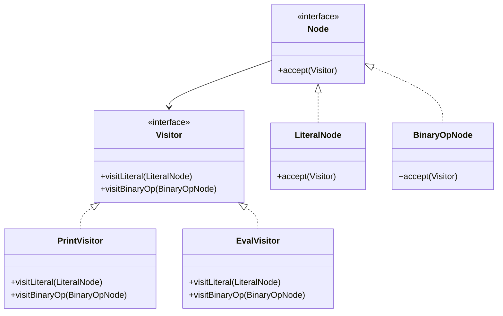

!!! example "Kavramsal Örnek"
    Bir soyut sözdizimi ağacı (AST) üzerinde analiz, optimizasyon ve raporlama gibi farklı işlemler yapılmaktadır. Visitor sayesinde bu işlemler AST'nin yapısı değiştirilmeden sisteme eklenebilir.

=== "C++"
    ```cpp
    struct LiteralNode;
    struct BinaryOpNode;

    class Visitor {
    public:
        virtual void visit(LiteralNode&)  = 0;
        virtual void visit(BinaryOpNode&) = 0;
    };

    struct Node {
        virtual void accept(Visitor& v) = 0;
    };

    struct LiteralNode : Node {
        int value;
        void accept(Visitor& v) override { v.visit(*this); }
    };

    class PrintVisitor : public Visitor {
    public:
        void visit(LiteralNode& n)  override { /* yazdır */ }
        void visit(BinaryOpNode& n) override { /* yazdır */ }
    };
    ```
