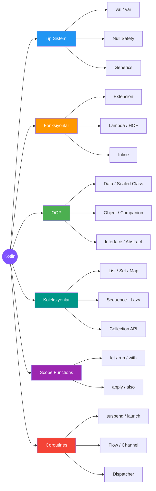
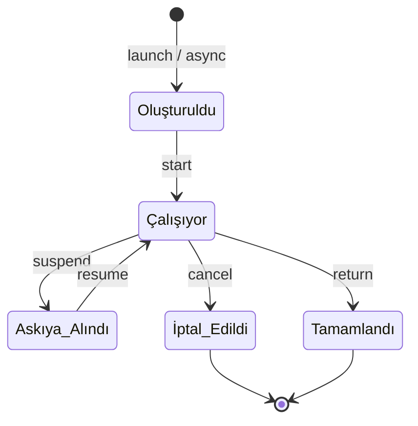
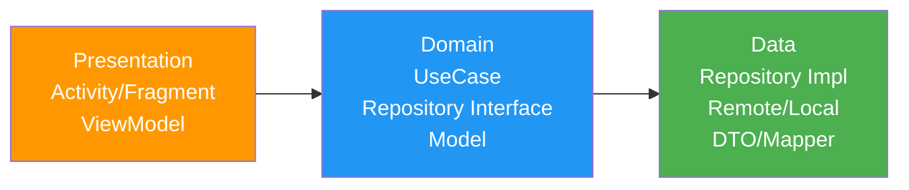

# Kotlin

!!! note "Genel Bakış"
    Kotlin, JetBrains tarafından geliştirilen, JVM (ve Native/JS) üzerinde çalışan modern, statik tipli bir programlama dilidir. Null güvenliği, extension fonksiyonlar, coroutine desteği ve özlü sözdizimi ile Java'nın güçlü ekosistemini modern bir dil deneyimiyle birleştirir. Google, 2019'dan itibaren Android geliştirme için birincil dil olarak Kotlin'i benimsemiştir.



---

## Temel Kavramlar

### Değişkenler

| Anahtar Kelime | Anlam | Açıklama |
|----------------|-------|---------|
| `val` | Value (değer) | Atandıktan sonra değiştirilemez (read-only) |
| `var` | Variable (değişken) | Değiştirilebilir |

!!! tip "val vs const val"
    `val` runtime'da belirlenir; `const val` derleme zamanında sabit olup yalnızca `String` ve temel tip (`Int`, `Double` vb.) alır. `const val` yalnızca top-level veya `object` içinde tanımlanabilir.

```kotlin
val isim: String = "Serkan"  // Tip belirtildi
val yas = 30                  // Type Inference — derleyici Int çıkarır
var sayac = 0
sayac++

const val PI = 3.14159       // Derleme zamanı sabiti

val isimUzunluk = isim.length  // val; değeri runtime'da belirlenir

// String Templates
println("Selam $isim!")
println("Yaş + 1 = ${yas + 1}")  // Expression için {}
```

### Tip Sistemi

| Kotlin Tipi | Boyut | Not |
|-------------|-------|-----|
| `Byte` | 8-bit | -128..127 |
| `Short` | 16-bit | |
| `Int` | 32-bit | Varsayılan tam sayı |
| `Long` | 64-bit | Literal: `100L` |
| `Float` | 32-bit | Literal: `3.14f` |
| `Double` | 64-bit | Varsayılan ondalık |
| `Boolean` | — | `true` / `false` |
| `Char` | 16-bit | Unicode; `'A'` |
| `String` | — | Immutable; UTF-16 |
| `Any` | — | Tüm tiplerin üst sınıfı (Java `Object`) |
| `Unit` | — | `void` karşılığı |
| `Nothing` | — | Asla değer döndürmez; `throw` ve sonsuz döngü |

!!! note "Sayı Gösterimleri"
    ```kotlin
    val ondalik = 1_000_000   // _ rakam ayırıcı
    val ikili   = 0b1010
    val hex     = 0xFF
    val long    = 100L
    val float   = 3.14f
    ```

### Null Safety

Kotlin'in en kritik özelliğidir. Tip sistemi, nullable ve non-nullable değerleri derleme zamanında birbirinden ayırır.

| Operatör | İsim | Açıklama |
|----------|------|---------|
| `T?` | Nullable tip | `null` değeri alabilir |
| `?.` | Safe call | Null ise atlar, `null` döner |
| `?:` | Elvis | Null ise sağ taraftaki değeri kullanır |
| `!!` | Not-null assertion | Null ise `NullPointerException` fırlatır |
| `as?` | Safe cast | Dönüşüm başarısızsa `null` döner |

```kotlin
val isim: String? = null

isim?.length             // null — güvenli
isim?.length ?: 0        // 0  — null yerine varsayılan
// isim.length           // Derleme hatası — nullable'ı doğrudan kullanamaz
// isim!!.length         // Runtime NPE — null ise çöker

val uzunluk = isim?.length ?: return  // Early return pattern

// Smart Cast — null check sonrası derleyici tipi daraltır
if (isim != null) {
    println(isim.length)  // String? → String; !! gerekmez
}

// Safe Cast
val nesne: Any = "Merhaba"
val s: String? = nesne as? String    // String
val n: Int?    = nesne as? Int       // null — fırlatmaz
```

!!! danger "!! Kullanımını Minimumda Tutun"
    `!!` Kotlin'in null güvenliği mekanizmasını devre dışı bırakır. Kullanmadan önce neden nullable olduğunu ve neden burada kesinlikle null olmayacağını belgeleyin.

### Ranges ve Progressions

| Sözdizimi | Aralık | Açıklama |
|-----------|--------|---------|
| `1..10` | 1 ≤ x ≤ 10 | Başlangıç ve bitiş dahil |
| `1 until 10` | 1 ≤ x < 10 | Bitiş hariç |
| `10 downTo 1` | 10 ≥ x ≥ 1 | Geriye doğru |
| `1..10 step 2` | 1, 3, 5, 7, 9 | Adım belirleme |

```kotlin
for (i in 1..5) print("$i ")         // 1 2 3 4 5
for (i in 1 until 5) print("$i ")    // 1 2 3 4
for (i in 5 downTo 1) print("$i ")   // 5 4 3 2 1
for (i in 0..10 step 3) print("$i ") // 0 3 6 9

if (x in 1..100) println("Aralıkta")
```

---

## Kontrol Akışı

### when (Expression)

`switch-case`'in Kotlin karşılığı; hem ifade hem deyim olarak kullanılabilir.

```kotlin
val puan = 85

val harf = when {
    puan >= 90 -> "A"
    puan >= 80 -> "B"
    puan >= 70 -> "C"
    puan >= 60 -> "D"
    else       -> "F"
}

when (val tip = nesne) {
    is String  -> println("String uzunluğu: ${tip.length}")  // Smart Cast
    is Int     -> println("Int değeri: $tip")
    null       -> println("Null")
    else       -> println("Bilinmeyen tip")
}

when (x) {
    1, 2       -> println("Bir veya İki")
    in 3..10   -> println("3 ile 10 arası")
    !in 0..100 -> println("Aralık dışı")
    else       -> println("Diğer")
}
```

### Döngüler

```kotlin
// for — range, iterable, destructuring
for (i in 1..5) println(i)
for ((index, value) in liste.withIndex()) println("$index: $value")

// while / do-while
var x = 5
while (x > 0) x--
do { x++ } while (x < 3)

// break / continue ile etiket (nested döngü için)
outer@ for (i in 1..3) {
    for (j in 1..3) {
        if (j == 2) continue@outer  // Dış döngüye continue
        if (i == 3) break@outer     // Dış döngüyü kır
        println("$i,$j")
    }
}
```

---

## Fonksiyonlar

### Temel Fonksiyon Sözdizimi

```kotlin
// Gövdeli fonksiyon
fun topla(a: Int, b: Int): Int {
    return a + b
}

// Expression body — dönüş tipi çıkarılır
fun topla(a: Int, b: Int) = a + b

// Default parametre + Named argument
fun baglan(host: String, port: Int = 8080, ssl: Boolean = false): String =
    "$host:$port (ssl=$ssl)"

baglan("localhost")                       // localhost:8080 (ssl=false)
baglan("ornek.com", ssl = true)          // ornek.com:8080 (ssl=true)
baglan(port = 443, host = "ornek.com")   // Sıra önemsiz
```

### Vararg ve Spread Operatörü

```kotlin
fun toplam(vararg sayilar: Int): Int = sayilar.sum()

toplam(1, 2, 3, 4)                 // 10
val dizi = intArrayOf(1, 2, 3)
toplam(*dizi)                       // Spread: diziyi açar
```

### Extension Functions

Mevcut sınıfı miras almadan veya değiştirmeden ona yeni fonksiyon ekler.

```kotlin
fun String.isPalindrome(): Boolean = this == this.reversed()

fun Int.isEven(): Boolean = this % 2 == 0

fun <T> List<T>.secondOrNull(): T? = if (size >= 2) this[1] else null

// Extension property
val String.wordCount: Int
    get() = this.trim().split("\\s+".toRegex()).size

println("madam".isPalindrome())           // true
println(listOf(1,2,3).secondOrNull())     // 2
println("hello world".wordCount)          // 2
```

!!! note "Extension Function Kısıtlaması"
    Extension fonksiyonlar static dispatch yapılır; virtual değildir. Sınıfın private üyelerine erişemez. Override edilemez — aynı imzada üye fonksiyon varsa o kazanır.

### Higher-Order Functions ve Lambda

```kotlin
// Fonksiyon tipi: (parametreler) -> dönüş tipi
fun islemi_uygula(x: Int, islem: (Int) -> Int): Int = islem(x)

islemi_uygula(5) { it * 2 }   // 10 — trailing lambda sözdizimi

// Lambda
val kare: (Int) -> Int = { x -> x * x }
val kare2: (Int) -> Int = { it * it }   // it: tek parametre için kısa yol

// Function reference — :: ile
val sayilar = listOf(1, 2, 3, 4, 5)
sayilar.filter(::isOdd)   // isOdd: (Int) -> Boolean fonksiyonu
```

### Inline Functions

Lambda çağrısının overhead'ini sıfıra indirir; lambda kodu çağrı noktasına kopyalanır.

```kotlin
inline fun zamanla(blok: () -> Unit): Long {
    val t = System.currentTimeMillis()
    blok()
    return System.currentTimeMillis() - t
}

// noinline: Belirli bir lambda'yı inline etmemek için
// crossinline: Lambda içinde non-local return yasaklamak için
```

---

## OOP

### Sınıflar ve Properties

```kotlin
class Kisi(
    val isim: String,           // Primary constructor + property
    var yas: Int,
    private val tc: String      // Özel
) {
    // Backing field olan property
    var email: String = ""
        get() = field.lowercase()      // Custom getter
        set(value) {                   // Custom setter
            require(value.contains("@")) { "Geçersiz email" }
            field = value
        }

    // Secondary constructor — primary'i çağırmalı
    constructor(isim: String) : this(isim, 0, "")

    init {
        // Primary constructor çalıştıktan hemen sonra
        require(isim.isNotBlank()) { "İsim boş olamaz" }
    }

    fun tanitim() = "$isim ($yas yaşında)"
}
```

### Visibility Modifiers

| Modifier | Sınıf | Top-Level |
|----------|-------|-----------|
| `public` | Herkes görür (varsayılan) | Herkes görür |
| `private` | Yalnızca bu sınıf | Yalnızca bu dosya |
| `protected` | Bu sınıf + alt sınıflar | Kullanılamaz |
| `internal` | Aynı modül | Aynı modül |

### Data Class

Sadece veri tutmak için; `equals()`, `hashCode()`, `toString()`, `copy()` ve `componentN()` otomatik üretilir.

```kotlin
data class Nokta(val x: Double, val y: Double)

val p1 = Nokta(1.0, 2.0)
val p2 = p1.copy(y = 5.0)     // Nokta(1.0, 5.0)

// Destructuring
val (x, y) = p1
println("x=$x y=$y")

println(p1 == Nokta(1.0, 2.0))  // true — equals() struct compare
```

### Sealed Class

Kapalı bir tip hiyerarşisi — tüm alt sınıflar aynı dosyada tanımlanmak zorunda. `when` ifadesiyle `else` gerekmez.

```kotlin
sealed class Sonuc<out T> {
    data class Basari<T>(val veri: T) : Sonuc<T>()
    data class Hata(val mesaj: String, val kod: Int = 0) : Sonuc<Nothing>()
    object Yukleniyor : Sonuc<Nothing>()
}

fun isle(sonuc: Sonuc<String>) = when (sonuc) {
    is Sonuc.Basari     -> println("Veri: ${sonuc.veri}")
    is Sonuc.Hata       -> println("Hata (${sonuc.kod}): ${sonuc.mesaj}")
    is Sonuc.Yukleniyor -> println("Yükleniyor...")
    // else gerekmiyor — derleyici tüm durumları bilir
}
```

!!! tip "Sealed Class vs Enum"
    `enum class` her varyant aynı veriyi taşır. `sealed class` her varyantın farklı alan sayısına sahip olmasına izin verir.

### Enum Class

```kotlin
enum class Yon(val derece: Int) {
    KUZEY(0), DOGU(90), GUNEY(180), BATI(270);

    fun karsisi(): Yon = entries[(ordinal + 2) % 4]
}

println(Yon.KUZEY.karsisi())   // GUNEY
Yon.valueOf("DOGU")             // Yon.DOGU
Yon.entries                     // Tüm değerler (Kotlin 1.9+)
```

### Object ve Companion Object

```kotlin
// Singleton — Thread-safe, lazy başlatılır
object Ayarlar {
    var dil = "tr"
    fun sifirla() { dil = "tr" }
}

// Companion Object — Java'daki static benzer
class Kullanici private constructor(val isim: String) {
    companion object {
        private var sayac = 0
        fun olustur(isim: String): Kullanici {
            sayac++
            return Kullanici(isim)
        }
        fun kacTane() = sayac
    }
}

Kullanici.olustur("Ali")     // Factory method
Kullanici.kacTane()          // 1

// Anonymous Object
val dinleyici = object : ArayuzAdi {
    override fun onEvent() = println("Olay!")
}
```

### Kalıtım (Inheritance)

```kotlin
// Kotlin sınıfları varsayılan final — override için open şart
open class Hayvan(val isim: String) {
    open fun sesCikar() = println("...")
    fun nefesAl() = println("$isim nefes alıyor")  // override edilemez
}

class Kedi(isim: String) : Hayvan(isim) {
    override fun sesCikar() = println("$isim: Miyav!")
}

// Abstract — doğrudan nesne oluşturulamaz
abstract class Sekil {
    abstract fun alan(): Double
    fun tanitim() = "Alan: ${alan()}"
}

// Interface — çoklu uygulama, varsayılan gövde
interface Ucabilir {
    val maxYukseklik: Int get() = 1000     // Interface property
    fun uc(): String = "Uçuyor"           // Varsayılan gövde
}

interface Yuzebi_lir {
    fun yuz(): String
}

class UcanBalik : Sekil(), Ucabilir, Yuzebi_lir {
    override fun alan() = 0.0
    override fun yuz() = "Yüzüyor"
    // uc() — varsayılan kullanılır
}
```

| | Abstract Class | Interface |
|--|:--------------:|:---------:|
| Miras/Implementation | Tek | Sınırsız |
| Constructor | ✓ | ✗ |
| State (backing field) | ✓ | ✗ |
| Varsayılan gövde | ✓ | ✓ (Kotlin) |
| İlişki | "is-a" | "can-do" |

---

## Koleksiyonlar

### Immutable vs Mutable

| Immutable | Mutable | Açıklama |
|-----------|---------|---------|
| `listOf` | `mutableListOf` | Sıralı, tekrar eden |
| `setOf` | `mutableSetOf` | Sırasız, benzersiz |
| `mapOf` | `mutableMapOf` | Anahtar-değer |
| `arrayOf` | `Array<T>` | Sabit boyut |
| `intArrayOf` | — | Primitive int dizisi |

!!! note "Kotlin Koleksiyon Felsefesi"
    Kotlin standart kütüphanesi Java koleksiyonlarını wrap eder; ek bir runtime maliyet olmaz. `listOf()` gerçekte `java.util.List` döner — sadece read-only görünüm sağlar.

### Collection API

```kotlin
val sayilar = listOf(1, 2, 3, 4, 5, 6)

// Filtreleme
sayilar.filter { it % 2 == 0 }        // [2, 4, 6]
sayilar.filterNot { it % 2 == 0 }     // [1, 3, 5]

// Dönüştürme
sayilar.map { it * it }                // [1, 4, 9, 16, 25, 36]
sayilar.flatMap { listOf(it, it * 2) } // [1,2, 2,4, 3,6, ...]

// İndirgeme
sayilar.reduce { acc, n -> acc + n }   // 21
sayilar.fold(0) { acc, n -> acc + n }  // 21 (başlangıç değeriyle)

// Sıralama
sayilar.sorted()
sayilar.sortedByDescending { it }
sayilar.sortedWith(compareBy({ it % 2 }, { it }))

// Gruplama
sayilar.groupBy { if (it % 2 == 0) "çift" else "tek" }
// {"çift": [2,4,6], "tek": [1,3,5]}

// Yardımcılar
sayilar.any { it > 5 }      // true
sayilar.all { it > 0 }      // true
sayilar.none { it > 10 }    // true
sayilar.count { it > 3 }    // 3
sayilar.sum()               // 21
sayilar.sumOf { it * 2 }    // 42
sayilar.maxOrNull()         // 6
sayilar.minOrNull()         // 1
sayilar.first { it > 3 }    // 4
sayilar.firstOrNull { it > 10 } // null
sayilar.take(3)             // [1, 2, 3]
sayilar.drop(3)             // [4, 5, 6]
sayilar.chunked(2)          // [[1,2], [3,4], [5,6]]
sayilar.zip(listOf('a','b','c'))  // [(1,a), (2,b), (3,c)]
```

### Sequence (Lazy Koleksiyon)

Büyük koleksiyonlarda ara liste oluşturmadan zincirleme işlem yapar.

```kotlin
// Eager — her adım yeni liste oluşturur
listOf(1..1_000_000)
    .map { it * 2 }      // 1M elemanlı liste
    .filter { it > 5 }   // 1M elemanlı liste
    .first()

// Lazy — yalnızca gerekli kadar işler
(1..1_000_000).asSequence()
    .map { it * 2 }
    .filter { it > 5 }
    .first()             // 1M'nin tamamını işlemez — ilk eşleşmede durur
```

!!! tip "Ne Zaman Sequence Kullanmalı?"
    Koleksiyon büyükse (>1000 eleman) ve birden fazla `filter/map` zinciri varsa `asSequence()` kullanın. Küçük koleksiyonlarda overhead nedeniyle yavaş olabilir.

---

## Scope Functions

Nesne bağlamında lambda çalıştırmak için; farklı `this`/`it` ve dönüş değeri semantiği.

| Fonksiyon | Referans | Dönüş | Kullanım |
|-----------|:--------:|:-----:|---------|
| `let` | `it` | Lambda sonucu | Null check, dönüşüm zinciri |
| `run` | `this` | Lambda sonucu | Nesne başlatma + hesaplama |
| `with` | `this` | Lambda sonucu | Receiver olmadan, grup işlem |
| `apply` | `this` | Nesnenin kendisi | Nesne yapılandırma (builder) |
| `also` | `it` | Nesnenin kendisi | Side effect (log, debug) |

```kotlin
// let — nullable ile kullanım
val isim: String? = "Kotlin"
val uzunluk = isim?.let { it.length * 2 } ?: 0

// apply — nesneyi yapılandır, kendisini döndür
val liste = mutableListOf<Int>().apply {
    add(1); add(2); add(3)
}  // MutableList<Int>

// also — yan etki; nesneyi değiştirmez
val islem = hesapla().also { log.debug("Sonuç: $it") }

// run — başlatma ve hesaplama
val sonuc = StringBuilder().run {
    append("Merhaba")
    append(" Dünya")
    toString()  // Lambda sonucu döner
}

// with — extension olmadan nesne üzerinde işlem
val metin = with(StringBuilder()) {
    for (i in 1..5) append("$i ")
    toString()
}
```

---

## Generics

### Temel Kullanım

```kotlin
class Kutu<T>(var icerik: T) {
    fun al(): T = icerik
    fun koy(yeni: T) { icerik = yeni }
}

fun <T : Comparable<T>> maksimum(a: T, b: T): T = if (a > b) a else b

maksimum(3, 7)        // 7
maksimum("Ali", "Veli") // Veli
```

### Variance (in / out / *)

| | Kullanım | Açıklama |
|--|:--------:|---------|
| `out T` (Covariant) | Yalnızca üretir (döndürür) | `List<out Animal>` → `List<Dog>` atanabilir |
| `in T` (Contravariant) | Yalnızca tüketir (alır) | `Comparable<in String>` |
| `*` (Star Projection) | Tip bilinmiyor | `List<*>` — okuma güvenli |

```kotlin
// Covariant — sadece döndürür
interface Uretici<out T> {
    fun uret(): T
}

// Contravariant — sadece alır
interface Tuketici<in T> {
    fun tuset(item: T)
}

// reified — inline içinde runtime'da tip bilgisine erişim
inline fun <reified T> tipKontrol(nesne: Any): Boolean = nesne is T

tipKontrol<String>("merhaba")  // true
```

---

## Coroutines

Kotlin'in asenkron programlama çözümü; thread'leri bloke etmeden I/O ve paralel iş yönetimi sağlar.



### Dispatcher'lar

| Dispatcher | Kullanım | Thread Havuzu |
|-----------|---------|--------------|
| `Dispatchers.Main` | UI güncellemeleri (Android) | Ana thread |
| `Dispatchers.IO` | Ağ, dosya, veritabanı | Geniş havuz (64+) |
| `Dispatchers.Default` | CPU-bound hesaplama | CPU çekirdeği sayısı kadar |
| `Dispatchers.Unconfined` | Test veya özel kullanım | Kısıtlama yok |

### launch vs async

| | `launch` | `async` |
|--|:--------:|:-------:|
| Dönüş | `Job` | `Deferred<T>` |
| Sonuç alma | — | `.await()` |
| Kullanım | "Fire and forget" | Değer bekleniyorsa |

```kotlin
// launch — Job döner; dönüş değeri yok
val is1 = scope.launch {
    delay(1000L)    // suspend function — thread'i bloke etmez
    println("İş tamamlandı")
}

// async — Deferred<T> döner; .await() ile değer alınır
val is2 = scope.async {
    delay(500L)
    42
}
val sonuc = is2.await()  // 42

// Paralel yürütme
suspend fun paralel() = coroutineScope {
    val a = async { agirHesap1() }
    val b = async { agirHesap2() }
    a.await() + b.await()   // İkisi paralel çalışır
}
```

### Structured Concurrency

```kotlin
class BenimViewModel : ViewModel() {
    fun veriCek() {
        viewModelScope.launch {   // ViewModel destroy edilince otomatik iptal
            try {
                val veri = withContext(Dispatchers.IO) {
                    api.getVeri()   // IO thread'de
                }
                _uiState.value = veri  // Main thread'de
            } catch (e: Exception) {
                _hata.value = e.message
            }
        }
    }
}
```

!!! note "coroutineScope vs supervisorScope"
    - `coroutineScope`: Herhangi bir child başarısız olursa tüm scope iptal edilir.
    - `supervisorScope`: Bir child'ın hatası diğerlerini etkilemez.

### Flow (Soğuk Akış)

```kotlin
// Flow tanımlama
fun sayiUret(): Flow<Int> = flow {
    for (i in 1..5) {
        delay(100L)
        emit(i)          // Değer yayımla
    }
}

// Flow toplama
viewModelScope.launch {
    sayiUret()
        .filter { it % 2 == 0 }
        .map { it * 10 }
        .collect { println(it) }  // 20, 40
}

// StateFlow — Android UI için (LiveData alternatifi)
private val _durum = MutableStateFlow<Sonuc<List<Urun>>>(Sonuc.Yukleniyor)
val durum: StateFlow<Sonuc<List<Urun>>> = _durum.asStateFlow()

// SharedFlow — çok sayıda subscriber
private val _olaylar = MutableSharedFlow<UIEvent>()
val olaylar = _olaylar.asSharedFlow()
```

| | `StateFlow` | `SharedFlow` |
|--|:-----------:|:------------:|
| Başlangıç değeri | Zorunlu | İsteğe bağlı |
| Son değer replay | 1 (değişmeyenler emit edilmez) | Ayarlanabilir `replay` |
| Kullanım | UI state | Tek seferlik olaylar |

### Exception Handling

```kotlin
// SupervisorJob ile hata izolasyonu
val supervisor = SupervisorJob()
val scope = CoroutineScope(Dispatchers.IO + supervisor)

// CoroutineExceptionHandler
val handler = CoroutineExceptionHandler { _, e ->
    println("Yakalandı: ${e.message}")
}

scope.launch(handler) {
    throw RuntimeException("Hata!")
}

// try-catch — async içinde await'te yakalanır
val deferred = scope.async {
    throw IOException("Bağlantı hatası")
}

try {
    deferred.await()
} catch (e: IOException) {
    println("IO hatası: ${e.message}")
}
```

!!! danger "CancellationException Yutmayın"
    ```kotlin
    try {
        delay(1000)
    } catch (e: Exception) {
        // e CancellationException ise yeniden fırlat!
        if (e is CancellationException) throw e
        // Diğer hataları işle
    }
    ```

---

## Clean Architecture

Kodun parçalarını birbirinden bağımsız tutma prensibidir. **Dış halkalar iç halkaları tanıyabilir; iç halkalar dışarıda neler olup bittiğini bilmez.**



| Katman | Sorumluluk | Bileşenler |
|--------|-----------|-----------|
| **Domain** | İş mantığı; bağımsız | UseCase, Model (Entity), Repository Interface |
| **Data** | Veri kaynakları | Repository Impl, DTO, Mapper, API, Database |
| **Presentation** | Kullanıcı arayüzü | ViewModel, Activity/Fragment, UI State |

```
com.proje/
├── data/
│   ├── local/        # Room DAO + Entity
│   ├── remote/       # Retrofit API + DTO
│   ├── repository/   # Repository implementasyonları
│   └── mapper/       # DTO → Domain Model dönüşümleri
│
├── domain/
│   ├── model/        # Domain modelleri (Android bağımsız)
│   ├── repository/   # Repository interface'leri
│   └── usecase/      # Tek iş yapan Use Case'ler
│
├── presentation/
│   ├── ekran_adi/
│   │   ├── EkranFragment.kt
│   │   └── EkranViewModel.kt
│   └── components/   # Reusable UI bileşenleri
│
└── di/               # Dependency Injection (Hilt)
```

### Hangi Katmana Nereye Koymalı?

| Soru | Evet → Katman |
|------|---------------|
| Kullanıcı bunu ekranında görüyor mu? | `presentation/` |
| Uygulamanın yapabildiği tekil bir iş mi? | `domain/usecase/` |
| API veya veritabanıyla konuşuyor mu? | `data/` |
| Her yerden erişilen genel araç mı? | `core/` veya `util/` |
| Ekran kapansa bile arka planda çalışmalı mı? | `service/` |

---

## Android Geliştirme

### build.gradle.kts

```kotlin
// Module-level build.gradle.kts
android {
    namespace = "com.ornek.uygulama"
    compileSdk = 34

    defaultConfig {
        applicationId = "com.ornek.uygulama"
        minSdk = 26
        targetSdk = 34
        versionCode = 1
        versionName = "1.0"
    }

    buildFeatures {
        compose = true
    }
}

dependencies {
    implementation("androidx.core:core-ktx:1.12.0")
    implementation(platform("androidx.compose:compose-bom:2024.02.00"))
    implementation("androidx.compose.ui:ui")
    implementation("androidx.lifecycle:lifecycle-viewmodel-ktx:2.7.0")
    implementation("org.jetbrains.kotlinx:kotlinx-coroutines-android:1.7.3")
}
```

### AndroidManifest.xml

```xml
<manifest>
    <!-- İzinler -->
    <uses-permission android:name="android.permission.INTERNET"/>
    <uses-permission android:name="android.permission.ACCESS_FINE_LOCATION"/>

    <application
        android:icon="@mipmap/ic_launcher"
        android:label="@string/app_name"
        android:theme="@style/Theme.App">

        <!-- Launcher Activity — uygulamanın giriş noktası -->
        <activity
            android:name=".MainActivity"
            android:exported="true">
            <intent-filter>
                <action android:name="android.intent.action.MAIN"/>
                <category android:name="android.intent.category.LAUNCHER"/>
            </intent-filter>
        </activity>

    </application>
</manifest>
```

| Bölüm | Açıklama |
|-------|---------|
| `<uses-permission>` | Sistem izinleri (internet, kamera, konum) |
| `<application>` | Uygulama geneli ayarlar (ikon, tema, isim) |
| `<activity>` | Her Activity kayıtlı olmalı; `exported=true` dışarıdan erişilebilir |
| `<service>` | Arka plan servisleri |
| `<receiver>` | Broadcast receiver'lar |
| `<provider>` | Content provider'lar |

### Logcat

```kotlin
import android.util.Log

val ETIKET = "UygulamaBenim"

Log.v(ETIKET, "Verbose — çok ayrıntılı")  // Geliştirme
Log.d(ETIKET, "Debug — değer: $veri")       // Debug
Log.i(ETIKET, "Info — işlem tamamlandı")    // Bilgi
Log.w(ETIKET, "Warning — uyarı durumu")     // Uyarı
Log.e(ETIKET, "Error — hata!", exception)   // Hata
```

| Seviye | Kısaltma | Kullanım |
|--------|:--------:|---------|
| Verbose | `V` | En ayrıntılı; sadece geliştirmede |
| Debug | `D` | Debug bilgisi |
| Info | `I` | Önemli olaylar |
| Warning | `W` | Potansiyel sorun |
| Error | `E` | Hata durumu |

!!! tip "BuildConfig ile Production Log Kapatma"
    ```kotlin
    if (BuildConfig.DEBUG) {
        Log.d(ETIKET, "Bu sadece debug build'de çalışır")
    }
    ```

### Jetpack Compose Temelleri

```kotlin
@Composable
fun KullaniciKarti(isim: String, yas: Int) {
    Card(modifier = Modifier.padding(8.dp)) {
        Column(modifier = Modifier.padding(16.dp)) {
            Text(text = isim, style = MaterialTheme.typography.headlineMedium)
            Text(text = "$yas yaşında")
        }
    }
}

// State yönetimi
@Composable
fun Sayac() {
    var sayac by remember { mutableStateOf(0) }
    Button(onClick = { sayac++ }) {
        Text("Tıkla: $sayac")
    }
}

// ViewModel ile entegrasyon
@Composable
fun EkranIcerigi(viewModel: EkranViewModel = viewModel()) {
    val durum by viewModel.durum.collectAsStateWithLifecycle()
    when (durum) {
        is Sonuc.Yukleniyor -> CircularProgressIndicator()
        is Sonuc.Basari     -> IcerikListesi((durum as Sonuc.Basari).veri)
        is Sonuc.Hata       -> HataGoster((durum as Sonuc.Hata).mesaj)
    }
}
```

!!! note "@Composable Kuralları"
    - Composable fonksiyonlar yalnızca Composable bağlamda çağrılabilir.
    - İsimler **PascalCase** olmalı.
    - Side effect'ler için `LaunchedEffect`, `SideEffect`, `DisposableEffect` kullanın — doğrudan composable gövdesinde yan etki oluşturmayın.