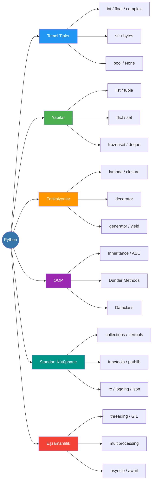
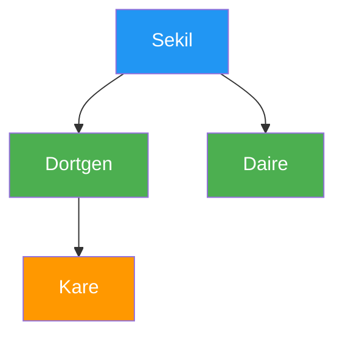
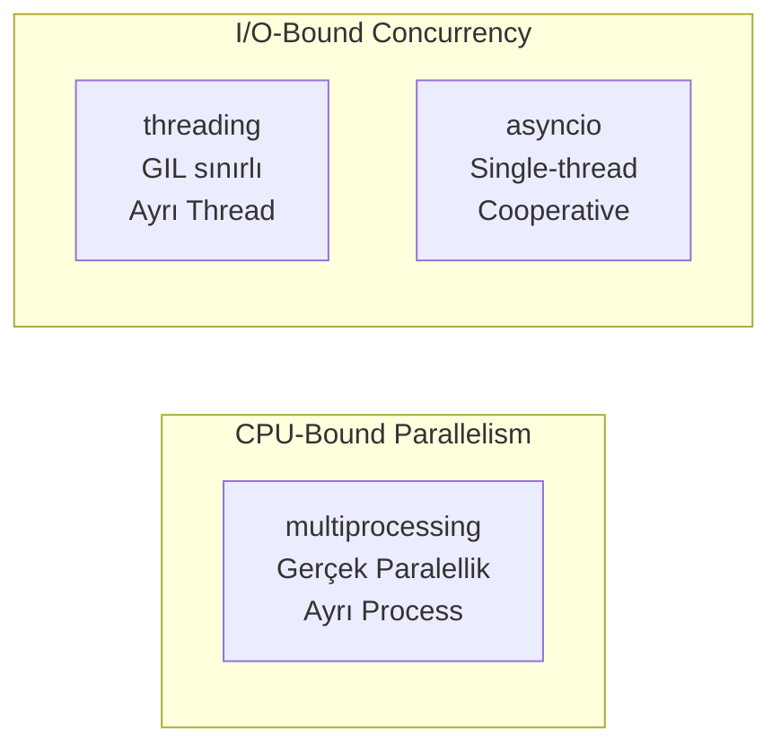

# Python

!!! note "Genel Bakış"
    Python, yüksek seviyeli, dinamik tipli ve çok paradigmalı bir programlama dilidir. "Batteries included" felsefesiyle kapsamlı standart kütüphane, okunabilir sözdizimi ve hızlı prototipleme kapasitesiyle ön plana çıkar. Veri bilimi, sistem otomasyonu, web geliştirme ve gömülü sistemlerde (MicroPython) yaygın olarak kullanılır.



---

## Temel Kavramlar

### Mutability (Değişebilirlik)

| Immutable (Değiştirilemez) | Mutable (Değiştirilebilir) |
|:-------------------------:|:-------------------------:|
| `int`, `float`, `complex` | `list`, `dict`, `set`, `bytearray` |
| `str`, `bytes`, `bool` | Kullanıcı tanımlı nesneler (genellikle) |
| `tuple`, `frozenset` | |

!!! note "Neden Önemli?"
    Immutable nesneler dict key ve set eleman olabilir; hash değerleri değişmez. Mutable nesneyi default parametre yapmak klasik bir tuzaktır (bkz. Mutable Default Argument).

### Temel Operatörler

| Operatör | Açıklama | Örnek |
|----------|---------|-------|
| `**` | Üst alma | `2 ** 10 = 1024` |
| `//` | Tam bölme (floor division) | `7 // 2 = 3` |
| `%` | Modulo | `7 % 2 = 1` |
| `@` | Matris çarpımı (PEP 465) | `A @ B` |
| `:=` | Walrus (atama + kullanma, 3.8+) | `if (n := len(a)) > 10:` |
| `is` | Kimlik (aynı nesne mi?) | `a is None` |
| `in` | Üyelik | `'a' in 'python'` |

!!! tip "Sayı Gösterimleri"
    ```python
    n = 100_000_000  # _ rakam ayırıcı (okunabilirlik için)
    n = 0b1010       # İkili
    n = 0o12         # Sekizlik
    n = 0x1F         # Onaltılık
    ```

!!! danger "Mutable Default Argument Tuzağı"
    ```python
    def ekle(item, liste=[]):   # Kötü: liste yalnızca bir kez oluşturulur
        liste.append(item)
        return liste

    ekle(1)   # [1]
    ekle(2)   # [1, 2]  ← beklenen [2] değil!

    def ekle(item, liste=None): # Doğru
        if liste is None:
            liste = []
        liste.append(item)
        return liste
    ```

### Kontrol Akışı

```python
# Ternary expression
sonuc = "çift" if n % 2 == 0 else "tek"

# Walrus — atama ve kontrol tek satırda
if (n := len(input("deger: "))) < 10:
    print(f"Girdi {n} karakterden kısa")

# for-else: break ile çıkılmadıysa else çalışır
for harf in metin:
    if harf == 'a':
        print("bulundu")
        break
else:
    print("bulunamadı")  # sadece break tetiklenmediyse
```

| Deyim | Etki |
|-------|------|
| `break` | Döngüyü sonlandırır |
| `continue` | Bir sonraki iterasyona geçer |
| `pass` | İşlem yapmaz; sözdizimi için yer tutar |
| `return` | Fonksiyondan çıkar; `return None` varsayılan |

---

## Veri Yapıları

### String

Tek (`'…'`), çift (`"…"`) veya üçlü tırnak ile tanımlanır. **Immutable** — bir karakter değiştirmek için yeni string üretmek gerekir.

```python
kelime = "python"
kelime[0]       # 'p'
kelime[-1]      # 'n'
kelime[::-1]    # 'nohtyp'  (ters çevirme)
kelime[::2]     # 'pto'
kelime * 3      # 'pythonpythonpython'
```

| String Metodu | Açıklama |
|---------------|---------|
| `s.upper()` / `s.lower()` | Büyük / küçük harfe çevirir |
| `s.capitalize()` | Yalnızca ilk harfi büyük yapar |
| `s.title()` | Her kelimenin ilk harfini büyük yapar |
| `s.casefold()` | Dil bağımsız, agresif küçültme (karşılaştırmalar için) |
| `s.strip()` / `lstrip()` / `rstrip()` | Baştaki/sondaki boşlukları siler |
| `s.split(sep)` / `s.rsplit(sep)` | Böler; `rsplit` sağdan başlar |
| `s.join(iterable)` | Elemanları `s` ile birleştirir |
| `s.find(sub)` / `s.rfind(sub)` | İndeks döner; bulunamazsa -1 |
| `s.index(sub)` | İndeks döner; bulunamazsa `ValueError` |
| `s.count(sub)` | Alt string tekrar sayısı |
| `s.replace(old, new)` | Tüm eşleşmeleri değiştirir |
| `s.startswith(p)` / `s.endswith(p)` | Ön/son ek kontrolü |
| `s.partition(sep)` | `(önce, sep, sonra)` üçlüsü döner |
| `s.encode(enc)` | `bytes` nesnesine çevirir |
| `s.zfill(w)` | Sola `'0'` doldurur |
| `s.isalpha()` / `s.isdigit()` | Yalnızca harf / rakam mı? |
| `s.isalnum()` | Harf veya rakam mı? |
| `s.isspace()` | Yalnızca boşluk karakterleri mi? |

#### String Biçimlendirme

| Yöntem | Sözdizimi | Not |
|--------|-----------|-----|
| `%` (printf tarzı) | `"%s %d" % (isim, n)` | Eski; hâlâ geçerli |
| `str.format()` | `"{} {}".format(a, b)` | Esnek; Python 2.6+ |
| **f-string** | `f"{isim!r:>10}"` | En hızlı; Python 3.6+ |

```python
isim, yas = "Serkan", 30
print(f"{isim:<10} yaşında {yas:03d}")  # 'Serkan     yaşında 030'
print(f"{3.14159:.2f}")                  # '3.14'
print(f"{1_000_000:,}")                  # '1,000,000'
print("{0:^9} {0:^9x} {0:^9b}".format(15))  # onluk/hex/binary
```

#### Karakter, Byte ve Bytearray

```python
# String <-> Bytes dönüşümü
s = "İstanbul"
b = s.encode("utf-8")         # b'\xc4\xb0stanbul'
print(b.decode("utf-8"))      # 'İstanbul'

print(ord('A'))                # 65
print(chr(65))                 # 'A'

ba = bytearray(b"mutable")    # Değiştirilebilir byte dizisi
ba[0] = 77                    # 'm' → 'M'

bytes.fromhex("deadbeef")     # b'\xde\xad\xbe\xef'
```

### List

Bellekte sıralı, dinamik boyutlu **mutable** dizi.

```python
a = [3, 1, 4, 2]
a.append(5)           # Sona ekler
a.extend([6, 7])      # Listeyi genişletir
a.insert(1, 99)       # index 1'e ekler; sonrasını kaydırır
a.remove(99)          # İlk eşleşmeyi siler
x = a.pop()           # Son elemanı siler ve döner
x = a.pop(0)          # index 0'ı siler ve döner
a.sort(reverse=True)  # In-place sırala
a.reverse()           # In-place ters çevir
b = a.copy()          # Yüzeysel kopya
a.clear()             # Tüm elemanları siler
```

!!! note "a.sort() vs sorted(a)"
    `a.sort()` in-place çalışır, `None` döner. `sorted(a)` yeni liste oluşturur; orijinale dokunmaz.

!!! tip "List Comprehension"
    ```python
    kareler  = [x**2 for x in range(10)]
    ciftle   = [x for x in range(100) if x % 2 == 0]
    matris   = [[1,2],[3,4]]
    duz      = [x for satir in matris for x in satir]  # [1,2,3,4]
    ```

!!! danger "Yüzeysel vs Derin Kopya"
    ```python
    import copy
    a  = [[1,2], [3,4]]
    b  = a.copy()          # Yüzeysel — iç listeler paylaşılır
    c  = copy.deepcopy(a)  # Derin — tamamen bağımsız
    ```

### Tuple

`()` içinde virgülle oluşturulur. **Immutable** — değiştirilemez.

```python
t = (1, 2, 3)
t2 = 4, 5, 6       # Parantez zorunlu değil
tek = (42,)        # Tek elemanlı — sondaki virgül zorunlu

# Unpacking
a, b, c = t
baş, *orta, son = [1, 2, 3, 4, 5]  # baş=1, orta=[2,3,4], son=5
```

!!! tip "Named Tuple"
    ```python
    from collections import namedtuple
    Nokta = namedtuple('Nokta', ['x', 'y'])
    p = Nokta(3, 4)
    print(p.x, p.y)       # 3  4
    print(p._asdict())    # {'x': 3, 'y': 4}
    ```

### Dict

Anahtar-değer çifti. Python 3.7+'da **ekleme sırası korunur**. Key'ler immutable ve hashlanabilir olmalı.

```python
sozluk = {"isim": "Ali", "yas": 30}

sozluk["sehir"] = "Ankara"           # Ekleme / güncelleme
sozluk.get("tel", "Yok")             # Güvenli okuma
sozluk.pop("sehir")                  # Siler, değeri döner
sozluk.setdefault("tel", "000")      # Yoksa ekler, varsa dokunmaz
sozluk.update({"yas": 31, "x": 1})  # Toplu güncelleme
{**sozluk, "yeni": True}             # Dict merge (3.9+'da | operatörü)

for k, v in sozluk.items():
    print(f"{k}: {v}")
```

!!! tip "Dict Comprehension ve zip"
    ```python
    kareler = {x: x**2 for x in range(5)}

    keys, values = ['a', 'b', 'c'], [1, 2, 3]
    d = dict(zip(keys, values))  # {'a':1, 'b':2, 'c':3}
    ```

### Set

Sırasız, benzersiz elemanlar. Üyelik kontrolü ortalama O(1).

```python
a = {1, 2, 3, 4}
b = {3, 4, 5, 6}

a | b    # Birleşim   {1,2,3,4,5,6}
a & b    # Kesişim    {3,4}
a - b    # Fark       {1,2}
a ^ b    # Simetrik   {1,2,5,6}

a.issubset(b)    # a ⊆ b mı?
a.isdisjoint(b)  # Ortak eleman yok mu?
```

!!! tip "Frozenset"
    `frozenset` immutable set; dict key veya başka bir set'in elemanı olabilir.

---

## Fonksiyonlar

### Parametre Türleri

| Parametre Türü | Sözdizimi | Açıklama |
|----------------|-----------|---------|
| Pozisyonel zorunlu | `a` | Sırayla verilmesi şart |
| Varsayılan | `a=10` | Verilmezse varsayılan kullanılır |
| Variadic positional | `*args` | Ek pozisyonel argümanları tuple yapar |
| Keyword-only | `*, k` | `*` sonrasındaki; yalnızca isimle verilir |
| Variadic keyword | `**kwargs` | Ek keyword argümanlarını dict yapar |
| Positional-only | `/` öncesi | `/` öncesi yalnızca pozisyonel geçilebilir (3.8+) |

```python
def f(a, b=10, *args, anahtar_only=False, **kwargs):
    print(a, b, args, anahtar_only, kwargs)

f(1, 2, 3, 4, anahtar_only=True, x=99)
# 1  2  (3,4)  True  {'x': 99}
```

!!! note "Argument Unpacking"
    ```python
    def topla(a, b, c): return a + b + c

    topla(*[1, 2, 3])           # Pozisyonel açma
    topla(**{'a': 1, 'b': 2, 'c': 3})  # Keyword açma
    ```

### Lambda ve Closures

```python
kare  = lambda x: x * x
siralama = sorted(isimler, key=lambda x: x.lower())

# Closure: iç fonksiyon dış değişkeni "kapar"
def carp_ile(carpan):
    def ic(x):
        return x * carpan   # carpan closure üzerinden yaşar
    return ic

ikiyle_carp = carp_ile(2)
print(ikiyle_carp(5))  # 10
```

### Decorators

Fonksiyonu sarmalayarak davranışını değiştiren veya genişleten fonksiyon.

=== "Temel Decorator"
    ```python
    import functools

    def zamanlayici(func):
        @functools.wraps(func)   # __name__, __doc__ korunur
        def wrapper(*args, **kwargs):
            import time
            t0 = time.perf_counter()
            sonuc = func(*args, **kwargs)
            print(f"{func.__name__}: {time.perf_counter()-t0:.4f}s")
            return sonuc
        return wrapper

    @zamanlayici
    def agir_islem():
        sum(range(10_000_000))
    ```

=== "Parametre Alan Decorator (Factory)"
    ```python
    def tekrarla(n):
        def decorator(func):
            @functools.wraps(func)
            def wrapper(*args, **kwargs):
                for _ in range(n):
                    func(*args, **kwargs)
            return wrapper
        return decorator

    @tekrarla(3)
    def merhaba():
        print("Merhaba")

    merhaba()  # 3 kez yazdırır
    ```

=== "Stacked Decorators"
    ```python
    @A
    @B
    def f(): pass
    # Eşdeğeri: f = A(B(f))
    # Uygulama sırası: içten dışa (önce B, sonra A)
    ```

!!! danger "functools.wraps Neden Zorunlu?"
    `@wraps(func)` olmadan wrapper, `__name__`, `__doc__`, `__module__` gibi nitelikleri kaybeder. Bu durum loglama, debugging ve bazı framework'lerin (Flask gibi) iç mekanizmasını bozabilir.

### Generators ve yield

Büyük veri setlerini lazy (tembel) değerlendirme ile bellekte saklamadan üretir.

```python
def fibonacci():
    a, b = 0, 1
    while True:
        yield a
        a, b = b, a + b

gen = fibonacci()
[next(gen) for _ in range(8)]  # [0, 1, 1, 2, 3, 5, 8, 13]
```

| | Liste | Generator |
|--|:-----:|:---------:|
| Bellek | Tüm veri | Sadece anlık eleman |
| Sözdizimi | `[expr for ...]` | `(expr for ...)` |
| Tekrar edilebilir | Evet | Hayır (tükenir) |
| `len()` | ✓ | ✗ |

!!! note "yield from"
    ```python
    def zincir(a, b):
        yield from a    # a'nın tüm değerlerini delegation ile üretir
        yield from b
    ```

!!! tip "send() ile İki Yönlü İletişim"
    ```python
    def akumulator():
        toplam = 0
        while True:
            n = yield toplam
            toplam += (n or 0)

    g = akumulator()
    next(g)        # Başlat (ilk yield'e kadar ilerle)
    g.send(10)     # 10
    g.send(5)      # 15
    ```

### Type Hints

Çalışma zamanında zorunlu değil; `mypy`, IDE ve linter için statik analiz sağlar.

```python
from typing import Optional, TypeVar, Generic, Protocol

def selamla(isim: str) -> str:
    return f"Merhaba {isim}"

def ilk_eleman(lst: list[int]) -> Optional[int]:  # 3.9+'da list[int] yeterli
    return lst[0] if lst else None

T = TypeVar('T')

class Yigin(Generic[T]):
    def __init__(self) -> None:
        self._veri: list[T] = []
    def push(self, item: T) -> None:
        self._veri.append(item)
    def pop(self) -> T:
        return self._veri.pop()
```

!!! note "Protocol — Yapısal Subtipleme"
    ```python
    class Yazdirabilir(Protocol):
        def yazdir(self) -> None: ...

    def cikti_al(obj: Yazdirabilir) -> None:
        obj.yazdir()
    # Herhangi bir sınıf `yazdir` metoduna sahipse Protocol'u karşılar.
    # Explicit miras almak gerekmez — duck typing'in tip güvenli hali.
    ```

### Fonksiyon İmzası ve Anotasyonlar

```python
from typing import Callable

def uygula(f: Callable[[int], int], x: int) -> int:
    return f(x)

uygula(lambda x: x * 2, 5)  # 10
```

---

## OOP

### Sınıf Anatomisi

```python
class Sekil:
    sinif_sayisi: int = 0     # Sınıf niteliği — tüm örnekler paylaşır

    def __init__(self, renk: str) -> None:
        self.renk = renk          # Örnek niteliği
        Sekil.sinif_sayisi += 1

    @classmethod
    def kac_adet(cls) -> int:    # cls = Sekil veya alt sınıf
        return cls.sinif_sayisi

    @staticmethod
    def tanim() -> str:          # Ne self ne cls — bağımsız
        return "Geometrik şekil"

    @property
    def bilgi(self) -> str:      # Getter — parametre almaz
        return f"Renk: {self.renk}"

    @bilgi.setter
    def bilgi(self, yeni: str) -> None:
        self.renk = yeni
```

| Nitelik Türü | Erişim | Açıklama |
|-------------|--------|---------|
| `isim` | Her yerden | Public |
| `_isim` | Kural gereği yalnızca içeriden | Protected (gelenek) |
| `__isim` | Yalnızca içeriden | Private — name mangling: `_SinifAdi__isim` |

```python
class Sayac:
    toplam = 0
    def __init__(self):
        Sayac.toplam += 1
        self.id = Sayac.toplam
        self.__gizli = 42

a, b = Sayac(), Sayac()
print(Sayac.toplam)          # 2
# print(a.__gizli)           # AttributeError
print(a._Sayac__gizli)       # 42 (name mangling ile erişim)
```

### Dunder (Magic) Metotlar

| Dunder | Tetikleyen | Açıklama |
|--------|-----------|---------|
| `__init__` | `Sinif()` | Constructor |
| `__del__` | GC / `del obj` | Destructor |
| `__repr__` | `repr(obj)` / REPL | Resmi, parse edilebilir gösterim |
| `__str__` | `str(obj)` / `print` | Kullanıcı dostu gösterim |
| `__len__` | `len(obj)` | Uzunluk |
| `__getitem__` | `obj[key]` | İndeksleme |
| `__setitem__` | `obj[key] = v` | Atama |
| `__delitem__` | `del obj[key]` | Silme |
| `__contains__` | `x in obj` | Üyelik kontrolü |
| `__iter__` | `iter(obj)` | Iterator başlatma |
| `__next__` | `next(obj)` | Sonraki eleman |
| `__add__` | `a + b` | Toplama |
| `__eq__` | `a == b` | Eşitlik |
| `__lt__` | `a < b` | Küçüklük |
| `__hash__` | `hash(obj)` | Dict key / set eleman için |
| `__call__` | `obj()` | Nesneyi çağrılabilir yapar |
| `__enter__` / `__exit__` | `with obj:` | Context manager protokolü |

```python
class Nokta:
    def __init__(self, x, y):
        self.x, self.y = x, y

    def __add__(self, other):
        return Nokta(self.x + other.x, self.y + other.y)

    def __repr__(self):
        return f"Nokta({self.x}, {self.y})"

    def __eq__(self, other):
        return self.x == other.x and self.y == other.y

p1, p2 = Nokta(1, 2), Nokta(3, 4)
print(p1 + p2)  # Nokta(4, 6)
```

### Kalıtım ve MRO



```python
class Sekil:
    def alan(self) -> float:
        raise NotImplementedError

class Dortgen(Sekil):
    def __init__(self, a: float, b: float) -> None:
        self.a, self.b = a, b

    def alan(self) -> float:
        return self.a * self.b

class Kare(Dortgen):
    def __init__(self, kenar: float) -> None:
        super().__init__(kenar, kenar)  # Üst sınıf __init__

print(Kare.__mro__)
# (<class 'Kare'>, <class 'Dortgen'>, <class 'Sekil'>, <class 'object'>)
```

!!! note "MRO (Method Resolution Order)"
    Python çoklu kalıtımda hangi metodun çağrılacağını **C3 Linearization** algoritmasıyla belirler. `super()` her zaman MRO'daki sıradaki sınıfı çağırır.

### Abstract Base Classes (ABC)

```python
from abc import ABC, abstractmethod

class Sekil(ABC):
    @abstractmethod
    def alan(self) -> float: ...

    @abstractmethod
    def cevre(self) -> float: ...

class Daire(Sekil):
    def __init__(self, r: float) -> None:
        self.r = r
    def alan(self) -> float:
        return 3.14159 * self.r ** 2
    def cevre(self) -> float:
        return 2 * 3.14159 * self.r

# s = Sekil()   # TypeError — abstract sınıf örneklenemez
```

### Dataclasses (Python 3.7+)

`__init__`, `__repr__`, `__eq__` gibi boilerplate'i otomatik üretir.

```python
from dataclasses import dataclass, field

@dataclass(order=True, frozen=False)
class Nokta:
    x: float
    y: float
    z: float = 0.0
    etiket: list = field(default_factory=list)  # Mutable default — GÜVENLİ

    def uzaklik(self) -> float:
        return (self.x**2 + self.y**2 + self.z**2) ** 0.5

p1 = Nokta(1.0, 2.0)
p2 = Nokta(1.0, 2.0)
print(p1 == p2)   # True  (otomatik __eq__)
```

!!! danger "field(default_factory=...) Neden Şart?"
    `etiket: list = []` yazılırsa tüm dataclass örnekleri **aynı listeyi** paylaşır. `field(default_factory=list)` her nesne için bağımsız liste üretir.

### Context Managers

`with` bloğu ile kaynak yönetimini otomatize eder; exception'da dahi `__exit__` çalışır.

=== "Sınıf Tabanlı"
    ```python
    class ZamanOlcer:
        def __enter__(self):
            import time
            self.t = time.perf_counter()
            return self

        def __exit__(self, exc_type, exc_val, exc_tb):
            import time
            self.sure = time.perf_counter() - self.t
            return False   # False → Exception'ı bastırma, yukarı ilet

    with ZamanOlcer() as z:
        sum(range(10_000_000))
    print(f"{z.sure:.3f}s")
    ```

=== "@contextmanager"
    ```python
    from contextlib import contextmanager

    @contextmanager
    def zaman_olcer():
        import time
        t = time.perf_counter()
        try:
            yield              # With bloğu burada çalışır
        finally:
            print(f"{time.perf_counter()-t:.3f}s")

    with zaman_olcer():
        sum(range(10_000_000))
    ```

---

## Hata Yönetimi

```python
class UygulamaHatasi(Exception):
    """Özel uygulama hatası."""
    def __init__(self, mesaj: str, kod: int = 0) -> None:
        super().__init__(mesaj)
        self.kod = kod

try:
    deger = int(input("Sayı: "))
    if deger < 0:
        raise UygulamaHatasi("Negatif değer yasak!", kod=400)
except ValueError:
    print("Geçersiz sayı.")
except UygulamaHatasi as e:
    print(f"Hata ({e.kod}): {e}")
except Exception as e:
    print(f"Beklenmedik hata: {e}")
    raise          # Yeniden fırlat
else:
    print("Başarılı")    # Exception fırlatılmadıysa çalışır
finally:
    print("Her zaman çalışır")
```

| İstisna | Nedeni |
|---------|--------|
| `ValueError` | Tip doğru ama değer geçersiz |
| `TypeError` | Yanlış tip |
| `KeyError` | Dict'te olmayan anahtar |
| `IndexError` | Liste sınırı dışı |
| `AttributeError` | Nesne özniteliği yok |
| `FileNotFoundError` | Dosya bulunamadı |
| `ZeroDivisionError` | Sıfıra bölme |
| `StopIteration` | Generator tükendi |
| `RecursionError` | Özyineleme limiti aşıldı |

!!! tip "Exception Chaining"
    ```python
    try:
        ...
    except ValueError as e:
        raise RuntimeError("Dönüşüm başarısız") from e
    # Traceback her iki hatayı da gösterir — kayıp bağlam olmaz
    ```

---

## Dosya İşlemleri

### Text ve Binary Mod

| Mod | Açıklama |
|-----|---------|
| `'r'` | Okuma (varsayılan) |
| `'w'` | Yazma (varsa üzerine yazar) |
| `'a'` | Sonuna ekler |
| `'x'` | Oluşturma; varsa `FileExistsError` |
| `'b'` | Binary mod ekler: `'rb'`, `'wb'` |
| `'+'` | Hem okuma hem yazma: `'r+'`, `'w+'` |

```python
# Text modu — with bloğu kapanışı garanti eder
with open("veri.txt", "r", encoding="utf-8") as f:
    icerik = f.read()          # Tüm içerik
    # ya da satır satır (büyük dosyalarda bellek verimli):
    for satir in f:
        print(satir.rstrip())

# Binary modu — magic number ile dosya türü tespiti
with open("resim.png", "rb") as f:
    header = f.read(8)
    if header[:8] == b"\x89PNG\r\n\x1a\n":
        print("PNG dosyası")
```

### pathlib (Önerilen Yol Yönetimi)

`os.path` yerine modern, nesne yönelimli yol API'si.

```python
from pathlib import Path

p = Path("/home/user/docs/rapor.txt")

p.exists()     # Var mı?
p.is_file()    # Dosya mı?
p.suffix       # '.txt'
p.stem         # 'rapor'
p.parent       # /home/user/docs

# / operatörü ile yol birleştirme
log = Path("/var/log") / "uygulama" / "app.log"

# Tüm .py dosyalarını recursive bul
for dosya in Path(".").rglob("*.py"):
    print(dosya)

# open() yerine doğrudan
log.write_text("başladı\n", encoding="utf-8")
icerik = log.read_text(encoding="utf-8")
```

### PDF İçin Magic Number ve Metadata

| Dosya Türü | Magic Bytes | Hex |
|-----------|-------------|-----|
| PNG | `\x89PNG\r\n\x1a\n` | `89 50 4E 47 0D 0A 1A 0A` |
| JPEG (JFIF) | İlk 2 byte `\xFF\xD8`, offset 6-9 `JFIF` | `FF D8 FF E0 .. .. 4A 46 49 46` |
| GIF | `GIF` | `47 49 46` |
| BMP | `BM` | `42 4D` |
| TIFF LE | `II` | `49 49` |

```python
PDF_ETIKETI = {
    b"/Creator": "Oluşturan uygulama",
    b"/Producer": "PDF kütüphanesi",
    b"/Author": "Yazar",
    b"/Title": "Başlık",
    b"/CreationDate": "Oluşturma tarihi",
}

with open("belge.pdf", "rb") as f:
    data = f.read()
    for etiket, aciklama in PDF_ETIKETI.items():
        idx = data.find(etiket)
        if idx != -1:
            print(f"{aciklama}: {data[idx:idx+80].split(b'\n', 1)[0]}")
```

### json Modülü

```python
import json

veri = {"isim": "Ali", "yas": 30, "sehirler": ["Ankara", "İstanbul"]}

metin = json.dumps(veri, ensure_ascii=False, indent=2)  # Python → JSON string
nesne = json.loads(metin)                                # JSON string → Python

with open("veri.json", "w", encoding="utf-8") as f:
    json.dump(veri, f, ensure_ascii=False, indent=2)

with open("veri.json", encoding="utf-8") as f:
    nesne = json.load(f)
```

---

## Modüller ve Paketler

```python
import os
import urllib.request                # Alt modül tam yolu
from os import path as p             # Alias
from os import getcwd, listdir       # Belirli isimler
from sys import *                    # Önerilmez

# Aynı paket içi göreli import
from . import helper                 # mypkg/helper.py
from .sub import utils               # mypkg/sub/utils.py
from ..core import config            # Bir üst pakete çıkış
```

!!! note "Paket Yapısı"
    ```
    mypackage/
    ├── __init__.py       # Paketi tanımlar (3.3+'da zorunlu değil, iyi pratik)
    ├── core.py
    └── utils/
        ├── __init__.py
        └── helpers.py
    ```

!!! tip "__all__ ile Public API Kontrolü"
    ```python
    # mypackage/__init__.py
    __all__ = ["core", "yardimci"]   # from mypackage import * için filtre
    ```

!!! note "sys.path ile Dinamik Import"
    ```python
    import sys
    sys.path.append("/ozel/dizin")   # Bu dizindeki .py dosyaları import edilebilir
    ```

---

## Standart Kütüphane

### collections

```python
from collections import Counter, defaultdict, namedtuple, deque

# Counter — eleman sayma
metin = "abracadabra"
c = Counter(metin)
c.most_common(3)    # [('a', 5), ('b', 2), ('r', 2)]
c + Counter("abc")  # Counter'ları toplar

# defaultdict — eksik anahtar için otomatik varsayılan
dd = defaultdict(list)
dd["notlar"].append(90)  # KeyError yok

# deque — O(1) baştan ve sondan ekleme/silme
q = deque([1, 2, 3], maxlen=5)
q.appendleft(0)    # [0, 1, 2, 3]
q.rotate(1)        # Sağa döndür: [3, 0, 1, 2]

# namedtuple — immutable, isimli alanlı tuple
Nokta = namedtuple('Nokta', ['x', 'y'])
p = Nokta(3, 4)
p.x, p.y            # 3, 4
p._replace(x=10)    # Yeni Nokta(10, 4) — immutable
```

### itertools

Lazy iterator kombinasyonları; bellek dostu ve sıfır kopyalama.

| Fonksiyon | Açıklama |
|-----------|---------|
| `count(start, step)` | Sonsuz sayaç |
| `cycle(seq)` | Sonsuz tekrar |
| `repeat(obj, n)` | n kez tekrar |
| `chain(*iters)` | Zincirleme — tek iterator |
| `islice(it, n)` | Lazy dilimleme |
| `product(*iters)` | Kartezyen çarpım |
| `permutations(seq, r)` | Permütasyonlar |
| `combinations(seq, r)` | Kombinasyonlar |
| `groupby(seq, key)` | Gruplama (önce sort gerekli) |
| `takewhile(pred, it)` | Koşul True olduğu sürece al |
| `dropwhile(pred, it)` | Koşul False olana kadar atla |

```python
from itertools import chain, groupby, product, islice

liste = list(chain([1,2], [3,4], [5]))  # [1,2,3,4,5]

# groupby — önce sort zorunlu
data = sorted([('A', 1), ('B', 2), ('A', 3)], key=lambda x: x[0])
for grup, elemanlar in groupby(data, key=lambda x: x[0]):
    print(grup, list(elemanlar))

# İlk 5 çift sayı
ciftle = islice(filter(lambda x: x%2==0, range(1000)), 5)
```

### functools

```python
from functools import lru_cache, partial, reduce, wraps, cache

# lru_cache — memoization
@lru_cache(maxsize=128)
def fib(n: int) -> int:
    return n if n < 2 else fib(n-1) + fib(n-2)

# @cache (Python 3.9+) — sınırsız LRU
@cache
def pahalı_hesap(n):
    return sum(range(n))

# partial — argüman kilitler
def kuvvet(taban, us):
    return taban ** us

kare = partial(kuvvet, us=2)
print(kare(5))   # 25

# reduce — koleksiyonu tek değere indirger
toplam = reduce(lambda a, b: a + b, range(1, 6))  # 15
```

### re (Regular Expressions)

| Fonksiyon | Açıklama |
|-----------|---------|
| `re.match(p, s)` | Yalnızca string başından eşleşir |
| `re.search(p, s)` | İlk eşleşmeyi bulur |
| `re.findall(p, s)` | Tüm eşleşmeleri liste döner |
| `re.finditer(p, s)` | Tüm eşleşmeleri iterator döner |
| `re.sub(p, r, s)` | Eşleşmeleri değiştirir |
| `re.split(p, s)` | Desene göre böler |
| `re.compile(p)` | Tekrar kullanım için desen derler |

| Özel Karakter | Anlam |
|---------------|-------|
| `.` | Yeni satır hariç her karakter |
| `^` / `$` | Satır başı / sonu |
| `\d` / `\D` | Rakam / rakam değil |
| `\w` / `\W` | `[A-Za-z0-9_]` / değil |
| `\s` / `\S` | Boşluk / boşluk değil |
| `*` / `+` / `?` | 0+, 1+, 0-1 tekrar |
| `{m,n}` | m-n arası tekrar |
| `(...)` | Yakalama grubu |
| `(?:...)` | Yakalamayan grup |
| `(?P<isim>...)` | İsimli yakalama grubu |

```python
import re

metin = "2024-06-19 tarihinde 3 olay meydana geldi."
m = re.search(r"(\d{4})-(\d{2})-(\d{2})", metin)
if m:
    yil, ay, gun = m.groups()  # ('2024', '06', '19')

# Compile ile tekrar kullanım — performans
email_re = re.compile(r"[A-Za-z0-9._%+-]+@[A-Za-z0-9.-]+\.[A-Za-z]{2,}")
mailler = email_re.findall("info@ornek.com ve admin@test.org")

# re.VERBOSE ile okunabilir desen
tarih = re.compile(r"""
    ^(\d{4})    # Yıl
    -(\d{2})    # Ay
    -(\d{2})$   # Gün
""", re.VERBOSE)
```

### logging

`print()` yerine logging kullanmak üretim kodunun temelidir.

```python
import logging

logging.basicConfig(
    level=logging.DEBUG,
    format="%(asctime)s | %(levelname)-8s | %(name)s | %(message)s",
    datefmt="%Y-%m-%d %H:%M:%S"
)

log = logging.getLogger(__name__)

log.debug("Değişken: %s", veri)   # % interpolation — lazy; string üretilmez
log.info("İşlem tamamlandı")
log.warning("Disk doluyor")
log.error("Bağlantı başarısız")
log.critical("Sistem çöküyor")
```

| Seviye | Değer | Kullanım |
|--------|:-----:|---------|
| `DEBUG` | 10 | Geliştirme sürecinde ayrıntılı bilgi |
| `INFO` | 20 | Normal operasyonel olaylar |
| `WARNING` | 30 | Beklenmedik ama ölümcül olmayan durum |
| `ERROR` | 40 | Bir işlemin başarısız olması |
| `CRITICAL` | 50 | Sistemin çökmesi |

!!! tip "Handler'lar ile Çoklu Hedef"
    ```python
    logger = logging.getLogger("uygulama")
    logger.setLevel(logging.DEBUG)
    logger.addHandler(logging.FileHandler("app.log"))
    logger.addHandler(logging.StreamHandler())   # Konsol
    ```

---

## Eşzamanlılık



### GIL (Global Interpreter Lock)

CPython'da aynı anda yalnızca bir thread Python bytecode çalıştırabilir.

| Senaryo | Çözüm | Açıklama |
|---------|-------|---------|
| I/O-bound (ağ, disk) | `threading` veya `asyncio` | GIL, I/O bekleme sırasında serbest bırakılır |
| CPU-bound (hesaplama) | `multiprocessing` | Her process kendi GIL'ine sahip |

### threading

```python
import threading

kilit = threading.Lock()
sayac = 0

def artir():
    global sayac
    for _ in range(100_000):
        with kilit:      # RAII — scope bitince release
            sayac += 1

t1 = threading.Thread(target=artir)
t2 = threading.Thread(target=artir)
t1.start(); t2.start()
t1.join(); t2.join()
print(sayac)  # 200000
```

!!! danger "Deadlock"
    İki thread birbirinin kilidini beklerse program sonsuza kadar bloke olur. Kilitleri her zaman **aynı sırayla** alın.

### multiprocessing

```python
from multiprocessing import Pool

def kare(n: int) -> int:
    return n * n

if __name__ == '__main__':   # Windows'ta zorunlu
    with Pool(processes=4) as pool:
        sonuclar = pool.map(kare, range(10))
    print(sonuclar)  # [0, 1, 4, 9, 16, 25, 36, 49, 64, 81]
```

### asyncio

Cooperative multitasking — `await` noktasında event loop başka coroutine'lere geçer.

```python
import asyncio

async def veri_getir(n: int) -> str:
    await asyncio.sleep(1)   # I/O simülasyonu — bloke etmez
    return f"Sonuç {n}"

async def ana():
    gorevler = [asyncio.create_task(veri_getir(i)) for i in range(5)]
    sonuclar = await asyncio.gather(*gorevler)  # Paralel — ~1 saniyede tamamlanır
    return sonuclar

asyncio.run(ana())
```

!!! note "async/await Kuralları"
    - `async def` ile tanımlanan fonksiyon **coroutine** döner; çağrılırken `await` şart.
    - `await` yalnızca `async def` içinde kullanılabilir.
    - `asyncio.run()` event loop'u başlatır ve coroutine tamamlanana kadar bekler.

| | `threading` | `multiprocessing` | `asyncio` |
|--|:-----------:|:-----------------:|:---------:|
| GIL kısıtı | Evet | Hayır | N/A |
| I/O-bound | İyi | Gereksiz overhead | En iyi |
| CPU-bound | Yetersiz | En iyi | Yetersiz |
| Bellek | Paylaşılan | İzole | Paylaşılan |

---

## Ortam ve Araçlar

### Virtual Environment

```bash
python3 -m venv .venv           # Sanal ortam oluştur
source .venv/bin/activate        # Linux/macOS etkinleştir
.venv\Scripts\activate.bat       # Windows etkinleştir
deactivate                       # Devre dışı bırak
```

!!! tip "Neden venv?"
    Her proje bağımsız paket sürümlerine sahip olur; sistem Python'u kirletilmez. Takım çalışmasında `requirements.txt` aynı ortamı yeniden oluşturur.

### pip

```bash
pip install numpy                    # Yükle
pip install numpy==1.25.0            # Belirli versiyon
pip install --upgrade scikit-learn   # Güncelle
pip uninstall numpy                  # Kaldır
pip list                             # Yüklü paketler
pip show numpy                       # Paket bilgisi (bağımlılıklar dahil)
pip freeze > requirements.txt        # Ortamı dışa aktar
pip install -r requirements.txt      # Ortamı içe aktar
```

!!! note "pyproject.toml (Modern Yol)"
    `requirements.txt` yerine modern projeler `pyproject.toml` (PEP 517/518) kullanır. `pip install .` veya `pip install -e .` (editable) ile proje yüklenir.

---

## Built-in Fonksiyon Referansı

| Fonksiyon | Açıklama |
|-----------|---------|
| `len(x)` | Uzunluk |
| `range(start, stop, step)` | Sayı dizisi üreteci |
| `enumerate(it, start=0)` | `(index, value)` çiftleri |
| `zip(*iters)` | Paralel iterasyon |
| `map(f, it)` | Her elemana `f` uygular; lazy |
| `filter(f, it)` | `f(x)` True olanları geçirir; lazy |
| `sorted(it, key, reverse)` | Yeni sıralı liste |
| `reversed(seq)` | Ters iterator |
| `all(it)` / `any(it)` | Tümü / en az biri True |
| `sum(it, start=0)` | Toplam |
| `max()` / `min()` | En büyük / küçük; `key` parametresi alır |
| `abs(x)` | Mutlak değer |
| `round(x, n)` | n ondalığa yuvarlama |
| `divmod(a, b)` | `(a//b, a%b)` çifti |
| `isinstance(obj, type)` | Tür denetimi; tuple ile birden fazla tip |
| `issubclass(cls, base)` | Alt sınıf sorgusu |
| `type(obj)` | Nesne türü |
| `id(obj)` | Bellek kimliği (CPython'da adres) |
| `hash(obj)` | Hash değeri; immutable için |
| `dir(obj)` | Öznitelik ve metod listesi |
| `vars(obj)` | `__dict__` döner |
| `callable(obj)` | Çağrılabilir mi? |
| `repr(obj)` | Resmi string gösterimi |
| `eval(expr)` | String'i değerlendirir (güvenli ortamda kullanın) |
| `exec(code)` | String'i çalıştırır (güvenli ortamda kullanın) |
| `ord(c)` / `chr(n)` | Karakter ↔ Unicode kod noktası |
| `bin(x)` / `oct(x)` / `hex(x)` | Taban dönüşümleri |
| `bytes(x)` / `bytearray(x)` | Byte nesneleri |
| `open(path, mode, encoding)` | Dosya açma |
| `print(*objs, sep, end, file, flush)` | Çıktı |
| `input(prompt)` | Kullanıcı girişi — her zaman `str` döner |