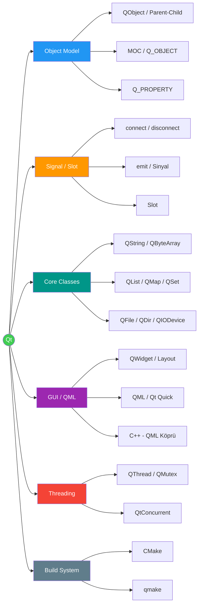
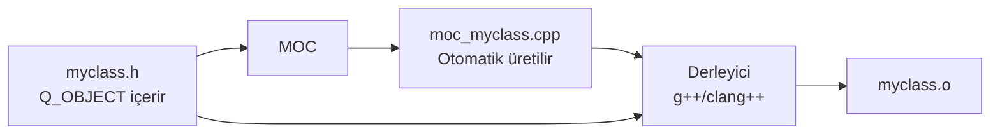
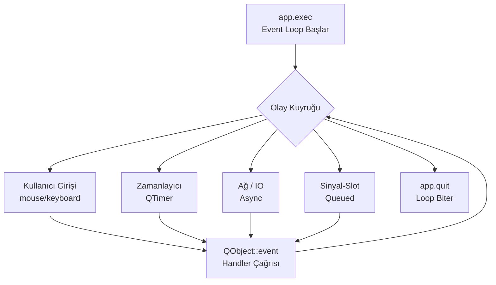
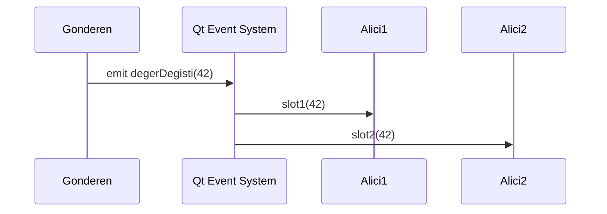

# Qt Framework

!!! note "Genel Bakış"
    Qt, C++ tabanlı, çapraz platform uygulama geliştirme çerçevesidir. Grafik arayüz (Widgets, QML/Quick), ağ, veri tabanı, dosya sistemi ve thread yönetimini kapsayan kapsamlı bir standart kütüphane sunar. **Meta-Object System (MOC)**, C++'ın statik tip sistemini genişleterek çalışma zamanı yansıma, sinyal-slot mekanizması ve dinamik özellik sistemini mümkün kılar.



---

## Qt Object Modeli

### QObject ve Parent-Child Hiyerarşisi

Qt'nin bellek yönetiminin temeli parent-child ilişkisine dayanır: **bir parent silindiğinde tüm child'ları da otomatik silinir.**

```cpp
// Parent verildiğinde Qt belleği yönetir — delete gerekmez
QWidget *pencere = new QWidget(nullptr);         // Root — sahibi yok
QPushButton *buton = new QPushButton("Tamam", pencere);  // Pencere sahibi
QLabel *etiket = new QLabel("Merhaba", pencere);

delete pencere;   // Buton ve etiket de silinir
```

!!! danger "QObject Kopyalanamaz"
    `QObject` ve türetilmiş sınıflar copy constructor ve copy assignment operatörü **silinmiş** olarak tanımlanır. Nesneyi kopyalamak yerine pointer ile taşıyın.

### MOC (Meta-Object Compiler)

MOC, derleme öncesinde Qt uzantılarını (sinyal/slot, özellik sistemi, RTTI) standart C++'a dönüştüren bir ön işlemci aracıdır.



| Makro / Anahtar Kelime | Açıklama |
|------------------------|---------|
| `Q_OBJECT` | Sınıfın MOC tarafından işleneceğini bildirir; sinyal/slot şart |
| `signals:` | Sinyal bildirimleri bölümü |
| `slots:` (veya `public slots:`) | Slot bildirimleri bölümü |
| `emit` | Sinyali tetikler |
| `Q_PROPERTY(...)` | QML ve meta-system ile senkron özellik tanımı |
| `Q_INVOKABLE` | Metodu QML ve `QMetaObject::invokeMethod` ile çağrılabilir yapar |
| `Q_GADGET` | `QObject` mirası olmayan ancak meta-sistem kullanan sınıf |
| `Q_DECLARE_METATYPE` | Tipi signal/slot ve `QVariant` için kaydeder |

```cpp
class Sayac : public QObject {
    Q_OBJECT
    Q_PROPERTY(int deger READ deger WRITE setDeger NOTIFY degerDegisti)

public:
    explicit Sayac(QObject *parent = nullptr) : QObject(parent) {}

    int deger() const { return m_deger; }

    Q_INVOKABLE void sifirla() { setDeger(0); }

public slots:
    void setDeger(int yeni) {
        if (m_deger != yeni) {
            m_deger = yeni;
            emit degerDegisti(m_deger);
        }
    }

signals:
    void degerDegisti(int yeniDeger);

private:
    int m_deger = 0;
};
```

!!! note "m_ Prefix — Member Değişken Konvansiyonu"
    Qt kod stilinde sınıf üye değişkenleri `m_` öneki ile isimlendirilir (ör. `m_deger`). Bu, yerel değişkenlerle karışmayı önler ve getter/setter isimlerinde çakışmayı engeller.

### Q_PROPERTY

```cpp
Q_PROPERTY(type name
    READ getter
    WRITE setter      // İsteğe bağlı
    NOTIFY signal     // QML binding güncelleme için zorunlu
    RESET resetFunc   // İsteğe bağlı — varsayılana döndür
    CONSTANT          // Yazılabilir değil; NOTIFY ile birlikte kullanamaz
)
```

### Event Loop



```cpp
int main(int argc, char *argv[]) {
    QApplication app(argc, argv);

    QWidget pencere;
    pencere.show();

    return app.exec();   // Olay döngüsü başlar; çarpıya basılınca döner
}
```

!!! tip "QCoreApplication vs QGuiApplication vs QApplication"
    | Sınıf | Kullanım |
    |-------|---------|
    | `QCoreApplication` | GUI olmayan; terminal uygulamaları |
    | `QGuiApplication` | Pencere sistemi var; Widget yok (QML) |
    | `QApplication` | Tam Widget desteği |

---

## Logging ve Hata Ayıklama

```cpp
qDebug()    << "Debug:" << deger;     // Geliştirme aşaması
qInfo()     << "Info:"  << mesaj;     // Bilgilendirici
qWarning()  << "Uyarı:" << mesaj;     // Potansiyel sorun
qCritical() << "Kritik:" << hata;     // Kurtarılabilir hata
qFatal("Mesaj");                      // Crash — abort() çağrılır

// Koşullu debug — yalnızca belirli kategori etkinse çalışır
QLoggingCategory network("ag");
qCDebug(network) << "Paket alındı";
```

!!! note "Release Build'de Çıktı"
    `qDebug()` release modunda varsayılan olarak derlenir; performans etkisi olabilir. `QT_NO_DEBUG_OUTPUT` makrosuyla tamamen kaldırılır.

---

## Signal ve Slot Mekanizması

Nesneler arası **gevşek bağlı (loosely coupled)** iletişim; sinyal gönderen, alıcının kim olduğunu bilmez.



### connect() Sözdizimi

=== "Modern (Function Pointer) — Önerilen"
    ```cpp
    // Derleme zamanı doğrulaması — yanlış imza derleyici hatası verir
    connect(slider, &QSlider::valueChanged,
            spinBox, &QSpinBox::setValue);

    // Lambda slot
    connect(buton, &QPushButton::clicked, this, [this]() {
        label->setText("Tıklandı!");
    });
    ```

=== "SIGNAL/SLOT Makrosu — Eski"
    ```cpp
    // Çalışma zamanı doğrulaması — imza hatası derleme geçer, runtime'da uyarı
    connect(slider, SIGNAL(valueChanged(int)),
            spinBox, SLOT(setValue(int)));
    ```

=== "Functor / Lambda (3 parametre)"
    ```cpp
    // Context nesnesi verilmezse: Pencere kapanırsa crash riski!
    connect(buton, &QPushButton::pressed, this, [this]() {
        label->setText("Güvenli lambda");
    });
    // 'this' context olduğunda: this yok edilirse bağlantı otomatik kopar
    ```

| connect() Parametresi | Açıklama |
|-----------------------|---------|
| `sender` | Sinyali gönderen nesne |
| `signal` | `&SınıfAdı::sinyalAdı` |
| `receiver` | Sinyali alacak nesne (lambda için context) |
| `slot` | `&SınıfAdı::slotAdı` veya lambda |
| `Qt::ConnectionType` | `DirectConnection`, `QueuedConnection`, `BlockingQueuedConnection` |

!!! note "Bağlantı Türleri"
    | Tür | Açıklama |
    |-----|---------|
    | `Qt::DirectConnection` | Sinyal ile aynı thread'de anında çağrılır |
    | `Qt::QueuedConnection` | Slot, alıcının event loop'unda çağrılır (thread arası iletişim) |
    | `Qt::AutoConnection` | Aynı thread → Direct; farklı thread → Queued (varsayılan) |
    | `Qt::BlockingQueuedConnection` | QueuedConnection + gönderen thread alıcı bitene kadar bekler |

```cpp
// disconnect — belirli bağlantıyı kes
disconnect(slider, &QSlider::valueChanged, spinBox, &QSpinBox::setValue);

// Nesnenin tüm bağlantılarını kes
disconnect(buton, nullptr, nullptr, nullptr);
```

---

## Core Sınıfları

### QString

Unicode metin (UTF-16) için Qt'nin temel string sınıfı.

```cpp
QString s = "Merhaba";
QString s2("Dünya");
QString s3(10, QChar('*'));  // "**********"

// Sık kullanılan metodlar
s.length();         // Karakter sayısı
s.isEmpty();        // "" → true; isNull() NULL kontrol
s.toUpper();
s.toLower();
s.trimmed();        // Baş/sondaki boşluk kaldırır
s.simplified();     // İç boşlukları da tek boşluğa indirir
s.contains("ab");
s.startsWith("Me");
s.replace("a", "b");
s.split(",");       // QStringList döner
s.left(3);          // İlk 3 karakter
s.mid(2, 4);        // index 2'den 4 karakter
s.indexOf("ha");    // Bulunamazsa -1

// Dönüşümler
int    n = s.toInt();
double d = s.toDouble();
QString::number(42);    // "42"
QString::number(3.14, 'f', 2);  // "3.14"

// String formatlama
QString r = QString("İsim: %1, Yaş: %2").arg("Ali").arg(30);
// "İsim: Ali, Yaş: 30"
```

| QString | std::string |
|---------|------------|
| UTF-16 Unicode | Locale/UTF-8 bağımlı |
| Implicit sharing (COW) | Deep copy |
| Qt API ile tam uyum | STL ile uyum |
| `toStdString()` / `fromStdString()` | Dönüşüm |

### QByteArray

Ham byte dizisi; binary veri, network, serial port için.

```cpp
QByteArray ba = "hello";
ba.append(" world");
ba.size();        // 11
ba.toHex();       // "68656c6c6f20776f726c64"
ba.toBase64();
QByteArray::fromHex("deadbeef");

// QString ↔ QByteArray
QString s = "Merhaba";
QByteArray utf8 = s.toUtf8();
QString geri = QString::fromUtf8(utf8);
```

### QVariant

Herhangi bir Qt veya kullanıcı tanımlı tipi taşıyan dinamik tip kabı. C++/QML arası veri aktarımında kritik rol oynar.

```cpp
QVariant v(42);
QVariant v2("metin");
QVariant v3(3.14);

qDebug() << v.type();          // QVariant::Int
qDebug() << v.toInt();         // 42
qDebug() << v2.toString();     // "metin"

// Özel tip kayıt
struct Nokta { int x, y; };
Q_DECLARE_METATYPE(Nokta)

QVariant vn = QVariant::fromValue(Nokta{3, 4});
Nokta n = vn.value<Nokta>();
```

!!! note "..View Sınıfları"
    `QByteArrayView`, `QStringView` gibi `..View` ile biten sınıflar sahip olmadan salt okunur bakış sağlar. Kopyalama maliyeti sıfır; ancak kaynak verinin ömrüne bağımlıdır.

### QChar

Unicode tek karakter.

```cpp
QChar c('A');
c.toLower();     // 'a'
c.toUpper();     // 'A'
c.isLetter();
c.isDigit();
c.isSpace();
c.unicode();     // Unicode code point
```

---

## Koleksiyonlar

Qt koleksiyonları **implicit sharing (copy-on-write)** kullanır: atama ucuzdur; değişiklik olduğunda derin kopya yapılır.

### QList / QVector

Qt 6'da `QList` ve `QVector` birleştirildi; her ikisi de aynı dinamik dizi sınıfına işaret eder.

```cpp
QList<int> liste = {1, 2, 3};
liste.append(4);         // veya liste << 4
liste.insert(1, 99);     // index 1'e ekle
liste.removeAt(1);       // index 1'i sil
liste.removeFirst();
liste.removeLast();
liste.at(0);             // index 0; sınır dışı → crash
liste.value(10, -1);     // Güvenli; bulunamazsa -1
liste.size();
liste.contains(3);
liste.indexOf(3);
liste.first() / liste.last();
std::sort(liste.begin(), liste.end());

// Başlangıç değerli
QList<QString> kelimeler(10, "deneme");  // 10 tane "deneme"
```

### QStringList

`QList<QString>` için özelleştirilmiş; ek string işleme metodları içerir.

```cpp
QStringList liste = {"elma", "armut", "kiraz"};
liste.join(", ");           // "elma, armut, kiraz"
liste.filter("ar");         // ["armut"]
liste.contains("elma");     // true (case-sensitive)
liste.sort();
QString str = "a,b,c";
QStringList parcalar = str.split(",");  // ["a","b","c"]
```

### QMap / QHash

| | `QMap` | `QHash` |
|--|:------:|:-------:|
| Veri yapısı | Red-Black Tree | Hash Table |
| Sıralama | Anahtar sırasına göre | Sırasız |
| Arama | O(log N) | Ortalama O(1) |
| Key şartı | `<` operatörü | `qHash()` + `==` |

```cpp
QMap<QString, int> yaslar;
yaslar.insert("Ahmet", 25);
yaslar["Mehmet"] = 30;
yaslar.value("Ahmet", 0);    // Güvenli; 0 varsayılan
yaslar.contains("Ali");
yaslar.remove("Ahmet");

for (auto it = yaslar.begin(); it != yaslar.end(); ++it)
    qDebug() << it.key() << ":" << it.value();

// C++17 range-based
for (const auto &[key, value] : yaslar.asKeyValueRange())
    qDebug() << key << value;
```

### QSet

Benzersiz elemanlar; ortalama O(1) arama.

```cpp
QSet<int> kume = {1, 2, 3};
kume.insert(4);
kume.remove(2);
kume.contains(3);  // true

QSet<int> diger = {3, 4, 5};
kume.intersect(diger);  // {3, 4}
kume.unite(diger);      // {1, 3, 4, 5}
kume.subtract(diger);   // {1}
```

### Akıllı İşaretçiler

| Qt Pointer | C++ Karşılığı | Açıklama |
|------------|:-------------:|---------|
| `QScopedPointer<T>` | `unique_ptr<T>` | Scope bitince otomatik sil; kopyalanamaz |
| `QSharedPointer<T>` | `shared_ptr<T>` | Ref-counted; paylaşımlı sahiplik |
| `QWeakPointer<T>` | `weak_ptr<T>` | Döngüsel bağımlılığı kırar |
| `QPointer<T>` | — | Nesne silinirse otomatik `nullptr` olur |

!!! note "Parent-Child veya Smart Pointer?"
    Qt parent mekanizması varsa genellikle ham pointer yeterlidir — parent silinince child silinir. Parent yoksa `QScopedPointer` veya `QSharedPointer` tercih edilir.

---

## IO ve Dosya İşlemleri

### QFile ve QTextStream

```cpp
// Yazma
QFile dosya("veri.txt");
if (dosya.open(QIODevice::WriteOnly | QIODevice::Text)) {
    QTextStream akis(&dosya);
    akis << "Merhaba Qt!\n";
    akis << "Satır 2\n";
    dosya.close();
}

// Okuma
if (dosya.open(QIODevice::ReadOnly | QIODevice::Text)) {
    QTextStream akis(&dosya);
    akis.setEncoding(QStringConverter::Utf8);
    while (!akis.atEnd()) {
        QString satir = akis.readLine();
        qDebug() << satir;
    }
}
```

### QDataStream — Binary Serileştirme

```cpp
// Yazma
QFile f("veri.dat");
f.open(QIODevice::WriteOnly);
QDataStream ds(&f);
ds << QString("Ahmet") << int(25) << double(75.5);

// Okuma
f.open(QIODevice::ReadOnly);
QDataStream ds2(&f);
QString isim; int yas; double kilo;
ds2 >> isim >> yas >> kilo;
```

!!! note "QDataStream Platform Bağımsızlığı"
    `QDataStream` big-endian byte sırasını kullanır; farklı mimarilerde (ARM, x86) yazılan veri doğru okunur. Raw `memcpy` çözümlerinin aksine taşınabilir.

### QDir

```cpp
QDir d("/home/user/belgeler");
d.exists();
d.mkdir("yeni_klasor");
d.cdUp();          // Bir üst dizin
d.cd("alt/dizin");

// Dosya listeleme
QStringList dosyalar = d.entryList({"*.txt"}, QDir::Files);
for (const QString &ad : dosyalar)
    qDebug() << d.filePath(ad);
```

### QFileInfo

```cpp
QFileInfo bilgi("/home/user/belge.pdf");
bilgi.exists();
bilgi.isFile();
bilgi.isDir();
bilgi.fileName();   // "belge.pdf"
bilgi.baseName();   // "belge"
bilgi.suffix();     // "pdf"
bilgi.size();       // Byte cinsinden
bilgi.absolutePath();
bilgi.lastModified();
```

### QSettings — Yapılandırma Saklama

```cpp
QSettings ayarlar("SirketAdi", "UygulamaAdi");

// Yazma
ayarlar.setValue("pencere/genislik", 800);
ayarlar.setValue("dil", "tr");

// Okuma
int genislik = ayarlar.value("pencere/genislik", 1024).toInt();
QString dil  = ayarlar.value("dil", "en").toString();
```

!!! note "QSettings Depolama"
    Windows → Registry, macOS → `.plist`, Linux → `~/.config/SirketAdi/UygulamaAdi.ini` (varsayılan)

---

## GUI — Widget Uygulamaları

### Layout Sistemi

```cpp
QWidget *ana = new QWidget;

// Yatay
QHBoxLayout *yatay = new QHBoxLayout;
yatay->addWidget(new QLabel("İsim:"));
yatay->addWidget(new QLineEdit);

// Dikey
QVBoxLayout *dikey = new QVBoxLayout(ana);  // Parent = ana widget
dikey->addLayout(yatay);
dikey->addWidget(new QPushButton("Tamam"));
dikey->addStretch();  // Boşluğu doldur

// Grid
QGridLayout *grid = new QGridLayout;
grid->addWidget(label1, 0, 0);   // satır 0, sütun 0
grid->addWidget(input1, 0, 1);   // satır 0, sütun 1
grid->addWidget(label2, 1, 0);
grid->addWidget(input2, 1, 1, 1, 2);  // 1 satır, 2 sütun span
```

### Sık Kullanılan Widget'lar

| Widget | Açıklama |
|--------|---------|
| `QPushButton` | Tıklanabilir buton; `clicked()` sinyali |
| `QLabel` | Metin veya resim; HTML destekler |
| `QLineEdit` | Tek satır metin girişi |
| `QTextEdit` | Çok satır zengin metin |
| `QComboBox` | Açılır liste |
| `QCheckBox` | Onay kutusu |
| `QRadioButton` | Seçim düğmesi |
| `QSlider` / `QDial` | Değer kaydırıcı |
| `QSpinBox` | Artış/azalış sayı girişi |
| `QListView` / `QTreeView` | Model-View ile veri gösterimi |
| `QTableWidget` | Basit tablo |
| `QDialog` | Modal/modeless diyalog |
| `QMessageBox` | Bilgi/uyarı/soru/hata mesaj kutusu |
| `QTimer` | Zamanlayıcı; `timeout()` sinyali |

```cpp
// QLabel — HTML destekli
QLabel *etiket = new QLabel("<b>Kalın</b> ve <i>italik</i>");
etiket->setFont(QFont("Arial", 14, QFont::Bold));

// QMessageBox
int cevap = QMessageBox::question(this, "Çıkış",
    "Çıkmak istediğinizden emin misiniz?",
    QMessageBox::Yes | QMessageBox::No);

if (cevap == QMessageBox::Yes) close();

// QTimer
QTimer *zamanlayici = new QTimer(this);
connect(zamanlayici, &QTimer::timeout, this, &MyWidget::guncelle);
zamanlayici->start(1000);   // Her 1000 ms'de bir
```

---

## Threading

### QThread

```cpp
// Yöntem 1: Worker object (önerilen)
class Isci : public QObject {
    Q_OBJECT
public slots:
    void calis() {
        for (int i = 0; i < 100; ++i) {
            emit ilerledi(i);
            QThread::msleep(50);
        }
        emit bitti();
    }
signals:
    void ilerledi(int yuzde);
    void bitti();
};

// Ana thread
QThread *thread = new QThread(this);
Isci *isci = new Isci;
isci->moveToThread(thread);  // İşçiyi thread'e taşı

connect(thread, &QThread::started, isci, &Isci::calis);
connect(isci, &Isci::bitti,  thread, &QThread::quit);
connect(isci, &Isci::bitti,  isci,   &QObject::deleteLater);
connect(thread, &QThread::finished, thread, &QObject::deleteLater);

thread->start();
```

!!! danger "moveToThread Sonrası GUI Değişikliği Yapma"
    GUI nesneleri (`QWidget` türevleri) yalnızca ana thread'den değiştirilebilir. Worker thread'den GUI güncellemek için sinyal-slot (Queued bağlantı) kullanın; doğrudan çağrı Undefined Behavior'dır.

### QMutex ve Senkronizasyon

```cpp
QMutex mutex;
int paylasilan = 0;

// Thread A
{
    QMutexLocker kilit(&mutex);  // RAII — scope bitince unlock
    paylasilan++;
}

// QReadWriteLock — çok okuyucu / tek yazıcı
QReadWriteLock rwLock;

// Okuyucu
QReadLocker r(&rwLock);
int v = paylasilan;

// Yazıcı
QWriteLocker w(&rwLock);
paylasilan = 42;
```

### QtConcurrent

Basit paralel işlemler için yüksek seviyeli API.

```cpp
#include <QtConcurrent>

// Paralel map
QList<int> sayilar = {1, 2, 3, 4, 5};
QFuture<int> sonuc = QtConcurrent::mapped(sayilar, [](int x) {
    return x * x;
});
sonuc.waitForFinished();
QList<int> kareler = sonuc.results();  // [1, 4, 9, 16, 25]

// Arka planda tek görev
QFuture<void> gorev = QtConcurrent::run([this]() {
    agirHesapla();
});

// QFutureWatcher ile UI güncellemesi
QFutureWatcher<void> *watcher = new QFutureWatcher<void>(this);
connect(watcher, &QFutureWatcher<void>::finished, this, [this]() {
    ui->label->setText("Tamamlandı!");
});
watcher->setFuture(gorev);
```

---

## QML ve C++ Entegrasyonu

### C++ Nesnesini QML'e Açma

=== "setContextProperty (Eski Yol)"
    ```cpp
    // main.cpp
    Sayac *sayac = new Sayac(&engine);
    engine.rootContext()->setContextProperty("_sayac", sayac);
    ```
    ```qml
    // main.qml
    Text { text: _sayac.deger.toString() }
    Button { onClicked: _sayac.sifirla() }
    ```

=== "qmlRegisterType (Qt 5)"
    ```cpp
    qmlRegisterType<Sayac>("com.ornek", 1, 0, "Sayac");
    ```
    ```qml
    import com.ornek 1.0
    Sayac { id: sayac }
    ```

=== "QML_ELEMENT Makrosu (Qt 6 — Önerilen)"
    ```cpp
    class Sayac : public QObject {
        Q_OBJECT
        QML_ELEMENT   // CMakeLists'teki qt_add_qml_module ile otomatik kayıt
        Q_PROPERTY(int deger READ deger NOTIFY degerDegisti)
        ...
    };
    ```
    ```qml
    import com.ornek.modul
    Sayac { id: sayac }
    ```

### QML Kayıt Fonksiyonları

| Fonksiyon | Açıklama |
|-----------|---------|
| `qmlRegisterType<T>(uri, major, minor, name)` | QML'de new ile oluşturulabilir tip |
| `qmlRegisterSingletonInstance(uri, major, minor, name, ptr)` | Singleton — QML'de global erişim |
| `qmlRegisterUncreatableType<T>(...)` | QML'de örneklenemez; yalnızca enum/property erişimi |
| `qRegisterMetaType<T>()` | Signal/slot ve QVariant için tip kaydı |
| `Q_DECLARE_METATYPE(T)` | `qRegisterMetaType` öncesi şablon özelleştirme |

### Q_INVOKABLE ve Sinyaller QML'den

```cpp
class Hesap : public QObject {
    Q_OBJECT
public:
    Q_INVOKABLE double topla(double a, double b) { return a + b; }
    Q_INVOKABLE void kaydet(const QString &dosya);

signals:
    void kaydedildi(bool basarili);
};
```

```qml
Button {
    onClicked: {
        var sonuc = hesap.topla(3.5, 2.5)   // C++ metodu
        console.log(sonuc)                   // 6
    }
}

Connections {
    target: hesap
    function onKaydedildi(basarili) {
        statusBar.text = basarili ? "Kaydedildi" : "Hata"
    }
}
```

### QVariant — C++/QML Veri Köprüsü

```cpp
// C++ tarafı
Q_INVOKABLE QVariantList veriGetir() {
    return QVariantList{ QVariantMap{{"isim","Ali"},{"yas",30}},
                          QVariantMap{{"isim","Veli"},{"yas",25}} };
}
```

```qml
// QML tarafı
ListView {
    model: backend.veriGetir()
    delegate: Text { text: modelData["isim"] + " " + modelData["yas"] }
}
```

---

## Build Sistemi

### CMake (Qt 6 — Önerilen)

```cmake
cmake_minimum_required(VERSION 3.16)
project(UygulamaBenim VERSION 1.0 LANGUAGES CXX)

set(CMAKE_CXX_STANDARD 17)
set(CMAKE_AUTOMOC ON)    # MOC otomatik çalışır
set(CMAKE_AUTORCC ON)    # .qrc kaynakları otomatik
set(CMAKE_AUTOUIC ON)    # .ui dosyaları otomatik

find_package(Qt6 REQUIRED COMPONENTS Core Gui Widgets Quick)

qt_add_executable(UygulamaBenim
    main.cpp
    mainwindow.cpp
    mainwindow.h
)

# QML Modülü
qt_add_qml_module(UygulamaBenim
    URI com.ornek.modul
    VERSION 1.0
    QML_FILES
        qml/Main.qml
        qml/Ekran.qml
    SOURCES
        backend.h backend.cpp   # QML_ELEMENT içerenleri burada yaz
)

target_link_libraries(UygulamaBenim PRIVATE
    Qt6::Core Qt6::Gui Qt6::Widgets Qt6::Quick)
```

### Kaynak Dosyaları (.qrc)

```xml
<!-- resources.qrc -->
<RCC>
    <qresource prefix="/resimler">
        <file>logo.png</file>
        <file>arkaplan.jpg</file>
    </qresource>
    <qresource prefix="/qml">
        <file>Main.qml</file>
    </qresource>
</RCC>
```

```cpp
// C++ içinde kullanım
QIcon ikon(":/resimler/logo.png");
QFile f(":/qml/Main.qml");
```

### CMake Ekstra Paketler

```cmake
find_package(Qt6 REQUIRED COMPONENTS
    Core Gui Widgets Quick QuickControls2
    Network Sql Bluetooth SerialPort Concurrent
    Test  # Birim test için
)
```

| Qt Modülü | İçerik |
|-----------|--------|
| `Qt6::Core` | QObject, QString, QList, QFile vb. |
| `Qt6::Gui` | QFont, QColor, QPainter, QImage |
| `Qt6::Widgets` | QPushButton, QDialog, QLayout |
| `Qt6::Quick` | QML engine, QQuickView |
| `Qt6::QuickControls2` | Material, Fluent gibi QML bileşen setleri |
| `Qt6::Network` | QNetworkAccessManager, QTcpSocket |
| `Qt6::Sql` | QSqlDatabase, QSqlQuery |
| `Qt6::SerialPort` | QSerialPort — gömülü/donanım haberleşmesi |
| `Qt6::Concurrent` | QtConcurrent — paralel işleme |
| `Qt6::Bluetooth` | QBluetoothSocket, LE |

---

## Qt Tip Sistemi

```cpp
// Platform bağımsız sabit boyutlu tam sayılar
qint8   // 8-bit işaretli
quint8  // 8-bit işaretsiz
qint16 / quint16
qint32 / quint32
qint64 / quint64
qintptr // Pointer boyutunda (32/64-bit otomatik)
qreal   // double (veya float — Qt konfigürasyona bağlı)
```

!!! tip "qDebug() Operatörü Genişletme"
    Kendi sınıfınız için `QDebug` çıktısı tanımlamak:
    ```cpp
    struct Nokta { int x, y; };

    QDebug operator<<(QDebug dbg, const Nokta &n) {
        return dbg << "Nokta(" << n.x << "," << n.y << ")";
    }

    qDebug() << Nokta{3, 4};  // Nokta(3,4)
    ```