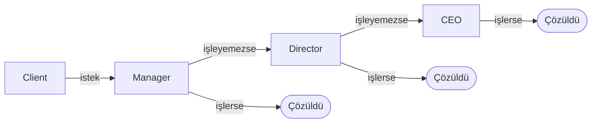

# Software Design

## SOLID

**SOLID**, sürdürülebilir, genişletilebilir ve esnek yazılımlar geliştirmek için kullanılan beş temel nesne yönelimli tasarım (Object-Oriented Design) prensibinin baş harflerinden oluşan bir kısaltmadır. Kodun zamanla hantallaşmasını, kırılgan hale gelmesini ve **"spagetti koda"** dönüşmesini engeller.


- **Single Responsibility Principle (SRP):** Bir Class veya modülün değişmek için yalnızca tek bir nedeni olmalıdır. Yani bir yapı, sadece tek bir işten sorumlu olmalıdır.

- **Open/Closed Principle (OCP):** Sınıflar **genişletmeye açık, değiştirmeye kapalı** olmalıdır. Yeni davranış eklemek mevcut, test edilmiş koda dokunmayı gerektirmemelidir. `if/else` veya `switch` ile tür kontrolü yapıldığında her yeni tür bu bloğu değiştirmeyi zorunlu kılar. Polimorfizm ile yeni tür yeni bir sınıf olarak eklenir; var olan kod değişmez.

- **Liskov Substitution Principle (LSP):** Alt sınıflar (türetilen sınıflar), miras aldıkları üst sınıfların (ata sınıflar) yerine kullanılabilmeli ve bu durum programın davranışını bozmamalıdır.

- **Interface Segregation Principle (ISP):** Sınıflar, kullanmadıkları metotları barındıran Interface implemente etmeye zorlanmamalıdır. Çok amaçlı tek bir arayüz yerine, amaca yönelik özelleştirilmiş birden fazla arayüz tercih edilmelidir

- **Dependency Inversion Principle (DIP):** Yüksek seviyeli modüller (iş mantığı taşıyanlar), düşük seviyeli modülleri (veri tabanı, loglama gibi araçlar) doğrudan referans almamalıdır. Her iki modül de soyutlamalara (Abstraction) bağımlı olmalıdır. Soyutlamalar detaylara değil, detaylar soyutlamalara bağımlı olmalıdır.

---

## Design Pattern

!!! abstract "Tanım"
    Yazılımda sık karşılaşılan tasarım sorunlarına karşı geliştirilmiş, denenmiş çözüm kalıplarıdır. Hazır kod değil; belirli bir durumda uygulanabilecek bir **düşünce biçimidir**. Üç ana gruba ayrılır:

    - **Creational (Oluşturucu):** Nesnenin nasıl ve ne zaman oluşturulacağını belirler. Oluşturma mantığını iş mantığından ayırır.
    - **Structural (Yapısal):** Sınıfların ve nesnelerin birbirine nasıl bağlandığını düzenler. Uyumsuz parçaları birleştirir, karmaşık yapıları sadeleştirir.
    - **Behavioral (Davranışsal):** Nesneler arasındaki iletişimi ve sorumlulukların dağılımını yönetir. Kim ne yapmalı, kim kimi bilmeli sorularına yanıt verir.

## Creational

### Factory Method

!!! abstract "Tanım"
    Nesne oluşturma kararını alt sınıflara bırakır. Üst sınıf yalnızca nesne oluştur der ne oluşacağına alt sınıf karar verir. Bu sayede genişletme, mevcut kodu değiştirmek yerine yeni sınıf yazmak anlamına gelir.

```cpp
/** 
 * `AirLogistics : Logistics` eklemek için yalnızca yeni bir sınıf yazarsın
 * `plan()` metoduna ya da mevcut Creator sınıflarına dokunmazsın.
*/
class Transport {
public:
    virtual void deliver() = 0;
    virtual ~Transport() = default;
};

class Truck : public Transport { void deliver() override { std::cout << "Kara\n"; } };
class Ship  : public Transport { void deliver() override { std::cout << "Deniz\n"; } };

class Logistics {
public:
    virtual std::unique_ptr<Transport> create() = 0;
    void plan() { create()->deliver(); } // türü bilmez, sadece kullanır
    virtual ~Logistics() = default;
};

class RLogistics : public Logistics { std::unique_ptr<Transport> create() override { return std::make_unique<Truck>(); } };

class SLogistics : public Logistics { std::unique_ptr<Transport> create() override { return std::make_unique<Ship>(); } };

std::unique_ptr<Logistics> l = std::make_unique<RLogistics>();
l->plan(); // Kara

l = std::make_unique<SLogistics>();
l->plan(); // Deniz - plan() hiç değişmedi
```
 
### Abstract Factory

!!! abstract "Tanım"
    Birbiriyle uyumlu nesne aileleri üretir; yanlış kombinasyonu derleme zamanında engeller. Tek nesne değil, birlikte çalışması gereken birden fazla nesne gerektiğinde ayrı ayrı oluşturmak yanlış kombinasyona yol açar. Factory Method tek bir ürün üretir; Abstract Factory uyumlu bir *aile* üretir.

    **Ne Zaman Kullanılır?**

    - Bir platform veya tema kavramıyla birden fazla nesne birlikte değişmeli
    - Yanlış kombinasyonları derleme zamanında önlemek istiyorsun
    - İstemci kodu değişmeden sadece hangi ailenin kullanıldığı değişiyor


```cpp
class Button { public: virtual void render() = 0; virtual ~Button() = default; };
class Menu   { public: virtual void show()   = 0; virtual ~Menu()   = default; };

class DesktopButton  : public Button { void render() override { std::cout << "Desktop buton\n"; } };
class DesktopMenu    : public Menu   { void show()   override { std::cout << "Desktop menü\n"; } };
class EmbeddedButton : public Button { void render() override { std::cout << "Embedded buton\n"; } };
class EmbeddedMenu   : public Menu   { void show()   override { std::cout << "Embedded menü\n"; } };

class UIFactory {
public:
    virtual std::unique_ptr<Button> createButton() = 0;
    virtual std::unique_ptr<Menu>   createMenu()   = 0;
    virtual ~UIFactory() = default;
};
class DesktopFactory : public UIFactory {
    std::unique_ptr<Button> createButton() override { return std::make_unique<DesktopButton>(); }
    std::unique_ptr<Menu>   createMenu()   override { return std::make_unique<DesktopMenu>(); }
};
class EmbeddedFactory : public UIFactory {
    std::unique_ptr<Button> createButton() override { return std::make_unique<EmbeddedButton>(); }
    std::unique_ptr<Menu>   createMenu()   override { return std::make_unique<EmbeddedMenu>(); }
};

// İstemci - hangi fabrika gelirse aynı kod çalışır; yanlış kombinasyon mümkün değil
void buildUI(UIFactory& f) {
    f.createButton()->render();
    f.createMenu()->show();
}

DesktopFactory  desktop;  buildUI(desktop);   // Desktop buton + Desktop menü
EmbeddedFactory embedded; buildUI(embedded);  // Embedded buton + Embedded menü
```

### Builder

!!! abstract "Tanım"
    karmaşık nesnelerin adım adım inşa edilmesini (step-by-step construction) sağlayan Creational (Yaratımsal) bir tasarım desenidir. `new Car(red, 4, true, false, null, "sport", 2.0)` gibi çok parametreli yapıcılar okunaksız hale gelir. Builder her adımı açık isimli bir metodla tanımlar; yalnızca gereken adımlar çağrılır, geri kalanlar varsayılan değerde kalır.

    **Ne Zaman Kullanılır?**
    - 4'ten fazla parametreli yapıcı varsa
    - Opsiyonel parametreler çoksa
    - Aynı nesnenin birden fazla varyantı inşa edilecekse


```cpp
// KÖTÜ PRATİK: Parametre sayısı arttıkça anlaşılmaz olur
Drone drone(6, true, true, false, "");

// BUILDER: Her adım isimlendirilmiş, sadece gereken adımlar çağrılır
auto drone = Drone::builder().setMotors(6)
                 .useEtherCAT().addImu().build();
```

### Prototype

!!! abstract "Tanım"
    Sıfırdan oluşturmak yerine var olan nesneyi kopyalar. Nesne oluşturması pahalı olduğunda, veritabanı sorgusu, ağ çağrısı, ağır hesaplama, klonlamak çok daha hızlıdır. Kopya, hazır kurulmuş nesneyi alır; yalnızca farklı parametreler güncellenir.

    **Ne Zaman Kullanılır?**

    - Nesne oluşturma maliyeti yüksekse (deep copy maliyeti yüksekse bu durumda uygulanmaz)
    - Küçük farklılıklarla çok sayıda benzer nesne üretilecekse
    - Nesnenin sınıfını bilmeden kopyası gerekiyorsa


```cpp
class Sensor {
protected:
    double freq;
    std::vector<double> calib; // pahalı kurulum verisi
public:
    Sensor(double f, std::vector<double> cal): freq(f), calib(std::move(cal)) {}
    virtual ~Sensor() = default;

    virtual std::unique_ptr<Sensor> clone() const = 0;
    virtual void report() const {std::cout << freq << " Hz, " << calib.size() << " kalibrasyon noktası\n"; }

    void setFreq(double f) { freq = f; }

};

class TemperatureSensor : public Sensor {
public:
    TemperatureSensor(double f, std::vector<double> cal): Sensor(f, std::move(cal)) {}
    std::unique_ptr<Sensor> clone() const override {
        return std::make_unique<TemperatureSensor>(*this); // deep copy
    }
};


TemperatureSensor base(100.0, {0.1, 0.2, 0.3, 0.4, 0.5}); // bir kez pahalı kurulum

auto s1 = base.clone();       // hızlı kopyalama
s1->setFreq(200.0);      // sadece bu klonda değişir

base.report(); // 100 Hz, 5 kalibrasyon noktası
s1->report();  // 200 Hz, 5 kalibrasyon noktası
```

!!! warning "Deep Copy vs Shallow Copy"
    - **Shallow copy:** iç nesnelerin referanslarını kopyalar. Bir kopyada değişim diğerini de etkiler. 
    - **Deep copy:** tüm iç yapıyı ayrı kopyalar. C++'da kopya yapıcı yazarak derin kopyalama garantilenir.

### Singleton

!!! abstract "Tanım"
    Bir sınıfın runtime yalnızca tek bir örneğinin (instance) olmasını garanti altına alan ve bu örneğe global access point sağlayan tasarım desenidir.

!!! danger "Ciddi Tuzaklar"
    - **Test edilemezlik:** Global durum yarattığı için testlerde izole etmek zordur; bir testin değiştirdiği state başkasını etkiler
    - **Gizli bağımlılık:** Bağımlılıklar yapıcıdan değil sınıf içinden alınır
    - Çoğu durumda bağımlılık enjeksiyonu daha temiz çözümdür


```cpp
class Logger {
    Logger() = default; // private

public:
    Logger(const Logger&) = delete; Logger& operator=(const Logger&) = delete;

    static Logger& getInstance() {
        static Logger instance; // C++11: thread-safe garantili
        return instance;
    }

    void log(const std::string& msg) { std::cout << "[LOG] " << msg << "\n"; }
};

Logger::getInstance().log("Sistem başlatıldı");
Logger::getInstance().log("Bağlantı kuruldu");
```

## Structural

### Adapter

!!! abstract "Tanım"
    Birbiriyle uyumsuz arayüzlere sahip iki farklı sınıfın birlikte çalışabilmesini tasarım desenidir.


### Bridge

!!! abstract "Tanım"
    Bir sınıfın soyutlama (Abstraction) katmanı ile bu soyutlamanın arka plandaki gerçek işi yapan implementation katmanını birbirinden ayıran ve ikisinin bağımsız olarak genişlemesini sağlayan tasarım desenidir.


!!! note "Bridge ile Farkı"
    **Adapter:** Genellikle projenin ilerleyen aşamalarında veya bakım sürecinde kullanılır. Birbiriyle hiç alakası olmayan, uyumsuz iki eski/yeni sistemi sonradan "yamamak" ve birlikte çalıştırmak için tercih edilir.

    **Bridge:** Projenin en başında, tasarım aşamasında bilinçli olarak tasarlanır. Amaç, bir yapının ara yüzü ile o yapının platforma veya donanıma bağımlı kodlarını birbirinden baştan izole etmektir.


### Composite

!!! abstract "Tanım"
    Tekil nesneleri ve nesne gruplarını aynı arayüzle kullanmayı sağlar. Dosya sistemi veya arayüz hiyerarşisi gibi ağaç yapılarında istemcinin "bu yaprak mı, grup mu?" diye sorgulamadan aynı işlemi yapabilmesi gerekir. Her şey aynı arayüzü uyguladığında istemci ikisini ayırt etmek zorunda kalmaz.
    
---

### Decorator

!!! abstract "Tanım"
    Nesneye çalışma zamanında yeni davranış ekler; kalıtım kullanmaz. Davranış kombinasyonları için alt sınıf açmak sınıf patlamasına yol açar: şifreli, sıkıştırılmış, şifreli+sıkıştırılmış, ikisi de yok 4 ayrı sınıf. Decorator, sarılan nesneyle aynı arayüzü uygular; `send()` çağrıldığında kendi davranışını ekleyerek zincirin geri kalanına aktarır.

    **Ne Zaman Kullanılır?**

    - Çalışma zamanında dinamik davranış eklenip çıkarılması gerektiğinde
    - Çok sayıda bağımsız özellik kombine edilebilecekse
    - Alt sınıf açmak sınıf sayısını patlatacaksa

    **Ne Zaman Kullanılmaz**

    - Davranış kombinasyonları sabitse — kalıtım daha basit ve okunabilir
    - Decorator zinciri çok derinleşirse — hata ayıklamak zorlaşır


!!! note "Kalıtıma Karşı"
    Kalıtım derleme zamanında sabittir. Decorator çalışma zamanında esnektir ve kombine edilebilir.

---

### Facade

!!! abstract "Tanım"
    Karmaşık alt sistemin önüne sade bir yüz koyar. Bir alt sistem birden fazla sınıftan oluşuyorsa ve kullanmak için belirli sırayla başlatılıp çağrılması gerekiyorsa bu karmaşıklığı gizler. İstemci tek sade bir metod görür; alt sisteme doğrudan erişim kapanmaz, sadece kolaylaşır.

    **Ne Zaman Kullanılır?**

    - Karmaşık kütüphane veya çatıya basit giriş noktası sağlamak istediğinde
    - Alt sistem bağımlılıklarını istemciden gizlemek istediğinde
    - Katmanlı mimaride katmanlar arası erişimi tek noktadan yönetmek için

    **Ne Zaman Kullanılmaz**

    - Alt sistem zaten basitse — Facade gereksiz bir sarmalayıcı katmanı ekler
    - Facade zamanla tüm mantığı üstlenirse — bu noktada God Object'e dönüşür
    
---

### Flyweight

!!! abstract "Tanım"
    Çok sayıda benzer nesnenin ortak verilerini paylaştırır; belleği boşa harcamaz. Binlerce benzer nesne oluşturuluyorsa ve her biri aynı büyük verinin kopyasını taşıyorsa bellek tükenir. Flyweight, değişmez paylaşılan veriyi (*intrinsic*) bir kez tutar; her nesneye özgü veri (*extrinsic*) dışarıdan geçirilir, içinde saklanmaz.

    **Ne Zaman Kullanılır?**

    - Çok sayıda benzer nesne oluşturulacak ve bellek kritikse
    - Nesnenin büyük kısmı paylaşılabilir durumdan oluşuyorsa
    - Oyun motorları, grafik sistemleri, metin işleme motorları

    **Ne Zaman Kullanılmaz**

    - Nesne sayısı gerçekten büyük değilse — eklenen karmaşıklık faydasızdır
    - Nesnelerin büyük çoğunluğu kendine özgü veriye sahipse — paylaşılacak çok az şey kalır


!!! danger "Dikkat"
    Extrinsic durumu yönetmek karmaşıklaşır. Nesne sayısı gerçekten büyük değilse eklenen karmaşıklık faydasızdır - önce profil et.

---

### Proxy

!!! abstract "Tanım"
    Başka bir nesneye erişimi kontrol eden vekil nesnedir. Bir nesneye erişmeden önce ek kontrol (yetki, önbellekleme, gecikmeli yükleme) eklemek istediğinde bunu nesnenin kendisine koymak Tek Sorumluluk İlkesi'ni ihlal eder. Proxy, gerçek nesneyle aynı arayüzü uygular; istemci farkı görmez.

    | Tür | Amaç |
    |-----|------|
    | **Virtual Proxy** | Pahalı nesneyi gerçekten gerektiğinde oluştur |
    | **Protection Proxy** | Kim neyi görebilir/yapabilir |
    | **Caching Proxy** | Aynı sonucu tekrar hesaplama |
    | **Remote Proxy** | Uzak nesneye yerel arayüzden eriş |

    **Ne Zaman Kullanılır?**

    - Pahalı nesnenin gecikmeli başlatılması gerekiyorsa (Virtual)
    - Nesneyi değiştirmeden erişim kontrolü eklemek istiyorsan (Protection)
    - Ağ çağrıları veya hesaplamalar önbelleğe alınacaksa (Caching)

    **Ne Zaman Kullanılmaz**

    - Erişim kontrolüne veya gecikmeli yüklemeye ihtiyaç yoksa — doğrudan kullanım daha sade
    - Proxy katmanı performans açısından kritik bir yolda ek gecikme yaratıyorsa

---

## Behavioral 

### Chain of Responsibility

!!! abstract "Tanım"
    İsteği bir zincir boyunca iletir; kimin işleyeceğini başlatıcı bilmek zorunda değildir. Bir isteği birden fazla nesne işleyebilir ama hangisinin devreye gireceği önceden belli değildir. İstemciye "bu durumda A'ya git, şunda B'ye git" yazmak kodu kırılgan kılar. Her halka isteği karşılayamazsa bir sonrakine iletir.

    **Ne Zaman Kullanılır?**
    - İşleyici kümesi çalışma zamanında dinamik değişebiliyorsa
    - İsteğin birden fazla işleyiciden sırayla geçmesi gerekiyorsa

    **Ne Zaman Kullanılmaz**
    - Her isteğin mutlaka işlenmesi garanti edilmesi gerekiyorsa — zincir sonuna kadar hiçbir halka devreye girmeyebilir
    - İşleyici sayısı küçük ve sabitse — basit koşullu ifade daha anlaşılır

!!! example "Middleware Pipeline"
    Web çatılarında istek sırayla kimlik doğrulama → yetkilendirme → hız sınırlama → kayıt katmanlarından geçer. Her katman isteği işler veya reddeder; reddedilmezse iletilir.

!!! danger "Dikkat"
    Zincir sonuna kadar hiçbir işleyici devreye girmezse istek yanıtsız kalır - zincir sonunda varsayılan bir işleyici tanımla.



---

### Command

!!! abstract "Tanım"
    Bir eylemi nesne olarak kapsüller; sakla, kuyruğa al, geri al. İşlemi tetikleyen (buton, zamanlayıcı, tuş kısayolu) ile gerçekleştiren arasındaki bağımlılığı keser ya da "geri al" (undo) ihtiyacını karşılar. Command, işlemi ve tersini (`execute`/`undo`) bir nesnede kapsüller; çağıran taraf nasıl yapıldığını bilmez.

    **Ne Zaman Kullanılır?**

    - Undo/redo gerektiğinde
    - İşlemleri kuyruğa almak veya kayıt altına almak gerektiğinde
    - Aynı işlemi farklı tetikleyicilerden (buton, tuş, menü) çağırmak istediğinde

    **Ne Zaman Kullanılmaz**

    - Geri alma ya da kuyruklama gerekmiyorsa doğrudan çağrı daha sade
    - İşlemler basit ve tekrar kullanılmıyorsa

---

### Interpreter

!!! abstract "Tanım"
    Özel bir dili veya ifade dilbilgisini sınıf hiyerarşisiyle temsil eder ve yorumlar. Tekrarlayan, belirli kurallara sahip bir mini dil gerektiğinde kullanılır: koşul ifadeleri, basit sorgular, kural motoru. Her dilbilgisi kuralı bir sınıf olur; ifade ağaca dönüştürülür ve `interpret()` özyinelemeli çağrılır.

    **Ne Zaman Kullanılır?**

    - Tekrarlayan ifade kurallarına sahip basit bir mini dil gerektiğinde
    - Kural motorları, koşul ifadeleri veya yapılandırma dilleri gibi öngörülebilir gramerler için

    **Ne Zaman Kullanılmaz**

    - Dilbilgisi karmaşıklaştıkça sınıf sayısı patlar — gerçek dil işleme için ayrıştırıcı üreteçler kullanılmalı
    - Performans kritikse — özyinelemeli yorumlama maliyetli olabilir

!!! example "IoT Kural Motoru"
    `"sıcaklık > 80 AND nem < 30"` ifadesi ayrıştırılarak `AndExpr` ağacına dönüştürülür. Yeni kural tipi (`NotExpr`) eklemek için yeni bir sınıf yazmak yeterlidir.

!!! danger "Sınırlı Kullanım"
    Dilbilgisi karmaşıklaştıkça sınıf sayısı ve bakım maliyeti patlar. Gerçek dil işleme ihtiyacında ANTLR, yacc/bison gibi ayrıştırıcı üreteç araçları kullanılmalı.

---

### Iterator

!!! abstract "Tanım"
    Koleksiyonun iç yapısını açığa çıkarmadan elemanları üzerinde dolaşmayı sağlar. Her veri yapısı için farklı dolaşım kodu yazmak istemediğinde Iterator arayüzü dolaşımı standartlaştırır; istemci koleksiyonun iç yapısını bilmez, aynı şekilde dolaşır.

    **Ne Zaman Kullanılır?**

    - Özel veri yapısı oluşturup döngüyle kullanılabilmesini istediğinde
    - Aynı koleksiyon üzerinde farklı dolaşım sırası gerektiğinde

    **Ne Zaman Kullanılmaz**

    - Standart bir koleksiyon kullanılıyorsa — dilin yerleşik döngü mekanizmaları yeterlidir
    - Koleksiyon üzerinde tek bir geçiş yapılacaksa ve özel dolaşım gerekmiyorsa


!!! note "Modern Dillerde Standart"
    Python `for x in obj`, C++ range-based for, Java `Iterable` - hepsi bu desenin dil seviyesindeki uygulamaları. Genellikle dilin özelliğini kullanırsın; sıfırdan yazmak özel veri yapılarında gerekir.

---

### Mediator

!!! abstract "Tanım"
    Nesnelerin birbirini doğrudan tanıması yerine iletişimi merkezi bir aracıya aktarır. N nesne birbirleriyle iletişim kurduğunda N×(N-1) bağlantı oluşur — örümcek ağı. Mediator ile her nesne yalnızca Mediator'ı tanır; toplamda N bağlantı yeterlidir. 10 uçak doğrudan konuşursa 90 bağlantı, hava trafik kulesiyle konuşursa 10 bağlantı.

    **Ne Zaman Kullanılır?**
    - Çok sayıda nesne arasındaki bağımlılıklar karmaşık bir ağa dönüşüyorsa
    - İletişim mantığını tek bir noktada toplamak istediğinde

    **Ne Zaman Kullanılmaz**
    - Nesne sayısı azsa ve bağımlılıklar basitse — Mediator gereksiz bir katman ekler
    - Mediator kendisi büyük ve karmaşık hale geliyorsa — tüm mantık oraya yığılır

!!! danger "Dikkat"
    Mediator kendisi God Object'e dönüşebilir - tüm mantık oraya yığılırsa monolitik iletişim merkezi ortaya çıkar. Sorumluluklarını dar tut.

---

### Memento

!!! abstract "Tanım"
    Nesnenin iç durumunu kapsüllemeyi bozmadan kaydeder; gerektiğinde geri yükler. Nesnenin önceki durumuna geri dönmek istediğinde iç durum private olduğu için dışarıdan okuyamazsın. Durumu dışa açmak sarmalama ilkesini bozar. Memento, durumu yalnızca Originator'ın okuyabileceği opak bir nesnede saklar.

    - **Originator:** Durumu olan asıl nesne — `save()` ile anlık görüntü üretir, `restore()` ile geri yükler
    - **Memento:** Opak nesne — yalnızca Originator içini okuyabilir
    - **Caretaker:** Memento'ları saklar ama içini okuyamaz

    **Ne Zaman Kullanılır?**

    - Undo/redo gerektiğinde ve nesnenin iç durumu karmaşıksa
    - Sarmalama ilkesini bozmadan durum geçmişi yönetimi gerektiğinde

    **Ne Zaman Kullanılmaz**

    - Durum büyükse ve sık kaydediliyorsa — bellek tüketimi sorun olabilir
    - İşlemi tersine çevirmek mümkünse — Command deseni daha hafif bir çözümdür

!!! note "Command ile Farkı"
    Command undo için işlemi tersine çeviren kod yazar (davranış odaklı). Memento önceki durumu saklar (veri odaklı). Ters işlemi yazmak imkânsız veya karmaşıksa Memento daha uygundur.

---

### Observer

!!! abstract "Tanım"
    Bir nesnedeki değişikliği ilgilenen herkese otomatik bildirir. Nesnenin durumu değişince bağlı diğer nesnelerin güncellenmesi gerekiyorsa onları kod içinde tek tek çağırmak sıkı bağımlılık yaratır; yeni bağımlı eklemek kodu değiştirmeyi gerektirir. Subject abonelerini tanımaz — sadece değişince bildirir; aboneler abone ol/çık ile dinamik girer çıkar.

    **Ne Zaman Kullanılır?**
    - Bir nesnenin değişikliği belirsiz sayıda başka nesneyi tetikleyecekse
    - Yayıncı ile abonelerin gevşek bağlı olması gerekiyorsa
    - Olay güdümlü mimari, tepkisel sistemler, arayüz olay yönetimi

    **Ne Zaman Kullanılmaz**
    - Bildirim alacak nesne sayısı sabitse — doğrudan çağrı daha öngörülebilir
    - Bildirim sırası önemliyse — Observer sırayı garanti etmez

!!! note "Publish-Subscribe"
    Modern sistemlerdeki Kafka, RabbitMQ, Redux, event bus bu desenin çeşitli varyasyonlarıdır.

---

### State

!!! abstract "Tanım"
    Nesnenin davranışı iç durumuna göre değişir; durum geçişlerini koşullu ifadeler yerine ayrı nesnelerle yönetir. Aynı nesne farklı durumlarda aynı metodlarda farklı davranıyorsa bunu if/else ile yönetmek hem uzar hem kırılganlaşır — yeni durum eklenince her yere koşul eklenmesi gerekir. Her durum kendi sınıfı olunca geçişler ve davranışlar o sınıfın içinde kapsüllenir.

    **Ne Zaman Kullanılır?**
    - Nesnenin davranışı durumuna göre köklü biçimde değişiyorsa
    - Çok sayıda koşullu ifadeyle durum yönetiliyorsa
    - Durum makinesi açıkça modellenmek isteniyorsa

    **Ne Zaman Kullanılmaz**
    - Durum sayısı ikiden fazla değilse — basit bir bayrak yeterlidir
    - Durum geçişleri nadirse — ayrı sınıflar gereksiz karmaşıklık ekler

!!! note "Strategy ile Farkı"
    Strategy'de istemci algoritmayı seçer. State'de nesne kendi durumunu ve geçişlerini yönetir; değişimler otomatik gerçekleşebilir. State nesneleri birbirini tanıyabilir; Strategy nesneleri genellikle birbirinden habersizdir.

---

### Strategy

!!! abstract "Tanım"
    Aynı işi yapan farklı algoritmalar arasında çalışma zamanında geçiş yapmayı sağlar. Aynı işin birden fazla yapılış biçimi varsa hepsini tek sınıfa koymak hem şişirir hem Açık/Kapalı İlkesi'ni ihlal eder — yeni algoritma eklemek mevcut koda dokunmayı gerektirir. Her algoritma ayrı sınıfa taşınır; Context hangisini kullandığını bilmez, sadece aktarır.

    **Ne Zaman Kullanılır?**
    - Aynı işi yapan birden fazla algoritma varsa ve aralarında çalışma zamanında geçiş gerekiyorsa
    - Algoritmik dallanmayı (koşul zinciri) kaldırarak kodu sadeleştirmek istediğinde

    **Ne Zaman Kullanılmaz**
    - Yalnızca tek algoritma kullanılıyorsa — strateji soyutlaması gereksiz katman ekler
    - Algoritmalar arasındaki fark çok küçükse — basit koşullu ifade daha okunabilir

---

### Template Method

!!! abstract "Tanım"
    Algoritmanın iskeletini üst sınıfa yazar; değişen adımları alt sınıflara bırakır. Birden fazla sınıf aynı genel akışı paylaşıyor ama bazı adımlarda farklı davranıyorsa ortak akışı her sınıfa kopyalamak bakımı zorlaştırır. Üst sınıf sabit adımları uygular, değişen adımları `virtual` bırakır — alt sınıflar yalnızca onları geçersiz kılar, akışa dokunamaz.

    **Ne Zaman Kullanılır?**
    - Birden fazla sınıf aynı algoritma iskeletini kullanıyorsa
    - Kod tekrarını ortadan kaldırmak için ortak akış üst sınıfa çekilmek istendiğinde
    - Alt sınıfların tüm algoritmayı değiştirmesini engellemek ama özelleştirmesine izin vermek gerektiğinde

    **Ne Zaman Kullanılmaz**
    - Adımların büyük çoğunluğu değişiyorsa — Strategy daha esnektir
    - Alt sınıf sayısı çoksa ve her biri farklı bir kombinasyon gerektiriyorsa — kalıtım hiyerarşisi şişer

!!! note "Strategy ile Farkı"
    Template Method kalıtım kullanır; iskeleti değiştirmeyi engeller. Strategy bileşim kullanır; tüm algoritmayı çalışma zamanında değiştirebilir.


!!! note "Hollywood Prensibi"
    "Bizi arama, biz seni ararız" - Alt sınıf adımları uygular ama akışı kontrol etmez; üst sınıf yönetir.

---

### Visitor

!!! abstract "Tanım"
    Kararlı nesne yapısına, nesneleri değiştirmeden yeni operasyonlar ekler. Birçok farklı türde nesne var ve bu yapı üzerinde sık yeni operasyonlar ekleniyor — analiz, yazdırma, serileştirme. Her yeni operasyon için her sınıfa dokunmak Açık/Kapalı İlkesi'ni ihlal eder. Yeni operasyon = yeni Visitor sınıfı; var olan nesnelere dokunulmaz.

    Her nesne `accept(Visitor& v)` uygular ve `v.visit(*this)` çağırır (**çift gönderim**). Visitor, hangi düğüm türü olduğuna göre doğru `visit` metodunu çalıştırır.

    **Ne Zaman Kullanılır?**
    - Nesne yapısı kararlı (sık değişmiyor) ama üzerindeki operasyonlar sık ekleniyor
    - Birçok türde nesne üzerinde aynı gruptan işlemler yapılacaksa

    **Ne Zaman Kullanılmaz**
    - Yeni eleman türü sık ekleniyorsa — tüm Visitor sınıflarını güncellemek gerekir
    - Nesne yapısı sık değişiyorsa — her değişiklik tüm Visitor'ları etkiler

!!! example "Derleyici"
    Sözdizimi ağacı üzerinde tür kontrolü, optimizasyon, kod üretimi — her biri ayrı Visitor'dır. Sözdizimi ağacı düğüm sınıfları hiç değişmez; yeni analiz = yeni Visitor sınıfı.
