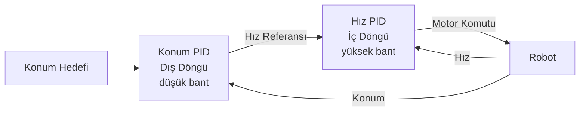
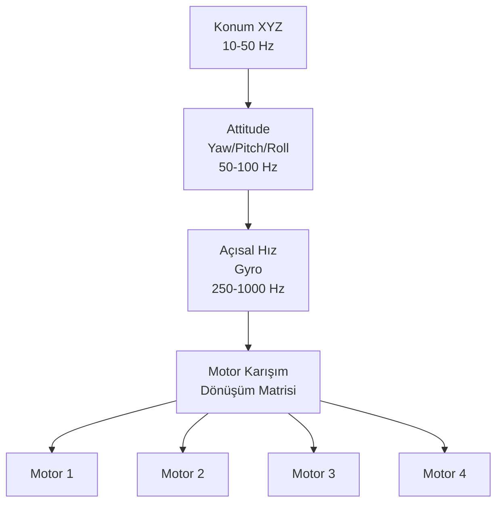
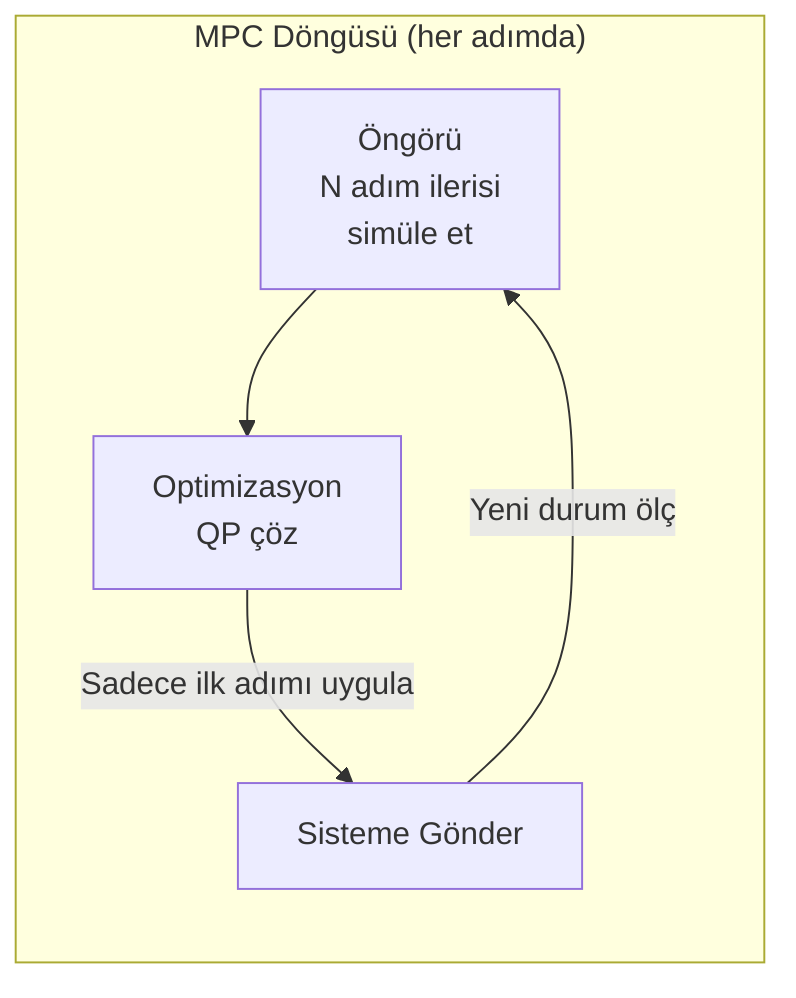
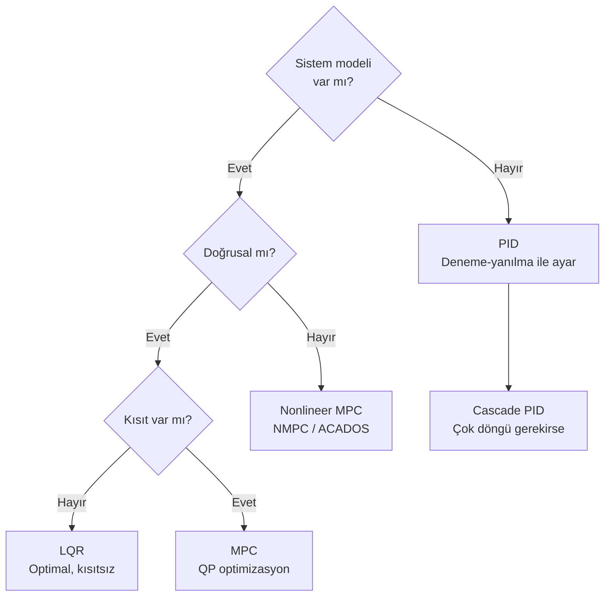

# Robot Kontrolü

!!! note "Genel Bakış"
    Robot kontrolü, bir sistemin istenen duruma (hedef konum, hız, açı) getirilmesi için matematiksel geri besleme döngüleriyle gerçek zamanlı komut üretme disiplinidir. PID basit ve yaygındır; daha karmaşık sistemler için LQR ve MPC kullanılır.

---

## Kontrol Döngüsü Temeli

```mermaid
graph LR
    REF[Referans\nHedef r&#40;t&#41;] --> SUM((Σ))
    SUM -->|Hata e&#40;t&#41;| CTRL[Kontrolör]
    CTRL -->|u&#40;t&#41; Kontrol girişi| PLANT[Sistem\nRobot/Motor]
    PLANT -->|y&#40;t&#41; Çıkış| SENSOR[Sensör]
    SENSOR -->|Ölçülen değer| SUM
```



| Sembol | Anlam |
|--------|-------|
| `r(t)` | Referans / setpoint |
| `e(t)` | Hata: `r(t) - y(t)` |
| `u(t)` | Kontrolörün sisteme uyguladığı giriş |
| `y(t)` | Sistemin ölçülen çıkışı |

---

## PID

En yaygın kontrolör. Üç terimin toplamıdır:

```
u(t) = Kp·e(t) + Ki·∫e(τ)dτ + Kd·de(t)/dt
```

| Terim | İsim | Etkisi |
|-------|------|--------|
| `Kp·e(t)` | **Oransal** | Anlık hataya tepki; büyük Kp → hızlı ama titreşimli |
| `Ki·∫e dt` | **İntegral** | Birikmiş hatayı sıfırlar; sabit durum hatasını giderir |
| `Kd·de/dt` | **Türevsel** | Hızlanmayı frenler; aşımı (overshoot) azaltır |

### Ayrık Zamanlı PID (Yazılım Gerçeklemesi)

```cpp title="pid.hpp"
class PID {
public:
    PID(double kp, double ki, double kd, double dt,
        double out_min = -1.0, double out_max = 1.0)
        : kp_(kp), ki_(ki), kd_(kd), dt_(dt),
          out_min_(out_min), out_max_(out_max) {}

    double compute(double setpoint, double measured) {
        double error = setpoint - measured;

        double p = kp_ * error;

        // Anti-windup: çıkış doyunca integratörü durdur
        integral_ += error * dt_;
        integral_ = std::clamp(integral_, out_min_ / ki_, out_max_ / ki_);
        double i = ki_ * integral_;

        // Türevsel: önceki hatadan türev — setpoint sıçramasında spike önler
        double derivative = (error - prev_error_) / dt_;
        double d = kd_ * derivative;

        prev_error_ = error;
        return std::clamp(p + i + d, out_min_, out_max_);
    }

    void reset() { integral_ = 0.0; prev_error_ = 0.0; }

private:
    double kp_, ki_, kd_, dt_;
    double out_min_, out_max_;
    double integral_ = 0.0;
    double prev_error_ = 0.0;
};
```

```cpp title="Kullanım"
PID pos_ctrl(1.2, 0.05, 0.3, 0.01);   // dt = 10ms (100 Hz döngü)

while (running) {
    double thrust = pos_ctrl.compute(target_z, current_z);
    motor.set_throttle(thrust);
    std::this_thread::sleep_for(std::chrono::milliseconds(10));
}
```

### Ziegler-Nichols Ayarı (Hızlı Başlangıç)

1. `Ki = 0`, `Kd = 0` ile `Kp` artır
2. Çıkış kararlı salınıma girdiğinde `Ku` (kritik kazanç) ve `Tu` (salınım periyodu) ölç
3. Tablodan hesapla:

| Kontrolör | Kp | Ki | Kd |
|-----------|:--:|:--:|:--:|
| P | 0.50·Ku | — | — |
| PI | 0.45·Ku | 1.2·Kp/Tu | — |
| PID | 0.60·Ku | 2·Kp/Tu | Kp·Tu/8 |

!!! warning "Anti-Windup Şart"
    Sistem doyuma girdiğinde (motor max hızda) integratör hata biriktirmeye devam eder. Çıkış sınıra ulaştığında integratörü durdurun veya geri sarın. Yukarıdaki kod `clamp` ile bunu yapar.

---

## Cascade PID

İki PID döngüsü birbirine bağlanır: dış döngü referans üretir, iç döngü bunu takip eder.



```cpp title="Cascade PID"
PID pos_loop(2.0, 0.0, 0.5, 0.02);   // dış: 50 Hz
PID vel_loop(8.0, 0.5, 0.1, 0.005);  // iç: 200 Hz

// Konum döngüsü (50 Hz)
double vel_ref = pos_loop.compute(target_z, measured_z);
vel_ref = std::clamp(vel_ref, -2.0, 2.0);  // Hız limiti

// Hız döngüsü (200 Hz) — her konum adımında 4 kez çalışır
double thrust = vel_loop.compute(vel_ref, measured_vz);
```

!!! tip "Bant Genişliği Kuralı"
    İç döngü bant genişliği dış döngünün en az **5–10 katı** olmalı. Aksi hâlde iç döngü dış döngüye yetişemez ve sistem kararsızlaşır.

### Quadrotor Tam Cascade Mimarisi



---

## LQR

Optimal kontrol teorisi. Durum uzayı modelini kullanan ve maliyet matrisleriyle performans-çaba dengesini optimize eden kontrolör.

### Durum Uzayı Modeli

```
ẋ = Ax + Bu
y = Cx + Du
```

| Matris | Boyut | Anlam |
|--------|:-----:|-------|
| **A** | n×n | Sistem dinamiği (durum geçiş matrisi) |
| **B** | n×m | Kontrol girişinin etkisi |
| **u** | m×1 | Kontrol girişi |
| **x** | n×1 | Durum vektörü |

### LQR Maliyet Fonksiyonu

```
J = ∫₀^∞ (xᵀQx + uᵀRu) dt  →  minimize et

Çözüm: u = -Kx
K = R⁻¹BᵀP           (kazanç matrisi)
P = ARE çözümü         (Algebraic Riccati Equation)
```

| Matris | Etkisi |
|--------|--------|
| **Q** (n×n, pozitif yarı-tanımlı) | Durumların önemi; büyük Q → durumu hızlı düzelt |
| **R** (m×m, pozitif tanımlı) | Kontrol enerjisi maliyeti; büyük R → yumuşak kontrol |

### Python ile LQR

```python
import numpy as np
from scipy.linalg import solve_continuous_are

def lqr(A, B, Q, R):
    """Sürekli zamanlı LQR kazanç hesabı."""
    P = solve_continuous_are(A, B, Q, R)       # ARE çözümü
    K = np.linalg.inv(R) @ B.T @ P            # Kazanç matrisi
    eigvals = np.linalg.eigvals(A - B @ K)     # Kapalı döngü kutupları
    return K, eigvals

# Örnek: 1D konum kontrolü
# Durum: x = [konum, hız],  Giriş: u = [kuvvet]
A = np.array([[0, 1],
              [0, 0]])

B = np.array([[0],
              [1]])    # m = 1 kg varsayım

Q = np.diag([10.0, 1.0])   # Konuma daha fazla önem
R = np.array([[0.1]])       # Kontrole hafif maliyet

K, poles = lqr(A, B, Q, R)
print(f"K = {K}")
print(f"Poles = {poles}")   # Tüm değerler negatif gerçel kısım → kararlı

# Simülasyon
x = np.array([1.0, 0.0])  # Başlangıç: 1m uzakta, hareketsiz
dt = 0.01

for step in range(500):
    u = -K @ x
    x = x + (A @ x + B @ u.flatten()) * dt
    if step % 50 == 0:
        print(f"t={step*dt:.2f}s  pos={x[0]:.4f}  vel={x[1]:.4f}")
```

!!! note "LQR Avantajları"
    - Optimal: Verilen Q-R için matematiksel olarak en iyi çözüm
    - Çok giriş-çok çıkış (MIMO) doğal olarak desteklenir
    - Kararlılık garantisi (kontrol edilebilir sistem için)
    - **Dezavantaj:** Doğrusal model gerektirir, kısıtlamaları doğrudan işleyemez

---

## MPC

MPC, gelecekteki bir **ufuk (horizon)** boyunca sistemi simüle eder, optimizasyon yaparak en iyi kontrol girdisini seçer. Her adımda yeniden çözülür (*receding horizon*).



### MPC vs PID vs LQR

| Özellik | PID | LQR | MPC |
|---------|:---:|:---:|:---:|
| Model gereksinimi | Yok | Doğrusal | Doğrusal/Nonlineer |
| Kısıtlama yönetimi | Manuel sınırlama | Zor | ✓ Yerleşik |
| Çok giriş-çok çıkış | Zor | ✓ | ✓ |
| Hesaplama maliyeti | Düşük | Düşük | **Yüksek** |
| Referans izleme | İyi | İyi | **Mükemmel** |
| Gecikme kompansasyonu | Zor | Orta | ✓ |

### Python ile MPC (do_mpc)

```python
import do_mpc
import numpy as np

# Model
model = do_mpc.model.Model('continuous')
pos = model.set_variable('_x', 'pos')
vel = model.set_variable('_x', 'vel')
acc = model.set_variable('_u', 'acc')    # kontrol girişi

model.set_rhs('pos', vel)
model.set_rhs('vel', acc)
model.setup()

# MPC yapılandırması
mpc = do_mpc.controller.MPC(model)
mpc.set_param(n_horizon=20, t_step=0.05, n_robust=0)

mterm = (pos - 5.0)**2           # terminal maliyet
lterm = (pos - 5.0)**2 + acc**2  # anlık maliyet
mpc.set_objective(mterm=mterm, lterm=lterm)

# Fiziksel kısıtlamalar
mpc.bounds['lower', '_u', 'acc'] = -3.0
mpc.bounds['upper', '_u', 'acc'] = 3.0
mpc.bounds['lower', '_x', 'vel'] = -5.0
mpc.bounds['upper', '_x', 'vel'] = 5.0
mpc.setup()

# Simülatör
simulator = do_mpc.simulator.Simulator(model)
simulator.set_param(t_step=0.05)
simulator.setup()

x0 = np.array([0.0, 0.0])
mpc.x0 = x0; simulator.x0 = x0
mpc.set_initial_guess()

for _ in range(100):
    u0 = mpc.make_step(x0)
    x0 = simulator.make_step(u0)
```

### ACADOS ile Yüksek Performanslı NMPC

```python
from acados_template import AcadosOcp, AcadosOcpSolver, AcadosModel
import casadi as ca

model = AcadosModel()
model.name = 'quadrotor'
x = ca.MX.sym('x', 6)   # [px, py, pz, vx, vy, vz]
u = ca.MX.sym('u', 3)   # [ax, ay, az]

model.x = x
model.u = u
model.f_expl_expr = ca.vertcat(x[3:], u - ca.vertcat(0, 0, 9.81))

ocp = AcadosOcp()
ocp.model = model
ocp.dims.N = 50
ocp.solver_options.tf = 1.0
ocp.solver_options.qp_solver = 'PARTIAL_CONDENSING_HPIPM'  # ~1ms çözüm
ocp.solver_options.nlp_solver_type = 'SQP_RTI'             # Gerçek zamanlı SQP

solver = AcadosOcpSolver(ocp, json_file='acados_ocp.json')
```

!!! tip "MPC Ne Zaman Tercih Edilir?"
    - Sistem kısıtlamaları kritikse (güvenlik sınırları, mekanik limitler)
    - Çok değişkenli kontrol (MIMO) — örneğin robot kolu
    - İleriye dönük referans biliniyorsa (navigasyon yolu)
    - Doğrusal olmayan dinamikler (NMPC — drone, araç)

!!! warning "Gerçek Zamanlı MPC"
    QP/NLP çözücü süresi kontrol periyodundan kısa olmalı. Yüksek frekanslı sistemlerde (>100 Hz) ACADOS veya FORCES Pro gibi özelleşmiş çözücüler zorunlu. `scipy.optimize` çok yavaş.

---

## Kontrolör Seçim Rehberi



| Senaryo | Önerilen |
|---------|---------|
| Basit motor hız kontrolü | PID |
| Drone yükseklik + hız | Cascade PID |
| Robot kolu açı (model mevcut) | LQR |
| Otonom araç yol takibi | MPC |
| Drone agresif manevra | NMPC |
| Çok eksenli manipülatör | LQR veya MPC |
