# ROS 2 — Derinlemesine Rehber

!!! note "Genel Bakış"
    ROS 2, robot yazılımı geliştirmek için tasarlanmış meta-işletim sistemidir. ROS 1'deki merkezi `rosmaster` mimarisini tamamen terk ederek **DDS (Data Distribution Service)** üzerine kurulmuş, merkeziyetsiz, gerçek zamanlı yetenekli bir haberleşme altyapısı sunar. Bu sayfa; bir sistem yazılımcısının "neden böyle çalışır?" sorularını yanıtlamak için kaleme alınmıştır.

---

## Mimari Katmanlar

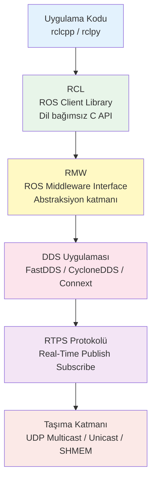

| Katman | Sorumluluk | Değiştirilebilir mi? |
|--------|-----------|:--------------------:|
| **rclcpp/rclpy** | C++/Python API, callback, executor | Dil ile |
| **rcl** | Dil bağımsız çekirdek C API | — |
| **rmw** | DDS bağımsızlık katmanı | ✓ (RMW_IMPLEMENTATION) |
| **DDS** | RTPS, QoS, keşif (discovery) | ✓ |
| **Transport** | UDP / TCP / SHM | DDS yapılandırması ile |

---

## Neden UDP? — Temel Soru

> "TCP güvenilir ama neden ROS 2 UDP tercih eder?"

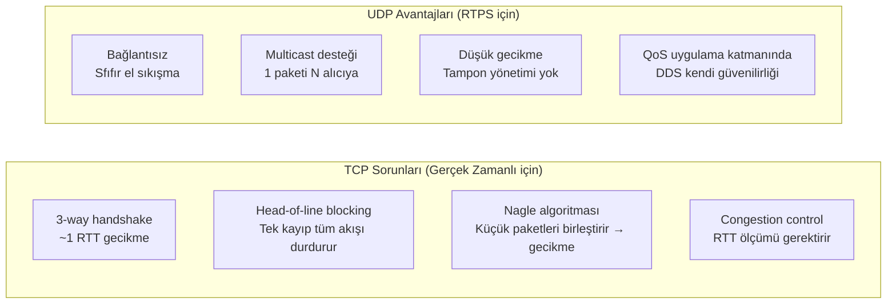

### UDP + RTPS = Güvenilirlik Kontrolü Uygulama Katmanında

TCP'nin `ACK` / yeniden iletim mekanizmasının eşdeğerini RTPS **uygulama katmanında** kendisi sağlar:

| Mekanizma | TCP | RTPS (DDS üzerinde) |
|-----------|:---:|:-------------------:|
| Güvenilir teslimat | ✓ Kernel | ✓ Uygulama (RTPS ACKNACK) |
| Sıralı teslimat | ✓ | QoS `HISTORY` ile |
| Çoklu alıcı (multicast) | ✗ | ✓ UDP multicast |
| Gecikme önceliği | ✗ | ✓ (güvenilirlik kapatılabilir) |
| Bant genişliği akış kontrolü | Kernel'de | DDS'de |

**Best-effort topic'ler** (sensör akışı, lidar, kamera) için UDP'nin `RELIABLE` mekanizması kullanılmaz — paketin kaybı tolere edilir, düşük gecikme önceliklenir.  
**Güvenilir topic'ler** (hedef gönder, durum güncelleme) için RTPS `ACKNACK` döngüsü paketi yeniden iletir — TCP benzeri garanti, ama multicast desteğiyle.

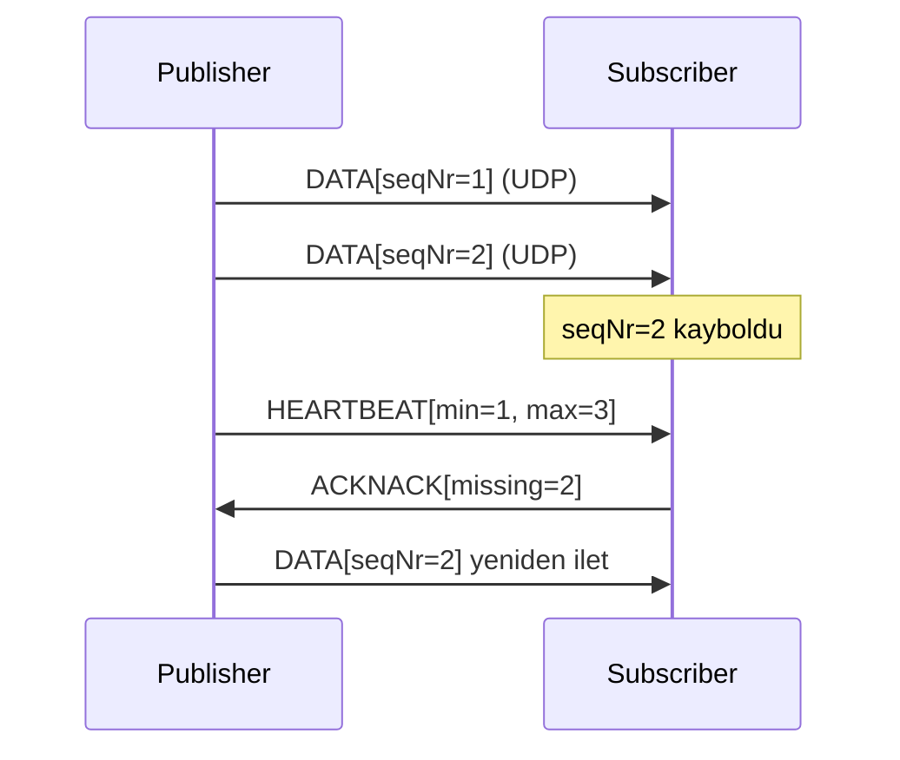

### UDP Multicast — Discovery

DDS node'ları birbirini bulmak için **PDP (Participant Discovery Protocol)** kullanır. Bu süreç UDP multicast üzerinde yürür:

```
Multicast adresi: 239.255.0.1
Port hesabı:      7400 + 250*DomainID + 0 (PDP)
```

Her node başladığında bu adrese `SPDP_DISCOVERED_PARTICIPANT_DATA` multicast'i gönderir. Aynı domain'deki tüm node'lar dinler, karşılıklı tanışırlar. Ardından **EDP (Endpoint Discovery Protocol)** ile publisher/subscriber eşleşmesi yapılır ve bundan sonra unicast iletişim başlar.

```bash
# Ağdaki DDS trafiğini yakala
sudo tcpdump -i eth0 -n 'udp port 7400' -v

# Multicast gruba katılım kontrolü
ip maddr show
```

---

## DDS ve RTPS Derinlemesine

### DDS Uygulamaları Karşılaştırması

| | **FastDDS** (eProsima) | **CycloneDDS** (Eclipse) | **Connext** (RTI) |
|--|:--------------------:|:---------------------:|:----------------:|
| Lisans | Apache 2.0 | Eclipse/Apache | Ticari |
| ROS 2 varsayılan | Humble+ | Seçenek | Seçenek |
| Shared Memory | ✓ (FastDDS SHM) | ✓ (iox) | ✓ |
| Performans | Yüksek | **En yüksek** | Yüksek |
| Güvenlik (DDS-Sec) | ✓ | ✓ | ✓ |
| WAN desteği | Sınırlı | Sınırlı | ✓ |

```bash
# DDS uygulamasını değiştir
export RMW_IMPLEMENTATION=rmw_cyclonedds_cpp
export RMW_IMPLEMENTATION=rmw_fastrtps_cpp
export RMW_IMPLEMENTATION=rmw_connextdds
```

### RTPS Paket Yapısı

```
┌─────────────────────────────────────────────────────────┐
│ RTPS Header (20 byte)                                    │
│   protocol="RTPS"  version  vendorId  guidPrefix        │
├─────────────────────────────────────────────────────────┤
│ Submessage 1: INFO_TS (zaman damgası)                   │
├─────────────────────────────────────────────────────────┤
│ Submessage 2: DATA                                      │
│   extraFlags  writerEntityId  readerEntityId            │
│   writerSeqNumber  serializedPayload (CDR kodlu veri)   │
├─────────────────────────────────────────────────────────┤
│ Submessage 3: HEARTBEAT / ACKNACK / GAP (güvenilir mod) │
└─────────────────────────────────────────────────────────┘
```

**CDR (Common Data Representation):** ROS 2'nin serileştirme formatı. Mesaj yapısı kaynak dilden bağımsız olarak CDR'ye dönüştürülür, karşı tarafta geri çözülür. Bu, C++ node ile Python node'un sorunsuz haberleşmesini sağlar.

---

## QoS — Kalite Servis Politikaları

QoS, publisher ve subscriber arasındaki davranış sözleşmesidir. **Uyumsuz QoS → bağlantı kurulamaz** (sessiz hata; `ros2 topic info -v` ile görülür).

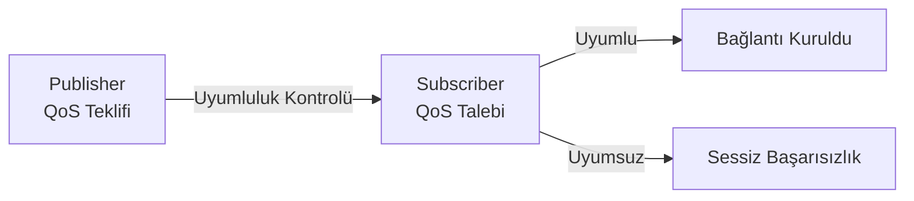

### Temel QoS Politikaları

=== "Reliability"

    | Değer | Açıklama | Ne zaman |
    |-------|---------|:--------:|
    | `RELIABLE` | Kayıp paket yeniden iletilir (RTPS ACKNACK) | Komutlar, servisler |
    | `BEST_EFFORT` | Kayıp tolere edilir, gecikme öncelikli | Sensör akışı, video |

    !!! warning "Uyumluluk Kuralı"
        Publisher `BEST_EFFORT` → Subscriber sadece `BEST_EFFORT` bağlanabilir.  
        Publisher `RELIABLE` → Subscriber hem `RELIABLE` hem `BEST_EFFORT` bağlanabilir.

=== "Durability"

    | Değer | Açıklama | Ne zaman |
    |-------|---------|:--------:|
    | `VOLATILE` | Geç bağlanan subscriber önceki mesajları almaz | Default |
    | `TRANSIENT_LOCAL` | Publisher önceki N mesajı önbelleğe alır; geç bağlanan alır | Harita, statik parametreler |

    `TRANSIENT_LOCAL` + `HISTORY KEEP_LAST 1` = "en son değer her zaman mevcut" kalıbı — `/map`, `/robot_description` gibi topic'lerde standart kullanım.

=== "History"

    | Değer | Açıklama |
    |-------|---------|
    | `KEEP_LAST(N)` | Son N mesajı tampona al; publisher de subscriber de belirtir |
    | `KEEP_ALL` | Tüm mesajları tut (bellek sınırsız) |

=== "Deadline"

    Publisher veya subscriber'ın belirli bir sürede mesaj göndermesini/almasını zorunlu kılar. Süresi aşılırsa `on_deadline_missed()` callback'i tetiklenir.

    ```cpp
    rclcpp::QoS qos(10);
    qos.deadline(std::chrono::milliseconds(100));  // 10 Hz zorunlu
    ```

=== "Liveliness"

    Node'un hâlâ "canlı" olduğunu beyan eder. Yazılımsal watchdog gibi çalışır.

    | Değer | Açıklama |
    |-------|---------|
    | `AUTOMATIC` | DDS altyapısı yönetir |
    | `MANUAL_BY_TOPIC` | Uygulama `assert_liveliness()` çağırmalı |

=== "Lifespan"

    Mesajın belirli bir süre sonra "bayat" sayılıp atılmasını sağlar.

    ```cpp
    qos.lifespan(std::chrono::milliseconds(500));  // 500ms sonra eskir
    ```

### Hazır QoS Profilleri

```cpp
#include "rclcpp/rclcpp.hpp"

// Sensör verisi: best-effort, volatile, keep-last-5
auto sensor_qos = rclcpp::SensorDataQoS();

// Sistem varsayılan
auto default_qos = rclcpp::SystemDefaultsQoS();

// Servisler için
auto services_qos = rclcpp::ServicesQoS();

// Parametre olayları
auto param_qos = rclcpp::ParameterEventsQoS();
```

```python
from rclpy.qos import QoSProfile, ReliabilityPolicy, DurabilityPolicy, HistoryPolicy

qos = QoSProfile(
    reliability=ReliabilityPolicy.RELIABLE,
    durability=DurabilityPolicy.TRANSIENT_LOCAL,
    history=HistoryPolicy.KEEP_LAST,
    depth=10
)
```

```bash
# QoS uyumsuzluğunu teşhis et
ros2 topic info /my_topic -v
# "Publisher count: 1, Subscriber count: 1" ama mesaj gelmiyorsa → QoS uyumsuzluğu
```

---

## Haberleşme Katmanları — Yerel'den Uzak'a

ROS 2, aynı süreci paylaşan node'lardan farklı makinelerdeki node'lara kadar **dört farklı haberleşme katmanını** otomatik olarak seçer.

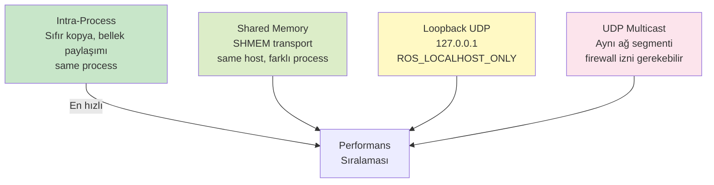

### 1. Intra-Process Communication (Sıfır Kopya)

Aynı süreçteki node'lar arasında mesaj **bellek kopyalanmadan** aktarılır. `std::unique_ptr<T>` mesaj sahipliğini aktarır; `std::shared_ptr<T>` birden fazla subscriber için paylaşır.

```cpp title="intra_process_demo.cpp"
#include "rclcpp/rclcpp.hpp"
#include "std_msgs/msg/int32.hpp"

class Producer : public rclcpp::Node {
public:
    Producer() : Node("producer", rclcpp::NodeOptions().use_intra_process_comms(true)) {
        pub_ = create_publisher<std_msgs::msg::Int32>("/data", 10);
        timer_ = create_wall_timer(std::chrono::milliseconds(100), [this]() {
            // unique_ptr ile sahiplik devri — sıfır kopya!
            auto msg = std::make_unique<std_msgs::msg::Int32>();
            msg->data = count_++;
            RCLCPP_INFO(get_logger(), "Gönder: %d @%p", msg->data, (void*)msg.get());
            pub_->publish(std::move(msg));   // move → kopya yok
        });
    }
private:
    rclcpp::Publisher<std_msgs::msg::Int32>::SharedPtr pub_;
    rclcpp::TimerBase::SharedPtr timer_;
    int count_ = 0;
};

class Consumer : public rclcpp::Node {
public:
    Consumer() : Node("consumer", rclcpp::NodeOptions().use_intra_process_comms(true)) {
        sub_ = create_subscription<std_msgs::msg::Int32>(
            "/data", 10,
            [this](std_msgs::msg::Int32::UniquePtr msg) {
                // Aynı bellek adresi! Kopya yapılmadı.
                RCLCPP_INFO(get_logger(), "Al: %d @%p", msg->data, (void*)msg.get());
            }
        );
    }
private:
    rclcpp::Subscription<std_msgs::msg::Int32>::SharedPtr sub_;
};

int main(int argc, char** argv) {
    rclcpp::init(argc, argv);
    rclcpp::executors::SingleThreadedExecutor exec;
    auto prod = std::make_shared<Producer>();
    auto cons = std::make_shared<Consumer>();
    exec.add_node(prod);
    exec.add_node(cons);
    exec.spin();
    rclcpp::shutdown();
}
```

!!! tip "Ne Zaman İntra-Process Kullanılır?"
    - Kamera/Lidar verisi gibi büyük mesajların aynı süreçte işlenmesi gerektiğinde
    - Latency'nin mikrosaniye düzeyinde kritik olduğu durumlar
    - Serileştirme maliyetinden kaçınmak için
    
    **Kural:** Node'ları aynı `Component Container` içinde çalıştırın ve `use_intra_process_comms(true)` ayarlayın.

### 2. Shared Memory (SHMEM) Transport

Farklı süreçlerdeki node'lar arasında paylaşılan bellek üzerinden haberleşme. FastDDS ve CycloneDDS (iceoryx ile) destekler.

```xml title="fastdds_shm.xml"
<?xml version="1.0" encoding="UTF-8" ?>
<profiles xmlns="http://www.eprosima.com/XMLSchemas/fastRTPS_Profiles">
    <transport_descriptors>
        <transport_descriptor>
            <transport_id>shm_transport</transport_id>
            <type>SHM</type>
            <maxMessageSize>4194304</maxMessageSize>  <!-- 4 MB -->
        </transport_descriptor>
    </transport_descriptors>
    <participant profile_name="shm_participant" is_default_profile="true">
        <rtps>
            <userTransports>
                <transport_id>shm_transport</transport_id>
            </userTransports>
            <useBuiltinTransports>false</useBuiltinTransports>
        </rtps>
    </participant>
</profiles>
```

```bash
export FASTRTPS_DEFAULT_PROFILES_FILE=/path/to/fastdds_shm.xml
```

**CycloneDDS + iceoryx (zero-copy across processes):**

```bash
sudo apt install ros-humble-rmw-cyclonedds-cpp iceoryx-runtime iceoryx-posh
export RMW_IMPLEMENTATION=rmw_cyclonedds_cpp
# iceoryx daemon başlat (SHM yönetimi için)
sudo iox-roudi -c /etc/iceoryx/roudi_config.toml
```

### 3. Localhost Only (Geliştirme İzolasyonu)

```bash
export ROS_LOCALHOST_ONLY=1
# Tüm DDS trafiği 127.0.0.1 üzerinden geçer
# Ağdaki başka cihazlar bu node'ları göremez
```

**Ne zaman kullanılır:**
- Geliştirme ortamında izolasyon istediğinizde
- Aynı makinede birden fazla ROS 2 sistemi çalışıyorken
- Güvenlik duvarı veya VPN olmaksızın güvenli olmayan ağlarda

### 4. Domain ID ile Ağ Segmentasyonu

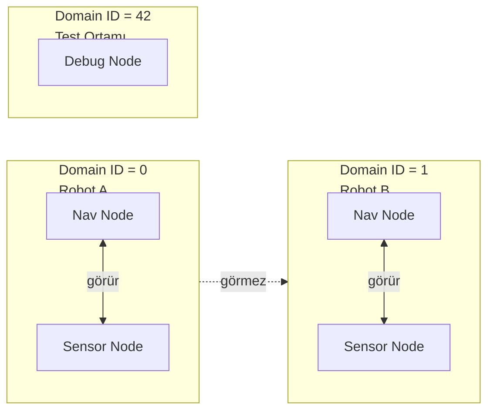

```bash
export ROS_DOMAIN_ID=42   # 0–101 güvenli aralık

# Port hesabı (ROS 2 spesifikasyonu)
# PDP Multicast: 7400 + 250*DomainID
# User Unicast:  7412 + 250*DomainID + participantID*2

# Domain 0 için: 7400 (multicast), 7412+ (unicast)
# Domain 42 için: 7400+250*42=17900, 17912+ (unicast)
```

!!! warning "Domain ID Port Çakışması"
    Linux ephemeral port aralığı: `/proc/sys/net/ipv4/ip_local_port_range` (genellikle 32768–60999).  
    Domain ID 101 üzeri bu aralıkla çakışabilir. `ros2 doctor` ile kontrol edin.

---

## Component ve Executor Mimarisi

### Component Container — Tek Süreçte Çoklu Node

Birden fazla node'u tek süreç içinde çalıştırır. Avantajları:
- Intra-process communication (sıfır kopya)
- Daha az bellek kullanımı (DDS participant başına maliyet azalır)
- Daha az süreç = daha az OS context switch

```bash
# Component container başlat
ros2 run rclcpp_components component_container

# Node'ları dinamik yükle
ros2 component load /ComponentManager my_pkg my_pkg::MyNode
ros2 component list
ros2 component unload /ComponentManager 1
```

```cpp title="my_component.hpp"
#include "rclcpp/rclcpp.hpp"
#include "rclcpp_components/register_node_macro.hpp"

namespace my_pkg {

class MyNode : public rclcpp::Node {
public:
    explicit MyNode(const rclcpp::NodeOptions & options)
    : Node("my_node", options) {
        // NodeOptions içinde intra-process ayarı
        // Container geçirirse otomatik etkinleşir
    }
};

}  // namespace my_pkg

RCLCPP_COMPONENTS_REGISTER_NODE(my_pkg::MyNode)
```

```cmake title="CMakeLists.txt (component kaydı)"
add_library(my_node SHARED src/my_node.cpp)
rclcpp_components_register_node(my_node
    PLUGIN "my_pkg::MyNode"
    EXECUTABLE my_node_exe
)
```

### Executor — Callback Zamanlama Mekanizması

Executor, DDS'den gelen olayları (mesaj, timer, servis) alır ve callback'leri çalıştırır.

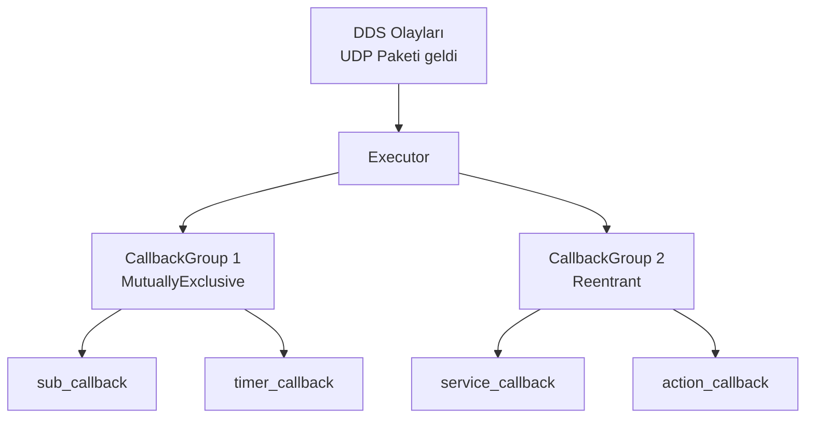

```cpp title="Executor Tipleri"
// Tek thread — en basit, callback'ler sırayla çalışır
rclcpp::executors::SingleThreadedExecutor exec;

// Çok thread — thread_count kadar paralel callback
rclcpp::executors::MultiThreadedExecutor exec(
    rclcpp::ExecutorOptions(), 4  // 4 thread
);

// Statik tek thread — compile time optimizasyon (gerçek zamanlı için)
rclcpp::executors::StaticSingleThreadedExecutor exec;

exec.add_node(node);
exec.spin();
```

```cpp title="Callback Groups"
// MutuallyExclusive: Aynı gruptaki callback'ler aynı anda çalışamaz
auto mutex_group = node->create_callback_group(
    rclcpp::CallbackGroupType::MutuallyExclusive);

// Reentrant: Paralel çalışabilir
auto reentrant_group = node->create_callback_group(
    rclcpp::CallbackGroupType::Reentrant);

// Subscription'a callback group ata
rclcpp::SubscriptionOptions opts;
opts.callback_group = mutex_group;
auto sub = node->create_subscription<MsgType>("/topic", 10, callback, opts);

// MultiThreaded executor ile birlikte kullan!
rclcpp::executors::MultiThreadedExecutor exec(rclcpp::ExecutorOptions(), 4);
```

---

## Lifecycle Node — Yönetilen Yaşam Döngüsü

Lifecycle node, node'un durumunu dışarıdan kontrol etmeyi sağlar. Kritik sistem bileşenlerinde güvenli başlatma/kapama için kullanılır.

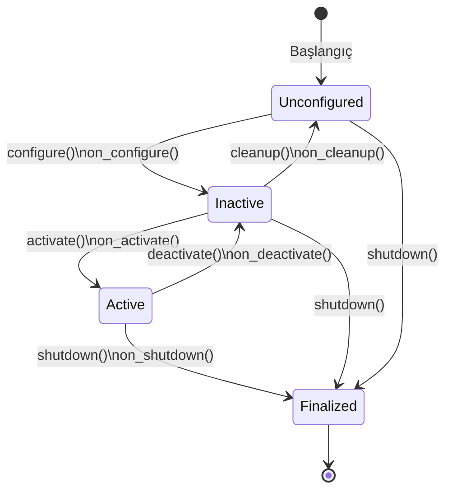

```cpp title="lifecycle_node.cpp"
#include "rclcpp_lifecycle/lifecycle_node.hpp"

class MyLifecycleNode : public rclcpp_lifecycle::LifecycleNode {
public:
    MyLifecycleNode() : LifecycleNode("my_lifecycle_node") {}

    rclcpp_lifecycle::node_interfaces::LifecycleNodeInterface::CallbackReturn
    on_configure(const rclcpp_lifecycle::State&) override {
        // Kaynakları tahsis et ama yayınlamaya başlama
        pub_ = create_publisher<std_msgs::msg::String>("/output", 10);
        RCLCPP_INFO(get_logger(), "Configured");
        return CallbackReturn::SUCCESS;
    }

    rclcpp_lifecycle::node_interfaces::LifecycleNodeInterface::CallbackReturn
    on_activate(const rclcpp_lifecycle::State&) override {
        // Publisher'ı aktif et
        pub_->on_activate();
        RCLCPP_INFO(get_logger(), "Activated");
        return CallbackReturn::SUCCESS;
    }

    rclcpp_lifecycle::node_interfaces::LifecycleNodeInterface::CallbackReturn
    on_deactivate(const rclcpp_lifecycle::State&) override {
        pub_->on_deactivate();
        return CallbackReturn::SUCCESS;
    }

    rclcpp_lifecycle::node_interfaces::LifecycleNodeInterface::CallbackReturn
    on_cleanup(const rclcpp_lifecycle::State&) override {
        pub_.reset();
        return CallbackReturn::SUCCESS;
    }

private:
    rclcpp_lifecycle::LifecyclePublisher<std_msgs::msg::String>::SharedPtr pub_;
};
```

```bash
# Durum geçişlerini tetikle
ros2 lifecycle set /my_lifecycle_node configure
ros2 lifecycle set /my_lifecycle_node activate
ros2 lifecycle get /my_lifecycle_node
ros2 lifecycle list /my_lifecycle_node
```

---

## Paket Oluşturma ve Çalışma Alanı

### Dizin Yapısı

```
<workspace>/
├─ src/                    # Paket kaynak kodları
│   ├─ my_cpp_pkg/
│   │   ├─ include/my_cpp_pkg/
│   │   ├─ src/
│   │   ├─ CMakeLists.txt
│   │   └─ package.xml
│   └─ my_py_pkg/
│       ├─ my_py_pkg/
│       ├─ setup.py
│       └─ package.xml
├─ build/                  # Derleme dosyaları (git'e ekleme)
├─ install/                # Kurulum (setup.bash buradan source edilir)
└─ log/                    # Derleme ve runtime logları
```

```bash
# Ortam hazırlama
echo "source /opt/ros/humble/setup.bash" >> ~/.bashrc
echo "source /usr/share/colcon_argcomplete/hook/colcon-argcomplete.bash" >> ~/.bashrc

# Bağımlılıkları kur
rosdep update
rosdep install --from-paths src --ignore-src --rosdistro humble -y

# Paket oluşturma
ros2 pkg create --build-type ament_cmake \
    --node-name my_node \
    --license Apache-2.0 \
    --dependencies rclcpp std_msgs geometry_msgs \
    my_cpp_pkg

# Derleme
colcon build                                        # Tümünü derle
colcon build --packages-select my_cpp_pkg          # Seçili paket
colcon build --symlink-install --packages-select my_py_pkg  # Python symlink
colcon build --cmake-args -DCMAKE_BUILD_TYPE=RelWithDebInfo  # Debug sembollü
colcon graph                                        # Bağımlılık grafiği

# Aktif et
source install/setup.bash

# Çalıştır
ros2 run my_cpp_pkg my_node --ros-args --log-level debug
ros2 launch my_pkg bringup.launch.py
```

---

## Node, Topic, Service, Action

### Node

```bash
ros2 node list                   # Aktif node'lar
ros2 node info /my_node          # Publisher, subscriber, servis, parametre listesi
```

```cpp title="Minimal C++ Node"
#include "rclcpp/rclcpp.hpp"
#include "std_msgs/msg/string.hpp"

class MinimalNode : public rclcpp::Node {
public:
    MinimalNode() : Node("minimal_node") {
        pub_ = create_publisher<std_msgs::msg::String>("/chatter", 10);
        sub_ = create_subscription<std_msgs::msg::String>(
            "/chatter", 10,
            [this](const std_msgs::msg::String::SharedPtr msg) {
                RCLCPP_INFO(get_logger(), "Alındı: %s", msg->data.c_str());
            }
        );
        timer_ = create_wall_timer(std::chrono::seconds(1), [this]() {
            auto msg = std_msgs::msg::String();
            msg.data = "Merhaba ROS2 #" + std::to_string(count_++);
            pub_->publish(msg);
        });
    }
private:
    rclcpp::Publisher<std_msgs::msg::String>::SharedPtr pub_;
    rclcpp::Subscription<std_msgs::msg::String>::SharedPtr sub_;
    rclcpp::TimerBase::SharedPtr timer_;
    size_t count_ = 0;
};

int main(int argc, char** argv) {
    rclcpp::init(argc, argv);
    rclcpp::spin(std::make_shared<MinimalNode>());
    rclcpp::shutdown();
}
```

### Topic

```bash
ros2 topic list -t                                              # Tip bilgisiyle
ros2 topic echo /cmd_vel                                        # Mesajları izle
ros2 topic info /cmd_vel -v                                     # QoS dahil detay
ros2 topic hz /scan                                             # Yayın hızı
ros2 topic bw /camera/image_raw                                 # Bant genişliği
ros2 topic pub /cmd_vel geometry_msgs/msg/Twist \
    "{linear: {x: 0.5}, angular: {z: 0.3}}" -r 10             # 10 Hz yayın
```

### Service

Request-Response modeli; senkron, bloklamalı iletişim.

```bash
ros2 service list -t
ros2 service call /set_bool std_srvs/srv/SetBool "{data: true}"
ros2 service type /my_service
ros2 interface show std_srvs/srv/SetBool
```

```cpp title="Service Server (C++)"
#include "rclcpp/rclcpp.hpp"
#include "std_srvs/srv/set_bool.hpp"

class ServiceNode : public rclcpp::Node {
public:
    ServiceNode() : Node("service_node") {
        srv_ = create_service<std_srvs::srv::SetBool>(
            "/enable",
            [this](const std_srvs::srv::SetBool::Request::SharedPtr req,
                   std_srvs::srv::SetBool::Response::SharedPtr res) {
                enabled_ = req->data;
                res->success = true;
                res->message = enabled_ ? "Aktif" : "Pasif";
                RCLCPP_INFO(get_logger(), "Enable: %d", enabled_);
            }
        );
    }
private:
    rclcpp::Service<std_srvs::srv::SetBool>::SharedPtr srv_;
    bool enabled_ = false;
};
```

### Action

Uzun süreli görevler; Goal → Feedback (periyodik) → Result.

```bash
ros2 action list -t
ros2 action send_goal /navigate_to_pose nav2_msgs/action/NavigateToPose \
    "{pose: {header: {frame_id: 'map'}, pose: {position: {x: 1.0, y: 2.0}}}}" \
    --feedback
```

```cpp title="Action Server (C++)"
#include "rclcpp/rclcpp.hpp"
#include "rclcpp_action/rclcpp_action.hpp"
#include "example_interfaces/action/fibonacci.hpp"

using Fibonacci = example_interfaces::action::Fibonacci;

class FibActionServer : public rclcpp::Node {
public:
    FibActionServer() : Node("fibonacci_action_server") {
        server_ = rclcpp_action::create_server<Fibonacci>(
            this, "/fibonacci",
            [](const rclcpp_action::GoalUUID&, std::shared_ptr<const Fibonacci::Goal>) {
                return rclcpp_action::GoalResponse::ACCEPT_AND_EXECUTE;
            },
            [](std::shared_ptr<rclcpp_action::ServerGoalHandle<Fibonacci>>) {
                return rclcpp_action::CancelResponse::ACCEPT;
            },
            [this](std::shared_ptr<rclcpp_action::ServerGoalHandle<Fibonacci>> handle) {
                std::thread([this, handle]() { execute(handle); }).detach();
            }
        );
    }

private:
    void execute(std::shared_ptr<rclcpp_action::ServerGoalHandle<Fibonacci>> handle) {
        auto feedback = std::make_shared<Fibonacci::Feedback>();
        auto& seq = feedback->partial_sequence;
        seq = {0, 1};
        for (int i = 1; i < handle->get_goal()->order && rclcpp::ok(); ++i) {
            if (handle->is_canceling()) {
                handle->canceled(std::make_shared<Fibonacci::Result>());
                return;
            }
            seq.push_back(seq[i] + seq[i-1]);
            handle->publish_feedback(feedback);
            std::this_thread::sleep_for(std::chrono::milliseconds(100));
        }
        auto result = std::make_shared<Fibonacci::Result>();
        result->sequence = seq;
        handle->succeed(result);
    }
    rclcpp_action::Server<Fibonacci>::SharedPtr server_;
};
```

---

## Launch Sistemi

```python title="bringup.launch.py"
from launch import LaunchDescription
from launch.actions import DeclareLaunchArgument, IncludeLaunchDescription, GroupAction
from launch.conditions import IfCondition
from launch.substitutions import LaunchConfiguration, PathJoinSubstitution
from launch_ros.actions import Node, ComposableNodeContainer, LoadComposableNodes
from launch_ros.descriptions import ComposableNode
from launch_ros.substitutions import FindPackageShare

def generate_launch_description():
    use_sim = LaunchConfiguration('use_sim')

    return LaunchDescription([
        DeclareLaunchArgument('use_sim', default_value='false'),
        DeclareLaunchArgument('log_level', default_value='info'),

        # Başka launch dosyasını dahil et
        IncludeLaunchDescription(
            PathJoinSubstitution([FindPackageShare('my_pkg'), 'launch', 'sensors.launch.py']),
            launch_arguments={'use_sim_time': use_sim}.items()
        ),

        # Kompozit container — intra-process için
        ComposableNodeContainer(
            name='my_container',
            namespace='',
            package='rclcpp_components',
            executable='component_container',
            composable_node_descriptions=[
                ComposableNode(
                    package='my_pkg',
                    plugin='my_pkg::CameraNode',
                    name='camera',
                    parameters=[{'frame_rate': 30.0}]
                ),
                ComposableNode(
                    package='my_pkg',
                    plugin='my_pkg::ProcessorNode',
                    name='processor',
                    remappings=[('/input', '/camera/image')]
                ),
            ],
            output='screen',
        ),

        # Koşullu node
        Node(
            condition=IfCondition(use_sim),
            package='gazebo_ros',
            executable='spawn_entity.py',
            name='spawn_robot',
        ),
    ])
```

---

## Parametreler

```bash
ros2 param list /my_node
ros2 param get  /my_node max_speed
ros2 param set  /my_node max_speed 2.5
ros2 param dump /my_node > params.yaml
ros2 param load /my_node params.yaml
```

```yaml title="config/params.yaml"
my_node:
  ros__parameters:
    max_speed: 3.0
    pid_gains: {p: 1.2, i: 0.01, d: 0.05}
    waypoints: [0.0, 0.0, 1.0, 1.0, 2.0, 2.0]
    enabled: true
```

```cpp title="Parametre Callback (C++)"
#include "rclcpp/rclcpp.hpp"

class ParamNode : public rclcpp::Node {
public:
    ParamNode() : Node("param_node") {
        // Parametre tanımla ve default değer ver
        declare_parameter("max_speed", 1.0);
        declare_parameter("debug", false);

        max_speed_ = get_parameter("max_speed").as_double();

        // Parametre değişim callback'i
        cb_handle_ = add_on_set_parameters_callback(
            [this](const std::vector<rclcpp::Parameter>& params) {
                rcl_interfaces::msg::SetParametersResult result;
                result.successful = true;
                for (const auto& p : params) {
                    if (p.get_name() == "max_speed") {
                        if (p.as_double() < 0.0) {
                            result.successful = false;
                            result.reason = "max_speed negatif olamaz";
                        } else {
                            max_speed_ = p.as_double();
                        }
                    }
                }
                return result;
            }
        );
    }
private:
    double max_speed_;
    rclcpp::node_interfaces::OnSetParametersCallbackHandle::SharedPtr cb_handle_;
};
```

---

## Mesaj ve Servis Arayüzleri

```bash
ros2 interface list                         # Tüm msg/srv/action
ros2 interface show geometry_msgs/msg/Twist # Yapıyı göster
ros2 interface package sensor_msgs         # Paketin arayüzleri
```

```title="msg/Velocity.msg"
std_msgs/Header header
float64 linear_x    # m/s
float64 linear_y    # m/s
float64 angular_z   # rad/s
```

```title="srv/SetTarget.srv"
geometry_msgs/Point target
float64 speed
---
bool success
string message
float64 estimated_time  # saniye
```

```title="action/Navigate.action"
# Goal
geometry_msgs/PoseStamped target_pose
float64 speed_limit
---
# Result
bool success
float64 total_distance
---
# Feedback
geometry_msgs/PoseStamped current_pose
float64 distance_remaining
float64 eta
```

---

## Kayıt ve Yeniden Oynatma (ros2 bag)

```bash
# Kayıt
ros2 bag record -a                               # Tümü
ros2 bag record /scan /odom /cmd_vel -o my_bag  # Seçili topic'ler
ros2 bag record /camera/image_raw \
    --qos-profile-overrides-path qos.yaml        # QoS override ile

# Bilgi
ros2 bag info my_bag/

# Oynatma
ros2 bag play my_bag/
ros2 bag play my_bag/ --loop                     # Döngüsel
ros2 bag play my_bag/ -r 2.0                     # 2x hız
ros2 bag play my_bag/ --topics /scan /odom       # Seçili topic'ler

# Dönüştürme (mcap formatı — Foxglove Studio için)
ros2 bag convert my_bag/ -o mcap_bag/ --output-format mcap
```

---

## Loglama ve Hata Ayıklama

```cpp title="Log seviyeleri (C++)"
RCLCPP_DEBUG(get_logger(), "Detaylı: x=%.3f", x);
RCLCPP_INFO(get_logger(), "Normal bilgi");
RCLCPP_WARN(get_logger(), "Beklenmedik durum");
RCLCPP_ERROR(get_logger(), "Hata: %s", err.c_str());
RCLCPP_FATAL(get_logger(), "Kritik hata, çıkılıyor");

// Throttle — her 1 saniyede en fazla 1 kez log
RCLCPP_INFO_THROTTLE(get_logger(), *get_clock(), 1000, "1Hz log");

// Named logger
RCLCPP_INFO(rclcpp::get_logger("my_subsystem"), "Alt sistem logu");
```

```bash
# Log seviyesi runtime'da değiştir
ros2 run my_pkg my_node --ros-args --log-level debug
ros2 run my_pkg my_node --ros-args --log-level my_node:=warn

# Log dosyaları
ls ~/.ros/log/

# GDB ile debug
ros2 run --prefix "gdbserver localhost:3000" my_pkg my_node
```

```json title=".vscode/launch.json (GDB uzak hata ayıklama)"
{
    "version": "0.2.0",
    "configurations": [{
        "name": "ROS2 GDB",
        "type": "cppdbg",
        "request": "launch",
        "miDebuggerServerAddress": "localhost:3000",
        "miDebuggerPath": "/usr/bin/gdb",
        "program": "${workspaceFolder}/install/my_pkg/lib/my_pkg/my_node",
        "cwd": "${workspaceFolder}",
        "stopAtEntry": false
    }]
}
```

---

## Sistem Sağlık ve Teşhis

```bash
# Sistem tanılama
ros2 doctor --report
ros2 doctor --include-warnings

# Topic sorunları
ros2 topic info /my_topic -v     # QoS uyumsuzluk tespiti
ros2 topic hz /scan              # Frekans düşük mü?
ros2 topic delay /scan           # Gecikme ölçümü

# Node grafiği
rqt_graph                        # Görsel
ros2 run tf2_tools view_frames   # TF ağacı

# Performans izleme
ros2 run rqt_top rqt_top         # CPU/Bellek per node
ros2 run plotjuggler plotjuggler # Zaman serisi görselleştirme
```

```bash
# DDS bağlantı testi
export RMW_IMPLEMENTATION=rmw_cyclonedds_cpp
ros2 multicast receive &
ros2 multicast send

# Ağ trafiğini izle
sudo tcpdump -i any -n 'udp and (port 7400 or portrange 7410-7420)' -v
```

---

## RMW / DDS Yapılandırması

```bash
# FastDDS XML yapılandırması
export FASTRTPS_DEFAULT_PROFILES_FILE=/path/to/fastdds.xml

# CycloneDDS TOML yapılandırması
export CYCLONEDDS_URI=file:///path/to/cyclonedds.xml
```

```xml title="cyclonedds.xml — Performans Ayarı"
<?xml version="1.0" encoding="UTF-8"?>
<CycloneDDS xmlns="https://cdds.io/config" xmlns:xsi="http://www.w3.org/2001/XMLSchema-instance">
    <Domain>
        <General>
            <NetworkInterfaceAddress>eth0</NetworkInterfaceAddress>
            <AllowMulticast>true</AllowMulticast>
        </General>
        <Internal>
            <!-- Büyük mesajlar için tampon artır -->
            <ReceiveBufferSize>25165824</ReceiveBufferSize>
            <SendBufferSize>25165824</SendBufferSize>
            <!-- Shared memory transport -->
            <SharedMemory>
                <Enable>true</Enable>
                <LogLevel>error</LogLevel>
            </SharedMemory>
        </Internal>
    </Domain>
</CycloneDDS>
```

---

## ROS 1 vs ROS 2 — Temel Farklar

| Konu | ROS 1 | ROS 2 |
|------|:-----:|:-----:|
| **Mimari** | Merkezi (rosmaster zorunlu) | Merkeziyetsiz (DDS discovery) |
| **Haberleşme** | XMLRPC (keşif) + TCPROS/UDPROS | DDS / RTPS |
| **Tek hata noktası** | rosmaster çökerse sistem durur | Yok |
| **QoS** | Yok | DDS QoS politikaları |
| **Güvenlik** | Yok | DDS-Security (SROS2) |
| **Gerçek Zaman** | Sınırlı | Destekli (real-time exec) |
| **Windows** | Resmi değil | ✓ |
| **Intra-process** | Yok | ✓ Sıfır kopya |
| **Lifecycle Node** | Yok | ✓ |
| **Component** | Nodelet | ✓ Component |
| **Dil** | C++03/11, Python 2 | C++14/17, Python 3 |

---

## Paylaşımlı Bellek — Derinlemesine

ROS 2'de sıfır kopya veri transferi üç farklı mekanizmayla sağlanır. Her katman bir öncekinden daha geniş bir kapsama sahiptir.

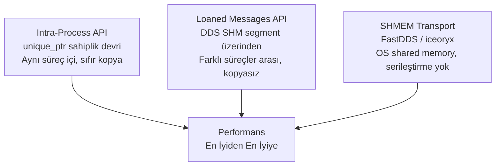

### Loaned Messages API — DDS Düzeyi Sıfır Kopya

Loaned Messages, mesaj belleğini DDS middleware'den **ödünç alır**; mesaj, yayınlandıktan sonra publisher'ın değil DDS'in yönettiği bellekte yaşar. Subscriber aynı belleği okur — hiç kopya olmaz.

```cpp title="loaned_publisher.cpp"
#include "rclcpp/rclcpp.hpp"
#include "std_msgs/msg/float64_multi_array.hpp"

class LoanedPublisher : public rclcpp::Node {
public:
    LoanedPublisher() : Node("loaned_pub") {
        pub_ = create_publisher<std_msgs::msg::Float64MultiArray>("/data", 10);

        timer_ = create_wall_timer(std::chrono::milliseconds(10), [this]() {
            // DDS'den bellek ödünç al — malloc çağrısı yok!
            auto loaned = pub_->borrow_loaned_message();
            auto& msg = loaned.get();

            msg.data.resize(1000);
            for (size_t i = 0; i < msg.data.size(); ++i)
                msg.data[i] = static_cast<double>(i);

            // Yayınla — DDS sahipliği alır, kopya olmaz
            pub_->publish(std::move(loaned));
        });
    }

private:
    rclcpp::Publisher<std_msgs::msg::Float64MultiArray>::SharedPtr pub_;
    rclcpp::TimerBase::SharedPtr timer_;
};
```

```cpp title="loaned_subscriber.cpp"
// Subscriber tarafında da aynı belleği referansla al
sub_ = create_subscription<std_msgs::msg::Float64MultiArray>(
    "/data", 10,
    [](std_msgs::msg::Float64MultiArray::ConstSharedPtr msg) {
        // msg, DDS SHM bölgesindeki veriye işaret eder
        // Callback dönünce DDS belleği serbest bırakır
        RCLCPP_INFO(rclcpp::get_logger("sub"), "Boyut: %zu", msg->data.size());
    }
);
```

!!! warning "Loaned Messages Kısıtları"
    - Yalnızca RMW'nin desteklediği tiplerde çalışır (POD türler, sabit boyutlu diziler)
    - `std::vector` gibi dinamik boyutlu alanlar desteklenmeyebilir
    - `rmw_fastrtps_cpp` veya `rmw_cyclonedds_cpp` + iceoryx gereklidir
    - `ros2 topic echo` gibi araçlar loaned mesajları görmek için deserialization yapar

### iceoryx Entegrasyonu (CycloneDDS)

iceoryx, Eclipse Automotive'in geliştirdiği publish-subscribe middleware'idir. CycloneDDS ile entegre olduğunda ROS 2, host içi haberleşmede **tamamen OS shared memory** kullanır.

```
Mesaj akışı (iceoryx ile):
Publisher → iceoryx SHM pool → Subscriber
             ↑ Sıfır kopya, sıfır serileştirme
```

```bash
# Kurulum
sudo apt install ros-humble-rmw-cyclonedds-cpp
sudo apt install iceoryx-posh iceoryx-utils

# RouDi daemon — SHM yöneticisi (root veya capabilities ile)
sudo iox-roudi

# ROS 2 node'larını iceoryx ile başlat
export RMW_IMPLEMENTATION=rmw_cyclonedds_cpp
export CYCLONEDDS_URI='<Discovery><ExternalDomainId>0</ExternalDomainId></Discovery>'
ros2 run my_pkg my_node
```

```xml title="cyclonedds_shm.xml"
<CycloneDDS>
    <Domain>
        <SharedMemory>
            <Enable>true</Enable>
            <SubQueueCapacity>256</SubQueueCapacity>
            <SubHistoryRequest>16</SubHistoryRequest>
            <PubHistoryCapacity>16</PubHistoryCapacity>
            <LogLevel>info</LogLevel>
        </SharedMemory>
    </Domain>
</CycloneDDS>
```

### SHM Performans Karşılaştırması

| Yöntem | Kopyalama | Serileştirme | Kapsam | Gecikme |
|--------|:---------:|:------------:|--------|:-------:|
| Intra-Process | ✗ | ✗ | Aynı süreç | ~100 ns |
| Loaned Msg (FastDDS) | ✗ | ✗ | Aynı host | ~1 µs |
| iceoryx SHM | ✗ | ✗ | Aynı host | ~1 µs |
| UDP Loopback | ✓ | ✓ | Aynı host | ~50 µs |
| UDP Network | ✓ | ✓ | Ağ üzeri | >1 ms |

```bash
# SHM segmentlerini izle
ls /dev/shm/
ipcs -m   # System V shared memory

# iceoryx segment boyutunu kontrol et
ls -lh /dev/shm/iceoryx_*
```

---

## tf2 — Koordinat Dönüşümleri

`tf2`, farklı koordinat çerçevelerindeki (frame) verileri birbirine dönüştüren ROS 2'nin temel kütüphanesidir. Her sensör, robot parçası ve ortam öğesi kendi çerçevesinde ifade edilir; `tf2` bunlar arasındaki geometrik ilişkiyi zaman damgalı olarak takip eder.

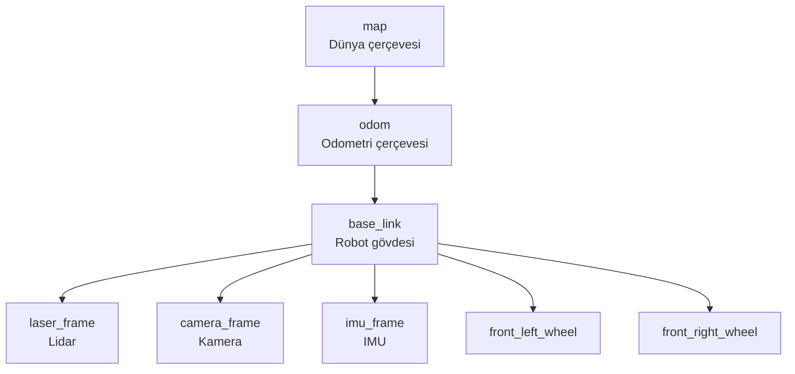

| Çerçeve | Açıklama |
|---------|---------|
| `map` | Küresel sabit referans; SLAM/lokalizasyon yayınlar |
| `odom` | Odometrik sürekli (atlama olmaz); encoder/IMU yayınlar |
| `base_link` | Robot gövde merkezi |
| `base_footprint` | Zemin projeksiyonu; navigasyon için kullanılır |
| `sensor_frame` | Sensörün optik merkezi veya fiziksel merkezi |

### Transform Yayınlama

```cpp title="static_transform.cpp"
#include "geometry_msgs/msg/transform_stamped.hpp"
#include "tf2_ros/static_transform_broadcaster.h"
#include "rclcpp/rclcpp.hpp"

// Statik dönüşüm: kamera gövdeye sabit bağlı
class StaticTFNode : public rclcpp::Node {
public:
    StaticTFNode() : Node("static_tf") {
        broadcaster_ = std::make_shared<tf2_ros::StaticTransformBroadcaster>(this);
        publish_static_transform();
    }

private:
    void publish_static_transform() {
        geometry_msgs::msg::TransformStamped tf;
        tf.header.stamp    = now();
        tf.header.frame_id = "base_link";
        tf.child_frame_id  = "camera_frame";

        tf.transform.translation.x = 0.2;   // 20 cm ileri
        tf.transform.translation.y = 0.0;
        tf.transform.translation.z = 0.5;   // 50 cm yukarı

        // Quaternion: 15° aşağı bak (pitch = -15°)
        tf2::Quaternion q;
        q.setRPY(0.0, -0.261799, 0.0);  // roll, pitch, yaw (radyan)
        tf.transform.rotation.x = q.x();
        tf.transform.rotation.y = q.y();
        tf.transform.rotation.z = q.z();
        tf.transform.rotation.w = q.w();

        broadcaster_->sendTransform(tf);
    }
    std::shared_ptr<tf2_ros::StaticTransformBroadcaster> broadcaster_;
};
```

```cpp title="dynamic_transform.cpp"
#include "tf2_ros/transform_broadcaster.h"

// Dinamik dönüşüm: robot odom çerçevesinde hareket ediyor
class OdomTFNode : public rclcpp::Node {
public:
    OdomTFNode() : Node("odom_tf") {
        broadcaster_ = std::make_unique<tf2_ros::TransformBroadcaster>(*this);

        // Odometri mesajına abone ol ve tf yayınla
        sub_ = create_subscription<nav_msgs::msg::Odometry>(
            "/odom", rclcpp::SensorDataQoS(),
            [this](const nav_msgs::msg::Odometry::SharedPtr msg) {
                geometry_msgs::msg::TransformStamped tf;
                tf.header         = msg->header;           // odom çerçevesi
                tf.child_frame_id = "base_link";

                tf.transform.translation.x = msg->pose.pose.position.x;
                tf.transform.translation.y = msg->pose.pose.position.y;
                tf.transform.translation.z = msg->pose.pose.position.z;
                tf.transform.rotation      = msg->pose.pose.orientation;

                broadcaster_->sendTransform(tf);
            }
        );
    }

private:
    std::unique_ptr<tf2_ros::TransformBroadcaster> broadcaster_;
    rclcpp::Subscription<nav_msgs::msg::Odometry>::SharedPtr sub_;
};
```

### Transform Sorgulama (Lookup)

```cpp title="tf_listener.cpp"
#include "tf2_ros/buffer.h"
#include "tf2_ros/transform_listener.h"
#include "tf2_geometry_msgs/tf2_geometry_msgs.hpp"

class TFLookupNode : public rclcpp::Node {
public:
    TFLookupNode() : Node("tf_lookup") {
        tf_buffer_   = std::make_unique<tf2_ros::Buffer>(get_clock());
        tf_listener_ = std::make_shared<tf2_ros::TransformListener>(*tf_buffer_, this);

        timer_ = create_wall_timer(std::chrono::milliseconds(100), [this]() {
            lookup_transform();
        });
    }

private:
    void lookup_transform() {
        try {
            // "map" → "laser_frame" dönüşümünü şu anda sorgula
            auto tf = tf_buffer_->lookupTransform(
                "map",          // hedef çerçeve
                "laser_frame",  // kaynak çerçeve
                tf2::TimePointZero   // en son mevcut dönüşüm
            );

            RCLCPP_INFO(get_logger(),
                "Pozisyon: [%.3f, %.3f, %.3f]",
                tf.transform.translation.x,
                tf.transform.translation.y,
                tf.transform.translation.z);

        } catch (const tf2::TransformException& ex) {
            RCLCPP_WARN(get_logger(), "TF bulunamadı: %s", ex.what());
        }
    }

    // Nokta dönüşümü örneği
    void transform_point() {
        geometry_msgs::msg::PointStamped pt_in, pt_out;
        pt_in.header.frame_id = "laser_frame";
        pt_in.header.stamp    = now();
        pt_in.point.x = 1.0;
        pt_in.point.y = 0.5;

        try {
            // laser koordinatını map koordinatına çevir
            tf_buffer_->transform(pt_in, pt_out, "map");
            RCLCPP_INFO(get_logger(), "Map'te: [%.3f, %.3f]",
                pt_out.point.x, pt_out.point.y);
        } catch (const tf2::TransformException& ex) {
            RCLCPP_WARN(get_logger(), "%s", ex.what());
        }
    }

    std::unique_ptr<tf2_ros::Buffer> tf_buffer_;
    std::shared_ptr<tf2_ros::TransformListener> tf_listener_;
    rclcpp::TimerBase::SharedPtr timer_;
};
```

```bash
# TF ağacını görselleştir
ros2 run tf2_tools view_frames          # PDF oluşturur

# İki çerçeve arasındaki dönüşümü echo et
ros2 run tf2_ros tf2_echo map base_link

# Gecikmeyi ölç
ros2 run tf2_ros tf2_monitor

# Statik dönüşüm yayınla (hızlı test için)
ros2 run tf2_ros static_transform_publisher \
    0.2 0.0 0.5  0.0 0.0 0.0 1.0 \   # x y z qx qy qz qw
    base_link camera_frame
```

!!! tip "map → odom → base_link Ayrımı"
    - `map → odom`: SLAM/lokalizasyon yayınlar; atlayabilir (discrete jump'lar olabilir)
    - `odom → base_link`: Odometri yayınlar; monoton artar, atlama olmaz
    
    Navigasyon stack'i bu ayrımı kullanır: yerel planlayıcı `odom`'u, küresel planlayıcı `map`'i referans alır.

---

## pluginlib — Çalışma Zamanı Eklenti Mimarisi

`pluginlib`, bir temel sınıfın farklı uygulamalarını **derleme zamanında bağımlılık olmadan** çalışma zamanında yüklemek için kullanılır. Nav2 costmap layer'ları, planlayıcılar, kontrolörler pluginlib kullanır.

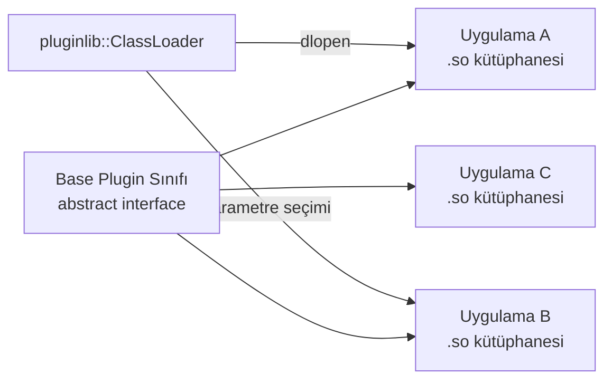

### Temel Sınıf Tanımı

```cpp title="include/my_pkg/base_plugin.hpp"
#pragma once
#include <string>

namespace my_pkg {

class BaseMotionPlanner {
public:
    virtual ~BaseMotionPlanner() = default;

    // Saf sanal — her eklenti uygulamak zorunda
    virtual void initialize(const std::string& name) = 0;
    virtual bool computePath(double goal_x, double goal_y) = 0;
    virtual std::string getName() const = 0;

protected:
    std::string name_;
};

}  // namespace my_pkg
```

### Eklenti Uygulaması

```cpp title="src/my_planner.cpp"
#include "my_pkg/base_plugin.hpp"
#include <pluginlib/class_list_macros.hpp>

namespace my_pkg {

class DijkstraPlanner : public BaseMotionPlanner {
public:
    void initialize(const std::string& name) override {
        name_ = name;
        RCLCPP_INFO(rclcpp::get_logger(name_), "Dijkstra başlatıldı");
    }

    bool computePath(double goal_x, double goal_y) override {
        // Dijkstra algoritması...
        return true;
    }

    std::string getName() const override { return name_; }
};

}  // namespace my_pkg

// Macro: base class → plugin class, paket adı, plugin adı
PLUGINLIB_EXPORT_CLASS(my_pkg::DijkstraPlanner, my_pkg::BaseMotionPlanner)
```

```xml title="plugins.xml"
<library path="my_planner">
    <class type="my_pkg::DijkstraPlanner"
           base_class_type="my_pkg::BaseMotionPlanner">
        <description>Dijkstra tabanlı yol planlayıcı</description>
    </class>
</library>
```

```cmake title="CMakeLists.txt (kritik kısım)"
find_package(pluginlib REQUIRED)

add_library(my_planner SHARED src/my_planner.cpp)
target_link_libraries(my_planner pluginlib::pluginlib)

# package.xml'e export yap
pluginlib_export_plugin_description_file(my_pkg plugins.xml)
```

```xml title="package.xml (export)"
<export>
    <build_type>ament_cmake</build_type>
    <!-- pluginlib bu satırla plugin'i keşfeder -->
    <my_pkg plugin="${prefix}/plugins.xml"/>
</export>
```

### Plugin Yükleme ve Kullanım

```cpp title="plugin_loader.cpp"
#include "pluginlib/class_loader.hpp"
#include "my_pkg/base_plugin.hpp"

int main() {
    // ClassLoader: paket adı, base class tam adı
    pluginlib::ClassLoader<my_pkg::BaseMotionPlanner> loader(
        "my_pkg", "my_pkg::BaseMotionPlanner"
    );

    // Kullanılabilir plugin'leri listele
    for (const auto& cls : loader.getDeclaredClasses())
        std::cout << "Plugin: " << cls << "\n";

    // Runtime'da seç ve yükle
    std::string plugin_name = "my_pkg::DijkstraPlanner";  // parametreden gelebilir
    auto planner = loader.createSharedInstance(plugin_name);

    planner->initialize("my_dijkstra");
    planner->computePath(5.0, 3.0);

    return 0;
}
```

---

## ros2_control — Donanım Kontrol Çerçevesi

`ros2_control`, robot donanımını (motor, encoder, IMU, kamera) soyutlayan standart bir arayüz sağlar. Controller Manager, donanım sürücüleri ve kontrolörler arasındaki koordinasyonu yönetir.

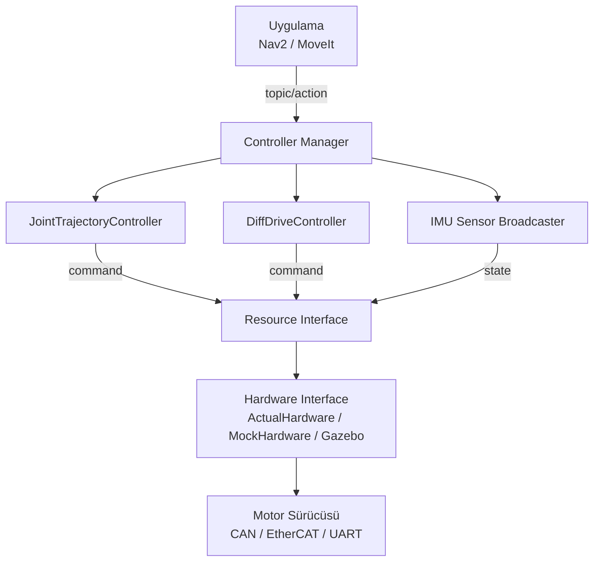

### Command Interface ve State Interface

```cpp title="my_hardware_interface.cpp"
#include "hardware_interface/system_interface.hpp"

namespace my_robot {

class MyRobotHardware : public hardware_interface::SystemInterface {
public:
    // URDF'deki ros2_control bloğundan parametreleri oku
    hardware_interface::CallbackReturn on_init(
        const hardware_interface::HardwareInfo& info) override
    {
        if (SystemInterface::on_init(info) != CallbackReturn::SUCCESS)
            return CallbackReturn::ERROR;

        // Joint sayısı kontrolü
        if (info.joints.size() != 2)
            return CallbackReturn::ERROR;

        hw_positions_.resize(2, 0.0);
        hw_velocities_.resize(2, 0.0);
        hw_commands_.resize(2, 0.0);
        return CallbackReturn::SUCCESS;
    }

    // State interface'leri kaydet (encoder okuma)
    std::vector<hardware_interface::StateInterface> export_state_interfaces() override {
        std::vector<hardware_interface::StateInterface> state_ifs;
        for (size_t i = 0; i < 2; ++i) {
            state_ifs.emplace_back(
                info_.joints[i].name, "position", &hw_positions_[i]);
            state_ifs.emplace_back(
                info_.joints[i].name, "velocity", &hw_velocities_[i]);
        }
        return state_ifs;
    }

    // Command interface'leri kaydet (motor hedef)
    std::vector<hardware_interface::CommandInterface> export_command_interfaces() override {
        std::vector<hardware_interface::CommandInterface> cmd_ifs;
        for (size_t i = 0; i < 2; ++i) {
            cmd_ifs.emplace_back(
                info_.joints[i].name, "velocity", &hw_commands_[i]);
        }
        return cmd_ifs;
    }

    // Gerçek donanımdan oku
    hardware_interface::return_type read(
        const rclcpp::Time&, const rclcpp::Duration&) override
    {
        // CAN bus veya encoder'dan oku
        hw_positions_[0] = read_encoder(0);
        hw_velocities_[0] = read_velocity(0);
        return hardware_interface::return_type::OK;
    }

    // Donanıma yaz
    hardware_interface::return_type write(
        const rclcpp::Time&, const rclcpp::Duration&) override
    {
        // Motor sürücüsüne komut gönder
        send_velocity_command(0, hw_commands_[0]);
        send_velocity_command(1, hw_commands_[1]);
        return hardware_interface::return_type::OK;
    }

private:
    std::vector<double> hw_positions_, hw_velocities_, hw_commands_;
    double read_encoder(int)   { return 0.0; }  // gerçek implementasyon
    double read_velocity(int)  { return 0.0; }
    void send_velocity_command(int, double) {}
};

}  // namespace my_robot

#include "pluginlib/class_list_macros.hpp"
PLUGINLIB_EXPORT_CLASS(my_robot::MyRobotHardware, hardware_interface::SystemInterface)
```

```yaml title="config/ros2_control.yaml"
controller_manager:
  ros__parameters:
    update_rate: 1000  # Hz

diff_drive_controller:
  ros__parameters:
    left_wheel_names:  ["left_wheel_joint"]
    right_wheel_names: ["right_wheel_joint"]
    wheel_separation: 0.35      # m
    wheel_radius:     0.05      # m
    cmd_vel_timeout: 0.5        # s
    publish_odom_tf: true

joint_state_broadcaster:
  ros__parameters:
    joints: ["left_wheel_joint", "right_wheel_joint"]
```

```bash
# Kontrolörleri yönet
ros2 control list_controllers
ros2 control list_hardware_interfaces
ros2 control switch_controllers \
    --activate diff_drive_controller \
    --deactivate joint_trajectory_controller
ros2 control load_controller my_controller --set-state active
```

---

## Test — gtest ve colcon test

ROS 2'de birim test (gtest/ament_gtest) ve entegrasyon test (launch_testing) standart altyapıdır.

### C++ Birim Testi (gtest)

```cpp title="test/test_my_algo.cpp"
#include <gtest/gtest.h>
#include "my_pkg/my_algorithm.hpp"

class AlgoTest : public ::testing::Test {
protected:
    void SetUp() override {
        algo_ = std::make_unique<my_pkg::MyAlgorithm>();
        algo_->initialize(0.01);  // dt = 10ms
    }
    std::unique_ptr<my_pkg::MyAlgorithm> algo_;
};

TEST_F(AlgoTest, ZeroInput) {
    EXPECT_DOUBLE_EQ(algo_->compute(0.0), 0.0);
}

TEST_F(AlgoTest, PositiveInput) {
    double result = algo_->compute(1.0);
    EXPECT_GT(result, 0.0);
    EXPECT_LT(result, 10.0);
}

TEST_F(AlgoTest, NegativeHandling) {
    EXPECT_THROW(algo_->compute(-1.0), std::invalid_argument);
}

// Parameterized test
class AlgoParamTest : public testing::TestWithParam<std::pair<double,double>> {};

TEST_P(AlgoParamTest, InputOutput) {
    auto [input, expected] = GetParam();
    my_pkg::MyAlgorithm algo;
    EXPECT_NEAR(algo.compute(input), expected, 1e-6);
}

INSTANTIATE_TEST_SUITE_P(Inputs, AlgoParamTest, testing::Values(
    std::make_pair(0.0, 0.0),
    std::make_pair(1.0, 0.5),
    std::make_pair(2.0, 1.0)
));
```

```cmake title="CMakeLists.txt (test bölümü)"
if(BUILD_TESTING)
    find_package(ament_cmake_gtest REQUIRED)
    find_package(ament_lint_auto REQUIRED)

    # Linting (opsiyonel)
    ament_lint_auto_find_test_dependencies()

    # gtest hedefi
    ament_add_gtest(test_my_algo
        test/test_my_algo.cpp
    )
    target_link_libraries(test_my_algo my_algo_lib)
endif()
```

### Launch Testing (Entegrasyon Testi)

```python title="test/test_node_integration.py"
import pytest
import rclpy
import launch
import launch_ros.actions
import launch_testing
import launch_testing.actions

from std_msgs.msg import String

@pytest.mark.launch_test
def generate_test_description():
    node = launch_ros.actions.Node(
        package='my_pkg',
        executable='my_node',
        name='test_node'
    )
    return launch.LaunchDescription([
        node,
        launch_testing.actions.ReadyToTest()
    ])


class TestMyNode(launch_testing.TestCase):
    def test_publishes_message(self, proc_output):
        """Node'un /chatter topic'ine yayın yaptığını doğrula"""
        rclpy.init()
        node = rclpy.create_node('test_node_client')
        received = []

        sub = node.create_subscription(
            String, '/chatter', lambda msg: received.append(msg.data), 10
        )

        # 3 saniye bekle, mesaj gelmeli
        end_time = node.get_clock().now() + rclpy.duration.Duration(seconds=3)
        while node.get_clock().now() < end_time:
            rclpy.spin_once(node, timeout_sec=0.1)
            if received:
                break

        self.assertGreater(len(received), 0, "Hiç mesaj alınmadı")
        node.destroy_node()
        rclpy.shutdown()
```

```bash
# Tüm testleri çalıştır
colcon test --packages-select my_pkg

# Test sonuçlarını göster
colcon test-result --all --verbose

# Sadece belirli test
colcon test --packages-select my_pkg \
    --pytest-args -k "test_publishes"

# Kapsam raporu (gcov)
colcon build --cmake-args -DCMAKE_BUILD_TYPE=Debug \
    -DCMAKE_CXX_FLAGS="--coverage"
lcov --capture --directory build/ --output-file coverage.info
genhtml coverage.info --output-directory coverage_html/
```

---

## SROS2 — Güvenlik

SROS2, DDS-Security standardı üzerinden şifreleme, kimlik doğrulama ve erişim kontrolü sağlar. Her node bir **kimlik (identity)** ve **izin belgesi** ile imzalanır.

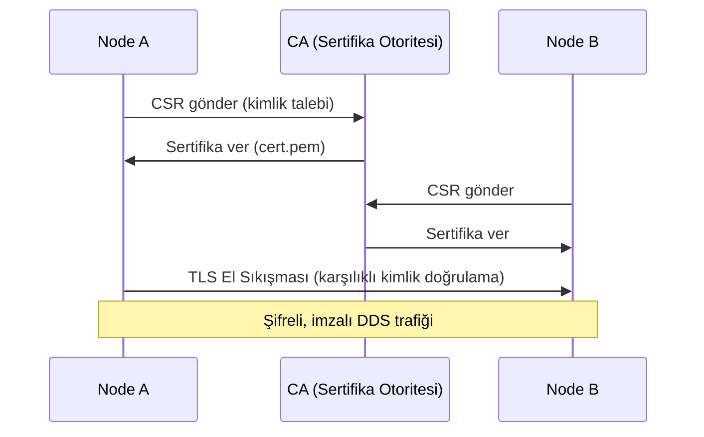

```bash
# 1. Güvenlik alanı (security enclave) oluştur
mkdir ~/my_security_ws && cd ~/my_security_ws
ros2 security create_keystore keystore

# 2. Her node için anahtar ve sertifika üret
ros2 security create_enclave keystore /my_robot/sensor_node
ros2 security create_enclave keystore /my_robot/controller_node
ros2 security create_enclave keystore /my_robot/planner_node

# Oluşturulan dosyalar:
# keystore/
# ├─ public/   ← CA sertifikası (herkese dağıtılabilir)
# ├─ private/  ← CA özel anahtarı (güvenli tut!)
# └─ enclaves/
#     └─ my_robot/
#         ├─ sensor_node/
#         │   ├─ cert.pem
#         │   ├─ key.pem
#         │   ├─ identity_ca.cert.pem
#         │   ├─ permissions_ca.cert.pem
#         │   ├─ permissions.p7s  (erişim politikaları)
#         │   └─ governance.p7s   (şifreleme politikaları)
```

```bash
# 3. Node'ları güvenli başlat
export ROS_SECURITY_KEYSTORE=~/my_security_ws/keystore
export ROS_SECURITY_ENABLE=true
export ROS_SECURITY_STRATEGY=Enforce   # Sertifika yoksa başlatma

ros2 run my_pkg sensor_node \
    --ros-args --enclave /my_robot/sensor_node
```

```xml title="keystore/enclaves/my_robot/sensor_node/policy.xml"
<?xml version="1.0" encoding="UTF-8"?>
<policy version="0.2.0">
    <enclaves>
        <enclave path="/my_robot/sensor_node">
            <profiles>
                <profile ns="/" node="sensor_node">
                    <topics publish="ALLOW" subscribe="DENY">
                        <topic>*/scan</topic>
                        <topic>*/camera/image_raw</topic>
                    </topics>
                    <services reply="DENY" request="DENY"/>
                </profile>
            </profiles>
        </enclave>
    </enclaves>
</policy>
```

!!! warning "SROS2 Üretim Notları"
    - CA özel anahtarını (`private/`) asla robot üzerinde tutmayın
    - `ROS_SECURITY_STRATEGY=Enforce` → sertifikasız node başlamaz (güvenli)
    - `ROS_SECURITY_STRATEGY=Permissive` → sertifikasız node başlar ama şifresiz (test için)
    - Sertifika süresi dolarsa tüm sistem iletişimi durur — otomatik yenileme planı yapın

---

## Gerçek Zamanlı (Real-Time) ROS 2

Gerçek zamanlı sistemlerde determinizm kritiktir: callback gecikmesi, bellek tahsisi, scheduler gecikmesi minimize edilmelidir.

### RT-Executor Kalıbı

```cpp title="realtime_node.cpp"
#include "rclcpp/rclcpp.hpp"
#include "rclcpp/strategies/allocator_memory_strategy.hpp"
#include <pthread.h>
#include <sched.h>
#include <sys/mman.h>

// RT-uyumlu allocator (bellek dönüşü yok)
using Alloc = std::allocator<void>;
using ExecutorT = rclcpp::executors::StaticSingleThreadedExecutor;

int main(int argc, char** argv) {
    rclcpp::init(argc, argv);

    // Belleği önceden kilitle — sayfa hatası yok
    mlockall(MCL_CURRENT | MCL_FUTURE);

    // SCHED_FIFO — RT zamanlayıcı (root gerektirir)
    struct sched_param sp;
    sp.sched_priority = 80;
    pthread_setschedparam(pthread_self(), SCHED_FIFO, &sp);

    // StaticSingleThreadedExecutor — dinamik bellek yok
    auto exec = std::make_unique<ExecutorT>();

    auto node = std::make_shared<MyRTNode>();
    exec->add_node(node);

    // spin() döngüsü RT thread üzerinde çalışır
    exec->spin();

    rclcpp::shutdown();
    return 0;
}
```

```cpp title="RT-uyumlu Node kalıpları"
class MyRTNode : public rclcpp::Node {
public:
    MyRTNode() : Node("rt_node") {
        // Önceden bellek ayır — RT döngüsünde tahsis yok
        cmd_.data.reserve(1000);
        history_.reserve(500);

        // StaticSingleThreadedExecutor ile uyumlu subscription
        sub_ = create_subscription<sensor_msgs::msg::LaserScan>(
            "/scan", rclcpp::SensorDataQoS(),
            [this](sensor_msgs::msg::LaserScan::ConstSharedPtr msg) {
                // Callback — RT kurallarına uy:
                // ✗ malloc/new çağırma
                // ✗ mutex ile kilitle (priority inversion)
                // ✗ I/O yapma
                // ✓ Önceden ayrılan belleği kullan
                // ✓ lock-free veri yapıları kullan
                process_scan(*msg);
            }
        );
    }

private:
    void process_scan(const sensor_msgs::msg::LaserScan& scan) {
        // lock-free ring buffer ile log
        // rt_printf yerine RCLCPP_INFO_SKIPFIRST_THROTTLE
    }

    sensor_msgs::msg::LaserScan cmd_;
    std::vector<double> history_;
    rclcpp::Subscription<sensor_msgs::msg::LaserScan>::SharedPtr sub_;
};
```

```bash
# RT thread önceliği ver
sudo chrt -f 80 ros2 run my_pkg rt_node

# CPU affinity — RT node'u belirli çekirdeğe sabitle
sudo taskset -c 3 ros2 run my_pkg rt_node

# Kernel RT yamaları kontrolü
uname -r | grep PREEMPT_RT
cat /sys/kernel/realtime

# Gecikme testi
cyclictest -t 4 -p 80 -i 1000 -l 10000
```

### Priority Inversion Sorunu

```
Tehlike: RT thread (yüksek öncelik) mutex bekliyor →
         Normal thread (düşük öncelik) mutex tutuyor ama schedule edilemiyor →
         RT thread bloklandı, determinizm bozuldu

Çözüm: PTHREAD_MUTEX_PROTOCOL = PTHREAD_PRIO_INHERIT
       veya lock-free veri yapıları (atomic, ring buffer)
```

```cpp
// Priority inheritance mutex
pthread_mutex_t rt_mutex;
pthread_mutexattr_t attr;
pthread_mutexattr_init(&attr);
pthread_mutexattr_setprotocol(&attr, PTHREAD_PRIO_INHERIT);
pthread_mutex_init(&rt_mutex, &attr);
```

---

## Diagnostics — Sistem Sağlık İzleme

`diagnostic_updater`, node'ların kendi sağlık durumlarını standart formatta yayınlamasını sağlar. `diagnostic_aggregator` bunları toplar; operatör uyarı/hata mesajları alır.

```cpp title="diagnostic_node.cpp"
#include "diagnostic_updater/diagnostic_updater.hpp"
#include "diagnostic_updater/publisher.hpp"

class SensorNode : public rclcpp::Node {
public:
    SensorNode() : Node("sensor_node"),
                   updater_(this)   // diagnostic_updater node'a bağlı
    {
        updater_.setHardwareID("IMU-BNO055-SN12345");

        // Periyodik sağlık kontrolleri ekle
        updater_.add("IMU Bağlantısı", this, &SensorNode::checkIMU);
        updater_.add("Sıcaklık",       this, &SensorNode::checkTemp);
        updater_.add("Veri Hızı",      this, &SensorNode::checkRate);

        // Minimum yayın hızı kontrolü (FrequencyStatus)
        double min_hz = 50.0, max_hz = 200.0;
        freq_status_ = std::make_shared<diagnostic_updater::FrequencyStatus>(
            diagnostic_updater::FrequencyStatusParam(&min_hz, &max_hz)
        );
        updater_.add(*freq_status_);

        // Yayın zaman damgası gecikmesi kontrolü (TimeStampStatus)
        ts_status_ = std::make_shared<diagnostic_updater::TimeStampStatus>(
            diagnostic_updater::TimeStampStatusParam()
        );
        updater_.add(*ts_status_);
    }

private:
    void checkIMU(diagnostic_updater::DiagnosticStatusWrapper& stat) {
        if (imu_connected_) {
            stat.summary(diagnostic_msgs::msg::DiagnosticStatus::OK, "IMU bağlı");
            stat.add("Seri No", "SN12345");
            stat.add("Firmware", "v3.2");
        } else {
            stat.summary(diagnostic_msgs::msg::DiagnosticStatus::ERROR, "IMU bağlantı yok");
        }
    }

    void checkTemp(diagnostic_updater::DiagnosticStatusWrapper& stat) {
        float temp = read_temperature();
        if (temp > 85.0f) {
            stat.summaryf(diagnostic_msgs::msg::DiagnosticStatus::ERROR,
                          "Aşırı ısı: %.1f°C", temp);
        } else if (temp > 70.0f) {
            stat.summaryf(diagnostic_msgs::msg::DiagnosticStatus::WARN,
                          "Yüksek sıcaklık: %.1f°C", temp);
        } else {
            stat.summaryf(diagnostic_msgs::msg::DiagnosticStatus::OK, "Normal: %.1f°C", temp);
        }
        stat.add("Sıcaklık (°C)", temp);
    }

    void checkRate(diagnostic_updater::DiagnosticStatusWrapper& stat) {
        // Ölçülen yayın hızını kontrol et
        freq_status_->run(stat);
    }

    bool imu_connected_ = true;
    float read_temperature() { return 45.0f; }

    diagnostic_updater::Updater updater_;
    std::shared_ptr<diagnostic_updater::FrequencyStatus> freq_status_;
    std::shared_ptr<diagnostic_updater::TimeStampStatus> ts_status_;
};
```

```bash
# Diagnostics topic'ini izle
ros2 topic echo /diagnostics
ros2 topic echo /diagnostics_agg   # aggregator sonrası

# rqt_runtime_monitor ile görsel izleme
ros2 run rqt_runtime_monitor rqt_runtime_monitor
```

---

## İpuçları ve En İyi Pratikler

!!! tip "Büyük Mesajlar (Görüntü, Nokta Bulutu)"
    - Aynı süreçte işleme varsa → **Component Container + Intra-process**
    - Farklı süreç ama aynı host → **SHM transport** (CycloneDDS+iceoryx veya FastDDS SHM)
    - Farklı host → `image_transport` ile sıkıştırma + UDP

!!! tip "QoS Uyumsuzluğu Tespiti"
    `ros2 topic info /topic -v` çıktısında Publisher ve Subscriber sayısı eşleşiyor ama mesaj gelmiyorsa QoS uyumsuzluğu var demektir. Reliability ve Durability değerlerini karşılaştırın.

!!! tip "Gerçek Zamanlı ROS 2"
    - `StaticSingleThreadedExecutor` kullanın (dinamik bellek yok)
    - Callback'lerde `malloc/new` çağırmayın
    - `SCHED_FIFO` + yüksek öncelik: `sudo chrt -f 80 ros2 run ...`
    - Loaned Messages API'yi kullanın (FastDDS zero-copy)
    - `mlockall(MCL_CURRENT | MCL_FUTURE)` ile sayfa hatalarını önleyin

!!! warning "Domain ID'yi Unutmayın"
    Farklı terminal sekmeleri farklı `ROS_DOMAIN_ID` ile çalışıyorsa node'lar birbirini görmez. `env | grep ROS` ile kontrol edin. `.bashrc`'ye sabitleyin.

```bash
# Hızlı ortam kontrol scripti
echo "=== ROS Ortamı ==="
echo "ROS_DOMAIN_ID: ${ROS_DOMAIN_ID:-0}"
echo "RMW: ${RMW_IMPLEMENTATION:-default}"
echo "LOCALHOST_ONLY: ${ROS_LOCALHOST_ONLY:-0}"
ros2 node list 2>/dev/null | wc -l | xargs echo "Aktif node sayısı:"
```
