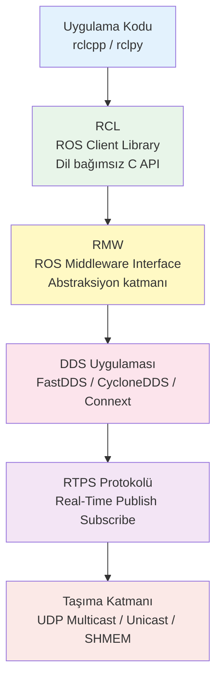
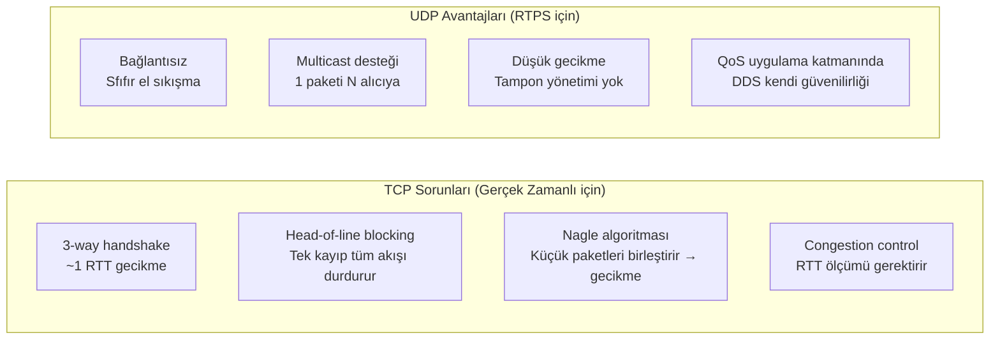
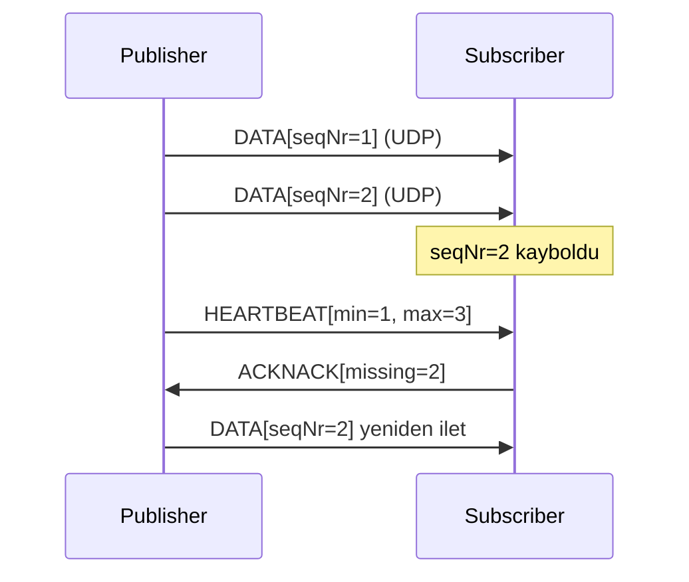
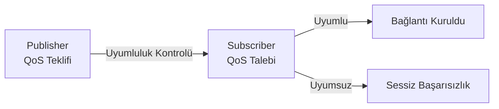
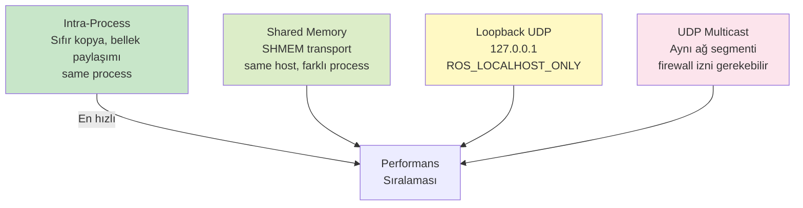
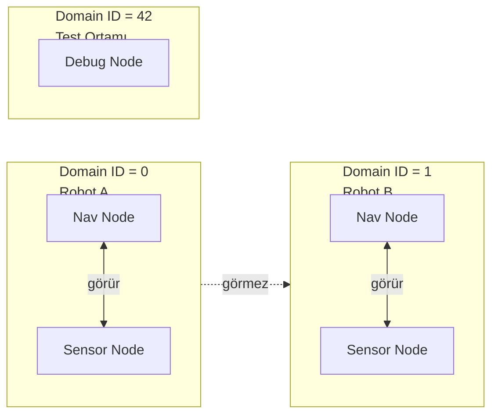
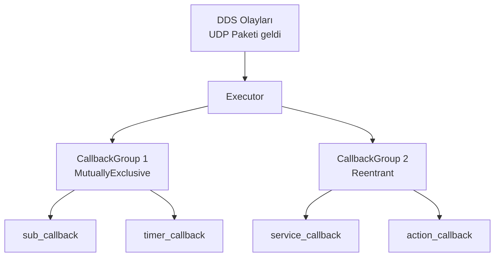
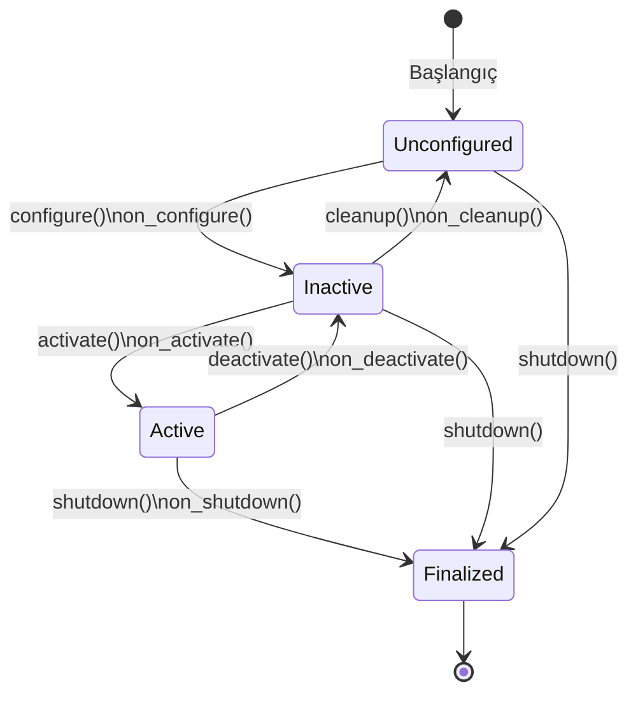

# ROS 2 — Derinlemesine Rehber

!!! note "Genel Bakış"
    ROS 2, robot yazılımı geliştirmek için tasarlanmış meta-işletim sistemidir. ROS 1'deki merkezi `rosmaster` mimarisini tamamen terk ederek **DDS (Data Distribution Service)** üzerine kurulmuş, merkeziyetsiz, gerçek zamanlı yetenekli bir haberleşme altyapısı sunar. Bu sayfa; bir sistem yazılımcısının "neden böyle çalışır?" sorularını yanıtlamak için kaleme alınmıştır.

---

## Mimari Katmanlar



| Katman | Sorumluluk | Değiştirilebilir mi? |
|--------|-----------|:--------------------:|
| **rclcpp/rclpy** | C++/Python API, callback, executor | Dil ile |
| **rcl** | Dil bağımsız çekirdek C API | — |
| **rmw** | DDS bağımsızlık katmanı | ✓ (RMW_IMPLEMENTATION) |
| **DDS** | RTPS, QoS, keşif (discovery) | ✓ |
| **Transport** | UDP / TCP / SHM | DDS yapılandırması ile |

---

## Neden UDP? — Temel Soru

> "TCP güvenilir ama neden ROS 2 UDP tercih eder?"



### UDP + RTPS = Güvenilirlik Kontrolü Uygulama Katmanında

TCP'nin `ACK` / yeniden iletim mekanizmasının eşdeğerini RTPS **uygulama katmanında** kendisi sağlar:

| Mekanizma | TCP | RTPS (DDS üzerinde) |
|-----------|:---:|:-------------------:|
| Güvenilir teslimat | ✓ Kernel | ✓ Uygulama (RTPS ACKNACK) |
| Sıralı teslimat | ✓ | QoS `HISTORY` ile |
| Çoklu alıcı (multicast) | ✗ | ✓ UDP multicast |
| Gecikme önceliği | ✗ | ✓ (güvenilirlik kapatılabilir) |
| Bant genişliği akış kontrolü | Kernel'de | DDS'de |

**Best-effort topic'ler** (sensör akışı, lidar, kamera) için UDP'nin `RELIABLE` mekanizması kullanılmaz — paketin kaybı tolere edilir, düşük gecikme önceliklenir.  
**Güvenilir topic'ler** (hedef gönder, durum güncelleme) için RTPS `ACKNACK` döngüsü paketi yeniden iletir — TCP benzeri garanti, ama multicast desteğiyle.



### UDP Multicast — Discovery

DDS node'ları birbirini bulmak için **PDP (Participant Discovery Protocol)** kullanır. Bu süreç UDP multicast üzerinde yürür:

```
Multicast adresi: 239.255.0.1
Port hesabı:      7400 + 250*DomainID + 0 (PDP)
```

Her node başladığında bu adrese `SPDP_DISCOVERED_PARTICIPANT_DATA` multicast'i gönderir. Aynı domain'deki tüm node'lar dinler, karşılıklı tanışırlar. Ardından **EDP (Endpoint Discovery Protocol)** ile publisher/subscriber eşleşmesi yapılır ve bundan sonra unicast iletişim başlar.

```bash
# Ağdaki DDS trafiğini yakala
sudo tcpdump -i eth0 -n 'udp port 7400' -v

# Multicast gruba katılım kontrolü
ip maddr show
```

---

## DDS ve RTPS Derinlemesine

### DDS Uygulamaları Karşılaştırması

| | **FastDDS** (eProsima) | **CycloneDDS** (Eclipse) | **Connext** (RTI) |
|--|:--------------------:|:---------------------:|:----------------:|
| Lisans | Apache 2.0 | Eclipse/Apache | Ticari |
| ROS 2 varsayılan | Humble+ | Seçenek | Seçenek |
| Shared Memory | ✓ (FastDDS SHM) | ✓ (iox) | ✓ |
| Performans | Yüksek | **En yüksek** | Yüksek |
| Güvenlik (DDS-Sec) | ✓ | ✓ | ✓ |
| WAN desteği | Sınırlı | Sınırlı | ✓ |

```bash
# DDS uygulamasını değiştir
export RMW_IMPLEMENTATION=rmw_cyclonedds_cpp
export RMW_IMPLEMENTATION=rmw_fastrtps_cpp
export RMW_IMPLEMENTATION=rmw_connextdds
```

### RTPS Paket Yapısı

```
┌─────────────────────────────────────────────────────────┐
│ RTPS Header (20 byte)                                    │
│   protocol="RTPS"  version  vendorId  guidPrefix        │
├─────────────────────────────────────────────────────────┤
│ Submessage 1: INFO_TS (zaman damgası)                   │
├─────────────────────────────────────────────────────────┤
│ Submessage 2: DATA                                      │
│   extraFlags  writerEntityId  readerEntityId            │
│   writerSeqNumber  serializedPayload (CDR kodlu veri)   │
├─────────────────────────────────────────────────────────┤
│ Submessage 3: HEARTBEAT / ACKNACK / GAP (güvenilir mod) │
└─────────────────────────────────────────────────────────┘
```

**CDR (Common Data Representation):** ROS 2'nin serileştirme formatı. Mesaj yapısı kaynak dilden bağımsız olarak CDR'ye dönüştürülür, karşı tarafta geri çözülür. Bu, C++ node ile Python node'un sorunsuz haberleşmesini sağlar.

---

## QoS — Kalite Servis Politikaları

QoS, publisher ve subscriber arasındaki davranış sözleşmesidir. **Uyumsuz QoS → bağlantı kurulamaz** (sessiz hata; `ros2 topic info -v` ile görülür).



### Temel QoS Politikaları

=== "Reliability"

    | Değer | Açıklama | Ne zaman |
    |-------|---------|:--------:|
    | `RELIABLE` | Kayıp paket yeniden iletilir (RTPS ACKNACK) | Komutlar, servisler |
    | `BEST_EFFORT` | Kayıp tolere edilir, gecikme öncelikli | Sensör akışı, video |

    !!! warning "Uyumluluk Kuralı"
        Publisher `BEST_EFFORT` → Subscriber sadece `BEST_EFFORT` bağlanabilir.  
        Publisher `RELIABLE` → Subscriber hem `RELIABLE` hem `BEST_EFFORT` bağlanabilir.

=== "Durability"

    | Değer | Açıklama | Ne zaman |
    |-------|---------|:--------:|
    | `VOLATILE` | Geç bağlanan subscriber önceki mesajları almaz | Default |
    | `TRANSIENT_LOCAL` | Publisher önceki N mesajı önbelleğe alır; geç bağlanan alır | Harita, statik parametreler |

    `TRANSIENT_LOCAL` + `HISTORY KEEP_LAST 1` = "en son değer her zaman mevcut" kalıbı — `/map`, `/robot_description` gibi topic'lerde standart kullanım.

=== "History"

    | Değer | Açıklama |
    |-------|---------|
    | `KEEP_LAST(N)` | Son N mesajı tampona al; publisher de subscriber de belirtir |
    | `KEEP_ALL` | Tüm mesajları tut (bellek sınırsız) |

=== "Deadline"

    Publisher veya subscriber'ın belirli bir sürede mesaj göndermesini/almasını zorunlu kılar. Süresi aşılırsa `on_deadline_missed()` callback'i tetiklenir.

    ```cpp
    rclcpp::QoS qos(10);
    qos.deadline(std::chrono::milliseconds(100));  // 10 Hz zorunlu
    ```

=== "Liveliness"

    Node'un hâlâ "canlı" olduğunu beyan eder. Yazılımsal watchdog gibi çalışır.

    | Değer | Açıklama |
    |-------|---------|
    | `AUTOMATIC` | DDS altyapısı yönetir |
    | `MANUAL_BY_TOPIC` | Uygulama `assert_liveliness()` çağırmalı |

=== "Lifespan"

    Mesajın belirli bir süre sonra "bayat" sayılıp atılmasını sağlar.

    ```cpp
    qos.lifespan(std::chrono::milliseconds(500));  // 500ms sonra eskir
    ```

### Hazır QoS Profilleri

```cpp
#include "rclcpp/rclcpp.hpp"

// Sensör verisi: best-effort, volatile, keep-last-5
auto sensor_qos = rclcpp::SensorDataQoS();

// Sistem varsayılan
auto default_qos = rclcpp::SystemDefaultsQoS();

// Servisler için
auto services_qos = rclcpp::ServicesQoS();

// Parametre olayları
auto param_qos = rclcpp::ParameterEventsQoS();
```

```python
from rclpy.qos import QoSProfile, ReliabilityPolicy, DurabilityPolicy, HistoryPolicy

qos = QoSProfile(
    reliability=ReliabilityPolicy.RELIABLE,
    durability=DurabilityPolicy.TRANSIENT_LOCAL,
    history=HistoryPolicy.KEEP_LAST,
    depth=10
)
```

```bash
# QoS uyumsuzluğunu teşhis et
ros2 topic info /my_topic -v
# "Publisher count: 1, Subscriber count: 1" ama mesaj gelmiyorsa → QoS uyumsuzluğu
```

---

## Haberleşme Katmanları — Yerel'den Uzak'a

ROS 2, aynı süreci paylaşan node'lardan farklı makinelerdeki node'lara kadar **dört farklı haberleşme katmanını** otomatik olarak seçer.



### 1. Intra-Process Communication (Sıfır Kopya)

Aynı süreçteki node'lar arasında mesaj **bellek kopyalanmadan** aktarılır. `std::unique_ptr<T>` mesaj sahipliğini aktarır; `std::shared_ptr<T>` birden fazla subscriber için paylaşır.

```cpp title="intra_process_demo.cpp"
#include "rclcpp/rclcpp.hpp"
#include "std_msgs/msg/int32.hpp"

class Producer : public rclcpp::Node {
public:
    Producer() : Node("producer", rclcpp::NodeOptions().use_intra_process_comms(true)) {
        pub_ = create_publisher<std_msgs::msg::Int32>("/data", 10);
        timer_ = create_wall_timer(std::chrono::milliseconds(100), [this]() {
            // unique_ptr ile sahiplik devri — sıfır kopya!
            auto msg = std::make_unique<std_msgs::msg::Int32>();
            msg->data = count_++;
            RCLCPP_INFO(get_logger(), "Gönder: %d @%p", msg->data, (void*)msg.get());
            pub_->publish(std::move(msg));   // move → kopya yok
        });
    }
private:
    rclcpp::Publisher<std_msgs::msg::Int32>::SharedPtr pub_;
    rclcpp::TimerBase::SharedPtr timer_;
    int count_ = 0;
};

class Consumer : public rclcpp::Node {
public:
    Consumer() : Node("consumer", rclcpp::NodeOptions().use_intra_process_comms(true)) {
        sub_ = create_subscription<std_msgs::msg::Int32>(
            "/data", 10,
            [this](std_msgs::msg::Int32::UniquePtr msg) {
                // Aynı bellek adresi! Kopya yapılmadı.
                RCLCPP_INFO(get_logger(), "Al: %d @%p", msg->data, (void*)msg.get());
            }
        );
    }
private:
    rclcpp::Subscription<std_msgs::msg::Int32>::SharedPtr sub_;
};

int main(int argc, char** argv) {
    rclcpp::init(argc, argv);
    rclcpp::executors::SingleThreadedExecutor exec;
    auto prod = std::make_shared<Producer>();
    auto cons = std::make_shared<Consumer>();
    exec.add_node(prod);
    exec.add_node(cons);
    exec.spin();
    rclcpp::shutdown();
}
```

!!! tip "Ne Zaman İntra-Process Kullanılır?"
    - Kamera/Lidar verisi gibi büyük mesajların aynı süreçte işlenmesi gerektiğinde
    - Latency'nin mikrosaniye düzeyinde kritik olduğu durumlar
    - Serileştirme maliyetinden kaçınmak için
    
    **Kural:** Node'ları aynı `Component Container` içinde çalıştırın ve `use_intra_process_comms(true)` ayarlayın.

### 2. Shared Memory (SHMEM) Transport

Farklı süreçlerdeki node'lar arasında paylaşılan bellek üzerinden haberleşme. FastDDS ve CycloneDDS (iceoryx ile) destekler.

```xml title="fastdds_shm.xml"
<?xml version="1.0" encoding="UTF-8" ?>
<profiles xmlns="http://www.eprosima.com/XMLSchemas/fastRTPS_Profiles">
    <transport_descriptors>
        <transport_descriptor>
            <transport_id>shm_transport</transport_id>
            <type>SHM</type>
            <maxMessageSize>4194304</maxMessageSize>  <!-- 4 MB -->
        </transport_descriptor>
    </transport_descriptors>
    <participant profile_name="shm_participant" is_default_profile="true">
        <rtps>
            <userTransports>
                <transport_id>shm_transport</transport_id>
            </userTransports>
            <useBuiltinTransports>false</useBuiltinTransports>
        </rtps>
    </participant>
</profiles>
```

```bash
export FASTRTPS_DEFAULT_PROFILES_FILE=/path/to/fastdds_shm.xml
```

**CycloneDDS + iceoryx (zero-copy across processes):**

```bash
sudo apt install ros-humble-rmw-cyclonedds-cpp iceoryx-runtime iceoryx-posh
export RMW_IMPLEMENTATION=rmw_cyclonedds_cpp
# iceoryx daemon başlat (SHM yönetimi için)
sudo iox-roudi -c /etc/iceoryx/roudi_config.toml
```

### 3. Localhost Only (Geliştirme İzolasyonu)

```bash
export ROS_LOCALHOST_ONLY=1
# Tüm DDS trafiği 127.0.0.1 üzerinden geçer
# Ağdaki başka cihazlar bu node'ları göremez
```

**Ne zaman kullanılır:**
- Geliştirme ortamında izolasyon istediğinizde
- Aynı makinede birden fazla ROS 2 sistemi çalışıyorken
- Güvenlik duvarı veya VPN olmaksızın güvenli olmayan ağlarda

### 4. Domain ID ile Ağ Segmentasyonu



```bash
export ROS_DOMAIN_ID=42   # 0–101 güvenli aralık

# Port hesabı (ROS 2 spesifikasyonu)
# PDP Multicast: 7400 + 250*DomainID
# User Unicast:  7412 + 250*DomainID + participantID*2

# Domain 0 için: 7400 (multicast), 7412+ (unicast)
# Domain 42 için: 7400+250*42=17900, 17912+ (unicast)
```

!!! warning "Domain ID Port Çakışması"
    Linux ephemeral port aralığı: `/proc/sys/net/ipv4/ip_local_port_range` (genellikle 32768–60999).  
    Domain ID 101 üzeri bu aralıkla çakışabilir. `ros2 doctor` ile kontrol edin.

---

## Component ve Executor Mimarisi

### Component Container — Tek Süreçte Çoklu Node

Birden fazla node'u tek süreç içinde çalıştırır. Avantajları:
- Intra-process communication (sıfır kopya)
- Daha az bellek kullanımı (DDS participant başına maliyet azalır)
- Daha az süreç = daha az OS context switch

```bash
# Component container başlat
ros2 run rclcpp_components component_container

# Node'ları dinamik yükle
ros2 component load /ComponentManager my_pkg my_pkg::MyNode
ros2 component list
ros2 component unload /ComponentManager 1
```

```cpp title="my_component.hpp"
#include "rclcpp/rclcpp.hpp"
#include "rclcpp_components/register_node_macro.hpp"

namespace my_pkg {

class MyNode : public rclcpp::Node {
public:
    explicit MyNode(const rclcpp::NodeOptions & options)
    : Node("my_node", options) {
        // NodeOptions içinde intra-process ayarı
        // Container geçirirse otomatik etkinleşir
    }
};

}  // namespace my_pkg

RCLCPP_COMPONENTS_REGISTER_NODE(my_pkg::MyNode)
```

```cmake title="CMakeLists.txt (component kaydı)"
add_library(my_node SHARED src/my_node.cpp)
rclcpp_components_register_node(my_node
    PLUGIN "my_pkg::MyNode"
    EXECUTABLE my_node_exe
)
```

### Executor — Callback Zamanlama Mekanizması

Executor, DDS'den gelen olayları (mesaj, timer, servis) alır ve callback'leri çalıştırır.



```cpp title="Executor Tipleri"
// Tek thread — en basit, callback'ler sırayla çalışır
rclcpp::executors::SingleThreadedExecutor exec;

// Çok thread — thread_count kadar paralel callback
rclcpp::executors::MultiThreadedExecutor exec(
    rclcpp::ExecutorOptions(), 4  // 4 thread
);

// Statik tek thread — compile time optimizasyon (gerçek zamanlı için)
rclcpp::executors::StaticSingleThreadedExecutor exec;

exec.add_node(node);
exec.spin();
```

```cpp title="Callback Groups"
// MutuallyExclusive: Aynı gruptaki callback'ler aynı anda çalışamaz
auto mutex_group = node->create_callback_group(
    rclcpp::CallbackGroupType::MutuallyExclusive);

// Reentrant: Paralel çalışabilir
auto reentrant_group = node->create_callback_group(
    rclcpp::CallbackGroupType::Reentrant);

// Subscription'a callback group ata
rclcpp::SubscriptionOptions opts;
opts.callback_group = mutex_group;
auto sub = node->create_subscription<MsgType>("/topic", 10, callback, opts);

// MultiThreaded executor ile birlikte kullan!
rclcpp::executors::MultiThreadedExecutor exec(rclcpp::ExecutorOptions(), 4);
```

---

## Lifecycle Node — Yönetilen Yaşam Döngüsü

Lifecycle node, node'un durumunu dışarıdan kontrol etmeyi sağlar. Kritik sistem bileşenlerinde güvenli başlatma/kapama için kullanılır.



```cpp title="lifecycle_node.cpp"
#include "rclcpp_lifecycle/lifecycle_node.hpp"

class MyLifecycleNode : public rclcpp_lifecycle::LifecycleNode {
public:
    MyLifecycleNode() : LifecycleNode("my_lifecycle_node") {}

    rclcpp_lifecycle::node_interfaces::LifecycleNodeInterface::CallbackReturn
    on_configure(const rclcpp_lifecycle::State&) override {
        // Kaynakları tahsis et ama yayınlamaya başlama
        pub_ = create_publisher<std_msgs::msg::String>("/output", 10);
        RCLCPP_INFO(get_logger(), "Configured");
        return CallbackReturn::SUCCESS;
    }

    rclcpp_lifecycle::node_interfaces::LifecycleNodeInterface::CallbackReturn
    on_activate(const rclcpp_lifecycle::State&) override {
        // Publisher'ı aktif et
        pub_->on_activate();
        RCLCPP_INFO(get_logger(), "Activated");
        return CallbackReturn::SUCCESS;
    }

    rclcpp_lifecycle::node_interfaces::LifecycleNodeInterface::CallbackReturn
    on_deactivate(const rclcpp_lifecycle::State&) override {
        pub_->on_deactivate();
        return CallbackReturn::SUCCESS;
    }

    rclcpp_lifecycle::node_interfaces::LifecycleNodeInterface::CallbackReturn
    on_cleanup(const rclcpp_lifecycle::State&) override {
        pub_.reset();
        return CallbackReturn::SUCCESS;
    }

private:
    rclcpp_lifecycle::LifecyclePublisher<std_msgs::msg::String>::SharedPtr pub_;
};
```

```bash
# Durum geçişlerini tetikle
ros2 lifecycle set /my_lifecycle_node configure
ros2 lifecycle set /my_lifecycle_node activate
ros2 lifecycle get /my_lifecycle_node
ros2 lifecycle list /my_lifecycle_node
```

---

## Paket Oluşturma ve Çalışma Alanı

### Dizin Yapısı

```
<workspace>/
├─ src/                    # Paket kaynak kodları
│   ├─ my_cpp_pkg/
│   │   ├─ include/my_cpp_pkg/
│   │   ├─ src/
│   │   ├─ CMakeLists.txt
│   │   └─ package.xml
│   └─ my_py_pkg/
│       ├─ my_py_pkg/
│       ├─ setup.py
│       └─ package.xml
├─ build/                  # Derleme dosyaları (git'e ekleme)
├─ install/                # Kurulum (setup.bash buradan source edilir)
└─ log/                    # Derleme ve runtime logları
```

```bash
# Ortam hazırlama
echo "source /opt/ros/humble/setup.bash" >> ~/.bashrc
echo "source /usr/share/colcon_argcomplete/hook/colcon-argcomplete.bash" >> ~/.bashrc

# Bağımlılıkları kur
rosdep update
rosdep install --from-paths src --ignore-src --rosdistro humble -y

# Paket oluşturma
ros2 pkg create --build-type ament_cmake \
    --node-name my_node \
    --license Apache-2.0 \
    --dependencies rclcpp std_msgs geometry_msgs \
    my_cpp_pkg

# Derleme
colcon build                                        # Tümünü derle
colcon build --packages-select my_cpp_pkg          # Seçili paket
colcon build --symlink-install --packages-select my_py_pkg  # Python symlink
colcon build --cmake-args -DCMAKE_BUILD_TYPE=RelWithDebInfo  # Debug sembollü
colcon graph                                        # Bağımlılık grafiği

# Aktif et
source install/setup.bash

# Çalıştır
ros2 run my_cpp_pkg my_node --ros-args --log-level debug
ros2 launch my_pkg bringup.launch.py
```

---

## Node, Topic, Service, Action

### Node

```bash
ros2 node list                   # Aktif node'lar
ros2 node info /my_node          # Publisher, subscriber, servis, parametre listesi
```

```cpp title="Minimal C++ Node"
#include "rclcpp/rclcpp.hpp"
#include "std_msgs/msg/string.hpp"

class MinimalNode : public rclcpp::Node {
public:
    MinimalNode() : Node("minimal_node") {
        pub_ = create_publisher<std_msgs::msg::String>("/chatter", 10);
        sub_ = create_subscription<std_msgs::msg::String>(
            "/chatter", 10,
            [this](const std_msgs::msg::String::SharedPtr msg) {
                RCLCPP_INFO(get_logger(), "Alındı: %s", msg->data.c_str());
            }
        );
        timer_ = create_wall_timer(std::chrono::seconds(1), [this]() {
            auto msg = std_msgs::msg::String();
            msg.data = "Merhaba ROS2 #" + std::to_string(count_++);
            pub_->publish(msg);
        });
    }
private:
    rclcpp::Publisher<std_msgs::msg::String>::SharedPtr pub_;
    rclcpp::Subscription<std_msgs::msg::String>::SharedPtr sub_;
    rclcpp::TimerBase::SharedPtr timer_;
    size_t count_ = 0;
};

int main(int argc, char** argv) {
    rclcpp::init(argc, argv);
    rclcpp::spin(std::make_shared<MinimalNode>());
    rclcpp::shutdown();
}
```

### Topic

```bash
ros2 topic list -t                                              # Tip bilgisiyle
ros2 topic echo /cmd_vel                                        # Mesajları izle
ros2 topic info /cmd_vel -v                                     # QoS dahil detay
ros2 topic hz /scan                                             # Yayın hızı
ros2 topic bw /camera/image_raw                                 # Bant genişliği
ros2 topic pub /cmd_vel geometry_msgs/msg/Twist \
    "{linear: {x: 0.5}, angular: {z: 0.3}}" -r 10             # 10 Hz yayın
```

### Service

Request-Response modeli; senkron, bloklamalı iletişim.

```bash
ros2 service list -t
ros2 service call /set_bool std_srvs/srv/SetBool "{data: true}"
ros2 service type /my_service
ros2 interface show std_srvs/srv/SetBool
```

```cpp title="Service Server (C++)"
#include "rclcpp/rclcpp.hpp"
#include "std_srvs/srv/set_bool.hpp"

class ServiceNode : public rclcpp::Node {
public:
    ServiceNode() : Node("service_node") {
        srv_ = create_service<std_srvs::srv::SetBool>(
            "/enable",
            [this](const std_srvs::srv::SetBool::Request::SharedPtr req,
                   std_srvs::srv::SetBool::Response::SharedPtr res) {
                enabled_ = req->data;
                res->success = true;
                res->message = enabled_ ? "Aktif" : "Pasif";
                RCLCPP_INFO(get_logger(), "Enable: %d", enabled_);
            }
        );
    }
private:
    rclcpp::Service<std_srvs::srv::SetBool>::SharedPtr srv_;
    bool enabled_ = false;
};
```

### Action

Uzun süreli görevler; Goal → Feedback (periyodik) → Result.

```bash
ros2 action list -t
ros2 action send_goal /navigate_to_pose nav2_msgs/action/NavigateToPose \
    "{pose: {header: {frame_id: 'map'}, pose: {position: {x: 1.0, y: 2.0}}}}" \
    --feedback
```

```cpp title="Action Server (C++)"
#include "rclcpp/rclcpp.hpp"
#include "rclcpp_action/rclcpp_action.hpp"
#include "example_interfaces/action/fibonacci.hpp"

using Fibonacci = example_interfaces::action::Fibonacci;

class FibActionServer : public rclcpp::Node {
public:
    FibActionServer() : Node("fibonacci_action_server") {
        server_ = rclcpp_action::create_server<Fibonacci>(
            this, "/fibonacci",
            [](const rclcpp_action::GoalUUID&, std::shared_ptr<const Fibonacci::Goal>) {
                return rclcpp_action::GoalResponse::ACCEPT_AND_EXECUTE;
            },
            [](std::shared_ptr<rclcpp_action::ServerGoalHandle<Fibonacci>>) {
                return rclcpp_action::CancelResponse::ACCEPT;
            },
            [this](std::shared_ptr<rclcpp_action::ServerGoalHandle<Fibonacci>> handle) {
                std::thread([this, handle]() { execute(handle); }).detach();
            }
        );
    }

private:
    void execute(std::shared_ptr<rclcpp_action::ServerGoalHandle<Fibonacci>> handle) {
        auto feedback = std::make_shared<Fibonacci::Feedback>();
        auto& seq = feedback->partial_sequence;
        seq = {0, 1};
        for (int i = 1; i < handle->get_goal()->order && rclcpp::ok(); ++i) {
            if (handle->is_canceling()) {
                handle->canceled(std::make_shared<Fibonacci::Result>());
                return;
            }
            seq.push_back(seq[i] + seq[i-1]);
            handle->publish_feedback(feedback);
            std::this_thread::sleep_for(std::chrono::milliseconds(100));
        }
        auto result = std::make_shared<Fibonacci::Result>();
        result->sequence = seq;
        handle->succeed(result);
    }
    rclcpp_action::Server<Fibonacci>::SharedPtr server_;
};
```

---

## Launch Sistemi

```python title="bringup.launch.py"
from launch import LaunchDescription
from launch.actions import DeclareLaunchArgument, IncludeLaunchDescription, GroupAction
from launch.conditions import IfCondition
from launch.substitutions import LaunchConfiguration, PathJoinSubstitution
from launch_ros.actions import Node, ComposableNodeContainer, LoadComposableNodes
from launch_ros.descriptions import ComposableNode
from launch_ros.substitutions import FindPackageShare

def generate_launch_description():
    use_sim = LaunchConfiguration('use_sim')

    return LaunchDescription([
        DeclareLaunchArgument('use_sim', default_value='false'),
        DeclareLaunchArgument('log_level', default_value='info'),

        # Başka launch dosyasını dahil et
        IncludeLaunchDescription(
            PathJoinSubstitution([FindPackageShare('my_pkg'), 'launch', 'sensors.launch.py']),
            launch_arguments={'use_sim_time': use_sim}.items()
        ),

        # Kompozit container — intra-process için
        ComposableNodeContainer(
            name='my_container',
            namespace='',
            package='rclcpp_components',
            executable='component_container',
            composable_node_descriptions=[
                ComposableNode(
                    package='my_pkg',
                    plugin='my_pkg::CameraNode',
                    name='camera',
                    parameters=[{'frame_rate': 30.0}]
                ),
                ComposableNode(
                    package='my_pkg',
                    plugin='my_pkg::ProcessorNode',
                    name='processor',
                    remappings=[('/input', '/camera/image')]
                ),
            ],
            output='screen',
        ),

        # Koşullu node
        Node(
            condition=IfCondition(use_sim),
            package='gazebo_ros',
            executable='spawn_entity.py',
            name='spawn_robot',
        ),
    ])
```

---

## Parametreler

```bash
ros2 param list /my_node
ros2 param get  /my_node max_speed
ros2 param set  /my_node max_speed 2.5
ros2 param dump /my_node > params.yaml
ros2 param load /my_node params.yaml
```

```yaml title="config/params.yaml"
my_node:
  ros__parameters:
    max_speed: 3.0
    pid_gains: {p: 1.2, i: 0.01, d: 0.05}
    waypoints: [0.0, 0.0, 1.0, 1.0, 2.0, 2.0]
    enabled: true
```

```cpp title="Parametre Callback (C++)"
#include "rclcpp/rclcpp.hpp"

class ParamNode : public rclcpp::Node {
public:
    ParamNode() : Node("param_node") {
        // Parametre tanımla ve default değer ver
        declare_parameter("max_speed", 1.0);
        declare_parameter("debug", false);

        max_speed_ = get_parameter("max_speed").as_double();

        // Parametre değişim callback'i
        cb_handle_ = add_on_set_parameters_callback(
            [this](const std::vector<rclcpp::Parameter>& params) {
                rcl_interfaces::msg::SetParametersResult result;
                result.successful = true;
                for (const auto& p : params) {
                    if (p.get_name() == "max_speed") {
                        if (p.as_double() < 0.0) {
                            result.successful = false;
                            result.reason = "max_speed negatif olamaz";
                        } else {
                            max_speed_ = p.as_double();
                        }
                    }
                }
                return result;
            }
        );
    }
private:
    double max_speed_;
    rclcpp::node_interfaces::OnSetParametersCallbackHandle::SharedPtr cb_handle_;
};
```

---

## Mesaj ve Servis Arayüzleri

```bash
ros2 interface list                         # Tüm msg/srv/action
ros2 interface show geometry_msgs/msg/Twist # Yapıyı göster
ros2 interface package sensor_msgs         # Paketin arayüzleri
```

```title="msg/Velocity.msg"
std_msgs/Header header
float64 linear_x    # m/s
float64 linear_y    # m/s
float64 angular_z   # rad/s
```

```title="srv/SetTarget.srv"
geometry_msgs/Point target
float64 speed
---
bool success
string message
float64 estimated_time  # saniye
```

```title="action/Navigate.action"
# Goal
geometry_msgs/PoseStamped target_pose
float64 speed_limit
---
# Result
bool success
float64 total_distance
---
# Feedback
geometry_msgs/PoseStamped current_pose
float64 distance_remaining
float64 eta
```

---

## Kayıt ve Yeniden Oynatma (ros2 bag)

```bash
# Kayıt
ros2 bag record -a                               # Tümü
ros2 bag record /scan /odom /cmd_vel -o my_bag  # Seçili topic'ler
ros2 bag record /camera/image_raw \
    --qos-profile-overrides-path qos.yaml        # QoS override ile

# Bilgi
ros2 bag info my_bag/

# Oynatma
ros2 bag play my_bag/
ros2 bag play my_bag/ --loop                     # Döngüsel
ros2 bag play my_bag/ -r 2.0                     # 2x hız
ros2 bag play my_bag/ --topics /scan /odom       # Seçili topic'ler

# Dönüştürme (mcap formatı — Foxglove Studio için)
ros2 bag convert my_bag/ -o mcap_bag/ --output-format mcap
```

---

## Loglama ve Hata Ayıklama

```cpp title="Log seviyeleri (C++)"
RCLCPP_DEBUG(get_logger(), "Detaylı: x=%.3f", x);
RCLCPP_INFO(get_logger(), "Normal bilgi");
RCLCPP_WARN(get_logger(), "Beklenmedik durum");
RCLCPP_ERROR(get_logger(), "Hata: %s", err.c_str());
RCLCPP_FATAL(get_logger(), "Kritik hata, çıkılıyor");

// Throttle — her 1 saniyede en fazla 1 kez log
RCLCPP_INFO_THROTTLE(get_logger(), *get_clock(), 1000, "1Hz log");

// Named logger
RCLCPP_INFO(rclcpp::get_logger("my_subsystem"), "Alt sistem logu");
```

```bash
# Log seviyesi runtime'da değiştir
ros2 run my_pkg my_node --ros-args --log-level debug
ros2 run my_pkg my_node --ros-args --log-level my_node:=warn

# Log dosyaları
ls ~/.ros/log/

# GDB ile debug
ros2 run --prefix "gdbserver localhost:3000" my_pkg my_node
```

```json title=".vscode/launch.json (GDB uzak hata ayıklama)"
{
    "version": "0.2.0",
    "configurations": [{
        "name": "ROS2 GDB",
        "type": "cppdbg",
        "request": "launch",
        "miDebuggerServerAddress": "localhost:3000",
        "miDebuggerPath": "/usr/bin/gdb",
        "program": "${workspaceFolder}/install/my_pkg/lib/my_pkg/my_node",
        "cwd": "${workspaceFolder}",
        "stopAtEntry": false
    }]
}
```

---

## Sistem Sağlık ve Teşhis

```bash
# Sistem tanılama
ros2 doctor --report
ros2 doctor --include-warnings

# Topic sorunları
ros2 topic info /my_topic -v     # QoS uyumsuzluk tespiti
ros2 topic hz /scan              # Frekans düşük mü?
ros2 topic delay /scan           # Gecikme ölçümü

# Node grafiği
rqt_graph                        # Görsel
ros2 run tf2_tools view_frames   # TF ağacı

# Performans izleme
ros2 run rqt_top rqt_top         # CPU/Bellek per node
ros2 run plotjuggler plotjuggler # Zaman serisi görselleştirme
```

```bash
# DDS bağlantı testi
export RMW_IMPLEMENTATION=rmw_cyclonedds_cpp
ros2 multicast receive &
ros2 multicast send

# Ağ trafiğini izle
sudo tcpdump -i any -n 'udp and (port 7400 or portrange 7410-7420)' -v
```

---

## RMW / DDS Yapılandırması

```bash
# FastDDS XML yapılandırması
export FASTRTPS_DEFAULT_PROFILES_FILE=/path/to/fastdds.xml

# CycloneDDS TOML yapılandırması
export CYCLONEDDS_URI=file:///path/to/cyclonedds.xml
```

```xml title="cyclonedds.xml — Performans Ayarı"
<?xml version="1.0" encoding="UTF-8"?>
<CycloneDDS xmlns="https://cdds.io/config" xmlns:xsi="http://www.w3.org/2001/XMLSchema-instance">
    <Domain>
        <General>
            <NetworkInterfaceAddress>eth0</NetworkInterfaceAddress>
            <AllowMulticast>true</AllowMulticast>
        </General>
        <Internal>
            <!-- Büyük mesajlar için tampon artır -->
            <ReceiveBufferSize>25165824</ReceiveBufferSize>
            <SendBufferSize>25165824</SendBufferSize>
            <!-- Shared memory transport -->
            <SharedMemory>
                <Enable>true</Enable>
                <LogLevel>error</LogLevel>
            </SharedMemory>
        </Internal>
    </Domain>
</CycloneDDS>
```

---

## ROS 1 vs ROS 2 — Temel Farklar

| Konu | ROS 1 | ROS 2 |
|------|:-----:|:-----:|
| **Mimari** | Merkezi (rosmaster zorunlu) | Merkeziyetsiz (DDS discovery) |
| **Haberleşme** | XMLRPC (keşif) + TCPROS/UDPROS | DDS / RTPS |
| **Tek hata noktası** | rosmaster çökerse sistem durur | Yok |
| **QoS** | Yok | DDS QoS politikaları |
| **Güvenlik** | Yok | DDS-Security (SROS2) |
| **Gerçek Zaman** | Sınırlı | Destekli (real-time exec) |
| **Windows** | Resmi değil | ✓ |
| **Intra-process** | Yok | ✓ Sıfır kopya |
| **Lifecycle Node** | Yok | ✓ |
| **Component** | Nodelet | ✓ Component |
| **Dil** | C++03/11, Python 2 | C++14/17, Python 3 |

---

## İpuçları ve En İyi Pratikler

!!! tip "Büyük Mesajlar (Görüntü, Nokta Bulutu)"
    - Aynı süreçte işleme varsa → **Component Container + Intra-process**
    - Farklı süreç ama aynı host → **SHM transport** (CycloneDDS+iceoryx veya FastDDS SHM)
    - Farklı host → `image_transport` ile sıkıştırma + UDP

!!! tip "QoS Uyumsuzluğu Tespiti"
    `ros2 topic info /topic -v` çıktısında Publisher ve Subscriber sayısı eşleşiyor ama mesaj gelmiyorsa QoS uyumsuzluğu var demektir. Reliability ve Durability değerlerini karşılaştırın.

!!! tip "Gerçek Zamanlı ROS 2"
    - `StaticSingleThreadedExecutor` kullanın (dinamik bellek yok)
    - Callback'lerde `malloc/new` çağırmayın
    - `SCHED_FIFO` + yüksek öncelik: `sudo chrt -f 90 ros2 run ...`
    - Loaned Messages API'yi kullanın (FastDDS zero-copy)

!!! warning "Domain ID'yi Unutmayın"
    Farklı terminal sekmeleri farklı `ROS_DOMAIN_ID` ile çalışıyorsa node'lar birbirini görmez. `env | grep ROS` ile kontrol edin. `.bashrc`'ye sabitleyin.

```bash
# Hızlı ortam kontrol scripti
echo "=== ROS Ortamı ==="
echo "ROS_DOMAIN_ID: ${ROS_DOMAIN_ID:-0}"
echo "RMW: ${RMW_IMPLEMENTATION:-default}"
echo "LOCALHOST_ONLY: ${ROS_LOCALHOST_ONLY:-0}"
ros2 node list 2>/dev/null | wc -l | xargs echo "Aktif node sayısı:"
```
